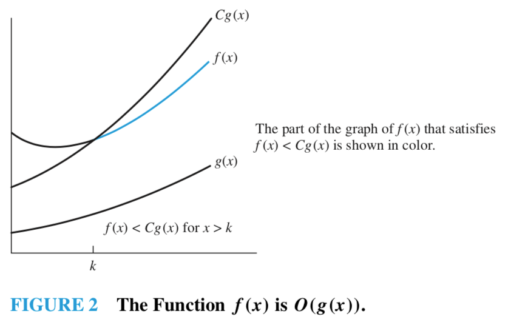
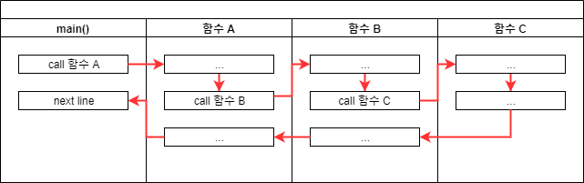
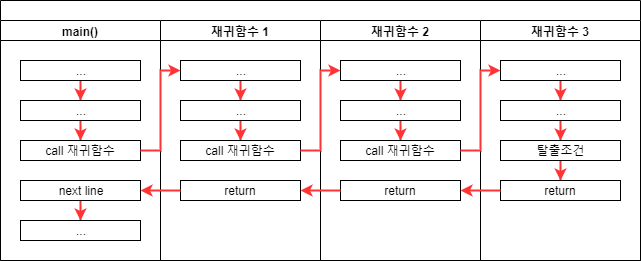
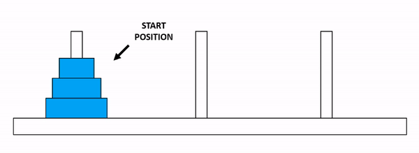
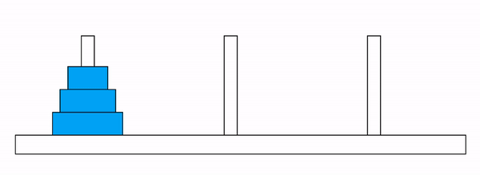

```{r setup, include=FALSE}
library(knitr)

# 슬라이드는 폭이 좁다. 출력 폭을 46자로 접는다.
options(linewidth = 46, width = 46)
hook_output <- knitr::knit_hooks$get("output")
knit_hooks$set(output = function(x, options) {
  if (!is.null(n <- options$linewidth)) {
    x <- knitr:::split_lines(x)
    if (any(nchar(x) > n)) x <- strwrap(x, width = n)
    x <- paste(x, collapse = "\n")
  }
  hook_output(x, options)
})
```

::: {.notes}
오늘은 8장 알고리즘입니다. 시작하기 전에 한 가지 정해 두고 갑시다.

이 시간의 목표는 정렬 알고리즘 네 가지를 외우는 것이 아닙니다. 여러분이 앞으로 쓰게 될
코드는 대부분 여러분이 처음부터 짜는 코드가 아닐 겁니다. 검색해서 찾거나, AI에게 받거나,
남이 쓴 걸 가져다 쓰겠지요. 그때 필요한 건 "이 코드가 맞나" 와 "이 코드가 감당할 수 있나"
두 가지를 판단하는 능력입니다. 오늘 그 두 가지를 다룹니다.

한 시간 반 기준으로, 앞의 40분이 비용 이야기, 뒤의 50분이 검증 이야기입니다.
:::


## 이 수업에서 다루는 것 {.smaller}

::: {.keypoint}
알고리즘 **암기**가 아니라, 구현의 **정확성**과 **수행 시간·메모리 요구량**을 판단하는 능력
:::

<br>

| | 절 | 내용 |
|:--|:--|:--|
| 1 | 알고리즘과 계산 비용 | 수행 시간·메모리, 빅오 표기법 |
| 2 | 재귀 | 종료 조건, 계승, 하노이 탑 |
| 3 | 탐색 알고리즘 | 선형·이진 탐색, 구현의 정확성 검증 |
| 4 | 정렬 알고리즘 | 버블 정렬, 병합 정렬 |
| 5 | 뉴턴-랩슨 알고리즘 | 점화식, 초기값 의존성 |
| 6 | AI와 함께 | 생성 코드의 검증 |

: {tbl-colwidths="[6,32,62]"}

::: {.notes}
전체 지도를 먼저 보겠습니다.

1절과 2절은 도구를 만드는 시간입니다. 비용을 재는 언어, 그러니까 빅오 표기법을 배우고,
재귀라는 사고 방식을 익힙니다.

3절부터 5절까지가 그 도구를 쓰는 시간입니다. 탐색, 정렬, 수치 계산 세 가지 영역에서
같은 질문을 반복합니다. "이 구현이 맞는가", "이 구현이 얼마나 드는가."

6절은 그 질문을 AI가 만들어 준 코드에 던지는 시간입니다. 사실 3절에서 하는 일과
6절에서 하는 일이 똑같습니다. 사람이 쓴 코드냐 기계가 쓴 코드냐만 다릅니다.

표에서 3절과 6절을 짚으면서: 오늘 가장 중요한 두 절이 여기입니다.
:::


# 1 · 알고리즘과 계산 비용 {.section-title background-color="#F3EEE5"}

::: {.columns}
::: {.column width="54%"}
**비용을 재는 언어**를 만드는 절

같은 결과를 내는 코드가 왜 다른 값을 요구하는지,
그 차이를 무엇으로 재는지 정한다
:::
::: {.column width="46%"}
[이 절에서]{.label}

- 알고리즘의 다섯 조건
- 비용 = 수행 시간 + 메모리
- 시간 복잡도 · 공간 복잡도
- 빅오 표기법과 세 규칙
- 차수별 연산 횟수 비교
:::
:::

::: {.keypoint .teal}
**이 절이 답하는 질문** — 같은 결과를 내는 두 코드 중 **어느 쪽을 골라야 하는가**?
:::

::: {.notes}
첫 번째 절입니다. 비용이라는 말을 정확하게 정의하는 것부터 시작하겠습니다.
:::


## 알고리즘이라 부르려면 {.smaller}

::: {.callout-note}
**알고리즘(algorithm)** — 주어진 문제를 해결하기 위해 정해진 일련의 절차를 단계적으로 표현한 것
:::

::: {.columns}
::: {.column width="52%"}
- **명확성** — 각 단계가 모호하지 않음
- **유일성** — 다음 단계가 하나로 결정됨
- **입력과 출력** — 정의된 입력을 받아 결과 산출
- **유한성** — 유한한 단계 뒤 반드시 종료
- **일반성** — 정의된 입력 **전체**에 대해 동작
:::
::: {.column width="48%"}
::: {.keypoint}
실제 구현에서 가장 자주 깨지는 조건 — **유한성**, **일반성**

"내 예제에서 동작" ≠ "정의된 입력 전체에서 동작"
:::
:::
:::

::: {.columns}
::: {.column width="50%"}
[유한성 위반 · 오늘 2절]{.label .label-note}

```r
recursive_sum <- function(n) {
  if (n == 1) return(n)     # n = 0 이면?
  n + recursive_sum(n - 1)
}
```

종료 조건을 **지나쳐 내려가** 멈추지 않음
:::
::: {.column width="50%"}
[일반성 위반 · 오늘 3절]{.label .label-note}

```r
rbinary_search <- function(target, ovec, minL, maxL) {
  if (maxL <= minL) return(NA_integer_)   # 원소 1개면?
  ...
}
```

남은 원소를 **보지 않고** 탐색 종료 → 40% 실패
:::
:::

::: {.notes}
알고리즘의 조건 다섯 가지입니다. 교과서마다 표현은 조금씩 다릅니다만, 대체로 이렇습니다.

앞의 세 개는 사실 당연한 이야기입니다. 애매하지 않아야 하고, 다음에 뭘 할지 정해져야 하고,
입력을 받아 출력을 내야 한다. 여기까지는 별로 어길 일이 없습니다.

문제는 뒤의 두 개입니다. 오른쪽 상자를 보세요.

유한성. 반드시 멈춰야 한다. 오늘 재귀를 배울 텐데, 종료 조건 하나 잘못 쓰면 안 멈춥니다.
직접 보여 드리겠습니다.

일반성. 정의된 입력 **전체**에 대해 동작해야 한다. 여기서 '전체'에 강조를 두세요.
여러분이 코드를 짜고 나서 뭘 합니까? 예제 한두 개 돌려 보고 "됐다" 하지요.
그건 그 예제 한두 개에서 됐다는 뜻이지, 전체에서 된다는 뜻이 아닙니다.

오늘 이 문장을 세 번쯤 반복할 겁니다. 지금은 그냥 넘어가고, 3절에서 실제로 보여 드리겠습니다.
:::


## 비용이란 무엇인가 {.smaller}

::: {.keypoint}
이 수업에서 **비용** — 알고리즘이 요구하는 **수행 시간**과 **메모리**
:::

::: {.columns}
::: {.column width="50%"}
[수행 시간]{.label .label-note}

- 재는 단위 — **연산 횟수**
- 사칙연산 · 비교연산 · 반복 · 함수 호출
- 시계로 잰 초는 하드웨어·부하에 따라 변동
- 연산 횟수는 입력이 같으면 **항상 같은 값**
:::
::: {.column width="50%"}
[메모리]{.label .label-slide}

- 재는 단위 — **동시에 확보해야 하는 공간의 크기**
- 변수 · 자료 구조 · 호출 스택 프레임
- 재귀 깊이가 여기에 직접 들어감
:::
:::

::: {.keypoint .teal}
"이 코드가 비싸다" = "**연산 횟수가 많다**" 또는 "**메모리를 많이 잡는다**"<br>
둘 중 어느 쪽인지 항상 구분해서 말할 것
:::

::: {.notes}
용어를 하나 정하고 가겠습니다. 오늘 '비용'이라는 말을 계속 쓸 텐데, 이게 뭘 뜻하는지
명확히 해 두지 않으면 나중에 헷갈립니다.

비용은 두 가지입니다. 수행 시간과 메모리.

수행 시간을 뭘로 잽니까? 초시계로 재면 될 것 같지요. 그런데 그게 문제입니다.
같은 코드도 여러분 노트북에서 재는 것과 제 노트북에서 재는 것이 다르고, 백그라운드에
뭐가 돌고 있느냐에 따라 또 다릅니다. 그래서 우리는 **연산 횟수**를 셉니다.
연산 횟수는 입력이 같으면 언제 어디서 재도 같은 값이 나옵니다.

메모리는 동시에 얼마나 잡고 있어야 하느냐입니다. 재귀를 배울 때 이게 왜 중요한지
바로 나옵니다. 재귀는 호출할 때마다 메모리를 쌓거든요.

맨 아래 상자. 앞으로 "이 코드가 비싸다"고 하면, 여러분은 저한테 되물으셔야 합니다.
"시간이 비싼 건가요, 메모리가 비싼 건가요?" 둘은 다른 문제고, 해결책도 다릅니다.
실제로 오늘 시간을 아끼려고 메모리를 더 쓰는 알고리즘이 나옵니다. 병합 정렬입니다.
:::


## 결과가 같은 두 프로그램

::: {.columns}
::: {.column width="50%"}
[프로그램 1 · 사전 할당]{.label .label-slide}

```{r prealloc, eval=FALSE}
prealloc_vec <- function(n) {
  x <- numeric(n)
  for (i in seq_len(n)) {
    x[i] <- i
  }
  x
}
```
:::
::: {.column width="50%"}
[프로그램 2 · 이어 붙이기]{.label .label-note}

```{r grow, eval=FALSE}
grow_vec <- function(n) {
  x <- NULL
  for (i in seq_len(n)) {
    x <- c(x, i)
  }
  x
}
```
:::
:::

```{r both-defs, echo=FALSE}
prealloc_vec <- function(n) {
  x <- numeric(n)
  for (i in seq_len(n)) x[i] <- i
  x
}
grow_vec <- function(n) {
  x <- NULL
  for (i in seq_len(n)) x <- c(x, i)
  x
}
```

```{r same-result}
identical(prealloc_vec(1000), as.numeric(grow_vec(1000)))
```

::: {.notes}
두 프로그램을 보겠습니다. 둘 다 1부터 n까지 숫자를 담은 벡터를 만듭니다.

왼쪽은 `numeric(n)` 으로 자리를 먼저 다 잡아 놓고 하나씩 채웁니다.
오른쪽은 빈 걸로 시작해서 `c(x, i)` 로 하나씩 붙입니다.

여러분이 R을 처음 배우면 오른쪽처럼 씁니다. 자연스럽거든요. 저도 그랬습니다.

맨 아래 `identical` 이 TRUE 나왔지요. 결과는 똑같습니다. 한 글자도 안 다릅니다.

그러면 두 코드는 같은 코드입니까? 다음 슬라이드에서 물어보겠습니다.
:::


## 예측해 보자 {.predict background-color="#1F6F7A"}

`n` 이 5만일 때 두 프로그램의 실행 시간 차이는?

::: {.columns}
::: {.column width="50%"}
```r
prealloc_vec <- function(n) {
  x <- numeric(n)               # 자리를 먼저 확보
  for (i in seq_len(n)) x[i] <- i
  x
}
```
:::
::: {.column width="50%"}
```r
grow_vec <- function(n) {
  x <- NULL
  for (i in seq_len(n)) x <- c(x, i)   # 이어 붙이기
  x
}
```
:::
:::

::: {.options}
::: {}
**A** 비슷한 수준
:::
::: {}
**B** 두 배 정도
:::
::: {}
**C** 그보다 큼
:::
:::

::: {.why}
실행 전에 답을 적을 것 — 틀린 예측이 학습의 출발점
:::

::: {.notes}
자, 예측하는 시간입니다. 오늘 이 파란 화면이 여러 번 나옵니다. 이 화면이 나오면
**손을 멈추고 답을 적으세요.** 머릿속으로 생각만 하지 말고 적으세요.

왜 적으라고 하냐면, 적어야 틀렸다는 걸 알 수 있기 때문입니다. 머릿속으로만 생각하면
결과를 보고 나서 "아 나도 그렇게 생각했어" 하게 됩니다. 사람 기억이 그렇게 생겼습니다.

n이 5만입니다. A, B, C 중에 골라서 적으세요. 30초 드리겠습니다.

(30초 후) 손 들어 볼까요. A라고 생각하신 분? B? C?

좋습니다. 넘어가겠습니다.
:::


## 실행과 대조 {.smaller}

```{r cost-time}
#| output-location: fragment
n <- 50000
data.frame(
  방식 = c("사전 할당", "이어 붙이기"),
  초 = c(system.time(prealloc_vec(n))[["elapsed"]],
         system.time(grow_vec(n))[["elapsed"]])
)
```

. . .

::: {.keypoint}
`x <- c(x, i)` — 반복마다 **길이가 1 늘어난 새 벡터를 할당하고 기존 원소 전부 복사**

$i$ 번째 반복에서 $i$ 개 복사 → 전체 복사량 $1 + 2 + \cdots + n = n(n-1)/2$ 에 비례

사전 할당 — 이미 확보된 메모리에 값 대입, 반복당 비용 일정
:::

::: {.notes}
(클릭) 결과입니다.

몇 배 차이입니까? 사전 할당은 0에 가깝고, 이어 붙이기는 2초 가까이 나옵니다.
B를 고르신 분들은 크게 빗나가셨습니다. 저도 처음에 이걸 재 보고 놀랐습니다.

(클릭) 왜 그런지 보겠습니다.

R에서 `c(x, i)` 는 x에 i를 덧붙이는 게 아닙니다. **길이가 하나 더 긴 새 벡터를 만들어서,
기존 원소를 전부 복사해 넣고, 마지막에 i를 넣는** 겁니다. 매번요.

그러면 백 번째 반복에서는 99개를 복사하고, 천 번째 반복에서는 999개를 복사합니다.
다 더하면 n의 제곱에 비례하는 양이 됩니다. 오만 개면 12억 5천만 번쯤 복사한 셈입니다.

반면 왼쪽은 자리를 미리 잡아 놨으니까 그냥 그 자리에 값을 씁니다. 반복마다 한 번씩.

여기서 오늘의 첫 번째 교훈. 결과가 같다고 코드가 같은 게 아닙니다.
그리고 이 차이는 n이 작을 때는 안 보입니다. n이 천이면 둘 다 눈 깜짝할 사이입니다.
실제 데이터 크기에서 갑자기 튀어나옵니다.
:::


## 시간 복잡도와 공간 복잡도 {.smaller}

::: {.columns}
::: {.column width="50%"}
::: {.callout-note}
**시간 복잡도(time complexity)**

종료할 때까지 수행하는 **연산 횟수**

계수 대상 — 사칙연산, 비교연산, 반복, 함수 호출
:::
:::
::: {.column width="50%"}
::: {.callout-note}
**공간 복잡도(space complexity)**

종료할 때까지 필요한 **메모리 크기**

대상 — 변수 개수, 자료 구조, 스택 프레임
:::
:::
:::

| | 수행 시간 | 메모리 |
|:--|:--|:--|
| 프로그램 1 · 사전 할당 | $n$ 에 비례 | 증가 없음 |
| 프로그램 2 · 이어 붙이기 | $n^2$ 에 비례 | $n$ 까지 증가 |

: {tbl-colwidths="[34,33,33]"}

::: {.keypoint}
평가 기준은 **최악의 경우(worst case)** — 최선은 특정 입력에서만 성립, 평균은 입력 분포 가정 필요,
최악은 임의의 입력에 항상 성립하는 **상한**
:::

::: {.notes}
방금 본 걸 용어로 정리하겠습니다.

시간 복잡도, 공간 복잡도. 이름은 거창한데 방금 우리가 한 게 그겁니다.
연산을 몇 번 하느냐, 메모리를 얼마나 잡느냐.

가운데 표를 보세요. 프로그램 1은 시간이 n에 비례하고 메모리는 안 늘어납니다.
프로그램 2는 시간이 n 제곱에 비례하고 메모리도 n까지 늘어납니다.
**둘 다에서 진 겁니다.** 시간도 지고 메모리도 지고.

맨 아래 상자. 왜 최악의 경우로 재느냐. 학생들이 자주 묻는 질문입니다.

최선의 경우로 재면 어떻게 됩니까? "운 좋으면 한 번에 찾습니다" 이건 약속이 아니지요.
평균으로 재면? 평균을 내려면 입력이 어떻게 분포하는지 알아야 하는데, 보통 모릅니다.
최악의 경우는 다릅니다. 어떤 입력이 들어와도 이것보다 나빠지지는 않는다. 이건 보장입니다.

공학에서는 보장할 수 있는 걸 씁니다.
:::


## 빅오 표기법 {.smaller}

::: {.columns}
::: {.column width="54%"}
::: {.callout-note}
$x \geq k$ 인 모든 $x$ 에 대해 $|f(x)| \leq C|g(x)|$ 를 만족하는 상수 $k$, $C$ 가 존재
$\Rightarrow$ $f(x) = \mathcal{O}(g(x))$
:::

- $n$ 이 충분히 커지면 **저차항은 영향력 상실**
- 증가율이 가장 큰 항만 남음
- $g$ 는 $f$ 의 **점근적 상한**
:::
::: {.column width="46%"}
{width="100%"}
:::
:::

::: {.notes}
빅오 표기법입니다. 정의부터 보시죠.

수식이 좀 무섭게 생겼는데, 오른쪽 그림을 보면 한 줄로 정리됩니다.

파란 선이 f(x), 우리가 재려는 알고리즘의 실제 연산 횟수입니다.
빨간 선이 Cg(x), 우리가 고른 기준 함수에 상수를 곱한 겁니다.

x축의 k 지점을 보세요. 그 지점을 넘어가면 빨간 선이 파란 선보다 계속 위에 있습니다.
한 번도 안 내려옵니다. 이럴 때 "f는 g의 빅오다" 라고 합니다.

즉 g는 천장입니다. 아무리 나빠도 이 천장은 안 뚫는다.

여기서 중요한 게 "x가 k보다 클 때" 라는 조건입니다. 작을 때는 상관없어요.
n이 10일 때 뭐가 빠른지는 아무도 신경 안 씁니다. n이 백만일 때가 문제지요.
그래서 빅오는 **충분히 커졌을 때의 증가 양상**만 봅니다. 저차항을 버리는 이유가 이겁니다.
:::


## 실제로 쓰는 것은 세 규칙 {.smaller}

::: {.columns}
::: {.column width="33%"}
[규칙 1 · 계수 법칙]{.label .label-note}

계수 소거

$\mathcal{O}(5n) = \mathcal{O}(n)$

반복이 $5n$ 번이든 $100n$ 번이든 모두 $\mathcal{O}(n)$
:::
::: {.column width="33%"}
[규칙 2 · 합의 법칙]{.label .label-note}

순차 실행 시 증가율이 큰 쪽만 잔존

$\mathcal{O}(n) + \mathcal{O}(n^2) = \mathcal{O}(n^2)$

단, 입력 변수가 다르면 $\mathcal{O}(n + m)$
:::
::: {.column width="33%"}
[규칙 3 · 곱의 법칙]{.label .label-note}

반복문 중첩 시 반복 횟수 곱

$\mathcal{O}(n) \times \mathcal{O}(n) = \mathcal{O}(n^2)$
:::
:::

::: {.columns}
::: {.column width="62%"}
```r
case1 <- function(n) {              # (가)
  s <- 0; for (i in seq_len(n)) s <- s + i; s
}
case2 <- function(n) {              # (나)
  s <- 0; for (i in seq_len(5 * n)) s <- s + i; s
}
case3 <- function(n, m) {           # (다)
  s <- 0
  for (i in seq_len(n)) s <- s + i
  for (j in seq_len(m)) s <- s + j
  s
}
case4 <- function(n) {              # (라)
  s <- 0
  for (i in seq_len(n)) for (j in seq_len(n)) s <- s + j
  s
}
```
:::
::: {.column width="38%"}
::: {.keypoint}
**(가)** $\mathcal{O}(n)$

**(나)** $\mathcal{O}(5n) = \mathcal{O}(n)$ — 규칙 1

**(다)** $\mathcal{O}(n + m)$ — 규칙 2의 단서

**(라)** $\mathcal{O}(n^2)$ — 규칙 3
:::

코드 읽을 때 쓰는 것은 정의가 아니라 이 세 규칙 — **반복이 몇 번 도는지만** 세면 됨
:::
:::

::: {.notes}
정의는 시험 문제 풀 때 쓰고, 실제로 코드 볼 때 쓰는 건 이 세 개입니다.

규칙 1. 계수는 버립니다. 반복을 5n번 돌든 100n번 돌든 O(n)입니다.
왜냐, n이 무한대로 가면 상수 100은 의미가 없거든요. 100 곱하기 무한대도 무한대입니다.

규칙 2. 두 부분이 이어서 실행되면 큰 쪽만 남습니다. for문 하나 돌고 그다음에
이중 for문 돌면, 앞의 for문은 없는 셈 칩니다. 큰 쪽에 묻히니까요.
단서가 하나 있습니다. 입력 변수가 다르면 못 합칩니다. n짜리 반복 다음에 m짜리 반복이면
O(n + m)이고, 이건 더 못 줄입니다. n과 m 중 뭐가 큰지 모르니까요.

규칙 3. 중첩되면 곱합니다. 이게 이중 for문이 왜 위험한지 설명해 줍니다.

세 개 다 외우실 필요 없습니다. 코드 보고 "반복이 몇 번 도나" 세는 습관만 들이면 됩니다.
:::


## 차수가 다르면 무엇이 달라지는가 {.smaller}

```{r big-o-table, echo=FALSE}
n <- c(10, 100, 1000, 1e6)
fmt <- function(x) format(x, big.mark = ",", scientific = FALSE)
tab <- data.frame(
  n = fmt(n),
  o1 = c("1", "1", "1", "1"),
  ologn = c("3", "7", "10", "20"),
  on = fmt(n),
  onlogn = fmt(round(n * log2(n))),
  on2 = c(fmt(n[1:3]^2), "1e+12"),
  o2n = c("1,024", "1.3e+30", "1.1e+301", "—")
)
names(tab) <- c("n", "O(1)", "O(log n)", "O(n)", "O(n log n)", "O(n^2)", "O(2^n)")
kable(tab, align = rep("r", 7))
```

| 차수 | 오늘 만나는 알고리즘 |
|:--|:--|
| $\mathcal{O}(1)$ | 벡터 인덱싱 `x[i]`, 사전 할당한 자리에 대입 |
| $\mathcal{O}(\log n)$ | **이진 탐색** |
| $\mathcal{O}(n)$ | **선형 탐색**, 벡터 한 번 순회 |
| $\mathcal{O}(n\log n)$ | **병합 정렬**, R 의 `sort()` |
| $\mathcal{O}(n^2)$ | **버블 정렬**, `c(x, i)` 로 벡터 이어 붙이기 |
| $\mathcal{O}(2^n)$ | **하노이 탑** |

: {tbl-colwidths="[22,78]"}

::: {.columns}
::: {.column width="34%"}
::: {.keypoint .teal}
$n = 1{,}000$ — $\mathcal{O}(n)$ 대 $\mathcal{O}(n^2)$ **천 배**
:::
:::
::: {.column width="34%"}
::: {.keypoint .teal}
$n = 10^6$ · 초당 10억 연산 가정<br>
$\mathcal{O}(n\log n)$ **0.02초** 대 $\mathcal{O}(n^2)$ **약 17분**
:::
:::
::: {.column width="32%"}
::: {.keypoint}
**차수가 다르면 하드웨어 성능 향상으로 해결되지 않음**
:::
:::
:::

::: {.notes}
표를 보겠습니다. 가로가 복잡도 차수, 세로가 입력 크기입니다.

n이 천일 때 줄을 따라가 보세요. O(n)은 천 번, O(n²)은 백만 번입니다. 천 배 차이입니다.

맨 오른쪽 O(2ⁿ) 보이시죠. n이 백일 때 1.3 곱하기 10의 30승입니다.
이게 얼마나 큰 수냐면, 관측 가능한 우주에 있는 원자 수가 10의 80승 정도 됩니다.
n이 천이면 10의 301승. 우주 원자 수를 아득히 넘어갑니다.

오른쪽 아래 상자가 오늘 이 절의 결론입니다.

차수가 다르면 컴퓨터를 바꿔서 해결할 수 있는 문제가 아닙니다.
컴퓨터가 백 배 빨라져도 O(n²)은 여전히 O(n²)입니다. 상수가 백분의 일로 줄 뿐이고,
규칙 1에 따라 상수는 버린다고 했지요. n을 조금만 키우면 도로아미타불입니다.

**알고리즘을 바꿔야 합니다.** 이게 이 과목이 존재하는 이유입니다.
:::


## 차수의 증가 양상 {.smaller}

```{r complexity-plot, echo=FALSE, fig.width=11, fig.height=4.6}
op <- par(mar = c(4.2, 4.4, 0.6, 0.6))
nn <- seq(1, 40, by = 0.5)
plot(range(nn), c(0, 200), type = "n", xlab = "n (입력 크기)",
     ylab = "연산 횟수", bty = "l", cex.lab = 1.25, cex.axis = 1.1)
lines(nn, rep(1, length(nn)), lwd = 3, col = "grey45")
lines(nn, log2(nn), lwd = 3, col = "#1F6F7A")
lines(nn, nn, lwd = 3, col = "#2E7D32")
lines(nn, nn * log2(nn), lwd = 3, col = "#B58900")
lines(nn, nn^2, lwd = 3, col = "#A64B32")
text(40, 1, expression(O(1)), pos = 2, offset = 0.3, col = "grey45", cex = 1.3)
text(40, log2(40), expression(O(log~n)), pos = 3, col = "#1F6F7A", cex = 1.3)
text(40, 40, expression(O(n)), pos = 4, offset = -1.8, col = "#2E7D32", cex = 1.3)
text(33, 33 * log2(33), expression(O(n~log~n)), pos = 2, col = "#B58900", cex = 1.3)
text(14, 190, expression(O(n^2)), pos = 4, col = "#A64B32", cex = 1.3)
par(op)
```

::: {.keypoint .teal}
$n$ 이 **40**밖에 안 되는 구간 — 이미 $\mathcal{O}(n^2)$ 만 화면 밖으로 나감
:::

::: {.notes}
같은 이야기를 그림으로 보겠습니다. 가로가 입력 크기, 세로가 연산 횟수입니다.

회색 O(1)은 바닥에 붙어 있습니다. 입력이 아무리 커져도 일정합니다.
청록색 O(log n)은 거의 안 올라갑니다. 40에서도 5, 6 정도입니다.
초록색 O(n)은 직선으로 올라갑니다.
노란색 O(n log n)은 직선보다 조금 가파릅니다.
그리고 빨간색 O(n²). 저건 이미 화면 밖으로 나갔습니다.

가로축을 보세요. **n이 40입니다.** 겨우 40에서 이렇습니다.
실제 데이터는 만 개, 십만 개, 백만 개짜리를 다룹니다.

여러분이 앞으로 통계 분석하면서 만나는 데이터가 40개짜리는 없겠지요.
그러니까 이 그림의 오른쪽 끝을 백만까지 늘렸다고 상상해 보세요.
빨간 선은 그냥 세로선처럼 보일 겁니다.

여기까지가 1절입니다. 잠깐 쉬었다가 재귀로 넘어가겠습니다.
:::


# 2 · 재귀 {.section-title background-color="#F3EEE5"}

::: {.columns}
::: {.column width="54%"}
문제를 **같은 모양의 작은 문제**로 환원하는 사고 방식

종료 조건 하나가 전체를 좌우한다
:::
::: {.column width="46%"}
[이 절에서]{.label}

- 함수 호출과 재귀 호출
- 종료 조건 + 재귀 단계
- 종료 조건의 한계 — 경계 바깥
- 재귀의 메모리 비용
- 하노이 탑
:::
:::

::: {.keypoint .teal}
**이 절이 답하는 질문** — 이 재귀는 **반드시 멈추는가**?
:::

::: {.notes}
2절 재귀입니다. 여기서는 도구가 하나 더 늘어납니다.
:::


## 함수 호출과 재귀 호출 {.smaller}

::: {.columns}
::: {.column width="50%"}
[일반 함수 호출]{.label .label-note}

{width="100%"}

호출 지점으로 **복귀**
:::
::: {.column width="50%"}
[재귀 호출]{.label .label-slide}

{width="100%"}

복귀 지점이 **자기 자신**
:::
:::

::: {.keypoint}
호출마다 **호출 스택(call stack)** 에 새 프레임 누적 → 중단 조건 없으면 종료되지 않음
:::

::: {.notes}
두 그림을 나란히 놓았습니다. 출처는 10bun.tv 입니다.

왼쪽이 여러분이 아는 함수 호출입니다. main이 A를 부르고, A가 B를 부르고, B가 C를 부르고.
C가 끝나면 B로 돌아오고, B가 끝나면 A로 돌아오고, A가 끝나면 main으로 돌아옵니다.
불렀던 자리로 되돌아오지요.

오른쪽이 재귀입니다. 구조는 똑같습니다. 되돌아옵니다.
다른 건 하나뿐입니다. **되돌아올 자리가 자기 자신**이라는 것.

아래 상자가 중요합니다. 함수를 부를 때마다 컴퓨터는 "어디로 돌아가야 하는지",
"지역 변수가 뭐였는지" 를 어딘가에 적어 둬야 합니다. 그 자리가 호출 스택입니다.

재귀는 이걸 계속 쌓습니다. 열 번 부르면 열 층, 천 번 부르면 천 층.
그래서 두 가지 문제가 생깁니다. 하나는 안 멈추면 무한히 쌓인다는 것,
또 하나는 멈추더라도 메모리를 그만큼 쓴다는 것. 둘 다 오늘 직접 보겠습니다.
:::


## 재귀 함수의 구성 {.smaller}

::: {.columns}
::: {.column width="46%"}
1. **종료 조건(base case)**<br>
   분할하지 않고 결과 직접 반환
2. **재귀 단계(recursive step)**<br>
   문제 크기를 줄여 자기 자신 호출

```{r recursive-sum}
recursive_sum <- function(n) {
  if (n == 1) return(n)     # 종료 조건
  n + recursive_sum(n - 1)  # 재귀 단계
}
recursive_sum(3)
```
:::
::: {.column width="54%"}
{width="100%"}
:::
:::

::: {.notes}
재귀 함수는 무조건 두 부분입니다. 이것만 기억하시면 됩니다.

종료 조건, 그리고 재귀 단계.

코드를 보세요. `if (n == 1) return(n)` 이 종료 조건입니다. 더 안 쪼개고 답을 바로 줍니다.
그 아래 `n + recursive_sum(n - 1)` 이 재귀 단계입니다. n을 하나 줄여서 자기를 부릅니다.

오른쪽 그림으로 따라가 보겠습니다.

`recursive_sum(3)` 을 부릅니다. n이 1이 아니니까 `recursive_sum(2)` 를 부릅니다.
2도 1이 아니니까 `recursive_sum(1)` 을 부릅니다.
1은 종료 조건에 걸립니다. 1을 반환합니다.

이제 거슬러 올라옵니다. 2 더하기 1은 3. 3 더하기 3은 6.
최종적으로 6이 나옵니다. 1 더하기 2 더하기 3이 6 맞지요.

여기서 화살표 방향을 잘 보세요. 내려갈 때는 쪼개기만 하고, 실제 계산은 **올라올 때**
일어납니다. 재귀가 헷갈리는 이유가 이겁니다. 내려가는 흐름과 올라오는 흐름 두 개가
동시에 있어서요.
:::


## 예측해 보자 {.predict background-color="#1F6F7A"}

`recursive_sum(0)` 의 반환값은?

::: {.columns}
::: {.column width="52%"}
```r
recursive_sum <- function(n) {
  if (n == 1) return(n)     # 종료 조건
  n + recursive_sum(n - 1)  # 재귀 단계
}

recursive_sum(3)   # 6  — 정상 동작
```
:::
::: {.column width="48%"}
::: {.options}
::: {}
**A** `0`
:::
::: {}
**B** `1`
:::
::: {}
**C** 오류
:::
:::
:::
:::

::: {.why}
방금 확인 — 이 함수는 정상 동작<br>
그런데 "정의된 입력 **전체**"에 대해서도 그러한가?<br>
힌트 — 알고리즘의 다섯 조건 중 **유한성**
:::

::: {.notes}
다시 예측 시간입니다. 적으세요.

방금 `recursive_sum(3)` 이 6을 잘 내놨습니다. 잘 동작하는 함수처럼 보입니다.

그런데 0을 넣으면요?

힌트를 하나 드리겠습니다. 아까 알고리즘의 조건 다섯 개 중에 뭐가 자주 깨진다고 했지요?
유한성하고 일반성. 그 말을 지금 하는 이유가 있겠지요.

30초 드리겠습니다. A, B, C.
:::


## 종료 조건의 한계 {.smaller}

```{r rec-zero}
#| output-location: fragment
tryCatch(recursive_sum(0),
         error = function(e) cat("오류:", conditionMessage(e), "\n"))
```

. . .

- `n` 이 0이면 `n == 1` 은 **결코 참이 되지 않음**
- 인수가 `0, -1, -2, ...` 로 계속 감소 → R 의 중첩 한계에 도달해서야 중단
- 올바른 종료 조건 — "`n` 이 **1 이하**일 때"

. . .

```{r rec-fixed}
recursive_sum2 <- function(n) {
  if (n <= 1) return(n)          # 경계 조건을 포함한다
  n + recursive_sum2(n - 1)
}
c(recursive_sum2(0), recursive_sum2(1), recursive_sum2(100))
```

::: {.keypoint}
결함은 입력이 **커질 때**만 드러나지 않음 — **정의역의 경계 바로 바깥**에서도 드러남
:::

::: {.notes}
(클릭) 답은 C, 오류입니다.

메시지를 읽어 보세요. "evaluation nested too deeply", 너무 깊이 중첩됐다.
무한 재귀에 빠졌다는 뜻입니다.

(클릭) 왜 그럴까요.

n이 0입니다. 종료 조건이 `n == 1` 이지요. 0은 1이 아닙니다. 그래서 `recursive_sum(-1)`을 부릅니다.
-1도 1이 아니지요. `recursive_sum(-2)`. -2도 아니지요...

**영원히 1을 못 만납니다.** 1을 지나쳐서 내려가 버렸으니까요.
그러다 R이 "더는 못 쌓겠다" 하고 뻗는 겁니다.

고치는 건 간단합니다. `n == 1` 을 `n <= 1` 로 바꾸면 됩니다. 등호 하나 추가.
(클릭) 이렇게요. 0, 1, 100 다 잘 나옵니다.

맨 아래 상자. 이게 오늘 두 번째 교훈입니다.

우리는 보통 "입력이 커지면 문제가 생긴다" 고 생각합니다. 그것도 맞습니다.
그런데 지금 본 건 반대입니다. **입력이 경계 바로 바깥으로 나갔을 때** 터졌습니다.
0은 큰 수가 아니지요. 오히려 작습니다.

여러분이 함수를 짜면 항상 물어보세요. "정의역의 끝에서 어떻게 되나?"
빈 벡터, 길이 1, 0, 음수. 이 네 가지는 습관적으로 넣어 보세요.
:::


## 재귀의 비용 {.smaller}

```{r rec-depth}
#| output-location: fragment
recursive_sum2(1000)                     # 정상적으로 동작한다

tryCatch(recursive_sum2(5000),           # 중첩 한계
         error = function(e) cat("오류:", conditionMessage(e), "\n"))
```

. . .

::: {.columns}
::: {.column width="50%"}
[재귀]{.label .label-note}

- 공간 복잡도 $\mathcal{O}(n)$ — 호출마다 스택 프레임 누적
- R 의 중첩 깊이 제한 — `options(expressions)`, 기본 5000
- 읽기 쉬움
:::
::: {.column width="50%"}
[반복문]{.label .label-slide}

- 공간 복잡도 $\mathcal{O}(1)$
- 깊이 제한 없음
- 상대적으로 읽기 어려움
:::
:::

::: {.keypoint}
재귀 — **가독성을 얻는 대신 메모리 소비**<br>
재귀로 먼저 이해하고, 필요하면 반복문으로 변환하는 순서가 안전
:::

::: {.notes}
아까 메모리 이야기 했지요. 그걸 확인하겠습니다.

(클릭) 천까지는 잘 됩니다. 500500 나왔네요.
그런데 오천에서 터집니다. 같은 오류입니다. 너무 깊이 중첩됐다.

이번엔 무한 재귀가 아닙니다. 종료 조건 제대로 고쳤잖아요.
그냥 **깊이가 오천이라 메모리가 모자란** 겁니다.

R은 중첩 깊이를 기본 5000으로 제한합니다. `options(expressions)` 로 늘릴 수는 있는데,
늘려도 결국 한계는 있습니다.

(클릭) 정리하면 이렇습니다.

재귀는 공간 복잡도가 O(n)입니다. n번 부르면 n층 쌓이니까요.
같은 계산을 for문으로 쓰면 O(1)입니다. 변수 하나만 있으면 되거든요. 깊이 제한도 없고요.

그러면 재귀를 왜 씁니까? **읽기 쉬워서**입니다. 그게 다입니다.
하노이 탑을 잠시 후에 볼 텐데, 그건 for문으로 짜라고 하면 정말 어렵습니다.

그래서 제 권고는 이렇습니다. 재귀로 먼저 이해하세요. 문제 구조가 보입니다.
그다음에 실전 코드가 필요하면 반복문으로 옮기세요. 순서가 중요합니다.
:::


## 하노이 탑 {.smaller}

::: {.columns}
::: {.column width="50%"}
{width="100%"}

**규칙**

- 한 번에 원판 하나만 이동
- 큰 원판을 작은 원판 위에 올릴 수 없음
:::
::: {.column width="50%"}
**해법 — 한 단계 작은 동일 문제로 환원**

1. 위쪽 $n-1$ 개를 A $\rightarrow$ B<br>
   <span class="tiny">(크기만 하나 작은 동일 문제)</span>
2. 가장 큰 원판을 A $\rightarrow$ C
3. B 의 $n-1$ 개를 B $\rightarrow$ C<br>
   <span class="tiny">(역시 동일 문제)</span>

{width="100%"}
:::
:::

::: {.notes}
하노이 탑입니다. 재귀 없이는 설명하기 어려운 대표적인 문제예요.

왼쪽 애니메이션을 보세요. 기둥이 세 개 있고, 원판이 크기 순으로 쌓여 있습니다.
이걸 전부 오른쪽 기둥으로 옮기는 게 목표입니다.

규칙은 두 개. 한 번에 하나씩만 옮긴다. 큰 걸 작은 것 위에 올리면 안 된다.

자, 이걸 어떻게 풉니까? 원판이 세 개면 손으로 해 볼 만합니다.
근데 열 개면요? 순서를 어떻게 정합니까?

여기서 재귀적으로 생각하는 게 뭔지 보여 드리겠습니다.

**전부 다 옮기는 방법을 생각하지 마세요.** 대신 이렇게 물어보세요.
"맨 아래 제일 큰 원판을 C로 옮기려면 그 직전에 뭐가 되어 있어야 하지?"

답이 나옵니다. 위에 있는 n-1개가 전부 B에 가 있어야 합니다. 그래야 큰 걸 옮기지요.

그러면 세 단계입니다. n-1개를 B로. 큰 거 하나를 C로. B의 n-1개를 C로.

그런데 1번과 3번이 뭡니까? **똑같은 문제**입니다. 크기만 하나 작아요.
이게 재귀입니다. 문제를 한 겹 벗겨서 같은 모양의 작은 문제로 만드는 것.

오른쪽 아래 애니메이션이 원판 세 개짜리 정답입니다. 일곱 번 움직이지요.
:::


## 하노이 탑 구현 {.smaller}

```{r hanoi}
move_hanoi <- function(k, from, to, via) {
  if (k == 1) {
    cat(sprintf("원판 1: %s -> %s\n", from, to))
  } else {
    move_hanoi(k - 1, from, via, to)                    # 1. 위쪽 n-1 개
    cat(sprintf("원판 %d: %s -> %s\n", k, from, to))     # 2. 가장 큰 원판
    move_hanoi(k - 1, via, to, from)                    # 3. 나머지 n-1 개
  }
}
move_hanoi(3, "A", "C", "B")
```

::: {.keypoint}
이동 횟수 $2^n - 1$ — 호출이 매 단계 두 개로 분기 → $\mathcal{O}(2^n)$<br>
원판 64개 = 1초에 하나씩 옮겨도 **5천억 년** 초과
:::

::: {.notes}
코드가 몇 줄입니까? 실질적으로 다섯 줄입니다.

주석을 보세요. 방금 말한 세 단계가 그대로 세 줄입니다.
1번 줄이 위쪽 n-1개, 2번 줄이 가장 큰 원판, 3번 줄이 나머지 n-1개.

인자를 잘 보세요. 1번에서는 `from, via, to` 순서고 3번에서는 `via, to, from` 입니다.
목적지와 경유지가 바뀝니다. 이게 헷갈리는 부분인데, 그림을 다시 떠올리시면 됩니다.
처음엔 B가 목적지고, 나중엔 B가 출발지지요.

출력을 보세요. 일곱 줄 나왔습니다. 아까 애니메이션과 같습니다.

아래 상자. 원판이 n개면 2의 n승 빼기 1번입니다.
왜냐, 함수가 자기를 **두 번** 부르잖아요. 한 번 내려갈 때마다 두 배로 불어납니다.

전설에서는 원판이 64개라고 합니다. 2의 64승. 1초에 하나씩 옮겨도 5천억 년이 넘습니다.
우주 나이가 138억 년이니까, 우주 나이의 서른 배쯤 걸립니다.

여기서 재미있는 점. 이 알고리즘은 **최선**입니다. 더 빨리 옮기는 방법이 없어요.
알고리즘이 나빠서 오래 걸리는 게 아니라, 문제 자체가 그런 겁니다.
이런 걸 지수 시간 문제라고 합니다.
:::


# 3 · 탐색 알고리즘 {.section-title background-color="#F3EEE5"}

::: {.columns}
::: {.column width="54%"}
**오늘 가장 중요한 절**

차수의 차이가 만드는 실제 격차를 수치로 보고,
"맞는 코드"를 어떻게 확인하는지 배운다
:::
::: {.column width="46%"}
[이 절에서]{.label}

- 선형 탐색 · 이진 탐색
- **구현의 정확성 검증**
- 오류 메시지 없이 틀린 코드
- 두 탐색의 비용 비교
:::
:::

::: {.keypoint .teal}
**이 절이 답하는 질문** — 이 구현이 맞다는 것을 **무엇으로 아는가**?
:::

::: {.notes}
3절입니다. 오늘 가장 중요한 절이라고 처음에 말씀드렸지요. 여기서 검증 이야기가 시작됩니다.
:::


## 선형 탐색과 이진 탐색 {.smaller}

::: {.columns}
::: {.column width="50%"}
[선형 탐색 · $\mathcal{O}(n)$]{.label .label-note}

```{r linear-search}
linear_search <- function(target, vec) {
  for (i in seq_along(vec)) {
    if (vec[i] == target) return(i)
  }
  NA_integer_
}
```

- 첫 원소부터 **순차 비교**
- 정렬 불필요
- 최악의 경우 $n$ 회 비교
:::
::: {.column width="50%"}
[이진 탐색 · $\mathcal{O}(\log n)$]{.label .label-slide}

```{r binary-search}
binary_search <- function(target, ovec) {
  lo <- 1L; hi <- length(ovec)
  while (lo <= hi) {
    mid <- (lo + hi) %/% 2L
    if (ovec[mid] == target) return(mid)
    if (ovec[mid] > target) hi <- mid - 1L
    else lo <- mid + 1L
  }
  NA_integer_
}
```

- 중앙값과 비교 후 **절반 제외**
- **정렬 필수**
:::
:::

{width="52%"}

::: {.notes}
탐색 알고리즘 두 개입니다.

왼쪽 선형 탐색. 앞에서부터 하나씩 봅니다. 단순하지요. 정렬 안 되어 있어도 씁니다.
최악의 경우가 언제입니까? 찾는 게 맨 뒤에 있거나, 아예 없을 때. n번 다 봐야 합니다.

오른쪽 이진 탐색. 가운데를 먼저 봅니다. 찾는 값이 그보다 작으면 오른쪽 절반은
아예 안 봅니다. 크면 왼쪽 절반을 버립니다. 한 번 비교할 때마다 후보가 반으로 줄어요.

대신 조건이 있습니다. **정렬되어 있어야 합니다.** 안 그러면 "가운데보다 작으니 왼쪽"
이라는 판단 자체가 성립을 안 하지요.

아래 애니메이션을 보세요. 위가 이진 탐색, 아래가 선형 탐색입니다.
같은 배열에서 같은 값을 찾는데 속도가 확연히 다르지요.

이진 탐색이 왜 log n이냐. n개에서 시작해서 n/2, n/4, n/8... 이렇게 줄어듭니다.
몇 번 나누면 1이 됩니까? 그게 log₂n 입니다. 백만 개면 스무 번이면 됩니다.
:::


## 예측해 보자 {.predict background-color="#1F6F7A"}

아래 재귀 구현에 벡터의 **모든 원소**를 입력하면 몇 개나 정확히 찾아내는가?

```r
rbinary_search <- function(target, ovec, minL, maxL) {
  if (maxL <= minL) return(NA_integer_)
  midL <- floor((minL + maxL) / 2)
  ...
}
```

::: {.columns}
::: {.column width="46%"}
[검사 대상]{.label}

```r
set.seed(1)
x <- sort(sample(1:100, 20))
# 정렬된 서로 다른 20개

for (i in seq_along(x))
  rbinary_search(x[i], x, 1, length(x))
```

모든 원소가 **분명히 들어 있는** 벡터
:::
::: {.column width="54%"}
::: {.options}
::: {}
**A** 전부
:::
::: {}
**B** 절반쯤
:::
::: {}
**C** 하나도 못 찾음
:::
:::

::: {.why}
힌트 — 탐색 범위가 **원소 하나로** 좁혀지면 `minL` 과 `maxL` 은 어떻게 되는가?
:::
:::
:::

::: {.notes}
이번 예측이 오늘의 핵심입니다.

방금 본 이진 탐색을 재귀로 쓴 겁니다. 실제로 우리 강의노트에 몇 년째 실려 있던 코드예요.

첫 줄을 보세요. `if (maxL <= minL) return(NA_integer_)`.
탐색 범위가 다 떨어졌으면 못 찾았다고 반환하는, 종료 조건입니다.

이 함수에 벡터의 **모든 원소**를 하나씩 넣어 보면 몇 개나 제대로 찾을까요?

A 전부, B 절반쯤, C 하나도 못 찾음.

여기서 조금만 생각해 보세요. 제가 굳이 이 질문을 하는 이유가 있겠지요?

적으셨으면 넘어가겠습니다.
:::


## 구현의 정확성 검증 {.smaller}

```{r rbin-def, echo=FALSE}
rbinary_search <- function(target, ovec, minL, maxL) {
  if (maxL <= minL) return(NA_integer_)
  midL <- floor((minL + maxL) / 2)
  if (ovec[midL] > target) {
    rbinary_search(target, ovec, minL, midL - 1)
  } else if (ovec[midL] < target) {
    rbinary_search(target, ovec, midL + 1, maxL)
  } else {
    return(midL)
  }
}
set.seed(1)
x <- sort(sample(1:100, 20))
```

**전수 검사** — 벡터의 모든 원소를 차례로 목표값으로 입력

```{r rbin-exhaustive}
#| output-location: fragment
found <- vapply(seq_along(x), function(i) {
  r <- rbinary_search(x[i], x, 1, length(x))
  if (is.na(r)) NA_integer_ else as.integer(r)
}, integer(1))

c(전체 = length(x), 찾지_못함 = sum(is.na(found)))
```

. . .

::: {.keypoint}
원인 — 첫 줄의 `if (maxL <= minL) return(NA_integer_)`

탐색 범위가 원소 하나로 좁혀지면 `minL == maxL` → **남은 원소를 검사하지 않고 종료**

범위가 실제로 비는 조건은 `minL > maxL`
:::

::: {.notes}
답은 B입니다. (클릭)

스무 개 중에 여덟 개를 못 찾습니다. 40퍼센트요.

이게 왜 무서운 결과냐면, 이 코드가 **몇 년 동안 강의노트에 실려 있었습니다.**
그동안 아무도 몰랐어요. 저도 몰랐습니다.

왜 몰랐을까요? 노트에 있던 예제가 이랬거든요. `set.seed(2)` 로 값 하나 뽑아서
넣어 봤습니다. 그리고 그게 **우연히 잘 찾아지는 값**이었습니다.
예제 하나 통과하니까 다들 넘어간 거지요.

(클릭) 원인을 보겠습니다.

첫 줄. `maxL <= minL` 이면 포기한다. 그런데 생각해 보세요.
탐색 범위가 좁아져서 원소가 딱 하나 남으면 어떻게 됩니까? minL하고 maxL이 같아집니다.
그러면 이 조건에 걸리지요. **그 하나를 확인해 보지도 않고** 없다고 답합니다.

범위가 진짜로 비는 건 언제입니까? minL이 maxL보다 **커졌을** 때입니다.
등호 하나 차이입니다. 그런데 결과는 40퍼센트 실패예요.
:::


## 오류 메시지 없이 틀린 코드 {.smaller}

```{r rbin-fixed}
rbinary_search2 <- function(target, ovec, lo = 1L, hi = length(ovec)) {
  if (lo > hi) return(NA_integer_)          # 탐색 범위가 비었을 때만 종료
  mid <- (lo + hi) %/% 2L
  if (ovec[mid] == target) mid
  else if (ovec[mid] > target) rbinary_search2(target, ovec, lo, mid - 1L)
  else rbinary_search2(target, ovec, mid + 1L, hi)
}

all(vapply(seq_along(x), function(i) as.integer(rbinary_search2(x[i], x)),
           integer(1)) == seq_along(x))
```

::: {.keypoint}
`rbinary_search()` — 문법 오류 없음, 오류 메시지 없음, 저자가 고른 예제에서는 정답 반환.
**그럼에도 잘못된 구현**

이런 결함은 오류 메시지가 아니라 **검증 절차로만** 발견됨<br>
→ 전수 검사 · 경계 사례 검토 · 정답이 알려진 기준과의 대조
:::

::: {.notes}
고친 코드입니다. `maxL <= minL` 을 `lo > hi` 로 바꿨습니다. 그게 전부예요.
전수 검사 결과 TRUE. 스무 개 다 찾습니다.

이제 아래 상자를 같이 읽겠습니다. 오늘 제일 중요한 슬라이드입니다.

원래 코드는 문법 오류가 없습니다. R이 아무 불평도 안 합니다.
실행하면 오류 메시지도 안 납니다. 그냥 NA를 반환할 뿐이에요.
그리고 저자가 고른 예제에서는 정답을 냅니다.

그런데 틀렸습니다.

이런 종류의 버그를 어떻게 찾습니까? **오류 메시지로는 못 찾습니다.** 안 나니까요.
실행해 보는 것만으로도 못 찾습니다. 실행은 잘 되니까요.

찾는 방법은 하나뿐입니다. **검증 절차를 돌리는 것.**

세 가지를 기억하세요.
전수 검사. 가능한 입력을 다 넣어 본다.
경계 사례. 빈 벡터, 길이 1, 없는 값을 넣어 본다.
대조. 이미 답을 아는 것과 맞춰 본다. `which()` 라든가 내장 `sort()` 라든가.

이 세 가지가 오늘 6절에서 AI 코드에 그대로 다시 쓰입니다.
사람이 쓴 코드에 쓰는 절차와 기계가 쓴 코드에 쓰는 절차가 똑같습니다.
:::


## 두 탐색의 비용 비교 {.smaller}

실행 시간 대신 **연산 횟수를 계수** → 하드웨어 성능과 무관한 값

```{r search-cost, echo=FALSE}
count_linear <- function(target, vec) {
  n <- 0L
  for (i in seq_along(vec)) { n <- n + 1L; if (vec[i] == target) return(n) }
  n
}
count_binary <- function(target, ovec) {
  lo <- 1L; hi <- length(ovec); n <- 0L
  while (lo <= hi) {
    n <- n + 1L
    mid <- (lo + hi) %/% 2L
    if (ovec[mid] == target) return(n)
    if (ovec[mid] > target) hi <- mid - 1L else lo <- mid + 1L
  }
  n
}
set.seed(1)
sizes <- c(100, 1000, 10000)
cmp <- t(sapply(sizes, function(n) {
  v <- seq_len(n); ks <- sample(v, 100)
  c(선형 = mean(sapply(ks, count_linear, vec = v)),
    이진 = mean(sapply(ks, count_binary, ovec = v)))
}))
kable(data.frame(n = format(sizes, big.mark = ","), round(cmp, 1)), align = "r")
```

::: {.columns}
::: {.column width="50%"}
::: {.keypoint .teal}
$n$ 100배 증가 → 선형 약 **100배**, 이진 **두 배 남짓**

$n = 10^6$ — 선형 평균 **50만 회**, 이진 약 **20회**
:::
:::
::: {.column width="50%"}
::: {.keypoint}
**그럼에도 이진 탐색이 항상 유리하지는 않음**

- 전제 — 자료가 **정렬**되어 있어야 적용 가능
- 정렬 자체의 비용 $\mathcal{O}(n \log n)$
- 탐색 **1회** — 선형 탐색이 오히려 저렴
- 탐색 **반복** — 이때 비로소 정렬 비용 상쇄
:::
:::
:::

::: {.notes}
이제 비용을 재 보겠습니다. 시간이 아니라 **비교 횟수**를 셉니다. 아까 왜 그렇게 한다고
했지요? 하드웨어와 무관한 값을 얻기 위해서입니다.

표를 보세요. n이 백일 때 선형은 평균 50.5번, 이진은 5.8번입니다.
n이 만일 때 선형은 5,251번, 이진은 12.4번.

n을 백 배 키웠더니 선형은 딱 백 배 늘었습니다. 50에서 5,250으로.
이진은요? 5.8에서 12.4. 두 배가 조금 넘습니다.

이게 O(n)과 O(log n)의 차이입니다. 표에 그대로 나오지요.
백만 개면 선형은 평균 50만 번, 이진은 스무 번입니다.

그런데 오른쪽 상자를 보세요. 한 가지 짚고 갈 게 있습니다.

"이진 탐색이 빠르니까 무조건 이진 탐색 쓰면 되겠네" 하면 안 됩니다.
이진 탐색을 쓰려면 정렬이 되어 있어야 하지요. 정렬이 공짜입니까? 아닙니다.
정렬 자체가 O(n log n) 입니다. 선형 탐색 한 번보다 비쌉니다.

데이터를 받아서 값 하나만 찾고 버릴 거면 그냥 처음부터 훑는 게 낫습니다.
정렬하는 시간에 이미 다 찾았을 겁니다.
같은 데이터에서 계속 찾아야 하면 그때는 한 번 정렬해 두는 게 이득입니다.
정렬 비용을 여러 번의 탐색으로 나눠 갚는 셈이지요.

이게 실무에서 자료 구조를 고르는 방식입니다. "뭐가 빠른가" 가 아니라
"내가 이걸 몇 번 할 건가" 를 먼저 묻습니다.
:::


# 4 · 정렬 알고리즘 {.section-title background-color="#F3EEE5"}

::: {.columns}
::: {.column width="54%"}
차수가 **서로 다른 두 가지**만 비교

같은 차수를 여럿 아는 것보다
다른 차수 둘을 정확히 비교하는 편이 낫다
:::
::: {.column width="46%"}
[이 절에서]{.label}

- 버블 정렬 — $\mathcal{O}(n^2)$
- 병합 정렬 — $\mathcal{O}(n \log n)$
- 비교 횟수와 이론값의 일치
:::
:::

::: {.keypoint .teal}
**이 절이 답하는 질문** — 차수의 차이가 **실제로 얼마나 벌어지는가**?
:::

::: {.notes}
4절 정렬입니다. 정렬 알고리즘은 수십 가지가 있는데, 오늘은 두 개만 봅니다.
차수가 서로 다른 두 개요. 같은 차수를 여러 개 아는 것보다 다른 차수 둘을 제대로
비교하는 게 낫습니다.
:::


## 버블 정렬 {.smaller}

::: {.columns}
::: {.column width="52%"}
```{r bubble}
bubble_sort <- function(x) {
  n <- length(x)
  if (n < 2) return(x)
  for (i in seq_len(n - 1)) {
    for (j in seq_len(n - i)) {
      if (x[j] > x[j + 1]) {
        temp <- x[j]
        x[j] <- x[j + 1]
        x[j + 1] <- temp
      }
    }
  }
  x
}
```
:::
::: {.column width="48%"}
{width="72%"}

- 인접한 두 원소 비교 후 교환
- 한 번 순회 → 가장 큰 값이 마지막으로 이동
- 비교 횟수 $(n-1) + \cdots + 1 = n(n-1)/2$
- 시간 $\mathcal{O}(n^2)$ · 공간 $\mathcal{O}(1)$
:::
:::

::: {.notes}
버블 정렬입니다. 이름이 왜 버블이냐면, 큰 값이 거품처럼 뒤로 떠오르는 모양이라 그렇습니다.

애니메이션 보세요. 옆에 있는 두 개를 비교합니다. 순서가 뒤바뀌어 있으면 바꿉니다.
그러면 한 바퀴 돌고 나면 제일 큰 값이 맨 뒤에 가 있습니다.

그다음 바퀴는 맨 뒤는 빼고 돕니다. 이미 제자리니까요. 그래서 안쪽 for문이
`seq_len(n - i)` 입니다. 바퀴가 늘수록 범위가 줄어요.

비교 횟수를 세 보면 n-1 더하기 n-2 더하기... 1까지입니다. 등차수열 합이지요.
n(n-1)/2 입니다. 즉 O(n²).

장점이 하나 있긴 합니다. 벡터 안에서 자리만 바꾸니까 추가 메모리가 안 듭니다. O(1)이에요.
그런데 시간이 O(n²)이라 실무에서는 안 씁니다.

교육용으로만 봅니다. 왜 배우냐면, 다음에 볼 병합 정렬과 비교하기 위해서입니다.
:::


## 병합 정렬 {.smaller}

::: {.columns}
::: {.column width="55%"}
```{r merge}
smerge <- function(left, right) {
  temp <- numeric(length(left) + length(right))
  l <- r <- 1L
  for (i in seq_along(temp)) {
    if (r > length(right) ||
        (l <= length(left) && left[l] <= right[r])) {
      temp[i] <- left[l]; l <- l + 1L
    } else {
      temp[i] <- right[r]; r <- r + 1L
    }
  }
  temp
}
merge_sort <- function(x) {
  n <- length(x)
  if (n <= 1) return(x)                 # 종료 조건
  mid <- n %/% 2L
  smerge(merge_sort(x[1:mid]), merge_sort(x[(mid + 1):n]))
}
```
:::
::: {.column width="45%"}
{width="62%"}

**분할 정복(divide and conquer)**

- 절반으로 **분할** → 재귀 정렬 → **병합**
- 정렬이 실제로 일어나는 곳은 **병합 단계**
- 재귀 깊이 $\log_2 n$ × 각 깊이에서 $n$ 회
- 시간 $\mathcal{O}(n \log n)$ · 공간 $\mathcal{O}(n)$
:::
:::

::: {.notes}
병합 정렬입니다. 방금 배운 재귀가 여기서 쓰입니다.

애니메이션을 보세요. 위에서 아래로 쪼갭니다. 반으로, 또 반으로. 하나가 될 때까지.
그러고 나서 아래에서 위로 합칩니다.

여기서 중요한 관찰. **정렬은 쪼갤 때 일어나지 않습니다. 합칠 때 일어납니다.**
쪼개는 건 그냥 반으로 자르는 것뿐이에요. 아무 판단도 안 합니다.

코드를 보겠습니다. 아래쪽 `merge_sort` 가 쪼개는 부분입니다. 세 줄이에요.
길이가 1 이하면 그대로 반환. 아니면 반으로 잘라서 각각 재귀 호출하고, 그 둘을 합친다.

위쪽 `smerge` 가 합치는 부분입니다. 정렬된 두 벡터를 받아서 앞에서부터 작은 걸
하나씩 꺼냅니다. 왼쪽 첫 번째와 오른쪽 첫 번째를 비교해서 작은 쪽을 가져오고,
그쪽 포인터를 하나 옮기고. 이걸 반복하면 결과도 정렬된 상태로 채워집니다.

`left[l] <= right[r]` 에서 등호를 보세요. 값이 같으면 **왼쪽 것을 먼저** 꺼냅니다.
이게 안정 정렬을 만듭니다. 같은 값끼리는 원래 순서가 유지된다는 뜻이에요.
데이터 프레임을 여러 열 기준으로 정렬할 때 이 성질이 중요해집니다.

비용을 봅시다. 반씩 쪼개니까 깊이가 log₂n. 각 깊이에서 원소 전체를 한 번씩 훑으니까 n.
곱하면 n log n 입니다.

대신 임시 벡터가 필요합니다. `temp <- numeric(...)` 보이시죠. 공간이 O(n)입니다.
**시간을 벌려고 메모리를 내준** 겁니다. 아까 비용이 두 가지라고 한 이유가 여기 있습니다.
:::


## 예측해 보자 {.predict background-color="#1F6F7A"}

원소 수를 **두 배**로 늘리면 각 정렬의 **비교 횟수**는 몇 배?

::: {.columns}
::: {.column width="50%"}
[버블 정렬]{.label}

$$\frac{n(n-1)}{2} \;\longrightarrow\; \frac{2n(2n-1)}{2}$$
:::
::: {.column width="50%"}
[병합 정렬]{.label}

$$n\log_2 n \;\longrightarrow\; 2n\log_2(2n)$$
:::
:::

::: {.options}
::: {}
**A** 둘 다 두 배
:::
::: {}
**B** 버블 네 배 · 병합 두 배 남짓
:::
::: {}
**C** 둘 다 네 배
:::
:::

::: {.why}
실행 시간이 아니라 **비교 횟수**로 재는 이유 — 시간은 하드웨어·부하에 따라 변동,
빠른 쪽은 0초로 측정되어 증가율 계산 불가
:::

::: {.notes}
예측입니다. 이번엔 힌트가 이미 앞 슬라이드에 다 있습니다.

버블이 O(n²)이고 병합이 O(n log n)이라고 했지요.
n을 두 배로 하면 n²은 몇 배가 됩니까? (2n)² = 4n². 네 배지요.
n log n 은요? 2n log(2n) = 2n(log n + 1). 두 배보다 조금 큽니다.

그러니까 답은 이미 나와 있습니다. 확인만 하는 거예요.

그런데 왜 비교 횟수로 재냐. 아래 상자에 이유가 있습니다.
실제로 제가 처음에 실행 시간으로 재 봤는데, 병합 정렬이 0.00초로 찍혀서
배율 계산이 안 되더군요. 0으로 나눌 수는 없으니까요.

비교 횟수는 그런 문제가 없습니다. 같은 입력이면 항상 같은 값입니다.
:::


## 비교 횟수는 이론값과 일치한다 {.smaller}

```{r sort-count, echo=FALSE}
bubble_count <- function(x) {
  n <- length(x); cnt <- 0
  for (i in seq_len(n - 1)) for (j in seq_len(n - i)) {
    cnt <- cnt + 1
    if (x[j] > x[j + 1]) { temp <- x[j]; x[j] <- x[j + 1]; x[j + 1] <- temp }
  }
  cnt
}
merge_count <- function(x) {
  n <- length(x)
  if (n <= 1) return(0)
  mid <- n %/% 2L
  merge_count(x[1:mid]) + merge_count(x[(mid + 1):n]) + n
}
set.seed(1234)
sizes <- c(500, 1000, 2000)
cnt <- t(sapply(sizes, function(n) {
  v <- sample(n)
  c(버블 = bubble_count(v), 병합 = merge_count(v))
}))
f2 <- function(x) format(x, big.mark = ",", scientific = FALSE)
kable(data.frame(
  n = f2(sizes),
  버블 = f2(cnt[, 1]),
  `n(n-1)/2` = f2(sizes * (sizes - 1) / 2),
  병합 = f2(cnt[, 2]),
  `n log2(n)` = f2(round(sizes * log2(sizes))),
  check.names = FALSE), align = "r")
```

::: {.columns}
::: {.column width="44%"}
[실행 시간도 같은 방향]{.label .label-slide}

```{r sort-time, echo=FALSE}
set.seed(1234)
tm <- t(sapply(sizes, function(n) {
  v <- sample(n)
  c(버블 = system.time(bubble_sort(v))[["elapsed"]],
    병합 = system.time(merge_sort(v))[["elapsed"]])
}))
kable(data.frame(n = f2(sizes), tm), align = "r")
```

<span class="tiny">측정값은 환경에 따라 변동 — 그래서 배율은 비교 횟수로 판단</span>
:::
::: {.column width="56%"}
::: {.keypoint}
$n$ 두 배 → 버블 **정확히 네 배**, 병합 **두 배 남짓**

버블의 비교 횟수 = $n(n-1)/2$ 와 **정확히 일치**<br>
병합 = $n\log_2 n$ 에 근접

**이론적으로 분석한 복잡도가 실제 연산 횟수와 일치하는지 확인하는 것도 검증**
:::
:::
:::

::: {.notes}
답은 B였습니다. 표를 보시죠.

버블 열을 따라가 보세요. 124,750 → 499,500 → 1,999,000.
나눠 보면 정확히 네 배씩입니다. 오차가 없어요.

옆에 n(n-1)/2 열을 붙여 놨습니다. 값이 **똑같습니다.** 손으로 계산한 공식과
실제로 센 횟수가 한 자리도 안 틀립니다.

병합 열을 보세요. 4,488 → 9,976 → 21,952. 배율이 2.22, 2.20입니다. 두 배 남짓이지요.
옆의 n log₂n 과 비교하면 4,483 대 4,488. 거의 일치합니다.

맨 아래 상자가 이 슬라이드의 요점입니다.

우리가 아까 손으로 "버블은 n(n-1)/2번 비교한다" 고 분석했지요.
그 분석이 맞는지 **실제로 세서 확인**했습니다.

이것도 검증입니다. 코드가 맞는지 확인하는 것만 검증이 아니라,
내가 한 분석이 맞는지 확인하는 것도 검증이에요.

여러분이 리포트에 "이 알고리즘은 O(n²)입니다" 라고 쓸 때,
그냥 그렇게 배웠으니까 쓰는 것과, 세서 확인하고 쓰는 것은 다릅니다.
:::


# 5 · 뉴턴-랩슨 알고리즘 {.section-title background-color="#F3EEE5"}

::: {.columns}
::: {.column width="54%"}
자료가 아니라 **수치를 다루는** 알고리즘

$f(x) = 0$ 의 해를 반복 계산으로 근사한다

통계에서 최대가능도추정량을 구할 때 실제로 쓰는 방법 —
로그가능도를 미분해 0이 되는 지점을 손으로 못 푸는 경우가 대부분
:::
::: {.column width="46%"}
[이 절에서]{.label}

- 원리와 점화식
- 구현과 검증 — `polyroot()` 와 대조
- 초기값 의존성
- 수렴 실패를 알아채는 방법
:::
:::

::: {.keypoint .teal}
**이 절이 답하는 질문** — 이 값이 정말 **내가 찾던 해인가**?
:::

::: {.notes}
5절입니다. 앞의 절들이 자료를 다루는 알고리즘이었다면, 이번엔 수치 계산 알고리즘입니다.
통계 전공자에게는 사실 이게 제일 자주 쓰게 될 알고리즘입니다.
:::


## 원리와 점화식 {.smaller}

::: {.columns}
::: {.column width="46%"}
$f(x) = 0$ 을 만족하는 $x$ 를 **반복 계산**으로 근사

1. 초기값 $x_0$ 설정
2. $x_n$ 에서 접선 계산 — 기울기 $f'(x_n)$
3. 접선과 $x$ 축의 교점을 $x_{n+1}$ 로 채택
4. 종료 조건까지 2\~3 반복

$$x_{n+1} = x_n - \frac{f(x_n)}{f'(x_n)}$$

::: {.keypoint}
**종료 조건** — 최대 반복 횟수 초과 / $x$ 갱신 폭이 충분히 작음 / $|f(x)|$ 가 허용 오차 이내
:::
:::
::: {.column width="54%"}
<video src="video/newton-raphson-ex.mp4" controls loop muted style="width:100%;"></video>
:::
:::

::: {.notes}
뉴턴-랩슨입니다. 방정식의 해를 수치적으로 찾는 방법이에요.

통계에서 왜 중요하냐면, 최대가능도추정량을 구할 때 이걸 씁니다.
로그가능도를 미분해서 0이 되는 지점을 찾아야 하는데, 그게 손으로 안 풀리는 경우가
훨씬 많습니다. 그때 컴퓨터한테 시키는 방법이 이겁니다.

오른쪽 동영상을 재생해 보겠습니다. (재생)

원리는 간단합니다. 아무 데나 점을 하나 찍습니다. 그 점에서 접선을 긋습니다.
그 접선이 x축과 만나는 지점으로 옮겨갑니다. 거기서 또 접선을 긋습니다. 또 옮깁니다.

보시면 점점 해에 가까워지지요. 몇 번 만에 딱 붙습니다.

수식은 그 과정을 그대로 적은 겁니다. 현재 위치에서 함수값을 기울기로 나눈 만큼 빼라.

직관적으로 보면 이렇습니다. 함수값이 0에서 멀면 많이 움직이고, 가까우면 조금 움직입니다.
기울기가 가파르면 조금만 움직여도 되고, 완만하면 많이 움직여야 하고요.

종료 조건은 세 개를 같이 씁니다. 상자에 있는 대로예요.
너무 오래 돌면 멈추고, 더 안 움직이면 멈추고, 충분히 0에 가까우면 멈춘다.
:::


## 구현과 검증 {.smaller}

```{r newton, echo=FALSE}
newton_raphson <- function(FUN, x0 = 1, max_iters = 5000,
                           tol = 1e-9, range = c(-Inf, Inf)) {
  grads <- deriv(as.expression(body(FUN)), "x", function.arg = TRUE)
  iters <- 1L; gap <- Inf
  while (iters < max_iters && abs(gap) > tol) {
    slope <- attr(grads(x0), "gradient")
    if (slope == 0) stop("미분계수가 0이므로 다음 근사값을 계산할 수 없다.")
    x_new <- x0 - FUN(x0) / slope
    if (x_new <= range[1]) x_new <- range[1]
    if (x_new >= range[2]) x_new <- range[2]
    gap <- FUN(x_new); iters <- iters + 1L; x0 <- x_new
  }
  list(solution = x_new, iteration = iters, value = FUN(x_new))
}
f <- function(x) 5 * x^3 - 7 * x^2 - 40 * x + 100
```

```{r newton-run}
f <- function(x) 5 * x^3 - 7 * x^2 - 40 * x + 100
unlist(newton_raphson(f, x0 = 1, range = c(-10, 10)))
```

**검증** — 3차 다항식이므로 `polyroot()` 로 모든 근을 구해 대조 가능

```{r newton-check}
#| output-location: fragment
roots <- polyroot(c(100, -40, -7, 5))
Re(roots)[abs(Im(roots)) < 1e-8]        # 허수부가 0인 것만 실근
```

. . .

- 이 함수의 **실근은 하나뿐** — 알고리즘이 구한 값과 일치
- 나머지 두 근은 켤레 복소수 → 실수 축에 나타나지 않음

::: {.notes}
구현입니다. 코드는 화면에 다 넣기엔 길어서 핵심만 실행 결과로 보겠습니다.

`f(x) = 5x³ - 7x² - 40x + 100` 의 해를 찾았습니다.
해가 -3.151719, 반복 13번, 함수값이 -3.5 곱하기 10의 -11승. 거의 0이지요.

자, 그런데 여기서 멈추면 안 됩니다. 이 값이 진짜 해입니까?

함수값이 0에 가깝다는 건 확인했습니다. 그런데 3차 방정식이면 해가 최대 세 개잖아요.
나머지는 어디 갔습니까?

(클릭) `polyroot()` 로 확인해 봅시다. 이건 다항식의 모든 근을 구해 주는 내장 함수입니다.
허수부가 0인 것만 골라 냈더니 -3.151719 하나만 나옵니다.

**실근이 하나뿐**이었던 겁니다. 나머지 두 개는 켤레 복소수예요. 실수 축에서는 안 만납니다.
동영상에서 곡선이 x축을 한 번만 가로지른 이유가 이겁니다.

이게 검증입니다. 답을 얻었으면 "이 답이 맞나" 뿐 아니라 "내가 찾던 답이 이거 맞나"
까지 확인해야 합니다.
:::


## 초기값 의존성 {.smaller}

```{r newton-inits, echo=FALSE}
inits <- c(-5, -1, 0, 1, 5)
res <- t(sapply(inits, function(x0) {
  r <- newton_raphson(f, x0 = x0, range = c(-10, 10))
  c(초기값 = x0, 해 = round(r$solution, 6), 반복 = r$iteration)
}))
kable(res, align = "r")
```

::: {.callout-caution}
**수렴은 빠르지만 초기값에 민감**

- 기울기가 0에 가까운 지점에서 출발 → 다음 근사값이 크게 이탈
- $f'(x) = 0$ → 점화식 계산 불가
- 해가 여러 개인 함수 → **어느 해로 수렴하는지를 초기값이 결정**

결과를 얻은 뒤 반드시 확인 — 그 값이 **실제로 해인지**, 그리고 **의도한 해가 맞는지**
:::

::: {.notes}
초기값을 바꿔 가며 돌려 봤습니다.

해는 전부 같습니다. -3.151719. 실근이 하나뿐이니 당연하지요.

그런데 반복 횟수를 보세요. -5에서 출발하면 6번, 1에서 출발하면 13번,
0에서 출발하면 19번, -1에서 출발하면 34번, 5에서 출발하면 50번입니다.

같은 답에 도달하는데 걸린 시간이 여덟 배 차이입니다.

여기서는 답이 하나라 다행이지만, 해가 여러 개인 함수라면 어떻게 됩니까?
**어느 해로 갈지를 초기값이 결정합니다.** 초기값을 잘못 잡으면 엉뚱한 해로 갑니다.

통계에서 이게 실제로 문제가 됩니다. 최대가능도추정에서 로그가능도가 봉우리가 여러 개면,
초기값에 따라 지역 최대점에 갇힐 수 있어요. 전역 최대점을 못 찾는 겁니다.

그래서 실무에서는 초기값을 여러 개 잡아서 다 돌려 보고 비교합니다.

경고 상자 맨 아래 문장. 오늘 계속 반복하는 이야기입니다.
답이 나왔다고 끝이 아닙니다. 그 답이 맞는지, 그리고 내가 찾던 답인지 확인해야 합니다.
:::


# 6 · AI와 함께: 생성 코드의 검증 {.section-title background-color="#F3EEE5"}

::: {.columns}
::: {.column width="54%"}
3절의 검증 절차를 **AI 생성 코드**에 그대로 적용

사람이 쓴 코드에 쓰는 절차와
기계가 쓴 코드에 쓰는 절차는 같다
:::
::: {.column width="46%"}
[이 절에서]{.label}

- 프롬프트 = 요구사항
- 세 가지 검증
- 요구사항이 규정하지 않은 부분
- 자주 나타나는 오류 유형
:::
:::

::: {.keypoint .teal}
**이 절이 답하는 질문** — 생성된 코드를 **어디까지 믿을 수 있는가**?
:::

::: {.notes}
마지막 6절입니다. 오늘 배운 검증 절차를 AI가 만들어 준 코드에 적용해 보겠습니다.
:::


## 프롬프트는 곧 요구사항이다 {.smaller}

::: {.callout-important}
**작업 요구사항**

> 오름차순으로 정렬된 수치형 벡터 `vec` 과 값 `target` 을 받아, `target` 이 있으면
> 그 위치를, 없으면 `NA` 를 반환하는 재귀 이진 탐색 함수를 R 로 작성하라.
:::

```{r ai-gen}
# 생성: Claude Opus 5, 2026-09-11. 수정 없이 그대로 수록.
binary_search_rec <- function(vec, target, lo = 1, hi = length(vec)) {
  if (lo > hi) return(NA_integer_)
  mid <- (lo + hi) %/% 2
  if (vec[mid] == target) return(mid)
  else if (vec[mid] > target) binary_search_rec(vec, target, lo, mid - 1)
  else binary_search_rec(vec, target, mid + 1, hi)
}
```

- 앞 절에서 수정한 구현과 **동일한 구조**
- 종료 조건도 `lo > hi` 로 올바름
- **그럼에도 검증 절차 수행**

::: {.notes}
먼저 용어를 하나 짚겠습니다. **프롬프트는 곧 요구사항입니다.**

여러분이 AI에게 뭘 시킬 때 쓰는 문장, 그게 소프트웨어 공학에서 말하는 요구사항이에요.
요구사항이 부실하면 결과물도 부실합니다. 이건 사람한테 일 시킬 때와 똑같습니다.

위 상자가 제가 실제로 준 요구사항입니다. 읽어 보세요.
정렬된 벡터와 값을 받아서, 있으면 위치를, 없으면 NA를 반환하는 재귀 이진 탐색.

평범하게 썼습니다. 여러분이 쓸 법한 수준으로요.

아래가 받은 코드입니다. **한 글자도 안 고쳤습니다.** 주석에 모델명과 날짜를 적어 뒀어요.
이게 우리 강의노트 규칙입니다. AI 응답을 실을 때는 언제 어느 모델에서 받았는지 기록합니다.

코드를 보세요. 어떻습니까? 아까 우리가 고친 코드하고 똑같이 생겼지요.
`lo > hi` 로 제대로 되어 있습니다. 잘 만든 것 같습니다.

그런데 "잘 만든 것 같다" 로 넘어가면 안 되지요. 오늘 뭘 배웠습니까?
검증하겠습니다.
:::


## 세 가지 검증 {.smaller}

```{r ai-verify}
#| output-location: fragment
v <- seq(1, 40, by = 3)

# 1. 전수 검사
c1 <- all(vapply(seq_along(v), function(i) as.integer(binary_search_rec(v, v[i])),
                 integer(1)) == seq_along(v))

# 2. 경계 사례 — 빈 벡터, 길이 1인 벡터, 존재하지 않는 값
c2 <- all(is.na(c(binary_search_rec(numeric(0), 5), binary_search_rec(7, 9))))

# 3. 무작위 대조 — 정답이 알려진 which() 와 500회 대조
set.seed(20260911)
c3 <- all(replicate(500, {
  w <- sort(sample(1:200, sample(1:60, 1)))
  k <- sample(1:200, 1)
  got <- binary_search_rec(w, k); want <- which(w == k)
  if (length(want) == 0) is.na(got) else (!is.na(got) && got %in% want)
}))

c(전수검사 = c1, 경계사례 = c2, 무작위대조 = c3)
```

. . .

::: {.keypoint .teal}
세 가지 검증 모두 통과 → **요구사항의 범위 안에서는** 이 코드가 옳음
:::

::: {.notes}
3절에서 배운 세 가지를 그대로 씁니다.

첫째, 전수 검사. 벡터의 모든 원소를 하나씩 넣어 봅니다.
둘째, 경계 사례. 빈 벡터, 길이 1인 벡터, 없는 값.
셋째, 무작위 대조. `which()` 는 정답을 알고 있는 함수지요. 500번 맞춰 봅니다.

(클릭) 전부 TRUE입니다.

여기서 잠깐. 이 코드는 통과했습니다. 그러면 이 코드는 맞는 코드입니까?

아래 상자를 정확히 읽어 주세요. "**요구사항의 범위 안에서는**" 이 코드가 옳습니다.

이 단서가 붙는 이유가 있습니다. 다음 슬라이드에서 보겠습니다.
:::


## 요구사항이 규정하지 않은 부분 {.smaller}

```{r ai-gaps}
#| output-location: fragment
d <- c(1, 3, 3, 3, 5, 7)
c(이_구현 = binary_search_rec(d, 3), R의_match = match(3, d))   # 중복값

u <- c(19, 7, 2, 15, 10)                                        # 정렬 안 된 입력
c(반환 = binary_search_rec(u, 19), 실제_위치 = which(u == 19))
```

. . .

::: {.columns}
::: {.column width="50%"}
[미규정 1 · 중복값]{.label .label-note}

어느 위치를 반환할지 **요구사항에 없음**<br>
→ 구현이 임의로 결정 (`match()` 는 가장 앞, 이 구현은 중간)
:::
::: {.column width="50%"}
[미규정 2 · 정렬되지 않은 입력]{.label .label-note}

전제가 깨졌을 때의 동작 **규정 없음**<br>
→ 오류도 경고도 없이 "없다"고 반환
:::
:::

::: {.keypoint}
**오류 없이 잘못된 결과를 반환하는 편이 명시적으로 실패하는 편보다 훨씬 위험**
:::

::: {.notes}
(클릭) 두 가지를 넣어 봤습니다.

첫째, 중복값. `c(1, 3, 3, 3, 5, 7)` 에서 3을 찾으면요?
이 구현은 3번 자리를 줍니다. R의 `match()` 는 2번 자리를 줍니다.
3이 2, 3, 4번에 다 있으니까 둘 다 틀린 건 아닙니다.

그런데 여러분이 이 함수를 쓰면서 "당연히 첫 번째 위치를 주겠지" 하고 있었으면요?
틀린 겁니다. 요구사항에 안 적었으니 구현이 마음대로 정한 거예요.

둘째, 정렬 안 된 입력. `c(19, 7, 2, 15, 10)` 에서 19를 찾습니다.
19는 1번 자리에 **분명히 있습니다.** 그런데 NA가 나옵니다.

오류 메시지가 났습니까? 안 났습니다. 경고도 없습니다.
그냥 조용히 "없다" 고 답합니다.

맨 아래 문장이 오늘 마지막 교훈입니다.

**오류 없이 잘못된 결과를 반환하는 게, 대놓고 실패하는 것보다 훨씬 위험합니다.**

실패하면 알아챕니다. 고칠 기회가 있어요.
조용히 틀리면 못 알아챕니다. 그 값을 가지고 논문을 쓰게 됩니다.
:::


## AI 생성 코드에서 자주 나타나는 오류 {.smaller}

::: {.columns}
::: {.column width="52%"}
::: {.callout-caution}
- **경계 조건** — `<` 와 `<=`, `mid` 와 `mid - 1` 혼동
- **전제 미검사** — "정렬되어 있다", "`NA` 가 없다" 등 미확인
- **빈 입력** — 길이 0인 벡터에서 인덱스 1 참조
- **요구사항의 공백** — 미규정 부분을 임의 결정 후 미고지
:::

::: {.keypoint}
공통점 — **오류 메시지가 출력되지 않음**<br>
→ 실행만으로는 부족, **별도의 검증 절차 필요**
:::
:::
::: {.column width="48%"}
[각 유형이 실제로 나타나는 모양]{.label .label-note}

```r
if (maxL <= minL) return(NA)   # 경계 조건
#     ^^ minL > maxL 이어야 함

binary_search_rec(u, 19)       # 전제 미검사
# u 가 정렬 안 됨 → 조용히 NA

vec[1]                         # 빈 입력
# length(vec) == 0 이면 NA

binary_search_rec(d, 3)  # 3    # 요구사항 공백
match(3, d)              # 2    # 어느 쪽이 맞는가?
```

<span class="tiny">첫 줄은 **사람이 쓴** 이 수업의 코드. AI만의 문제가 아님</span>
:::
:::

| 오류 유형 | 이 검증에서 잡힘 |
|:--|:--|
| 경계 조건 | **전수 검사** — 모든 원소를 넣어 보면 절반이 실패 |
| 전제 미검사 | **경계 사례** — 정렬 안 된 입력을 일부러 넣어 봄 |
| 빈 입력 | **경계 사례** — 길이 0, 길이 1 |
| 요구사항의 공백 | **정답이 알려진 기준과 대조** — `which()` · `match()` 와 비교 |

: {tbl-colwidths="[26,74]"}

::: {.notes}
AI 코드에서 자주 나오는 오류 유형을 정리했습니다.

첫째, 경계 조건. 부등호를 헷갈립니다. `<` 인지 `<=` 인지, `mid` 인지 `mid - 1` 인지.
그런데 이거, 오늘 우리가 본 `rbinary_search()` 가 정확히 이 유형이었지요.
그건 사람이 쓴 코드였습니다. 그러니까 이건 AI만의 문제가 아닙니다.

둘째, 전제 미검사. 정렬되어 있다고 가정해 놓고 확인은 안 합니다.

셋째, 빈 입력 처리 누락.

넷째, 요구사항의 공백을 임의로 메우고 알려 주지 않는 것.

공통점이 뭡니까? 아래 상자입니다. **오류 메시지가 안 납니다.**

그래서 "돌려 봤는데 잘 되던데요" 는 검증이 아닙니다.
잘 돌아가는 것과 맞는 것은 다른 이야기입니다.

여러분이 AI를 쓰지 말라는 게 아닙니다. 저도 씁니다. 오늘 이 코드도 AI가 만든 거예요.
쓰되, **받은 다음에 뭘 해야 하는지**를 아는 사람이 되시라는 겁니다.
그게 이 수업이 여러분에게 줄 수 있는 것입니다.
:::


## 정리 {.smaller}

::: {.columns}
::: {.column width="50%"}
[비용 = 수행 시간 + 메모리]{.label .label-note}

- 같은 결과를 내는 코드도 **증가율**이 다름
- 평가 기준은 **최악의 경우**
- 차수가 다르면 하드웨어로 해결 불가

[재귀]{.label .label-note}

- **종료 조건** + **재귀 단계**
- 가독성을 얻는 대신 **스택 프레임** 소비
:::
::: {.column width="50%"}
[검증]{.label .label-slide}

- 예제 몇 개 통과 ≠ **정확성의 근거**
- 전수 검사 · 경계 사례 · 정답이 알려진 기준과의 대조
- 오류 메시지 없는 결함은 **절차로만** 발견

[AI와 함께]{.label .label-slide}

- 프롬프트 = **요구사항**
- 요구사항이 규정하지 않은 곳에서 구현이 갈라짐
:::
:::

::: {.keypoint .teal}
다음 시간 — 이 검증 절차를 **시뮬레이션**으로 확장
:::

::: {.notes}
정리하겠습니다.

왼쪽 위. 비용은 수행 시간과 메모리 두 가지입니다. 앞으로 "비싸다" 고 할 때
어느 쪽인지 구분해서 말하세요. 그리고 중요한 건 절대값이 아니라 **증가율**입니다.

왼쪽 아래. 재귀는 종료 조건과 재귀 단계 두 부분입니다. 종료 조건을 쓸 때는
경계 바로 바깥을 항상 확인하세요. `n == 1` 이 아니라 `n <= 1` 이었던 것 기억하시죠.

오른쪽 위가 오늘의 핵심입니다. 예제 몇 개 통과한 건 정확성의 근거가 아닙니다.
전수 검사, 경계 사례, 대조. 이 세 가지를 습관으로 만드세요.

오른쪽 아래. 프롬프트는 요구사항입니다. 그리고 요구사항이 비어 있는 곳에서
구현이 제멋대로 갈라집니다. AI에게 시킬 때 이걸 기억하세요.

다음 시간에는 시뮬레이션을 합니다. 오늘 배운 검증을, 답을 모르는 문제로 확장합니다.
답을 아는 것과 대조하는 게 오늘 방법이었다면, 다음 시간에는 답을 **만들어서** 대조합니다.

질문 받겠습니다.
:::
