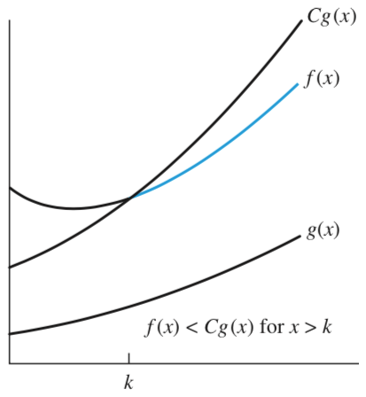
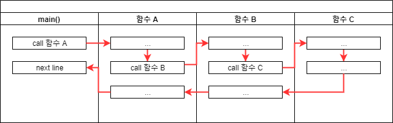
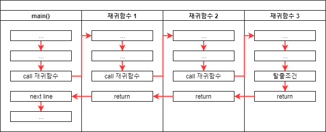
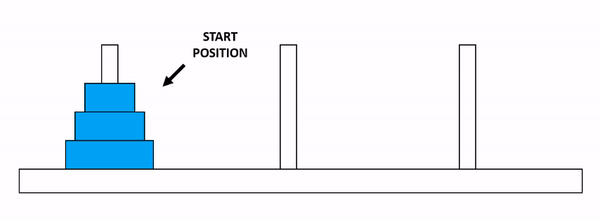
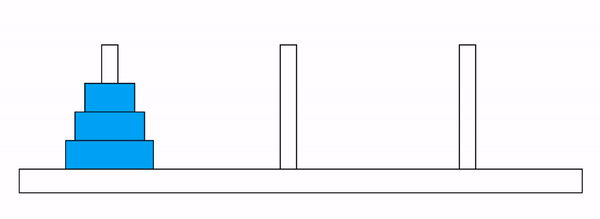

```{r setup, include=FALSE}
library(knitr)

# 슬라이드는 폭이 좁다. 출력 폭을 46자로 접는다.
options(linewidth = 46, width = 46)
hook_output <- knitr::knit_hooks$get("output")
knit_hooks$set(output = function(x, options) {
  if (!is.null(n <- options$linewidth)) {
    x <- knitr:::split_lines(x)
    if (any(nchar(x) > n)) x <- strwrap(x, width = n)
    x <- paste(x, collapse = "\n")
  }
  hook_output(x, options)
})
```


## 이 수업에서 다루는 것

::: {.keypoint}
알고리즘 **암기**가 아니라, 구현의 **정확성**과 **수행 시간, 메모리 요구량**을 판단하는 능력
:::

<br>

| | 절 | 내용 |
|:--|:--|:--|
| 1 | 알고리즘과 계산 비용 | 일상 속 알고리즘, 수행 시간, 메모리, 빅오 표기법 |
| 2 | 재귀 | 종료 조건, 계승, 하노이 탑 |
| 3 | 탐색 알고리즘 | 선형 탐색과 이진 탐색, 구현의 정확성 검증 |
| 4 | 정렬 알고리즘 | 정렬 네 가지(버블, 삽입, 병합, 퀵), 입력에 따른 비용 |
| 5 | 뉴턴-랩슨 알고리즘 | 점화식, 초기값 의존성, 회귀와 로지스틱 회귀의 계수 추정, 경사하강법 |
| 6 | AI와 함께 | 생성 코드의 검증 |

: {tbl-colwidths="[6,32,62]"}

::: {.notes}
전체 지도를 먼저 보겠습니다.

1절은 전화번호부와 청소 로봇 예로 알고리즘이 무엇인지부터 잡고 시작합니다.
1절과 2절에서는 비교 기준을 정합니다. 알고리즘의 수행 시간과 메모리를 비교하는 빅오 표기법을 배우고,
함수가 자기 자신을 호출하는 재귀를 익힙니다.

3절부터 5절까지는 그 기준을 탐색, 정렬, 수치 계산 세 가지 영역에 적용합니다.
같은 질문 두 개를 반복합니다. "이 구현이 맞는가", "이 구현의 연산 횟수와 메모리는 입력 크기에 따라 얼마나 늘어나는가."

6절은 같은 질문을 AI가 만들어 준 코드에 적용합니다. 3절에서 하는 일과
6절에서 하는 일이 똑같습니다. 사람이 쓴 코드냐 기계가 쓴 코드냐만 다릅니다.

표에서 3절과 6절을 짚으면서: 두 절은 같은 검증 절차, 곧 모든 원소 넣어 보기, 경계 사례, 정답을 아는 함수와 대조하기를 씁니다. 3절은 사람이 쓴 코드에, 6절은 AI가 쓴 코드에 적용합니다.
:::


# [1]{.secno} 알고리즘과 계산 비용 {.section-title}

::: {.columns}
::: {.column width="54%"}
**알고리즘 = 약속된 절차**: 일상의 예에서 출발해 **수행 시간과 메모리를 비교하는 기준**을 세우는 절

결과가 같은 두 코드가 서로 다른 수행 시간, 메모리를 요구하는 이유와
그 차이를 비교하는 방법
:::
::: {.column width="46%"}
[이 절에서]{.label}

- 일상 속 알고리즘: 전화번호부, 청소 로봇
- 알고리즘의 다섯 조건
- 비용 = 수행 시간 + 메모리
- 시간 복잡도, 공간 복잡도
- 빅오 표기법과 세 규칙
- 차수별 연산 횟수 비교
:::
:::

::: {.keypoint .teal}
**이 절이 답하는 질문**: 같은 결과를 내는 두 코드의 수행 시간과 메모리를 **무엇으로 비교하는가**?
:::

::: {.notes}
첫 번째 절입니다. 알고리즘이라는 말부터 일상의 예로 풀고, 그다음에 비용이라는 말을 정확하게 정의하겠습니다.
:::


## [1.1]{.secno} 전화번호부에서 '이아무개' 찾기

::: {.columns}
::: {.column width="50%"}
[방법 A, 한 쪽씩 넘기기]{.label .label-note}

1. 첫 쪽 펼치기
2. 찾는 이름이 있으면 멈춤
3. 없으면 다음 쪽으로 넘기고 2로

1,000쪽이면 최악 **1,000번** 확인
:::
::: {.column width="50%"}
[방법 B, 가운데 펼치기]{.label .label-slide}

1. 남은 부분의 가운데 펼치기
2. 찾는 이름이 있으면 멈춤
3. '이'보다 앞 이름이면 뒤쪽 절반만, 뒤 이름이면 앞쪽 절반만 남기고 1로

1,000쪽이면 최대 **10번** 펼침
:::
:::

::: {.keypoint .teal}
두 방법 모두 **같은 결과**, 확인하는 **쪽수는 다름**<br>
방법 B 는 이름이 **가나다순으로 정렬**되어 있다는 약속이 있어야 가능 → 3절 이진 탐색
:::

::: {.notes}
알고리즘이라는 말부터 풀어 보겠습니다. 전화번호부에서 이름을 찾는 일로 시작합니다.

전화번호부 본 적 있으세요? 스마트폰 이전에는 집집마다 이렇게 두꺼운 책이 있었습니다.
이름이 가나다순으로 인쇄돼 있고요. 여기서 '이아무개'를 찾는다고 해 봅시다.

방법 A는 첫 쪽부터 한 쪽씩 넘기는 겁니다. 언젠가는 찾습니다. 다만 1,000쪽짜리라면
운이 나쁘면 1,000쪽을 다 봐야 합니다.

방법 B는 가운데를 펼치는 겁니다. 펼친 쪽에 '박'씨가 나오면, '이'는 그보다 뒤에 있으니까
앞쪽 절반은 볼 필요가 없지요. 남은 뒤쪽 절반의 가운데를 또 펼칩니다. 이렇게 하면
1,000쪽이라도 열 번 안쪽에서 끝납니다.

방법 A와 B처럼 정해 둔 순서대로 따라 하면 결과가 나오는 절차를 알고리즘이라고 부릅니다.

두 가지를 기억하세요. 첫째, 두 방법 모두 결과는 같습니다. 다른 건 확인하는 쪽수입니다.
1절은 이런 차이를 연산 횟수로 재는 방법을 다룹니다.

둘째, 방법 B는 아무 책에서나 되는 게 아닙니다. 이름이 가나다순으로 정렬돼 있다는 약속이
있어야 합니다. 동아리 가입 순서대로 적은 명단이라면 방법 B는 못 씁니다. 3절 이진 탐색에서
똑같은 조건이 다시 나옵니다.

덧붙이면, 여러분은 실제로는 정확히 가운데가 아니라 'ㅇ'이 있을 만한 뒤쪽을 짐작해서
펴실 겁니다. 그것도 알고리즘입니다. 보간 탐색이라는 이름도 있습니다.
:::


## 예측해 보자 {.predict}

전화번호부가 **10,000쪽**이면 방법 B 는 최대 몇 번 펼쳐야 하는가?

::: {.options}
::: {}
**A** 약 5,000번
:::
::: {}
**B** 약 100번
:::
::: {}
**C** 약 14번
:::
:::

::: {.why}
힌트: 한 번 펼칠 때마다 남은 쪽수가 **절반**으로 줄어듦
:::

::: {.notes}
1,000쪽일 때 방법 B는 열 번이었습니다. 그럼 쪽수가 열 배, 10,000쪽이면 몇 번일까요?

A, B, C 중에 골라서 적으세요. 30초 드리겠습니다.

(30초 후) 손 들어 볼까요. A? B? C? 확인해 보겠습니다.
:::


## [1.1]{.secno} 절반씩 줄이면 몇 번 만에 끝나는가

::: {.columns}
::: {.column width="56%"}
```{r phonebook-halving}
half_count <- function(pages) {
  count <- 0
  while (pages > 1) {
    pages <- ceiling(pages / 2)   # 없는 쪽 절반을 버림
    count <- count + 1
  }
  count
}
sapply(c(1000, 10000, 1e6), half_count)
```
:::
::: {.column width="44%"}
| 쪽수 | 방법 A | 방법 B |
|--:|--:|--:|
| 1,000 | 1,000 | **10** |
| 10,000 | 10,000 | **14** |
| 1,000,000 | 1,000,000 | **20** |

: {tbl-colwidths="[36,36,28]"}
:::
:::

::: {.keypoint .teal}
쪽수가 **10배**가 되어도 방법 B 는 **4번**만 증가, 방법 A 는 쪽수에 **정비례** → 3절 이진 탐색, $\mathcal{O}(\log n)$
:::

::: {.notes}
방법 B를 그대로 코드로 옮겼습니다. 한 번 펼칠 때마다 남은 쪽을 절반으로 줄이고, 한 쪽이
남으면 멈춥니다. while 문으로 쓰면 이렇게 됩니다.

결과를 보세요. 1,000쪽이면 10번, 10,000쪽이면 14번, 100만 쪽이어도 20번입니다.
쪽수가 열 배가 되어도 네 번만 늘어납니다.

방법 A는 어떨까요? 쪽수만큼, 그러니까 1,000번, 10,000번, 100만 번입니다.
1.4절에서 이 차이를 빅오 표기법으로 적습니다. 방법 A 는 O(n), 방법 B 는 O(log n) 입니다.
:::


## [1.1]{.secno} 청소 로봇에게 청소를 시키려면

::: {.columns}
::: {.column width="44%"}
[사람에게 하는 말]{.label .label-note}

"방을 깨끗이 청소해": 로봇에게는 정해지지 않은 항목 셋

- **어디서** 시작?
- **깨끗이**의 기준?
- **언제** 멈춤?

[로봇에게 주는 약속된 절차]{.label .label-slide}

1. 방을 칸으로 나누고 왼쪽 위에서 시작
2. 한 줄 끝까지 이동하며 청소
3. 줄 끝에서 아래로 한 칸, 방향 반대로
4. 마지막 칸을 청소하면 멈춤
:::
::: {.column width="56%"}
```{r clean-room}
clean_room <- function(n_row, n_col) {
  visit <- matrix(0L, n_row, n_col)  # 청소 순서
  step <- 0L
  for (i in seq_len(n_row)) {          # 1. 한 줄씩
    cols <- seq_len(n_col)
    if (i %% 2 == 0) cols <- rev(cols) # 3. 방향 반대로
    for (j in cols) {                  # 2. 줄 끝까지
      step <- step + 1L
      visit[i, j] <- step
    }
  }
  visit                                # 4. 멈춤
}
clean_room(4, 6)
```
:::
:::

::: {.notes}
두 번째 예입니다. 청소 로봇을 샀다고 해 봅시다. 사람한테는 "방 좀 깨끗이 치워"면 충분하지요.
그런데 로봇한테 이 말은 절차가 아닙니다.

어디서 시작하나요? 깨끗이는 어느 정도인가요? 언제 멈추나요? 사람은 이 빈칸을 상식으로
채웁니다. 로봇은 못 채웁니다. 그래서 빈칸 없이 약속된 절차가 필요합니다.

왼쪽 아래 네 단계가 그 절차입니다. 방을 칸으로 나누고, 한 줄씩 지그재그로 갑니다.
잔디 깎는 기계가 움직이는 방식이에요.

오른쪽은 그 네 단계를 R로 옮긴 겁니다. 주석의 번호가 왼쪽 단계 번호와 같습니다.
반복문 두 개와 if 하나면 됩니다. 결과 행렬의 숫자가 각 칸을 몇 번째로 청소했는지입니다.
둘째 줄은 오른쪽 끝에서 7번으로 시작해서 왼쪽으로 갑니다.

한 가지 묻겠습니다. 방 한가운데에 소파가 있으면, 소파가 놓인 칸에서 로봇은 무엇을 합니까?
(잠시 기다린 뒤) 이 절차에는 정해져 있지 않습니다. 다음 슬라이드의 일반성 조건이 이 경우를 다룹니다.
:::


## [1.1]{.secno} 알고리즘이라 부르려면

::: {.callout-note}
**알고리즘(algorithm)**: 문제를 해결하기 위해 **약속된 일련의 절차**, 입력이 같으면 누가 실행해도 같은 결과
:::

| 조건 | 뜻 | 청소 로봇에서 |
|:--|:--|:--|
| **명확성** | 각 단계가 모호하지 않음 | "깨끗이" 대신 "모든 칸을 한 번씩" |
| **유일성** | 다음 단계가 하나로 결정됨 | 줄 끝에서는 "아래로 한 칸, 방향 반대로"뿐 |
| **입력과 출력** | 정의된 입력을 받아 결과 산출 | 가로, 세로 칸 수 → 칸별 청소 순서 |
| **유한성** | 유한한 단계 뒤 반드시 종료 | 가로 × 세로 번 이동 후 종료 |
| **일반성** | 정의된 입력 **전체**에 대해 동작 | 크기가 다른 방은 가능, **가구 놓인 방**은? |

: {tbl-colwidths="[17,35,48]"}

::: {.keypoint}
이 장의 코드가 어기는 조건: **유한성**(2절 재귀 합), **일반성**(3절 이진 탐색)<br>
"내 예제에서 동작" ≠ "정의된 입력 전체에서 동작"
:::

::: {.notes}
방금 청소 로봇으로 해 본 것을 정식 용어로 정리하겠습니다.

알고리즘은 약속된 절차입니다. 여기서 '약속'은 단계를 미리 정해 둔다는 뜻입니다. 사람이든 로봇이든
컴퓨터든, 같은 입력이면 누가 실행해도 같은 결과가 나오도록 정해 둡니다.

표의 오른쪽 칸이 방금 만든 청소 로봇입니다. 앞의 세 조건은 각 단계가 애매하지 않고,
다음 단계가 하나로 정해지고, 입력을 받아 출력을 내야 한다는 것입니다.
청소 로봇의 네 단계는 표의 오른쪽 칸처럼 세 조건을 모두 만족합니다.

코드에서 어기기 쉬운 것은 뒤의 두 조건입니다. 유한성은 반드시 멈춰야 한다는 겁니다. "깨끗해질 때까지 청소해"라고
하면, 먼지 센서가 끝내 0이 안 나오는 한 로봇은 안 멈춥니다.

일반성은 정의된 입력 **전체**에서 동작해야 한다는 겁니다. 우리 로봇은 크기가 다른 방에서도
모든 칸을 한 번씩 청소합니다. 그런데 소파가 놓인 방은 다루지 못합니다. 우리 절차에는 가구라는 입력이 없습니다.
만든 사람이 떠올리지 못한 입력이지요. 코드에서는 n = 0 이나 원소가 하나 남은 벡터가 이런 입력입니다.
:::


## [1.1]{.secno} 이 장의 코드가 어기는 두 조건

::: {.columns}
::: {.column width="50%"}
[유한성 위반, 오늘 2절]{.label .label-note}

```r
recursive_sum <- function(n) {
  if (n == 1) return(n)     # n = 0 이면?
  n + recursive_sum(n - 1)
}
```

n = 0 이면 −1, −2, … 로 종료 조건을 **지나쳐 내려가** 멈추지 않음
:::
::: {.column width="50%"}
[일반성 위반, 오늘 3절]{.label .label-note}

```r
rbinary_search <- function(target, ovec, minL, maxL) {
  if (maxL <= minL) return(NA_integer_)   # 원소 1개면?
  ...
}
```

원소가 하나 남으면 그 원소를 **보지 않고** 탐색 종료 → 3절 예제에서 20개 중 8개를 못 찾음
:::
:::

::: {.keypoint .teal}
청소 로봇의 "가구 놓인 방"과 같은 문제: 코드를 만든 사람이 **떠올리지 못한 입력**
:::

::: {.notes}
코드에서도 똑같습니다.

왼쪽은 유한성 위반입니다. 1부터 n까지 더하는 재귀 함수인데, n이 0이면 종료 조건을
지나쳐 내려가서 멈추지 않습니다. 오늘 2절에서 직접 보여 드리겠습니다.

오른쪽은 일반성 위반입니다. 여러분이 코드를 짜고 나서 뭘 합니까? 예제 한두 개 돌려 보고
"됐다" 하지요. 그건 그 예제 한두 개에서 됐다는 뜻이지, 전체에서 된다는 뜻이 아닙니다.
청소 로봇에게 소파 놓인 방이 그랬듯, 이 코드도 만든 사람이 떠올리지 못한 입력에서 틀립니다.
탐색 범위에 원소가 하나 남으면 그 원소를 확인하지 않고 NA 를 돌려줍니다.

"내 예제에서 동작한다"와 "정의된 입력 전체에서 동작한다"의 차이는 3절에서 실행해 보이고, 6절에서 AI 코드에 다시 적용합니다.
:::


## [1.2]{.secno} 비용이란 무엇인가

::: {.keypoint}
이 수업에서 **비용**: 알고리즘이 요구하는 **수행 시간**과 **메모리**
:::

::: {.columns}
::: {.column width="50%"}
[수행 시간]{.label .label-note}

- 재는 단위: **연산 횟수**
- 사칙연산, 비교연산, 반복, 함수 호출
- 시계로 잰 초는 하드웨어, 부하에 따라 변동
- 연산 횟수는 입력이 같으면 **항상 같은 값**
:::
::: {.column width="50%"}
[메모리]{.label .label-slide}

- 재는 단위: **동시에 확보해야 하는 공간의 크기**
- 변수, 자료 구조, 호출 스택 프레임
- 재귀 깊이가 여기에 직접 들어감
:::
:::

::: {.keypoint .teal}
"이 코드가 비싸다" = "**연산 횟수가 많다**" 또는 "**메모리를 많이 잡는다**"<br>
둘 중 어느 쪽인지 항상 구분해서 말할 것
:::

::: {.notes}
용어를 하나 정하고 가겠습니다. 오늘 '비용'이라는 말을 계속 쓸 텐데, 이게 뭘 뜻하는지
명확히 해 두지 않으면 나중에 헷갈립니다.

비용은 두 가지입니다. 수행 시간과 메모리.

수행 시간을 뭘로 잽니까? 초시계로 재면 될 것 같지요. 그런데 초시계로 잰 초는 기기와 상황에 따라 달라집니다.
같은 코드도 여러분 노트북에서 재는 것과 제 노트북에서 재는 것이 다르고, 백그라운드에
뭐가 돌고 있느냐에 따라 또 다릅니다. 그래서 우리는 **연산 횟수**를 셉니다.
연산 횟수는 입력이 같으면 언제 어디서 재도 같은 값이 나옵니다.

메모리는 동시에 얼마나 잡고 있어야 하느냐입니다. 2절 재귀에서 이 기준을 씁니다.
재귀는 호출할 때마다 호출 스택에 프레임을 하나씩 쌓습니다.

맨 아래 상자. 앞으로 "이 코드가 비싸다"고 하면, 여러분은 저한테 되물으셔야 합니다.
"시간이 비싼 건가요, 메모리가 비싼 건가요?" 둘은 다른 문제고, 해결책도 다릅니다.
4절의 병합 정렬은 비교 횟수를 n log n 수준으로 줄이는 대신 길이 n 의 임시 벡터만큼 메모리를 더 씁니다.
:::


## [1.2]{.secno} 결과가 같은 두 프로그램

::: {.columns}
::: {.column width="50%"}
[프로그램 1, 사전 할당]{.label .label-slide}

```{r prealloc, eval=FALSE}
prealloc_vec <- function(n) {
  x <- numeric(n)
  for (i in seq_len(n)) {
    x[i] <- i
  }
  x
}
```
:::
::: {.column width="50%"}
[프로그램 2, 이어 붙이기]{.label .label-note}

```{r grow, eval=FALSE}
grow_vec <- function(n) {
  x <- NULL
  for (i in seq_len(n)) {
    x <- c(x, i)
  }
  x
}
```
:::
:::

```{r both-defs, echo=FALSE}
prealloc_vec <- function(n) {
  x <- numeric(n)
  for (i in seq_len(n)) x[i] <- i
  x
}
grow_vec <- function(n) {
  x <- NULL
  for (i in seq_len(n)) x <- c(x, i)
  x
}
```

```{r same-result}
identical(prealloc_vec(1000), as.numeric(grow_vec(1000)))
```

::: {.notes}
두 프로그램을 보겠습니다. 둘 다 1부터 n까지 숫자를 담은 벡터를 만듭니다.

왼쪽은 `numeric(n)` 으로 자리를 먼저 다 잡아 놓고 하나씩 채웁니다.
오른쪽은 빈 걸로 시작해서 `c(x, i)` 로 하나씩 붙입니다.

R을 처음 배우면 오른쪽처럼 쓰기 쉽습니다. 결과의 길이를 미리 몰라도 값을 얻을 때마다 뒤에 붙이면 되기 때문입니다.

맨 아래 `identical` 이 TRUE 나왔지요. 결과는 똑같습니다. 한 글자도 안 다릅니다.

결과는 같습니다. 수행 시간도 같은지는 다음 슬라이드에서 예측해 봅니다.
:::


## 예측해 보자 {.predict}

`n` 이 5만일 때 두 프로그램의 실행 시간 차이는?

::: {.columns}
::: {.column width="50%"}
```r
prealloc_vec <- function(n) {
  x <- numeric(n)               # 자리를 먼저 확보
  for (i in seq_len(n)) x[i] <- i
  x
}
```
:::
::: {.column width="50%"}
```r
grow_vec <- function(n) {
  x <- NULL
  for (i in seq_len(n)) x <- c(x, i)   # 이어 붙이기
  x
}
```
:::
:::

::: {.options}
::: {}
**A** 비슷한 수준
:::
::: {}
**B** 두 배 정도
:::
::: {}
**C** 그보다 큼
:::
:::

::: {.why}
실행 전에 답을 적을 것: 다음 슬라이드의 측정값과 대조
:::

::: {.notes}
예측하는 시간입니다. 제목 줄에 '예측해 보자' 띠가 붙은 이 슬라이드가 오늘 여러 번 나옵니다. 이 슬라이드가 나오면
**손을 멈추고 답을 적으세요.** 머릿속으로 생각만 하지 말고 적으세요.

왜 적으라고 하냐면, 적어야 틀렸다는 걸 알 수 있기 때문입니다. 머릿속으로만 생각하면
결과를 보고 나서 "아 나도 그렇게 생각했어" 하게 됩니다. 결과를 본 뒤에는 처음 생각을 결과 쪽으로 고쳐 기억하기 쉽기 때문입니다.

n이 5만입니다. A, B, C 중에 골라서 적으세요. 30초 드리겠습니다.

(30초 후) 손 들어 볼까요. A라고 생각하신 분? B? C?

좋습니다. 넘어가겠습니다.
:::


## [1.2]{.secno} 실행과 대조

```{r cost-time}
#| output-location: fragment
n <- 50000
data.frame(
  방식 = c("사전 할당", "이어 붙이기"),
  초 = c(system.time(prealloc_vec(n))[["elapsed"]],
         system.time(grow_vec(n))[["elapsed"]])
)
```

. . .

::: {.keypoint}
`x <- c(x, i)`: 반복마다 **길이가 1 늘어난 새 벡터를 할당하고 기존 원소 전부 복사**

$i$ 번째 반복에서 기존 원소 $i-1$ 개 복사 → 전체 복사량 $0 + 1 + \cdots + (n-1) = n(n-1)/2$ 에 비례

사전 할당: 이미 확보된 메모리에 값 대입, 반복당 연산 횟수 일정
:::

::: {.notes}
(클릭) 결과입니다.

몇 배 차이입니까? 사전 할당은 0.01초도 안 걸리고, 이어 붙이기는 초 단위가 걸립니다.
두 배가 아니라 수백 배 넘게 차이 나므로 답은 C입니다.

(클릭) 왜 그런지 보겠습니다.

R에서 `c(x, i)` 는 x에 i를 덧붙이는 게 아닙니다. **길이가 하나 더 긴 새 벡터를 만들어서,
기존 원소를 전부 복사해 넣고, 마지막에 i를 넣는** 겁니다. 매번요.

그러면 백 번째 반복에서는 99개를 복사하고, 천 번째 반복에서는 999개를 복사합니다.
다 더하면 n의 제곱에 비례하는 양이 됩니다. 오만 개면 12억 5천만 번쯤 복사한 셈입니다.

반면 왼쪽은 자리를 미리 잡아 놨으니까 그냥 그 자리에 값을 씁니다. 반복마다 한 번씩.

정리하면, 결과가 같아도 수행 시간은 다를 수 있습니다.
그리고 이 차이는 n이 작을 때는 잘 드러나지 않습니다. n이 천이면 복사량이 약 50만 번이라 둘 다 0.1초 안쪽입니다.
n을 50배 키우면 복사량은 약 2,500배가 되어 초 단위 차이로 드러납니다.
:::


## [1.3]{.secno} 시간 복잡도와 공간 복잡도

::: {.columns}
::: {.column width="50%"}
::: {.callout-note}
**시간 복잡도(time complexity)**

종료할 때까지 수행하는 **연산 횟수**

계수 대상: 사칙연산, 비교연산, 반복, 함수 호출
:::
:::
::: {.column width="50%"}
::: {.callout-note}
**공간 복잡도(space complexity)**

종료할 때까지 필요한 **메모리 크기**

대상: 변수 개수, 자료 구조, 스택 프레임
:::
:::
:::

| | 수행 시간 | 메모리 |
|:--|:--|:--|
| 프로그램 1, 사전 할당 | $n$ 에 비례 | 증가 없음 |
| 프로그램 2, 이어 붙이기 | $n^2$ 에 비례 | $n$ 까지 증가 |

: {tbl-colwidths="[34,33,33]"}

::: {.keypoint}
평가 기준은 **최악의 경우(worst case)**: 최선은 특정 입력에서만 성립, 평균은 입력 분포 가정 필요,
최악은 임의의 입력에 항상 성립하는 **상한**
:::

::: {.notes}
방금 본 걸 용어로 정리하겠습니다.

시간 복잡도는 종료할 때까지의 연산 횟수, 공간 복잡도는 종료할 때까지 필요한 메모리 크기입니다.
방금 두 프로그램에서 센 것이 이 둘입니다.

가운데 표를 보세요. 프로그램 1은 시간이 n에 비례하고 메모리는 안 늘어납니다.
프로그램 2는 시간이 n 제곱에 비례하고 메모리도 반복하면서 n까지 늘어납니다.
**프로그램 2가 시간과 메모리 두 기준 모두에서 더 많이 요구합니다.**

맨 아래 상자. 왜 최악의 경우로 재느냐. 학생들이 자주 묻는 질문입니다.

최선의 경우로 재면 어떻게 됩니까? "운 좋으면 한 번에 찾습니다" 이건 약속이 아니지요.
평균으로 재면? 평균을 내려면 입력이 어떻게 분포하는지 알아야 하는데, 보통 모릅니다.
최악의 경우는 다릅니다. 어떤 입력이 들어와도 이것보다 나빠지지는 않는다. 이건 보장입니다.

그래서 이 장에서는 알고리즘을 최악의 경우로 비교합니다.
:::


## [1.4]{.secno} 빅오 표기법

::: {.columns}
::: {.column width="54%"}
::: {.callout-note}
**정의**: 상수 $C$, $k$ 가 존재해\
$x \geq k$ 인 모든 $x$ 에서 $|f(x)| \leq C|g(x)|$

$\Rightarrow$ $f(x) = \mathcal{O}(g(x))$, "$f$ 는 $g$ 의 빅오"
:::

[그림 읽기]{.label .label-slide}

- $f(x)$: 알고리즘의 실제 연산 횟수
- $Cg(x)$: 기준 함수 $g$ 에 상수 $C$ 를 곱한 선
- $k$ 이후 (파란 구간): $f(x)$ 가 $Cg(x)$ 아래에 머묾
- $k$ 이전: $f(x)$ 가 위에 있어도 무관

::: {.keypoint}
$n$ 이 충분히 커지면 **저차항의 비중이 0 에 수렴**, 증가율이 가장 큰 항만 남음

$g$ 는 $f$ 의 **점근적 상한**
:::
:::
::: {.column width="46%"}
{height="510px" fig-align="center"}
:::
:::

::: {.notes}
빅오 표기법입니다. 정의부터 보시죠.

오른쪽 그림이 이 정의를 그린 것입니다.
그림은 johngrib.github.io 의 빅오 표기법 글에서 가져왔습니다.

끝이 파랗게 칠해진 곡선이 f(x), 우리가 재려는 알고리즘의 실제 연산 횟수입니다.
그 위로 가장 가파르게 올라가는 검은 선이 Cg(x), 우리가 고른 기준 함수 g 에 상수 C 를 곱한 겁니다.
맨 아래 선이 g(x) 자체입니다. g 는 f 보다 낮아도 됩니다. 상수 C 를 곱해 위로 올리면 되니까요.

x축의 k 지점을 보세요. 두 곡선이 거기서 만나고, 그 뒤로는 f(x) 가 Cg(x) 아래에 있습니다.
파랗게 칠한 부분이 그 구간입니다. 한 번도 위로 올라오지 않습니다. 이럴 때 "f는 g의 빅오다" 라고 합니다.
k 앞에서는 f(x) 가 Cg(x) 보다 위에 있지요. 그래도 상관없습니다.

즉 Cg 가 상한입니다. k 를 넘어서면 f 는 Cg 를 넘지 않습니다.

정의에는 "x가 k보다 클 때" 라는 조건이 붙습니다. k보다 작은 구간은 따지지 않습니다.
n이 10이면 O(n²) 알고리즘도 연산이 100번이라 차이가 작고, n이 백만이면 두 슬라이드 뒤의 표처럼
0.02초와 약 17분으로 벌어집니다.
그래서 빅오는 **충분히 커졌을 때의 증가 양상**만 봅니다. 저차항을 버리는 이유가 이겁니다.
:::


## [1.4]{.secno} 실제로 쓰는 것은 세 규칙 {.dense}

::: {.columns}
::: {.column width="33%"}
[규칙 1, 계수 법칙]{.label .label-note}

계수 소거

$\mathcal{O}(5n) = \mathcal{O}(n)$

반복이 $5n$ 번이든 $100n$ 번이든 모두 $\mathcal{O}(n)$
:::
::: {.column width="33%"}
[규칙 2, 합의 법칙]{.label .label-note}

순차 실행 시 증가율이 큰 쪽만 잔존

$\mathcal{O}(n) + \mathcal{O}(n^2) = \mathcal{O}(n^2)$

단, 입력 변수가 다르면 $\mathcal{O}(n + m)$
:::
::: {.column width="33%"}
[규칙 3, 곱의 법칙]{.label .label-note}

반복문 중첩 시 반복 횟수 곱

$\mathcal{O}(n) \times \mathcal{O}(n) = \mathcal{O}(n^2)$
:::
:::

::: {.columns}
::: {.column width="62%"}
```r
case1 <- function(n) {              # (가)
  s <- 0; for (i in seq_len(n)) s <- s + i; s
}
case2 <- function(n) {              # (나)
  s <- 0; for (i in seq_len(5 * n)) s <- s + i; s
}
case3 <- function(n, m) {           # (다)
  s <- 0
  for (i in seq_len(n)) s <- s + i
  for (j in seq_len(m)) s <- s + j
  s
}
case4 <- function(n) {              # (라)
  s <- 0; for (i in seq_len(n)) for (j in seq_len(n)) s <- s + j; s
}
```
:::
::: {.column width="38%"}
::: {.keypoint}
**(가)** $\mathcal{O}(n)$

**(나)** $\mathcal{O}(5n) = \mathcal{O}(n)$: 규칙 1

**(다)** $\mathcal{O}(n + m)$: 규칙 2의 단서

**(라)** $\mathcal{O}(n^2)$: 규칙 3
:::

코드 읽을 때 쓰는 것은 정의가 아니라 이 세 규칙: **반복이 몇 번 도는지만** 세면 됨
:::
:::

::: {.notes}
정의는 시험 문제 풀 때 쓰고, 실제로 코드 볼 때 쓰는 건 이 세 개입니다.

규칙 1. 계수는 버립니다. 반복을 5n번 돌든 100n번 돌든 O(n)입니다.
정의에서 상수 C 를 100 으로 잡으면 100n ≤ Cn 이 성립하기 때문입니다. 5n 이든 100n 이든 n 이 두 배가 되면 연산 횟수도 두 배가 됩니다.

규칙 2. 두 부분이 이어서 실행되면 큰 쪽만 남습니다. for문 하나 돌고 그다음에
이중 for문 돌면, 앞의 for문은 없는 셈 칩니다. n + n² 에서 n 의 비중은 n 이 커질수록 0 에 가까워지기 때문입니다.
단서가 하나 있습니다. 입력 변수가 다르면 못 합칩니다. n짜리 반복 다음에 m짜리 반복이면
O(n + m)이고, 이건 더 못 줄입니다. n과 m 중 뭐가 큰지 모르니까요.

규칙 3. 중첩되면 곱합니다. n 번 도는 반복 안에 n 번 도는 반복이 있으면 n × n = n² 번이고, n 이 천이면 백만 번입니다.

세 개 다 외우실 필요 없습니다. 코드 보고 "반복이 몇 번 도나" 세는 습관만 들이면 됩니다.
:::


## [1.4]{.secno} 차수가 다르면 무엇이 달라지는가

```{r big-o-table, echo=FALSE}
n <- c(10, 100, 1000, 1e6)
fmt <- function(x) format(x, big.mark = ",", scientific = FALSE)
tab <- data.frame(
  n = fmt(n),
  o1 = c("1", "1", "1", "1"),
  ologn = c("3", "7", "10", "20"),
  on = fmt(n),
  onlogn = fmt(round(n * log2(n))),
  on2 = c(fmt(n[1:3]^2), "1e+12"),
  o2n = c("1,024", "1.3e+30", "1.1e+301", "9.9e+301029")
)
names(tab) <- c("n", "O(1)", "O(log n)", "O(n)", "O(n log n)", "O(n^2)", "O(2^n)")
kable(tab, align = rep("r", 7))
```

::: {.columns}
::: {.column width="58%"}
| 차수 | 오늘 만나는 알고리즘 |
|:--|:--|
| $\mathcal{O}(1)$ | 벡터 인덱싱 `x[i]`, 사전 할당한 자리에 대입 |
| $\mathcal{O}(\log n)$ | **이진 탐색** |
| $\mathcal{O}(n)$ | **선형 탐색**, 벡터 한 번 순회 |
| $\mathcal{O}(n\log n)$ | **병합 정렬**, R 의 `sort()` |
| $\mathcal{O}(n^2)$ | **버블 정렬**, `c(x, i)` 로 벡터 이어 붙이기 |
| $\mathcal{O}(2^n)$ | **하노이 탑** |

: {tbl-colwidths="[24,76]"}
:::
::: {.column width="42%"}
::: {.keypoint .teal}
$n = 1{,}000$: $\mathcal{O}(n)$ 대 $\mathcal{O}(n^2)$ **천 배**
:::

::: {.keypoint .teal}
$n = 10^6$, 초당 10억 연산 가정<br>
$\mathcal{O}(n\log n)$ **0.02초** 대 $\mathcal{O}(n^2)$ **약 17분**
:::

::: {.keypoint}
**컴퓨터가 100배 빨라져도** $\mathcal{O}(n^2)$ **약 10초**: 차수 차이는 하드웨어 성능 향상으로 메워지지 않음
:::
:::
:::

::: {.notes}
표를 보겠습니다. 가로가 복잡도 차수, 세로가 입력 크기입니다.

n이 천일 때 줄을 따라가 보세요. O(n)은 천 번, O(n²)은 백만 번입니다. 천 배 차이입니다.

맨 오른쪽 O(2ⁿ) 보이시죠. n이 백일 때 1.3 곱하기 10의 30승입니다.
초당 10억 번 연산하는 컴퓨터로 1.3 곱하기 10의 21승 초, 약 4 곱하기 10의 13승 년입니다.
n이 천이면 10의 301승. 관측 가능한 우주의 원자 수로 추정하는 10의 80승보다 큽니다.

오른쪽 아래 상자가 오늘 이 절의 결론입니다.

차수가 다르면 컴퓨터를 바꿔서 해결할 수 있는 문제가 아닙니다.
컴퓨터가 백 배 빨라져도 O(n²)은 여전히 O(n²)입니다. 17분이 10초로 줄 뿐이고, O(n log n)의 0.02초와는
여전히 500배 차이입니다. 규칙 1에 따라 상수는 버린다고 했지요. n을 10배 키우면 O(n²)의 연산 횟수는
100배가 되어 그 이득이 사라집니다.

**O(n²) 정렬을 O(n log n) 정렬로 바꾸는 것처럼, 차수가 낮은 알고리즘으로 바꿔야 합니다.**
:::


## [1.4]{.secno} 차수의 증가 양상

::: {.complexity-fig}
```{r complexity-plot, echo=FALSE, fig.width=9, fig.height=4.1}
op <- par(mar = c(4.2, 4.4, 0.6, 2.6))
nn <- seq(1, 40, by = 0.5)
plot(range(nn), c(0, 200), xlim = c(1, 46), type = "n", xlab = "n (입력 크기)",
     ylab = "연산 횟수", bty = "l", cex.lab = 1.25, cex.axis = 1.1)
lines(nn, rep(1, length(nn)), lwd = 3, col = "grey45")
lines(nn, log2(nn), lwd = 3, col = "#1F6F7A")
lines(nn, nn, lwd = 3, col = "#2E7D32")
lines(nn, nn * log2(nn), lwd = 3, col = "#B58900")
lines(nn, nn^2, lwd = 3, col = "#A64B32")
text(40, 1, expression(O(1)), pos = 4, offset = 0.4, col = "grey45", cex = 1.3)
text(40, 17, expression(O(log~n)), pos = 4, offset = 0.4, col = "#1F6F7A", cex = 1.3)
text(40, 40, expression(O(n)), pos = 4, offset = 0.4, col = "#2E7D32", cex = 1.3)
text(33, 33 * log2(33), expression(O(n~log~n)), pos = 2, col = "#B58900", cex = 1.3)
text(14, 190, expression(O(n^2)), pos = 4, col = "#A64B32", cex = 1.3)
par(op)
```
:::

::: {.keypoint .teal}
$n = 40$ 에서 $\mathcal{O}(n)$ 은 40, $\mathcal{O}(n^2)$ 은 **1,600**: 세로축 상한 200 을 $n = 15$ 에서 넘음
:::

::: {.notes}
같은 내용을 그림으로 보겠습니다. 가로가 입력 크기, 세로가 연산 횟수입니다.

회색 O(1)은 바닥에 붙어 있습니다. 입력이 아무리 커져도 일정합니다.
청록색 O(log n)은 n이 40일 때 5.3입니다.
초록색 O(n)은 직선으로 올라갑니다.
노란색 O(n log n)은 n이 38 근처에서 세로축 끝 200을 넘고, n이 40이면 213으로 O(n)의 5.3배입니다.
그리고 빨간색 O(n²). 저건 이미 화면 밖으로 나갔습니다.

가로축을 보세요. **n이 40까지입니다.** n² 은 n이 15일 때 225로 세로축 끝 200을 넘고, n이 40이면 1,600입니다.
실제 데이터는 만 개, 십만 개, 백만 개짜리를 다룹니다.

n이 백만이면 앞 표처럼 O(n)은 백만 번, O(n²)은 10의 12승 번으로 백만 배 차이입니다.

여기까지가 1절입니다. 잠깐 쉬었다가 재귀로 넘어가겠습니다.
:::


# [2]{.secno} 재귀 {.section-title}

::: {.columns}
::: {.column width="54%"}
함수가 자기 자신을 호출해 문제를 **같은 모양의 작은 문제**로 줄이는 방법

종료 조건이 틀리면 멈추지 않음: `n == 1` 과 `n <= 1` 의 차이
:::
::: {.column width="46%"}
[이 절에서]{.label}

- 함수 호출과 재귀 호출
- 종료 조건 + 재귀 단계
- 종료 조건의 한계: 경계 바깥
- 재귀의 메모리 비용
- 하노이 탑
:::
:::

::: {.keypoint .teal}
**이 절이 답하는 질문**: 이 재귀는 **반드시 멈추는가**?
:::

::: {.notes}
2절 재귀입니다. 종료 조건이 멈춤을 보장하는지, 호출 깊이만큼 메모리를 얼마나 쓰는지를 봅니다.
:::


## [2]{.secno} 함수 호출과 재귀 호출

::: {.columns}
::: {.column width="50%"}
[일반 함수 호출]{.label .label-note}

{width="100%"}

호출 지점으로 **복귀**
:::
::: {.column width="50%"}
[재귀 호출]{.label .label-slide}

{width="100%"}

복귀 지점이 **자기 자신**
:::
:::

::: {.keypoint}
호출마다 **호출 스택(call stack)** 에 새 프레임 누적 → 중단 조건 없으면 종료되지 않음
:::

::: {.notes}
두 그림을 나란히 놓았습니다. 출처는 10bun.tv 입니다.

왼쪽이 여러분이 아는 함수 호출입니다. main이 A를 부르고, A가 B를 부르고, B가 C를 부르고.
C가 끝나면 B로 돌아오고, B가 끝나면 A로 돌아오고, A가 끝나면 main으로 돌아옵니다.
불렀던 자리로 되돌아오지요.

오른쪽이 재귀입니다. 구조는 똑같습니다. 되돌아옵니다.
다른 건 하나뿐입니다. **되돌아올 자리가 자기 자신**이라는 것.

아래 상자는 호출 스택입니다. 함수를 부를 때마다 컴퓨터는 "어디로 돌아가야 하는지",
"지역 변수가 뭐였는지" 를 어딘가에 적어 둬야 합니다. 그 자리가 호출 스택입니다.

재귀는 이걸 계속 쌓습니다. 열 번 부르면 열 층, 천 번 부르면 천 층.
그래서 두 가지 문제가 생깁니다. 하나는 안 멈추면 R 의 한계에 걸려 오류가 날 때까지 쌓인다는 것,
또 하나는 멈추더라도 호출 깊이만큼 메모리를 쓴다는 것. 둘 다 2.2절에서 실행해 봅니다.
:::


## [2.1]{.secno} 재귀 함수의 구성

::: {.columns}
::: {.column width="46%"}
1. **종료 조건(base case)**<br>
   분할하지 않고 결과 직접 반환
2. **재귀 단계(recursive step)**<br>
   문제 크기를 줄여 자기 자신 호출

```{r recursive-sum}
recursive_sum <- function(n) {
  if (n == 1) return(n)     # 종료 조건
  n + recursive_sum(n - 1)  # 재귀 단계
}
recursive_sum(3)
```
:::
::: {.column width="54%"}
{width="100%"}
:::
:::

::: {.notes}
재귀 함수는 두 부분으로 이루어집니다.

종료 조건, 그리고 재귀 단계.

코드를 보세요. `if (n == 1) return(n)` 이 종료 조건입니다. 더 안 쪼개고 답을 바로 줍니다.
그 아래 `n + recursive_sum(n - 1)` 이 재귀 단계입니다. n을 하나 줄여서 자기를 부릅니다.

오른쪽 그림으로 따라가 보겠습니다.

`recursive_sum(3)` 을 부릅니다. n이 1이 아니니까 `recursive_sum(2)` 를 부릅니다.
2도 1이 아니니까 `recursive_sum(1)` 을 부릅니다.
1은 종료 조건에 걸립니다. 1을 반환합니다.

이제 거슬러 올라옵니다. 2 더하기 1은 3. 3 더하기 3은 6.
최종적으로 6이 나옵니다. 1 더하기 2 더하기 3이 6 맞지요.

여기서 화살표 방향을 잘 보세요. 내려갈 때는 쪼개기만 하고, 실제 계산은 **올라올 때**
일어납니다. 재귀가 헷갈리는 이유가 이겁니다. 내려가는 흐름과 올라오는 흐름 두 개가
동시에 있어서요.
:::


## 예측해 보자 {.predict}

`recursive_sum(0)` 의 반환값은?

::: {.columns}
::: {.column width="52%"}
```r
recursive_sum <- function(n) {
  if (n == 1) return(n)     # 종료 조건
  n + recursive_sum(n - 1)  # 재귀 단계
}

recursive_sum(3)   # 6: 정상 동작
```
:::
::: {.column width="48%"}
::: {.options}
::: {}
**A** `0`
:::
::: {}
**B** `1`
:::
::: {}
**C** 오류
:::
:::
:::
:::

::: {.why}
방금 확인: `recursive_sum(3)` 은 정답 6 반환<br>
그런데 "정의된 입력 **전체**"에 대해서도 그러한가?<br>
힌트: 알고리즘의 다섯 조건 중 **유한성**
:::

::: {.notes}
다시 예측 시간입니다. 적으세요.

방금 `recursive_sum(3)` 이 6을 돌려줬습니다. 1 + 2 + 3 과 같습니다.

그런데 0을 넣으면요?

힌트를 하나 드리겠습니다. 1.1절에서 코드에서 어기기 쉬운 조건으로 유한성과 일반성을 꼽았습니다.
이 문제는 그중 유한성, 곧 함수가 반드시 멈추는가를 묻습니다.

30초 드리겠습니다. A, B, C.
:::


## [2.2]{.secno} 종료 조건의 한계

```{r rec-zero}
#| output-location: fragment
tryCatch(recursive_sum(0),
         error = function(e) cat("오류:", conditionMessage(e), "\n"))
```

. . .

- `n` 이 0이면 `n == 1` 은 **결코 참이 되지 않음**
- 인수가 `0, -1, -2, ...` 로 계속 감소 → R 의 중첩 한계에 도달해서야 중단
- 올바른 종료 조건: "`n` 이 **1 이하**일 때"

. . .

```{r rec-fixed}
recursive_sum2 <- function(n) {
  if (n <= 1) return(n)          # 경계 조건을 포함한다
  n + recursive_sum2(n - 1)
}
c(recursive_sum2(0), recursive_sum2(1), recursive_sum2(100))
```

::: {.keypoint}
결함은 입력이 **커질 때**만 드러나지 않음: **정의역의 경계 바로 바깥**에서도 드러남
:::

::: {.notes}
(클릭) 답은 C, 오류입니다.

메시지를 읽어 보세요. "evaluation nested too deeply", 너무 깊이 중첩됐다.
무한 재귀에 빠졌다는 뜻입니다.

(클릭) 왜 그럴까요.

n이 0입니다. 종료 조건이 `n == 1` 이지요. 0은 1이 아닙니다. 그래서 `recursive_sum(-1)`을 부릅니다.
-1도 1이 아니지요. `recursive_sum(-2)`. -2도 아니지요...

**영원히 1을 못 만납니다.** 1을 지나쳐서 내려가 버렸으니까요.
그러다 R 이 중첩 한계에 걸려 멈춥니다.

고칠 곳은 종료 조건 한 줄입니다. `n == 1` 을 `n <= 1` 로 바꾸면 됩니다. 등호 하나 추가.
(클릭) 이렇게요. 0, 1, 100 을 넣으면 0, 1, 5050 이 나옵니다.

맨 아래 상자를 보겠습니다.

입력이 커지면 수행 시간이 길어지거나 메모리가 모자라는 경우가 있습니다. 다음 슬라이드에서 봅니다.
그런데 지금 본 건 반대입니다. **입력이 경계 바로 바깥으로 나갔을 때**, 곧 종료 조건의 1 바로 아래인 0 에서
함수가 멈추지 않았습니다.

여러분이 함수를 짜면 항상 물어보세요. "정의역의 끝에서 어떻게 되나?"
빈 벡터, 길이 1, 0, 음수. 이 네 가지는 습관적으로 넣어 보세요.
:::


## [2.2]{.secno} 재귀의 비용

```{r rec-depth}
#| output-location: fragment
recursive_sum2(1000)                     # 정상적으로 동작한다

tryCatch(recursive_sum2(5000),           # 중첩 한계
         error = function(e) cat("오류:", conditionMessage(e), "\n"))
```

. . .

::: {.columns}
::: {.column width="50%"}
[재귀]{.label .label-note}

- 공간 복잡도 $\mathcal{O}(n)$: 호출마다 스택 프레임 누적
- R 의 중첩 깊이 제한: `options(expressions)`, 기본 5000
- 코드가 점화식과 같은 모양
:::
::: {.column width="50%"}
[반복문]{.label .label-slide}

- 공간 복잡도 $\mathcal{O}(1)$
- 깊이 제한 없음
- 누적 변수를 따로 두고 갱신
:::
:::

::: {.keypoint}
재귀: **점화식을 그대로 옮길 수 있는 대신 호출 깊이만큼 메모리 사용**<br>
재귀로 먼저 구조를 확인하고, 깊이가 중첩 한계(기본 5000)에 가까우면 반복문으로 변환
:::

::: {.notes}
2절 첫 슬라이드에서 재귀는 호출 깊이만큼 메모리를 쓴다고 했습니다. 실행해서 확인하겠습니다.

(클릭) n이 천이면 500500 을 돌려줍니다.
그런데 오천에서 멈춥니다. 같은 오류입니다. 너무 깊이 중첩됐다.

이번엔 무한 재귀가 아닙니다. 종료 조건은 n <= 1 로 고쳤습니다.
**호출 깊이가 오천이라 R 의 중첩 한계를 넘은** 겁니다. 호출마다 스택 프레임이 쌓이므로,
R 은 메모리를 다 쓰기 전에 깊이를 제한합니다.

R은 중첩 깊이를 기본 5000으로 제한합니다. `options(expressions)` 로 늘릴 수는 있는데,
최대 500000 이고, 크게 늘리면 C 스택 한계에 걸려 다른 오류가 나거나 R 세션이 멈출 수 있습니다.

(클릭) 정리하면 이렇습니다.

재귀는 공간 복잡도가 O(n)입니다. n번 부르면 n층 쌓이니까요.
같은 계산을 for문으로 쓰면 O(1)입니다. 변수 하나만 있으면 되거든요. 깊이 제한도 없고요.

그러면 재귀를 왜 씁니까? **코드가 문제의 점화식과 같은 모양이 되기 때문**입니다.
recursive_sum 의 두 줄은 S(1) = 1, S(n) = n + S(n - 1) 을 그대로 옮긴 것입니다.
하노이 탑은 재귀로 다섯 줄이지만, 반복문으로 쓰려면 매번 옮길 원판과 기둥을 정하는 규칙을 따로 세워야 합니다.

그래서 제 권고는 이렇습니다. 재귀로 먼저 점화식을 코드로 옮겨 결과를 확인하세요.
호출 깊이가 중첩 한계에 가까운 큰 입력을 다뤄야 하면 반복문으로 옮기고, 결과를 재귀 결과와 대조하세요.
:::


## [2.4]{.secno} 하노이 탑

::: {.columns}
::: {.column width="50%"}
{width="100%"}

**규칙**

- 한 번에 원판 하나만 이동
- 큰 원판을 작은 원판 위에 올릴 수 없음
:::
::: {.column width="50%"}
**해법: 한 단계 작은 동일 문제로 환원**

1. 위쪽 $n-1$ 개를 A $\rightarrow$ B<br>
   <span class="tiny">(크기만 하나 작은 동일 문제)</span>
2. 가장 큰 원판을 A $\rightarrow$ C
3. B 의 $n-1$ 개를 B $\rightarrow$ C<br>
   <span class="tiny">(역시 동일 문제)</span>

{width="100%"}
:::
:::

::: {.notes}
하노이 탑입니다. 재귀 단계에서 자기 자신을 두 번 부르는 예입니다.

왼쪽 애니메이션을 보세요. 기둥이 세 개 있고, 원판이 크기 순으로 쌓여 있습니다.
이걸 전부 오른쪽 기둥으로 옮기는 게 목표입니다.

규칙은 두 개. 한 번에 하나씩만 옮긴다. 큰 걸 작은 것 위에 올리면 안 된다.

원판이 세 개면 7번 옮기면 되므로 손으로 순서를 찾을 수 있습니다.
열 개면 1,023번이라 순서를 손으로 정하기 어렵습니다.

여기서 재귀적으로 생각하는 게 뭔지 보여 드리겠습니다.

**전부 다 옮기는 방법을 생각하지 마세요.** 대신 이렇게 물어보세요.
"맨 아래 제일 큰 원판을 C로 옮기려면 그 직전에 뭐가 되어 있어야 하지?"

답이 나옵니다. 위에 있는 n-1개가 전부 B에 가 있어야 합니다. 그래야 큰 걸 옮기지요.

그러면 세 단계입니다. n-1개를 B로. 큰 거 하나를 C로. B의 n-1개를 C로.

그런데 1번과 3번이 뭡니까? **똑같은 문제**입니다. 크기만 하나 작아요.
이게 재귀입니다. 원판 n개 문제를 원판 n-1개 문제 두 번과 큰 원판 한 번 이동으로 바꾸는 것.

오른쪽 아래 애니메이션이 원판 세 개짜리 정답입니다. 일곱 번 움직이지요.
:::


## [2.4]{.secno} 하노이 탑 구현

```{r hanoi}
#| output-location: column
move_hanoi <- function(k, from, to, via) {
  if (k == 1) {
    cat(sprintf("원판 1: %s -> %s\n", from, to))
  } else {
    move_hanoi(k - 1, from, via, to)                    # 1. 위쪽 n-1 개
    cat(sprintf("원판 %d: %s -> %s\n", k, from, to))     # 2. 가장 큰 원판
    move_hanoi(k - 1, via, to, from)                    # 3. 나머지 n-1 개
  }
}
move_hanoi(3, "A", "C", "B")
```

::: {.keypoint}
이동 횟수 $2^n - 1$: 호출이 매 단계 두 개로 분기 → $\mathcal{O}(2^n)$<br>
원판 64개 = 1초에 하나씩 옮겨도 **5천억 년** 초과
:::

::: {.notes}
코드가 몇 줄입니까? 실질적으로 다섯 줄입니다.

주석을 보세요. 방금 말한 세 단계가 그대로 세 줄입니다.
1번 줄이 위쪽 n-1개, 2번 줄이 가장 큰 원판, 3번 줄이 나머지 n-1개.

인자를 잘 보세요. 1번에서는 `from, via, to` 순서고 3번에서는 `via, to, from` 입니다.
목적지와 경유지가 바뀝니다. 이게 헷갈리는 부분인데, 그림을 다시 떠올리시면 됩니다.
처음엔 B가 목적지고, 나중엔 B가 출발지지요.

출력을 보세요. 일곱 줄 나왔습니다. 아까 애니메이션과 같습니다.

아래 상자. 원판이 n개면 2의 n승 빼기 1번입니다.
왜냐, 함수가 자기를 **두 번** 부르잖아요. 한 단계 내려갈 때마다 호출 수가 두 배가 됩니다.

전설에서는 원판이 64개라고 합니다. 2의 64승. 1초에 하나씩 옮겨도 5천억 년이 넘습니다.
우주 나이가 138억 년이니까, 그 마흔 배가 넘습니다.

여기서 한 가지. 이 알고리즘의 이동 횟수 2ⁿ - 1 은 **최소 이동 횟수**입니다. 더 적은 횟수로 옮기는 방법은 없습니다.
오래 걸리는 원인은 구현이 아니라, 규칙이 요구하는 이동 횟수 자체가 2ⁿ - 1 이라는 데 있습니다.
이런 걸 지수 시간 문제라고 합니다.
:::


# [3]{.secno} 탐색 알고리즘 {.section-title}

::: {.columns}
::: {.column width="54%"}
**구현이 맞는지 확인하는 절**

모든 원소를 넣어 보는 검사로 재귀 이진 탐색의 결함 확인,
선형 탐색과 이진 탐색의 비교 횟수를 수치로 대조
:::
::: {.column width="46%"}
[이 절에서]{.label}

- 선형 탐색, 이진 탐색
- **구현의 정확성 검증**
- 오류 메시지 없이 틀린 코드
- 두 탐색의 비용 비교
:::
:::

::: {.keypoint .teal}
**이 절이 답하는 질문**: 이 구현이 맞다는 것을 **무엇으로 아는가**?
:::

::: {.notes}
3절입니다. 이진 탐색 구현에 벡터의 모든 원소를 넣어 보고, 오류 메시지 없이 틀린 답을 내는 코드를 찾습니다.
:::


## [3.1–3.2]{.secno} 선형 탐색과 이진 탐색

::: {.columns}
::: {.column width="50%"}
[선형 탐색, $\mathcal{O}(n)$]{.label .label-note}

```{r linear-search}
linear_search <- function(target, vec) {
  for (i in seq_along(vec)) {
    if (vec[i] == target) return(i)
  }
  NA_integer_
}
```

::: {.columns}
::: {.column width="42%"}
- 첫 원소부터 **순차 비교**
- 정렬 불필요
- 최악의 경우 $n$ 회 비교
:::
::: {.column width="58%"}
{width="100%"}
:::
:::
:::
::: {.column width="50%"}
[이진 탐색, $\mathcal{O}(\log n)$]{.label .label-slide}

```{r binary-search}
binary_search <- function(target, ovec) {
  lo <- 1L; hi <- length(ovec)
  while (lo <= hi) {
    mid <- (lo + hi) %/% 2L
    if (ovec[mid] == target) return(mid)
    if (ovec[mid] > target) hi <- mid - 1L
    else lo <- mid + 1L
  }
  NA_integer_
}
```

- 중앙값과 비교 후 **절반 제외**
- **정렬 필수**
:::
:::


::: {.notes}
탐색 알고리즘 두 개입니다.

왼쪽 선형 탐색. 앞에서부터 하나씩 봅니다. 반복문 하나로 쓰고, 정렬 안 되어 있어도 씁니다.
최악의 경우가 언제입니까? 찾는 게 맨 뒤에 있거나, 아예 없을 때. n번 다 봐야 합니다.

오른쪽 이진 탐색. 가운데를 먼저 봅니다. 찾는 값이 그보다 작으면 오른쪽 절반은
아예 안 봅니다. 크면 왼쪽 절반을 버립니다. 한 번 비교할 때마다 후보가 반으로 줄어요.

대신 조건이 있습니다. **정렬되어 있어야 합니다.** 안 그러면 "가운데보다 작으니 왼쪽"
이라는 판단 자체가 성립을 안 하지요.

아래 애니메이션을 보세요. 위가 이진 탐색, 아래가 선형 탐색입니다.
원소 17개에서 37을 찾을 때, 화면 오른쪽 위의 steps 값이 이진 탐색 3, 선형 탐색 11입니다.

이진 탐색이 왜 log n이냐. n개에서 시작해서 n/2, n/4, n/8... 이렇게 줄어듭니다.
몇 번 나누면 1이 됩니까? 그게 log₂n 입니다. 백만 개면 스무 번이면 됩니다.
:::


## 예측해 보자 {.predict}

아래 재귀 구현에 벡터의 **모든 원소**를 입력하면 몇 개나 정확히 찾아내는가?

```r
rbinary_search <- function(target, ovec, minL, maxL) {
  if (maxL <= minL) return(NA_integer_)
  midL <- floor((minL + maxL) / 2)
  ...
}
```

::: {.columns}
::: {.column width="46%"}
[검사 대상]{.label}

```r
set.seed(1)
x <- sort(sample(1:100, 20))
# 정렬된 서로 다른 20개

for (i in seq_along(x))
  rbinary_search(x[i], x, 1, length(x))
```

모든 원소가 **분명히 들어 있는** 벡터
:::
::: {.column width="54%"}
::: {.options}
::: {}
**A** 전부
:::
::: {}
**B** 절반쯤
:::
::: {}
**C** 하나도 못 찾음
:::
:::

::: {.why}
힌트: 탐색 범위가 **원소 하나로** 좁혀지면 `minL` 과 `maxL` 은 어떻게 되는가?
:::
:::
:::

::: {.notes}
이번 예측은 3절의 검증 방법, 곧 벡터의 모든 원소를 넣어 보는 검사를 미리 해 보는 것입니다.

방금 본 이진 탐색을 재귀로 쓴 겁니다. 실제로 우리 강의노트에 몇 년째 실려 있던 코드예요.

첫 줄을 보세요. `if (maxL <= minL) return(NA_integer_)`.
탐색 범위가 다 떨어졌으면 못 찾았다고 반환하는, 종료 조건입니다.

이 함수에 벡터의 **모든 원소**를 하나씩 넣어 보면 몇 개나 제대로 찾을까요?

A 전부, B 절반쯤, C 하나도 못 찾음.

슬라이드 아래 힌트처럼, 탐색 범위가 원소 하나로 좁혀졌을 때 첫 줄의 조건이 참인지 거짓인지 따져 보세요.

적으셨으면 넘어가겠습니다.
:::


## [3.3]{.secno} 구현의 정확성 검증

```{r rbin-def, echo=FALSE}
rbinary_search <- function(target, ovec, minL, maxL) {
  if (maxL <= minL) return(NA_integer_)
  midL <- floor((minL + maxL) / 2)
  if (ovec[midL] > target) {
    rbinary_search(target, ovec, minL, midL - 1)
  } else if (ovec[midL] < target) {
    rbinary_search(target, ovec, midL + 1, maxL)
  } else {
    return(midL)
  }
}
set.seed(1)
x <- sort(sample(1:100, 20))
```

**전수 검사**: 벡터의 모든 원소를 차례로 목표값으로 입력

```{r rbin-exhaustive}
#| output-location: fragment
found <- vapply(seq_along(x), function(i) {
  r <- rbinary_search(x[i], x, 1, length(x))
  if (is.na(r)) NA_integer_ else as.integer(r)
}, integer(1))

c(전체 = length(x), 찾지_못함 = sum(is.na(found)))
```

. . .

::: {.keypoint}
원인: 첫 줄의 `if (maxL <= minL) return(NA_integer_)`

탐색 범위가 원소 하나로 좁혀지면 `minL == maxL` → **남은 원소를 검사하지 않고 종료**

범위가 실제로 비는 조건은 `minL > maxL`
:::

::: {.notes}
답은 B입니다. (클릭)

스무 개 중에 여덟 개를 못 찾습니다. 40퍼센트요.

이 코드가 **몇 년 동안 강의노트에 실려 있었습니다.**
2026년 감사에서 전수 검사를 돌리기 전까지 저도 이 결함을 찾지 못했습니다.

왜 몰랐을까요? 노트에 있던 예제가 이랬거든요. `set.seed(2)` 로 값 하나 뽑아서
넣어 봤습니다. 그리고 그게 **우연히 정답이 나오는 값**이었습니다.
예제 하나가 통과해서 다른 값은 넣어 보지 않았습니다.

(클릭) 원인을 보겠습니다.

첫 줄은 `maxL <= minL` 이면 NA 를 반환합니다.
탐색 범위가 좁아져서 원소가 딱 하나 남으면 어떻게 됩니까? minL하고 maxL이 같아집니다.
그러면 이 조건에 걸리지요. **그 하나를 확인해 보지도 않고** 없다고 답합니다.

범위가 실제로 비는 건 언제입니까? minL이 maxL보다 **커졌을** 때입니다.
등호 하나 차이입니다. 그런데 결과는 40퍼센트 실패예요.
:::


## [3.3]{.secno} 오류 메시지 없이 틀린 코드

```{r rbin-fixed}
rbinary_search2 <- function(target, ovec, lo = 1L, hi = length(ovec)) {
  if (lo > hi) return(NA_integer_)          # 탐색 범위가 비었을 때만 종료
  mid <- (lo + hi) %/% 2L
  if (ovec[mid] == target) mid
  else if (ovec[mid] > target) rbinary_search2(target, ovec, lo, mid - 1L)
  else rbinary_search2(target, ovec, mid + 1L, hi)
}

all(vapply(seq_along(x), function(i) as.integer(rbinary_search2(x[i], x)),
           integer(1)) == seq_along(x))
```

::: {.keypoint}
`rbinary_search()`: 문법 오류 없음, 오류 메시지 없음, 저자가 고른 예제에서는 정답 반환.
**그럼에도 20개 중 8개를 못 찾는 잘못된 구현**

이런 결함은 오류 메시지가 아니라 **검증 절차로만** 발견됨<br>
→ 전수 검사, 경계 사례 검토, 정답이 알려진 기준과의 대조
:::

::: {.notes}
고친 코드입니다. `maxL <= minL` 을 `lo > hi` 로 바꿨습니다. 그게 전부예요.
전수 검사 결과 TRUE. 스무 개 다 찾습니다.

이제 아래 상자를 같이 읽겠습니다. 6절에서 AI 코드를 검증할 때 이 상자의 세 방법을 그대로 씁니다.

원래 코드는 문법 오류가 없습니다. R이 아무 불평도 안 합니다.
실행하면 오류 메시지도 안 납니다. 그냥 NA를 반환할 뿐이에요.
그리고 저자가 고른 예제에서는 정답을 냅니다.

그런데 20개 중 8개를 못 찾습니다.

이런 종류의 버그를 어떻게 찾습니까? **오류 메시지로는 못 찾습니다.** 안 나니까요.
실행해 보는 것만으로도 못 찾습니다. 오류 없이 실행되니까요.

찾는 방법은 하나뿐입니다. **검증 절차를 돌리는 것.**

세 가지를 기억하세요.
전수 검사. 벡터의 모든 원소를 하나씩 넣어 봅니다.
경계 사례. 빈 벡터, 길이 1, 없는 값을 넣어 봅니다.
대조. 이미 답을 아는 함수와 맞춰 봅니다. 탐색이면 `which()`, 정렬이면 내장 `sort()` 입니다.

이 세 가지가 오늘 6절에서 AI 코드에 그대로 다시 쓰입니다.
사람이 쓴 코드에 쓰는 절차와 기계가 쓴 코드에 쓰는 절차가 똑같습니다.
:::


## [3.4]{.secno} 두 탐색의 비용 비교

실행 시간 대신 **연산 횟수를 계수** → 하드웨어 성능과 무관한 값

```{r search-cost, echo=FALSE}
count_linear <- function(target, vec) {
  n <- 0L
  for (i in seq_along(vec)) { n <- n + 1L; if (vec[i] == target) return(n) }
  n
}
count_binary <- function(target, ovec) {
  lo <- 1L; hi <- length(ovec); n <- 0L
  while (lo <= hi) {
    n <- n + 1L
    mid <- (lo + hi) %/% 2L
    if (ovec[mid] == target) return(n)
    if (ovec[mid] > target) hi <- mid - 1L else lo <- mid + 1L
  }
  n
}
set.seed(1)
sizes <- c(100, 1000, 10000)
cmp <- t(sapply(sizes, function(n) {
  v <- seq_len(n); ks <- sample(v, 100)
  c(선형 = mean(sapply(ks, count_linear, vec = v)),
    이진 = mean(sapply(ks, count_binary, ovec = v)))
}))
kable(data.frame(n = format(sizes, big.mark = ","), round(cmp, 1)), align = "r")
```

::: {.columns}
::: {.column width="50%"}
::: {.keypoint .teal}
$n$ 100배 증가 → 선형 약 **100배**, 이진 **두 배 남짓**

$n = 10^6$: 선형 평균 **50만 회**, 이진 약 **20회**
:::
:::
::: {.column width="50%"}
::: {.keypoint}
**정렬 비용까지 더하면 이진 탐색의 비교 횟수가 항상 적지는 않음**

- 전제: 자료가 **정렬**되어 있어야 적용 가능
- 정렬 자체의 비용 $\mathcal{O}(n \log n)$
- 탐색 **1회**: 선형 최대 $n$ 회 < 정렬 $n \log n$ 회
- 탐색 **반복**: 탐색마다 $n$ 회 대 $\log n$ 회, 반복 횟수가 늘면 정렬 비용 상쇄
:::
:::
:::

::: {.notes}
이제 비용을 재 보겠습니다. 시간이 아니라 **비교 횟수**를 셉니다. 아까 왜 그렇게 한다고
했지요? 하드웨어와 무관한 값을 얻기 위해서입니다.

표를 보세요. n이 백일 때 선형은 평균 50.5번, 이진은 5.8번입니다.
n이 만일 때 선형은 5,251번, 이진은 12.4번.

n을 백 배 키웠더니 선형은 딱 백 배 늘었습니다. 50에서 5,250으로.
이진은요? 5.8에서 12.4. 두 배가 조금 넘습니다.

이게 O(n)과 O(log n)의 차이입니다. 표에 그대로 나오지요.
백만 개면 선형은 평균 50만 번, 이진은 스무 번입니다.

그런데 오른쪽 상자를 보세요. 한 가지 짚고 갈 게 있습니다.

"이진 탐색이 비교 횟수가 적으니까 항상 이진 탐색을 쓰면 된다" 는 틀립니다.
이진 탐색을 쓰려면 정렬이 되어 있어야 하지요. 정렬에도 연산이 듭니다.
정렬 자체가 O(n log n) 입니다. 선형 탐색 한 번의 O(n) 보다 연산 횟수가 많습니다.

데이터를 받아서 값 하나만 찾고 버릴 거면 처음부터 훑는 선형 탐색이 비교 횟수가 적습니다.
선형 탐색은 최대 n 번이고, 정렬만 해도 n log n 번이기 때문입니다.
같은 데이터에서 계속 찾아야 하면 한 번 정렬해 두는 쪽이 전체 비교 횟수가 적어집니다.
탐색 한 번이 n 번에서 log n 번으로 줄어서, 탐색 횟수가 늘수록 정렬 비용이 메워집니다.

그래서 탐색 방법을 고를 때는 "어느 쪽 비교 횟수가 적은가" 보다
"같은 자료에서 몇 번 찾을 것인가" 를 먼저 정하고, 정렬 비용을 포함한 전체 비교 횟수로 비교합니다.
:::


# [4]{.secno} 정렬 알고리즘 {.section-title}

::: {.columns}
::: {.column width="54%"}
네 가지를 **두 쌍**으로 묶어 비교

쌍과 쌍 사이: **차수**의 차이<br>
쌍 안에서: **입력 상태**에 따른 차이
:::
::: {.column width="46%"}
[이 절에서]{.label}

- 버블, 삽입 정렬: $\mathcal{O}(n^2)$
- 병합, 퀵 정렬: $\mathcal{O}(n \log n)$
- 비교 횟수와 이론값의 일치
- 입력 상태(무작위, 정렬됨, 역순)와 비교 횟수
:::
:::

::: {.keypoint .teal}
**이 절이 답하는 질문**: 차수의 차이와 입력 상태의 차이로 **비교 횟수가 몇 배 달라지는가**?
:::

::: {.notes}
4절 정렬입니다. 정렬 알고리즘은 수십 가지가 있는데, 오늘은 네 개를 봅니다.
버블, 삽입, 병합, 퀵입니다. 이 넷을 두 쌍으로 묶겠습니다.

버블과 삽입이 O(n²) 쌍, 병합과 퀵이 O(n log n) 쌍입니다.
쌍과 쌍을 비교하면 차수 차이가 비교 횟수로 몇 배인지 보이고,
쌍 안에서 비교하면 같은 차수라도 입력이 어떤 상태냐에 따라 비교 횟수가 달라진다는 게 보입니다.

알고리즘마다 일상의 비유를 하나씩 붙여 두었습니다. 비유의 각 동작이 코드의 어느 줄인지 짚으면서 보겠습니다.
:::


## [4.1]{.secno} 버블 정렬

::: {.columns}
::: {.column width="52%"}
```{r bubble}
bubble_sort <- function(x) {
  n <- length(x)
  if (n < 2) return(x)
  for (i in seq_len(n - 1)) {
    for (j in seq_len(n - i)) {
      if (x[j] > x[j + 1]) {
        temp <- x[j]
        x[j] <- x[j + 1]
        x[j + 1] <- temp
      }
    }
  }
  x
}
```
:::
::: {.column width="48%"}
{width="72%"}

- 비유: 옆 사람과만 키를 비교해 **자리 바꾸기**, 코드의 `x[j] > x[j + 1]` 이면 교환
- 한 번 순회 → 가장 큰 값이 마지막으로 이동
- 비교 횟수 $(n-1) + \cdots + 1 = n(n-1)/2$
- 시간 $\mathcal{O}(n^2)$, 공간 $\mathcal{O}(1)$
:::
:::

::: {.notes}
버블 정렬입니다. 키 순서로 줄을 세우는데, 옆 사람하고만 키를 비교할 수 있다고 해 봅시다.
앞사람이 더 크면 자리를 바꿉니다. 줄 끝까지 이렇게 하면 제일 큰 사람이 맨 뒤로 가 있지요.
이름이 왜 버블이냐면, 큰 값이 거품처럼 뒤로 떠오르는 모양이라 그렇습니다.

애니메이션 보세요. 옆에 있는 두 개를 비교합니다. 순서가 뒤바뀌어 있으면 바꿉니다.
그러면 한 바퀴 돌고 나면 제일 큰 값이 맨 뒤에 가 있습니다.

그다음 바퀴는 맨 뒤는 빼고 돕니다. 이미 제자리니까요. 그래서 안쪽 for문이
`seq_len(n - i)` 입니다. 바퀴가 늘수록 범위가 줄어요.

비교 횟수를 세 보면 n-1 더하기 n-2 더하기... 1까지입니다. 등차수열 합이지요.
n(n-1)/2 입니다. 즉 O(n²).

장점이 하나 있긴 합니다. 벡터 안에서 자리만 바꾸니까 추가 메모리가 안 듭니다. O(1)이에요.
그런데 비교 횟수가 n(n-1)/2 라 n이 만이면 약 5천만 번입니다. 그래서 큰 자료에는 쓰지 않습니다.

교육용으로만 봅니다. 왜 배우냐면, 뒤에 볼 세 정렬과 비교하는 기준이 되기 때문입니다.
:::


## [4.2]{.secno} 삽입 정렬

::: {.columns}
::: {.column width="54%"}
```{r insertion}
insertion_sort <- function(x) {
  n <- length(x)
  if (n < 2) return(x)
  for (i in 2:n) {
    key <- x[i]                   # 끼워 넣을 값
    j <- i - 1
    while (j >= 1 && x[j] > key) {
      x[j + 1] <- x[j]            # 큰 값을 뒤로 민다
      j <- j - 1
    }
    x[j + 1] <- key
  }
  x
}
```
:::
::: {.column width="46%"}
{width="62%"}

- 비유: 카드를 한 장씩 받아 **제자리에 끼워 넣기**, `x[1:(i-1)]` 이 손에 쥔 카드, `key` 가 새 카드
- 정렬된 입력 → 비교 $n-1$ 회, 역순 → $n(n-1)/2$ 회
- 시간 최선 $\mathcal{O}(n)$, 최악 $\mathcal{O}(n^2)$, 공간 $\mathcal{O}(1)$
- `j >= 1 &&`: `x[0]` 과의 비교를 막는 **경계 검사**
:::
:::

::: {.notes}
삽입 정렬입니다. 카드 게임 해 보셨지요. 카드를 한 장씩 받아서 손에 쥘 때,
새 카드를 이미 쥔 카드들 사이 제자리에 끼워 넣습니다. 손에 든 카드는 항상 정렬된 상태이고,
마지막 카드를 끼우면 끝납니다.

코드에서 x의 앞부분, 1번부터 i-1번까지가 손에 쥔 카드입니다. i번째 값을 key로 꺼내 들고,
앞에서 key보다 큰 값들을 한 칸씩 뒤로 밀어서 자리를 만든 다음, 거기에 key를 넣습니다.

while 조건을 보세요. `j >= 1 && x[j] > key`. 앞쪽 검사가 왜 필요할까요?
key가 제일 작은 값이면 j가 0까지 내려갑니다. 그런데 R에서 x[0]은 오류가 아니라
길이 0인 벡터를 돌려줍니다. 그걸 비교하면 결과도 길이 0이고, while이 참인지 거짓인지 판단을 못 해서
"argument is of length zero" 라는 오류가 납니다. 이 메시지에는 원인인 x[0] 이 나오지 않습니다.
&&는 왼쪽이 거짓이면 오른쪽을 아예 계산하지 않습니다. 그래서 j 가 0 이 되면 x[j] 를 계산하지 않고 while 을 끝냅니다.

비용을 봅시다. 이미 정렬된 입력이면 key마다 바로 앞 값하고 한 번만 비교하고 멈춥니다.
n-1번이면 끝나요. 역순이면 key가 매번 맨 앞까지 가야 하니까 n(n-1)/2번입니다.
같은 O(n²)인데, 버블과 달리 입력 상태에 따라 비교 횟수가 n-1 번에서 n(n-1)/2 번까지 달라집니다. 이 차이는 조금 뒤에 실제로 세어 봅니다.
:::


## [4.3]{.secno} 병합 정렬

::: {.columns}
::: {.column width="55%"}
```{r merge}
smerge <- function(left, right) {
  temp <- numeric(length(left) + length(right))
  l <- r <- 1L
  for (i in seq_along(temp)) {
    if (r > length(right) ||
        (l <= length(left) && left[l] <= right[r])) {
      temp[i] <- left[l]; l <- l + 1L
    } else {
      temp[i] <- right[r]; r <- r + 1L
    }
  }
  temp
}
merge_sort <- function(x) {
  n <- length(x)
  if (n <= 1) return(x)                 # 종료 조건
  mid <- n %/% 2L
  smerge(merge_sort(x[1:mid]), merge_sort(x[(mid + 1):n]))
}
```
:::
::: {.column width="45%"}
{width="62%"}

**분할 정복(divide and conquer)**

- 비유: 번호순 답안지 두 묶음을 **맨 위 장끼리 비교해** 합치기
- 절반으로 **분할** → 재귀 정렬 → **병합**
- 정렬이 실제로 일어나는 곳은 **병합 단계**(`smerge()`)
- 깊이 $\log_2 n$ × 깊이마다 $n$ → 시간 $\mathcal{O}(n \log n)$, 공간 $\mathcal{O}(n)$
:::
:::

::: {.notes}
병합 정렬입니다. 두 반의 답안지를 번호순으로 한 묶음으로 합친다고 해 봅시다.
두 묶음이 각각 번호순으로 정리돼 있으면 맨 위 장끼리만 비교하면 됩니다. 번호가 빠른 쪽을
한 장씩 내려놓으면 끝이지요. 정리가 안 된 큰 묶음이면 반으로 나눠서 각각 정리하고 이렇게 합칩니다.
반도 크면 또 반으로 나누고요. 이게 병합 정렬입니다. 방금 배운 재귀가 여기서 쓰입니다.

애니메이션을 보세요. 위에서 아래로 쪼갭니다. 반으로, 또 반으로. 하나가 될 때까지.
그러고 나서 아래에서 위로 합칩니다.

애니메이션에서 볼 점은 이것입니다. **정렬은 쪼갤 때 일어나지 않습니다. 합칠 때 일어납니다.**
쪼개는 건 그냥 반으로 자르는 것뿐이에요. 값을 비교하지 않습니다.

코드를 보겠습니다. 아래쪽 `merge_sort` 가 쪼개는 부분입니다. 세 줄이에요.
길이가 1 이하면 그대로 반환합니다. 아니면 반으로 잘라서 각각 재귀 호출하고, 그 둘을 합칩니다.

위쪽 `smerge` 가 합치는 부분입니다. 정렬된 두 벡터를 받아서 앞에서부터 작은 걸
하나씩 꺼냅니다. 왼쪽 첫 번째와 오른쪽 첫 번째를 비교해서 작은 쪽을 가져오고,
그쪽 포인터를 하나 옮기고. 이걸 반복하면 결과도 정렬된 상태로 채워집니다.

`left[l] <= right[r]` 에서 등호를 보세요. 값이 같으면 **왼쪽 것을 먼저** 꺼냅니다.
이게 안정 정렬을 만듭니다. 같은 값끼리는 원래 순서가 유지된다는 뜻이에요.
데이터 프레임을 한 열로 정렬한 뒤 다른 열로 다시 정렬할 때, 안정 정렬이어야 같은 값 안에서 앞의 정렬 순서가 남습니다.

비용을 봅시다. 반씩 쪼개니까 깊이가 log₂n. 각 깊이에서 원소 전체를 한 번씩 훑으니까 n.
곱하면 n log n 입니다.

대신 임시 벡터가 필요합니다. `temp <- numeric(...)` 보이시죠. 공간이 O(n)입니다.
**비교 횟수를 n log n 으로 줄이는 대신 길이 n 의 임시 벡터만큼 메모리를 더 씁니다.**
1.2절에서 비용을 수행 시간과 메모리로 나눠 말하자고 한 이유가 이런 경우입니다.
:::


## [4.4]{.secno} 퀵 정렬

::: {.columns}
::: {.column width="54%"}
```{r quick}
quick_sort <- function(x) {
  if (length(x) <= 1) return(x)   # 종료 조건
  pivot <- x[1]                   # 기준값
  c(quick_sort(x[x < pivot]),     # 작은 무리
    x[x == pivot],
    quick_sort(x[x > pivot]))     # 큰 무리
}
```

```{r quick-trace-def, echo=FALSE}
quick_trace <- function(x, depth = 0) {
  if (length(x) <= 1) return(x)
  pivot <- x[1]
  small <- x[x < pivot]
  big <- x[x > pivot]
  cat(strrep("  ", depth), "[", paste(small, collapse = " "), "] ", pivot,
      " [", paste(big, collapse = " "), "]\n", sep = "")
  c(quick_trace(small, depth + 1), x[x == pivot], quick_trace(big, depth + 1))
}
```

[나누는 과정, 입력 c(5, 3, 8, 1, 9, 2, 7)]{.label .label-slide}

```{r quick-trace-run, echo=FALSE}
res <- quick_trace(c(5, 3, 8, 1, 9, 2, 7))
```
:::
::: {.column width="46%"}
- 비유: 기준 학생을 세우고 **작은 사람은 왼쪽, 큰 사람은 오른쪽**, 양쪽 무리에서 다시 반복(`x[x < pivot]`, `x[x > pivot]`)
- 병합과 같은 분할 정복, 그러나 정렬은 **나누는 단계**에서
- 합치기는 `c()` 로 이어 붙이기뿐

::: {.keypoint}
출력 한 줄: **[작은 무리] 기준값 [큰 무리]**<br>
들여쓰기: **재귀 깊이**

무리가 대략 **절반씩** 줄어듦 → 깊이 약 $\log_2 n$ → 평균 $\mathcal{O}(n \log n)$
:::
:::
:::

::: {.notes}
퀵 정렬입니다. 체육 시간에 키 순서로 줄 세우는 걸 떠올려 보세요.
선생님이 한 학생을 기준으로 세웁니다. 그보다 작은 학생은 왼쪽, 큰 학생은 오른쪽으로 가라고 하지요.
그러면 기준 학생은 이미 제자리입니다. 이제 왼쪽 무리 안에서 똑같이, 오른쪽 무리 안에서 똑같이.
무리가 한 명 이하가 되면 끝납니다.

함수 본문은 다섯 줄입니다. 첫 원소를 기준값, 영어로 pivot으로 잡고, 그보다 작은 것들을 정렬해서 왼쪽에,
같은 것을 가운데에, 큰 것들을 정렬해서 오른쪽에 붙입니다. `x[x < pivot]` 은 앞에서 배운 논리값 색인이지요.

병합 정렬과 같은 분할 정복인데, 반대인 점이 있습니다. 병합 정렬은 나누는 건 그냥 반으로 자르고
합칠 때 정렬이 일어났지요. 퀵 정렬은 나눌 때 정렬이 일어납니다. 기준값보다 작은지 큰지 판단하면서
나누니까요. 합칠 때는 그냥 이어 붙이면 됩니다.

아래 출력은 나누는 과정을 찍어 본 겁니다. 대괄호 안이 작은 무리와 큰 무리이고 가운데가 기준값입니다.
들여쓰기가 재귀 깊이예요. 일곱 개가 세 단계 만에 끝났습니다.
무작위로 섞인 입력이면 무리가 대략 절반씩 줄어서 깊이가 log n 정도라, 평균 O(n log n) 입니다.

'평균'이라고 한 이유는 입력 순서에 따라 깊이가 달라지기 때문입니다. 다음 슬라이드에서 정렬된 입력으로 예측해 봅니다.
:::


## 예측해 보자 {.predict}

이미 정렬된 `1:6` 을 넣으면 나누는 과정은 어떤 모양일까?

```r
quick_trace(1:6)       # 기준값 = 첫 원소
```

::: {.options}
::: {}
**A** 무작위 입력처럼 두세 단계에서 끝남
:::
::: {}
**B** 한쪽으로만 쌓이는 다섯 단계 **계단**
:::
::: {}
**C** 이미 정렬되어 있으므로 한 단계로 끝남
:::
:::

::: {.why}
힌트: 정렬된 입력에서 첫 원소는 그 무리에서 **몇 번째로 작은 값**인가?
:::

::: {.notes}
예측입니다. 이미 정렬된 1부터 6까지를 넣으면 어떻게 나뉠까요?
이미 정렬돼 있으니 금방 끝날 것 같지요? 실제로 그런지 골라 봅시다. A, B, C.

힌트를 하나 드리면, 기준값은 첫 원소입니다. 정렬된 입력에서 첫 원소는 어떤 값입니까?
:::


## [4.4]{.secno} 정렬된 입력이 퀵 정렬의 최악

::: {.columns}
::: {.column width="46%"}
[quick_trace(1:6) 출력]{.label .label-note}

```{r quick-trace-sorted, echo=FALSE}
res <- quick_trace(1:6)
```

- 작은 무리는 늘 **비고**, 큰 무리는 **하나씩만** 줄어듦
- 깊이 $n-1$, 비교 $(n-1) + \cdots + 1 = n(n-1)/2$: **버블과 같음**
- 평균 $\mathcal{O}(n \log n)$ 이지만 최악 $\mathcal{O}(n^2)$
:::
::: {.column width="54%"}
[같은 5,000개, 순서만 다름]{.label .label-slide}

```{r quick-depth}
#| output-location: fragment
set.seed(1)
identical(quick_sort(sample(5000)), 1:5000)
tryCatch(quick_sort(1:5000),
         error = function(e) conditionMessage(e))
```

::: {.keypoint}
정렬된 5,000개 → 재귀 깊이 약 5,000 → R 의 **중첩 한계** (2.2절과 같은 원인)<br>
오류 메시지: 여기는 `node stack overflow`<br>
2.2절은 `evaluation nested too deeply`

**기준값을 고르는 규칙이 최악의 입력을 정함**: 가운데 원소나 무작위 선택이면 정렬된 입력이 최악이 아님
:::
:::
:::

::: {.notes}
답은 B입니다. 계단이 생깁니다.

왜 그럴까요? 첫 원소를 기준값으로 잡는데, 정렬된 입력에서 첫 원소는 항상 제일 작은 값입니다.
그러면 작은 무리는 늘 비어 있고, 큰 무리는 딱 하나씩만 줄어듭니다. 무리가 반씩 줄어야 깊이가
log n 인데, 하나씩 줄어서 깊이가 n-1이 되고, 비교 횟수는 n-1 더하기 n-2 더하기 ...
버블 정렬과 똑같은 n(n-1)/2 입니다.

오른쪽을 보세요. 같은 5,000개의 값을 순서만 바꿔서 넣었습니다.
(클릭) 무작위 순서면 정상적으로 정렬됩니다. TRUE. 정렬된 순서로 넣으면 멈춥니다.
재귀가 약 5,000번 깊어지면서 R 의 중첩 한계를 넘은 겁니다. 오류 메시지는 node stack overflow 로 2.2절의 evaluation nested too deeply 와 다르지만, recursive_sum(5000)이 멈췄던 것과 같은 원인, 곧 호출 깊이 때문입니다.

정렬해 둔 자료에 값 몇 개를 덧붙여 다시 정렬하는 것처럼, 이미 거의 정렬된 자료를 정렬하는 일이 있습니다. 그래서 실제 구현들은 기준값을
가운데 원소나 무작위로 고릅니다. 다만 어떤 규칙이든 그 규칙에 불리한 입력은 있습니다.
이건 연습문제로 나가 있습니다.

'평균 O(n log n)' 이라고 할 때 '평균'이 붙은 이유가 이겁니다.
:::


## 예측해 보자 {.predict}

원소 수를 **두 배**로 늘리면 네 정렬의 **비교 횟수**는 몇 배?

::: {.columns}
::: {.column width="50%"}
[버블, 삽입: O(n²)]{.label}

$$n^2 \;\longrightarrow\; (2n)^2$$
:::
::: {.column width="50%"}
[병합, 퀵: O(n log n)]{.label}

$$n\log_2 n \;\longrightarrow\; 2n\log_2(2n)$$
:::
:::

::: {.options}
::: {}
**A** 넷 다 두 배
:::
::: {}
**B** 버블과 삽입 약 네 배, 병합과 퀵 두 배 남짓
:::
::: {}
**C** 넷 다 네 배
:::
:::

::: {.why}
실행 시간이 아니라 **비교 횟수**로 재는 이유: 시간은 하드웨어, 부하에 따라 변동,
병합과 퀵은 0.02초 아래로 측정되어 증가율이 측정 오차에 묻힘
:::

::: {.notes}
예측입니다. 이번엔 힌트가 이미 앞 슬라이드들에 다 있습니다.

버블과 삽입이 O(n²)이고 병합과 퀵이 O(n log n)이라고 했지요.
n을 두 배로 하면 n²은 몇 배가 됩니까? (2n)² = 4n². 네 배지요.
n log n 은요? 2n log(2n) = 2n(log n + 1). 두 배보다 조금 큽니다.

그러니까 답은 이미 나와 있습니다. 확인만 하는 거예요.

그런데 왜 비교 횟수로 재냐. 아래 상자에 이유가 있습니다.
실제로 제가 처음에 실행 시간으로 재 봤는데, 병합 정렬이 0.00초로 찍혀서
배율 계산이 안 되더군요. 0으로 나눌 수는 없으니까요.

비교 횟수는 그런 문제가 없습니다. 같은 입력이면 항상 같은 값입니다.
:::


## [4.5]{.secno} 비교 횟수와 이론값의 일치

```{r sort-count, echo=FALSE}
bubble_count <- function(x) {
  n <- length(x); cnt <- 0
  for (i in seq_len(n - 1)) for (j in seq_len(n - i)) {
    cnt <- cnt + 1
    if (x[j] > x[j + 1]) { temp <- x[j]; x[j] <- x[j + 1]; x[j + 1] <- temp }
  }
  cnt
}
insertion_count <- function(x) {
  n <- length(x); cnt <- 0
  if (n < 2) return(cnt)
  for (i in 2:n) {
    key <- x[i]; j <- i - 1
    while (j >= 1) {
      cnt <- cnt + 1
      if (x[j] <= key) break
      x[j + 1] <- x[j]; j <- j - 1
    }
    x[j + 1] <- key
  }
  cnt
}
merge_count <- function(x) {
  sort_count <- function(x) {
    n <- length(x)
    if (n <= 1) return(list(x = x, cnt = 0))
    mid <- n %/% 2L
    a <- sort_count(x[1:mid]); b <- sort_count(x[(mid + 1):n])
    left <- a$x; right <- b$x
    out <- numeric(n); l <- r <- 1L; cnt <- a$cnt + b$cnt
    for (i in seq_len(n)) {
      both <- l <= length(left) && r <= length(right)
      if (both) cnt <- cnt + 1
      if ((both && left[l] <= right[r]) || r > length(right)) {
        out[i] <- left[l]; l <- l + 1L
      } else {
        out[i] <- right[r]; r <- r + 1L
      }
    }
    list(x = out, cnt = cnt)
  }
  sort_count(x)$cnt
}
quick_count <- function(x) {
  if (length(x) <= 1) return(0)
  pivot <- x[1]
  (length(x) - 1) + quick_count(x[x < pivot]) + quick_count(x[x > pivot])
}
set.seed(1234)
sizes <- c(500, 1000, 2000)
cnt <- t(sapply(sizes, function(n) {
  v <- sample(n)
  c(bubble_count(v), insertion_count(v), merge_count(v), quick_count(v))
}))
f2 <- function(x) format(x, big.mark = ",", scientific = FALSE)
kable(data.frame(
  n = f2(sizes),
  버블 = f2(cnt[, 1]),
  `n(n-1)/2` = f2(sizes * (sizes - 1) / 2),
  삽입 = f2(cnt[, 2]),
  `n²/4` = f2(sizes^2 / 4),
  병합 = f2(cnt[, 3]),
  퀵 = f2(cnt[, 4]),
  `n log₂n` = f2(round(sizes * log2(sizes))),
  check.names = FALSE), align = "r")
```

::: {.columns}
::: {.column width="44%"}
[실행 시간(초)도 같은 방향]{.label .label-slide}

```{r sort-time, echo=FALSE}
set.seed(1234)
tm <- t(sapply(sizes, function(n) {
  v <- sample(n)
  c(버블 = system.time(bubble_sort(v))[["elapsed"]],
    삽입 = system.time(insertion_sort(v))[["elapsed"]],
    병합 = system.time(merge_sort(v))[["elapsed"]],
    퀵 = system.time(quick_sort(v))[["elapsed"]])
}))
kable(data.frame(n = f2(sizes), tm), align = "r")
```

<span class="tiny">측정값은 환경에 따라 변동: 그래서 배율은 비교 횟수로 판단</span>
:::
::: {.column width="56%"}
::: {.keypoint}
$n$ 두 배 → 버블과 삽입 **약 네 배**, 병합과 퀵 **두 배 남짓**

버블 = $n(n-1)/2$ **정확히 일치**, 삽입 ≈ $n^2/4$<br>
병합은 $n\log_2 n$ 의 약 0.9배, 퀵은 약 1.0–1.1배: **계수만 다름**

**이론적으로 분석한 복잡도가 실제 연산 횟수와 일치하는지 확인하는 것도 검증**
:::
:::
:::

::: {.notes}
답은 B였습니다. 표를 보시죠.

버블 열을 따라가 보세요. 124,750 → 499,500 → 1,999,000. 나눠 보면 정확히 네 배씩입니다.
옆에 n(n-1)/2 열을 붙여 놨는데, 값이 **똑같습니다.** 손으로 계산한 공식과 실제로 센 횟수가
한 자리도 안 틀립니다.

삽입 열은 네 배 가까이씩 늘어납니다. 값은 n²/4 근처, 버블의 절반쯤이지요.
끼워 넣을 때 평균적으로 앞부분의 절반쯤을 지나가니까 그렇습니다. 같은 O(n²)라도 계수가 다른 겁니다.

병합과 퀵은 두 배 남짓씩 늘어납니다. 병합은 n log₂n 의 약 0.9배, 퀵은 약 1.0에서 1.1배로, 앞에 붙는 계수만 다릅니다.
빅오가 계수를 무시한다고 했지요. 계수가 0.9이든 1.1이든 n이 두 배가 될 때 늘어나는 배율은 둘 다 두 배 남짓으로, 차수가 정합니다.

왼쪽 아래 실행 시간도 같은 방향입니다. 그런데 병합과 퀵을 비교하면 비교 횟수와 시간의 순서가 다릅니다.
퀵이 비교를 더 많이 하는데 시간은 더 짧게 나옵니다. 퀵 정렬 코드는 `x[x < pivot]` 같은 벡터 연산이라
원소 단위 반복이 내부의 C 코드에서 돌고, 병합 정렬의 smerge는 R의 for문이라 원소 하나마다 R 코드를 한 번씩 해석해 실행합니다.
차수가 같으면 이런 구현의 차이가 실행 시간의 차이를 만듭니다.

오른쪽 상자 맨 아래가 이 슬라이드의 요점입니다. 우리가 손으로 "버블은 n(n-1)/2번 비교한다" 고
분석했지요. 그 분석이 맞는지 **실제로 세서 확인**했습니다. 코드가 맞는지 확인하는 것만 검증이 아니라,
내가 한 분석이 맞는지 확인하는 것도 검증이에요.
:::


## [4.5]{.secno} 입력 상태별 비교 횟수

::: {.columns}
::: {.column width="52%"}
[비교 횟수, n = 1,000]{.label .label-slide}

```{r sort-input, echo=FALSE}
set.seed(1234)
n <- 1000
inputs <- list(무작위 = sample(n), 정렬됨 = 1:n, 역순 = n:1)
tab <- t(sapply(inputs, function(v) {
  c(버블 = bubble_count(v), 삽입 = insertion_count(v),
    병합 = merge_count(v), 퀵 = quick_count(v))
}))
kable(data.frame(입력 = names(inputs), apply(tab, 2, f2),
                 check.names = FALSE), align = "lrrrr", row.names = FALSE)
```

::: {.keypoint .teal}
**정렬된 입력**: 삽입 **999회** (최선), 퀵 **499,500회** (최악)

**역순 입력**: 삽입도 **499,500회** (최악), 병합만 입력과 무관하게 $n \log_2 n$ 이하
:::
:::
::: {.column width="48%"}
[네 정렬의 차수, 이 장의 구현 기준]{.label .label-note}

| 정렬 | 최선 | 평균 | 최악 | 추가 메모리 |
|:--|:-:|:-:|:-:|:-:|
| 버블 | $n^2$ | $n^2$ | $n^2$ | $1$ |
| 삽입 | $n$ | $n^2$ | $n^2$ | $1$ |
| 병합 | $n \log n$ | $n \log n$ | $n \log n$ | $n$ |
| 퀵 | $n \log n$ | $n \log n$ | $n^2$ | $n$ (최악 $n^2$) |

::: {.keypoint}
**비교 횟수를 말할 때는 어떤 입력에서의 값인지 함께**: 평가 기준이 **최악의 경우**인 이유 (1.3절)
:::
:::
:::

<span class="tiny">R 의 `sort()` 기본값은 이 넷이 아닌 **기수 정렬**(radix sort, 원소끼리 비교하지 않음), `method = "quick"` 으로 퀵 정렬 지정 가능</span>

::: {.notes}
이번에는 원소 수를 1,000개로 고정하고 입력의 상태를 바꿨습니다.
무작위, 이미 정렬된 것, 거꾸로 정렬된 것.

버블은 셋 다 499,500번입니다. 입력이 뭐든 모든 쌍을 다 비교하니까요.

삽입을 보세요. 정렬된 입력에서 999번. 네 개 중에 제일 적습니다.
key마다 바로 앞 값하고 한 번씩만 비교하고 멈추니까 n-1번이지요.
그런데 역순이면 499,500번, 버블과 같은 최악으로 떨어집니다.

퀵은 정렬된 입력에서 499,500번. 조금 전에 계단 모양에서 본 그대로입니다. 역순도 마찬가지고요.

병합만 입력 상태와 상관없이 n log₂n 이하를 지킵니다.

오른쪽 표는 네 정렬을 한 번에 정리한 겁니다. 최선, 평균, 최악, 그리고 추가 메모리.
삽입의 최선과 퀵의 최악이 둘 다 '정렬된 입력'이라는 점을 짚어 두세요.

그래서 오른쪽 아래 상자입니다. 어떤 알고리즘의 비교 횟수가 적다고 말할 때는 어떤 입력에서인지를 같이 말해야 합니다.
1절에서 수행 시간은 최악의 경우를 기준으로 평가한다고 했지요. 삽입 정렬은 같은 1,000개에서 999번부터 499,500번까지,
입력에 따라 500배 달라집니다. 입력을 미리 모르면 최악의 값으로 비교해야 그보다 나빠지지 않는다고 보장할 수 있습니다.

맨 아래 한 줄. R의 sort()는 이 넷 중 어느 것도 기본으로 쓰지 않습니다. 숫자 벡터에는 기수 정렬이라는,
원소끼리 비교하지 않는 방법을 씁니다. 실무에서는 sort()를 쓰세요.
오늘 직접 짜 본 건 비교 횟수와 메모리가 코드의 어느 줄에서 생기는지 확인하고, 남이 짠 코드를 검증하기 위해서입니다.
:::


# [5]{.secno} 뉴턴-랩슨 알고리즘 {.section-title}

::: {.columns}
::: {.column width="54%"}
값을 찾거나 정렬하는 대신 **방정식의 해를 계산하는** 알고리즘

$f(x) = 0$ 의 해를 반복 계산으로 근사

통계의 추정은 대부분 **최적화 문제**: 최소제곱, 최대가능도.
최소, 최대인 점에서 도함수가 0 → 결국 방정식의 해를 찾는 문제
:::
::: {.column width="46%"}
[이 절에서]{.label}

- 원리와 점화식
- 구현과 검증: `polyroot()` 와 대조
- 초기값 의존성
- 최적화: 극값은 도함수의 근
- 회귀, 로지스틱 회귀의 계수 추정
- 경사하강법 맛보기
:::
:::

::: {.keypoint .teal}
**이 절이 답하는 질문**: 이 값이 **내가 찾던 해인가**?
:::

::: {.notes}
5절입니다. 앞의 절들은 벡터에서 값을 찾고 정렬했습니다. 이번엔 방정식의 해를 반복 계산으로 구하는 알고리즘입니다.
glm() 이 로지스틱 회귀의 계수를 구할 때 하는 계산이 이 알고리즘과 같습니다.

통계에서 추정이라고 부르는 일은 대부분 최적화입니다. 최소제곱은 잔차제곱합을 가장 작게,
최대가능도는 가능도를 가장 크게 만드는 값을 찾지요. 가장 작거나 가장 큰 곳에서는 도함수가 0입니다.
그러니 결국 방정식의 해를 찾는 문제가 됩니다.

앞의 세 소절에서 방정식의 해를 찾는 원리를 보고, 뒤에서는 여러분이 앞으로 lm()과 glm()을 부를 때마다
안에서 돌아가는 계산을 직접 해 보겠습니다. 마지막에 경사하강법이라는 다른 방법을 맛만 봅니다.
:::


## [5.1]{.secno} 원리와 점화식

::: {.columns}
::: {.column width="46%"}
$f(x) = 0$ 을 만족하는 $x$ 를 **반복 계산**으로 근사

1. 초기값 $x_0$ 설정
2. $x_n$ 에서 접선 계산: 기울기 $f'(x_n)$
3. 접선과 $x$ 축의 교점을 $x_{n+1}$ 로 채택
4. 종료 조건까지 2\~3 반복

$$x_{n+1} = x_n - \frac{f(x_n)}{f'(x_n)}$$

::: {.keypoint}
**종료 조건**: 최대 반복 횟수 초과 / $x$ 갱신 폭이 허용 오차보다 작음 / $|f(x)|$ 가 허용 오차 이내
:::
:::
::: {.column width="54%"}
<video src="video/newton-raphson-ex.mp4" controls loop muted style="display:block; width:100%; max-height:470px; object-fit:contain;"></video>
:::
:::

::: {.notes}
뉴턴-랩슨입니다. 방정식의 해를 수치적으로 찾는 방법이에요.

통계에서는 최대가능도추정량을 구할 때 이걸 씁니다.
로그가능도를 미분해서 0이 되는 지점을 찾아야 하는데, 5.6절의 로지스틱 회귀처럼 그 식을 손으로
풀 수 없는 모형이 있습니다. 그때 반복 계산으로 근사하는 방법이 이겁니다.

오른쪽 동영상을 재생해 보겠습니다. (재생)

초기값으로 점을 하나 찍습니다. 그 점에서 접선을 긋습니다.
그 접선이 x축과 만나는 지점으로 옮겨갑니다. 거기서 또 접선을 긋습니다. 또 옮깁니다.

반복할수록 해에 가까워집니다. 다음 슬라이드의 예에서는 13번 반복해 함수값이 10의 -11승 수준이 됩니다.

수식은 그 과정을 그대로 적은 겁니다. 현재 위치에서 함수값을 기울기로 나눈 만큼 빼라.

직관적으로 보면 이렇습니다. 함수값이 0에서 멀면 많이 움직이고, 가까우면 조금 움직입니다.
기울기가 가파르면 조금만 움직여도 되고, 완만하면 많이 움직여야 하고요.

종료 조건은 세 개를 같이 씁니다. 상자에 있는 대로예요.
반복이 최대 횟수에 닿으면 멈추고, x 가 허용 오차보다 작게 바뀌면 멈추고, |f(x)| 가 허용 오차보다 작으면 멈춥니다.
:::


## [5.2]{.secno} 구현과 검증

```{r newton, echo=FALSE}
newton_raphson <- function(FUN, x0 = 1, max_iters = 5000,
                           tol = 1e-9, range = c(-Inf, Inf)) {
  grads <- deriv(as.expression(body(FUN)), "x", function.arg = TRUE)
  iters <- 1L; gap <- Inf
  while (iters < max_iters && abs(gap) > tol) {
    slope <- attr(grads(x0), "gradient")
    if (slope == 0) stop("미분계수가 0이므로 다음 근사값을 계산할 수 없다.")
    x_new <- x0 - FUN(x0) / slope
    if (x_new <= range[1]) x_new <- range[1]
    if (x_new >= range[2]) x_new <- range[2]
    gap <- FUN(x_new); iters <- iters + 1L; x0 <- x_new
  }
  list(solution = x_new, iteration = iters, value = FUN(x_new))
}
f <- function(x) 5 * x^3 - 7 * x^2 - 40 * x + 100
```

```{r newton-run}
f <- function(x) 5 * x^3 - 7 * x^2 - 40 * x + 100
unlist(newton_raphson(f, x0 = 1, range = c(-10, 10)))
```

**검증**: 3차 다항식이므로 `polyroot()` 로 모든 근을 구해 대조 가능

```{r newton-check}
#| output-location: fragment
roots <- polyroot(c(100, -40, -7, 5))
Re(roots)[abs(Im(roots)) < 1e-8]        # 허수부가 0인 것만 실근
```

. . .

- 이 함수의 **실근은 하나뿐**: 알고리즘이 구한 값과 일치
- 나머지 두 근은 켤레 복소수 → 실수 축에 나타나지 않음

::: {.notes}
구현입니다. 함수 정의는 화면에 다 넣기엔 길어서 실행 결과만 보겠습니다.

`f(x) = 5x³ - 7x² - 40x + 100` 의 해를 찾았습니다.
해가 -3.151719, 반복 13번, 함수값이 -3.5 곱하기 10의 -11승. 거의 0이지요.

이 값이 해인지 다른 방법으로 확인하겠습니다.

함수값이 0에 가깝다는 건 확인했습니다. 그런데 3차 방정식은 실근이 최대 세 개입니다.
나머지 근이 있는지 확인해야 합니다.

(클릭) `polyroot()` 로 확인해 봅시다. 이건 다항식의 모든 근을 구해 주는 내장 함수입니다.
허수부가 0인 것만 골라 냈더니 -3.151719 하나만 나옵니다.

**실근이 하나뿐**이었던 겁니다. 나머지 두 개는 켤레 복소수예요. 실수 축에서는 안 만납니다.
동영상에서 곡선이 x축을 한 번만 가로지른 이유가 이겁니다.

이게 검증입니다. 답을 얻었으면 f(x) 가 0 에 가까운지뿐 아니라, 다른 근은 없는지,
얻은 근이 찾으려던 근인지까지 확인합니다.
:::


## [5.3]{.secno} 초기값 의존성

```{r newton-inits, echo=FALSE}
inits <- c(-5, -1, 0, 1, 5)
res <- t(sapply(inits, function(x0) {
  r <- newton_raphson(f, x0 = x0, range = c(-10, 10))
  c(초기값 = x0, 해 = round(r$solution, 6), 반복 = r$iteration)
}))
kable(res, align = "r")
```

::: {.callout-caution}
**반복 횟수와 도달하는 해가 초기값에 따라 달라짐**

- 기울기가 0에 가까운 지점에서 출발 → $f/f'$ 이 커져 다음 근사값이 멀리 이동
- $f'(x) = 0$ → 점화식 계산 불가
- 해가 여러 개인 함수 → **어느 해로 수렴하는지를 초기값이 결정**

결과를 얻은 뒤 반드시 확인: 그 값이 **실제로 해인지**, 그리고 **의도한 해가 맞는지**
:::

::: {.notes}
초기값을 바꿔 가며 돌려 봤습니다.

해는 전부 같습니다. -3.151719. 실근이 하나뿐이니 당연하지요.

그런데 반복 횟수를 보세요. -5에서 출발하면 6번, 1에서 출발하면 13번,
0에서 출발하면 19번, -1에서 출발하면 34번, 5에서 출발하면 50번입니다.

같은 답에 도달하는 데 걸린 반복 횟수가 여덟 배 차이입니다.

이 함수는 실근이 하나라 모두 같은 해에 닿았습니다. 해가 여러 개인 함수라면
**어느 해로 갈지를 초기값이 결정합니다.** 초기값에 따라 찾으려던 해가 아닌 다른 해로 수렴합니다.

통계에서는 최대가능도추정에서 이 상황이 생깁니다. 로그가능도에 봉우리가 여러 개면,
초기값에 따라 지역 최대점으로 수렴할 수 있어요. 전역 최대점을 못 찾는 겁니다.

그래서 실무에서는 초기값을 여러 개 잡아서 다 돌려 보고 비교합니다.

경고 상자 맨 아래 문장은 3절의 검증과 같은 절차입니다.
결과가 나오면 그 값을 f 에 넣어 0 에 가까운지, 그리고 다른 근과 비교해 찾으려던 해인지 확인합니다.
:::


## [5.4]{.secno} 최적화: 극값은 도함수의 근

::: {.columns}
::: {.column width="45%"}
극값에서 접선은 **수평** → $f'(x) = 0$ 의 근 찾기

$$x_{n+1} = x_n - \frac{f'(x_n)}{f''(x_n)}$$

```{r opt-deriv}
fp <- function(x) 15 * x^2 - 14 * x - 40
D(body(f), "x")      # 손으로 구한 f' 과 대조
```

::: {.keypoint}
**모수가 여러 개면**: $f'$ → 기울기 벡터 $\nabla f$, $f''$ → 헤세 행렬 $\mathbf{H}$, 나눗셈 → `solve(H, g)`
:::
:::
::: {.column width="55%"}
[같은 f 의 극값 찾기, 초기값 다섯 개]{.label .label-slide}

```{r opt-run, echo=FALSE}
inits <- c(-5, -1, 0, 1, 5)
opt <- t(sapply(inits, function(x0) {
  r <- newton_raphson(fp, x0 = x0)
  c(r$solution, r$iteration)
}))
d2 <- 30 * opt[, 1] - 14
kable(data.frame(초기값 = inits, 해 = sprintf("%.4f", opt[, 1]), 반복 = opt[, 2],
                 `f''(해)` = sprintf("%.2f", d2),
                 판정 = ifelse(d2 > 0, "극소", "극대"),
                 check.names = FALSE), align = "rrrrc")
```

::: {.callout-caution}
**$f'(x) = 0$ 은 극값의 후보일 뿐**

- 극소인지 극대인지: **2계 도함수의 부호**로 확인
- 극소가 전체의 최소인지: 이 $f$ 는 $x \to -\infty$ 에서 $-\infty$
- 봉우리가 여러 개인 로그가능도 → 초기값에 따라 **다른 봉우리**
:::
:::
:::

::: {.notes}
이제 방정식의 해 찾기를 최적화로 바꿔 봅니다.

함수가 가장 작거나 가장 큰 곳, 극값에서는 접선이 수평입니다. 기울기가 0이지요. f'(x) = 0.
그러면 f' 의 근을 찾으면 됩니다. 앞의 점화식에서 f 자리에 f', f' 자리에 f'' 을 넣은 게 위의 식입니다.

앞에서 쓴 f 를 그대로 씁니다. 손으로 미분하면 15x² - 14x - 40. 맞게 미분했는지 D() 로 확인합니다.
R이 기호로 미분해 주는 함수입니다. 출력을 정리하면 같은 식이지요. 이것도 대조입니다.

그리고 앞에서 만든 newton_raphson() 에 f 대신 fp 를 넣습니다. 함수를 새로 만들 필요가 없어요.

오른쪽 표를 보세요. 초기값 다섯 개가 두 곳으로 갈라집니다. 2.165 쪽은 f'' 이 양수라 극소,
-1.232 쪽은 f'' 이 음수라 극대입니다. 알고리즘은 기울기가 0인 곳을 찾을 뿐, 거기가 극소인지
극대인지는 알려 주지 않습니다. 표의 f''(해) 열처럼 2계 도함수의 부호를 따로 계산해 확인합니다.

게다가 극소라고 해서 전체에서 제일 작은 값은 아닙니다. 이 f 는 x가 작아지면 끝없이 내려갑니다.
로그가능도에 봉우리가 여러 개면 초기값에 따라 다른 봉우리에 올라갑니다. 5.3에서 본 내용이
최적화에서 그대로 반복되는 겁니다.

왼쪽 아래 상자. 모수가 여러 개면 f' 자리에 기울기 벡터, f'' 자리에 헤세 행렬이 들어가고,
나눗셈은 solve() 로 연립방정식을 푸는 것으로 바뀝니다. 다음 슬라이드부터 이 형태를 씁니다.
:::


## [5.5]{.secno} 회귀모형: 정규방정식은 뉴턴-랩슨의 한 걸음

::: {.columns}
::: {.column width="46%"}
`mpg` 를 `wt` 로 설명, 잔차제곱합 **최소화**

$$S(\boldsymbol\beta) = (\mathbf{y} - \mathbf{X}\boldsymbol\beta)^\top(\mathbf{y} - \mathbf{X}\boldsymbol\beta)$$

$$\nabla S = -2\mathbf{X}^\top(\mathbf{y} - \mathbf{X}\boldsymbol\beta), \quad \mathbf{H} = 2\mathbf{X}^\top\mathbf{X}$$

점화식에 대입하면 초기값이 **소거**됨

$$\boldsymbol\beta_1 = (\mathbf{X}^\top\mathbf{X})^{-1}\mathbf{X}^\top\mathbf{y}$$

::: {.keypoint}
**정규방정식** $\mathbf{X}^\top\mathbf{X}\boldsymbol\beta = \mathbf{X}^\top\mathbf{y}$ 의 해: 원래 2차 함수이므로 **한 걸음**에 끝남
:::
:::
::: {.column width="54%"}
```{r ls-step}
X <- cbind(1, mtcars$wt)      # 첫 열 = 절편
y <- mtcars$mpg
nr_step_ls <- function(beta, X, y) {
  g <- -2 * t(X) %*% (y - X %*% beta)
  H <- 2 * t(X) %*% X          # beta 가 없다
  as.vector(beta - solve(H, g))
}
nr_step_ls(c(0, 0), X, y)
nr_step_ls(c(100, -50), X, y)
```

```{r ls-lm}
#| output-location: fragment
coef(lm(mpg ~ wt, data = mtcars))
```
:::
:::

::: {.notes}
이제 통계 문제입니다. mtcars 에서 연비를 무게로 설명하는 단순선형회귀.
최소제곱은 잔차제곱합을 최소로 만드는 계수를 찾는 겁니다. 행렬로 쓰면 왼쪽 위 식입니다.
X는 첫 열이 전부 1인 행렬이에요. 절편 때문입니다.

기울기와 헤세 행렬을 구하면 그 아래 식입니다. 헤세 행렬에 베타가 없다는 걸 기억해 두세요.

오른쪽 코드가 뉴턴-랩슨 한 걸음입니다. (0, 0) 에서 출발했더니 37.29, -5.34.
(100, -50) 에서 출발해도 똑같습니다. 한 걸음 만에, 출발점과 상관없이.

(클릭) lm() 과 대조하면 같습니다.

왜 그럴까요? 왼쪽 가운데. 점화식에 대입하면 초기값이 지워지고 (X'X)⁻¹X'y 만 남습니다.
회귀분석에서 배우는 최소제곱추정량 공식, 정규방정식의 해 그대로입니다.
잔차제곱합이 원래 2차 함수라서 그렇습니다. 뉴턴-랩슨은 매 걸음 함수를 2차 함수로 근사하는데,
원래 2차 함수면 근사가 곧 정답이라 한 번에 끝나는 겁니다.

그러니까 여러분이 배운 정규방정식은, 뉴턴-랩슨이 한 걸음에 끝나는 특별한 경우라고 볼 수 있습니다.
참고로 lm()은 정규방정식을 그대로 풀지 않고 QR 분해를 씁니다. X'X 를 직접 만들어 풀 때보다 반올림 오차가 작습니다.
:::


## [5.6]{.secno} 로지스틱 회귀모형: 반복이 필요한 경우 {.dense}

::: {.columns}
::: {.column width="44%"}
`am`: 자동 0, 수동 1 → 수동일 확률을 무게로 설명

$$p_i = \frac{1}{1 + \exp\{-(\beta_0 + \beta_1 x_i)\}}$$

로그가능도를 **최대화**

$$\ell(\boldsymbol\beta) = \sum_i \{ y_i \log p_i + (1 - y_i)\log(1 - p_i) \}$$

$$\nabla\ell = \mathbf{X}^\top(\mathbf{y} - \mathbf{p}), \quad \mathbf{H} = -\mathbf{X}^\top\mathbf{W}\mathbf{X}$$

$\mathbf{W} = \mathrm{diag}\{p_i(1-p_i)\}$

::: {.keypoint}
$\mathbf{H}$ 안에 $\boldsymbol\beta$ 가 있음 → 걸음마다 달라짐 → **반복 필요**
:::
:::
::: {.column width="56%"}
```{r logit-nr}
logistic_nr <- function(X, y, beta = rep(0, ncol(X)),
                        tol = 1e-8, max_iters = 50) {
  for (iter in seq_len(max_iters)) {
    p <- as.vector(1 / (1 + exp(-X %*% beta)))
    g <- t(X) %*% (y - p)                 # 기울기
    H <- -t(X) %*% (X * (p * (1 - p)))    # 헤세 행렬
    step <- as.vector(solve(H, g))
    beta <- beta - step
    if (max(abs(step)) < tol) break
  }
  list(beta = beta, iter = iter)
}
logistic_nr(X, mtcars$am)
```
:::
:::

::: {.notes}
이번엔 반응변수가 0 아니면 1인 경우입니다. 합격과 불합격, 발병 여부 같은 거요.
mtcars 의 am 은 자동 변속기면 0, 수동이면 1입니다. 수동일 확률을 무게로 설명하는 모형이
로지스틱 회귀모형입니다. 위의 식처럼 확률을 S자 곡선으로 놓습니다.

계수는 로그가능도를 최대로 만드는 값입니다. 기울기와 헤세 행렬을 구하면 가운데 식이 나오는데,
앞의 회귀와 다른 점은 헤세 행렬 안에 p, 즉 베타가 들어 있다는 겁니다. 회귀모형에서는 헤세 행렬이 상수였지요.
여기서는 걸음마다 헤세 행렬이 바뀝니다. 그래서 한 걸음에 안 끝나고 반복해야 합니다.
정규방정식처럼 한 번에 계산하는 공식도 없습니다.

오른쪽 코드가 뉴턴-랩슨입니다. 앞에서 본 한 걸음짜리 코드와 같은 모양인데, 반복문 안에 들어간 것뿐입니다.
확률 p를 계산하고, 기울기와 헤세 행렬을 구하고, solve() 로 갱신량을 구해서 빼 줍니다.
갱신량의 성분이 모두 10의 -8승보다 작아지면 멈춥니다.

결과는 12.04와 -4.02, 8번 반복했습니다.
:::


## [5.6]{.secno} 반복 과정과 `glm()` 대조

::: {.columns}
::: {.column width="56%"}
[(0, 0) 에서 출발한 반복]{.label .label-slide}

```{r logit-hist, echo=FALSE}
loglik <- function(beta, X, y) {
  p <- as.vector(1 / (1 + exp(-X %*% beta)))
  sum(y * log(p) + (1 - y) * log(1 - p))
}
beta <- c(0, 0); yb <- mtcars$am; hist <- NULL
for (iter in 1:50) {
  p <- as.vector(1 / (1 + exp(-X %*% beta)))
  step <- as.vector(solve(-t(X) %*% (X * (p * (1 - p))), t(X) %*% (yb - p)))
  beta <- beta - step
  hist <- rbind(hist, data.frame(
    반복 = iter, b0 = sprintf("%.6f", beta[1]), b1 = sprintf("%.6f", beta[2]),
    로그가능도 = sprintf("%.6f", loglik(beta, X, yb)),
    갱신폭 = sprintf("%.1e", max(abs(step)))))
  if (max(abs(step)) < 1e-8) break
}
kable(hist, align = "rrrrr")
```
:::
::: {.column width="44%"}
```{r logit-glm}
#| output-location: fragment
fit <- glm(am ~ wt, family = binomial,
           data = mtcars)
coef(fit)
```

::: {.keypoint}
갱신폭의 자릿수가 반복마다 약 **두 배**씩: 해 근처에서 오차가 제곱으로 줄어드는 **2차 수렴**

`glm()` 도 같은 계산: **반복 재가중 최소제곱(IRLS)**

무게 계수가 음수 → 무거울수록 수동일 확률이 낮음
:::
:::
:::

::: {.notes}
반복 과정을 표로 봅시다. (0, 0)에서 출발해서 계수가 12.04, -4.02 로 다가갑니다.
로그가능도는 매번 커지다가 -9.588 에서 멈춥니다. 최대점에 올라간 거지요.

오른쪽 끝 갱신폭을 보세요. 처음엔 3, 4씩 움직이다가, 0.2, 그다음 0.004, 그다음 0.0000017,
그다음 10의 -13승. 해 근처에 오면 0이 아닌 첫 자리가 두 배씩 뒤로 밀려납니다. 오차가 제곱으로
줄어드는 거예요. 이걸 2차 수렴이라고 합니다. 뉴턴-랩슨이 8번 반복으로 끝난 이유입니다.

(클릭) glm() 과 대조하면 같습니다. glm()은 이 계산을 반복 재가중 최소제곱, IRLS라는 이름으로 합니다.
로지스틱 회귀에서는 뉴턴-랩슨과 같은 계산이에요. summary() 맨 아래 'Fisher Scoring iterations' 가
이 반복 횟수입니다. 앞으로 glm() 을 쓸 때 안에서 이 반복이 돌고 있다는 걸 떠올리세요.

무게 계수가 음수니까, 무거운 차일수록 수동 변속기일 확률이 낮다는 뜻입니다.
:::


## [5.7]{.secno} 경사하강법: 한 걸음을 정하는 방법

```{r gd-helpers, include=FALSE}
brick <- "#A64B32"; teal <- "#1F6F7A"; ink <- "#241F1A"

# 1차원: 5.4 의 f(x) 에서 한 걸음
f1   <- function(x) 5 * x^3 - 7 * x^2 - 40 * x + 100
f1p  <- function(x) 15 * x^2 - 14 * x - 40
f1pp <- function(x) 30 * x - 14

# 2차원: 5.5 의 회귀, 평균제곱오차의 등고선과 경로
gd_X <- cbind(1, mtcars$wt); gd_y <- mtcars$mpg
gd_grad <- function(b) as.vector(-2 / nrow(gd_X) * t(gd_X) %*% (gd_y - gd_X %*% b))
gd_bhat <- as.vector(solve(t(gd_X) %*% gd_X, t(gd_X) %*% gd_y))
gd_walk <- function(eta, steps) {
  path <- matrix(0, steps + 1, 2)
  for (k in seq_len(steps)) path[k + 1, ] <- path[k, ] - eta * gd_grad(path[k, ])
  path
}
gd_b0 <- seq(-5, 45, length.out = 150)
gd_b1 <- seq(-12, 18, length.out = 150)
gd_mse <- outer(gd_b0, gd_b1, Vectorize(function(a, b) mean((gd_y - a - b * mtcars$wt)^2)))
gd_draw <- function(path, k, eta, note = "") {
  op <- par(mar = c(4.2, 4.2, 3, 1))
  on.exit(par(op))
  contour(gd_b0, gd_b1, gd_mse, levels = c(9, 10, 12, 16, 25, 40, 70, 120, 200, 350, 600, 1000),
          drawlabels = FALSE, col = "#D5CABB", bty = "l",
          xlab = expression(beta[0] * " (절편)"), ylab = expression(beta[1] * " (기울기)"))
  title(main = sprintf("경사하강법 (η = %s): %s걸음%s", eta, format(k, big.mark = ","), note),
        col.main = teal, font.main = 1, adj = 0)
  arrows(0, 0, gd_bhat[1], gd_bhat[2], length = 0.12, lwd = 2.5, col = brick)
  text(15, -3.6, "뉴턴-랩슨: 1걸음", col = brick)
  if (k > 0) {
    lines(path[1:(k + 1), 1], path[1:(k + 1), 2], col = teal, lwd = 1.4)
    points(path[2:(k + 1), 1], path[2:(k + 1), 2], col = teal, pch = 19, cex = 0.55)
    points(path[k + 1, 1], path[k + 1, 2], col = teal, pch = 19, cex = 1.3)
  }
  points(0, 0, pch = 19, col = ink, cex = 1.3)
  text(0, 0, "출발 (0, 0)", pos = 1)
  points(gd_bhat[1], gd_bhat[2], pch = 4, col = ink, cex = 1.8, lwd = 2.5)
}
```

::: {}
```{r gd-nr-step, echo=FALSE, fig.width=12, fig.height=4.2}
op <- par(mfrow = c(1, 2), mar = c(4.2, 4.2, 3.2, 1), cex = 1.05)
x0 <- 3.5
xs <- seq(1.3, 3.8, length.out = 300)
plot(xs, f1(xs), type = "l", lwd = 2.5, col = ink, ylim = c(10, 105), xlab = "x", ylab = "f(x)",
     bty = "l", main = "뉴턴-랩슨: 포물선으로 근사해 꼭짓점으로", font.main = 1)
q <- function(x) f1(x0) + f1p(x0) * (x - x0) + f1pp(x0) / 2 * (x - x0)^2
xq <- seq(1.85, 3.75, length.out = 200)
lines(xq, q(xq), lty = 2, lwd = 2, col = brick)
x1 <- x0 - f1p(x0) / f1pp(x0)
segments(x1, q(x1), x1, f1(x1), lty = 3, col = brick)
points(x1, q(x1), pch = 1, col = brick, cex = 1.5, lwd = 2)
points(c(x0, x1), f1(c(x0, x1)), pch = 19, col = c(ink, brick), cex = 1.4)
text(x0, f1(x0), "출발점", pos = 4)
segments(x1, q(x1) + 1.5, 2.25, 62, col = brick)
text(2.25, 62, "포물선의 꼭짓점 = 다음 위치", pos = 3, col = brick)
arrows(x0, 16, x1, 16, length = 0.1, lwd = 2, col = brick)
text(1.3, 100, "보폭 = f '(x) ÷ f ''(x): 곡률이 정함", pos = 4, col = brick)

plot(xs, f1(xs), type = "l", lwd = 2.5, col = ink, ylim = c(10, 105), xlab = "x", ylab = "f(x)",
     bty = "l", main = "경사하강법: 기울기에 학습률 η 를 곱한 만큼", font.main = 1)
xt <- seq(x0 - 0.3, x0 + 0.15, length.out = 20)
lines(xt, f1(x0) + f1p(x0) * (xt - x0), lty = 2, lwd = 2, col = teal)
x_small <- x0 - 0.005 * f1p(x0)
x_big <- x0 - 0.02 * f1p(x0)
points(c(x0, x_small, x_big), f1(c(x0, x_small, x_big)), pch = 19, col = c(ink, teal, teal), cex = 1.4)
text(x0, f1(x0), "출발점", pos = 4)
text(x_small, f1(x_small), "η = 0.005", pos = 4, col = teal)
text(1.32, 58, "η = 0.02:\n최소점을 넘어감", pos = 4, col = teal)
arrows(x0, 22, x_small, 22, length = 0.1, lwd = 2, col = teal)
arrows(x0, 14, x_big, 14, length = 0.1, lwd = 2, col = teal)
text(1.3, 100, "보폭 = η × f '(x): 사람이 정함", pos = 4, col = teal)
par(op)
```
:::

::: {.columns}
::: {.column width="50%"}
::: {.keypoint}
**뉴턴-랩슨**: 보폭 = f'(x) ÷ f''(x), **곡률**로 정해짐, **4걸음**
:::
:::
::: {.column width="50%"}
::: {.keypoint .teal}
**경사하강법**: 보폭은 **학습률 η**, 0.005 는 47걸음, 0.04 는 도착 못 함
:::
:::
:::

::: {.notes}
뉴턴-랩슨과 비교할 방법이 하나 더 있습니다. 경사하강법입니다. 두 방법이 한 걸음을 어떻게 정하는지부터 보겠습니다.

그림은 5.4 에서 극값을 찾았던 3차 함수입니다. 오른쪽 위 3.5 에서 출발해 아래쪽 극소점을 찾습니다.

왼쪽이 뉴턴-랩슨입니다. 출발점에서 함수값, 기울기, 휜 정도가 모두 같은 포물선을 그립니다. 점선이지요. 그리고 그 포물선의 꼭짓점으로 곧장 갑니다. 곡선이 얼마나 휘었는지, 곧 2계 도함수를 알고 있으니까 보폭이 f'(x) 나누기 f''(x) 로 정해집니다. 이렇게 네 걸음이면 극소점에 도착합니다.

오른쪽이 경사하강법입니다. 휜 정도는 모르고 기울기만 압니다. 그래서 기울기에 에타라는 수를 곱한 만큼 갑니다. 에타가 0.005 면 조금 가고, 0.02 면 극소점을 넘어 반대편까지 갑니다. 보폭을 사람이 정하는 겁니다. 이 에타를 학습률이라고 부릅니다.

같은 함수에서 에타가 0.005 면 47걸음이 걸리고, 0.04 로 키우면 극소점 양쪽을 끝없이 오가면서 도착하지 못합니다. 학습률이 작으면 걸음 수가 늘고, 크면 극소점을 넘어가 수렴하지 않습니다.
:::


## 예측해 보자 {.predict}

뉴턴-랩슨이 **한 걸음**에 푼 회귀계수: 경사하강법으로는 몇 걸음?

$$\boldsymbol\beta_{n+1} = \boldsymbol\beta_n - \eta\,\nabla f(\boldsymbol\beta_n)$$

::: {.columns}
::: {.column width="50%"}
[뉴턴-랩슨, 1걸음]{.label .label-note}

```r
beta <- beta - solve(H, g)   # 곡률이 보폭을 정함
```
:::
::: {.column width="50%"}
[경사하강법, 몇 걸음?]{.label .label-slide}

```r
beta <- beta - eta * g       # 보폭 eta 는 사람이 정함
```
:::
:::

::: {.options}
::: {}
**A** 10걸음 안쪽
:::
::: {}
**B** 100걸음 안쪽
:::
::: {}
**C** 1,000걸음 이상
:::
:::

::: {.why}
경사하강법: 곡률($\mathbf{H}$)을 쓰지 않고, 기울기의 반대 방향으로 **정해 둔 보폭 $\eta$** 만큼씩 이동
:::

::: {.notes}
예측입니다. 이번엔 같은 회귀 문제를 다른 방법으로 풉니다. 경사하강법이라는 방법입니다.

식을 보세요. 뉴턴-랩슨 식에서 헤세 행렬의 역행렬 자리에 에타라는 상수가 들어가 있습니다.
아래 두 줄이 그 차이를 코드로 쓴 겁니다. 뉴턴-랩슨은 `solve(H, g)`, 경사하강법은 `eta * g` 입니다.
곡률로 보폭을 정하지 않고, 보폭을 사람이 정해 두는 겁니다.

뉴턴-랩슨은 한 걸음이었습니다. 경사하강법은 몇 걸음이 필요할까요? A, B, C.
:::


## [5.7]{.secno} 같은 출발점, 다른 경로

::: {.columns}
::: {.column width="64%"}
```{r gd-path-frames, echo=FALSE, results='asis'}
path08 <- gd_walk(0.08, 1272)
path09 <- gd_walk(0.09, 7)
frames <- list(list(path08, 0, "0.08", ""), list(path08, 1, "0.08", ""), list(path08, 2, "0.08", ""),
               list(path08, 5, "0.08", ""), list(path08, 10, "0.08", ""), list(path08, 30, "0.08", ""),
               list(path08, 100, "0.08", ""), list(path08, 400, "0.08", ""), list(path08, 1272, "0.08", ""),
               list(path09, 2, "0.09", ", 튀는 폭이 커짐"), list(path09, 4, "0.09", ", 튀는 폭이 커짐"),
               list(path09, 7, "0.09", ", 튀는 폭이 커짐"))
cat("::: {.r-stack}\n")
for (i in seq_along(frames)) {
  fr <- frames[[i]]
  file <- knitr::fig_path(sprintf("frame-%02d.png", i))
  dir.create(dirname(file), recursive = TRUE, showWarnings = FALSE)
  png(file, width = 944, height = 580, res = 132)
  gd_draw(fr[[1]], fr[[2]], fr[[3]], fr[[4]])
  dev.off()
  attrs <- if (i == 1) "" else sprintf(' .fragment fragment-index="%d"', i - 1)
  cat(sprintf('{width="100%%"%s}\n\n', file, attrs))
}
cat(":::\n")
```
:::
::: {.column width="36%"}
[같은 회귀, 평균제곱오차의 등고선, × 는 최소점]{.label .label-slide}

**뉴턴-랩슨**: 곡률로 골짜기 모양을 알아 **1걸음**

::: {.fragment fragment-index="1"}
**경사하강법 1걸음**: 가장 가파른 방향은 최소점이 아니라 **맞은편 벽**
:::

::: {.fragment fragment-index="4"}
좁은 골짜기를 **지그재그로** 가로지르며 조금씩
:::

::: {.fragment fragment-index="8"}
::: {.keypoint .teal}
**1,272걸음** 만에 도착: 정답은 **C**
:::
:::

::: {.fragment fragment-index="9"}
η 를 0.08 에서 0.09 로 키우면 튀는 폭이 **점점 커져** 7걸음 만에 그림 밖으로: **발산**
:::
:::
:::

::: {.notes}
답을 경로로 확인해 보겠습니다. 그림은 5.5 의 회귀 문제입니다. 가로축이 절편, 세로축이 기울기이고, 등고선은 평균제곱오차가 같은 점을 이은 선입니다. 가운데 가위표가 lm() 이 구한 최소점입니다. 등고선이 가늘고 길게 기울어 있지요. 좁고 긴 골짜기입니다.

빨간 화살표가 뉴턴-랩슨입니다. 헤세 행렬로 골짜기의 모양을 알고 있으니까 원점에서 한 걸음에 최소점으로 갑니다.

(클릭) 경사하강법 첫 걸음입니다. 위로 튀었지요. 그 자리에서 가장 가파르게 내려가는 방향은 최소점 쪽이 아니라 맞은편 벽 쪽입니다.

(클릭) 두 걸음. (클릭) 다섯 걸음. 벽에서 벽으로 튀고 있습니다. (클릭) 열 걸음. 골짜기를 지그재그로 가로지르면서 아주 조금씩 최소점 쪽으로 내려갑니다.

(클릭) 서른 걸음, (클릭) 백 걸음, (클릭) 사백 걸음. 튀는 폭은 줄었는데 골짜기 바닥이 거의 평평해서 기울기가 0 에 가깝고, 기울기에 에타를 곱한 한 걸음도 짧습니다.

(클릭) 1,272 걸음 만에 도착합니다. 예측의 답은 C 였습니다.

(클릭) 이번에는 학습률을 0.09 로 조금만 키웠습니다. 두 걸음. (클릭) 네 걸음. 튀는 폭이 오히려 커집니다. (클릭) 일곱 걸음 만에 그림 밖으로 나갔습니다. 발산입니다. 학습률 차이는 0.01 인데, 0.08 은 1,272걸음에 수렴하고 0.09 는 발산합니다.
:::


## [5.7]{.secno} 경사하강법 맛보기

::: {.columns}
::: {.column width="48%"}
비유: 안개 낀 산에서 **발밑의 경사**(1계 도함수)**만 보고** 한 걸음씩 내려가기

$\eta$: **학습률(learning rate)**, 보폭을 사람이 정함

[같은 회귀, 평균제곱오차 최소화, (0, 0) 출발]{.label .label-slide}

```{r gd, echo=FALSE}
gd_ls <- function(X, y, eta, beta = c(0, 0), tol = 1e-6, max_iters = 1e5) {
  n <- nrow(X)
  for (iter in seq_len(max_iters)) {
    g <- as.vector(-2 / n * t(X) %*% (y - X %*% beta))
    if (sqrt(sum(g^2)) < tol) break
    beta <- beta - eta * g
    if (max(abs(beta)) > 1e6) return(c(eta, NA, NA, NA))
  }
  c(eta, iter, beta)
}
res <- t(sapply(c(0.01, 0.05, 0.08, 0.09), function(eta) gd_ls(X, y, eta)))
kable(data.frame(학습률 = res[, 1],
                 걸음 = ifelse(is.na(res[, 2]), "발산", f2(res[, 2])),
                 b0 = ifelse(is.na(res[, 3]), "", sprintf("%.4f", res[, 3])),
                 b1 = ifelse(is.na(res[, 4]), "", sprintf("%.4f", res[, 4]))),
      align = "rrrr")
```

<span class="tiny">뉴턴-랩슨은 1걸음, `lm()` 결과는 37.2851과 −5.3445</span>
:::
::: {.column width="52%"}
| | 뉴턴-랩슨 | 경사하강법 |
|:--|:--|:--|
| 도함수 | 1계 + 2계 | 1계만 |
| 한 걸음의 비용 | $p \times p$ 행렬, 연립방정식 | 길이 $p$ 벡터 |
| 걸음 수, 이 회귀 | 1 | 1,272 (η = 0.08) |
| 정할 값 | 초기값 | 초기값 + 학습률 |
| 쓰는 곳 | `glm()` 등 통계모형 | 기계학습, 딥러닝 |

::: {.keypoint .teal}
LLM 의 모수는 수십억 개 → $\mathbf{H}$ 원소는 그 제곱인 10¹⁸ 개 이상, 저장 불가 → **경사하강법의 변형**으로 학습

**걸음 수** 대 **한 걸음의 계산량과 메모리**: 모수가 적으면 뉴턴-랩슨, $\mathbf{H}$ 를 저장할 수 없을 만큼 많으면 경사하강법
:::
:::
:::

::: {.notes}
방금 본 경로를 표로 정리했습니다. 표의 학습률 가운데 걸음 수가 가장 적은 0.08 이 1,272걸음, 0.01 이면 만 걸음이 넘습니다. 뉴턴-랩슨은 한 걸음이었지요.

경사하강법은 안개 낀 산에서 골짜기로 내려가는 것과 같습니다. 멀리는 안 보이고 발밑 경사만 느껴집니다.
가장 가파르게 내려가는 쪽으로 한 걸음, 거기서 다시 경사를 느끼고 또 한 걸음.
발밑의 경사가 기울기 벡터이고, 내려가는 방향이 기울기의 반대 방향입니다.
에타가 보폭입니다. 학습률이라고 부릅니다.

왼쪽 표를 보세요. 학습률 0.01이면 만 걸음이 넘고, 0.05면 이천 걸음 남짓, 0.08이면 천이백 걸음 남짓입니다.
그런데 0.09로 0.01 키우면 발산합니다. 방금 그림에서 본 것처럼 반대편 벽으로 튀고, 또 튀면서 점점 멀어지는 거예요.
0.01 처럼 작으면 걸음 수가 만을 넘고, 0.09 처럼 크면 발산합니다.

걸음 수가 이렇게 많은 방법을 쓰는 이유는 오른쪽 표의 한 걸음의 비용에 있습니다.
뉴턴-랩슨은 모수가 p개면 p×p 헤세 행렬을 만들고 연립방정식을 풀어야 합니다.
경사하강법은 길이 p인 기울기 벡터 하나면 됩니다.

모수가 두세 개인 통계모형이면 헤세 행렬이 2×2, 3×3 이라 한 걸음의 계산이 작고, 걸음 수가 적은 뉴턴-랩슨이 전체 계산량도 적습니다. glm()이 그래서 뉴턴-랩슨 계열을 씁니다.
그런데 여러분이 쓰는 LLM 은 모수가 수십억 개입니다. 모수가 10억 개만 돼도 헤세 행렬의 원소는 10의 18승 개이고, 원소 하나에 8바이트면 8 엑사바이트라 메모리에 담을 수 없습니다.
그래서 딥러닝 모형은 경사하강법의 변형으로 학습합니다.

1절에서 비용은 시간과 메모리 두 가지라고 했지요. 전체 계산량은 걸음 수 곱하기 한 걸음의 계산량이고,
뉴턴-랩슨은 한 걸음마다 p×p 행렬을 저장할 메모리도 필요합니다. 모수가 적으면 뉴턴-랩슨, p×p 행렬을 저장할 수 없을 만큼 많으면 경사하강법을 씁니다.

오늘은 이런 방법이 있다는 것까지만 알아 두세요. 학습률을 자동으로 조절하는 방법 같은 건
기계학습을 다루는 과목에서 배웁니다.
:::


# [6]{.secno} AI와 함께: 생성 코드의 검증 {.section-title}

::: {.columns}
::: {.column width="54%"}
3절의 검증 절차를 **AI 생성 코드**에 그대로 적용

검증 절차: 전수 검사, 경계 사례, 정답이 알려진 함수와 대조
:::
::: {.column width="46%"}
[이 절에서]{.label}

- 프롬프트 = 요구사항
- 세 가지 검증
- 요구사항이 규정하지 않은 부분
- 자주 나타나는 오류 유형
:::
:::

::: {.keypoint .teal}
**이 절이 답하는 질문**: 세 가지 검증을 통과한 생성 코드는 **요구사항에 없는 입력에서 어떻게 동작하는가**?
:::

::: {.notes}
마지막 6절입니다. 오늘 배운 검증 절차를 AI가 만들어 준 코드에 적용해 보겠습니다.
:::


## [6.1–6.2]{.secno} 프롬프트 = 요구사항

::: {.callout-important}
**작업 요구사항**

> 오름차순으로 정렬된 수치형 벡터 `vec` 과 값 `target` 을 받아, `target` 이 있으면
> 그 위치를, 없으면 `NA` 를 반환하는 재귀 이진 탐색 함수를 R 로 작성하라.
:::

```{r ai-gen}
# 생성: Claude Opus 5, 2026-09-11. 수정 없이 그대로 수록.
binary_search_rec <- function(vec, target, lo = 1, hi = length(vec)) {
  if (lo > hi) return(NA_integer_)
  mid <- (lo + hi) %/% 2
  if (vec[mid] == target) return(mid)
  else if (vec[mid] > target) binary_search_rec(vec, target, lo, mid - 1)
  else binary_search_rec(vec, target, mid + 1, hi)
}
```

- 3.3절에서 수정한 `rbinary_search2()` 와 **동일한 구조**
- 종료 조건도 `lo > hi` 로 올바름
- **그럼에도 검증 절차 수행**

::: {.notes}
먼저 용어를 하나 짚겠습니다. **프롬프트는 곧 요구사항입니다.**

여러분이 AI에게 뭘 시킬 때 쓰는 문장, 그게 소프트웨어 공학에서 말하는 요구사항이에요.
요구사항에 적지 않은 경우는 구현이 임의로 정합니다. 사람한테 일 시킬 때와 같습니다. 6.4절에서 그 예를 봅니다.

위 상자가 제가 실제로 준 요구사항입니다. 읽어 보세요.
정렬된 벡터와 값을 받아서, 있으면 위치를, 없으면 NA를 반환하는 재귀 이진 탐색.

여러분이 쓸 법한 수준으로 썼습니다. 중복값이나 정렬되지 않은 입력을 어떻게 처리할지는 적지 않았습니다.

아래가 받은 코드입니다. **한 글자도 안 고쳤습니다.** 주석에 모델명과 날짜를 적어 뒀어요.
이게 우리 강의노트 규칙입니다. AI 응답을 실을 때는 언제 어느 모델에서 받았는지 기록합니다.

코드를 보세요. 3.3절에서 우리가 고친 rbinary_search2() 와 구조가 같습니다.
종료 조건도 `lo > hi` 입니다.

그런데 구조가 같아 보인다는 것은 검증이 아닙니다.
3절의 세 가지 검증을 돌리겠습니다.
:::


## [6.3]{.secno} 세 가지 검증 {.dense}

```{r ai-verify}
#| output-location: fragment
v <- seq(1, 40, by = 3)
# 1. 전수 검사
c1 <- all(vapply(seq_along(v), function(i) as.integer(binary_search_rec(v, v[i])),
                 integer(1)) == seq_along(v))
# 2. 경계 사례: 빈 벡터, 길이 1인 벡터, 존재하지 않는 값
c2 <- all(is.na(c(binary_search_rec(numeric(0), 5), binary_search_rec(7, 9))))
# 3. 무작위 대조: 정답이 알려진 which() 와 500회 대조
set.seed(20260911)
c3 <- all(replicate(500, {
  w <- sort(sample(1:200, sample(1:60, 1)))
  k <- sample(1:200, 1)
  got <- binary_search_rec(w, k); want <- which(w == k)
  if (length(want) == 0) is.na(got) else (!is.na(got) && got %in% want)
}))

c(전수검사 = c1, 경계사례 = c2, 무작위대조 = c3)
```

. . .

::: {.keypoint .teal}
세 가지 검증 모두 통과 → **요구사항의 범위 안에서는** 이 코드가 옳음
:::

::: {.notes}
3절에서 배운 세 가지를 그대로 씁니다.

첫째, 전수 검사. 벡터의 모든 원소를 하나씩 넣어 봅니다.
둘째, 경계 사례. 빈 벡터, 길이 1인 벡터, 없는 값.
셋째, 무작위 대조. `which()` 는 정답을 알고 있는 함수지요. 500번 맞춰 봅니다.

(클릭) 전부 TRUE입니다.

세 검증을 통과했다는 것은 검사에 쓴 입력, 곧 중복값이 없는 정렬된 벡터에서 맞는다는 뜻입니다.

아래 상자를 정확히 읽어 주세요. "**요구사항의 범위 안에서는**" 이 코드가 옳습니다.

요구사항에 없는 입력, 곧 중복값이 있는 벡터와 정렬되지 않은 벡터는 다음 슬라이드에서 넣어 봅니다.
:::


## [6.4]{.secno} 요구사항이 규정하지 않은 부분

```{r ai-gaps}
#| output-location: fragment
d <- c(1, 3, 3, 3, 5, 7)
c(이_구현 = binary_search_rec(d, 3), R의_match = match(3, d))   # 중복값

u <- c(19, 7, 2, 15, 10)                                        # 정렬 안 된 입력
c(반환 = binary_search_rec(u, 19), 실제_위치 = which(u == 19))
```

. . .

::: {.columns}
::: {.column width="50%"}
[미규정 1, 중복값]{.label .label-note}

어느 위치를 반환할지 **요구사항에 없음**<br>
→ 구현이 임의로 결정 (`match()` 는 가장 앞, 이 구현은 중간)
:::
::: {.column width="50%"}
[미규정 2, 정렬되지 않은 입력]{.label .label-note}

전제가 깨졌을 때의 동작 **규정 없음**<br>
→ 오류도 경고도 없이 "없다"고 반환
:::
:::

::: {.keypoint}
**오류 없이 잘못된 결과를 반환하면 그 값이 다음 분석에 그대로 쓰임**: 명시적으로 실패하면 그 자리에서 멈춰 알아챌 수 있음
:::

::: {.notes}
(클릭) 두 가지를 넣어 봤습니다.

첫째, 중복값. `c(1, 3, 3, 3, 5, 7)` 에서 3을 찾으면요?
이 구현은 3번 자리를 줍니다. R의 `match()` 는 2번 자리를 줍니다.
3이 2, 3, 4번에 다 있으니까 둘 다 틀린 건 아닙니다.

그런데 여러분이 이 함수를 쓰면서 "당연히 첫 번째 위치를 주겠지" 하고 있었으면요?
틀린 겁니다. 요구사항에 안 적었으니 구현이 마음대로 정한 거예요.

둘째, 정렬 안 된 입력. `c(19, 7, 2, 15, 10)` 에서 19를 찾습니다.
19는 1번 자리에 **분명히 있습니다.** 그런데 NA가 나옵니다.

오류 메시지가 났습니까? 안 났습니다. 경고도 없습니다.
그냥 조용히 "없다" 고 답합니다.

맨 아래 상자를 읽겠습니다.

**오류 없이 잘못된 결과를 반환하면, 그 값이 다음 분석에 그대로 쓰입니다.**

실패하면 알아챕니다. 고칠 기회가 있어요.
조용히 틀리면 못 알아챕니다. 그 값이 보고서나 논문의 표에 그대로 들어갈 수 있습니다.
:::


## [6.4]{.secno} AI 생성 코드에서 자주 나타나는 오류 {.dense}

::: {.columns}
::: {.column width="52%"}
::: {.callout-caution}
- **경계 조건**: `<` 와 `<=`, `mid` 와 `mid - 1` 혼동
- **전제 미검사**: "정렬되어 있다", "`NA` 가 없다" 등 미확인
- **빈 입력**: 길이 0인 벡터에서 인덱스 1 참조
- **요구사항의 공백**: 미규정 부분을 임의 결정 후 미고지
:::

::: {.keypoint}
공통점: **오류 메시지가 출력되지 않음**<br>
→ 실행만으로는 발견 불가, **별도의 검증 절차 필요**
:::
:::
::: {.column width="48%"}
[각 유형이 실제로 나타나는 모양]{.label .label-note}

```r
if (maxL <= minL) return(NA)   # 경계 조건
#     ^^ minL > maxL 이어야 함

binary_search_rec(u, 19)       # 전제 미검사
# u 가 정렬 안 됨 → 조용히 NA

vec[1]                         # 빈 입력
# length(vec) == 0 이면 NA

binary_search_rec(d, 3)  # 3    # 요구사항 공백
match(3, d)              # 2    # 어느 쪽이 맞는가?
```

<span class="tiny">첫 줄은 **사람이 쓴** 이 수업의 코드. AI만의 문제가 아님</span>
:::
:::

| 오류 유형 | 이 검증에서 잡힘 |
|:--|:--|
| 경계 조건 | **전수 검사**: 모든 원소를 넣어 보면 40% 실패(20개 중 8개) |
| 전제 미검사 | **경계 사례**: 정렬 안 된 입력을 일부러 넣어 봄 |
| 빈 입력 | **경계 사례**: 길이 0, 길이 1 |
| 요구사항의 공백 | **정답이 알려진 기준과 대조**: `which()`, `match()` 와 비교 |

: {tbl-colwidths="[26,74]"}

::: {.notes}
AI 코드에서 자주 나오는 오류 유형을 정리했습니다.

첫째, 경계 조건. 부등호를 헷갈립니다. `<` 인지 `<=` 인지, `mid` 인지 `mid - 1` 인지.
그런데 이거, 오늘 우리가 본 `rbinary_search()` 가 정확히 이 유형이었지요.
그건 사람이 쓴 코드였습니다. 그러니까 이건 AI만의 문제가 아닙니다.

둘째, 전제 미검사. 정렬되어 있다고 가정해 놓고 확인은 안 합니다.

셋째, 빈 입력 처리 누락.

넷째, 요구사항의 공백을 임의로 메우고 알려 주지 않는 것.

공통점이 뭡니까? 아래 상자입니다. **오류 메시지가 안 납니다.**

그래서 "돌려 봤는데 잘 되던데요" 는 검증이 아닙니다.
오류 없이 실행되는 것과 결과가 맞는 것은 다릅니다.

여러분이 AI를 쓰지 말라는 게 아닙니다. 저도 씁니다. 오늘 이 코드도 AI가 만든 거예요.
받은 코드에는 전수 검사, 경계 사례, 정답이 알려진 함수와의 대조를 돌리고,
요구사항에 적지 않은 입력, 오늘의 예로는 중복값과 정렬되지 않은 벡터를 따로 넣어 봅니다.
:::


## 정리

::: {.columns}
::: {.column width="50%"}
[비용 = 수행 시간 + 메모리]{.label .label-note}

- 결과가 같은 코드도 연산 횟수의 **증가율**이 다름
- 같은 알고리즘도 **입력**에 따라 다름: 평가 기준은 **최악의 경우**
- 차수 차이는 하드웨어 향상으로 메워지지 않음

[재귀]{.label .label-note}

- **종료 조건** + **재귀 단계**
- 깊이 $n$ 이면 **스택 프레임** $n$ 개 사용

[최적화]{.label .label-note}

- 통계의 추정 = 최적화 → **도함수의 근** 찾기
- 뉴턴-랩슨 **걸음 수가 적음**, 경사하강법 **한 걸음의 계산량이 적음**
:::
::: {.column width="50%"}
[검증]{.label .label-slide}

- 예제 몇 개 통과 ≠ **정확성의 근거**
- 전수 검사, 경계 사례, 정답이 알려진 기준과의 대조
- 오류 메시지 없는 결함은 **절차로만** 발견

[AI와 함께]{.label .label-slide}

- 프롬프트 = **요구사항**
- 요구사항이 규정하지 않은 곳에서 구현이 갈라짐
:::
:::

::: {.keypoint .teal}
다음 시간: 이 검증 절차를 **시뮬레이션**으로 확장
:::

::: {.notes}
정리하겠습니다.

왼쪽 위. 비용은 수행 시간과 메모리 두 가지입니다. 앞으로 "비싸다" 고 할 때
어느 쪽인지 구분해서 말하세요. 그리고 비교할 때는 한 번 잰 값보다 n 이 커질 때 연산 횟수가 늘어나는 비율, 곧 **증가율**을 봅니다.

같은 알고리즘도 입력에 따라 비교 횟수가 다르다는 것도 기억하세요. 퀵 정렬은 무작위 입력 1,000개에서 약 1만 번 비교했지만
이미 정렬된 입력에서는 버블 정렬과 같은 499,500번 비교했습니다.

왼쪽 가운데. 재귀는 종료 조건과 재귀 단계 두 부분입니다. 종료 조건을 쓸 때는
경계 바로 바깥을 항상 확인하세요. `n == 1` 이 아니라 `n <= 1` 이었던 것 기억하시죠.

왼쪽 아래. 통계의 추정은 최적화이고, 최적화는 결국 도함수의 근을 찾는 일입니다.
뉴턴-랩슨은 걸음 수가 적고, 경사하강법은 한 걸음의 계산량이 적습니다. 뉴턴-랩슨은 한 걸음마다 p×p 헤세 행렬을 저장하고 연립방정식을 풀어야 해서, 여기서도 비용은 시간과 메모리 두 가지입니다.

오른쪽 위는 검증입니다. 예제 몇 개 통과한 건 정확성의 근거가 아닙니다.
rbinary_search() 는 저자가 고른 예제를 통과했지만 20개 중 8개를 못 찾았습니다.
코드를 받으면 전수 검사, 경계 사례, 대조 세 가지를 돌립니다.

오른쪽 아래. 프롬프트는 요구사항입니다. 그리고 요구사항이 비어 있는 곳에서
구현이 임의로 갈라집니다. 중복값에서 이 구현은 3번, match() 는 2번 자리를 돌려줬습니다.
결과가 갈릴 수 있는 경우는 AI에게 시킬 때 요구사항에 적습니다.

다음 시간에는 시뮬레이션을 합니다. 오늘 배운 검증을, 답을 모르는 문제로 확장합니다.
답을 아는 함수와 대조하는 게 오늘 방법이었다면, 다음 시간에는 참값을 정해 두고 자료를 **만들어서** 대조합니다.

질문 받겠습니다.
:::
