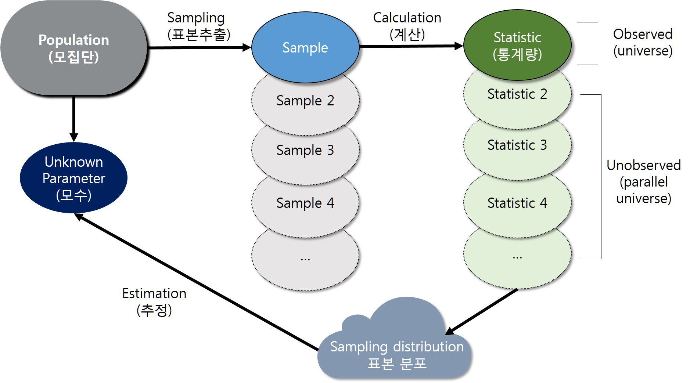

```{r setup, include=FALSE}
library(knitr)

# 출력 폭을 60자로 접는다 (bookdown 판에서 쓰던 linewidth 훅).
options(linewidth = 60)
hook_output <- knitr::knit_hooks$get("output")
knit_hooks$set(output = function(x, options) {
  if (!is.null(n <- options$linewidth)) {
    x <- knitr:::split_lines(x)
    if (any(nchar(x) > n)) x <- strwrap(x, width = n)
    x <- paste(x, collapse = "\n")
  }
  hook_output(x, options)
})

```


::: {.callout-important}
**학습 목표**

- 확률 문제를 **같은 무작위 실험을 여러 번 반복한 결과**로 바꾸어 R 코드로 옮기고, 이론값과 대조할 수 있다.
- 몬테카를로 추정값의 오차가 반복 횟수 $B$ 에 대해 $1/\sqrt{B}$ 로 줄어든다는 사실을 설명하고, 필요한 반복 횟수를 정할 수 있다.
- `set.seed()` 로 시뮬레이션 결과를 재현하되, 시드가 결과의 정확성을 보장하지 않는다는 점을 설명할 수 있다.
- 중심극한정리, 신뢰구간, 1종 오류, 검정력을 시뮬레이션으로 확인하고, 가정이 깨졌을 때 무엇이 달라지는지 보일 수 있다.
- **참값을 아는 가상의 자료**로 통계 함수와 AI 가 생성한 시뮬레이션 코드를 검증할 수 있다.

:::


8장에서는 직접 만든 함수의 결과를 `sort()`, `polyroot()`, `lm()` 처럼 **정답이 알려진 기준**과
대조해 검증했다. 그러나 늘 그런 기준이 있는 것은 아니다. 새로 만든 추정 방법이 모수를 제대로
맞히는지, 자료가 가정에서 조금 벗어나도 검정 결과를 믿어도 되는지는 정답표가 없다. 이럴 때 쓰는
방법이 시뮬레이션이다. **정답을 우리가 정해 둔 가상의 세계를 만들고, 그 세계에서 방법을 여러 번
시험한다.**

이 장은 시뮬레이션을 확률을 계산하는 도구이자, 이 강의 전체에 걸친 **검증의 도구**로 다룬다.
6장에서 익힌 경계 사례와 대조의 습관이 여기서 '반복'이라는 무기를 얻는다.


## 시뮬레이션과 몬테카를로 방법 {#sec-sim-basics}

시뮬레이션(simulation)은 현실에서 해 보기 어려운 일을 모형 안에서 대신 해 보는 방법이다. 비행
조종사는 시뮬레이터에서 엔진 고장에 대처하는 연습을 하고, 기상청은 대기의 모형을 여러 번 돌려
내일의 강수 확률을 낸다. 통계학에서 말하는 시뮬레이션은 **확률 모형에서 난수로 가상의 자료를
만들고, 같은 실험을 많이 반복해 그 결과로 확률이나 기댓값을 근사하는 방법**이다. 이런 방법을
몬테카를로 방법(Monte Carlo method)이라 한다. 2차 세계대전 중 원자폭탄 개발 계획에서 중성자의
움직임을 계산하던 연구자들이 도박 도시 몬테카를로의 이름을 암호명으로 붙인 데서 유래했다.


### 일상의 질문: 생일이 같은 사람이 있을까 {#sec-birthday}

40명이 수강하는 강의실에 생일이 같은 두 사람이 있을 확률은 얼마일까? 1년은 365일이고 40명은
그보다 훨씬 적으니 확률이 낮을 것 같다.


::: {.callout-tip}
**예측해 보자**: 40명 가운데 생일이 같은 사람이 적어도 한 쌍 있을 확률은 대략 얼마이겠는가?
(가) 10% 안팎, (나) 50% 안팎, (다) 90% 안팎. 실행하기 전에 골라 두자.

:::


40명을 여러 번 모아 볼 수는 없지만 컴퓨터 안에서는 얼마든지 가능하다. 먼저 **모형의 가정**을
정한다. 생일은 365일 가운데 하루를 같은 확률로, 서로 독립적으로 갖는다고 둔다(2월 29일은 없다고
본다). 이 가정대로 한 반을 만드는 절차를 코드로 옮긴다.


```{r birthday-one}
# 한 반(n명)을 만들고 생일이 겹치는 사람이 있는지 확인한다
has_shared_birthday <- function(n) {
  birthdays <- sample(1:365, n, replace = TRUE)   # 365일 중 하루씩, 복원 추출
  any(duplicated(birthdays))                       # 겹치는 생일이 하나라도 있는가
}

set.seed(2026)
has_shared_birthday(40)
has_shared_birthday(40)

```


한 번의 결과는 `TRUE` 나 `FALSE` 일 뿐 확률이 아니다. 같은 실험을 10,000번 반복해 `TRUE` 의
비율을 구한다. `replicate(B, 식)` 은 식을 `B` 번 실행해 결과를 모으는 함수이고, 논리값 벡터의
평균은 `TRUE` 의 비율이다(`TRUE` 는 1, `FALSE` 는 0 으로 계산된다).


```{r birthday-sim}
set.seed(2026)
result <- replicate(10000, has_shared_birthday(40))
mean(result)            # 생일이 겹친 반의 비율

```


이 문제는 손으로도 풀 수 있으므로 시뮬레이션을 **이론값과 대조**할 수 있다. 생일이 모두 다를
확률을 먼저 구하면 쉽다. 첫 사람은 아무 날이나 되고, 둘째 사람은 첫 사람과 다른 364일 가운데
하나, 셋째 사람은 남은 363일 가운데 하나여야 한다.

$$
 P(\text{적어도 한 쌍이 같음}) = 1 - \frac{365}{365}\times\frac{364}{365}\times\cdots\times\frac{365-n+1}{365}
$$


```{r birthday-exact}
exact_birthday <- function(n) 1 - prod((365 - 0:(n - 1)) / 365)
exact_birthday(40)

```


시뮬레이션 결과(`r round(mean(result), 3)`)와 이론값(`r round(exact_birthday(40), 3)`)이 소수
둘째 자리까지 일치한다. 답은 (다)다. 인원을 바꾸어 가며 확인해 보자.


```{r birthday-table}
set.seed(2026)
ns <- c(10, 23, 30, 40, 50)
data.frame(
  `사람 수` = ns,
  시뮬레이션 = sapply(ns, function(n) mean(replicate(10000, has_shared_birthday(n)))),
  이론값 = round(sapply(ns, exact_birthday), 4),
  check.names = FALSE
)

```


23명만 되어도 확률이 절반을 넘는다. 직관과 크게 다른 이 결과를 생일 문제(birthday problem)라
한다. 40명이면 두 사람씩 짝을 짓는 방법이 $\binom{40}{2} = 780$ 가지이므로 생일이 겹칠 기회가
생각보다 훨씬 많다.


::: {.callout-note}
**시뮬레이션의 답은 모형의 답이다.** 실제 출생일은 계절과 요일에 따라 고르지 않고, 쌍둥이도 있다.
모형이 이런 현실을 반영하지 않으면 시뮬레이션을 아무리 많이 반복해도 그 차이는 줄어들지 않는다.
**반복 횟수는 우연에 의한 오차를 줄일 뿐, 모형의 가정에서 생긴 오차는 줄이지 못한다.**

:::


### 몬테카를로 방법의 원리와 오차 {#sec-monte-carlo}

앞의 시뮬레이션이 통하는 이유는 대수의 법칙(law of large numbers)이다. 같은 실험을 독립적으로
반복하면 사건이 일어난 비율(상대도수)은 반복 횟수가 늘수록 그 사건의 확률에 가까워진다. 표본평균이
기댓값에 가까워지는 것도 같은 원리다. 반복할 때마다 그때까지의 비율을 기록해 보자.


```{r fig-mc-running, fig.width=9, fig.height=4.2, fig.cap="반복할수록 생일이 겹친 비율이 이론값(점선)에 가까워진다"}
set.seed(2026)
result <- replicate(5000, has_shared_birthday(40))
running <- cumsum(result) / seq_along(result)     # i 번째 반복까지의 비율

par(mar = c(4, 4, 1, 1))
plot(running, type = "l", ylim = c(0.7, 1), bty = "l",
     xlab = "반복 횟수", ylab = "생일이 겹친 비율")
abline(h = exact_birthday(40), col = "#A64B32", lty = 2, lwd = 2)

```


처음 몇십 번은 크게 흔들리다가 반복이 쌓일수록 점선 근처로 모인다. 그렇다면 몇 번을 반복해야
충분한가? 반복 결과의 비율 $\hat{p}$ 은 성공 확률이 $p$ 인 시행을 $B$ 번 한 결과의 표본비율이므로
표준오차(standard error)가 $\sqrt{p(1-p)/B}$ 다. 이를 **몬테카를로 오차**라 한다.


::: {.callout-tip}
**예측해 보자**: 반복 횟수 $B$ 를 100배로 늘리면 몬테카를로 오차는 몇 분의 1 로 줄어들겠는가?
실행 시간은 몇 배가 되겠는가?

:::


```{r mc-error}
set.seed(1)
Bs <- c(100, 1000, 10000, 100000)
mc <- t(sapply(Bs, function(B) {
  sec <- system.time(p <- mean(replicate(B, has_shared_birthday(40))))[["elapsed"]]
  c(추정값 = p, 실제오차 = abs(p - exact_birthday(40)),
    표준오차 = sqrt(p * (1 - p) / B), 초 = sec)
}))
data.frame(B = format(Bs, big.mark = ",", scientific = FALSE), round(mc, 4))

```


반복을 100배로 늘리면 표준오차는 1/10 로 준다. 실행 시간은 반복 횟수에 거의 비례해 늘어난다(10,000번에서
100,000번으로 늘리면 약 10배). **정확도의 자릿수를 하나 늘리려면 반복을, 곧 비용을 100배 치러야 한다.** 8장에서 다룬 비용의 관점이 시뮬레이션에도 그대로
적용된다. 실제 오차는 표준오차 근처에서 들쭉날쭉한데, 그것 역시 한 번의 시뮬레이션에서 생긴 우연이다.


::: {.callout-important}
**몬테카를로 추정값은 반드시 오차와 함께 읽는다.** 추정값 하나만으로는 그 값이 이론값과 다른지
판단할 수 없다. $B = 10{,}000$ 이고 $p$ 가 0.89 근처이면 표준오차는 약 0.003 이므로, 참값은
대략 추정값 $\pm$ 0.006 범위에 있다고 볼 수 있다(표준오차의 약 2배).

:::


### 난수와 재현성 {#sec-random-seed}

컴퓨터는 정해진 규칙대로 계산하는 기계이므로 진짜 난수를 만들지 못한다. R 이 만드는 난수는
**씨앗(seed)** 이라 부르는 출발값에서 시작해 정해진 규칙으로 계산해 낸 수열이며, 규칙을 모르는
사람에게는 무작위처럼 보인다. 이런 수를 유사난수(pseudo-random number)라 한다. 출발값이 같으면
수열도 같다.


```{r seed-demo}
set.seed(2026); runif(3)
set.seed(2026); runif(3)     # 같은 씨앗이면 같은 수열
runif(3)                     # 이어서 뽑으면 다음 수
RNGkind()                    # 난수 생성 방식: 기본은 메르센 트위스터

```


`set.seed()` 는 결과를 **재현**하기 위한 장치다. 보고서에 실은 시뮬레이션 결과를 다른 사람이, 또는
한 달 뒤의 내가 똑같이 다시 얻을 수 있어야 한다. 이 장의 모든 시뮬레이션 청크는 맨 앞에서
`set.seed()` 를 한 번 부른다.


::: {.callout-caution}
**시드는 결과를 고정할 뿐, 옳게 만들지 않는다.** 8장을 개편하며 옛 노트를 감사했을 때, 예제의
시드가 우연히 버그를 가려 렌더된 노트에서는 정상으로 보이던 결함이 있었다. 한 시드로 얻은 결과가
그럴듯해 보이면 시드를 바꾸어 결과가 몬테카를로 오차 안에서만 흔들리는지 확인한다.

:::


```{r seed-stability}
# 시드만 바꾸어 같은 시뮬레이션을 다섯 번 한다
sapply(1:5, function(s) {
  set.seed(s)
  mean(replicate(10000, has_shared_birthday(40)))
})

```


다섯 값은 이론값 `r round(exact_birthday(40), 3)` 을 중심으로 표준오차(약 0.003)의 두 배 남짓 안에서
흔들린다. 시드에 따라 달라지는 폭이 몬테카를로 오차로 설명되므로 이 시뮬레이션은 믿을 만하다.


## 확률과 기댓값의 추정 {#sec-sim-probability}

확률과 기댓값은 '무한히 반복했을 때'의 값으로 정의된다. 무한히 반복할 수는 없지만 충분히 많이
반복할 수는 있다. 이 절에서는 게임 두 가지로 확률과 기댓값을 추정하고 이론값과 대조한다. 두
게임은 뽑는 방식이 다르다. 주사위는 같은 눈이 다시 나올 수 있는 **복원 추출**, 카드는 한 번 뽑은
카드가 다시 나오지 않는 **비복원 추출**이다.


### 주사위 게임의 기댓값 {#sec-dice-game}

주사위 두 개를 던져 두 눈이 같으면 10,000원을 받고, 다르면 5,000원을 내는 게임이 있다. 이기면
받는 돈이 지면 내는 돈의 두 배이니 해 볼 만해 보인다.


::: {.callout-tip}
**예측해 보자**: 이 게임을 여러 번 하면 한 판에 평균적으로 얼마를 따거나 잃겠는가? 참가하겠는가?

:::


두 눈이 같을 확률은 $6/36 = 1/6$ 이므로 한 판의 상금 $X$ 의 기댓값은 다음과 같다.

$$
 E(X) = 10{,}000 \times \frac{1}{6} - 5{,}000 \times \frac{5}{6} = -2{,}500
$$

시뮬레이션으로 대조한다. 주사위를 한 번씩 던지는 반복문 대신 10만 번을 한꺼번에 던진다. 8장에서
본 것처럼 R 은 벡터 연산이 반복문보다 훨씬 빠르다.


```{r dice-game}
set.seed(2026)
B <- 100000
die1 <- sample(1:6, B, replace = TRUE)     # 첫째 주사위 10만 번
die2 <- sample(1:6, B, replace = TRUE)     # 둘째 주사위 10만 번
prize <- ifelse(die1 == die2, 10000, -5000)

mean(die1 == die2)    # 이긴 비율: 이론값 1/6 = 0.1667
mean(prize)           # 한 판당 평균 상금: 이론값 -2500

```


한 판에 평균 2,500원을 잃는 게임이다. 이기면 두 배를 받지만 이길 확률이 1/6 에 불과하기 때문이다.
**기댓값은 금액과 확률을 함께 따진 값**이며, 금액만 보고 내린 판단과 다를 수 있다.

주사위를 던질 때 `replace = TRUE` 가 중요하다. 이를 빼면 어떻게 되는지 보자.


```{r dice-no-replace, error=TRUE}
sample(1:6, 10)            # 여섯 개에서 열 개를 비복원으로 뽑을 수는 없다

set.seed(3)
sample(1:6, 6)             # 오류는 없지만 여섯 눈이 한 번씩만 나온다

```


첫 줄은 오류를 내며 멈추므로 곧바로 알아챈다. 위험한 쪽은 둘째 줄이다. 주사위를 여섯 번 던져
1부터 6까지가 정확히 한 번씩 나올 확률은 $6!/6^6 \approx 0.015$ 에 불과한데, 이 코드는 매번 그런
결과를 낸다. **오류 없이 틀린 모형**이다.


### 카드 짝 맞추기 게임 {#sec-matching-game}

1부터 13까지 번호가 적힌 카드 13장을 잘 섞은 뒤 한 장씩 뒤집는다. $i$ 번째로 뒤집은 카드의 번호가
$i$ 이면 '짝'이 맞은 것이다. 짝이 한 번이라도 맞으면 지고, 끝까지 한 번도 맞지 않으면 이긴다.


::: {.callout-tip}
**예측해 보자**: 질 확률은 얼마이겠는가? 카드가 52장으로 늘면 질 확률은 커지겠는가, 작아지겠는가?

:::


카드를 섞는 일은 비복원 추출이다. `sample(1:n)` 은 1부터 n 까지를 한 번씩 무작위 순서로 늘어놓는다.


```{r matching-one}
# 한 판: 카드를 섞고, 번호와 뒤집은 순서가 같은 곳이 있는지 본다
matching_game <- function(n_cards) {
  deck <- sample(1:n_cards)          # 비복원 추출: 1:n_cards 를 섞는다
  any(deck == 1:n_cards)             # 짝이 하나라도 맞으면 TRUE (진다)
}

set.seed(2027)
mean(replicate(10000, matching_game(13)))

```


이 확률도 이론값을 구할 수 있다. 포함배제의 원리로 계산하면 짝이 하나 이상 맞을 확률은
$1 - \sum_{k=0}^{n} (-1)^k / k!$ 이고, 카드가 많아질수록 $1 - 1/e \approx 0.632$ 에 다가간다.


```{r matching-table}
exact_matching <- function(n) 1 - sum((-1)^(0:n) / factorial(0:n))

set.seed(2033)
ns <- c(2, 3, 5, 13, 52)
data.frame(
  `카드 수` = ns,
  시뮬레이션 = sapply(ns, function(n) mean(replicate(20000, matching_game(n)))),
  이론값 = round(sapply(ns, exact_matching), 4),
  check.names = FALSE
)

1 - exp(-1)

```


카드가 13장이든 52장이든 질 확률은 약 0.632 로 거의 같다. 카드가 많아지면 한 장의 짝이 맞을 확률
$1/n$ 은 줄지만 짝이 맞을 기회($n$ 장)가 그만큼 늘어 서로 상쇄되기 때문이다. 이런 성질은 식을
세우기 전에 시뮬레이션으로 먼저 알아채는 경우가 많다. **시뮬레이션은 답을 확인하는 도구이면서
답을 짐작하게 해 주는 도구다.**


## 몬테카를로 적분 {#sec-mc-integration}

넓이, 곧 적분도 시뮬레이션으로 구할 수 있다. 넓이를 '무작위로 뿌린 점이 영역 안에 떨어질
확률'로 바꾸거나 '함수값의 평균'으로 바꾸면 된다. 식으로 적분하기 어렵거나 변수가 많은 적분에서
이 방법이 특히 쓸모 있다.


### 점을 뿌려 원주율 구하기 {#sec-hit-or-miss}

한 변이 1 인 정사각형 과녁에 눈을 감고 다트를 던진다고 하자. 과녁 안에 반지름 1 인 사분원을 그려
두면, 다트가 사분원 안에 꽂힐 확률은 넓이의 비 $\pi/4$ 다. 다트를 많이 던져 사분원 안에 꽂힌
비율을 4배 하면 원주율 $\pi$ 를 얻는다. 이렇게 점이 영역에 '맞았는지'를 세는 방법을
적중법(hit-or-miss method)이라 한다.


```{r fig-pi-points, echo=FALSE, fig.width=4.6, fig.height=4.6, out.width='55%', fig.cap="단위 정사각형에 뿌린 점 2,000개. 사분원 안에 든 점의 비율은 π/4 에 가깝다"}
set.seed(7)
px <- runif(2000); py <- runif(2000)
inside <- px^2 + py^2 <= 1
par(mar = c(4, 4, 1, 1))
plot(px, py, pch = 16, cex = 0.5, asp = 1, bty = "n", xlab = "x", ylab = "y",
     col = ifelse(inside, "#1F6F7A", "grey70"))
curve(sqrt(1 - x^2), 0, 1, add = TRUE, lwd = 2, col = "#A64B32")

```


```{r pi-hit}
estimate_pi <- function(n) {
  x <- runif(n)                    # 가로 좌표: 0 과 1 사이 균일분포
  y <- runif(n)                    # 세로 좌표
  4 * mean(x^2 + y^2 <= 1)         # 사분원 안에 든 비율의 4배
}

set.seed(2026)
estimate_pi(1000)

```


::: {.callout-tip}
**예측해 보자**: 점의 수를 100배로 늘릴 때마다 $\pi$ 의 소수점 아래 몇 자리가 더 맞겠는가?

:::


```{r pi-accuracy}
set.seed(2026)
ns <- 10^(2:7)
est <- sapply(ns, estimate_pi)
data.frame(`점의 수` = format(ns, big.mark = ",", scientific = FALSE),
           추정값 = est, `실제 오차` = signif(abs(est - pi), 2),
           `이론 표준오차` = signif(4 * sqrt((pi / 4) * (1 - pi / 4) / ns), 2),
           check.names = FALSE)

```


이론 표준오차 $4\sqrt{p(1-p)/n}$ ($p = \pi/4$) 는 점을 100배 늘릴 때마다 정확히 1/10 로 준다
(@sec-monte-carlo 의 $1/\sqrt{B}$). 실제 오차는 그 근처에서 우연에 따라 크거나 작게 나온다. 점
1,000만 개로도 소수점 아래 서너 자리가 한계다. 원주율을 구하는 방법으로는 비효율적이지만 **어떤 모양의 넓이든 같은 방법으로 구할 수
있다**는 점이 이 방법의 가치다.

점을 한 개씩 뿌리는 반복문과 한꺼번에 뿌리는 벡터 연산의 수행 시간도 비교해 두자.


```{r pi-loop}
# 점을 하나씩 뿌리는 반복문 구현
hit_pi_loop <- function(n) {
  hits <- 0
  for (i in 1:n) {
    xy <- runif(2)
    if (xy[1]^2 + xy[2]^2 <= 1) hits <- hits + 1
  }
  4 * hits / n
}

c(반복문 = system.time(hit_pi_loop(1e6))[["elapsed"]],
  벡터 = system.time(estimate_pi(1e6))[["elapsed"]])

```


결과는 같은데 벡터 연산이 수십 배 빠르다. 시뮬레이션은 같은 계산을 수만 번 되풀이하므로 이
차이가 곧 기다리는 시간의 차이다.


### 표본평균 방법 {#sec-sample-mean-mc}

적중법은 점이 '안에 들었는가'라는 0 과 1 의 정보만 쓰므로 낭비가 크다. 더 나은 방법은 적분을
기댓값으로 바꾸는 것이다. $U$ 가 구간 $(a, b)$ 의 균일분포를 따르면 밀도가 $1/(b-a)$ 이므로

$$
 \int_a^b f(x)\,dx = (b - a)\,E[f(U)] \approx (b - a)\,\frac{1}{n}\sum_{i=1}^{n} f(u_i)
$$

다. 구간에서 점을 고르게 뽑아 함수값의 평균을 내고 구간의 길이를 곱하면 된다. 옛 노트에서 쓰던
함수 $f(x) = 2 + \cos(x + \sin(\arctan x) + 3)$ 의 구간 $[1, 3]$ 넓이를 구해 보자.


```{r fig-mc-area, echo=FALSE, fig.width=7, fig.height=4, out.width='70%', fig.cap="구하려는 넓이(색칠한 부분). 적중법은 높이 4 의 사각형에 점을 뿌리고, 표본평균 방법은 곡선의 높이를 평균한다"}
f <- function(x) 2 + cos(x + sin(atan(x)) + 3)
xs <- seq(0.5, 3.5, length.out = 400)
par(mar = c(4, 4, 1, 1))
plot(xs, f(xs), type = "n", ylim = c(0, 4), bty = "l", xlab = "x", ylab = "f(x)")
idx <- xs >= 1 & xs <= 3
polygon(c(1, xs[idx], 3), c(0, f(xs[idx]), 0), col = "#E8D8CE", border = NA)
lines(xs, f(xs), lwd = 2, col = "#A64B32")
rect(1, 0, 3, 4, lty = 2)

```


```{r mc-mean}
f <- function(x) 2 + cos(x + sin(atan(x)) + 3)

mc_mean <- function(n, a = 1, b = 3) (b - a) * mean(f(runif(n, a, b)))

set.seed(2026)
mc_mean(10000)

integrate(f, 1, 3)        # 수치적분 함수로 대조한다

```


R 의 `integrate()` 는 적분 구간을 잘게 나누어 계산하는 수치적분 함수다. 두 값이 소수 둘째 자리까지
맞는다. 이제 두 방법의 효율을 비교한다. 같은 점 1,000개로 각 방법을 1,000번 반복하고, 추정값이
흩어진 정도(표준편차)를 본다.


::: {.callout-tip}
**예측해 보자**: 같은 점 1,000개를 쓸 때 적중법과 표본평균 방법 가운데 어느 쪽의 추정값이 더
흩어지겠는가? 차이는 어느 정도이겠는가?

:::


```{r mc-compare}
mc_hit <- function(n, a = 1, b = 3, height = 4) {
  x <- runif(n, a, b)
  y <- runif(n, 0, height)
  height * (b - a) * mean(y <= f(x))    # 사각형 넓이 x 곡선 아래에 든 비율
}

set.seed(2026)
hit <- replicate(1000, mc_hit(1000))
avg <- replicate(1000, mc_mean(1000))
data.frame(방법 = c("적중법", "표본평균 방법"),
           평균 = c(mean(hit), mean(avg)),
           표준편차 = c(sd(hit), sd(avg)))

```


두 방법 모두 평균은 참값 근처지만 표본평균 방법의 표준편차는 적중법의 약
`r round(sd(avg) / sd(hit), 2)` 배에 불과하다. 몬테카를로 오차는 점의 수의 제곱근에 반비례하므로, 같은
정확도를 적중법으로 얻으려면 점이 약 `r round((sd(hit) / sd(avg))^2)` 배 필요하다. **같은 비용으로
더 정확한 방법, 같은 정확도를 더 싸게 얻는 방법을 고르는 것도 알고리즘의 비용 문제다.**


### 뷔퐁의 바늘 {#sec-buffon}

1777년 프랑스의 박물학자 뷔퐁(Buffon)은 이런 문제를 냈다. 간격이 $d$ 인 평행선이 그어진 마룻바닥에
길이가 $l$ ($l \le d$) 인 바늘을 떨어뜨리면 바늘이 선에 걸칠 확률은 얼마인가? 답은 $\frac{2l}{\pi d}$
이다. 식에 $\pi$ 가 들어 있으므로, 바늘을 많이 던져 선에 걸친 비율 $\hat{P}$ 을 구하면
$\hat{\pi} = \frac{2l}{d \hat{P}}$ 로 원주율을 추정할 수 있다.


```{r fig-buffon-scheme, echo=FALSE, out.width='60%', fig.cap="뷔퐁의 바늘. 바늘 중심에서 가까운 선까지의 거리 a 와 바늘이 선과 이루는 각 θ 로 걸침 여부가 정해진다"}


```


바늘 중심에서 가장 가까운 선까지의 거리 $a$ 는 0 과 $d/2$ 사이에서, 바늘과 선이 이루는 각 $\theta$
는 0 과 $\pi$ 사이에서 고르게 정해진다고 본다. 바늘이 선에 걸치는 조건은
$a \le \frac{l}{2}\sin\theta$ 다.


```{r buffon}
buffon_pi <- function(n, l = 1, d = 2) {
  a <- runif(n, 0, d / 2)            # 바늘 중심에서 가장 가까운 선까지의 거리
  theta <- runif(n, 0, pi)           # 바늘과 선이 이루는 각
  p_hat <- mean(a <= (l / 2) * sin(theta))
  2 * l / (d * p_hat)
}

set.seed(2026)
buffon_pi(1e6)

```


::: {#fig-buffon-video}
<video src="video/buffon-pi-estimate.mp4" controls loop muted
       style="width:100%; max-width:640px;"></video>

바늘을 500번 던지는 동안 원주율 추정값이 참값(점선)으로 다가가는 모습
:::


::: {.callout-note}
**이 시뮬레이션에는 허점이 하나 있다.** 원주율을 추정하려고 각도를 `runif(n, 0, pi)` 로 뽑는데,
이때 이미 `pi` 를 썼다. 마룻바닥에 실제로 바늘을 던지는 실험은 원주율을 몰라도 할 수 있지만, 이
코드는 원주율을 알아야 돌아간다. 결과가 맞는 것과 별개로, **코드가 무엇을 전제하고 있는지 읽어
내는 것도 검증의 일부다.**

:::


## 표본분포와 중심극한정리 {#sec-sampling-distribution}

우리가 가진 자료는 모집단에서 뽑을 수 있었던 수많은 표본 가운데 하나다. 같은 임상시험을 다른 환자
40명으로 다시 하면 평균은 조금 다르게 나올 것이다. 이처럼 표본에서 계산한 값인 통계량(statistic)은
표본마다 달라지는 확률변수이며, 그 분포를 표본분포(sampling distribution)라 한다. 현실에서는 표본을
하나밖에 볼 수 없지만, 시뮬레이션에서는 **평행우주의 표본**을 원하는 만큼 만들 수 있다.


```{r fig-scheme-stat, echo=FALSE, out.width='85%', fig.cap="모집단, 표본, 통계량, 표본분포의 관계"}


```


### 표본분포: 평행우주의 통계량 {#sec-parallel-universe}

편의점 계산대에서 기다리는 시간이 평균 1분인 지수분포를 따른다고 하자. 대부분은 금방 끝나지만
가끔 아주 오래 기다리는, 한쪽으로 치우친 분포다. 손님 5명의 대기 시간을 재어 평균을 내는 조사를
생각한다.


```{r sampling-one}
set.seed(2026)
wait <- rexp(5, rate = 1)     # 손님 5명의 대기 시간(분). 모평균 1, 모표준편차 1
wait
mean(wait)                    # 이 표본의 평균

```


이 평균은 한 번의 조사에서 나온 값일 뿐이다. 같은 조사를 10,000번 한 평행우주를 만들어 표본평균이
어떻게 흩어지는지 본다.


```{r sampling-many}
set.seed(2026)
xbar5 <- replicate(10000, mean(rexp(5, rate = 1)))
c(평균 = mean(xbar5), 표준편차 = sd(xbar5), 이론_표준오차 = 1 / sqrt(5))

```


표본평균의 평균은 모평균 1 과 같고, 표준편차는 $\sigma/\sqrt{n} = 1/\sqrt{5} \approx 0.447$ 과
맞는다. 통계량의 표준편차를 표준오차라 부르며, 이론으로 알던 공식이 평행우주에서 그대로 확인된다.


### 중심극한정리 {#sec-clt}

모집단이 이렇게 치우쳐 있으면 표본평균의 분포도 치우쳐 있을까?


::: {.callout-tip}
**예측해 보자**: 대기 시간처럼 한쪽으로 크게 치우친 모집단에서 표본 30개의 평균을 10,000번 구해
히스토그램을 그리면 어떤 모양이겠는가?

:::


```{r fig-clt, fig.width=10, fig.height=3.6, fig.cap="지수분포 모집단에서 뽑은 표본평균의 분포. 표본 크기 n 이 커질수록 정규분포 곡선에 가까워진다"}
set.seed(2026)
op <- par(mfrow = c(1, 3), mar = c(4, 4, 2.5, 1))
for (n in c(1, 5, 30)) {
  xbar <- replicate(10000, mean(rexp(n, rate = 1)))
  hist(xbar, breaks = 50, freq = FALSE, col = "grey85", border = "white",
       main = paste0("n = ", n), xlab = "표본평균", ylab = "밀도")
  curve(dnorm(x, mean = 1, sd = 1 / sqrt(n)), add = TRUE, lwd = 2, col = "#A64B32")
}
par(op)

```


$n = 1$ 은 모집단 그 자체의 모양이다. $n$ 이 커질수록 치우침이 줄고 정규분포 곡선에 가까워진다.
이것이 중심극한정리(central limit theorem)다.


::: {.callout-note}
**중심극한정리**: 모평균이 $\mu$, 모분산이 $\sigma^2$ 인 모집단에서 뽑은 크기 $n$ 인 표본의 평균
$\bar{X}_n$ 은, 모집단의 분포와 관계없이 $n$ 이 커질수록 정규분포 $N(\mu, \sigma^2/n)$ 에 가까워진다.
t-검정과 신뢰구간이 정규분포가 아닌 자료에도 널리 쓰이는 근거다.

:::


::: {#fig-clt-video}
<video src="video/clt-chi.mp4" controls loop muted
       style="width:100%; max-width:640px;"></video>

카이제곱분포(자유도 3) 모집단에서 표본 크기를 1 부터 50 까지 늘릴 때 표본평균 분포의 변화
:::


그렇다면 $n$ 이 얼마면 '충분히 큰가'? 흔히 '30개 이상이면 정규분포로 본다'고 말한다. 이 경험
법칙도 시뮬레이션으로 확인할 수 있다. 분포의 치우친 정도를 재는 왜도(skewness)는 좌우 대칭이면
0 이다. 지수분포보다 훨씬 심하게 치우친 로그정규분포와 비교해 보자.


```{r clt-skew}
skewness <- function(x) mean(((x - mean(x)) / sd(x))^3)    # 0 이면 좌우 대칭

set.seed(2026)
n_sizes <- c(5, 30, 100)
data.frame(
  n = n_sizes,
  지수분포 = sapply(n_sizes, function(n) skewness(replicate(10000, mean(rexp(n))))),
  로그정규분포 = sapply(n_sizes, function(n) {
    skewness(replicate(10000, mean(rlnorm(n, meanlog = 0, sdlog = 1.5))))
  })
)

```


지수분포에서는 $n = 30$ 이면 표본평균의 왜도가 0.4 아래로 줄지만, 로그정규분포에서는 $n = 100$
에서도 크게 치우쳐 있다. '30개'는 모집단에 따라 충분하기도 하고 턱없이 부족하기도 하다. **경험
법칙도 시뮬레이션으로 확인할 수 있고, 확인해야 한다.** 이 차이가 신뢰구간에 어떤 결과를 낳는지는
@sec-assumption 에서 본다.


## 통계적 추론을 시뮬레이션으로 확인하기 {#sec-sim-inference}

신뢰구간과 가설검정은 '같은 연구를 무수히 반복하면'이라는 전제 위에 서 있다. 95% 신뢰구간은 반복의
95% 에서 모수를 포함하고, 유의수준 5% 의 검정은 귀무가설이 참인 연구의 5% 에서만 잘못 기각한다고
약속한다. 시뮬레이션은 그 반복을 실제로 해 본다. 참값을 우리가 정해 두었으므로 **방법이 약속을
지키는지 직접 셀 수 있다.**


### 신뢰구간의 의미 {#sec-ci-meaning}

모평균 $\mu$ 에 대한 95% 신뢰구간은 $\bar{x} \pm t_{0.975,\,n-1}\, s/\sqrt{n}$ 이다. 참값을 정해
두고 구간을 만들어 본다. 직접 만든 함수는 먼저 내장 함수 `t.test()` 와 대조한다.


```{r ci-one}
mu <- 50; sigma <- 10; n <- 20       # 참값을 정해 둔다

ci_mean <- function(x, level = 0.95) {
  half <- qt(1 - (1 - level) / 2, df = length(x) - 1) * sd(x) / sqrt(length(x))
  c(lower = mean(x) - half, upper = mean(x) + half)
}

set.seed(2026)
x <- rnorm(n, mean = mu, sd = sigma)
ci_mean(x)
t.test(x)$conf.int                   # 내장 함수와 대조

```


::: {.callout-tip}
**예측해 보자**: 같은 방법으로 신뢰구간을 100개 만들면 참값 $\mu = 50$ 을 포함하지 않는 구간은 몇
개쯤이겠는가?

:::


```{r fig-ci, fig.width=10, fig.height=4, fig.cap="같은 모집단에서 만든 95% 신뢰구간 100개. 색이 진한 구간은 참값 50(점선)을 놓쳤다"}
set.seed(2026)
cis <- t(replicate(100, ci_mean(rnorm(n, mean = mu, sd = sigma))))
miss <- cis[, "lower"] > mu | cis[, "upper"] < mu

par(mar = c(4, 4, 1, 1))
plot(NULL, xlim = c(1, 100), ylim = range(cis), bty = "l",
     xlab = "반복", ylab = "95% 신뢰구간")
segments(1:100, cis[, "lower"], 1:100, cis[, "upper"], lwd = 2,
         col = ifelse(miss, "#A64B32", "grey60"))
abline(h = mu, lty = 2)

```


100개 가운데 `r sum(miss)` 개가 참값을 놓쳤다. 10,000번 반복해 비율로 확인한다.


```{r ci-coverage}
set.seed(2026)
covered <- replicate(10000, {
  ci <- ci_mean(rnorm(n, mean = mu, sd = sigma))
  ci["lower"] <= mu && mu <= ci["upper"]
})
mean(covered)                     # 참값을 포함한 비율
sqrt(0.95 * 0.05 / 10000)         # 포함 확률이 0.95 일 때의 몬테카를로 표준오차

```


포함 비율이 0.95 에서 몬테카를로 오차 범위 안에 있다. 이 방법은 약속을 지킨다.


::: {.callout-caution}
**흔한 오해**: 구간 하나를 구해 놓고 "모평균이 이 구간에 있을 확률이 95% 다"라고 읽는 것. 모평균은
정해진 값이고 달라지는 것은 구간이다. 95% 는 **구간을 만드는 방법**이 반복의 95% 에서 참값을
포함한다는 뜻이다. 그림에서 흔들리는 것이 점선(참값)이 아니라 구간들이라는 점을 떠올리자.

:::


### 1종 오류와 p-값의 분포 {#sec-type1-error}

귀무가설이 참인데 이를 기각하는 잘못을 1종 오류(type I error)라 하고, 유의수준 $\alpha$ 는 그
확률의 상한으로 정해 두는 값이다. $\alpha = 0.05$ 로 검정하면, 귀무가설이 참인 연구 100개 가운데 약
5개에서 '유의한 차이'가 나와야 한다.


::: {.callout-tip}
**예측해 보자**: 두 집단의 모평균이 정말 같을 때(귀무가설이 참일 때) t-검정의 p-값은 어디에
몰리겠는가? (가) 1 근처, (나) 0.5 근처, (다) 0 과 1 사이에 고르게.

:::


```{r type1}
set.seed(2026)
p_null <- replicate(10000, {
  a <- rnorm(30, mean = 100, sd = 20)     # 두 집단의 모평균이 같다: 귀무가설이 참
  b <- rnorm(30, mean = 100, sd = 20)
  t.test(a, b)$p.value
})
mean(p_null < 0.05)                       # 기각한 비율 = 1종 오류율의 추정값

```


```{r fig-pnull, fig.width=7, fig.height=3.8, out.width='75%', fig.cap="귀무가설이 참일 때 p-값 10,000개의 분포. 0.05 왼쪽(선)에 전체의 약 5% 가 있다"}
par(mar = c(4, 4, 1, 1))
hist(p_null, breaks = 20, col = "grey85", border = "white", main = "",
     xlab = "p-값", ylab = "빈도")
abline(v = 0.05, col = "#A64B32", lwd = 2)

```


답은 (다)다. 귀무가설이 참이면 p-값은 0 과 1 사이에 고르게 흩어진다(균일분포). 그래서 0.05 보다
작은 p-값이 약 5% 나오고, 이것이 곧 1종 오류율이다. 한 번의 연구에서 $p = 0.03$ 을 얻었다고 해서
그 결과가 우연이 아니라는 보장은 없다. 귀무가설이 참인 연구 20개 가운데 하나는 그런 p-값을 낸다.


::: {.callout-important}
**p-값의 정의**: 귀무가설이 참이라고 가정할 때, 관측한 것만큼 또는 그보다 더 극단적인
검정통계량이 나올 확률. p-값은 귀무가설이 참일 확률이 아니며, 1종 오류를 범할 확률도 아니다.
1종 오류율은 검정을 하기 전에 정해 두는 $\alpha$ 다.

:::


### 검정력 {#sec-power}

대립가설이 참일 때, 곧 실제로 차이가 있을 때 이를 알아채는(귀무가설을 기각하는) 확률을
검정력(power)이라 한다. 두 모평균의 차이가 표준편차의 몇 배인지를 효과크기
$d = (\mu_2 - \mu_1)/\sigma$ 라 한다.


::: {.callout-tip}
**예측해 보자**: 효과크기가 0.2 인 차이를 집단당 30명으로 검정하면 몇 % 의 확률로 알아채겠는가?

:::


```{r power-sim}
sim_power <- function(n, d, B = 2000) {
  mean(replicate(B, t.test(rnorm(n, 0, 1), rnorm(n, d, 1))$p.value < 0.05))
}

set.seed(2026)
grid <- expand.grid(n = c(30, 100), d = c(0.2, 0.5, 0.8))
grid$시뮬레이션 <- mapply(sim_power, grid$n, grid$d)
grid$계산값 <- mapply(function(n, d) power.t.test(n = n, delta = d, sd = 1)$power,
                     grid$n, grid$d)
grid

```


효과크기 0.2 를 집단당 30명으로 검정하면 검정력이 약 11% 에 그친다. 실제로 차이가 있어도 열 번 중
아홉 번은 놓친다는 뜻이다. 표본을 100명으로 늘려도 약 29% 에 그친다.

시뮬레이션 결과가 `power.t.test()` 의 계산값과 몬테카를로 오차(반복 2,000번이면 최대 0.011) 안에서
일치하는 것도 확인하자. **식이 있는 문제에서는 식과 대조해 시뮬레이션 코드를 검증하고, 식이 없는
문제에서는 그렇게 검증된 시뮬레이션 코드로 답을 구한다.** 시뮬레이션을 믿을 수 있게 만드는 순서다.


### 가정이 깨지면 {#sec-assumption}

t-검정과 t-신뢰구간은 가정 위에서 약속을 지킨다. 자료가 정규분포에서 왔다는 가정, 그리고 등분산
t-검정(Student 의 t-검정)이라면 두 집단의 분산이 같다는 가정이다. 가정이 깨졌을 때 약속이 얼마나
깨지는지는 식으로 답하기 어렵지만 시뮬레이션으로는 쉽게 잴 수 있다.


::: {.callout-tip}
**예측해 보자**: 작은 집단(10명)의 표준편차가 3, 큰 집단(40명)의 표준편차가 1 이고 두 모평균은
같다. 등분산을 가정한 t-검정의 1종 오류율은 5% 를 지키겠는가?

:::


```{r assumption-var}
type1_rate <- function(n1, n2, sd1, sd2, var_equal, B = 5000) {
  mean(replicate(B, {
    a <- rnorm(n1, mean = 0, sd = sd1)       # 두 모평균이 같다: 귀무가설이 참
    b <- rnorm(n2, mean = 0, sd = sd2)
    t.test(a, b, var.equal = var_equal)$p.value < 0.05
  }))
}

set.seed(2026)
cases <- data.frame(n1 = c(10, 10, 25), n2 = c(40, 40, 25),
                    sd1 = c(3, 1, 3), sd2 = c(1, 3, 1))
cases$Student <- mapply(type1_rate, cases$n1, cases$n2, cases$sd1, cases$sd2, TRUE)
cases$Welch <- mapply(type1_rate, cases$n1, cases$n2, cases$sd1, cases$sd2, FALSE)
cases

```


작은 집단의 분산이 클 때 등분산 t-검정은 5% 가 아니라 약 `r round(100 * cases$Student[1])`% 의
확률로 틀린 결론을 낸다. 반대로 큰 집단의 분산이 클 때는 지나치게 보수적이 되어 차이를 잘 찾지
못한다. 두 집단의 크기가 같으면 분산이 달라도 5% 근처를 지킨다. 등분산을 가정하지 않는 Welch 의
t-검정은 세 경우 모두 약속을 지킨다. R 의 `t.test()` 가 `var.equal = FALSE`, 곧 Welch 검정을 기본값으로
삼는 이유다.

정규성 가정은 어떤가? @sec-clt 에서 본 로그정규분포에서 표본 20개로 95% 신뢰구간을 만들어 본다.


```{r assumption-skew}
set.seed(2026)
true_mean <- exp(1.5^2 / 2)            # 로그정규분포(0, 1.5)의 모평균
covered_skew <- replicate(10000, {
  ci <- ci_mean(rlnorm(20, meanlog = 0, sdlog = 1.5))
  ci["lower"] <= true_mean && true_mean <= ci["upper"]
})
mean(covered_skew)

```


'95% 신뢰구간'이라는 이름과 달리 실제로는 약 `r round(100 * mean(covered_skew))`% 만 참값을
포함한다. 이름표의 약속은 가정이 맞을 때의 약속이다. 자료가 가정에서 얼마나 벗어났을 때 결과를
믿을 수 없게 되는지는 **내 자료와 비슷한 조건으로 시뮬레이션을 해 보면** 알 수 있다.


::: {.callout-note}
**p-값에 관한 미국통계학회(ASA) 성명(2016)** 가운데 이 절과 관련된 원칙은 다음과 같다.

- p-값은 자료가 특정 통계 모형과 얼마나 맞지 않는지를 나타낼 수 있다.
- p-값은 연구 가설이 참일 확률도, 자료가 우연만으로 생겼을 확률도 아니다.
- 과학적 결론이나 정책 결정을 p-값이 특정 경계값을 넘었는지만으로 내려서는 안 된다.
- p-값이나 통계적 유의성은 효과의 크기나 결과의 중요성을 나타내지 않는다.

:::


## 시뮬레이션으로 코드 검증하기 {#sec-sim-code-check}

지금까지는 통계 이론을 시뮬레이션으로 확인했다. 같은 방법을 **코드**에도 쓸 수 있다. 참값을 정해
자료를 만들고, 함수가 그 참값을 되찾는지 본다. 정답표가 없는 함수를 검증하는 가장 일반적인
방법이다.


::: {.callout-important}
**시뮬레이션으로 검증하는 네 단계**

1. 참값(모수)을 정한다.
2. 그 참값을 가진 모형에서 자료를 만든다.
3. 검증할 함수를 자료에 적용한다. 2와 3을 여러 번 반복한다.
4. 결과를 참값과 대조하되, 몬테카를로 오차를 함께 본다.

:::


### 한 번의 예제로는 보이지 않는 결함 {#sec-bias-check}

누군가 분산을 구하는 함수를 이렇게 작성했다. 분산의 뜻을 그대로 옮긴 것처럼 보인다.


```{r my-var}
my_var <- function(x) mean((x - mean(x))^2)    # 편차 제곱의 평균

my_var(c(2, 4, 6))
var(c(2, 4, 6))

```


두 값이 다르다. 어느 쪽이 맞는가? `var()` 가 틀렸을 리 없다고 넘어갈 수도 있지만, 기준으로 삼을
내장 함수가 없는 새 추정량이라면 이런 대조조차 할 수 없다. 네 단계대로 묻는다. 모분산이 4 인
정규분포에서 표본 5개를 뽑아 분산을 추정하는 일을 10,000번 반복하면 추정값의 평균은 4 가 되는가?


::: {.callout-tip}
**예측해 보자**: `my_var()` 가 낸 추정값의 평균은 4 보다 크겠는가, 작겠는가, 같겠는가?
`var()` 와 `sd()` 는 어떻겠는가?

:::


```{r bias-sim}
set.seed(2026)
est <- replicate(10000, {
  x <- rnorm(5, mean = 0, sd = 2)       # 1. 참값: 모분산 4, 모표준편차 2
  c(my_var = my_var(x), var = var(x), sd = sd(x))
})
rowMeans(est)                           # 4. 추정값의 평균을 참값과 대조

```


`my_var()` 는 평균적으로 약 3.2 로, 모분산 4 를 **체계적으로 작게** 추정한다. 표본평균을 기준으로
편차를 구하면 편차가 모평균 기준보다 작아지기 때문이며, 이를 보정하려고 $n$ 대신 $n - 1$ 로 나눈
것이 표본분산 `var()` 다. 이론값 $4 \times \frac{n-1}{n} = 3.2$ 와도 맞는다. 이런 결함은 문법 오류도,
실행 오류도 내지 않고 **한 번의 예제로는 드러나지 않는다.** 여러 번 반복해 평균을 내야 비로소
보인다.

표의 맨 오른쪽도 보자. 표본분산은 평균적으로 모분산을 정확히 맞히지만(불편추정량), 그 제곱근인
표본표준편차 `sd()` 의 평균은 약 1.88 로 모표준편차 2 보다 작다. 제곱근을 씌우면 편향이 생긴다.
공식만으로는 알아채기 어려운 이런 사실도 시뮬레이션은 곧바로 보여 준다.


### 시뮬레이션 코드의 흔한 실수 {#sec-sim-pitfalls}

시뮬레이션 코드도 코드이므로 틀릴 수 있다. 오류 메시지 없이 그럴듯한 숫자를 내는 실수 세 가지를
보자.

**실수 1. 반복하는 함수 안에서 시드를 정한다.**


```{r pitfall-seed}
one_test <- function() {
  set.seed(1)                           # 부를 때마다 같은 씨앗으로 되돌아간다
  t.test(rnorm(30), rnorm(30))$p.value
}

p <- replicate(1000, one_test())
length(unique(p))                       # 서로 다른 p-값의 개수
mean(p < 0.05)                          # 1종 오류율의 '추정값'

```


1,000번 반복한 것 같지만 사실은 같은 실험 한 번을 1,000번 복사했을 뿐이다. 1종 오류율이 0 또는
1 로만 나올 수 있으니 이론값 0.05 와 대조했다면 바로 드러났을 실수다. 시드는 시뮬레이션 전체의 맨
앞에서 한 번만 정한다.

**실수 2. `rnorm()` 의 세 번째 인수에 분산을 넣는다.**


```{r pitfall-sd}
set.seed(2026)
var(rnorm(10000, mean = 0, sd = 4))     # 분산 4 를 의도했지만 표준편차 4 를 주었다

```


`rnorm(n, mean, sd)` 의 세 번째 인수는 분산이 아니라 **표준편차**다. 분산 4 를 원했다면 `sd = 2`
를 주어야 한다. 만든 자료의 분산을 한 번만 확인했어도 16 이라는 값에서 바로 알아챘을 것이다.

**실수 3. 원소가 하나인 벡터를 `sample()` 에 넣는다.**


```{r pitfall-sample}
set.seed(4)
sample(c(7, 9))          # 7 과 9 를 섞는다
sample(c(7))             # 7 하나를 섞는 것이 아니라 1:7 을 섞는다

```


`sample()` 은 길이가 1 인 수 $k$ 를 받으면 `1:k` 를 섞는다(`?sample`). 후보를 조건으로 좁히다가
원소가 하나만 남는 경계 사례에서 이 동작이 결과를 조용히 망친다. 벡터의 원소를 섞으려면
`x[sample(length(x))]` 처럼 **위치를 섞는다.**


::: {.callout-caution}
세 실수의 공통점은 **오류 메시지가 나오지 않는다**는 것이다. 시뮬레이션 코드를 믿으려면 먼저 답을
아는 경우(이론값, 내장 함수, `power.t.test()` 같은 계산식)로 코드를 시험하고, 만든 자료가 의도한
분포를 따르는지 평균과 분산을 확인한다. 그다음에 답을 모르는 문제에 쓴다.

:::


## AI와 함께: 시뮬레이션 코드의 검증 {#sec-ai-simulation}


::: {.callout-important}
**이 절의 목표**: AI 에게 1종 오류율을 추정하는 시뮬레이션 함수를 요청하고, 생성된 코드를 이 장의
검증 절차(답을 아는 경우와의 대조, 재현성, 독립 구현과의 대조)로 확인한다. 이어서 요청이 정하지
않은 부분을 AI 가 어떻게 채웠는지 찾아낸다.

:::


### 작업 요구사항 {#sec-ai-simulation-spec}

8장에서 본 것처럼 프롬프트는 곧 요구사항이다. 이번에도 수업에서 흔히 쓸 법한 수준으로만 요청했다.

> R로 독립 이표본 t-검정의 1종 오류율을 시뮬레이션으로 추정하는 함수를 만들어 줘.
> 두 집단의 표본 크기와 표준편차, 반복 횟수를 인수로 받고,
> 유의수준 0.05에서 귀무가설을 기각한 비율을 반환하면 돼.


::: {.callout-warning}
실제 연구 자료로 시뮬레이션을 설계할 때 개인정보나 공개되지 않은 연구 자료를 프롬프트에 붙여 넣지
않는다. 시뮬레이션에 필요한 것은 자료 그 자체가 아니라 **자료의 특징**(표본 크기, 평균, 표준편차,
분포의 모양)이다.

:::


### AI 가 생성한 코드 {#sec-ai-simulation-gen}

아래는 위 요청으로 실제로 받은 응답의 코드이며 **수정 없이 그대로 실었다.** 응답 전문(설계 설명과
`replicate()` 를 쓴 짧은 판 포함)은 `ai-transcripts/09-simulation/type1-error-sim.md` 에 있다.


```{r ai-sim-generated}
# 생성: Claude Sonnet 5, 2026-09-12. 수정 없이 그대로 수록.
sim_type1_error <- function(n1, n2, sd1, sd2, nsim = 10000, alpha = 0.05, seed = NULL) {
  if (!is.null(seed)) set.seed(seed)

  reject_count <- 0

  for (i in seq_len(nsim)) {
    x <- rnorm(n1, mean = 0, sd = sd1)
    y <- rnorm(n2, mean = 0, sd = sd2)   # 귀무가설(H0: mu1 = mu2)이 참이 되도록 두 집단의 평균을 0으로 같게 둔다

    p_value <- t.test(x, y)$p.value
    if (p_value < alpha) reject_count <- reject_count + 1
  }

  reject_count / nsim
}

```


응답은 코드와 함께 설계를 세 가지로 설명했다. 1종 오류율을 재려면 두 집단의 평균을 같게 두어야
한다는 점, `t.test()` 의 기본값이 Welch 검정이라는 점, 재현을 위해 `seed` 인수를 선택으로 두었다는
점이다. 설명도 코드도 그럴듯하다. 그럼에도 이 장의 절차대로 검증한다.


### 검증 {#sec-ai-simulation-verify}

**검증 1. 답을 아는 경우와 대조한다.** 두 집단의 크기와 표준편차가 같고 자료가 정규분포를 따르면
어떤 t-검정이든 1종 오류율은 0.05 여야 한다. 반복 10,000번의 몬테카를로 오차 범위도 함께 구한다.


```{r ai-sim-verify-known}
rate <- sim_type1_error(n1 = 20, n2 = 20, sd1 = 1, sd2 = 1, nsim = 10000, seed = 1)
rate
0.05 + c(-2, 2) * sqrt(0.05 * 0.95 / 10000)     # 이 범위 안이면 0.05 와 구별되지 않는다

```


**검증 2. 재현성을 확인한다.** 같은 `seed` 는 같은 값을, `seed` 를 주지 않으면 매번 다른 값을 내야
한다.


```{r ai-sim-verify-seed}
c(sim_type1_error(20, 20, 1, 1, nsim = 2000, seed = 7),
  sim_type1_error(20, 20, 1, 1, nsim = 2000, seed = 7))

c(sim_type1_error(20, 20, 1, 1, nsim = 2000),
  sim_type1_error(20, 20, 1, 1, nsim = 2000))

```


**검증 3. 독립적으로 작성한 구현과 대조한다.** @sec-assumption 에서 우리가 작성한 `type1_rate()`
를 Welch 검정으로 두고, 두 집단이 불균형한 조건에서 비교한다.


```{r ai-sim-verify-independent}
set.seed(2026)
c(AI_코드 = sim_type1_error(10, 40, 3, 1, nsim = 5000),
  이_장의_코드 = type1_rate(10, 40, 3, 1, var_equal = FALSE))

```


세 가지 검증을 모두 통과했다. **요구사항의 범위 안에서는** 이 코드가 옳다.


### 요구사항이 규정하지 않은 부분 {#sec-ai-simulation-gaps}

**미규정 1. 어떤 t-검정인가?** 요청은 '독립 이표본 t-검정'이라고만 했다. 통계학 입문 과목에서는
보통 두 집단의 분산이 같다고 가정하는 등분산 t-검정을 먼저 배운다. 이 AI 는 `t.test()` 의 기본값인
Welch 검정을 골랐고, 그 선택을 응답에 밝혀 두었다. 두 검정의 차이는 @sec-assumption 의 조건에서
크게 드러난다.


```{r ai-sim-gap-test}
set.seed(2026)
c(AI_코드_Welch = sim_type1_error(10, 40, 3, 1, nsim = 5000),
  등분산_검정이었다면 = type1_rate(10, 40, 3, 1, var_equal = TRUE))

```


학생이 알고 싶었던 것이 수업에서 배운 등분산 t-검정의 오류율이었다면, 이 함수는 **다른 질문에
정확하게 답한 것**이다. 결과 숫자만 받아 보고서에 옮겼다면 알아채기 어렵다. 응답의 설명까지 읽어야
드러나는 차이다.

**미규정 2. 자료는 어떤 분포를 따르는가?** 요청에 분포가 없으므로 코드는 정규분포(`rnorm()`)를
골랐다. 실제 자료가 한쪽으로 치우쳐 있다면 이 함수의 결과를 그 자료에 그대로 적용할 수 없고, 함수에
분포를 바꿀 수단도 없다.

**미규정 3. 추정값의 오차는 얼마인가?** 함수는 비율 하나만 돌려준다. 응답의 설명에는 '대략
0.045~0.055' 라는 범위가 나오지만 함수 결과에는 없다. 몬테카를로 추정값은 오차와 함께 읽어야 하므로
(@sec-monte-carlo), 표준오차를 함께 돌려주도록 고치는 편이 낫다.


```{r ai-sim-gap-se}
nsim <- 2000
rate <- sim_type1_error(20, 20, 1, 1, nsim = nsim, seed = 3)
c(추정값 = rate, 표준오차 = sqrt(rate * (1 - rate) / nsim))

```


**미규정 4. 표본 크기가 1 이면?**


```{r ai-sim-gap-n1, error=TRUE}
sim_type1_error(n1 = 1, n2 = 20, sd1 = 1, sd2 = 1, nsim = 10)

```


한 집단의 관측값이 하나뿐이면 분산을 추정할 수 없으므로 `t.test()` 가 오류를 내며 멈춘다. 조용히
틀린 값을 내는 것보다 낫다. 입력을 미리 검사해 이유를 알려 주는 메시지를 내도록 고칠 수 있다.


::: {.callout-caution}
**시뮬레이션 코드에서 자주 나타나는 오류 유형**

- **귀무가설을 참으로 만들지 않는다**: '1종 오류율'을 구한다면서 두 집단의 평균을 다르게 뽑는다.
  그러면 1종 오류율이 아니라 검정력을 재게 된다. 이번 응답은 이 점을 스스로 짚었지만, 사람이 쓴
  코드에서도 흔한 실수다. 이 강의의 옛 노트에도 '귀무가설이 참일 때'라고 설명해 놓고 두 집단의
  평균을 서로 다르게(0.75 와 2.33) 뽑은 시뮬레이션이 실려 있었다.
- **검정이나 방법을 명시하지 않는다**: `var.equal` 처럼 결과를 크게 바꾸는 선택을 기본값에 맡긴다.
- **반복 안에서 시드를 정한다**: 모든 반복이 같은 자료를 쓴다(@sec-sim-pitfalls).
- **오차 없이 결론을 낸다**: 0.053 이 0.05 와 다른지 몬테카를로 오차로 판단하지 않는다.

이 유형들의 공통점도 **오류 메시지가 나오지 않는다**는 것이다.

:::


### 연습 {#sec-ai-simulation-practice}

1. 요구사항에 "등분산을 가정하는 t-검정을 쓴다"를 추가해 다시 요청하고, 생성된 코드의 결과를
@sec-assumption 의 표와 대조하시오.
2. 요구사항에 "두 집단의 자료가 로그정규분포를 따르는 경우도 다룰 수 있게 한다"를 추가해 요청하시오.
두 집단의 `sdlog` 를 다르게 주었을 때, 생성된 함수가 두 집단의 **모평균**을 정말 같게 만드는지
확인하시오(힌트: 로그정규분포의 모평균은 $e^{\mu + \sigma^2/2}$ 이다).
3. 두 사람이 코드를 교환한다. 상대의 `sim_type1_error()` 에 결함을 하나 넣어 돌려주고, 이 절의 세
가지 검증으로 서로 찾아내시오. 몇 번째 검증에서 발견했는지 기록하시오.


## 연습문제 {#sec-ex-simulation .unnumbered}

**읽기 문항** (실행하지 말고 답을 먼저 적은 뒤 확인할 것)

1. 다음 코드가 추정하는 값은 무엇이며, 대략 얼마가 나오겠는가?

    ```r
    mean(replicate(10000, sum(sample(1:6, 2, replace = TRUE)) == 7))
    ```

2. 한 학생이 어떤 검정의 1종 오류율을 반복 1,000번으로 추정해 0.061 을 얻고 "이 검정은 5% 를
지키지 않는다"고 결론 내렸다. 몬테카를로 표준오차를 계산해 이 결론이 타당한지 판단하시오.

3. 다음 두 코드의 결과가 어떻게 다른지, 주사위 여섯 번 던지기의 모형으로 어느 쪽이 맞는지 설명하시오.

    ```r
    sample(1:6, 6)
    sample(1:6, 6, replace = TRUE)
    ```

4. 95% 신뢰구간 $[48.2, 55.1]$ 을 두고 "모평균이 이 구간 안에 있을 확률은 95% 다"라고 해석했다.
무엇이 잘못되었는지 @sec-ci-meaning 의 그림을 근거로 설명하시오.

5. @sec-sim-pitfalls 의 `one_test()` 로 1종 오류율을 올바르게 추정하려면 `set.seed()` 를 어디로
옮겨야 하는가? 옮긴 뒤의 결과가 어느 범위에 있어야 하는지도 적으시오.

**쓰기 문항**

6. 생일 문제에서 확률이 처음으로 0.5 를 넘는 인원을 이론값으로 찾고, 그 인원에서 시뮬레이션 결과가
이론값과 몬테카를로 오차 안에서 일치하는지 확인하시오.

7. @sec-dice-game 의 게임에서 이겼을 때 받는 돈을 얼마로 바꾸면 기댓값이 0 인 공정한 게임이 되는지
계산하고, 시뮬레이션으로 확인하시오.

8. 표본평균 방법으로 $\int_0^1 e^{-x^2}\,dx$ 를 추정하고 `integrate()` 와 대조하시오. 점의 수를
100, 10,000, 1,000,000 으로 바꾸어 가며 몬테카를로 표준오차를 함께 보고하시오.

9. 표준정규분포에서 표본 10개를 뽑을 때 표본평균과 표본중앙값(`median()`) 가운데 어느 쪽의
표준오차가 더 작은지 시뮬레이션으로 비교하시오. 모집단이 자유도 2 인 t분포라면 결론이 어떻게
달라지는가?

10. @sec-assumption 의 로그정규분포 예에서 표본 크기를 20, 50, 200 으로 늘릴 때 t-신뢰구간의 포함
확률이 어떻게 변하는지 시뮬레이션하시오. 몇 개부터 0.95 에 가깝다고 할 수 있는가?
