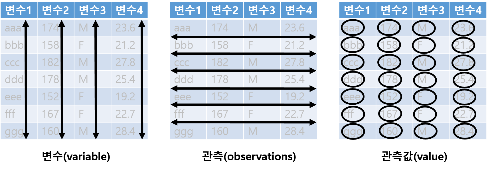
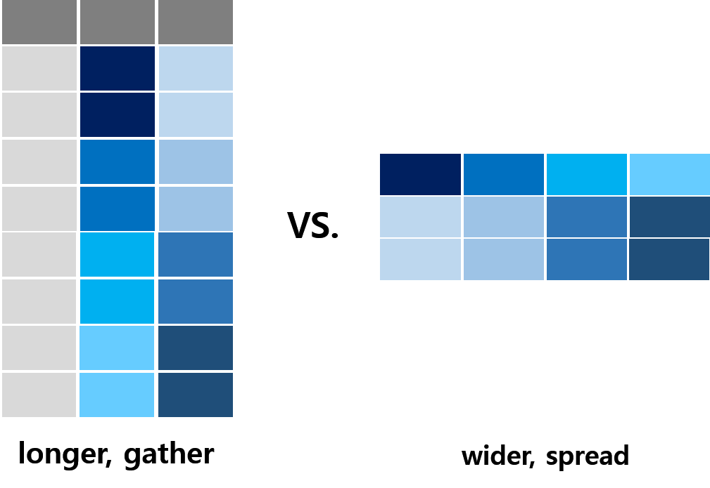
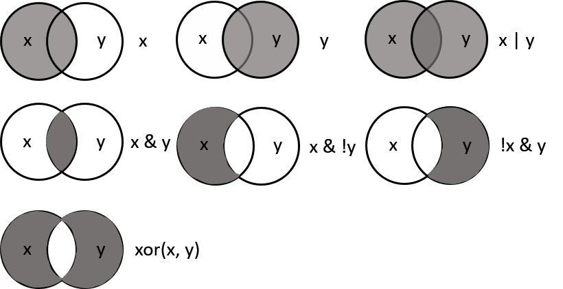
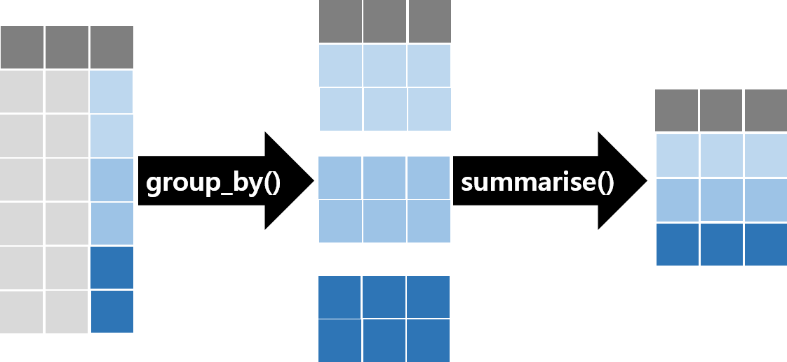
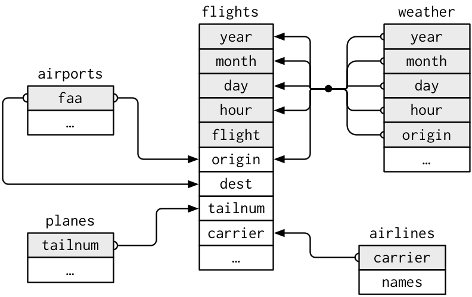
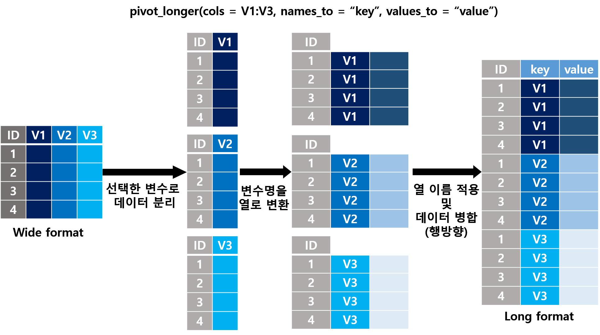
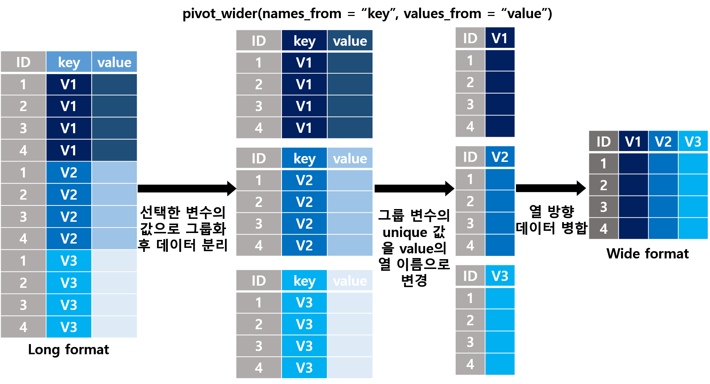

```{r setup, include=FALSE}
library(knitr)
library(readr)
library(dplyr)
library(tidyr)
library(ggplot2)
library(nycflights13)
options(readr.show_col_types = FALSE)

# 슬라이드는 폭이 좁다. 출력 폭을 46자로 접는다.
options(linewidth = 46, width = 46)
hook_output <- knitr::knit_hooks$get("output")
knit_hooks$set(output = function(x, options) {
  if (!is.null(n <- options$linewidth)) {
    x <- knitr:::split_lines(x)
    if (any(nchar(x) > n)) x <- strwrap(x, width = n)
    x <- paste(x, collapse = "\n")
  }
  hook_output(x, options)
})
f2 <- function(x) format(x, big.mark = ",", scientific = FALSE)

titanic    <- read_csv("dataset/titanic3.csv")
libraries  <- read_csv("dataset/ch12/libraries.csv")
loans_wide <- read_csv("dataset/ch12/loans-2026.csv")
population <- read_csv("dataset/ch12/sido-population.csv")
kpl <- 1.609344 / 3.785411784
```


## 이 수업에서 다루는 것

::: {.keypoint}
변환은 오류 없이 끝나도 **행이 빠지거나 늘어남**: 변환마다 **보존되어야 할 것**을 정하고 대조
:::

<br>

| | 절 | 내용 | 자료 |
|:--|:--|:--|:--|
| 1 | 데이터의 모양 | 한 행은 무엇인가, tidy data, 파이프 | 타이타닉, mpg |
| 2 | 행과 열 고르기 | filter() 와 결측값, %in%, select(), arrange() | mpg, 타이타닉 |
| 3 | 열 만들고 바꾸기 | mutate(), case_when() 의 순서, recode_values(), across() | mpg, 타이타닉 |
| 4 | 집단별로 요약하기 | .by 와 group_by(), 개수 세기, 결측과 요약 | mpg, 타이타닉 |
| 5 | 표 합치기 | 키, 결합의 종류, 행 수가 바뀌는 두 경우, relationship | 항공편, 도서관 |
| 6 | 모양 바꾸기 | pivot_longer(), pivot_wider(), 왕복 검사, 열 나누기 | 차트, 결핵, 도서관 |
| 7 | 변환 절차 검증하기 | 불변량, 검증 함수, 공개 자료와 대조 | 도서관, Gapminder |
| 8 | AI와 함께 | 데이터 변환 코드의 검증 | 도서관 |

: {tbl-colwidths="[5,23,52,20]"}

::: {.notes}
전체 지도입니다.

1절에서는 표를 바꾸기 전에 한 행이 무엇인지 정합니다. 2절부터 4절까지는 행을 고르고, 열을 만들고, 집단별로 요약하는 함수들입니다. 함수는 자동차 연비 자료 mpg 와 타이타닉 승객 자료로 익힙니다. 함수 이름을 외우는 게 목적이 아니라, 결과가 달라지는 지점을 먼저 예측하고 확인하는 게 목적입니다.

5절이 오늘 가장 중요한 표 합치기입니다. 행 수가 가장 크게, 가장 조용히 바뀌는 곳입니다. 뉴욕 항공편 자료로 키와 결합을 익히고, 도서관 자료로 결합을 검증합니다. 6절은 표의 모양 바꾸기입니다.

7절에서 지금까지의 대조를 모아 하나의 절차로 만들고, Gapminder 라는 공개 자료로 같은 절차를 밟습니다. 8절에서 AI 가 짜 준 변환 코드를 그 절차로 검증합니다.
:::


# [1]{.secno} 데이터의 모양 {.section-title}

::: {.columns}
::: {.column width="54%"}
표를 바꾸기 전에 **한 행이 무엇인지** 정하기

같은 정보를 담는 **여러 모양의 표**
:::
::: {.column width="46%"}
[이 절에서]{.label}

- 한 행은 무엇인가
- 같은 정보, 다른 모양
- 절차를 파이프로 적기
:::
:::

::: {.keypoint .teal}
**이 절이 답하는 질문**: 이 표의 **한 행**은 무엇이고, 그 말이 **맞는가**?
:::

::: {.notes}
1절입니다. 표를 바꾸기 전에 할 일이 있습니다. 이 표의 한 행이 무엇인지 정하는 겁니다.

그리고 같은 정보도 여러 모양의 표에 담을 수 있다는 것, 모양에 따라 쉬운 계산과 어려운 계산이 갈린다는 것을 봅니다.
:::


## [1.1]{.secno} 한 행은 무엇인가

::: {.columns}
::: {.column width="48%"}
{width="100%"}

- 같은 속성을 잰 값의 모임: **변수**(열)
- 같은 대상에서 잰 값의 모임: **관측**(행)
- 한 행이 가리키는 대상: **관측 단위**
- 행을 구별하는 열: **키**(key)
:::
::: {.column width="52%"}
[타이타닉 승객 1,309명: 한 행은 승객 한 명]{.label .label-slide}

```{r titanic-name-key}
#| collapse: true
c(행 = nrow(titanic),
  이름 = n_distinct(titanic$name))
titanic |> count(name) |> filter(n > 1)
```

- 같은 이름의 **다른 승객**: 나이와 표 번호가 다름
- mpg: 234행 가운데 **열 11개가 모두 같은 행** 9쌍

::: {.keypoint}
키 후보가 정말 행마다 다른지 **세어서 확인**: `n_distinct()`, `count() |> filter(n > 1)`
:::
:::
:::

::: {.notes}
표는 값으로 이루어집니다. 왼쪽 그림처럼 같은 속성을 잰 값들이 모이면 변수, 열이 되고, 같은 대상에서 잰 값들이 모이면 관측, 행이 됩니다. 그래서 표를 받으면 먼저 한 행이 무엇을 가리키는지 묻습니다. 이걸 관측 단위라고 합니다.

오른쪽은 타이타닉 승객 자료입니다. 한 행이 승객 한 명이지요. 그렇다면 이름으로 행을 구별할 수 있을까요? 행은 1,309 인데 서로 다른 이름은 1,307 입니다. 두 이름이 두 번씩 나옵니다. 찾아보면 나이도 표 번호도 다른, 이름이 같은 다른 승객입니다. 이 표에서 이름은 키가 아닙니다.

자동차 연비 자료 mpg 는 더 심합니다. 234 행 가운데 열 11개가 모두 같은 행이 9쌍 있습니다. 원자료에서 열 일부만 남긴 자료라서, 남은 열이 같다고 같은 차라는 보장은 없습니다. 이런 표에는 행을 구별하는 키가 없습니다.

키로 쓸 열이 정말 행마다 다른지는 눈으로 보지 말고 세어서 확인합니다.
:::


## [1.2]{.secno} 같은 정보, 다른 모양

::: {.columns}
::: {.column width="52%"}
[사람마다 한 행: 처치 a, b 가 열 이름]{.label .label-note}

```{r trial-wide}
trial <- tribble(
  ~name,      ~a, ~b,
  "James",    NA,  1,
  "Kimberly", 17, 14,
  "Lalo",      8, 19)
```

[변수 하나가 열 하나: tidy data]{.label .label-slide}

```{r trial-long}
#| collapse: true
trial_long <- trial |>
  pivot_longer(c(a, b), names_to = "treatment",
               values_to = "result")
head(trial_long, 3)
```
:::
::: {.column width="48%"}
[tidy data 원칙: Wickham(2014)]{.label}

::: {}
1. 변수 하나는 **열** 하나
2. 관측 하나는 **행** 하나
3. 관측 단위 하나는 **표** 하나
:::

::: {}
- 이 실험의 변수: 사람, 처치, 결과
- 첫 표는 **처치의 값**이 열 이름 속에
:::

```{r trial-invariants}
#| collapse: true
c(행 = nrow(trial_long), 사람x처치 = 3 * 2)
c(sum(is.na(trial[, c("a", "b")])),
  sum(is.na(trial_long$result)))
```
:::
:::

::: {.notes}
세 사람에게 두 가지 처치를 하고 결과를 잰 가상의 실험입니다. Wickham 이 tidy data 를 설명한 논문에 나오는 예를 옮겼습니다.

왼쪽 위는 사람마다 한 행으로 적은 표입니다. James 는 처치 a 의 결과가 없습니다. 이 실험에서 변수는 무엇일까요? 사람, 처치, 결과 셋입니다. 그런데 이 표에서는 처치의 값인 a 와 b 가 열 이름에 들어가 있습니다.

pivot_longer 로 접으면 한 행이 한 사람의 한 처치가 됩니다. 모든 열이 변수이고 모든 행이 관측이지요. 이 모양을 tidy data 라고 부르고 오른쪽 세 원칙으로 정리합니다. dplyr 과 ggplot2 는 이 모양을 전제로 만들어졌습니다.

오른쪽 아래가 오늘 첫 대조입니다. 모양만 바꿨으니 보존되어야 할 게 있지요. 행은 사람 3명 곱하기 처치 2가지로 6, 결측값은 여전히 하나. 둘 다 맞습니다.
:::


## [1.2]{.secno} 원칙을 어긴 흔한 두 모양

::: {.columns}
::: {.column width="46%"}
{width="88%"}

[그림의 gather, spread 는 pivot_longer(), pivot_wider() 의 이전 이름]{.label .label-note}
:::
::: {.column width="54%"}
**1. 열 이름이 변수의 값**: 연도가 열

```{r messy-years, echo=FALSE}
gdp_wide <- read_csv("dataset/ch12/gdp-per-capita-wide.csv")
kable(gdp_wide[, 1:4] |> mutate(across(-country, round)))
```

**2. 한 칸에 두 변수**: 환자 수와 인구

```{r messy-rate, echo=FALSE}
kable(head(table3, 2))
```

::: {.keypoint}
tidy data **≠ 긴 표**: 무엇이 변수인지가 모양을 정함, 넓게 **펴야** tidy 가 되는 표도 있음(6.2)

넓은 표는 **사람에게 보여 줄 때**, tidy data 는 **계산할 때**
:::
:::
:::

::: {.notes}
원칙을 어긴 표에서 흔히 보이는 모양은 두 가지입니다. 둘 다 6절에서 고칩니다.

첫째, 열 이름이 변수의 값인 표입니다. 세 나라의 1인당 GDP 인데 연도가 열 이름이지요. 연도는 변수의 값입니다. 둘째, 한 칸에 두 변수가 들어 있는 표입니다. 745 슬래시 1998만, 환자 수와 인구가 한 칸에 적혀 있습니다.

왼쪽 그림은 이전 강의노트에 있던 그림으로 긴 표와 넓은 표를 비교합니다. 그림에 적힌 gather 와 spread 는 지금의 pivot_longer, pivot_wider 의 옛 이름입니다.

오해하기 쉬운 점이 있습니다. tidy data 가 곧 긴 표라는 뜻은 아닙니다. 무엇이 변수인지가 모양을 정합니다. 6절에서 긴 표를 넓게 펴야 tidy 가 되는 경우를 봅니다. 그리고 넓은 표가 틀린 것도 아닙니다. 사람에게 보여 줄 표는 넓은 표가, 계산할 때는 tidy data 가 편합니다.
:::


## [1.3]{.secno} 절차를 파이프로 적기

::: {.columns}
::: {.column width="54%"}
[setosa 의 네 측정값 평균: 색인과 파이프]{.label .label-note}

```{r pipe-iris}
#| collapse: true
apply(iris[iris$Species == "setosa", -5], 2, mean)
iris |>
  filter(Species == "setosa") |>
  select(-Species) |>
  summarise(across(everything(), mean))
```

- `동사(목적어, 인수)` 를 `목적어 |> 동사(인수)` 로
- 적힌 **순서대로 읽힘**: 8장의 약속된 절차
:::
::: {.column width="46%"}
[|> 와 %>% 의 차이]{.label .label-slide}

::: {}
| | `%>%` | `|>` |
|:--|:--|:--|
| 괄호 없는 함수 | `x %>% nrow` 가능 | `x |> nrow` **오류** |
| 자리표시자 | `data = .` | `data = _` (이름 붙인 인수만) |

: {tbl-colwidths="[30,35,35]"}
:::

- 인터넷과 이전 노트의 `%>%` 도 구식 아님: 한 절차 안에서 **한 가지로 통일**

::: {.keypoint}
**이름이 같은 함수**: 나중에 불러온 패키지가 가림

`MASS::select(mpg, cty)`: unused argument 오류, 낯설면 `dplyr::select()`
:::
:::
:::

::: {.notes}
데이터 핸들링은 여러 단계의 변환을 차례로 적용하는 절차입니다.

왼쪽 위는 이전 강의노트의 예입니다. iris 에서 setosa 종의 네 측정값 평균을 구합니다. 첫 줄은 색인과 apply 로 구했습니다. 마이너스 5 가 무슨 열인지, 2 가 행인지 열인지 알아야 읽힙니다.

아래는 같은 일을 파이프로 적었습니다. setosa 행을 고르고, 종 열을 빼고, 모든 열의 평균. 적힌 순서대로 읽힙니다. 함수를 "동사 괄호 목적어"로 쓰던 것을 "목적어 파이프 동사"로 쓰는 셈입니다. 8장에서 알고리즘을 약속된 절차라고 했지요. 파이프는 그 절차를 한 줄에 한 단계씩 적는 방법입니다.

오른쪽은 두 파이프의 차이입니다. 내장 파이프는 오른쪽에 반드시 괄호가 있는 함수 호출이 와야 하고, 자리표시자가 점이 아니라 밑줄이며 이름을 붙인 인수에만 쓸 수 있습니다. 어느 쪽이 구식인 건 아닙니다. 한 절차 안에서만 한 가지로 통일하세요.

아래 상자. 여러 패키지에 같은 이름의 함수가 있으면 나중에 불러온 패키지가 가립니다. MASS 패키지에도 select 가 있어서, MASS 를 나중에 불러오면 익숙한 select 가 unused argument 라는 낯선 오류를 냅니다. 이럴 때는 앞에 dplyr 콜론 콜론을 붙여 보세요.
:::


# [2]{.secno} 행과 열 고르기 {.section-title}

::: {.columns}
::: {.column width="54%"}
필요한 행과 열만 남기기

**행 수를 바꾸는 함수는 filter() 뿐**: 조용한 오류도 여기서
:::
::: {.column width="46%"}
[이 절에서]{.label}

- filter(): 조건에 맞는 행
- select() 와 rename(): 열 고르기
- arrange() 와 slice_max(): 정렬과 상위 행
:::
:::

::: {.keypoint .teal}
**이 절이 답하는 질문**: 조건으로 나눈 조각들의 **행 수를 더하면** 원래 행 수인가?
:::

::: {.notes}
2절입니다. 표에서 필요한 행과 열만 남기는 함수들입니다.

select 는 열을, arrange 는 순서를 바꿀 뿐 행 수는 그대로입니다. 행 수를 바꾸는 건 filter 뿐이고, 그래서 조용한 오류도 대부분 여기서 생깁니다. 이 절의 질문은 조건으로 나눈 조각들의 행 수를 더하면 원래 행 수가 되는가입니다.
:::


## [2.1]{.secno} filter(): 조건이 TRUE 인 행

::: {.columns}
::: {.column width="52%"}
[mpg: 자동차 38개 모델의 1999년식과 2008년식 연비]{.label .label-note}

```{r filter-mpg}
#| collapse: true
mpg |> filter(manufacturer == "hyundai") |>
  nrow()
mpg |> filter(cty >= 20, class == "suv") |>
  select(model, cty, class)
mpg |>
  filter(manufacturer == "audi" |
           manufacturer == "volkswagen",
         hwy >= 30) |>
  nrow()
```

- 쉼표로 적은 조건: **모두 참**(`&`)
- 둘 중 하나는 `|`, 아니다는 `!`
:::
::: {.column width="48%"}
{width="42%"}

{width="84%"}
:::
:::

::: {.notes}
filter 는 조건이 참인 행만 남깁니다. 오른쪽 위 그림처럼 조건에 맞는 행만 걸러 내지요.

왼쪽은 자동차 연비 자료 mpg 입니다. 미국에서 판매된 38개 모델의 1999년식과 2008년식 자료로, 제조사, 배기량, 시내 연비 cty, 고속도로 연비 hwy 같은 열이 있습니다.

현대 자동차는 14 대. 시내 연비 20 이상인 SUV 는 두 대입니다. 조건을 쉼표로 여러 개 적으면 모두 참인 행만 남습니다. 세 번째는 아우디 또는 폭스바겐이면서 고속도로 연비 30 이상, 다섯 대입니다. 또는은 세로 막대로 적습니다.

오른쪽 아래 그림은 두 조건 x, y 를 조합했을 때 남는 부분입니다. 그리고, 또는, 아니다를 조합하면 이 모든 경우를 고를 수 있습니다.
:::


## 예측해 보자 {.predict}

아우디(18대)와 폭스바겐(27대)을 모두 고르려는 두 코드: 결과가 같을까?

```r
mpg |> filter(manufacturer == c("audi", "volkswagen"))
mpg |> filter(manufacturer %in% c("audi", "volkswagen"))
```

::: {.options}
::: {}
**A** 둘 다 45행
:::
::: {}
**B** 첫 코드는 경고와 함께 오류
:::
::: {}
**C** 첫 코드는 경고 없이 45행이 아님
:::
:::

::: {.why}
`==` 는 두 벡터를 **같은 위치끼리** 비교
:::

::: {.notes}
첫 번째 예측입니다. 아우디 18대와 폭스바겐 27대, 합쳐서 45대를 고르려고 합니다. 위 코드는 같다 기호에 벡터를 줬고, 아래는 %in% 을 썼습니다.

말로 읽으면 둘 다 "제조사가 아우디나 폭스바겐인 행"처럼 들리지요. 결과가 같을까요? 힌트는 아래 줄입니다. 같다 기호는 두 벡터를 같은 위치끼리 비교합니다.
:::


## [2.1]{.secno} 여러 값 가운데 하나는 %in%

::: {.columns}
::: {.column width="46%"}
```{r filter-recycle}
#| collapse: true
mpg |>
  filter(manufacturer ==
           c("audi", "volkswagen")) |>
  nrow()
mpg |>
  filter(manufacturer %in%
           c("audi", "volkswagen")) |>
  nrow()
```

- 짧은 벡터가 **되풀이**: 홀수 행은 audi, 짝수 행은 volkswagen 과 비교
:::
::: {.column width="54%"}
[== 가 실제로 한 비교]{.label .label-note}

::: {}
| 행 | manufacturer | 비교한 값 | 결과 |
|:--|:--|:--|:--|
| 1 | audi | audi | **TRUE** |
| 2 | audi | volkswagen | FALSE |
| 3 | audi | audi | **TRUE** |
| 208 | volkswagen | volkswagen | **TRUE** |
| 209 | volkswagen | audi | FALSE |

: {tbl-colwidths="[12,34,34,20]"}
:::

::: {.keypoint}
정답은 **C**: 234행은 2의 배수라 **경고도 없음**

"여러 값 가운데 하나"는 **%in%**
:::
:::
:::

::: {.notes}
답은 C 입니다. 첫 코드는 23대만 골랐고 경고도 없습니다. %in% 은 45대고요.

오른쪽 표가 같다 기호가 실제로 한 비교입니다. 제조사 열은 길이 234 이고 비교할 벡터는 길이 2 입니다. R 은 짧은 쪽을 되풀이해서 길이를 맞춥니다. 그래서 1행은 audi 와, 2행은 volkswagen 과, 3행은 다시 audi 와 비교합니다. 2행 아우디는 하필 volkswagen 과 비교되어 빠졌습니다. 아우디의 절반, 폭스바겐의 절반 남짓만 우연히 자리가 맞았습니다.

행 수가 2의 배수가 아니면 경고라도 나오는데, 234 행이라 그마저 없습니다.

"여러 값 가운데 하나와 같다"는 %in% 입니다. AI 가 짠 코드를 읽을 때도 눈여겨볼 곳입니다.
:::


## 예측해 보자 {.predict}

타이타닉 승객 1,309명을 **나이 18세**를 기준으로 두 조각으로 나누면, 두 조각의 행 수 합은?

```r
minor <- titanic |> filter(age < 18)
adult <- titanic |> filter(age >= 18)
nrow(minor) + nrow(adult)
```

::: {.options}
::: {}
**A** 1,309
:::
::: {}
**B** 1,309 보다 작음
:::
::: {}
**C** 18세가 두 번 세어져 1,309 보다 큼
:::
:::

::: {.why}
두 조건 가운데 **어느 쪽도 참이 아닌** 행이 있을 수 있을까?
:::

::: {.notes}
두 번째 예측입니다. 타이타닉 승객 1,309명을 나이 18세 미만과 18세 이상으로 나눴습니다. 두 조각의 행 수를 더하면 얼마일까요?

18 미만과 18 이상, 수직선을 둘로 나눴으니 당연히 1,309 아닐까요? 아래 질문을 생각해 보세요. 두 조건 가운데 어느 쪽도 참이 아닌 행이 있을 수 있을까요?
:::


## [2.1]{.secno} filter() 는 NA 인 행을 조용히 뺀다

::: {.columns}
::: {.column width="50%"}
```{r filter-split-titanic}
#| collapse: true
minor <- titanic |> filter(age < 18)
adult <- titanic |> filter(age >= 18)
c(미성년 = nrow(minor), 성인 = nrow(adult),
  합 = nrow(minor) + nrow(adult))
sum(is.na(titanic$age))
nrow(titanic[titanic$age < 18, ])
```

- 나이가 **NA** 인 263명: `NA < 18` 도 `NA >= 18` 도 NA
- base R 의 `[` 는 NA 자리에 **모든 열이 NA 인 행**을 넣어 417행
:::
::: {.column width="50%"}
[뺄 행을 말하고 싶을 때: dplyr 1.2.0]{.label .label-slide}

```{r filter-out}
#| collapse: true
titanic |> filter_out(age >= 18) |> nrow()
```

- `filter_out()`: 조건이 **참인 행을 뺌**
- 조건이 NA 인 행은 참이 아니므로 **남음**: 154 + 263

::: {.keypoint}
정답은 **B**: 나눈 조각의 **행 수를 더해 원래 행 수와 대조**

남길 행은 filter(), 뺄 행은 filter_out(): 결측값을 **반대로** 다룸
:::
:::
:::

::: {.notes}
답은 B, 1,046 입니다. 154 더하기 892. 263명이 어디에도 들어가지 않았습니다.

나이가 기록되지 않은 승객입니다. 나이가 NA 인 사람에게 18보다 작냐고 물으면 R 은 모른다, NA 라고 답합니다. 크거나 같냐고 물어도 NA 입니다. filter 는 TRUE 인 행만 남기니까 이 행은 두 조건 모두에서 경고 없이 빠집니다. 조건 앞에 느낌표를 붙여 뒤집어도 NA 의 반대는 여전히 NA 라서 같습니다.

base R 의 대괄호 색인은 다르게 동작합니다. 154 가 아니라 417 행인데, 263 행은 이름까지 모두 NA 인 빈 행입니다. 이전 강의노트는 대괄호와 subset 과 filter 를 같은 결과를 내는 방법으로 소개했는데, 결측이 없는 mpg 에서만 맞는 말이었습니다.

"18세 이상을 빼고 나머지를 보자"가 의도였다면 오른쪽의 filter_out 이 맞습니다. dplyr 1.2.0 에 새로 생긴 함수입니다. 조건이 참인 행을 빼고, NA 인 행은 참이 아니니까 남깁니다. 미성년 154명과 나이 모르는 263명, 417명입니다.

아래 상자가 이 절의 핵심입니다. 조건으로 나눴으면 조각의 행 수를 더해서 원래 행 수와 대조하세요. 안 맞으면 조건 열에 결측값이 있습니다.
:::


## [2.2–2.3]{.secno} 열 고르기와 정렬

::: {.columns}
::: {.column width="50%"}
[select() 와 rename(): 행 수는 그대로]{.label .label-note}

```{r select-helpers}
#| collapse: true
mpg |> select(manufacturer:year, cty) |> names()
mpg |> select(-starts_with("m")) |> ncol()
starwars |>
  select(name, contains("color")) |> names()
mpg |> rename(city_mpg = cty) |>
  select(model, city_mpg) |> names()
```

- `starts_with()`, `ends_with()`, `contains()`, `matches()`
- `where(is.numeric)`: 조건 함수가 TRUE 인 열
:::
::: {.column width="50%"}
[arrange() 와 slice_max()]{.label .label-slide}

```{r arrange-slice}
#| collapse: true
identical(mpg |> arrange(cty, desc(class)),
          mpg[order(mpg$cty, -rank(mpg$class)), ])
titanic |> arrange(desc(age)) |> pull(age) |>
  tail(2)
mpg |> slice_max(hwy, n = 5) |> nrow()
```

::: {.keypoint}
두 방법으로 구한 같은 결과를 **identical()** 로 대조

결측값은 정렬 방향과 상관없이 **항상 맨 뒤**, `n = 5` 인데 6행: **동률을 모두 남김**
:::
:::
:::

::: {.notes}
select 와 arrange 는 짧게 보겠습니다. 행 수를 바꾸지 않는 함수들입니다.

왼쪽. select 는 열 이름으로 열을 고릅니다. 콜론으로 범위를, 마이너스로 제외를, starts_with 나 contains 같은 도우미로 이름 규칙에 맞는 열을 한 번에 고릅니다. 이름만 바꿀 때는 rename, 새 이름 등호 옛 이름 순서입니다.

오른쪽 첫 줄은 이전 강의노트에 있던 대조입니다. 시내 연비 오름차순, 차종 역순 정렬을 arrange 와 base R 의 order 로 각각 구해서 identical 로 비교했더니 TRUE. 서로 다른 방법으로 구한 같은 결과를 대조하는 건 코드를 검증하는 좋은 방법입니다.

둘째 줄. 나이 내림차순으로 정렬하고 끝을 보면 NA 입니다. arrange 는 오름차순이든 내림차순이든 결측값을 항상 맨 뒤에 둡니다. 내림차순 정렬하고 head 로 앞만 보면 결측값이 있다는 사실이 안 보입니다.

셋째 줄. 고속도로 연비가 높은 다섯 대를 slice_max 로 골랐는데 여섯 행입니다. 혼다 시빅 두 대가 36 으로 동률이라 둘 다 남긴 겁니다. 예전의 top_n 을 대신하는 함수입니다. 동률을 어떻게 할지는 함수가 아니라 분석하는 사람이 정할 일입니다.
:::


# [3]{.secno} 열 만들고 바꾸기 {.section-title}

::: {.columns}
::: {.column width="54%"}
기존 열로 **새 열**을 만들거나 바꾸기

행 수는 그대로, 규칙이 틀리면 **모든 행이** 조용히 틀림
:::
::: {.column width="46%"}
[이 절에서]{.label}

- mutate()
- if_else() 와 case_when()
- recode_values() 와 replace_values()
- across(): 여러 열에 한 번에
:::
:::

::: {.keypoint .teal}
**이 절이 답하는 질문**: 값을 정하는 규칙이 **모든 경우를** 빠짐없이 다루는가?
:::

::: {.notes}
3절입니다. 기존 열로 새 열을 만들거나 바꾸는 함수들입니다.

mutate 는 행 수를 바꾸지 않습니다. 대신 값을 정하는 규칙이 틀리면 모든 행이 조용히 틀립니다. 이 절의 질문은 값을 정하는 규칙이 모든 경우를 빠짐없이 다루는가입니다.
:::


## [3.1–3.2]{.secno} mutate() 와 if_else()

::: {.columns}
::: {.column width="52%"}
[mile/gallon 을 km/L 로: 1 mile = 1.609344 km]{.label .label-note}

```{r mutate-kpl}
#| collapse: true
kpl <- 1.609344 / 3.785411784
mpg |>
  mutate(cty_kpl = cty * kpl,
         cty_back = cty_kpl / kpl) |>
  summarise(되돌림 = all.equal(cty, cty_back))
transform(mpg, cty_kpl = cty * kpl,
          cty_back = cty_kpl / kpl)
```

- `mutate()`: 앞에서 만든 열을 **바로 다음 계산에**
- base R `transform()`: 원래 표에서만 찾아 **오류**
- 단위 변환은 **되돌려서 원래 값과 대조**
:::
::: {.column width="48%"}
[ifelse() 와 if_else(): 유형을 지키는가]{.label .label-slide}

```{r ifelse-date}
#| collapse: true
start <- as.Date(c("2026-03-02", "2026-09-01"))
ifelse(start < as.Date("2026-07-01"), start, NA)
if_else(start < as.Date("2026-07-01"), start, NA)
```

```{r if-else-type-error}
mpg |> mutate(등급 = if_else(hwy >= 30, "고연비", 0))
```

::: {.keypoint}
`ifelse()` 는 날짜 속성을 버림, `if_else()` 는 유형이 다르면 **멈춤**
:::
:::
:::

::: {.notes}
mutate 는 기존 열로 새 열을 만듭니다. mpg 의 연비는 갤런당 마일인데, 이전 강의노트처럼 리터당 킬로미터로 바꿔 보겠습니다. 1마일은 1.609344 킬로미터, 미국 1갤런은 3.785 리터입니다.

왼쪽 코드는 km/L 로 바꾼 열을 만들고, 바로 다음 줄에서 그 열을 다시 원래 단위로 되돌렸습니다. mutate 는 앞에서 만든 열을 다음 계산에 바로 쓸 수 있습니다. 되돌린 값이 원래 값과 같다는 것도 all.equal 로 확인했지요. 단위를 바꾸는 계산은 이렇게 되돌려서 대조할 수 있습니다.

아래는 base R 의 transform 으로 같은 일을 한 겁니다. 방금 만든 열을 모른다는 오류가 납니다. transform 은 새 열을 원래 표에서만 찾기 때문입니다.

오른쪽은 조건에 따라 값을 정하는 if_else 입니다. base R 에도 ifelse 가 있는데, 날짜를 넣으면 20514 같은 수로 바뀝니다. 날짜라는 속성을 버리기 때문입니다. if_else 는 유형을 보존합니다. 그리고 참일 때 문자, 거짓일 때 숫자처럼 유형이 다르면 결과를 만들지 않고 멈춥니다. 조용히 틀린 값을 만드는 것보다 멈추는 편이 낫습니다.
:::


## 예측해 보자 {.predict}

고속도로 연비 30 이상은 "높음", 20 이상은 "보통", 나머지는 "낮음": **"높음"은 몇 대?** (30 이상은 26대)

```r
mpg |>
  mutate(연비 = case_when(hwy >= 20 ~ "보통",
                          hwy >= 30 ~ "높음",
                          .default = "낮음")) |>
  count(연비)
```

::: {.options}
::: {}
**A** 26대
:::
::: {}
**B** 0대
:::
::: {}
**C** 조건이 겹쳐 오류
:::
:::

::: {.why}
`case_when()` 은 위에서부터 검사해 **처음으로 참인 조건**의 값을 줌
:::

::: {.notes}
예측입니다. 고속도로 연비로 차를 세 등급으로 나누려고 합니다. 30 이상은 높음, 20 이상은 보통, 나머지는 낮음. 고속도로 연비 30 이상인 차는 26대입니다.

그런데 코드는 20 이상 조건을 먼저 적었습니다. 높음은 몇 대가 될까요? 힌트는 아래 줄입니다. case_when 은 위에서부터 검사해서 처음으로 참인 조건의 값을 줍니다.
:::


## [3.2]{.secno} case_when(): 좁은 조건부터

::: {.columns}
::: {.column width="50%"}
```{r case-when-order}
#| collapse: true
mpg |>
  mutate(연비 = case_when(hwy >= 20 ~ "보통",
                          hwy >= 30 ~ "높음",
                          .default = "낮음")) |>
  count(연비)
mpg |>
  mutate(연비 = case_when(hwy >= 30 ~ "높음",
                          hwy >= 20 ~ "보통",
                          .default = "낮음")) |>
  pull(연비) |> table()
```
:::
::: {.column width="50%"}
[모든 경우를 적었다고 믿을 때: dplyr 1.2.0]{.label .label-slide}

```{r case-when-unmatched}
mpg |>
  mutate(연비 = case_when(hwy >= 30 ~ "높음",
                          hwy >= 20 ~ "보통",
                          .unmatched = "error"))
```

::: {.keypoint}
정답은 **B**: hwy 44 인 제타도 첫 조건 `hwy >= 20` 에서 이미 "보통"

조건은 **좁은 것부터**, 빠뜨린 경우는 `.unmatched = "error"` 로 **멈추게**
:::
:::
:::

::: {.notes}
답은 B, 0 대입니다. 고속도로 연비가 44 인 폭스바겐 제타도 첫 조건, 20 이상에서 이미 참이 되어 보통을 받습니다. 두 번째 조건은 검사조차 되지 않습니다. 조건은 좁은 것부터 적습니다. 순서를 바꾸면 높음 26, 보통 130, 낮음 78 로 제대로 나뉩니다.

오른쪽. .default 는 어느 조건에도 맞지 않는 행에 줄 기본값입니다. 그런데 모든 경우를 조건으로 적었다고 믿는 상황이라면 .default 대신 .unmatched 에 error 를 줍니다. dplyr 1.2.0 의 기능입니다. 여기서는 일부러 낮음 조건을 빠뜨렸더니, 조용히 기본값을 주는 대신 짝이 없는 행의 위치를 알려 주고 멈췄습니다.
:::


## [3.3]{.secno} recode_values(): 코드표를 값으로

::: {.columns}
::: {.column width="50%"}
[구동 방식 코드 f, r, 4]{.label .label-note}

```{r recode-drv}
#| collapse: true
mpg |>
  mutate(구동 = recode_values(drv,
    "f" ~ "전륜", "r" ~ "후륜", "4" ~ "사륜",
    unmatched = "error")) |>
  count(drv, 구동)
```

- 조건이 아니라 **값 자체**를 바꿀 때: dplyr 1.2.0
- 바꾼 뒤 **옛 값과 새 값을 함께 count()**: 대응이 맞는가
:::
::: {.column width="50%"}
[연료 코드 다섯 가지 가운데 압축천연가스(c)를 빠뜨림]{.label .label-slide}

```{r recode-fl-missing}
mpg |>
  mutate(연료 = recode_values(fl,
    "r" ~ "일반", "p" ~ "고급", "e" ~ "에탄올",
    "d" ~ "경유", unmatched = "error"))
```

::: {.keypoint}
234대 가운데 **한 대** 때문에 멈춤: `unmatched` 가 없었다면 그 차의 연료만 **조용히 NA**

일부 값만 고치고 나머지는 그대로: `replace_values()`(5.5)
:::
:::
:::

::: {.notes}
조건이 아니라 값 자체를 다른 값으로 바꿀 때는 dplyr 1.2.0 의 recode_values 를 씁니다.

왼쪽. 구동 방식 코드 f, r, 4 를 전륜, 후륜, 사륜으로 바꿨습니다. 코드표를 그대로 코드로 옮긴 셈이지요. 바꾼 뒤에는 옛 값과 새 값을 함께 count 해서 대응이 맞는지 확인합니다.

오른쪽. 연료 코드는 다섯 가지인데 압축천연가스 c 를 빠뜨렸습니다. mpg 에서 압축천연가스 차는 딱 한 대인데, unmatched 에 error 를 줬더니 그 한 대, 107번째 행 때문에 멈췄습니다. unmatched 가 없었다면 그 차의 연료만 조용히 NA 가 됐을 겁니다. 234대 가운데 한 대의 NA 는 눈으로는 찾기 어렵습니다.

일부 값만 고치고 나머지는 그대로 둘 때는 replace_values 를 씁니다. 5절에서 시도 이름을 고칠 때 씁니다.
:::


## [3.3]{.secno} 결측값도 짝이 없는 값

::: {.columns}
::: {.column width="52%"}
[타이타닉: 승선 항구가 기록되지 않은 승객 2명]{.label .label-note}

```{r recode-embarked-na}
titanic |>
  mutate(항구 = recode_values(embarked,
    "C" ~ "Cherbourg", "Q" ~ "Queenstown",
    "S" ~ "Southampton", unmatched = "error"))
```
:::
::: {.column width="48%"}
[결측값을 그대로 두려면 그렇게 적기]{.label .label-slide}

```{r recode-embarked-explicit}
#| collapse: true
titanic |>
  mutate(항구 = recode_values(embarked,
    "C" ~ "Cherbourg", "Q" ~ "Queenstown",
    "S" ~ "Southampton", NA ~ NA,
    unmatched = "error")) |>
  count(항구)
```

::: {.keypoint}
결측값을 어떻게 할지도 **결정**: `NA ~ NA` 또는 `NA ~ "모름"` 으로 **코드에 드러내기**
:::
:::
:::

::: {.notes}
결측값도 짝이 없는 값으로 셉니다.

왼쪽. 타이타닉 승객의 승선 항구 코드 C, Q, S 를 항구 이름으로 바꿨는데, 승선 항구가 기록되지 않은 두 명 때문에 멈췄습니다. 코드표에 결측값을 어떻게 할지 적지 않았기 때문입니다.

오른쪽. 결측값을 그대로 두려면 NA 물결 NA 라고 그렇게 적습니다. 모름이라는 값으로 바꾸고 싶으면 NA 물결 모름이라고 적으면 되고요. 결측값을 어떻게 다룰지도 결정이고, 그 결정을 코드에 드러내는 겁니다.
:::


## [3.4]{.secno} across(): 여러 열에 한 번에

::: {.columns}
::: {.column width="50%"}
```{r across-kpl}
#| results: hide
# cty 와 hwy 를 모두 km/L 로
mpg |> mutate(across(c(cty, hwy), \(x) x * kpl))
```

[결측값을 세는 검사 도구로]{.label .label-slide}

```{r across-na-count}
#| collapse: true
titanic |>
  summarise(across(everything(),
                   \(x) sum(is.na(x)))) |>
  pivot_longer(everything(), names_to = "열",
               values_to = "결측") |>
  filter(결측 > 0)
```
:::
::: {.column width="50%"}
[옛 코드 읽기: 모두 across() 로 대체됨]{.label .label-note}

::: {}
| 옛 코드 | 지금 코드 |
|:--|:--|
| `mutate_at(vars(cty, hwy), ~ . * kpl)` | `mutate(across(c(cty, hwy), \(x) x * kpl))` |
| `mutate_if(is.character, factor)` | `mutate(across(where(is.character), factor))` |
| `summarise_all(mean)` | `summarise(across(everything(), mean))` |

: {tbl-colwidths="[46,54]"}
:::

- `\(x)` 는 `function(x)` 의 줄임(R 4.1 이상)
- 함수를 여럿 주면 옛 코드와 **열 순서가 다름**: 고친 뒤에는 **열 이름으로** 대조

::: {.keypoint}
변환 **앞뒤의 결측 수**를 이 표로 대조: 새로 생기거나 사라진 결측 찾기
:::
:::
:::

::: {.notes}
across 는 고른 열마다 같은 함수를 적용합니다.

왼쪽 위. 시내 연비와 고속도로 연비 두 열에 같은 단위 변환을 한 번에 했습니다. 역슬래시 괄호 x 는 function 괄호 x 를 줄인 표기로, x 를 받아 kpl 을 곱해 돌려주는 함수를 그 자리에서 만든 겁니다.

왼쪽 아래가 실전에서 자주 쓰는 용도입니다. 모든 열의 결측값 수를 한 번에 셉니다. 열이 14개라 긴 표로 접고 결측이 있는 열만 남겼습니다. 나이 263, 선실 1014, 승선 항구 2. 변환의 앞뒤에서 이 표를 만들어 비교하면 결측값이 새로 생기거나 사라졌는지 한눈에 대조할 수 있습니다.

오른쪽은 옛 코드 읽기입니다. 이전 강의노트나 인터넷의 예전 코드는 mutate_at, mutate_if, summarise_all 같은 함수를 씁니다. 지금은 모두 across 로 대체되었습니다. AI 가 짜 준 코드에도 옛 함수가 섞여 있을 수 있습니다. 옛 코드를 고칠 때 주의할 점 하나. 함수를 여러 개 주면 옛 함수와 across 는 결과 열의 순서가 다릅니다. 열 번호로 값을 꺼내던 코드가 있으면 조용히 다른 값을 꺼내니, 고친 뒤에는 열 이름으로 대조하세요.
:::


# [4]{.secno} 집단별로 요약하기 {.section-title}

::: {.columns}
::: {.column width="54%"}
여러 행을 **집단마다 한 행**으로 줄이기

줄어든 행들이 원래 행을 **빠짐없이 한 번씩** 대표하는가
:::
::: {.column width="46%"}
[이 절에서]{.label}

- summarise() 와 .by
- group_by() 는 남는다
- 개수 세기: n() 와 count()
- 결측과 요약
:::
:::

::: {.keypoint .teal}
**이 절이 답하는 질문**: 집단 합계를 모두 더하면 **전체 합계**인가? 평균의 **분모**는 무엇인가?
:::

::: {.notes}
4절입니다. summarise 는 여러 행을 한 행으로 줄입니다. 집단을 지정하면 집단마다 한 행이 됩니다.

요약은 행을 줄이는 작업이라, 줄어든 행들이 원래 행을 빠짐없이 한 번씩 대표하는지 확인해야 합니다. 이 절의 질문은 둘입니다. 집단 합계를 모두 더하면 전체 합계인가, 그리고 평균의 분모는 무엇인가.
:::


## [4.1]{.secno} summarise() 와 .by

::: {.columns}
::: {.column width="48%"}
{width="86%"}

```{r summarise-by-class}
#| collapse: true
by_class <- mpg |>
  summarise(n = n(), 시내 = mean(cty), .by = class)
head(by_class, 2)
sum(by_class$n)
```
:::
::: {.column width="52%"}
[.by 와 group_by(): 결과의 순서]{.label .label-slide}

```{r by-vs-group-by-order}
#| collapse: true
mpg |> summarise(n = n(), .by = class) |>
  pull(class) |> head(4)
mpg |> group_by(class) |> summarise(n = n()) |>
  pull(class) |> head(4)
```

- `.by`: 표에 **처음 나온 순서**
- `group_by()`: 집단 값을 **정렬**

::: {.keypoint}
집단 크기의 합 = **전체 행 수** 234: 한 행이 정확히 한 집단에

집단 합계의 합 = **전체 합계**: 깨지면 빠지거나 두 번 들어간 행
:::
:::
:::

::: {.notes}
집단별 요약입니다. 왼쪽 위 그림처럼 집단으로 나눈 뒤 집단마다 한 행으로 줄입니다. .by 에 집단을 나누는 열을 적습니다.

차종별로 차의 수와 시내 연비 평균을 구했습니다. 여기서 대조 하나. 집단 크기를 모두 더하면 234, 전체 행 수입니다. 한 행이 정확히 한 차종에 속하기 때문이지요. 합계도 마찬가지로 집단 합계를 더하면 전체 합계가 되어야 합니다. 이 등식이 깨지면 어떤 행이 집단에서 빠졌거나 두 집단에 들어간 겁니다.

오른쪽. 이전 강의노트는 group_by 로 먼저 집단을 나누고 요약했습니다. 결과는 같지만 순서가 다릅니다. .by 는 표에 처음 나온 순서를 지키고, group_by 는 집단 값을 알파벳 순으로 정렬합니다. 두 결과를 행 순서대로 비교하면 다르게 나오니 주의하세요.
:::


## [4.1]{.secno} 요약표는 이름과 계산을 함께 읽기

[이전 판 강의노트에 실렸던 코드: 1999년 아우디의 mean_hwy 는 17.1]{.label .label-note}

::: {.columns}
::: {.column width="52%"}
```{r summarise-name-mismatch}
#| collapse: true
mpg |>
  summarise(N = n(), mean_displ = mean(displ),
            mean_hwy = mean(cty),
            .by = c(manufacturer, year)) |>
  arrange(manufacturer, year) |> head(3)
```
:::
::: {.column width="48%"}
```{r summarise-name-true}
#| collapse: true
mpg |>
  summarise(고속 = mean(hwy), 시내 = mean(cty),
            .by = c(manufacturer, year)) |>
  arrange(manufacturer, year) |> head(3)
```

::: {.keypoint}
`mean_hwy` 라는 이름표 아래 **시내 연비** 평균: 실제 고속도로 연비 평균은 **26.1**

17.1 도 연비로 **자연스러운 크기**라 표만 보아서는 모름: 이름과 **식이 같은 변수**인지 확인
:::
:::
:::

::: {.notes}
요약표는 숫자만이 아니라 이름과 계산이 맞는지도 읽어야 합니다. 왼쪽은 이전 강의노트에 실제로 실렸던 코드를 지금 문법으로 옮긴 겁니다. 제조사와 연식별로 차의 수, 배기량 평균, 고속도로 연비 평균을 구하는 표입니다. 1999년 아우디의 mean_hwy 는 17.1 입니다.

코드를 자세히 보세요. mean_hwy 라는 이름에 mean 괄호 cty, 시내 연비를 넣었습니다. 오른쪽에서 제대로 구하면 1999년 아우디의 고속도로 연비 평균은 26.1 이고, 17.1 은 시내 연비 평균입니다.

코드는 오류 없이 실행되었고 17.1 도 연비로 자연스러운 크기라서 표만 보아서는 알아채기 어렵습니다. 몇 년 동안 강의노트에 그대로 실려 있었습니다. 사람이 짠 코드도 AI 가 짠 코드도 마찬가지입니다. 열 이름을 붙일 때는 이름과 식이 같은 변수를 가리키는지 확인하세요.
:::


## 예측해 보자 {.predict}

이전 판 강의노트: **"group_by() 이후 적용되는 동사는 모두 그룹 별 연산"**. 제조사별로 묶고 시내 연비 순으로 정렬하면 첫 행의 제조사는?

```r
mpg |> group_by(manufacturer) |> arrange(cty)
```

::: {.options}
::: {}
**A** audi: 알파벳 순 첫 집단 안에서 정렬
:::
::: {}
**B** 시내 연비가 가장 낮은 차의 제조사
:::
::: {}
**C** 집단마다 한 행씩 15행
:::
:::

::: {.why}
arrange() 는 집단을 **반영하는** 동사일까?
:::

::: {.notes}
예측입니다. 이전 강의노트는 group_by 이후 적용되는 동사는 모두 그룹별로 연산한다고 적었습니다. 그 말대로라면 제조사별로 묶은 뒤 시내 연비 순으로 정렬하면, 알파벳 순으로 첫 제조사인 audi 안에서 정렬된 행이 먼저 나와야겠지요.

첫 행의 제조사는 무엇일까요? arrange 가 정말 집단을 반영하는지가 질문입니다.
:::


## [4.2]{.secno} group_by() 는 남는다

::: {.columns}
::: {.column width="50%"}
```{r arrange-ignores-group}
#| collapse: true
mpg |> group_by(manufacturer) |>
  arrange(cty) |> pull(manufacturer) |>
  head(6)
mpg |> group_by(manufacturer) |>
  arrange(cty, .by_group = TRUE) |>
  pull(manufacturer) |> head(3)
```

- 정답은 **B**: `arrange()` 는 집단을 **무시**, 집단 안 정렬은 `.by_group = TRUE`
- 이전 노트의 예제는 정렬 뒤 **audi 만 남겨** 오류가 가려짐
:::
::: {.column width="50%"}
[집단 정보가 남아서 생기는 일]{.label .label-slide}

```{r group-by-persists}
#| collapse: true
share <- mpg |> group_by(class) |>
  mutate(비중 = hwy / sum(hwy))
share |> summarise(평균 = mean(hwy)) |> nrow()
share |> ungroup() |> summarise(평균 = mean(hwy))
```

::: {.keypoint}
`group_by()` 는 풀기 전까지 **계속 남음**: 한 번의 계산에는 `.by`

집단을 반영하는 동사: summarise(), mutate(), filter(), slice_*()
:::
:::
:::

::: {.notes}
답은 B 입니다. 첫 행은 dodge 이고 dodge, jeep, chevrolet 이 섞여 나옵니다. 시내 연비가 가장 낮은 차들이지요. arrange 는 집단을 무시하고 표 전체를 정렬합니다. 집단 안에서 정렬하려면 .by_group 에 TRUE 를 줍니다. 그러면 audi 가 먼저 나옵니다.

이전 강의노트의 예제는 정렬한 뒤에 filter 로 audi 만 남겼습니다. 한 회사만 남으면 전체를 정렬한 결과와 집단 안에서 정렬한 결과가 구별되지 않습니다. 예제가 오류를 가린 겁니다.

오른쪽은 반대 방향의 함정입니다. 차종 안에서 고속도로 연비 비중을 구한 뒤, 전체 평균을 구하려 했습니다. 그런데 한 행이 아니라 7 행이 나옵니다. share 에 group_by 가 남아 있어서 summarise 도 차종마다 계산했기 때문입니다. 출력해 보면 첫머리에 Groups 표시가 있습니다. ungroup 으로 풀어야 전체 평균 23.4 가 나옵니다.

group_by 는 풀기 전까지 계속 남습니다. 한 번의 계산에만 집단이 필요하면 .by 를 쓰세요.
:::


## [4.3]{.secno} 개수 세기: n() 와 count()

::: {.columns}
::: {.column width="50%"}
```{r count-and-n}
#| collapse: true
mpg |> count(manufacturer, year) |> head(2)
mpg |>
  filter(n() < 4, .by = c(manufacturer, year)) |>
  nrow()
titanic |> count(pclass, wt = survived)
```

- `count()` = `summarise(n = n(), .by = )`
- `n()`: summarise() 밖에서도, 집단의 **행 수**
:::
::: {.column width="50%"}
[행 수와 값이 있는 행의 수는 다름]{.label .label-slide}

```{r n-vs-non-missing}
#| collapse: true
titanic |>
  summarise(승객 = n(), 나이있음 = sum(!is.na(age)),
            .by = pclass) |>
  arrange(pclass)
```

::: {.keypoint}
`n()` 은 값이 있는지 **따지지 않음**: 값이 있는 행은 `sum(!is.na(열))`

`wt =` 는 행 수 대신 **열의 합**: survived 가 1 이면 생존자 수
:::
:::
:::

::: {.notes}
개수 세기입니다.

왼쪽. count 는 summarise 에서 n 괄호를 .by 로 구하는 코드를 줄여 쓴 것입니다. n 괄호는 summarise 밖에서도 쓸 수 있습니다. 두 번째 코드는 제조사와 연식별로 세 대 이하인 행만 남겼습니다.

오른쪽이 중요합니다. n 괄호는 집단의 행 수를 셉니다. 값이 있는지는 따지지 않습니다. 타이타닉 1등석 승객은 323명인데 나이가 기록된 승객은 284명입니다. 평균 나이를 말할 때 분모는 323 이 아니라 284 입니다. 값이 있는 행의 수는 sum 괄호 느낌표 is.na 로 따로 셉니다.

아래 줄. count 의 wt 에 열을 주면 행 수 대신 그 열의 합을 셉니다. survived 는 생존이 1 이니까 합이 곧 생존자 수입니다.
:::


## 예측해 보자 {.predict}

등급별 평균 나이와 나이가 기록된 승객 수를 한 번에: `나이있음` 열의 값은? (1등석은 284명)

```r
titanic |>
  summarise(age = mean(age, na.rm = TRUE),
            나이있음 = sum(!is.na(age)),
            .by = pclass)
```

::: {.options}
::: {}
**A** 284, 261, 501
:::
::: {}
**B** 세 등급 모두 1
:::
::: {}
**C** 세 등급 모두 NA
:::
:::

::: {.why}
두 번째 줄의 `age` 는 **원래 열**일까, 첫 줄이 **만든 열**일까?
:::

::: {.notes}
예측입니다. 등급별 평균 나이와 나이가 기록된 승객 수를 한 번에 구하려고 합니다. 첫 줄에서 평균을 구해 age 라는 이름을 붙였고, 둘째 줄에서 age 가 NA 가 아닌 수를 셉니다.

나이있음 열에는 어떤 수가 나올까요? 1등석은 나이가 기록된 승객이 284명입니다. 두 번째 줄의 age 가 원래 열인지, 첫 줄이 만든 열인지가 질문입니다.
:::


## [4.3]{.secno} 앞에서 만든 이름은 뒤에서 새 값

::: {.columns}
::: {.column width="50%"}
```{r summarise-name-reuse}
#| collapse: true
titanic |>
  summarise(age = mean(age, na.rm = TRUE),
            나이있음 = sum(!is.na(age)),
            .by = pclass) |>
  arrange(pclass) |> pull(나이있음)
```

```{r summarise-name-fixed}
#| collapse: true
titanic |>
  summarise(평균나이 = mean(age, na.rm = TRUE),
            나이있음 = sum(!is.na(age)),
            .by = pclass) |>
  arrange(pclass) |> pull(나이있음)
```
:::
::: {.column width="50%"}
::: {.keypoint}
정답은 **B**: 계산은 **위에서부터 차례로**, 둘째 줄의 `age` 는 첫 줄이 만든 **평균 한 개**
:::

- `mutate()` 에서 앞에서 만든 열을 바로 쓰던 것(3.1)과 **같은 규칙**
- 편리한 규칙이 **이름을 재사용하면 함정**
- 오류도 경고도 없음: 1 은 **그럴듯한 값**은 아니지만, 합계였다면?

::: {.keypoint .teal}
요약 결과에는 **원래 열과 다른 이름**
:::
:::
:::

::: {.notes}
답은 B, 세 등급 모두 1 입니다.

summarise 안의 계산은 위에서부터 차례로 이루어지고, 앞에서 만든 열은 뒤의 계산에서 바로 쓸 수 있습니다. 3절에서 mutate 로 만든 열을 바로 다음 계산에 쓰던 것과 같은 규칙이지요. 그래서 두 번째 줄의 age 는 원래 나이 열이 아니라 첫 줄이 만든 평균 한 개를 가리킵니다. 값이 하나 있으니 1 입니다.

편리한 규칙이 이름을 재사용하면 함정이 됩니다. 오류도 경고도 없습니다. 이번에는 1 이라서 이상하다고 느낄 수 있지만, 합계나 평균이 들어갔다면 그럴듯한 값이 나왔을 겁니다.

아래 코드처럼 요약 결과에는 원래 열과 다른 이름을 붙이면 284, 261, 501 이 제대로 나옵니다.
:::


## [4.4]{.secno} 결측과 요약: 빼는 것은 결정

::: {.columns}
::: {.column width="50%"}
```{r mean-na}
#| collapse: true
titanic |>
  summarise(평균 = mean(age),
            기록된_평균 = mean(age, na.rm = TRUE),
            결측비율 = mean(is.na(age)),
            .by = pclass) |>
  arrange(pclass)
```

- `na.rm = TRUE` 의 평균: **나이가 기록된 승객**의 평균
- 3등석은 **29%** 가 나이를 모름
:::
::: {.column width="50%"}
[나이를 모르는 승객은 나머지와 같은가]{.label .label-slide}

```{r survival-by-age-known}
#| collapse: true
titanic |>
  mutate(나이 = case_when(is.na(age) ~ "모름",
                          age < 18 ~ "18세 미만",
                          .default = "18세 이상")) |>
  summarise(승객 = n(), 생존율 = mean(survived),
            .by = 나이)
```

::: {.keypoint}
나이 모름 263명의 생존율 **27.8%**: 결측은 **무작위로 빠진 행이 아닐 수 있음**

평균 옆에 **분모**를, 결측이 **어느 집단에 몰렸는지** 함께
:::
:::
:::

::: {.notes}
결측과 요약입니다. 요약 함수는 결측값을 만나면 결과도 결측값이 됩니다.

왼쪽. na.rm 을 주지 않으면 평균이 NA 이고, 주면 평균이 나옵니다. 그런데 그 평균은 승객의 평균 나이가 아니라 나이가 기록된 승객의 평균 나이입니다. 3등석은 승객의 29% 가 나이를 모릅니다. 기록된 승객과 기록되지 않은 승객이 다르다면 등급 사이의 비교가 기울 수 있습니다.

실제로 다른지 오른쪽에서 확인했습니다. 18세 미만, 18세 이상, 나이 모름으로 나눠 생존율을 구하면, 나이를 모르는 263명의 생존율은 27.8% 로 가장 낮습니다. 전체 생존율 38.2% 보다도 낮지요. 결측은 무작위로 빠진 행이 아닐 수 있습니다. "18세 미만의 생존율은 52.6% 였다"는 문장은 나이가 기록된 1,046명에 대한 말이고, 263명을 뺐다는 사실을 함께 적어야 정확합니다.

요약에서 결측값을 빼는 건 계산이 아니라 결정입니다. 평균 옆에는 분모를, 그리고 결측이 어느 집단에 몰렸는지를 함께 적으세요.
:::


# [5]{.secno} 표 합치기 {.section-title}

::: {.columns}
::: {.column width="54%"}
**키**로 두 표를 짝지어 열을 붙이기

행 수가 **가장 크게, 가장 조용히** 바뀌는 곳
:::
::: {.column width="46%"}
[이 절에서]{.label}

- 키: 행을 식별하는 열
- 결합의 종류
- 도서관 자료: 합치기 전에 확인하기
- 결합이 행 수를 바꾸는 두 경우
- 가정을 코드에 적기, 행 붙이기
:::
:::

::: {.keypoint .teal}
**이 절이 답하는 질문**: 합친 뒤의 행 수는 **왜** 달라졌는가?
:::

::: {.notes}
5절, 오늘 가장 중요한 절입니다.

분석에 필요한 정보는 여러 표에 흩어져 있는 경우가 많습니다. 항공편 기록에는 비행기 번호만 있고 기종은 비행기 목록에 있지요. 두 표를 키로 짝지어 한 표로 만드는 걸 결합, join 이라고 합니다.

앞부분은 뉴욕 항공편 자료로 키와 결합의 종류를 익히고, 뒷부분은 도서관 자료로 결합을 검증합니다. 결합은 데이터 핸들링에서 행 수가 가장 크게, 가장 조용히 바뀌는 곳입니다. 이 절의 질문은 합친 뒤 행 수가 왜 달라졌는가입니다.
:::


## [5.1]{.secno} 키: 행을 식별하는 열

::: {.columns}
::: {.column width="56%"}
{width="100%"}
:::
::: {.column width="44%"}
- **기본키**: 자기 표의 행을 식별 (`planes$tailnum`)
- **외래키**: 다른 표의 기본키를 가리킴 (`flights$tailnum`)
- 이전 노트의 "기준 표의 키 = 기본키"는 **틀림**: 어느 표가 기준인지와 무관

```{r primary-key-check}
#| collapse: true
planes   |> count(tailnum) |> filter(n > 1) |>
  nrow()
airports |> count(faa) |> filter(n > 1) |>
  nrow()
```

::: {.keypoint}
기본키는 **행마다 달라야** 함: 합치기 **전에** `count(키) |> filter(n > 1)`
:::
:::
:::

::: {.notes}
nycflights13 패키지의 자료입니다. 2013년 뉴욕의 세 공항에서 출발한 항공편 33만 편의 기록과, 항공사, 공항, 비행기, 날씨 네 표가 있습니다. 왼쪽 그림이 다섯 표가 어느 열로 이어지는지 보여 줍니다.

planes 의 한 행은 비행기 한 대이고 tailnum, 기체 등록번호가 행을 식별합니다. 자기 표의 행을 식별하는 키를 기본키라고 합니다. flights 의 tailnum 은 그 비행을 한 비행기를 가리킵니다. 다른 표의 기본키를 가리키는 열을 외래키라고 합니다.

이전 강의노트는 기준이 되는 표의 키를 기본키, 붙일 표의 키를 외래키라고 적었는데, 이건 틀린 정의입니다. 어느 표가 기준인지와는 관계가 없습니다.

기본키는 행마다 달라야 합니다. 합치기 전에 count 로 세서 2 이상인 게 없는지 확인합니다. planes 와 airports 는 둘 다 0 입니다.
:::


## 예측해 보자 {.predict}

그림에서 `weather` 는 **year, month, day, hour, origin** 다섯 열로 `flights` 와 이어짐. 날씨 기록은 공항마다 한 시간에 하나. 이 조합은 **행마다 다를까?**

```r
weather |>
  count(origin, year, month, day, hour) |>
  filter(n > 1)
```

::: {.options}
::: {}
**A** 0행: 한 시간에 하나
:::
::: {}
**B** 몇 행이 두 번씩
:::
::: {}
**C** 대부분 두 번 이상
:::
:::

::: {.why}
1년 동안 **같은 시각이 두 번** 있을 수 있을까?
:::

::: {.notes}
예측입니다. 그림에서 weather 는 연, 월, 일, 시, 출발 공항 다섯 열로 flights 와 이어집니다. 날씨 기록은 공항마다 한 시간에 하나씩이라고 합니다.

이 다섯 열의 조합은 행마다 다를까요? 1년 동안 같은 시각이 두 번 있을 수 있을지 생각해 보세요.
:::


## [5.1]{.secno} 그림이 키라고 해도 세어서 확인

::: {.columns}
::: {.column width="54%"}
```{r weather-key-check}
#| collapse: true
weather |>
  count(origin, year, month, day, hour) |>
  filter(n > 1) |> select(-year)
weather |>
  filter(origin == "EWR", month == 11, day == 3,
         hour == 1) |>
  mutate(시각 = format(time_hour, "%H:%M %Z")) |>
  select(origin, hour, temp, 시각)
```
:::
::: {.column width="46%"}
- 정답은 **B**: 11월 3일 새벽 **1시가 두 번**
- 새벽 2시에 **일광절약시간(EDT)이 끝나** 표준시(EST) 1시로 되돌림
- 두 기록은 **기온도 다름**

```{r weather-time-hour}
#| collapse: true
weather |> count(origin, time_hour) |>
  filter(n > 1) |> nrow()
```

::: {.keypoint}
**1년에 한 번** 있는 일은 앞 몇 행에 보이지 않음: 그림과 문서가 키라고 해도 **count() 로 확인**
:::
:::
:::

::: {.notes}
답은 B 입니다. 2013년 11월 3일 새벽 1시가 세 공항 모두 두 번씩 있습니다.

이날 새벽 2시에 미국의 일광절약시간이 끝나서 시계를 표준시 1시로 되돌렸습니다. 그래서 1시가 두 번 있었지요. 아래 코드로 뉴어크 공항의 두 기록을 보면 기온도 다릅니다. 시간대까지 표시하면 하나는 EDT, 하나는 EST 입니다.

시간대까지 담은 날짜시간 열 time_hour 로 세면 중복이 없습니다.

그림이 키라고 그려 뒀어도 틀릴 수 있습니다. 1년에 한 번 있는 일은 앞 몇 행을 봐서는 드러나지 않습니다. 키는 반드시 세어서 확인하세요.
:::


## [5.2]{.secno} 결합의 종류

::: {.columns}
::: {.column width="44%"}
[x 의 키 1, 2, 3 과 y 의 키 1, 2, 4]{.label .label-note}

```{r toy-joins}
#| collapse: true
x <- tibble(key = c(1, 2, 3),
            val_x = c("x1", "x2", "x3"))
y <- tibble(key = c(1, 2, 4),
            val_y = c("y1", "y2", "y3"))
left_join(x, y, by = "key")
c(inner = nrow(inner_join(x, y, by = "key")),
  full = nrow(full_join(x, y, by = "key")),
  anti = nrow(anti_join(x, y, by = "key")))
```
:::
::: {.column width="56%"}
::: {}
| 함수 | 결과에 남는 행 | `merge()` 로 쓰면 |
|:--|:--|:--|
| `inner_join()` | **짝이 있는** 행만 | `merge(x, y)` |
| `left_join()` | x 의 **모든 행**, 짝 없으면 NA | `all.x = TRUE` |
| `right_join()` | y 의 모든 행 | `all.y = TRUE` |
| `full_join()` | **양쪽의 모든** 행 | `all = TRUE` |
| `semi_join()` | 짝이 있는 x 의 행 | |
| `anti_join()` | 짝이 **없는** x 의 행 | |

: {tbl-colwidths="[27,43,30]"}
:::

::: {.keypoint .teal}
앞의 넷은 **열을 붙이고**, 뒤의 둘은 **x 의 행을 고름**: `anti_join()` 은 짝 없는 행을 찾는 **검사 도구**
:::
:::
:::

::: {.notes}
두 표 x 와 y 를 키로 짝지을 때, 짝이 없는 행을 어떻게 다루느냐에 따라 함수가 나뉩니다. 이전 강의노트의 작은 예로 보겠습니다. x 의 키는 1, 2, 3, y 의 키는 1, 2, 4 입니다.

left_join 은 x 의 세 행을 모두 남기고, 짝이 없는 3 의 val_y 는 NA 로 채웁니다. inner_join 은 짝이 있는 1, 2 두 행, full_join 은 4 까지 네 행, anti_join 은 짝이 없는 3 한 행입니다.

오른쪽 표에 정리했습니다. 마지막 열은 base R 의 merge 로 같은 결합을 하는 방법입니다. merge 는 결과를 키 순서로 정렬해서 행 순서가 바뀐다는 차이가 있습니다.

semi_join 과 anti_join 은 열을 붙이지 않고, 짝이 있는지로 x 의 행을 고릅니다. 특히 anti_join 을 기억하세요. 짝이 없는 행을 찾는 검사 도구로 자주 씁니다.
:::


## 예측해 보자 {.predict}

항공편에 비행기 정보를 **by 없이** 붙임: 제조사가 붙은 비행은 `by = "tailnum"` 으로 붙였을 때(**284,170편**)와 같을까?

```r
by_default <- flights |> left_join(planes)
sum(!is.na(by_default$manufacturer))
```

::: {.options}
::: {}
**A** 284,170편
:::
::: {}
**B** 훨씬 적음
:::
::: {}
**C** by 가 없어 오류
:::
:::

::: {.why}
두 표에 **같은 이름**으로 있는 열은 tailnum 뿐일까?
:::

::: {.notes}
예측입니다. flights 에 planes 를 붙이는데 by 를 적지 않았습니다. tailnum 으로 제대로 붙이면 제조사가 붙는 비행은 284,170 편입니다.

by 없이 붙이면 결과가 같을까요? 두 표에 같은 이름으로 있는 열이 tailnum 뿐인지 생각해 보세요.
:::


## [5.2]{.secno} by 는 반드시 적고, 짝 없는 행은 기록

::: {.columns}
::: {.column width="50%"}
```{r join-without-by}
#| message: true
#| collapse: true
by_default <- flights |> left_join(planes)
sum(!is.na(by_default$manufacturer))
```

- 정답은 **B**: 4,630편만
- `year`: flights 는 **운항 연도**(2013), planes 는 **제작 연도**
- 이름만 같고 **뜻이 다른 열**이 키에 섞임: 메시지 한 줄뿐
:::
::: {.column width="50%"}
[by 를 적어도 짝 없는 비행]{.label .label-slide}

```{r flights-planes-join}
#| collapse: true
flights2 <- flights |> select(month, tailnum, carrier)
flights_model <- flights2 |>
  left_join(select(planes, tailnum, model),
            by = "tailnum")
c(결합후 = nrow(flights_model),
  기종NA = sum(is.na(flights_model$model)))
flights2 |> anti_join(planes, by = "tailnum") |>
  count(carrier, sort = TRUE) |> head(2)
```

::: {.keypoint}
행 수는 그대로(다대일), **15.6%** 는 기종 NA: MQ, AA 는 등록번호 대신 자체 번호(`?planes`)
:::
:::
:::

::: {.notes}
답은 B, 4,630 편뿐입니다. 메시지를 보면 year 와 tailnum 두 열로 짝지었다고 합니다. 그런데 flights 의 year 는 운항 연도, 전부 2013 이고, planes 의 year 는 비행기를 만든 해입니다. 이름만 같고 뜻이 다른 열이 키에 섞였습니다. 2013년에 만든 비행기만 짝이 맞았지요. 오류는 없고 메시지 한 줄만 남습니다. 결합할 때는 by 를 반드시 적으세요.

오른쪽. by 를 제대로 적어도 확인할 게 남습니다. 필요한 열만 골라서 기종을 붙였습니다. planes 에서 tailnum 은 한 번씩만 나오니 다대일이고, 행 수는 그대로입니다. 그런데 52,606 편, 15.6% 가 기종이 NA 입니다.

짝 없는 비행을 anti_join 으로 찾아 항공사별로 세면 MQ 와 AA 가 대부분입니다. 도움말을 보면 두 항공사는 기체 등록번호 대신 자체 관리 번호를 보고해서 짝이 맞지 않는다고 적혀 있습니다. 기종별 분석을 한다면 이 비행들이 빠진다는 사실을 결과와 함께 적어야 합니다.
:::


## [5.3]{.secno} 도서관 자료: 합치기 전에 확인하기

```{r library-setup, echo=FALSE}
loans <- loans_wide |>
  pivot_longer(starts_with("2026"), names_to = "월", values_to = "대출권수")
aug <- loans |> filter(월 == "2026.08")
sido_key <- libraries |> select(도서관ID, 시도)
```

::: {.columns}
::: {.column width="48%"}
[목표: 시도별 인구 1만 명당 대출권수]{.label .label-note}

| 파일 (dataset/ch12) | 한 행 | 행 |
|:--|:--|--:|
| libraries.csv | 도서관 하나 | 20 |
| loans-2026.csv | 도서관 하나, 월은 열 | 21 |
| sido-population.csv | 시도 하나 | 18 |

: {tbl-colwidths="[44,40,16]"}

- 11장의 도서관 20곳을 이어받은 **교육용 가상 자료**

```{r row-unit-library}
#| collapse: true
setdiff(loans_wide$도서관ID, libraries$도서관ID)
```

- **L21 새솔도서관**: 5월 개관, 기본 정보에 **아직 없음**
:::
::: {.column width="52%"}
[긴 표로 바꾸고 키 확인]{.label .label-slide}

```{r pivot-invariants}
#| collapse: true
loans <- loans_wide |>
  pivot_longer(starts_with("2026"),
               names_to = "월", values_to = "대출권수")
nrow(loans) == nrow(loans_wide) * 8
sum(loans_wide[, 3:10], na.rm = TRUE) ==
  sum(loans$대출권수, na.rm = TRUE)
population |> count(시도) |> filter(n > 1)
```

::: {.keypoint}
인구 표에 **세종 두 행**: 값이 완전히 같음, 결합에서 무슨 일이 생기는지 보려고 **일단 그대로**
:::
:::
:::

::: {.notes}
지금부터는 이 장의 연습 파일로 결합을 검증합니다. 목표는 시도별 인구 1만 명당 대출권수입니다. 대출은 대출 표에, 소속 시도는 기본 정보 표에, 인구는 인구 표에 있습니다. 11장의 도서관 20곳을 이어받은 가상 자료입니다.

1절처럼 한 행이 무엇인지부터 확인합니다. 기본 정보와 대출 표의 한 행은 도서관 하나입니다. 그런데 setdiff 가 하나를 찾았습니다. 대출 표에는 있고 기본 정보에는 없는 L21, 새솔도서관입니다. 5월에 새로 문을 열었는데 기본 정보 표가 아직 갱신되지 않았습니다.

오른쪽. 대출 표는 월마다 열이 있는 넓은 표라서 1절의 pivot_longer 로 긴 표로 바꿉니다. 모양만 바꿨으니 행은 21 곱하기 8, 합계는 그대로여야 하지요. 둘 다 TRUE 입니다.

그리고 키를 셉니다. 인구 표에 세종특별자치시가 두 번 있습니다. 두 행의 값이 완전히 같아서 자료를 합치다 한 줄이 더 들어간 것으로 보입니다. 이 중복이 결합에서 어떤 일을 일으키는지 보려고 일단 그대로 두겠습니다.
:::


## 예측해 보자 {.predict}

기본 정보 표(**20행**)에 인구 표를 붙임: 결과는 몇 행이고, 인구가 NA 인 행은 몇 개?

```r
lib_pop <- libraries |> left_join(population, by = "시도")
nrow(lib_pop)
sum(is.na(lib_pop$인구))
```

::: {.options}
::: {}
**A** 20행, NA 0개
:::
::: {}
**B** 20행, NA 2개
:::
::: {}
**C** 21행, NA 2개
:::
:::

::: {.why}
인구 표는 **다른 기관** 자료, 그리고 방금 본 **세종 두 행**
:::

::: {.notes}
예측입니다. 도서관 20곳에 시도 인구를 붙입니다. left_join 이니까 x 의 모든 행이 남겠지요.

결과는 몇 행이고, 인구가 NA 인 행은 몇 개일까요? 인구 표는 다른 기관에서 받았다는 점, 그리고 방금 본 세종 두 행을 떠올려 보세요.
:::


## [5.4]{.secno} 결합이 행 수를 바꾸는 두 경우

::: {.columns}
::: {.column width="52%"}
```{r lib-pop-join}
#| collapse: true
lib_pop <- libraries |> left_join(population, by = "시도")
nrow(lib_pop)
```

- 경고: Detected an unexpected **many-to-many relationship** between x and y

```{r lib-pop-show, echo=FALSE}
kable(lib_pop |> filter(is.na(인구) | 시도 == "세종특별자치시") |>
        select(도서관, 시도, 인구))
```
:::
::: {.column width="48%"}
[첫째, 짝이 없는 키]{.label .label-note}

```{r anti-join-sido}
#| collapse: true
libraries  |> anti_join(population, by = "시도") |>
  distinct(시도) |> pull()
population |> anti_join(libraries, by = "시도") |>
  distinct(시도) |> pull()
```

- 강원도 → 강원특별자치도(2023년 6월), 전라북도 → 전북특별자치도(2024년 1월)
- 제주: 도서관이 없어서, 문제 아님

[둘째, 중복된 키]{.label .label-note}

- 세종 두 행과 모두 짝지어져 **온새미도서관 두 행**

::: {.keypoint}
정답은 **C**
:::
:::
:::

::: {.notes}
답은 C, 21 행에 NA 두 개입니다. 결합이 행 수를 바꾸는 두 경우가 한꺼번에 나왔습니다.

첫째, 짝이 없는 키입니다. 새봄도서관과 여울도서관의 인구가 NA 지요. anti_join 을 양방향으로 해 보면 원인이 보입니다. 기본 정보 표는 2026년 현재 명칭, 강원특별자치도와 전북특별자치도를 씁니다. 인구 표는 예전 명칭, 강원도와 전라북도를 씁니다. 강원도는 2023년 6월, 전라북도는 2024년 1월에 이름이 바뀌었습니다. 여러 해의 공공데이터를 합칠 때 흔히 만나는 문제입니다. 제주는 이 자료에 도서관이 없어서 짝이 없는 거라 문제가 아닙니다.

둘째, 중복된 키입니다. 온새미도서관이 두 행이 됐습니다. 인구 표의 세종 두 행과 모두 짝지어졌기 때문입니다. 20 행이 21 행이 됐습니다.

이때 dplyr 이 경고를 남겼습니다. 예상하지 못한 다대다 관계라는 경고입니다. 그런데 이 경고가 늘 나오지는 않습니다. 다음 슬라이드에서 보겠습니다.
:::


## [5.4]{.secno} inner_join() 은 버리고, 늘어난 행은 부풀린다

::: {.columns}
::: {.column width="50%"}
[긴 대출 표 168행에 시도 붙이기]{.label .label-note}

```{r left-vs-inner}
#| collapse: true
c(left = nrow(left_join(loans, sido_key,
                        by = "도서관ID")),
  inner = nrow(inner_join(loans, sido_key,
                          by = "도서관ID")))
```

[8월 대출에 시도와 인구를 차례로]{.label .label-note}

```{r join-inflates-total}
#| collapse: true
aug_pop <- aug |>
  left_join(sido_key, by = "도서관ID") |>
  left_join(population, by = "시도")
c(행 = nrow(aug_pop),
  증가 = sum(aug_pop$대출권수, na.rm = TRUE) -
    sum(aug$대출권수, na.rm = TRUE))
```
:::
::: {.column width="50%"}
[다대다 경고가 나오는 조건]{.label .label-slide}

| x 의 키 | y 의 키 | 경고 |
|:--|:--|:--|
| 여러 번 (도서관별) | 중복 있음 | **다대다 경고** |
| 한 번씩 (시도별 요약표) | 중복 있음 | **경고 없음**, 행만 늘어남 |

: {tbl-colwidths="[38,28,34]"}

- inner: 새솔도서관 8행, **33,287권을 경고 없이** 버림, left: 8행을 남기고 **시도는 NA**
- 21행 → **22행**, 늘어난 41,275권 = 온새미도서관의 8월 대출권수

::: {.keypoint}
경고에 기대지 말고 **행 수와 합계를 대조**: 8절에서 AI 코드가 바로 이 경우
:::
:::
:::

::: {.notes}
왼쪽 위. 긴 대출 표 168 행에 기본 정보의 시도를 붙였습니다. left_join 은 168 행 그대로, inner_join 은 160 행입니다. inner_join 이 새솔도서관의 8 행, 33,287권을 경고 없이 버린 겁니다. left_join 은 이 8 행을 남기되 시도를 NA 로 채웠습니다. 시도별로 요약하면 NA 집단으로 흔적이 남지요. inner_join 결과에는 아무 흔적도 없습니다.

왼쪽 아래. 늘어난 행은 합계를 부풀립니다. 8월 대출에 시도와 인구를 차례로 붙였더니 21 행이 22 행이 되고, 합계가 41,275권 늘었습니다. 온새미도서관의 8월 대출권수가 한 번 더 더해진 겁니다.

오른쪽 표가 중요합니다. 방금은 x 쪽, 즉 도서관별 표에서 시도가 여러 번 나오고 y 쪽에도 중복이 있어서 다대다 경고가 나왔습니다. 그런데 x 쪽 키가 한 번씩만 나오면, 예를 들어 시도별로 먼저 요약한 표에 인구를 붙이면, 경고 없이 행만 늘어납니다.

그러니 경고에 기대지 말고 행 수와 합계를 대조하세요. 8절에서 AI 가 짠 코드가 바로 이 경우입니다.
:::


## [5.5]{.secno} 가정을 코드에 적기: relationship 과 unmatched {.dense}

::: {.columns}
::: {.column width="50%"}
[시도는 인구 표에 한 번씩: 다대일]{.label .label-note}

```{r relationship-error}
libraries |>
  left_join(population, by = "시도",
            relationship = "many-to-one")
```

[실제로 짝지어진 행만 검사: weather 의 중복 시각]{.label .label-note}

```{r relationship-only-matched}
#| collapse: true
flights |>
  left_join(select(weather, origin:hour, temp),
            by = c("origin", "year", "month",
                   "day", "hour"),
            relationship = "many-to-one") |>
  nrow()
```

- 11월 3일 새벽 1시에 출발한 항공편이 없어 **멈추지 않음**
:::
::: {.column width="50%"}
[모든 도서관의 시도가 인구 표에 있음]{.label .label-slide}

```{r unmatched-error}
libraries |>
  inner_join(distinct(population), by = "시도",
             relationship = "many-to-one",
             unmatched = c("error", "drop"))
```

- 첫 값은 **x**, 둘째 값은 **y** 의 짝 없는 행: x 는 멈춤, y(제주)는 버림

::: {.callout-caution}
`relationship` 이 멈추지 않았다고 **y 의 키가 유일한 것은 아님**: 표의 키는 결합 전에 `count()` 로
:::
:::
:::

::: {.notes}
결합하기 전에 우리는 두 표의 관계를 알고 있습니다. 도서관은 여럿이 한 시도에 속하고, 시도는 인구 표에 한 번만 나와야 합니다. 다대일 관계지요.

이 가정을 relationship 인수로 코드에 적으면, 가정이 깨질 때 결합이 멈춥니다. 왼쪽 위처럼 many-to-one 을 적었더니 8 행이 여러 행과 짝지어진다고 멈췄습니다. 온새미도서관, 세종이지요.

오른쪽은 짝이 없는 행에 대한 가정입니다. "모든 도서관의 시도가 인구 표에 있어야 한다"는 inner_join 에 unmatched 를 두 값으로 줍니다. 첫 값은 x, 둘째 값은 y 의 짝 없는 행입니다. x 에 짝 없는 행이 있으면 멈추고, y 에만 있는 제주는 버립니다. 5 행, 강원특별자치도의 새봄도서관에서 멈췄습니다.

주의할 점이 하나 있습니다. relationship 은 실제로 짝지어진 행만 검사합니다. weather 에는 11월 3일 새벽 1시가 두 번 있었지요. 그런데 그 시각에 출발한 항공편이 없어서 다대일을 적어도 멈추지 않습니다. 멈추지 않았다고 y 의 키가 유일하다는 뜻은 아닙니다. 표의 키가 유일한지는 결합 전에 count 로 따로 확인하세요.
:::


## [5.5–5.6]{.secno} 고치고 다시 결합, 행 붙이기

::: {.columns}
::: {.column width="52%"}
[두 결함 고치기]{.label .label-note}

```{r population-clean}
#| collapse: true
population_clean <- population |>
  distinct() |>
  mutate(시도 = replace_values(시도,
    "강원도" ~ "강원특별자치도",
    "전라북도" ~ "전북특별자치도"))
libraries |>
  inner_join(population_clean, by = "시도",
             relationship = "many-to-one",
             unmatched = c("error", "drop")) |>
  nrow()
```

- `distinct()`: 두 행이 **완전히 같음을 확인한 뒤**에만, 값이 다르면 **기관에 확인**
- 두 가정이 **실행할 때마다** 확인됨
:::
::: {.column width="48%"}
[bind_rows(): 행을 붙임]{.label .label-slide}

```{r bind-rows}
#| collapse: true
new_library <- tibble(
  도서관ID = "L21", 도서관 = "새솔도서관",
  개관일 = as.Date("2026-05-01"))
bind_rows(libraries, new_library) |>
  select(도서관ID, 시도, 열람석) |> tail(2)
```

- **열 이름**으로 짝, 없는 열은 **NA 로 채움**
- 같은 이름인데 유형이 다르면 **멈춤**

::: {.keypoint}
시도를 모르는 채로 추가하면 시도별 분석에서 **여전히 빠짐**: 7절에서 결정
:::
:::
:::

::: {.notes}
두 결함을 고칩니다. 세종 행은 두 행의 값이 완전히 같다는 걸 확인했으니 distinct 로 하나를 지웁니다. 값이 달랐다면 어느 행이 맞는지 자료를 준 기관에 물어봐야 할 일이지, 함수로 해결할 일이 아닙니다. 예전 명칭은 3절의 replace_values 로 현재 명칭으로 바꿉니다.

다시 결합하면 이번에는 멈추지 않고 20 행입니다. 코드에 적어 둔 두 가정, 시도는 인구 표에 한 번씩, 모든 도서관의 시도는 인구 표에 있다는 가정이 실행할 때마다 확인됩니다. 다음 달 인구 표가 새로 들어와서 같은 결함이 다시 생겨도 조용히 넘어가지 않습니다.

오른쪽은 bind_rows 입니다. 결합이 열을 붙인다면 bind_rows 는 행을 붙입니다. 기관에 문의해서 새솔도서관의 개관일을 확인했다고 하고 기본 정보에 행을 추가했습니다.

bind_rows 는 열 이름으로 짝을 맞추고, 한쪽에 없는 열은 NA 로 채웁니다. 이것도 조용한 변화입니다. 시도와 열람석이 NA 지요. 같은 이름의 열인데 유형이 다르면, 예를 들어 개관일을 문자로 적었으면 붙이지 않고 멈춥니다.

시도를 모르는 채로 추가해도 시도별 분석에서는 여전히 빠집니다. 새솔도서관을 어떻게 다룰지는 7절에서 정합니다.
:::


# [6]{.secno} 모양 바꾸기 {.section-title}

::: {.columns}
::: {.column width="54%"}
tidy data 원칙을 어긴 **두 모양**(열 이름이 값, 한 칸에 두 변수) 고치기

모양을 바꾼 뒤 **정보가 그대로인지** 왕복으로 확인
:::
::: {.column width="46%"}
[이 절에서]{.label}

- pivot_longer(): 넓은 표를 긴 표로
- pivot_wider(): 긴 표를 넓은 표로
- 왕복 검사
- 한 열을 나누고 합치기
:::
:::

::: {.keypoint .teal}
**이 절이 답하는 질문**: 접은 표는 **몇 행이어야** 하고, 되돌린 표는 **처음 표와 같은가**?
:::

::: {.notes}
6절입니다. 1절에서 tidy data 원칙을 어긴 흔한 두 모양을 봤지요. 열 이름이 값인 표, 한 칸에 두 변수가 들어 있는 표. 이번에는 그 두 모양을 고치는 함수들을 봅니다.

모양을 바꾸면 보존되어야 할 게 분명합니다. 접은 표의 행 수는 계산할 수 있고, 되돌린 표는 처음 표와 같아야 합니다. 11장에서 파일을 쓰고 다시 읽어서 비교했던 왕복 검사를 여기서도 씁니다.
:::


## 예측해 보자 {.predict}

`billboard`: 2000년 빌보드 차트에 오른 **317곡**, 차트에 오른 뒤 **wk1 ~ wk76** 주별 순위. 차트에서 빠진 주는 빈칸

```r
billboard |>
  pivot_longer(starts_with("wk"), names_to = "week", values_to = "rank")
```

::: {.options}
::: {}
**A** 317행: 곡은 그대로
:::
::: {}
**B** 24,092행 = 317 × 76
:::
::: {}
**C** 순위가 있는 칸 수만큼
:::
:::

::: {.why}
`values_drop_na = TRUE` 를 주면 **몇 행이 줄어들까**?
:::

::: {.notes}
예측입니다. tidyr 에 들어 있는 billboard 는 2000년 빌보드 차트에 오른 노래 317곡의 주별 순위입니다. 차트에 오른 뒤 1주부터 76주까지 주마다 열이 하나씩 있고, 차트에서 빠진 주는 빈칸입니다.

76개 주 열을 접으면 몇 행이 될까요? 그리고 values_drop_na 에 TRUE 를 주면 몇 행이 줄어들지도 생각해 보세요.
:::


## [6.1]{.secno} pivot_longer(): 넓은 표를 긴 표로

::: {.columns}
::: {.column width="50%"}
{width="100%"}

[세 나라의 1인당 GDP: 연도가 열 이름]{.label .label-note}

```{r pivot-longer-gdp}
#| collapse: true
gdp_long <- gdp_wide |>
  pivot_longer(`2001`:`2020`, names_to = "year",
               values_to = "gdp_per_capita")
c(nrow(gdp_long), 3 * 20)
```
:::
::: {.column width="50%"}
```{r billboard-longer}
#| collapse: true
bb_long <- billboard |>
  pivot_longer(starts_with("wk"),
    names_to = "week", values_to = "rank")
bb_ranked <- billboard |>
  pivot_longer(starts_with("wk"),
    names_to = "week", values_to = "rank",
    values_drop_na = TRUE)
c(긴표 = nrow(bb_long),
  빈칸 = sum(is.na(bb_long$rank)),
  빈칸제외 = nrow(bb_ranked))
```

::: {.keypoint}
정답은 **B**: 317 × 76 = 24,092행, 빈칸 18,785칸을 버리면 **5,307행**

"차트에 없던 주"가 **"행이 없는 주"**로 바뀜: 행 수 = 원래 × 접은 열 − 버린 칸
:::
:::
:::

::: {.notes}
pivot_longer 는 고른 열을 두 열로 접습니다. 왼쪽 위 그림처럼 고른 열을 하나씩 떼어 내서 열 이름은 key 열의 값으로, 칸의 값은 value 열의 값으로 바꾼 뒤 아래로 이어 붙입니다. 이전 강의노트의 그림입니다.

왼쪽 아래는 1절에서 본 세 나라의 1인당 GDP 입니다. 2001 부터 2020 까지 20개 연도 열을 접으면 3 곱하기 20, 60 행입니다.

오른쪽이 예측의 답, B 입니다. 317 곡 곱하기 76 주, 24,092 행입니다. 그 가운데 18,785 칸이 비어 있습니다. values_drop_na 를 주면 빈칸을 행으로 만들지 않아서 5,307 행이 남습니다.

두 표의 순위 정보는 같지만, 차트에 없던 주가 행이 없는 주로 바뀝니다. 곡마다 차트에 머문 주 수를 세려면 빈칸을 뺀 표가 편하고, 모든 곡의 76주를 나란히 두려면 빈칸을 남긴 표가 필요합니다. 강의노트에는 열 이름 앞의 wk 를 떼는 names_prefix 와 남은 숫자를 정수로 바꾸는 names_transform 도 있습니다.
:::


## [6.1]{.secno} 열 이름 하나에 변수 셋: who

::: {.columns}
::: {.column width="52%"}
[new_sp_m014: 진단 sp, 성별 m, 연령대 014]{.label .label-note}

```{r who-longer}
#| collapse: true
who_long <- who |>
  pivot_longer(new_sp_m014:newrel_f65,
    names_to = c("diagnosis", "sex", "age_group"),
    names_prefix = "^new_?",
    names_pattern = "([a-z]+)_(m|f)([0-9]+)",
    values_to = "count", values_drop_na = TRUE)
who_long |> pull(diagnosis) |> table()
who |> filter(is.na(iso2)) |>
  pull(country) |> unique()
```
:::
::: {.column width="48%"}
- `names_pattern`: 괄호 하나가 **조각 하나**(10장 정규표현식)
- 나눈 뒤 **값의 종류**를 세어 확인: 진단은 네 가지뿐인가
- 나미비아의 국가 코드는 **NA**: 결측 표기와 같은 글자라 **결측으로 읽힘**(11장)

::: {.callout-caution}
**names_ptypes 는 확인, names_transform 은 변환**: 연령대 요인에서 수준 65 를 빠뜨리면 ptypes 는 **멈추고**, transform 은 **10,844행을 경고 없이 NA** 로
:::
:::
:::

::: {.notes}
이번에는 열 이름 하나에 변수 여러 개가 들어 있는 경우입니다. tidyr 의 who 는 나라별, 연도별 결핵 환자 수입니다. new_sp_m014 라는 열 이름에는 진단 방법 sp, 성별 m, 연령대 0에서 14세, 세 변수가 붙어 있습니다.

names_to 에 이름을 셋 주고, names_pattern 에 괄호 세 개로 조각을 나누는 정규표현식을 줍니다. 괄호 하나가 조각 하나입니다. names_prefix 는 앞의 new 밑줄, 또는 밑줄 없는 new 를 뗍니다.

나눈 뒤에는 table 로 값의 종류를 세어 확인합니다. 진단 방법이 네 가지만 나왔지요. 정규표현식이 틀렸다면 엉뚱한 조각이 값으로 나옵니다.

왼쪽 아래는 11장의 결측 표기 문제입니다. 두 글자 국가 코드가 비어 있는 나라는 나미비아 하나인데, 나미비아의 국가 코드가 N A 입니다. 결측 표기와 글자가 같아서 결측으로 읽힌 것으로 보입니다.

오른쪽 상자. 이전 강의노트는 names_ptypes 로 데이터 유형을 바꾼다고 적었는데, 지금의 tidyr 에서 ptypes 는 확인만 합니다. 연령대를 요인으로 만들면서 수준 하나를 빠뜨리면 ptypes 는 멈추고, 같은 일을 transform 으로 하면 65세 이상 10,844 행이 경고 없이 NA 가 됩니다. 값을 바꾸는 코드 뒤에는 새로 생긴 NA 를 세세요.
:::


## [6.2]{.secno} pivot_wider(): 긴 표를 넓은 표로

::: {.columns}
::: {.column width="50%"}
{width="100%"}

[사람이 읽을 요약표: mtcars 변속기별 평균 ± 표준편차]{.label .label-slide}

```{r summary-table-wider, echo=FALSE}
mtcars |>
  mutate(am = factor(am, levels = 0:1, labels = c("automatic", "manual"))) |>
  pivot_longer(c(mpg, hp, wt), names_to = "variable", values_to = "value") |>
  summarise(res = sprintf("%.1f ± %.1f", mean(value), sd(value)),
            .by = c(am, variable)) |>
  pivot_wider(names_from = variable, values_from = res) |>
  kable()
```
:::
::: {.column width="50%"}
[table2: 환자 수와 인구가 한 열에]{.label .label-note}

```{r table2-wider}
#| collapse: true
head(table2, 2)
table2_tidy <- table2 |>
  pivot_wider(names_from = type,
              values_from = count)
head(table2_tidy, 2)
```

::: {.keypoint}
745 와 19,987,071 은 **다른 두 변수**: 한 관측이 두 행에 나뉨, 넓게 **펴야** tidy
:::
:::
:::

::: {.notes}
pivot_wider 는 반대 방향입니다. 왼쪽 위 그림처럼 key 열의 값마다 열이 하나씩 생기고 value 열의 값이 칸을 채웁니다.

오른쪽의 table2 는 나라별, 연도별 결핵 환자 수와 인구를 count 라는 한 열에 담았습니다. 745 와 19,987,071 은 단위도 뜻도 다른 두 변수지요. 아프가니스탄의 1999년이라는 한 관측이 두 행에 나뉘어 있습니다. 이때는 넓게 펴야 변수 하나가 열 하나가 됩니다. 1절에서 tidy data 가 긴 표라는 뜻은 아니라고 했지요. 이런 경우입니다.

왼쪽 아래. 넓은 표는 사람이 읽을 요약표를 만들 때도 씁니다. 이전 강의노트의 예처럼 mtcars 의 변속기별로 세 변수의 평균 플러스마이너스 표준편차 표를 만들었습니다. 변수를 긴 표로 접어 한 번에 요약하고, 결과를 다시 넓게 폈습니다. 요약할 변수가 늘어도 한 곳만 고치면 됩니다.
:::


## [6.2]{.secno} 넓게 펴기가 드러내는 키 중복

::: {.columns}
::: {.column width="52%"}
[세종 중복이 남은 인구 표를 붙인 도서관 대출 표]{.label .label-note}

```{r pivot-wider-duplicates}
#| collapse: true
loans_pop <- loans |>
  left_join(sido_key, by = "도서관ID") |>
  left_join(population, by = "시도")
nrow(loans_pop)
wide_again <- loans_pop |>
  select(도서관ID, 도서관, 월, 대출권수) |>
  pivot_wider(names_from = 월,
              values_from = 대출권수)
```

- 168행 → **176행**: 온새미도서관 8행이 두 번
:::
::: {.column width="48%"}
[경고: 요지]{.label .label-slide}

- Values from 대출권수 are **not uniquely identified**; output will contain **list-cols**
- 중복을 찾는 dplyr 코드까지 알려 줌

::: {.keypoint}
넓은 표의 한 칸 = **(행, 열) 조합 하나**: 같은 조합이 두 번이면 한 칸에 두 값

넓게 펴는 단계가 **키 중복을 드러내는 검사**
:::

::: {.callout-caution}
경고를 없애려고 `values_fn = sum`: 중복이 **더해져 경고만 사라지고 틀린 값**이 남음
:::
:::
:::

::: {.notes}
넓은 표의 한 칸은 행과 열의 조합 하나에 대응합니다. 같은 조합이 긴 표에 두 번 나오면 한 칸에 두 값이 들어가야 하니 문제가 생깁니다.

5절에서 세종 중복 때문에 행이 늘어난 도서관 대출 표를 넓은 표로 바꿔 봤습니다. 168 행이던 표가 176 행이 됐지요. 온새미도서관 8 행이 두 번 들어갔습니다.

pivot_wider 는 칸마다 값이 하나가 아니라서 리스트 열을 만들었다는 경고를 냅니다. 슬라이드에서는 경고 원문을 숨기고 요지만 적었습니다. 경고는 중복을 찾는 dplyr 코드까지 알려 줍니다. 넓게 펴는 단계가 키 중복을 드러내는 검사가 된 셈입니다.

아래 상자가 중요합니다. 경고를 없애려고 values_fn 에 sum 을 주고 싶어질 수 있습니다. 그러면 중복된 값이 더해져서 경고만 사라지고 틀린 값이 남습니다. 경고는 없애는 게 아니라 원인을 찾는 신호입니다.
:::


## [6.3]{.secno} 왕복 검사: 되돌린 표는 처음 표와 같은가

::: {.columns}
::: {.column width="52%"}
[gdp_long 을 되돌려 all.equal() 로 비교]{.label .label-note}

```{r roundtrip}
#| collapse: true
gdp_back <- gdp_long |>
  pivot_wider(names_from = year,
              values_from = gdp_per_capita)
length(all.equal(gdp_wide, gdp_back))
identical(as_tibble(gdp_wide), gdp_back)
gdp_back |> rename(Country = country) |>
  all.equal(gdp_wide, check.attributes = FALSE)
```

- TRUE 대신 **속성(Attributes) 차이 5줄**: `read_csv()` 가 붙인 열 유형 명세
- `as_tibble()` 로 **속성을 떼고** 비교하면 TRUE
- `check.attributes = FALSE`: 열 이름이 바뀐 표도 **같다고 판정**
:::
::: {.column width="48%"}
[빈칸을 버리고 접은 billboard 를 되돌리면]{.label .label-slide}

```{r roundtrip-billboard}
#| collapse: true
bb_back <- billboard |>
  pivot_longer(starts_with("wk"), names_to = "week",
               values_to = "rank",
               values_drop_na = TRUE) |>
  pivot_wider(names_from = week, values_from = rank)
c(원래 = ncol(billboard), 되돌림 = ncol(bb_back))
```

- **wk66 ~ wk76**: 모든 칸이 비어 있던 열 11개가 **흔적 없이** 사라짐

::: {.keypoint}
**검증 코드의 출력도 읽기**: 속성은 무시하지 말고 떼어 낸 뒤 비교, 실패하면 **무엇이 바뀌었는지** 판단
:::
:::
:::

::: {.notes}
왕복 검사입니다. 넓은 표를 긴 표로 바꿨다가 다시 넓게 되돌리면 원래 표와 같아야 합니다.

왼쪽. 이전 강의노트처럼 all.equal 로 비교했더니 TRUE 가 아니라 다섯 줄이 나옵니다. 모두 Attributes, 속성에 대한 줄이고 값에 대한 줄은 없습니다. read_csv 는 읽은 표에 어떻게 읽었는지에 대한 정보를 속성으로 붙여 두는데, 되돌린 표에는 그 속성이 없기 때문입니다. 이전 노트에도 같은 다섯 줄이 실려 있었지만 설명이 없었습니다. 검증 코드의 출력도 읽어야 합니다.

as_tibble 로 속성을 떼고 비교하면 TRUE 입니다. 흔히 속성 차이를 무시하려고 check.attributes 에 FALSE 를 주는데, 그러면 열 이름까지 비교하지 않습니다. 세 번째 줄처럼 열 이름을 Country 로 바꾼 표도 같다고 판정합니다. 속성은 무시하지 말고 떼어 낸 뒤 비교하세요.

오른쪽. 왕복 검사가 실패하는 경우입니다. 빈칸을 버리고 접은 billboard 를 되돌리면 열이 79 개에서 68 개로 줄어듭니다. 66주 이상 차트에 머문 곡이 없어서 wk66 부터 wk76 까지는 모든 칸이 비어 있었고, 빈칸을 버리면서 그 열들의 흔적도 사라졌습니다. 실패했다고 틀린 건 아닙니다. 무엇이 바뀌었는지 알고 의도한 변화인지 판단하면 됩니다.
:::


## 예측해 보자 {.predict}

요약표의 열 이름 **"변수_통계량"** 을 밑줄에서 나눔. `mpg_kpl_mean` 처럼 **밑줄이 두 개**인 이름이 있으면?

```r
kpl_summary <- mtcars |>
  mutate(mpg_kpl = mpg * kpl) |>
  summarise(across(c(mpg, mpg_kpl), list(mean = mean, sd = sd)),
            .by = am) |>
  pivot_longer(-am, names_to = "stat", values_to = "value")
kpl_summary |>
  separate_wider_delim(stat, delim = "_",
                       names = c("variable", "statistic"))
```

::: {.options}
::: {}
**A** 마지막 밑줄에서 알아서 나눔
:::
::: {}
**B** 조각이 셋이라 멈춤
:::
::: {}
**C** 세 번째 조각을 버리고 경고
:::
:::

::: {.why}
예상과 다른 값을 만났을 때 **멈추는 쪽**과 **경고만 내는 쪽**, 무엇이 안전할까?
:::

::: {.notes}
예측입니다. across 로 여러 변수의 평균과 표준편차를 구하면 열 이름이 mpg 밑줄 mean 처럼 변수 밑줄 통계량 모양이 됩니다. 이걸 밑줄에서 나눠 표를 정돈하는 게 이전 강의노트의 응용 예제였습니다.

그런데 연비를 km/L 로 바꾼 mpg_kpl 을 요약에 더했습니다. mpg_kpl_mean 에는 밑줄이 두 개지요. 같은 코드로 나누면 어떻게 될까요?
:::


## [6.4]{.secno} 한 열을 나누고 합치기

```{r kpl-summary-setup, echo=FALSE}
kpl_summary <- mtcars |>
  mutate(am = factor(am, levels = 0:1, labels = c("automatic", "manual")),
         mpg_kpl = mpg * kpl) |>
  summarise(across(c(mpg, mpg_kpl), list(mean = mean, sd = sd)), .by = am) |>
  pivot_longer(-am, names_to = "stat", values_to = "value")
```

::: {.columns}
::: {.column width="52%"}
```{r separate-underscore}
kpl_summary |>
  separate_wider_delim(stat, delim = "_",
    names = c("variable", "statistic"))
```

```{r separate-regex}
#| collapse: true
kpl_summary |>
  separate_wider_regex(stat, c(variable = ".*",
    "_", statistic = "mean|sd")) |>
  distinct(variable) |> pull()
```
:::
::: {.column width="48%"}
- 정답은 **B**: 예전 함수 `separate()` 는 **C**, `mpg_kpl_mean` 이 변수 mpg, 통계량 **kpl** 로
- `.*` 는 되도록 길게: **마지막 밑줄**에서 나눔
- `names_sep = "."` 은 **정규표현식**: 모든 글자가 구분자가 되어 **빈 문자열**, 점은 `"\\."`

[table3: 나눈 표와 table2 를 편 표를 대조]{.label .label-slide}

```{r table3-vs-table2}
#| collapse: true
table3 |>
  separate_wider_delim(rate, delim = "/",
    names = c("cases", "population")) |>
  mutate(across(c(cases, population), as.numeric)) |>
  identical(table2_tidy)
```

::: {.keypoint}
새 함수들은 예상과 다른 값에서 **멈춤**: 합칠 때는 `unite()`
:::
:::
:::

::: {.notes}
답은 B 입니다. 조각이 셋인 값이 네 개 있다고 멈췄습니다.

이전 강의노트가 쓴 예전 함수 separate 는 같은 상황에서 C 처럼 경고만 내고 세 번째 조각을 버립니다. 그러면 mpg_kpl_mean 이 변수 mpg, 통계량 kpl 이 되어 연비 평균과 섞입니다. tidyr 1.3.0 부터 separate 는 separate_wider_delim 같은 새 함수로 대체되었고, 새 함수들은 예상과 다른 값을 만나면 멈추는 쪽을 택했습니다.

이 경우는 "마지막 밑줄에서 나눈다"를 정규표현식으로 적습니다. 점 별표는 되도록 길게 맞추니까 마지막 밑줄 앞까지가 변수 이름이 됩니다.

같은 함정이 pivot_longer 의 names_sep 에도 있습니다. names_sep 은 정규표현식이라 점을 주면 모든 글자가 구분자가 되어 빈 문자열만 남습니다. 점 자체는 역슬래시 두 개와 점으로 적습니다.

오른쪽 아래. table3 은 환자 수와 인구를 슬래시로 한 칸에 적었습니다. 슬래시에서 나누고 수로 바꾼 표가 6.2 에서 table2 를 넓게 편 표와 identical 합니다. 같은 자료를 다른 경로로 정돈했으니 결과가 같아야 하지요. 나뉜 열을 합칠 때는 unite 를 씁니다.
:::


# [7]{.secno} 변환 절차 검증하기 {.section-title}

::: {.columns}
::: {.column width="54%"}
변환마다 **보존되어야 할 것**을 모아 하나의 절차로

도서관 자료로 시도별 표를 만들고, **공개 자료**로 같은 절차를 다시
:::
::: {.column width="46%"}
[이 절에서]{.label}

- 무엇이 보존되어야 하는가: 불변량
- 단계마다 대조하며 시도별 표 만들기
- 검증을 코드로 남기기
- 통합 사례: Gapminder 로 지역별 요약표
:::
:::

::: {.keypoint .teal}
**이 절이 답하는 질문**: 결과표가 맞는지 **무엇으로** 아는가?
:::

::: {.notes}
7절입니다. 지금까지 변환마다 보존되어야 할 것을 정하고 대조했습니다. 이제 그 대조를 모아 하나의 절차로 만듭니다.

먼저 도서관 자료로 시도별 인구 1만 명당 대출권수 표를 만들고, 이어서 Gapminder 라는 실제 공개 자료로 같은 절차를 밟습니다. 이 절의 질문은 결과표가 맞는지 무엇으로 아는가입니다.
:::


## [7.1]{.secno} 무엇이 보존되어야 하는가: 불변량

| 변환 | 보존되어야 할 것 | 확인하는 방법 | 이 장에서 대조한 수 |
|:--|:--|:--|:--|
| filter() 로 나누기 | 조각들의 행 수 합 = 원래 행 수 | nrow() 합 비교 | 154 + 892 = 1,046, 원래 **1,309** (2.1) |
| mutate(), select() | 행 수, 단위 변환은 되돌린 값 = 원래 값 | nrow(), all.equal() | km/L 을 되돌린 값 TRUE (3.1) |
| summarise(.by = ) | 집단 크기의 합 = 전체 행 수, 집단 합계의 합 = 전체 합계 | sum() 대조 | 차종 7개의 합 234 (4.1) |
| 다대일 결합 | 행 수 = x 의 행 수, 짝 없는 행 없음 | relationship, unmatched, anti_join() | 20행이 **21행**: 세종 중복 (5.4) |
| pivot_longer() | 행 수 = 원래 × 접은 열 − 버린 칸, 합계 | nrow(), 왕복 검사 | 317 × 76 = 24,092 (6.1) |
| 요약 결과 전체 | 같은 자료로 발표된 합계와 평균 | 외부 값과 대조 | 세계 인구와 **0.11%** 차이 (7.4) |

: {tbl-colwidths="[18,32,22,28]"}

::: {.keypoint .teal}
**의도해서 뺀 행**이 있으면 뺀 양을 기록하고 **남은 것 + 뺀 것 = 원래**로 대조
:::

::: {.notes}
변환에 따라 변하지 않아야 할 양을 불변량이라고 부릅니다. 오늘 쓴 불변량을 정리한 표입니다.

filter 로 나누면 조각들의 행 수 합이 원래 행 수. mutate 와 select 는 행 수가 그대로이고, 단위를 바꿨다면 되돌린 값이 원래 값. summarise 는 집단 크기의 합이 전체 행 수, 집단 합계의 합이 전체 합계. 다대일 결합은 행 수가 x 의 행 수 그대로이고 짝 없는 행이 없어야 합니다. pivot_longer 는 원래 행 수 곱하기 접은 열 수에서 버린 칸을 뺀 값. 마지막 줄은 오늘 처음 보는 대조입니다. 같은 자료를 누군가 집계해서 발표했다면 그 값과 대조합니다. 7.4 에서 봅니다.

오른쪽 열은 오늘 실제로 대조한 수입니다. 2절에서 조각을 더하니 1,046 이라 결측을 찾았고, 5절에서 20 행이 21 행이 되어 세종 중복을 찾았습니다.

불변량이 깨졌다고 늘 틀린 건 아닙니다. 새솔도서관처럼 의도해서 뺀 행이 있으면, 뺀 양을 따로 기록해 두고 남은 것 더하기 뺀 것이 원래와 같은지 대조합니다.
:::


## [7.2]{.secno} 단계마다 대조하며 시도별 표 만들기 {.dense}

::: {.columns}
::: {.column width="54%"}
```{r step-pipeline}
#| results: hide
# 1. 시도를 알 수 없는 도서관의 대출은 따로 기록
unassigned <- loans |>
  anti_join(libraries, by = "도서관ID") |>
  summarise(대출권수 = sum(대출권수, na.rm = TRUE))
# 2. 시도 붙이기: 다대일, 기본 정보의 도서관은 모두 대출 자료가 있음
loans_sido <- loans |>
  inner_join(sido_key, by = "도서관ID",
    relationship = "many-to-one", unmatched = c("drop", "error"))
# 3. 시도별 합계, 인구 붙이기: 시도 하나에 인구 하나
sido_rate <- loans_sido |>
  summarise(총대출권수 = sum(대출권수, na.rm = TRUE),
            도서관수 = n_distinct(도서관ID), .by = 시도) |>
  inner_join(population_clean, by = "시도",
    relationship = "one-to-one", unmatched = c("error", "drop")) |>
  mutate(만명당 = 총대출권수 / 인구 * 10000) |>
  arrange(desc(만명당))
```
:::
::: {.column width="46%"}
```{r step-table, echo=FALSE}
kable(head(sido_rate, 4) |>
        transmute(시도, 총대출권수 = f2(총대출권수), 만명당 = f2(round(만명당))),
      align = "lrr")
```

```{r step-invariants}
#| collapse: true
c(시도 = nrow(sido_rate),
  기본정보 = n_distinct(libraries$시도),
  도서관 = sum(sido_rate$도서관수))
sum(sido_rate$총대출권수) + unassigned$대출권수 ==
  sum(loans$대출권수, na.rm = TRUE)
```
:::
:::

::: {.notes}
요구사항부터 정했습니다. 시도별로 1월부터 8월까지 대출권수를 더하고, 휴관한 달은 더할 대출이 없는 달로 봅니다. 인구 1만 명당 대출권수는 총대출권수 나누기 인구 곱하기 1만. 그리고 시도를 알 수 없는 새솔도서관은 시도별 표에서 빼되, 뺀 대출권수를 따로 기록합니다.

왼쪽 코드가 세 단계입니다. 1단계, 기본 정보에 없는 도서관의 대출을 anti_join 으로 찾아 기록합니다. 2단계, 시도를 붙입니다. 다대일이고, unmatched 를 drop, error 순서로 줬습니다. x 쪽의 짝 없는 행, 새솔도서관은 1단계에서 기록했으니 버리고, 기본 정보의 도서관에 대출 자료가 없으면 멈춥니다. 3단계, 시도별로 합하고 인구를 붙입니다. 이번에는 시도 하나에 인구 하나, 일대일입니다.

오른쪽 위가 결과의 앞부분이고, 아래가 대조입니다. 시도는 16 행으로 기본 정보의 시도 수와 같고, 도서관 수의 합은 20 입니다. 시도별 합계에 미배정 대출을 더하면 전체 대출과 같습니다. 빠지거나 두 번 세어진 곳이 없습니다.
:::


## [7.3]{.secno} 검증을 코드로 남기기 {.dense}

::: {.columns}
::: {.column width="56%"}
```{r check-function}
check_sido_rate <- function(result, loans, libraries) {
  unassigned <- loans |> anti_join(libraries, by = "도서관ID")
  stopifnot(
    "시도는 한 행에 하나다" = !anyDuplicated(result$시도),
    "시도 수가 기본 정보의 시도 수와 같다" =
      nrow(result) == n_distinct(libraries$시도),
    "인구가 빠진 시도가 없다" = !anyNA(result$인구),
    "시도별 합계와 미배정 대출의 합이 전체 대출과 같다" =
      sum(result$총대출권수) +
        sum(unassigned$대출권수, na.rm = TRUE) ==
        sum(loans$대출권수, na.rm = TRUE))
  invisible(TRUE)
}
check_sido_rate(sido_rate, loans, libraries)
```
:::
::: {.column width="44%"}
[고치기 전의 인구 표로 만든 결과]{.label .label-note}

```{r check-function-fails}
broken <- loans_sido |>
  summarise(총대출권수 = sum(대출권수, na.rm = TRUE),
            .by = 시도) |>
  left_join(population, by = "시도")
check_sido_rate(broken, loans, libraries)
```

- **검증 함수도 코드**: 틀린 입력에서 멈추는지 확인해야 믿을 수 있음
- `stopifnot()` 은 **처음 실패한 조건만** 알림

::: {.keypoint}
조건마다 **이름**: 어느 가정이 깨졌는지 문장으로
:::
:::
:::

::: {.notes}
대조를 매번 눈으로 하지 않도록 함수로 만듭니다. 11장의 check_loans 와 같은 방식입니다. stopifnot 에 조건마다 이름을 붙이면, 실패할 때 어느 가정이 깨졌는지 문장으로 알려 줍니다.

네 조건입니다. 시도는 한 행에 하나, 시도 수가 기본 정보의 시도 수와 같다, 인구가 빠진 시도가 없다, 그리고 시도별 합계와 미배정 대출의 합이 전체 대출과 같다. 우리 결과는 아무것도 출력하지 않고 조용히 통과합니다.

오른쪽이 중요합니다. 검증 함수도 코드이니까, 틀린 입력에서 실제로 멈추는지 확인해야 믿을 수 있습니다. 고치기 전의 인구 표로 같은 표를 만들어 넣었더니 첫 조건, 시도는 한 행에 하나다에서 멈췄습니다.

stopifnot 은 처음 실패한 조건만 알려 줍니다. 중복을 고치면 다음 조건, 인구 결측에서 다시 멈춥니다. 결함이 여러 개일 수 있다는 뜻입니다.
:::


## [7.4]{.secno} 통합 사례: Gapminder 세 표 합치기

```{r gm-setup, echo=FALSE}
gm_pop     <- read_csv("dataset/ch12/gapminder-population.csv")
gm_gdp     <- read_csv("dataset/ch12/gapminder-gdp.csv")
gm_lex     <- read_csv("dataset/ch12/gapminder-life-expectancy.csv")
gm_regions <- read_csv("dataset/ch12/gapminder-regions.csv")
gm_world   <- read_csv("dataset/ch12/gapminder-world.csv")
```

::: {.columns}
::: {.column width="46%"}
[요구사항]{.label .label-note}

- 2020년 **지역(UN 하위 지역 22개)별** 나라 수, 인구, 1인당 GDP
- 1인당 GDP = GDP(PPP, 2011년 불변 국제달러) ÷ 인구
- Gapminder 가 **발표한 세계 값**과 대조

[dataset/ch12: 인구 v6, GDP v26, 기대수명 v11]{.label .label-note}

- 2019년 12월과 2020년 1월 공개, **2020년 값은 추계**
- 한 행: 나라 하나의 한 해, 키: **geo 와 year**
- 원자료끼리 맞지 않는 곳도 **그대로** 둠
:::
::: {.column width="54%"}
```{r gm-join-indicators}
#| collapse: true
c(인구 = n_distinct(gm_pop$geo), GDP = n_distinct(gm_gdp$geo),
  기대수명 = n_distinct(gm_lex$geo))
gm <- gm_pop |>
  left_join(select(gm_gdp, -name), by = c("geo", "year"),
            relationship = "one-to-one") |>
  left_join(select(gm_lex, -name), by = c("geo", "year"),
            relationship = "one-to-one")
c(행 = nrow(gm), GDP없음 = sum(is.na(gm$gdp_total)))
gm |> filter(is.na(gdp_total)) |> distinct(name) |>
  pull()
```

::: {.keypoint}
표마다 **나라 수가 다름**: 짝 없는 행은 NA 로 남기고 **무엇이 빠지는지 기록**
:::
:::
:::

::: {.notes}
통합 사례입니다. 도서관 자료는 결함을 일부러 넣어 만든 가상 자료였지요. 실제 공개 자료에도 같은 일이 일어나는지, 이전 강의노트의 확장 예제였던 Gapminder 자료로 같은 절차를 밟아 보겠습니다. Gapminder 는 나라별 인구, 소득, 보건 통계를 모아 공개하는 스웨덴의 비영리 재단입니다.

요구사항은 2020년 지역별 나라 수, 인구, 1인당 GDP 를 구하고, Gapminder 가 발표한 세계 값과 대조하는 겁니다. 파일은 2019년 말과 2020년 초에 공개된 원자료에서 2000년부터 2020년까지만 뽑았습니다. 2020년 값은 공개 시점의 추계입니다. 원자료끼리 맞지 않는 곳은 고치지 않고 그대로 뒀습니다.

오른쪽. 세 지표 표의 한 행은 나라 하나의 한 해이고 키는 geo 와 year 입니다. 먼저 나라 수를 세어 보면 인구 197, GDP 195, 기대수명 189. 표마다 다릅니다. 공개 자료에서 흔한 일입니다.

나라가 가장 많은 인구 표를 기준으로 일대일 결합을 했습니다. 행 수는 인구 표와 같은 4,137, GDP 가 없는 행이 42 입니다. 교황청과 리히텐슈타인이 21년 모두 GDP 가 없습니다. 이 두 나라가 1인당 GDP 계산에서 빠진다는 사실을 기록해 둡니다.
:::


## [7.4]{.secno} 지역 붙이기: 키는 글자가 정확히 같아야

::: {.columns}
::: {.column width="50%"}
```{r gm-region-case}
#| collapse: true
head(gm_regions$iso, 3)
gm |> distinct(geo) |>
  anti_join(gm_regions, by = c("geo" = "iso")) |>
  nrow()
gm |> mutate(iso = toupper(geo)) |>
  distinct(iso, name) |>
  anti_join(gm_regions, by = "iso")
```

- 197개 모두 짝 없음: Gapminder 는 **소문자**, 지역 표는 **대문자**
- 남은 하나: 교황청, 국제표준 코드 **VAT** 대신 **hos**
:::
::: {.column width="50%"}
```{r gm-region-join}
#| collapse: true
gm_region <- gm |>
  mutate(iso = replace_values(toupper(geo),
                              "HOS" ~ "VAT")) |>
  inner_join(select(gm_regions, iso, region),
             by = "iso", relationship = "many-to-one",
             unmatched = c("error", "drop")) |>
  mutate(region = replace_values(region,
    "Northen America" ~ "Northern America"))
c(행 = nrow(gm_region),
  지역 = n_distinct(gm_region$region))
```

::: {.keypoint}
이름으로 합치면? UN 표기 **Republic of Korea** 와 **South Korea**: 28개 나라의 이름이 다름, **코드로** 합치기

지역 표에만 있는 영토 37곳은 버림, 지역 이름의 **오타**도 함께
:::
:::
:::

::: {.notes}
이제 지역을 붙입니다. 지역 표의 키는 iso 입니다.

왼쪽. geo 와 iso 로 anti_join 을 했더니 197 개 나라가 모두 짝을 찾지 못했습니다. 첫 행을 보면 이유가 보입니다. Gapminder 는 코드를 소문자 afg 로, 지역 표는 대문자 AFG 로 적었습니다. 키는 글자가 정확히 같아야 짝이 됩니다. 대문자로 바꾸고 다시 확인하면 하나가 남습니다. 교황청입니다. 국제표준 코드는 VAT 인데 Gapminder 는 hos 를 씁니다.

그럼 나라 이름으로 합치면 되지 않을까요? 지역 표는 UN 표기, Republic of Korea 를 쓰고 Gapminder 는 South Korea 를 씁니다. 28개 나라의 이름이 다릅니다. 그래서 코드로 합치고, 코드가 다른 한 나라만 고쳐 적었습니다.

오른쪽 결합에는 "모든 나라에 지역이 있어야 한다"는 가정을 unmatched 로 적었고 멈추지 않았습니다. 지역 표에만 있는 푸에르토리코, 마카오 같은 영토 37곳은 버렸고, 지역 표의 오타 Northen America 도 함께 고쳤습니다. 22개 지역입니다.
:::


## 예측해 보자 {.predict}

동아시아 7개 나라의 **2020년 1인당 GDP**: 두 값은 같을까? 다르다면 어느 쪽이 클까?

```r
gm_2020 |>
  filter(!is.na(gdp_total)) |>
  summarise(
    단순평균 = mean(gdp_total / population),      # (a) 나라별 1인당 GDP 의 평균
    가중평균 = sum(gdp_total) / sum(population),  # (b) 지역 GDP 나누기 지역 인구
    .by = region)
```

::: {.options}
::: {}
**A** (a) = (b)
:::
::: {}
**B** (a) 가 큼
:::
::: {}
**C** (b) 가 큼
:::
:::

::: {.why}
인구 **750만**인 홍콩과 **14억**인 중국: 평균에서 **한 표씩**일까?
:::

::: {.notes}
예측입니다. 동아시아 7개 나라의 2020년 1인당 GDP 를 요약합니다. (a) 는 나라별 1인당 GDP 를 구해서 평균을 낸 값, (b) 는 지역 전체 GDP 를 지역 전체 인구로 나눈 값입니다.

두 값은 같을까요? 다르다면 어느 쪽이 클까요? 인구 750만인 홍콩과 14억인 중국이 각 평균에서 어떻게 세어지는지 생각해 보세요.
:::


## [7.4]{.secno} 평균은 질문이 정한다

```{r gm-2020-setup, echo=FALSE}
gm_2020 <- gm_region |> filter(year == 2020)
region_gdp <- gm_2020 |>
  filter(!is.na(gdp_total)) |>
  summarise(나라 = n(), 인구 = sum(population),
            단순평균 = mean(gdp_total / population),
            가중평균 = sum(gdp_total) / sum(population), .by = region)
```

::: {.columns}
::: {.column width="48%"}
[동아시아 7개 나라, 2020년]{.label .label-note}

```{r gm-east-asia, echo=FALSE}
gm_2020 |>
  filter(region == "Eastern Asia") |>
  arrange(desc(population)) |>
  transmute(나라 = name, 인구 = f2(round(population / 1e4)),
            `1인당 GDP` = f2(round(gdp_total / population))) |>
  kable(align = "lrr", col.names = c("나라", "인구(만 명)", "1인당 GDP"))
```
:::
::: {.column width="52%"}
```{r gm-region-compare, echo=FALSE}
region_gdp |>
  filter(region %in% c("Eastern Asia", "Eastern Africa", "Western Africa", "Central America")) |>
  transmute(지역 = region, 나라, `(a) 단순` = f2(round(단순평균)), `(b) 가중` = f2(round(가중평균))) |>
  kable(align = "lrrr")
```

- 정답은 **B**: (a) 30,459, (b) 20,627 달러
- 단순 평균 (a): 나라마다 **한 표**, 홍콩과 중국이 같은 무게
- 가중 평균 (b): **사람 한 명당**, 인구가 많은 중국에 가까움
- 서아프리카, 중앙아메리카는 **(a) 가 더 작음**: 큰 나라의 소득이 높은 편

::: {.keypoint}
"나라들의 1인당 GDP 는 보통?" 은 (a), "**사람 한 명당** GDP 는?" 은 (b): 이전 노트는 (a) 를 지역 소득으로 제시
:::
:::
:::

::: {.notes}
답은 B 입니다. (a) 는 30,459 달러, (b) 는 20,627 달러입니다.

왼쪽 표를 보세요. (a) 는 나라마다 한 표씩 셉니다. 인구 750만인 홍콩의 57,000 달러와 14억인 중국의 18,000 달러가 같은 무게로 평균됩니다. (b) 는 동아시아 사람 한 명당 GDP 라서, 인구가 많은 중국의 값에 가까워집니다.

두 값은 모두 평균이지만 질문이 다릅니다. "동아시아 나라들의 1인당 GDP 는 보통 얼마인가"에는 (a) 가, "동아시아 사람 한 명당 GDP 는 얼마인가"에는 (b) 가 답입니다. 이전 강의노트는 (a) 를 지역의 1인당 국민소득으로 제시했습니다.

오른쪽 표처럼 방향도 지역마다 다릅니다. 동아프리카는 (a) 가 두 배 넘게 크지만, 서아프리카와 중앙아메리카는 (a) 가 더 작습니다. 두 지역에서 인구가 가장 많은 나이지리아와 멕시코는 지역 안에서 소득이 높은 편이기 때문입니다.

어느 평균이 맞는지는 계산이 아니라 질문이 정합니다.
:::


## [7.4]{.secno} 발표된 값과 대조하기

```{r gm-compare-setup, echo=FALSE}
w2020   <- gm_world |> filter(year == 2020)
has_gdp <- gm_2020 |> filter(!is.na(gdp_total))
has_lex <- gm_2020 |> filter(!is.na(life_expectancy))
```

::: {.columns}
::: {.column width="52%"}
[나라별 자료로 계산한 세계 값과 Gapminder 발표값, 2020년]{.label .label-note}

```{r gm-world-compare, echo=FALSE}
tibble(
  항목 = c("인구", "1인당 GDP, 가중", "1인당 GDP, 단순", "기대수명, 가중", "기대수명, 단순"),
  계산 = c(sum(gm_2020$population),
         sum(has_gdp$gdp_total) / sum(has_gdp$population),
         mean(has_gdp$gdp_total / has_gdp$population),
         weighted.mean(has_lex$life_expectancy, has_lex$population),
         mean(has_lex$life_expectancy)),
  발표값 = c(w2020$population, w2020$gdp_per_capita, w2020$gdp_per_capita,
          w2020$life_expectancy, w2020$life_expectancy)
) |>
  mutate(차이 = sprintf("%+.2f%%", (계산 / 발표값 - 1) * 100),
         across(c(계산, 발표값), \(x) if_else(x > 1000, f2(round(x)), sprintf("%.1f", x)))) |>
  kable(align = "lrrr")
```

- 가중 평균이 발표된 세계 1인당 GDP 와 **같은 정의**, 단순 평균은 **16% 큼**
- 기대수명은 두 평균 모두 **0.2% 안**: 영향은 **변수마다 다름**
:::
::: {.column width="48%"}
[절차의 불변량을 코드로]{.label .label-slide}

```{r gm-assert}
stopifnot(
  "나라마다 해마다 한 행" =
    !anyDuplicated(gm_region[c("geo", "year")]),
  "지역을 붙인 뒤 행 수가 인구 표와 같다" =
    nrow(gm_region) == nrow(gm_pop),
  "세계 인구와 1% 안에서 맞는다" =
    abs(sum(gm_2020$population) /
          w2020$population - 1) < 0.01)
```

::: {.keypoint}
같은 자료를 누가 **이미 집계해 발표했다면** 가장 좋은 대조 기준

허용할 차이(여기서는 1%)는 **대조하기 전에** 정하기
:::
:::
:::

::: {.notes}
마지막 단계, 발표된 값과 대조합니다. 지역 요약이 맞는지 확인할 기준이 있습니다. Gapminder 가 발표한 세계 값입니다. 나라별 자료를 모두 합치면 세계 값과 비슷해야 하지요.

왼쪽 표입니다. 나라별 인구를 더하면 발표된 세계 인구보다 0.11% 작습니다. 인구 가중으로 구한 세계 1인당 GDP 는 0.65% 작고, 나라별 1인당 GDP 의 단순 평균은 16% 큽니다. 발표된 세계 1인당 GDP 가 세계 인구 한 명당 값이라는 뜻이고, 가중 평균이 같은 정의입니다. 1% 안쪽으로 남는 차이는 세계 값이 나라별 자료에 없는 지역까지 포함해 따로 추계되었기 때문일 수 있습니다.

기대수명은 두 평균이 모두 세계 값과 0.2% 안에서 맞습니다. 평균의 방식이 결과를 얼마나 바꾸는지는 변수마다 다르고, 계산해 봐야 압니다.

오른쪽은 이 절차의 불변량을 코드로 남긴 겁니다. 조용히 통과합니다.

같은 자료를 누군가 이미 집계해서 발표했다면 그 값이 가장 좋은 대조 기준입니다. 11장에서 합계 행을 참값으로 삼았던 것과 같은 생각입니다. 그리고 차이를 어디까지 허용할지는 대조하기 전에 정해 두세요. 결과를 보고 나서 기준을 정하면 대조가 의미를 잃습니다.
:::


# [8]{.secno} AI와 함께: 데이터 변환 코드의 검증 {.section-title}

::: {.columns}
::: {.column width="54%"}
AI 가 짠 변환 코드를 **불변량**으로 검증

AI 가 넣어 준 **확인 코드가 확인하지 않는 것** 찾기
:::
::: {.column width="46%"}
[이 절에서]{.label}

- 작업 요구사항: 무엇을 붙여 넣었나
- AI 가 생성한 코드
- AI 의 확인, 학생의 수정, 불변량 대조
- AI 가 보지 못한 부분
:::
:::

::: {.keypoint .teal}
**이 절이 답하는 질문**: AI 의 확인을 **통과한 결과**는 맞는가?
:::

::: {.notes}
마지막 8절입니다. AI 에게 시도별 표를 만드는 코드를 받아서 7절의 불변량으로 검증합니다.

이번 AI 응답은 확인 코드까지 넣어 줬습니다. 그래서 이 절의 질문은 이렇습니다. AI 의 확인을 통과한 결과는 맞는가.
:::


## [8.1]{.secno} 작업 요구사항: 무엇을 붙여 넣었나

::: {.columns}
::: {.column width="46%"}
[학생이 붙여 넣은 것]{.label .label-note}

- 세 파일마다 **앞 5줄**(머리글과 4행)
- 파일마다 역할, "도서관 20곳"
- "휴관한 달은 빈칸"
- 요청: "시도별로 2026년 1~8월 총 대출권수를 구하고, 인구 1만 명당 대출권수를 계산해서 높은 순서로 정리한 표"

::: {.keypoint}
AI 가 본 것: 파일마다 **앞 4행**, 파일은 20행, **21행**, **18행**
:::
:::
::: {.column width="54%"}
[붙여 넣은 인구 표의 앞 5줄]{.label .label-slide}

```text
"시도","권역","인구"
"서울특별시","수도권",9410000
"부산광역시","영남권",3310000
"대구광역시","영남권",2370000
"인천광역시","수도권",2970000
```

::: {.callout-warning}
표의 일부를 붙여 넣을 때 **개인정보나 공개되지 않은 자료가 담긴 행은 넣지 않기**: 필요한 것은 값이 아니라 **표의 구조**(열 이름, 값의 형태, 키, 결측 표기)
:::
:::
:::

::: {.notes}
한 학생이 이 장의 세 파일로 시도별 표를 만들려고 AI 에게 요청했습니다. 편집기로 파일을 열어 앞 5줄씩, 그러니까 머리글과 4 행씩을 복사해 붙였습니다. 붙인 줄은 오늘 파일에서 그대로 가져온 겁니다. 프롬프트 전문은 강의노트에 있습니다.

요청은 잘 쓴 편입니다. 파일마다 역할을 적었고, 값의 모양을 보여 줬고, 휴관한 달이 빈칸이라는 사실도 알렸습니다.

그런데 왼쪽 아래 상자. AI 가 본 자료는 파일마다 앞 4 행입니다. 기본 정보는 20 행이지만 대출 표는 21 행, 인구 표는 18 행입니다.

오른쪽은 인구 표의 앞 5줄입니다. 세종 중복도, 강원도라는 옛 명칭도 이 안에는 없습니다.

아래 경고. 여러분의 실제 자료로 이렇게 물을 때, 개인정보나 공개되지 않은 자료가 담긴 행은 넣지 마세요. 필요한 건 값이 아니라 표의 구조입니다.
:::


## [8.2]{.secno} AI 가 생성한 코드 {.dense}

::: {.columns}
::: {.column width="50%"}
```{r ai-generated-1}
#| results: hide
#| code-overflow: wrap
# 생성: Claude Sonnet 5, 2026-09-17. 경로 세 곳에 dataset/ch12/ 만 덧붙임
library(tidyverse)
libraries <- read_csv("dataset/ch12/libraries.csv")
loans     <- read_csv("dataset/ch12/loans-2026.csv")
sido_pop  <- read_csv("dataset/ch12/sido-population.csv")
loans_long <- loans |>
  pivot_longer(
    cols      = starts_with("2026"),   # "2026.01" ~ "2026.08"
    names_to  = "월",
    values_to = "대출권수"
  )
loans_sido <- loans_long |>
  left_join(libraries |> select(도서관ID, 시도), by = "도서관ID")
# 조인이 제대로 됐는지 확인 (아래 결과가 0행이어야 정상)
loans_sido |> filter(is.na(시도)) |> distinct(도서관ID)
```
:::
::: {.column width="50%"}
```{r ai-generated-2}
#| results: hide
#| code-overflow: wrap
sido_loans <- loans_sido |>
  group_by(시도) |>
  summarise(총대출권수 = sum(대출권수, na.rm = TRUE), .groups = "drop")
result <- sido_loans |>
  left_join(sido_pop, by = "시도") |>
  mutate(`대출권수_1만명당` = round(총대출권수 / 인구 * 10000, 1)) |>
  arrange(desc(`대출권수_1만명당`)) |>
  select(시도, 권역, 총대출권수, 인구, `대출권수_1만명당`)
# 인구를 못 찾은 시도가 있는지 확인 (아래 결과가 0행이어야 정상)
result |> filter(is.na(인구))
```

[발췌: 주석 일부와 마지막 print() 줄 생략, 전문은 강의노트]{.label .label-note}

::: {.keypoint}
**응답이 잘한 것**: 확인 코드 두 곳, "빈칸 = 0" 은 **결정**이라는 지적, **강원도/강원특별자치도** 같은 명칭 변경을 의심하라는 조언
:::
:::
:::

::: {.notes}
AI 가 생성한 코드입니다. Claude Sonnet 5 에게 한 번 요청한 응답이고, 전문은 강의노트 저장소에 있습니다. 슬라이드에는 주석 몇 줄과 마지막의 전체 출력 줄 하나를 빼고 실었고, 실행하면서 바꾼 건 파일 경로 세 곳뿐입니다.

코드를 읽어 봅시다. 세 파일을 읽고, 긴 표로 바꾸고, 도서관ID 로 시도를 붙이고, 시도별로 합하고, 인구를 붙여서 1만 명당 대출권수를 계산하고 정렬합니다. 오늘 배운 순서 그대로입니다.

좋은 응답입니다. 오른쪽 아래 상자. 결과를 확인하는 코드를 두 곳에 스스로 넣었습니다. 휴관한 달의 빈칸을 0 으로 보는 게 결정이라는 점도 짚었고, 인구 표가 다른 기관 자료이니 강원도와 강원특별자치도처럼 명칭이 바뀐 지역을 의심하라고 조언했습니다. 앞 4 행에는 보이지 않는 결함을 정확히 짐작한 겁니다.

실행하면 오류도 경고도 없습니다. 이제 검증합니다.
:::


## [8.3]{.secno} AI 의 확인, 학생의 수정

::: {.columns}
::: {.column width="48%"}
[AI 의 두 확인이 돌려준 것]{.label .label-note}

```{r ai-checks}
#| collapse: true
loans_sido |> filter(is.na(시도)) |>
  distinct(도서관ID) |> pull()
result |> filter(is.na(인구)) |> pull(시도)
```

- L21: AI 는 "도서관ID **표기 불일치**"로 설명, 실제는 **기본 정보에 아직 없는 도서관**
- 강원, 전북: AI 가 짐작한 **명칭 변경**
- NA: 새솔도서관의 대출
:::
::: {.column width="52%"}
[조언대로 고친 학생의 코드]{.label .label-slide}

```{r ai-student-fix}
#| collapse: true
sido_pop_fixed <- sido_pop |>
  mutate(시도 = replace_values(시도,
    "강원도" ~ "강원특별자치도",
    "전라북도" ~ "전북특별자치도"))
result_student <- sido_loans |>
  left_join(sido_pop_fixed, by = "시도") |>
  mutate(`대출권수_1만명당` =
           round(총대출권수 / 인구 * 10000, 1)) |>
  arrange(desc(`대출권수_1만명당`)) |>
  select(시도, 권역, 총대출권수, 인구,
         `대출권수_1만명당`) |>
  filter(!is.na(시도))
result_student |> filter(is.na(인구)) |> nrow()
```

::: {.keypoint}
AI 가 준 확인을 **모두 통과**
:::
:::
:::

::: {.notes}
1단계, AI 의 확인 코드가 보여 준 것부터 읽습니다. "0 행이어야 정상"이라던 두 확인이 둘 다 뭔가를 돌려줬습니다.

첫 확인은 L21 을 돌려줬습니다. AI 는 이런 경우를 도서관ID 표기가 안 맞는 것이라고 설명했지만, 5절에서 봤듯이 새솔도서관은 표기가 틀린 게 아니라 기본 정보 표에 아직 등록되지 않은 도서관입니다. 표기를 고친다고 해결되지 않으니 어떻게 다룰지 사람이 정해야 합니다.

두 번째 확인은 강원과 전북, 그리고 NA 를 돌려줬습니다. 강원과 전북은 AI 가 짐작한 명칭 문제이고, NA 는 새솔도서관의 대출입니다.

2단계, 학생이 조언대로 고칩니다. 인구 표의 명칭을 바꾸고, 시도를 알 수 없는 행은 뺐습니다. 나머지는 AI 코드 그대로입니다. 인구를 못 찾은 시도가 0 개. AI 가 준 확인을 모두 통과했습니다. 여기서 끝내도 될까요?
:::


## [8.3]{.secno} 불변량으로 대조

::: {.columns}
::: {.column width="50%"}
```{r ai-check-fails}
check_sido_rate(result_student, loans_long, libraries)
```

```{r ai-find-duplicate}
#| collapse: true
result_student |> count(시도) |> filter(n > 1)
c(결과표 = sum(result_student$총대출권수),
  전체 = sum(loans_long$대출권수, na.rm = TRUE))
```
:::
::: {.column width="50%"}
[결과표의 맨 위]{.label .label-note}

```{r ai-top-rows, echo=FALSE}
kable(head(result_student, 3) |> select(시도, 총대출권수, `대출권수_1만명당`) |>
        mutate(총대출권수 = f2(총대출권수)), align = "lrr")
```

- 인구 표의 **세종 중복**이 시도별 요약표에 붙어 **한 행 더**
- 결과표 합계: 미배정을 뺀 4,808,051권보다 **321,746권**(세종) 많음
- 순위표에서는 "공동 1위"처럼 보여 **지나치기 쉬움**

::: {.keypoint .teal}
왜 통과했나: AI 의 확인은 **결측을 찾는 확인**, 중복은 결측을 만들지 않음. x 키가 한 번씩이라 **경고도 없음**(5.4)
:::
:::
:::

::: {.notes}
3단계, 불변량으로 대조합니다. 7절의 검증 함수는 결과표에 시도, 총대출권수, 인구 열이 있으면 쓸 수 있습니다. AI 코드의 결과표도 같은 이름을 쓰지요. 대출 표는 AI 코드의 긴 표를 넘깁니다.

첫 조건에서 멈췄습니다. 시도는 한 행에 하나다. 세 줄 아래를 보면 세종특별자치시가 두 번입니다. 합계도 전체 대출보다 많습니다.

오른쪽이 결과표의 맨 위입니다. 1위와 2위가 똑같은 세종입니다. 인구 표의 세종 중복 행이 시도별 요약표와 결합되면서 한 행이 더 생겼습니다. 결과표의 합계는 미배정을 뺀 전체 대출보다 세종의 총대출권수만큼 많습니다. 순위표에서는 공동 1위처럼 보여서 지나치기 쉽습니다.

이 결함은 왜 AI 의 두 확인을 통과했을까요? 두 확인은 모두 결측값을 찾는 확인입니다. 중복된 행은 결측값을 만들지 않습니다. 그리고 5절에서 봤듯이 x 쪽 키, 시도별 요약표의 시도가 한 번씩만 나오면 dplyr 은 행이 늘어나도 경고하지 않습니다.
:::


## [8.4]{.secno} AI 가 보지 못한 부분

::: {.columns}
::: {.column width="56%"}
| 자료의 결함 | 위치 | AI 응답 | 드러낸 대조 |
|:--|:--|:--|:--|
| 인구 표의 옛 명칭 | 인구 11행, 14행 | 명칭 변경을 짚고 확인 코드 | 인구 결측, anti_join() |
| 기본 정보에 없는 도서관 | 대출 21행 | 드러났으나 원인을 **표기 불일치**로 | anti_join(), 미배정 기록 |
| 인구 표의 세종 중복 | 인구 8행, 9행 | **다루지 않음**, 두 확인 모두 통과 | 키 중복, 합계 대조 |

: {tbl-colwidths="[26,20,30,24]"}

- 명칭 변경: 행정구역에 대한 **일반 지식**으로 짐작 가능
- 8행과 9행이 같은 행: **파일을 보아야** 앎
:::
::: {.column width="44%"}
[최소 수정: 인구 표 고치기와 결합의 가정 명시]{.label .label-slide}

```{r ai-fixed}
#| collapse: true
sido_pop_ok <- sido_pop |> distinct() |>
  mutate(시도 = replace_values(시도,
    "강원도" ~ "강원특별자치도",
    "전라북도" ~ "전북특별자치도"))
result_ok <- loans_long |>
  inner_join(libraries |> select(도서관ID, 시도),
    by = "도서관ID", relationship = "many-to-one",
    unmatched = c("drop", "error")) |>
  summarise(총대출권수 = sum(대출권수, na.rm = TRUE),
            .by = 시도) |>
  inner_join(sido_pop_ok, by = "시도",
    relationship = "one-to-one",
    unmatched = c("error", "drop")) |>
  arrange(desc(총대출권수 / 인구))
check_sido_rate(result_ok, loans_long, libraries)
all.equal(result_ok$총대출권수, sido_rate$총대출권수)
```
:::
:::

::: {.notes}
검증에서 드러난 결함을 정리했습니다.

인구 표의 옛 명칭은 AI 가 짚었고 확인 코드로 드러났습니다. 기본 정보에 없는 도서관은 확인 코드로 드러났지만 원인을 잘못 설명했습니다. 인구 표의 세종 중복은 다루지 않았고 두 확인을 모두 통과했습니다.

차이가 뭘까요? 명칭 변경은 행정구역에 대한 일반 지식으로 짐작할 수 있는 결함입니다. 그러나 인구 표 8행과 9행이 같은 행이라는 사실은 어떤 지식으로도 짐작할 수 없습니다. 파일을 봐야 압니다.

오른쪽이 최소 수정입니다. 인구 표의 중복을 지우고 명칭을 바꾸고, 두 결합에 관계와 짝에 대한 가정을 적었습니다. 슬라이드에서는 정렬과 열 고르기를 줄였습니다. 검증 함수를 조용히 통과하고, 7절에서 단계마다 대조하며 만든 표와 시도별 총대출권수가 순서까지 같습니다.
:::


## [8.4]{.secno} 받은 결과표를 확인하는 순서

::: {.columns}
::: {.column width="54%"}
[데이터 변환 코드에서 자주 나타나는 오류]{.label .label-note}

- **결측을 만난 조건**: filter() 가 행을 조용히 뺌
- **== 로 여러 값 비교**: 자리끼리 비교
- **group_by() 를 풀지 않음**: 뒤의 계산이 집단마다
- **원래 열 이름을 재사용**: summarise() 의 뒤 계산이 새 값을 봄
- **이름표와 계산이 다름**: `mean_hwy = mean(cty)`
- **키 중복과 명칭 불일치**: 결합이 행을 늘리거나 NA 로 채움
- **확인 코드가 결측만 찾음**: 중복과 값의 변화는 통과
:::
::: {.column width="46%"}
::: {.keypoint}
AI 의 확인 코드는 **AI 가 떠올린 결함만** 확인: 통과는 "그 결함이 없다"는 뜻, "**결과가 맞다**"는 뜻이 아님
:::

::: {.keypoint .teal}
**받은 결과표를 확인하는 순서**: ① 키가 한 번씩 나오는가 ② 합계가 보존되는가 ③ 짝 없는 행은 기록했는가 ④ 검증 함수로 남기기
:::

```r
result |> count(시도) |> filter(n > 1)     # ① 0행
sum(result$총대출권수) + 미배정 ==
  sum(loans$대출권수, na.rm = TRUE)       # ② TRUE
loans |> anti_join(libraries,
                   by = "도서관ID")       # ③ 기록
check_sido_rate(result, loans, libraries) # ④
```
:::
:::

::: {.notes}
데이터 변환 코드에서 자주 나타나는 오류를 정리하겠습니다. 사람이 짠 코드든 AI 가 짠 코드든 똑같이 나타납니다.

결측을 만난 조건, 같다 기호로 여러 값 비교, 풀지 않은 group_by, summarise 안에서 원래 열 이름 재사용, 이름표와 다른 계산, 키 중복과 명칭 불일치. 그리고 오늘 본 새로운 유형, 확인 코드가 결측만 찾는 경우입니다.

오른쪽 위가 오늘 AI 절의 핵심입니다. AI 가 넣어 준 확인 코드는 AI 가 떠올린 결함만 확인합니다. 그 확인을 통과했다는 건 그 결함이 없다는 뜻이지 결과가 맞다는 뜻이 아닙니다.

불변량은 어떤 결함인지 몰라도 결과의 구조를 확인합니다. 그래서 결과표를 받으면 적어도 이 순서로 확인하세요. 키가 한 번씩 나오는가, 합계가 보존되는가, 짝 없는 행은 기록했는가, 그리고 검증 함수로 남기기. 오른쪽 아래 코드가 그 네 줄입니다. 여러분 프로젝트의 결과표에도 이름만 바꿔서 그대로 쓸 수 있습니다.
:::


## 정리

::: {.columns}
::: {.column width="50%"}
[모양과 고르기, 만들기, 요약]{.label .label-note}

- 표를 받으면 **한 행이 무엇인지** 말하고 **키를 세어서** 확인
- filter() 는 TRUE 만 남김: 조각의 **행 수 합** 대조, 여러 값은 **%in%**
- case_when() 은 **좁은 조건부터**, 코드표는 `unmatched = "error"`, 결측도 **짝 없는 값**
- 집단 크기와 합계의 합 = **전체**, 이름표와 **계산이 같은지**
- group_by() 는 **남고** arrange() 는 집단을 **무시**
- 결측을 빼는 것은 **결정**: 분모와 결측이 몰린 곳을 함께
:::
::: {.column width="50%"}
[결합, 모양 바꾸기, 검증]{.label .label-slide}

- 그림과 문서가 키라고 해도 **count()**, by 는 **반드시**
- 가정은 `relationship`, `unmatched` 로 **코드에**, 경고는 **늘 나오지 않음**
- 접은 표의 **행 수를 계산**, 되돌린 표는 **속성을 떼고** 비교
- 가중 평균인지 단순 평균인지는 **질문이** 정함, **발표된 값**과 대조

[AI와 함께]{.label .label-slide}

- AI 는 **붙여 넣은 행만** 봄: 확인 코드의 통과 **≠** 결과가 맞음
:::
:::

::: {.keypoint .teal}
다음 시간: 검증한 표로 **데이터 시각화** (13장)
:::

::: {.notes}
정리하겠습니다.

왼쪽. 표를 받으면 한 행이 무엇인지 말하고, 키로 쓸 열이 정말 행마다 다른지 세어서 확인합니다. filter 는 TRUE 인 행만 남기니 나눈 조각의 행 수를 더해 보고, 여러 값 가운데 하나는 %in%. case_when 은 좁은 조건부터 적고, 코드표로 값을 바꿀 때는 unmatched 로 빠뜨린 값을 잡습니다. 결측도 짝이 없는 값입니다. 요약에서는 집단 크기와 합계의 합이 전체와 같은지, 이름표와 계산이 같은 변수를 가리키는지 확인합니다. group_by 는 풀기 전까지 남고, arrange 는 집단을 무시합니다. 결측을 빼는 건 계산이 아니라 결정이니 분모와 결측이 몰린 곳을 함께 적습니다.

오른쪽. 그림이나 문서가 키라고 해도 count 로 확인하고, 결합할 때 by 는 반드시 적습니다. 가정은 relationship 과 unmatched 로 코드에 적되, 경고는 늘 나오지 않으니 행 수와 합계로 대조합니다. 모양을 바꾸면 접은 표의 행 수를 계산해 보고, 되돌린 표는 속성을 떼고 비교합니다. 가중 평균인지 단순 평균인지는 질문이 정하고, 같은 자료로 발표된 값이 있으면 대조합니다.

마지막으로 AI 는 붙여 넣은 행만 봅니다. AI 가 준 확인을 통과했다고 결과가 맞는 건 아닙니다. 불변량으로 대조하세요.

다음 시간에는 오늘 검증한 표로 데이터 시각화를 합니다. 질문 받겠습니다.
:::
