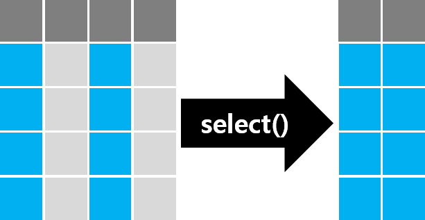
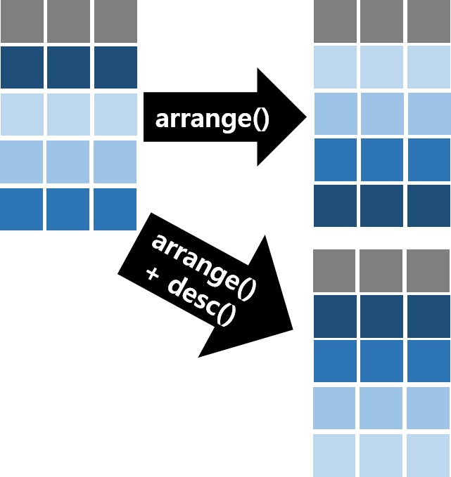
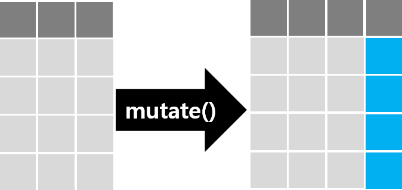
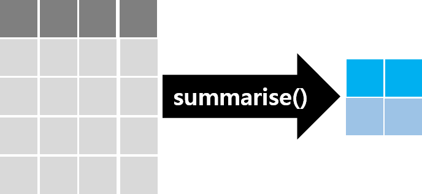

```{r setup, include=FALSE}
library(knitr)

# readr 은 파일을 읽을 때마다 열 유형 요약을 메시지로 출력한다. 이 장에서는 끈다.
options(readr.show_col_types = FALSE)

# 출력 폭을 60자로 접는다 (bookdown 판에서 쓰던 linewidth 훅).
options(width = 60, linewidth = 60)
hook_output <- knitr::knit_hooks$get("output")
knit_hooks$set(output = function(x, options) {
  if (!is.null(n <- options$linewidth)) {
    x <- knitr:::split_lines(x)
    if (any(nchar(x) > n)) x <- strwrap(x, width = n)
    x <- paste(x, collapse = "\n")
  }
  hook_output(x, options)
})

```


::: {.callout-important}
**학습 목표**

- 표에서 **한 행이 무엇을 가리키는지**(관측 단위)를 말하고, 키로 삼을 열이 정말 행마다 다른지 확인할 수 있다.
- 행 고르기, 열 만들기, 집단별 요약을 파이프로 이어 **변환 절차**를 작성할 수 있다.
- 조건과 요약이 결측값을 만났을 때 결과가 어떻게 달라지는지 실행하기 전에 예측할 수 있다.
- 두 표를 합치기 전에 키의 유일성과 짝을 확인하고, 합친 뒤 행 수가 바뀐 이유를 설명할 수 있다.
- 넓은 표와 긴 표 사이를 오가고, 모양을 바꾼 뒤 정보가 그대로인지 대조할 수 있다.
- 변환마다 **보존되어야 할 것**(행 수, 합계, 키)을 정해 코드로 대조하고, 요약 결과를 공개된 값과 대조할 수 있다.
- AI 가 생성한 데이터 변환 코드를 행 수, 키, 합계 대조로 검증하고, AI 가 보지 못한 자료의 결함을 찾아낼 수 있다.

:::


11장에서는 파일을 읽고, 읽은 결과를 원문과 대조했다. 그런데 읽은 표가 곧바로 분석에 맞는 경우는 드물다.
필요한 행만 고르고, 새 변수를 만들고, 집단별로 요약하고, 다른 기관의 표와 합치고, 표의 모양을 바꾼다.
이 과정을 **데이터 핸들링**(data handling)이라 한다. 데이터 분석의 과정을 그린 아래 그림에서 읽기(Import) 다음의
정돈(Tidy)과 변환(Transform)에 해당한다. 분석 시간의 대부분이 여기에 쓰인다.


```{r fig-data-science}
#| echo: false
#| fig-cap: "데이터 분석의 과정. [Wickham & Grolemund, *R for Data Science*](https://r4ds.had.co.nz/introduction.html) 의 그림"
#| out-width: "80%"
knitr::include_graphics("figures/data-science.png")

```


데이터 핸들링 코드는 AI 가 가장 잘 써 주는 코드 가운데 하나다. 그리고 가장 **조용히 틀리는** 코드이기도 하다.
조건 하나가 결측값을 만나면 행이 경고 없이 빠지고, 합칠 표에 중복된 키가 하나 있으면 행이 늘어나 합계가
부풀어 오른다. 코드는 오류 없이 끝나고 표는 그럴듯하다. 틀렸다는 사실은 **무엇이 보존되어야 하는지** 알고
대조할 때만 드러난다. 6장의 예측과 대조, 11장의 합계 대조가 이 장에서는 변환마다 되풀이된다.

이 장은 dplyr 과 tidyr 의 함수를 사전처럼 나열하지 않는다. 함수마다 **결과가 달라지는 지점**을 예측하고
확인하는 데 집중한다. 인수 전체는 [dplyr 함수 목록](https://dplyr.tidyverse.org/reference/index.html) 에서 찾아보면
된다.


::: {.callout-note}
**예제 자료**: 1~4절은 R 과 패키지에 들어 있는 자료로 함수를 익히고, 5절부터는 이 장의 연습 파일로 표를
합치고 검증한다.

| 자료 | 내용 | 쓰는 절 |
|:--|:--|:--|
| `mpg` | ggplot2 패키지. 미국 환경보호청(EPA)의 자동차 연비 자료 234행 | 1~4 |
| `dataset/titanic3.csv` | 타이타닉호 승객 1,309명 | 1, 2, 4 |
| `iris`, `mtcars`, `starwars` | R 과 dplyr 패키지에 들어 있는 자료 | 1~4, 6 |
| `flights`, `planes` 등 | nycflights13 패키지(설치 필요). 2013년 뉴욕 출발 항공편 | 5 |
| `billboard`, `who`, `table2`, `table3`, `table5` | tidyr 패키지에 들어 있는 자료 | 6 |
| `dataset/ch12/` 도서관 세 파일 | 11장의 도서관 20곳을 이어받은 **교육용 가상 자료** | 5~8 |
| `dataset/ch12/` Gapminder 파일 | Gapminder 공개 자료에서 2000~2020년을 뽑은 것 | 6, 7 |

: {tbl-colwidths="[30,52,18]"}

`dataset/ch12/` 의 파일을 다시 만드는 스크립트는 같은 폴더의 `make-ch12-data.R`(도서관)와
`make-gapminder-data.R`(Gapminder)이다. 도서관 파일에 들어 있는 함정은 본문에서 하나씩 드러나므로 스크립트는 이
장을 끝낸 뒤에 열어 보기를 권한다.

:::


::: {.callout-caution}
**dplyr 1.2.0 이상이 필요하다.** 이 장의 `filter_out()`, `recode_values()`, `replace_values()`, `case_when()` 의
`.unmatched` 인수는 dplyr 1.2.0(2026년)에 새로 생겼다. `packageVersion("dplyr")` 로 버전을 확인하고, 낮으면
`install.packages("dplyr")` 로 갱신한다. 이 강의노트는 dplyr 1.2.1, tidyr 1.3.2 로 실행했다.

:::


이 장에서 쓰는 패키지를 불러온다. 5절의 nycflights13 은 그 절에서 불러온다.


```{r packages}
library(readr)    # 파일 읽기 (11장)
library(dplyr)    # 행과 열 고르기, 요약, 결합
library(tidyr)    # 모양 바꾸기
library(ggplot2)  # 예제 자료 mpg

```


## 데이터의 모양 {#sec-data-shape}

변환을 시작하기 전에 표가 어떻게 생겼는지부터 정한다. 같은 정보도 여러 모양의 표에 담을 수 있고, 모양에
따라 쉬운 계산과 어려운 계산이 갈린다.


### 한 행은 무엇인가 {#sec-row-unit}

표는 **값**(value)으로 이루어진다. 같은 속성(키, 나이, 요금)을 같은 단위로 잰 값들이 모여 **변수**(variable)가
되고, 같은 대상(사람, 자동차, 지역)에게서 잰 값들이 모여 **관측**(observation)이 된다. 표에서 변수는 열이고
관측은 행이다.


```{r fig-tidy-structure}
#| echo: false
#| fig-cap: "표의 구성 요소: 변수(열), 관측(행), 관측값(칸)"
knitr::include_graphics("figures/tidydata-structure-01.png")

```


그래서 표를 받으면 먼저 **한 행이 무엇을 가리키는지** 묻는다. 이것을 **관측 단위**(unit of observation)라 한다.
타이타닉호 승객 자료를 읽어 보자.


```{r read-titanic}
titanic <- read_csv("dataset/titanic3.csv")

dim(titanic)
names(titanic)

```


1912년 타이타닉호 승객 1,309명의 등급(`pclass`), 생존 여부(`survived`, 1 이 생존), 이름, 성별, 나이 등이 있다.
[hbiostat.org](https://hbiostat.org/data/) 에 `titanic3` 이라는 이름으로 공개된 자료다. 한 행은 승객 한 명이다.
그렇다면 행을 구별하는 열, 곧 **키**(key)로 무엇을 쓸 수 있을까?


::: {.callout-tip}
**예측해 보자**: 한 행이 승객 한 명이다. 서로 다른 이름(`name`)의 수는 행 수 1,309 와 같겠는가?

:::


```{r titanic-name-key}
c(행 = nrow(titanic), 이름 = n_distinct(titanic$name))

titanic |>
  count(name) |>
  filter(n > 1)

```


두 이름이 두 번씩 나온다. 같은 사람이 두 번 들어간 것일까?


```{r titanic-same-name}
titanic |>
  filter(name %in% c("Connolly, Miss. Kate", "Kelly, Mr. James")) |>
  select(pclass, name, age, ticket)

```


나이와 표 번호가 다르다. **이름이 같은 다른 승객**이다. 이 표에서 이름은 키가 아니다. 키 후보가 정말 행마다
다른지는 `n_distinct()` 로 세거나, `count()` 로 두 번 이상 나오는 값을 찾아 확인한다.

자동차 연비 자료 `mpg` 는 어떨까? 234행에 모델이 38개이므로 한 행이 모델 하나는 아니다. 제조사, 모델, 배기량,
연식, 변속기 등 **모든 열**이 같은 행이 있는지 보자.


```{r mpg-distinct}
c(행 = nrow(mpg), 모델 = n_distinct(mpg$model), 서로다른행 = nrow(distinct(mpg)))

```


열 11개가 모두 같은 행이 9쌍 있다. `mpg` 는 EPA 원자료에서 열 11개만 남긴 자료다(`?mpg`). 남은 열이 모두
같다고 같은 차라는 보장은 없으므로, 중복처럼 보인다고 `distinct()` 로 지우면 자료가 줄어들 수 있다. 이 표에는
행을 구별하는 키가 없다. 그런 표로는 다른 표와 행 단위로 짝을 맞출 수 없다(@sec-joins).


::: {.callout-important}
표를 받으면 **한 행이 무엇인지** 한 문장으로 적고, 키로 삼을 열이 정말 행마다 다른지 `n_distinct()` 나
`count() |> filter(n > 1)` 로 확인한다. 연구 가설을 세울 때 적은 관측 단위(사람인가, 지역인가, 지역과 연도의
조합인가)가 실제 표의 한 행과 같은지도 여기서 확인한다.

:::


### 같은 정보, 다른 모양 {#sec-tidy}

세 사람에게 두 가지 처치(a, b)를 하고 결과를 잰 가상의 실험이 있다. [Wickham(2014)](https://www.jstatsoft.org/article/view/v059i10)
이 tidy data 를 설명할 때 든 예를 옮겼다. 먼저 사람마다 한 행으로 적어 보자.


```{r trial-wide}
trial <- tribble(
  ~name,      ~a, ~b,
  "James",    NA,  1,
  "Kimberly", 17, 14,
  "Lalo",      8, 19
)

trial

```


James 는 처치 a 의 결과가 없다. 같은 내용을 처치마다 한 행으로 적을 수도 있다.


```{r trial-by-treatment}
tribble(
  ~treatment, ~James, ~Kimberly, ~Lalo,
  "a",            NA,        17,     8,
  "b",             1,        14,    19
)

```


두 표는 같은 값 여섯 개(결측 하나 포함)를 다른 모양으로 담았다. 이 실험에서 **변수**는 무엇인가? 사람
(`name`, 값 3개), 처치(`treatment`, 값 2개), 결과(`result`, 값 6개) 셋이다. 첫 표는 처치의 값(a, b)이 열 이름에
들어가 있고, 둘째 표는 사람의 값이 열 이름에 들어가 있다. 변수 하나가 열 하나가 되도록 다시 적으면 다음과
같다.


```{r trial-long}
trial_long <- trial |>
  pivot_longer(c(a, b), names_to = "treatment", values_to = "result")

trial_long

```


`pivot_longer()` 는 고른 열(`a`, `b`)을 두 열로 접는다. 열 이름은 `treatment` 열의 값이 되고, 칸의 값은 `result` 열의
값이 된다. 자세한 인수는 @sec-pivot 에서 다룬다.

마지막 표에서는 모든 열이 변수이고, 모든 행이 관측(한 사람에게 한 처치를 한 결과)이다. 이런 모양을
**tidy data** 라 부른다. Wickham(2014) 이 정리한 원칙은 다음과 같다.

1. 변수 하나는 열 하나다.
2. 관측 하나는 행 하나다.
3. 관측 단위 하나는 표 하나다.

반대로 이 원칙을 어긴 표에서 흔히 보이는 모양은 두 가지다. 둘 다 @sec-pivot 에서 고친다.

- **열 이름이 변수의 이름이 아니라 값이다.** 위의 첫 표, 연도가 열 이름인 표
- **한 열에 두 변수의 값이 함께 들어 있다.** `"745/19987071"` 처럼 환자 수와 인구가 한 칸에 적힌 열


::: {.callout-tip}
**예측해 보자**: `trial_long` 은 몇 행이어야 하는가? 결측값은 몇 개여야 하는가?

:::


```{r trial-invariants}
c(행 = nrow(trial_long), 사람x처치 = nrow(trial) * 2,
  결측_원래 = sum(is.na(trial[, c("a", "b")])), 결측_긴표 = sum(is.na(trial_long$result)))

```


사람 3명 × 처치 2가지 = 6행이고 결측값은 여전히 하나다. 모양만 바꾸었으므로 **행의 구성 규칙과 값의 수는
보존**되어야 한다. 이렇게 변환 전후에 보존되어야 할 양을 정해 두고 대조하는 일을 이 장에서 계속
한다(@sec-verify-transform).


```{r fig-longer-wider}
#| echo: false
#| fig-cap: "긴 표(longer)와 넓은 표(wider). gather, spread 는 pivot_longer(), pivot_wider() 의 이전 이름이다."
#| out-width: "55%"
knitr::include_graphics("figures/tidyr-pre.png")

```


tidy data 가 곧 "긴 표"라는 뜻은 아니다. 무엇이 변수인지가 모양을 정한다. @sec-pivot-wider 에서는 긴 표를 **넓게
펴야** tidy data 가 되는 경우를 본다. 넓은 표가 틀린 것도 아니다. 보고서의 표처럼 **사람에게 보여 줄 때**는
넓은 표가, **계산할 때**는 tidy data 가 편하다. dplyr 과 ggplot2 의 함수는 tidy data 를 전제로 만들어졌다.


### 절차를 파이프로 적기 {#sec-pipe}

데이터 핸들링은 여러 단계의 변환을 차례로 적용하는 **절차**다. 파이프 연산자 `|>` 는 왼쪽의 결과를 오른쪽
함수의 첫 번째 인수로 넘긴다. `x |> f(y)` 는 `f(x, y)` 와 같다. 함수를 **동사(목적어, 나머지 인수)** 로 적던
것을 **목적어 |> 동사(나머지 인수)** 로 적는 셈이다.

`iris` 에서 setosa 종의 네 측정값 평균을 구해 보자.


```{r pipe-iris}
# 색인으로 행과 열을 고르고 apply() 로 열마다 평균
apply(iris[iris$Species == "setosa", -5], 2, mean)

# 같은 일을 파이프로
iris |>
  filter(Species == "setosa") |>
  select(-Species) |>
  summarise(across(everything(), mean))

```


값은 같다. 아래 코드는 "setosa 행을 고르고, 종 열을 빼고, 모든 열의 평균을 구한다"라는 절차를 **적힌
순서대로** 읽을 수 있다. 위 코드는 `-5` 가 무슨 열인지, `2` 가 행인지 열인지 알아야 읽힌다. 8장에서 알고리즘을
"누가 실행해도 같은 결과가 나오는 약속된 절차"라고 했다. 파이프로 적은 변환은 그 절차를 한 줄에 한 단계씩
적은 것이다. `across()` 는 @sec-across 에서 다룬다.

이 강의노트는 R 에 내장된 `|>` 를 쓴다. 인터넷의 많은 코드와 이 강의의 이전 판 노트는 magrittr 패키지의
`%>%` 를 쓴다. 대부분 같은 뜻이지만 두 가지가 다르다.


```{r pipe-difference}
mpg %>% nrow          # %>% 는 괄호가 없어도 된다
mpg |> nrow()         # |> 는 반드시 함수 호출 형태

# 왼쪽 값을 첫 번째가 아닌 인수로 넘길 때
mpg %>% lm(hwy ~ displ, data = .) %>% coef()
mpg |> lm(hwy ~ displ, data = _) |> coef()

```


`%>%` 의 자리표시자는 `.`, `|>` 의 자리표시자는 `_` 이고, `_` 는 `data = _` 처럼 **이름을 붙인 인수**에만 쓸 수
있다. 괄호를 빠뜨린 `mpg |> nrow` 는 오류다. 어느 쪽을 쓰든 한 절차 안에서는 한 가지로 통일한다.


::: {.callout-tip}
**이름이 같은 함수**: 여러 패키지에 같은 이름의 함수가 있으면 **나중에 불러온 패키지**의 함수가 쓰인다.
dplyr 을 불러오면 stats 패키지의 시계열 함수 `filter()` 가 가려지는 식이다. 가려진 함수는 `stats::filter()` 처럼
`패키지::함수()` 로 부른다. 반대로 다른 패키지가 dplyr 의 함수를 가리면 익숙한 코드가 낯선 오류를 낸다.
MASS 패키지에도 `select()` 가 있다.

```{r masked-select}
MASS::select(mpg, cty)
```

MASS 를 dplyr 보다 나중에 불러온 채 `select(mpg, cty)` 를 실행하면 이 오류가 난다. 오류가 낯설면 함수 이름
앞에 `dplyr::` 를 붙여 다시 실행해 본다.

:::


## 행과 열 고르기 {#sec-rows-cols}

표에서 필요한 부분만 남기는 함수들이다. `filter()` 는 행을, `select()` 는 열을 고르고, `arrange()` 는 행의 순서를
바꾼다. 이 가운데 **행 수를 바꾸는 것은 `filter()` 뿐**이므로 조용히 틀리는 곳도 대부분 여기서 생긴다.

이 절과 다음 두 절은 `mpg` 를 주로 쓴다. 미국에서 판매된 자동차 38개 모델의 1999년식과 2008년식 연비 자료다.


| 열 | 내용 | 열 | 내용 |
|:--|:--|:--|:--|
| `manufacturer` | 제조사 | `drv` | 구동 방식: f 전륜, r 후륜, 4 사륜 |
| `model` | 모델명 | `cty` | 시내 연비(mile/gallon) |
| `displ` | 배기량(리터) | `hwy` | 고속도로 연비(mile/gallon) |
| `year` | 연식 | `fl` | 연료: r 일반, p 고급, e 에탄올 85, d 경유, c 압축천연가스 |
| `cyl` | 실린더 수 | `class` | 차종 |
| `trans` | 변속기 | | |

: {tbl-colwidths="[14,36,10,40]"}


```{r glimpse-mpg}
glimpse(mpg)

```


`glimpse()` 는 열을 세로로 늘어놓아 열 이름, 유형, 앞부분 값을 한눈에 보여 준다. 열이 많은 표를 처음 볼 때
`head()` 보다 편하다.


### filter(): 조건에 맞는 행 {#sec-filter}

`filter()` 는 조건이 참(`TRUE`)인 행만 남긴다.


```{r fig-filter}
#| echo: false
#| fig-cap: "filter(): 조건에 맞는 행을 남긴다"
#| out-width: "45%"
knitr::include_graphics("figures/dplyr-filter.png")

```


```{r filter-mpg}
# 현대 자동차
mpg |> filter(manufacturer == "hyundai") |> nrow()

# 시내 연비 20 이상인 SUV: 쉼표로 적은 조건은 모두 참이어야 한다
mpg |> filter(cty >= 20, class == "suv")

# 아우디 또는 폭스바겐이면서 고속도로 연비 30 이상
mpg |>
  filter(manufacturer == "audi" | manufacturer == "volkswagen", hwy >= 30) |>
  select(manufacturer, model, year, hwy)

```


조건을 쉼표로 여러 개 적으면 **모두** 참인 행만 남는다(`&` 와 같다). "둘 중 하나"는 `|` 로, "아니다"는 `!` 로 적는다.
두 조건 `x`, `y` 를 조합했을 때 남는 부분은 다음과 같다.


```{r fig-venn}
#| echo: false
#| fig-cap: "논리 연산이 고르는 부분. 음영이 남는 행이다."
#| out-width: "70%"
knitr::include_graphics("figures/venn-diagram.png")

```


여러 값 가운데 하나와 같은 행을 고를 때는 흔한 함정이 하나 있다.


::: {.callout-tip}
**예측해 보자**: 아우디(18대)와 폭스바겐(27대)을 모두 고르려 한다. 두 코드의 결과는 같겠는가?

```r
mpg |> filter(manufacturer == c("audi", "volkswagen"))
mpg |> filter(manufacturer %in% c("audi", "volkswagen"))
```

:::


```{r filter-recycle}
mpg |> filter(manufacturer == c("audi", "volkswagen")) |> nrow()
mpg |> filter(manufacturer %in% c("audi", "volkswagen")) |> nrow()

```


첫 번째 코드는 45대 가운데 23대만 골랐고 경고도 없다. `==` 는 두 벡터를 **같은 위치끼리** 비교한다. 길이
234 인 `manufacturer` 와 길이 2 인 벡터를 비교하면 짧은 쪽이 되풀이되어, 홀수 번째 행은 `"audi"` 와, 짝수 번째
행은 `"volkswagen"` 과 비교된다. 우연히 자리가 맞은 행만 남았다. 행 수가 2의 배수가 아니면 경고가 나오지만
234행이라 그마저 없다. **"여러 값 가운데 하나"는 `%in%`** 이다.

이제 결측값이 있는 자료로 조건을 나누어 보자. 타이타닉 승객을 나이 18세를 기준으로 나눈다.


::: {.callout-tip}
**예측해 보자**: 1,309명을 `age < 18` 과 `age >= 18` 로 나누었다. 두 조각의 행 수를 더하면 몇이 되겠는가?

:::


```{r filter-split-titanic}
minor <- titanic |> filter(age < 18)
adult <- titanic |> filter(age >= 18)

c(전체 = nrow(titanic), 미성년 = nrow(minor), 성인 = nrow(adult),
  합 = nrow(minor) + nrow(adult))

```


154 + 892 = 1,046 이다. 263명이 어느 조각에도 들어가지 않았다.


```{r filter-lost-rows}
sum(is.na(titanic$age))

```


나이가 기록되지 않은 승객이다. 나이가 `NA` 이면 `NA < 18` 도 `NA >= 18` 도 참이 아니라 `NA` 다. 값을 모르니
크다고도 작다고도 할 수 없다. `filter()` 는 `TRUE` 인 행만 남기므로 `NA` 인 행은 **두 조건 모두에서 경고 없이
빠진다.** 조건을 뒤집어 `filter(!(age >= 18))` 이라고 써도 `!NA` 는 `NA` 이므로 결과는 같다.

base R 의 색인은 다르게 동작한다. 조건이 `NA` 인 자리에 **모든 열이 `NA` 인 행**을 만들어 넣는다.


```{r bracket-na-rows}
under18 <- titanic[titanic$age < 18, ]

nrow(under18)

tail(under18, 3) |> select(pclass, name, age)

```


154명이 아니라 417행이다. 263행은 이름까지 모두 `NA` 인 빈 행이다. 이전 판 강의노트는 `mpg[조건, ]`,
`subset()`, `filter()` 를 같은 결과를 내는 방법으로 나란히 소개했는데, 결측값이 없는 `mpg` 에서만 맞는 말이다.

"18세 이상인 승객을 **빼고** 나머지를 보자"는 의도라면 dplyr 1.2.0 의 `filter_out()` 이 맞다. `filter_out()` 은
조건이 참인 행을 **뺀다.** 조건이 `NA` 인 행은 참이 아니므로 남는다.


```{r filter-out}
titanic |> filter_out(age >= 18) |> nrow()

```


미성년 154명과 나이를 모르는 263명을 더한 417명이다.


::: {.callout-important}
**조건으로 행을 나누었으면 조각들의 행 수를 더해 원래 행 수와 대조한다.** 맞지 않으면 조건 열에 결측값이 있다.
남길 행을 말하고 싶으면 `filter()`, 뺄 행을 말하고 싶으면 `filter_out()` 을 쓴다. 두 함수는 결측값을 반대로
다룬다.

:::


### select() 와 rename(): 열 고르기 {#sec-select}

`select()` 는 열 이름으로 열을 고른다. 행 수는 바뀌지 않는다.


```{r fig-select}
#| echo: false
#| fig-cap: "select(): 고른 열만 남긴다"
#| out-width: "45%"


```


```{r select-basic}
mpg |> select(manufacturer, model, displ, year, cty) |> names()

mpg |> select(manufacturer:year, cty) |> names()

mpg |> select(-cyl, -trans, -drv, -hwy, -fl, -class) |> names()

```


세 코드는 같은 다섯 열을 고른다. 열 이름에는 따옴표가 필요 없고, `시작:끝` 은 두 열 사이의 모든 열, `-열` 은
그 열을 뺀 나머지다. 이름의 규칙으로 여러 열을 한 번에 고르는 도우미 함수도 있다.


```{r select-helpers}
mpg |> select(-starts_with("m")) |> names()

starwars |> select(name, gender, contains("color")) |> head(3)

mpg |> select(matches("y$"), everything()) |> names()

titanic |> select(where(is.numeric)) |> names()

```


| 도우미 | 고르는 열 |
|:--|:--|
| `starts_with("a")`, `ends_with("a")`, `contains("a")` | 이름이 a 로 시작하는, a 로 끝나는, a 를 포함하는 열 |
| `matches("y$")` | 이름이 정규표현식에 맞는 열 (여기서는 y 로 끝나는 `cty`, `hwy`) |
| `everything()` | 나머지 모든 열. 고른 열을 앞으로 옮길 때 쓴다 |
| `where(is.numeric)` | 조건 함수가 `TRUE` 를 돌려주는 열 (여기서는 숫자 열) |

: {tbl-colwidths="[42,58]"}

열 이름만 바꿀 때는 `rename(새 이름 = 옛 이름)` 을 쓴다. `select()` 안에서도 같은 방법으로 이름을 바꿀 수 있지만,
고르지 않은 열은 사라진다.


```{r rename}
mpg |> rename(city_mpg = cty, hwy_mpg = hwy) |> names()

mpg |> select(city_mpg = cty) |> names()

```


### arrange() 와 slice_*(): 정렬과 상위 행 {#sec-arrange}

`arrange()` 는 열의 값 순서로 행을 정렬한다. 내림차순은 `desc()` 로 감싼다. 기준 열을 여러 개 주면 앞의 열 값이
같은 행끼리 다음 열로 정렬한다.


```{r fig-arrange}
#| echo: false
#| fig-cap: "arrange(): 값의 순서로 행을 정렬한다. desc() 는 내림차순"
#| out-width: "35%"


```


시내 연비는 오름차순, 차종은 알파벳 역순으로 정렬해 보자. 같은 정렬을 base R 로도 구해 두 결과를 비교한다.


```{r arrange-compare}
sorted_dplyr <- mpg |> arrange(cty, desc(class))

# base R: 문자 열은 rank() 로 순위를 매겨 부호를 바꾼다
sorted_base <- mpg[order(mpg$cty, -rank(mpg$class)), ]

identical(sorted_dplyr, sorted_base)

sorted_dplyr |> select(manufacturer, model, cty, class) |> head(4)

```


**서로 다른 방법으로 구한 같은 결과를 대조**하는 것은 코드를 검증하는 좋은 방법이다. 둘 중 하나가 틀렸다면
`identical()` 이 `FALSE` 를 돌려준다.


::: {.callout-tip}
**예측해 보자**: 타이타닉 승객을 나이 내림차순으로 정렬하면 나이가 `NA` 인 승객은 맨 위에 오겠는가, 맨 아래에
오겠는가?

:::


```{r arrange-na}
titanic |> arrange(desc(age)) |> select(name, age) |> tail(3)

```


`arrange()` 는 오름차순이든 내림차순이든 **결측값을 항상 맨 뒤**에 둔다. 내림차순으로 정렬하고 `head()` 로 앞의
몇 행을 볼 때는 결측값이 보이지 않으므로, 결측값이 있다는 사실 자체를 따로 확인해야 한다.

값이 큰 행 몇 개를 고를 때는 `slice_max()` 를 쓴다(예전 함수 `top_n()` 을 대신한다). 고속도로 연비가 높은
다섯 대를 골라 보자.


```{r slice-max-ties}
mpg |> slice_max(hwy, n = 5) |> select(manufacturer, model, year, hwy)

```


`n = 5` 라고 했는데 여섯 행이 나왔다. 36 으로 **동률**인 혼다 시빅이 두 대이기 때문이다. `slice_max()` 는 기본으로
동률을 모두 남긴다. 정확히 다섯 행만 원하면 `with_ties = FALSE` 를 주는데, 그러면 동률 가운데 무엇이 남을지는
표의 순서에 달린다. 동률을 어떻게 처리할지는 함수가 아니라 **분석하는 사람이 정할 일**이다.


## 열 만들고 바꾸기 {#sec-mutate}

`mutate()` 는 기존 열로 새 열을 만들거나 기존 열을 바꾼다. 행 수는 바뀌지 않지만, 값을 정하는 규칙이 틀리면
모든 행이 조용히 틀린다.


### mutate() {#sec-mutate-basic}


```{r fig-mutate}
#| echo: false
#| fig-cap: "mutate(): 기존 열로 새 열을 만든다"
#| out-width: "45%"


```


`mpg` 의 연비는 갤런당 마일(mile/gallon)이다. 리터당 킬로미터(km/L)로 바꾸어 보자. 1마일은
1.609344 km, 미국 1갤런은 3.785411784 L 이다.


```{r mutate-kpl}
kpl <- 1.609344 / 3.785411784   # 1 mile/gallon 은 약 0.425 km/L

mpg |>
  mutate(cty_kpl = cty * kpl,
         hwy_kpl = hwy * kpl) |>
  select(model, cty, hwy, cty_kpl, hwy_kpl) |>
  head(3)

```


계산은 열 전체에 한 번에 적용된다. 4장에서 본 벡터 연산이다. base R 에도 비슷한 일을 하는 `transform()` 이
있다.


::: {.callout-tip}
**예측해 보자**: 두 코드는 방금 만든 `cty_kpl` 을 다시 원래 단위로 되돌린다. 두 코드 모두 실행되겠는가?

```r
transform(mpg, cty_kpl = cty * kpl, cty_back = cty_kpl / kpl)
mutate(mpg, cty_kpl = cty * kpl, cty_back = cty_kpl / kpl)
```

:::


```{r transform-vs-mutate}
transform(mpg, cty_kpl = cty * kpl, cty_back = cty_kpl / kpl)

back <- mpg |> mutate(cty_kpl = cty * kpl, cty_back = cty_kpl / kpl)
all.equal(back$cty, back$cty_back)

```


`transform()` 은 새 열을 **원래 표**에서 찾으므로 같은 호출 안에서 만든 `cty_kpl` 을 모른다. `mutate()` 안에서는
앞에서 만든 열을 바로 다음 계산에 쓸 수 있다. 되돌린 값이 원래 값과 같다는 것(`all.equal()`)도 확인했다. 단위를
바꾸는 계산은 **되돌려서 원래 값이 나오는지** 대조할 수 있다.


### 조건에 따라 값 정하기: if_else() 와 case_when() {#sec-case-when}

조건이 둘이면 `if_else()`, 셋 이상이면 `case_when()` 을 쓴다. base R 에도 `ifelse()` 가 있는데, 결과의 **유형**을
다루는 방식이 다르다.


::: {.callout-tip}
**예측해 보자**: 학기 시작일 가운데 7월 이전 날짜만 남기고 나머지는 `NA` 로 두려 한다. 두 코드가 돌려주는 값의
모양은 같겠는가?

```r
start <- as.Date(c("2026-03-02", "2026-09-01"))
ifelse(start < as.Date("2026-07-01"), start, NA)
if_else(start < as.Date("2026-07-01"), start, NA)
```

:::


```{r ifelse-date}
start <- as.Date(c("2026-03-02", "2026-09-01"))

ifelse(start < as.Date("2026-07-01"), start, NA)
if_else(start < as.Date("2026-07-01"), start, NA)

```


`ifelse()` 는 날짜를 `20514` 라는 수로 바꾸어 버렸다. R 의 날짜는 1970년 1월 1일부터 센 날 수에 "날짜"라는
속성을 붙인 값인데, `ifelse()` 는 그 속성을 버린다. `if_else()` 는 참일 때와 거짓일 때의 값이 **같은 유형**이어야
한다는 규칙을 지키고 유형을 보존한다. 규칙에 어긋나면 결과를 만들지 않고 멈춘다.


```{r if-else-type-error}
mpg |> mutate(연비등급 = if_else(hwy >= 30, "고연비", 0))

```


조용히 틀린 값을 만드는 것보다 멈추는 편이 낫다. 문자와 숫자를 섞으려 했다면 대개 실수다.

`case_when()` 은 `조건 ~ 값` 을 위에서부터 차례로 검사해 **처음으로 참인 조건의 값**을 준다.


::: {.callout-tip}
**예측해 보자**: 고속도로 연비 30 이상을 "높음", 20 이상을 "보통", 나머지를 "낮음"으로 나누려 했다. 아래 코드에서
"높음"은 몇 대가 되겠는가? (고속도로 연비 30 이상인 차는 26대다.)

```r
mpg |>
  mutate(연비 = case_when(hwy >= 20 ~ "보통",
                          hwy >= 30 ~ "높음",
                          .default = "낮음")) |>
  count(연비)
```

:::


```{r case-when-order}
mpg |>
  mutate(연비 = case_when(hwy >= 20 ~ "보통",
                          hwy >= 30 ~ "높음",
                          .default = "낮음")) |>
  count(연비)

```


"높음"은 하나도 없다. 44 인 폭스바겐 제타는 첫 조건 `hwy >= 20` 에서 이미 참이 되어 "보통"을 받고, 두 번째 조건은
검사되지 않는다. 조건은 **좁은 것부터** 적는다.


```{r case-when-fixed}
mpg |>
  mutate(연비 = case_when(hwy >= 30 ~ "높음",
                          hwy >= 20 ~ "보통",
                          .default = "낮음")) |>
  count(연비)

```


`.default` 는 어느 조건에도 맞지 않는 행에 줄 값이다. 그런데 모든 경우를 조건으로 적었다고 **믿는** 상황이라면
`.default` 대신 `.unmatched = "error"` 를 준다(dplyr 1.2.0). 빠뜨린 경우가 있으면 조용히 기본값을 주지 않고 멈춘다.


```{r case-when-unmatched}
mpg |>
  mutate(연비 = case_when(hwy >= 30 ~ "높음",
                          hwy >= 20 ~ "보통",
                          .unmatched = "error"))

```


"낮음" 조건을 빠뜨렸다는 사실과 해당 행의 위치를 알려 준다.


### 값을 다른 값으로: recode_values() 와 replace_values() {#sec-recode}

조건이 아니라 **값 자체**를 다른 값으로 바꿀 때는 dplyr 1.2.0 의 두 함수를 쓴다.

| 함수 | 쓰임 | 짝이 없는 값 |
|:--|:--|:--|
| `recode_values()` | 모든 값을 새 값으로 옮겨 **새 변수**를 만든다 | `default` 또는 `unmatched = "error"` |
| `replace_values()` | **일부 값만** 바꾸고 나머지는 그대로 둔다 | 그대로 남음 |

: {tbl-colwidths="[24,50,26]"}

`mpg` 의 구동 방식 코드(f, r, 4)를 이름으로 바꾸어 보자. 바꾼 뒤에는 **옛 값과 새 값을 함께 세어** 대응이 맞는지
확인한다.


```{r recode-drv}
mpg |>
  mutate(구동 = recode_values(drv,
    "f" ~ "전륜",
    "r" ~ "후륜",
    "4" ~ "사륜",
    unmatched = "error"
  )) |>
  count(drv, 구동)

```


`unmatched = "error"` 를 준 까닭은 `case_when()` 과 같다. 코드표에 적지 않은 값이 자료에 있으면 멈춘다.


::: {.callout-tip}
**예측해 보자**: 연료 코드(`fl`)를 바꾸면서 다섯 가지 가운데 압축천연가스(`c`)를 빠뜨렸다. `mpg` 에서 압축천연가스
차는 한 대뿐이다. 결과는 어떻게 되겠는가?

:::


```{r recode-fl-missing}
mpg |>
  mutate(연료 = recode_values(fl,
    "r" ~ "일반", "p" ~ "고급", "e" ~ "에탄올 85", "d" ~ "경유",
    unmatched = "error"
  ))

```


234대 가운데 107번째 한 대 때문에 멈췄다. `unmatched` 를 주지 않았다면 그 한 대의 연료만 `NA` 가 되었을 것이다.
**결측값도 짝이 없는 값으로 센다.** 승선 항구(`embarked`)가 기록되지 않은 타이타닉 승객 두 명으로 확인해 보자.


```{r recode-embarked-na}
titanic |> count(embarked)

titanic |>
  mutate(항구 = recode_values(embarked,
    "C" ~ "Cherbourg", "Q" ~ "Queenstown", "S" ~ "Southampton",
    unmatched = "error"
  ))

```


결측값 두 개를 어떻게 할지 정하지 않았다고 멈췄다. 결측값을 그대로 두려면 그렇게 **적는다.**


```{r recode-embarked-explicit}
titanic |>
  mutate(항구 = recode_values(embarked,
    "C" ~ "Cherbourg", "Q" ~ "Queenstown", "S" ~ "Southampton",
    NA ~ NA,
    unmatched = "error"
  )) |>
  count(embarked, 항구)

```


`replace_values()` 는 일부 값만 고치고 나머지는 그대로 둔다. @sec-join-assert 에서 이전 명칭으로 적힌 시도 이름을
고칠 때 쓴다. dplyr 1.2.0 이전의 `case_match()` 와 `recode()` 는 이 두 함수로 대체되었다.


### 여러 열에 한 번에: across() {#sec-across}

`cty` 와 `hwy` 에 같은 단위 변환을 하려면 식을 두 번 적어야 했다. 열이 열 개면 열 번이다. `across()` 는 고른 열마다
같은 함수를 적용한다.


```{r across-kpl}
mpg |>
  mutate(across(c(cty, hwy), \(x) x * kpl)) |>
  select(model, cty, hwy) |>
  head(3)

```


`\(x) x * kpl` 은 "x 를 받아 kpl 을 곱해 돌려주는 함수"를 그 자리에서 만든 것이다. `\(x)` 는 `function(x)` 를 줄여
쓴 표기다(R 4.1 이상). 열을 고르는 방법은 `select()` 와 같다.

`across()` 는 **결측값을 세는 검사 도구**로 자주 쓴다. 모든 열의 결측값 수를 한 번에 센다.


```{r across-na-count}
titanic |>
  summarise(across(everything(), \(x) sum(is.na(x)))) |>
  pivot_longer(everything(), names_to = "열", values_to = "결측") |>
  filter(결측 > 0)

```


열이 14개라 결과를 긴 표로 접어 결측이 있는 열만 남겼다(`pivot_longer()` 는 @sec-tidy 에서 보았다). 나이(`age`) 263개, 선실(`cabin`) 1,014개, 요금(`fare`) 1개, 승선 항구(`embarked`) 2개가 비어 있다. 시신 번호(`body`)와
구명정(`boat`)은 해당하는 승객에게만 값이 있는 열이라 결측이 많다. 변환의 앞뒤에서 이 표를 만들어 비교하면
**결측값이 새로 생기거나 사라졌는지** 한눈에 대조할 수 있다.

예전 코드는 같은 일을 `mutate_at()`, `mutate_if()`, `summarise_all()` 같은 함수로 했다. 지금은 모두
`across()` 로 대체되었다(superseded). 옛 코드를 만나면 다음과 같이 읽는다.

| 옛 코드 | 지금 코드 |
|:--|:--|
| `mutate_at(vars(cty, hwy), ~ . * kpl)` | `mutate(across(c(cty, hwy), \(x) x * kpl))` |
| `mutate_if(is.character, factor)` | `mutate(across(where(is.character), factor))` |
| `summarise_all(mean)` | `summarise(across(everything(), mean))` |

: {tbl-colwidths="[48,52]"}

결과가 완전히 같지는 않다. 함수를 여러 개 줄 때 열의 **순서**가 다르다.


```{r scoped-vs-across}
mpg |> select(displ, cty) |> summarise_all(list(min = min, max = max)) |> names()

mpg |> select(displ, cty) |> summarise(across(everything(), list(min = min, max = max))) |> names()

```


옛 함수는 함수 순서로(`displ_min, cty_min, ...`), `across()` 는 열 순서로(`displ_min, displ_max, ...`) 늘어놓는다.
옛 코드를 고친 뒤 열 번호로 값을 꺼내던 코드가 있다면 조용히 다른 값을 꺼낸다. 고친 뒤에는 **열 이름으로**
대조한다.


## 집단별로 요약하기 {#sec-summarise}

`summarise()` 는 여러 행을 한 행으로 줄인다. 집단을 지정하면 집단마다 한 행이 된다. 요약은 행을 줄이므로,
**줄어든 행들이 원래 행을 빠짐없이 한 번씩 대표하는지** 확인하는 일이 중요하다.


### summarise() 와 .by {#sec-summarise-by}


```{r fig-summarise}
#| echo: false
#| fig-cap: "summarise(): 여러 행을 요약값 한 행으로 줄인다"
#| out-width: "45%"


```


```{r summarise-all}
mpg |>
  summarise(mean_cty = mean(cty), sd_cty = sd(cty),
            mean_hwy = mean(hwy), sd_hwy = sd(hwy))

```


집단별로 요약할 때는 `.by` 에 집단을 나누는 열을 적는다. `group_by()` 로 집단을 먼저 나누고 요약하는 방법도
있다. 두 방법의 차이는 뒤에서 본다.


```{r fig-group-by}
#| echo: false
#| fig-cap: "집단별 요약: 집단으로 나눈 뒤 집단마다 한 행으로 줄인다"
#| out-width: "70%"
knitr::include_graphics("figures/dply-group-by.png")

```


```{r summarise-by-class}
by_class <- mpg |>
  summarise(n = n(), 시내 = mean(cty), 고속 = mean(hwy), .by = class)

by_class

```


::: {.callout-tip}
**예측해 보자**: `by_class` 의 `n` 을 모두 더하면 몇이어야 하는가?

:::


```{r summarise-invariant}
sum(by_class$n)

```


234 다. 한 행이 정확히 한 차종에 속하므로 **집단 크기의 합은 전체 행 수**다. 합계도 마찬가지로, 집단 합계를 더하면
전체 합계가 되어야 한다. 이 등식이 깨지면 어떤 행이 집단에서 빠졌거나 두 집단에 들어간 것이다.

요약표는 **이름과 계산이 맞는지**도 읽어야 한다. 다음은 이전 판 강의노트에 실렸던 코드다.


::: {.callout-tip}
**예측해 보자**: 아래 표에서 1999년 아우디의 `mean_hwy` 는 17.1 이다. 이 값은 무엇의 평균인가?

```r
mpg |>
  summarise(N = n(), mean_displ = mean(displ), mean_hwy = mean(cty),
            .by = c(manufacturer, year))
```

:::


```{r summarise-name-mismatch}
mpg |>
  summarise(N = n(), mean_displ = mean(displ), mean_hwy = mean(cty),
            .by = c(manufacturer, year)) |>
  arrange(manufacturer, year) |>
  head(3)

mpg |>
  summarise(고속 = mean(hwy), 시내 = mean(cty), .by = c(manufacturer, year)) |>
  arrange(manufacturer, year) |>
  head(3)

```


`mean_hwy` 라는 이름표 아래 **시내 연비**의 평균이 들어 있다. 실제 고속도로 연비 평균은 26.1 이다. 17.1 도 연비로
자연스러운 크기라 표만 보아서는 알아채기 어렵다. 코드는 오류 없이 실행되었고 표도 그럴듯하다. 열 이름을 붙일
때는 **이름과 식이 같은 변수를 가리키는지** 확인한다.

`.by` 와 같은 일을 `group_by()` 로도 할 수 있다. 결과의 순서가 다르다. `.by` 는 표에 **처음 나온 순서**를 지키고,
`group_by()` 는 집단 값을 **정렬**한다.


```{r by-vs-group-by-order}
mpg |> summarise(n = n(), .by = class) |> pull(class)

mpg |> group_by(class) |> summarise(n = n()) |> pull(class)

```


### group_by() 는 남는다 {#sec-group-by}

`group_by()` 와 `.by` 의 더 중요한 차이는 **집단 정보가 표에 남는가**이다. `.by` 는 그 한 번의 계산에만 집단을
적용한다. `group_by()` 는 표에 집단 정보를 붙여 두고, 풀기 전까지 뒤따르는 계산이 집단마다 따로 이루어진다.
이전 판 강의노트는 이를 "group_by() 이후 적용되는 동사는 모두 그룹 별 연산 수행"이라고 적었다. 이 문장은 맞을까?


::: {.callout-tip}
**예측해 보자**: 제조사별로 묶은 뒤 시내 연비 순으로 정렬했다. 첫 행의 제조사는 알파벳 순서가 가장 빠른 audi
이겠는가?

```r
mpg |> group_by(manufacturer) |> arrange(cty)
```

:::


```{r arrange-ignores-group}
mpg |>
  group_by(manufacturer) |>
  arrange(cty) |>
  select(manufacturer, model, cty) |>
  head(6)

```


첫 행은 dodge 이고 dodge, jeep, chevrolet 가 섞여 있다. `arrange()` 는 집단을 **무시하고** 표 전체를 정렬한다.
집단 안에서 정렬하려면 `.by_group = TRUE` 를 준다.


```{r arrange-by-group}
mpg |>
  group_by(manufacturer) |>
  arrange(cty, .by_group = TRUE) |>
  select(manufacturer, model, cty) |>
  head(3)

```


이전 판 노트의 예제는 정렬한 뒤 `filter(manufacturer == "audi")` 로 아우디만 남겼다. 한 회사만 남으면 전체를 정렬한
결과와 집단 안에서 정렬한 결과가 구별되지 않는다. **예제가 오류를 가린** 경우다. 집단을 반영하는 동사는
`summarise()`, `mutate()`, `filter()`, `slice_*()` 이고, `arrange()` 는 `.by_group = TRUE` 일 때만 집단 순으로 정렬한다.

집단 정보가 남아서 생기는 일도 있다.


::: {.callout-tip}
**예측해 보자**: 차종 안에서 각 차의 고속도로 연비 비중을 구한 뒤, 전체 평균 고속도로 연비를 구하려 한다. 마지막
줄의 결과는 몇 행이겠는가?

```r
share <- mpg |>
  group_by(class) |>
  mutate(비중 = hwy / sum(hwy))

share |> summarise(평균 = mean(hwy))
```

:::


```{r group-by-persists}
share <- mpg |>
  group_by(class) |>
  mutate(비중 = hwy / sum(hwy))

share |> summarise(평균 = mean(hwy))

```


한 행이 아니라 일곱 행이 나왔다. `share` 에는 `group_by(class)` 가 남아 있어 `summarise()` 도 차종마다 계산했다. 표를
출력해 보면 첫머리에 집단 정보가 적혀 있다.


```{r group-by-header}
print(share, n = 3)

```


`# Groups: class [7]` 이 집단이 남아 있다는 표시다. `ungroup()` 으로 집단을 풀어야 전체 평균이 된다.


```{r ungroup}
share |> ungroup() |> summarise(평균 = mean(hwy))

```


비중이 의도대로 계산되었는지도 확인한다. 차종 안에서 구한 비중이면 **차종마다 합이 1** 이어야 한다.


```{r share-check}
share |> summarise(비중합 = sum(비중)) |> head(3)

```


한 번의 계산에만 집단이 필요하면 `mutate(..., .by = class)` 처럼 `.by` 를 쓴다. 결과에 집단이 남지 않아 뒤의 계산이
엉뚱하게 나뉘는 일이 없다. 두 개 이상의 열로 `group_by()` 한 뒤 `summarise()` 하면 dplyr 이 메시지를 남긴다.


```{r group-by-message}
#| message: true
mpg |>
  group_by(manufacturer, year) |>
  summarise(n = n()) |>
  head(2)

```


결과가 아직 `manufacturer` 로 묶여 있다는 안내다. 메시지를 지우려고 `.groups` 를 붙이기보다, 메시지가 권하는 대로
`.by = c(manufacturer, year)` 를 쓰는 편이 뒤탈이 없다.


### 개수 세기: n() 와 count() {#sec-count}

`count()` 는 `summarise(n = n(), .by = )` 를 줄여 쓴 것이다. `n()` 은 `summarise()` 밖에서도 쓸 수 있다. 연식별로
세 대 이하만 남은 제조사를 골라 보자.


```{r count-and-n}
mpg |> count(manufacturer, year) |> head(3)

mpg |>
  filter(n() < 4, .by = c(manufacturer, year)) |>
  count(manufacturer, year)

```


`n()` 은 집단의 **행 수**를 센다. 값이 있는지는 따지지 않는다. 값이 있는 행의 수는 `sum(!is.na(열))` 로 따로
센다.


```{r n-vs-non-missing}
titanic |>
  summarise(승객 = n(), 나이있음 = sum(!is.na(age)), .by = pclass) |>
  arrange(pclass)

```


`count()` 의 `wt` 에 열을 주면 행 수 대신 그 열의 합을 센다. `survived` 는 생존이 1 이므로 합이 곧 생존자 수다.


```{r count-wt}
titanic |> count(pclass, wt = survived)

```


::: {.callout-tip}
**예측해 보자**: 등급별 평균 나이와 나이가 기록된 승객 수를 한 번에 구하려 했다. `나이있음` 열에는 어떤 수가
나오겠는가?

```r
titanic |>
  summarise(age = mean(age, na.rm = TRUE),
            나이있음 = sum(!is.na(age)),
            .by = pclass)
```

:::


```{r summarise-name-reuse}
titanic |>
  summarise(age = mean(age, na.rm = TRUE),
            나이있음 = sum(!is.na(age)),
            .by = pclass) |>
  arrange(pclass)

```


세 등급 모두 1 이다. 1등석에는 나이가 기록된 승객이 284명인데도 그렇다. `summarise()` 안의 계산은 **위에서부터
차례로** 이루어지고, 앞에서 만든 열은 뒤의 계산에서 바로 쓸 수 있다(@sec-mutate-basic 의 `mutate()` 와 같다).
두 번째 줄의 `age` 는 원래 열이 아니라 **첫 줄이 만든 평균 한 개**를 가리킨다. 새 열에는 원래 열과 다른 이름을
붙인다.


```{r summarise-name-fixed}
titanic |>
  summarise(평균나이 = mean(age, na.rm = TRUE),
            나이있음 = sum(!is.na(age)),
            .by = pclass) |>
  arrange(pclass)

```


### 결측과 요약 {#sec-na-summary}

요약 함수는 결측값을 만나면 결과도 결측값이 된다.


```{r mean-na}
titanic |>
  summarise(평균나이 = mean(age),
            기록된_승객_평균 = mean(age, na.rm = TRUE),
            나이_결측비율 = mean(is.na(age)),
            .by = pclass) |>
  arrange(pclass)

```


`na.rm = TRUE` 를 주면 평균이 나온다. 그러나 그 평균은 "승객의 평균 나이"가 아니라 **"나이가 기록된 승객"의
평균 나이**다. 3등석은 승객의 29% 가 나이를 모른다. 기록된 승객과 기록되지 않은 승객이 다르다면, 등급 사이의
비교가 기울 수 있다. 실제로 다른지 확인해 보자.


::: {.callout-tip}
**예측해 보자**: 18세 미만, 18세 이상, 나이 모름으로 나누어 생존율을 구한다. 나이를 모르는 승객의 생존율은 전체
생존율(38.2%)과 비슷하겠는가?

:::


```{r survival-by-age-known}
titanic |>
  mutate(나이 = case_when(is.na(age) ~ "모름",
                          age < 18 ~ "18세 미만",
                          .default = "18세 이상")) |>
  summarise(승객 = n(), 생존율 = mean(survived), .by = 나이)

```


나이를 모르는 263명의 생존율은 27.8% 로 가장 낮다. 나이가 기록되지 않은 승객은 **나머지 승객과 달랐다.** 결측을
빼고 구한 값은 빠진 승객을 대표하지 못할 수 있다. "18세 미만 승객의 생존율은 52.6% 였다"라는 문장은 나이가
기록된 1,046명에 대한 말이고, 263명을 뺐다는 사실을 함께 적어야 정확하다.

결측값만 있는 집단에서는 요약 함수가 뜻밖의 값을 낸다.


```{r all-na-summary}
titanic |>
  filter(is.na(age)) |>
  summarise(합 = sum(age, na.rm = TRUE), 평균 = mean(age, na.rm = TRUE))

```


`sum()` 은 결측을 빼고 나면 더할 값이 하나도 없을 때 **0** 을 돌려주고, `mean()` 은 `NaN`(0 나누기 0)을 돌려준다.
0 과 "자료 없음"은 다르므로 합계 옆에는 **값이 있는 행의 수**를 함께 적는다.


::: {.callout-important}
**요약에서 결측값을 빼는 것은 계산이 아니라 결정이다.** 합계와 평균 옆에는 값이 있는 행의 수(분모)를 함께
보고하고, 결측값이 어느 집단에 몰려 있는지 확인한다. 0 이 나왔으면 "0 이었다"인지 "값이 없었다"인지 확인한다.

:::


### 한 집단에서 여러 행: reframe() {#sec-reframe}

`summarise()` 는 집단마다 **한 행**을 돌려주어야 한다. 사분위수처럼 값이 여러 개인 요약은 dplyr 1.2.0 부터
오류다.


```{r summarise-multi-row}
titanic |>
  summarise(사분위 = quantile(age, c(0.25, 0.75), na.rm = TRUE), .by = pclass)

```


집단마다 여러 행이 필요하면 `reframe()` 을 쓴다.


```{r reframe}
titanic |>
  reframe(분위 = c("Q1", "Q3"),
          나이 = quantile(age, c(0.25, 0.75), na.rm = TRUE),
          .by = pclass) |>
  arrange(pclass)

```


## 표 합치기 {#sec-joins}

분석에 필요한 정보는 여러 표에 흩어져 있는 경우가 많다. 항공편 기록에는 비행기 번호만 있고 기종은 비행기 목록에
있다. 이렇게 서로 연결된 표들을 **관계형 데이터**(relational data)라 한다. 두 표를 **키**로 짝지어 한 표로 만드는
것을 **결합**(join)이라 한다. 결합은 데이터 핸들링에서 행 수가 가장 크게, 가장 조용히 바뀌는 곳이다.


### 키: 행을 식별하는 열 {#sec-keys}

nycflights13 패키지를 쓴다. 2013년 뉴욕의 세 공항에서 출발한 항공편 336,776편의
기록(`flights`)과 이를 설명하는 네 표가 들어 있다. 처음이면 `install.packages("nycflights13")` 로 설치한다.


```{r nycflights}
library(nycflights13)

c(flights = nrow(flights), airlines = nrow(airlines), airports = nrow(airports),
  planes = nrow(planes), weather = nrow(weather))

```


다섯 표는 다음 열로 이어진다.


```{r fig-flights-scheme}
#| echo: false
#| fig-cap: "nycflights13 의 표 사이 관계. [Wickham & Grolemund, *R for Data Science*](https://r4ds.had.co.nz/relational-data.html) 의 그림"
#| out-width: "75%"
knitr::include_graphics("figures/dplyr-flights-db-scheme.png")

```


`planes` 의 한 행은 비행기 한 대이고 `tailnum`(기체 등록번호)이 행을 식별한다. 자기 표의 행을 식별하는 키를
**기본키**(primary key)라 한다. `flights` 의 `tailnum` 은 그 비행을 한 비행기를 가리킨다. 다른 표의 기본키를
가리키는 열을 **외래키**(foreign key)라 한다. 이전 판 강의노트는 기준 표의 키를 기본키, 붙일 표의 키를 외래키로
적었는데, 어느 쪽이 기준 표인지와는 관계가 없다. 기본키는 행마다 달라야 한다. 확인한다.


```{r primary-key-check}
planes   |> count(tailnum) |> filter(n > 1)
airports |> count(faa) |> filter(n > 1)

```


두 표 모두 두 번 나오는 값이 없다.


::: {.callout-tip}
**예측해 보자**: 그림에서 `weather` 는 `year`, `month`, `day`, `hour`, `origin` 다섯 열로 `flights` 와 이어진다. 날씨 기록은
공항마다 한 시간에 하나다. 이 다섯 열의 조합은 행마다 다르겠는가?

:::


```{r weather-key-check}
weather |> count(origin, year, month, day, hour) |> filter(n > 1)

weather |>
  filter(origin == "EWR", month == 11, day == 3, hour == 1) |>
  mutate(시각 = format(time_hour, "%H:%M %Z")) |>
  select(origin, month, day, hour, temp, 시각)

```


2013년 11월 3일 새벽 1시가 세 공항 모두 두 번씩 있다. 이날 새벽 2시에 일광절약시간(EDT)이 끝나 시계를
표준시(EST) 1시로 되돌렸으므로 **1시가 두 번** 있었다. 두 기록은 기온도 다르다. 시간대까지 담은 날짜시간 열
`time_hour` 로 세면 중복이 없다.


```{r weather-time-hour}
weather |> count(origin, time_hour) |> filter(n > 1)

```


그림이나 문서가 키라고 적어 두었어도 **직접 세어 확인한다.** 드물게 일어나는 일(1년에 한 번 있는 시각)은 앞부분
몇 행을 보아서는 드러나지 않는다.


### 결합의 종류 {#sec-join-types}

두 표 `x` 와 `y` 를 키로 짝지을 때, 짝이 없는 행을 어떻게 다루느냐에 따라 함수가 나뉜다. 작은
예로 보자.


```{r toy-join-tables}
x <- tribble(
  ~key, ~val_x,
     1, "x1",
     2, "x2",
     3, "x3"
)
y <- tribble(
  ~key, ~val_y,
     1, "y1",
     2, "y2",
     4, "y3"
)

```


```{r toy-joins}
inner_join(x, y, by = "key")
left_join(x, y, by = "key")
full_join(x, y, by = "key")
anti_join(x, y, by = "key")

```


| 함수 | 결과에 남는 행 | `merge()` 로 쓰면 |
|:--|:--|:--|
| `inner_join(x, y)` | 짝이 있는 행만 | `merge(x, y)` |
| `left_join(x, y)` | `x` 의 모든 행. 짝이 없으면 `y` 에서 온 열은 `NA` | `merge(x, y, all.x = TRUE)` |
| `right_join(x, y)` | `y` 의 모든 행 | `merge(x, y, all.y = TRUE)` |
| `full_join(x, y)` | 양쪽의 모든 행 | `merge(x, y, all = TRUE)` |
| `semi_join(x, y)` | 짝이 있는 `x` 의 행. `y` 의 열은 붙이지 않음 | |
| `anti_join(x, y)` | 짝이 **없는** `x` 의 행. `y` 의 열은 붙이지 않음 | |

: {tbl-colwidths="[22,50,28]"}

앞의 넷은 열을 붙이고, 뒤의 둘은 짝이 있는지로 `x` 의 행을 고른다. `anti_join()` 은 **짝이 없는 행을 찾는 검사
도구**로 자주 쓴다. base R 의 `merge()` 도 같은 결합을 하지만 결과를 키 순서로 정렬하므로 행의 순서가 바뀐다.


::: {.callout-tip}
**예측해 보자**: 항공편 기록 336,776편에 비행기의 기종(`model`)을 `left_join()` 으로 붙인다. 결과는 몇 행이겠는가?
기종이 `NA` 인 행이 있겠는가?

:::


```{r flights-planes-join}
flights2 <- flights |> select(year:day, hour, origin, dest, tailnum, carrier)

flights_model <- flights2 |>
  left_join(select(planes, tailnum, model), by = "tailnum")

c(결합전 = nrow(flights2), 결합후 = nrow(flights_model),
  기종NA = sum(is.na(flights_model$model)))

```


행 수는 그대로다. `planes` 에서 `tailnum` 이 한 번씩만 나오므로(다대일) 한 비행이 두 행이 될 수 없다. 그러나
52,606편(15.6%)은 기종이 `NA` 다. 짝이 없는 비행기를 `anti_join()` 으로 찾는다.


```{r flights-planes-unmatched}
flights2 |>
  anti_join(planes, by = "tailnum") |>
  count(carrier, sort = TRUE) |>
  head(3)

```


두 항공사(MQ, AA)의 비행이 대부분이다. 도움말(`?planes`)에 따르면 두 항공사는 기체 등록번호 대신 자체 관리
번호를 보고해서 짝이 맞지 않는다. 기종별 분석을 한다면 이 비행들이 빠진다는 사실을 결과와 함께 적어야 한다.

결합할 때는 `by` 에 키를 **반드시 적는다.** 적지 않으면 두 표에 같은 이름으로 있는 **모든 열**을 키로 쓴다.


::: {.callout-tip}
**예측해 보자**: `by` 없이 `flights |> left_join(planes)` 를 실행했다. 제조사(`manufacturer`)가 붙은 비행은
`by = "tailnum"` 으로 결합했을 때(284,170편)와 같겠는가?

:::


```{r join-without-by}
#| message: true
by_default <- flights |> left_join(planes)

sum(!is.na(by_default$manufacturer))

```


4,630편만 붙었다. 메시지가 알려 주듯 `year` 와 `tailnum` 두 열로 짝지었는데, `flights` 의 `year` 는 **운항 연도**
(모두 2013)이고 `planes` 의 `year` 는 **제작 연도**다. 이름만 같고 뜻이 다른 열이 키에 섞였다. 오류는 없고 메시지
한 줄만 남는다. `by = "tailnum"` 으로 결합하면 양쪽의 `year` 가 모두 남아 `year.x`, `year.y` 로 이름이 바뀐다. 필요한
열만 골라 붙이면(`select(planes, tailnum, model)`) 이런 일이 없다.


### 도서관 자료: 합치기 전에 확인하기 {#sec-library-tables}

지금부터는 이 장의 연습 파일로 결합을 검증한다. 목표는 **시도별 인구 1만 명당 대출권수**다. 대출(대출 표), 소속
시도(기본 정보 표), 인구(인구 표)가 서로 다른 표에 있다.


::: {.callout-note}
**연습 파일**: `dataset/ch12/` 의 세 파일은 11장의 도서관 20곳을 이어받은 **교육용 가상 자료**다. 도서관 이름과
수치, 인구는 실제와 무관하다(시도 명칭만 실제).

| 파일 | 내용 |
|:--|:--|
| `libraries.csv` | 도서관 기본 정보. 도서관ID, 도서관, 시도, 개관일, 열람석 |
| `loans-2026.csv` | 도서관별 2026년 1월부터 8월까지의 월별 대출권수. 휴관한 달은 빈칸 |
| `sido-population.csv` | 다른 기관에서 받은 시도별 권역과 인구 |

: {tbl-colwidths="[28,72]"}

:::


```{r read-library-files}
libraries  <- read_csv("dataset/ch12/libraries.csv")
loans_wide <- read_csv("dataset/ch12/loans-2026.csv")
population <- read_csv("dataset/ch12/sido-population.csv")

dim(libraries)
dim(loans_wide)
dim(population)

```


@sec-row-unit 처럼 한 행이 무엇인지부터 확인한다. 기본 정보 표와 대출 표의 한 행은 도서관 하나여야 한다.


::: {.callout-tip}
**예측해 보자**: `libraries` 는 20행, `loans_wide` 는 21행이다. 두 표 모두 한 행이 도서관 하나라면, 각 표에서
서로 다른 도서관ID 는 몇 개이겠는가? 두 표의 도서관은 같은 도서관들이겠는가?

:::


```{r row-unit-library}
c(행 = nrow(libraries),  도서관ID = n_distinct(libraries$도서관ID))
c(행 = nrow(loans_wide), 도서관ID = n_distinct(loans_wide$도서관ID))

setdiff(loans_wide$도서관ID, libraries$도서관ID)

```


두 표 모두 행 수와 서로 다른 도서관ID 수가 같다. 그런데 대출 표에는 기본 정보에 없는 `L21` 이 있다.
`setdiff(a, b)` 는 a 에는 있고 b 에는 없는 값을 돌려준다. 이 도서관은 5월에 문을 연 새솔도서관이고, 기본 정보
표가 아직 갱신되지 않았다.

대출 표는 월마다 열이 하나씩 있는 넓은 표다. @sec-tidy 에서 본 `pivot_longer()` 로 한 행에 도서관 하나와 월 하나를
담는 긴 표로 바꾼다.


```{r pivot-longer-loans}
loans <- loans_wide |>
  pivot_longer(starts_with("2026"), names_to = "월", values_to = "대출권수")

loans

```


::: {.callout-tip}
**예측해 보자**: 긴 표 `loans` 는 몇 행이어야 하는가? 두 표의 대출권수 합계는 같아야 하는가?

:::


```{r pivot-invariants}
nrow(loans) == nrow(loans_wide) * 8

sum(loans_wide[, 3:10], na.rm = TRUE)
sum(loans$대출권수, na.rm = TRUE)

```


행은 21 × 8 = 168 이고 합계는 같다. 이제 세 표의 키를 확인한다. 기본 정보 표의 키는 `도서관ID`, 긴 대출 표의 키는
`도서관ID` 와 `월` 의 조합, 인구 표의 키는 `시도` 다.


```{r key-check}
libraries  |> count(도서관ID) |> filter(n > 1)
loans      |> count(도서관ID, 월) |> filter(n > 1)
population |> count(시도) |> filter(n > 1)

```


인구 표에 세종특별자치시가 두 번 있다.


```{r key-duplicate-rows}
population |> filter(시도 == "세종특별자치시")

```


두 행의 값이 완전히 같다. 자료를 합치는 과정에서 한 줄이 더 들어간 것으로 보인다. 이 중복이 결합에서 어떤
일을 일으키는지 보기 위해 **일단 그대로 둔다.**


### 결합이 행 수를 바꾸는 두 경우 {#sec-join-rows}

먼저 대출 표에 기본 정보 표의 시도를 붙인다.


::: {.callout-tip}
**예측해 보자**: 긴 대출 표(168행)에 기본 정보 표의 시도를 붙인다. `left_join()` 과 `inner_join()` 의 결과는 각각
몇 행이겠는가? 대출권수 합계는 그대로이겠는가?

:::


```{r left-vs-inner}
sido_key <- libraries |> select(도서관ID, 시도)

loans_left  <- loans |> left_join(sido_key, by = "도서관ID")
loans_inner <- loans |> inner_join(sido_key, by = "도서관ID")

c(원래 = nrow(loans), left = nrow(loans_left), inner = nrow(loans_inner))
c(원래 = sum(loans$대출권수, na.rm = TRUE),
  inner = sum(loans_inner$대출권수, na.rm = TRUE))

```


`inner_join()` 은 8행과 대출권수 33,287권을 **경고 없이** 버렸다. 새솔도서관이다. `left_join()` 은 이 8행을 남기되
시도를 `NA` 로 채웠다. 어느 쪽이든 새솔도서관의 대출은 시도별 표에 들어가지 못한다. 차이는 **흔적이 남느냐**다.
`left_join()` 의 결과를 시도별로 요약하면 시도가 `NA` 인 집단이 보이지만, `inner_join()` 의 결과에서는 아무 흔적도
없다.

이제 도서관마다 시도의 인구를 붙인다.


::: {.callout-tip}
**예측해 보자**: 기본 정보 표(20행)에 인구 표를 `left_join()` 으로 붙인다. 결과는 몇 행이고, 인구가 `NA` 인 행은
몇 개이겠는가?

:::


```{r lib-pop-join}
#| warning: true
lib_pop <- libraries |> left_join(population, by = "시도")

nrow(lib_pop)

lib_pop |>
  filter(is.na(인구) | 시도 == "세종특별자치시") |>
  select(도서관ID, 도서관, 시도, 인구)

```


결합이 행 수를 바꾸는 두 경우가 한꺼번에 나타났다.

**첫째, 짝이 없는 키.** 새봄도서관과 여울도서관의 인구가 `NA` 다. 양쪽 표의 시도 이름을 비교해 보자.


```{r anti-join-sido}
libraries  |> anti_join(population, by = "시도") |> distinct(시도)
population |> anti_join(libraries, by = "시도") |> distinct(시도)

```


기본 정보 표는 **2026년 현재 명칭**(강원특별자치도, 전북특별자치도)을 쓰고 인구 표는 **이전 명칭**(강원도,
전라북도)을 쓴다. 강원도는 2023년 6월, 전라북도는 2024년 1월에 이름이 바뀌었다. 여러 해의 공공데이터를 합칠 때
흔히 만나는 문제다. 제주특별자치도는 이 자료에 도서관이 없어서 짝이 없는 것이므로 문제가 아니다.
`left_join()` 은 짝이 없는 행을 `NA` 로 남기고, `inner_join()` 이었다면 두 도서관이 결과에서 사라졌다.

**둘째, 중복된 키.** 온새미도서관이 두 행이 되었다. 인구 표에 세종특별자치시가 두 번 있으므로 두 행과 모두
짝지어졌다. 기본 정보 표는 20행인데 결과는 21행이다. dplyr 은 이 경우 "예상하지 못한 다대다 관계"라는 경고를
남긴다. 그러나 경고가 **늘 나오지는 않는다.** `x` 쪽 키가 중복 없이 한 번씩만 나오면(예: 시도별로 요약한 표에
인구를 붙이면) 경고 없이 행만 늘어난다(@sec-ai-handling).

늘어난 행은 합계를 부풀린다. 8월 대출에 시도와 인구를 차례로 붙여 보자.


```{r join-inflates-total}
aug <- loans |> filter(월 == "2026.08")

aug_pop <- aug |>
  left_join(sido_key, by = "도서관ID") |>
  left_join(population, by = "시도")

c(행 = nrow(aug_pop),
  합계 = sum(aug_pop$대출권수, na.rm = TRUE),
  원래합계 = sum(aug$대출권수, na.rm = TRUE))

```


21행이 22행이 되고 8월 합계가 41,275권 늘었다. 온새미도서관의 8월 대출권수가 한 번 더 더해진 것이다.


### 가정을 코드에 적기: relationship 과 unmatched {#sec-join-assert}

결합하기 전에 우리는 두 표의 관계를 알고 있다. 도서관은 여럿이 한 시도에 속하고, 시도는 인구 표에 한 번만
나와야 한다. **다대일**(many-to-one) 관계다. 이 가정을 `relationship` 인수로 코드에 적으면, 가정이 깨질 때
결합이 멈춘다.


```{r relationship-error}
libraries |>
  left_join(population, by = "시도", relationship = "many-to-one")

```


| `relationship` | 뜻 |
|:--|:--|
| `"one-to-one"` | 양쪽 모두 키가 한 번씩만 나온다 |
| `"one-to-many"` | `x` 의 키는 한 번씩, `y` 의 키는 여러 번 나올 수 있다 |
| `"many-to-one"` | `x` 의 키는 여러 번, `y` 의 키는 한 번씩만 나온다 |
| `"many-to-many"` | 양쪽 모두 여러 번 나올 수 있다 (의도한 경우에만) |

: {tbl-colwidths="[28,72]"}

`relationship` 은 **실제로 짝지어진 행**만 검사한다. @sec-keys 의 `weather` 는 11월 3일 새벽 1시의 키가 중복되지만,
그 시각에 출발한 항공편이 없어서 다대일을 적어도 멈추지 않는다.


```{r relationship-only-matched}
flights2 |>
  left_join(select(weather, origin, year, month, day, hour, temp),
            by = c("origin", "year", "month", "day", "hour"),
            relationship = "many-to-one") |>
  nrow()

```


결합이 멈추지 않았다고 `y` 의 키가 유일하다는 뜻은 아니다. 다음 달 자료에 그 시각의 항공편이 들어오면 그때 멈춘다.
**표의 키가 유일한지는 결합 전에 `count()` 로 따로 확인한다.**

짝이 없는 행에 대한 가정은 `unmatched` 인수로 적는다. "모든 도서관의 시도가 인구 표에 있어야 한다"는 가정은
`inner_join()` 에 `unmatched = c("error", "drop")` 을 주어 적는다. 첫 번째 값은 `x`, 두 번째 값은 `y` 의 짝 없는 행을
다룬다. `x` 에 짝 없는 행이 있으면 멈추고, `y` 에만 있는 행(제주특별자치도)은 버린다.


```{r unmatched-error}
libraries |>
  inner_join(distinct(population), by = "시도",
             relationship = "many-to-one", unmatched = c("error", "drop"))

```


5행, 강원특별자치도의 새봄도서관에서 멈췄다.


::: {.callout-caution}
`left_join()` 에 `unmatched = "error"` 를 주면 **`y` 의 짝 없는 행**을 검사한다. `left_join()` 에서 버려지는 행은
`y` 쪽에만 생기기 때문이다. "`x` 의 모든 행에 짝이 있다"를 확인하려는 목적과 반대이므로, 그 목적이면 위처럼
`inner_join()` 을 쓰거나 `anti_join()` 결과가 0행인지 확인한다.

:::


두 결함을 고친다. 세종 행은 **두 행의 값이 완전히 같다는 것을 확인했으므로** `distinct()` 로 하나를 지운다. 값이
달랐다면 어느 행이 맞는지 자료를 준 기관에 확인해야 할 일이지 함수로 해결할 일이 아니다. 이전 명칭은
`replace_values()` 로 현재 명칭으로 바꾼다(@sec-recode).


```{r population-clean}
population_clean <- population |>
  distinct() |>
  mutate(시도 = replace_values(시도,
    "강원도" ~ "강원특별자치도",
    "전라북도" ~ "전북특별자치도"
  ))

lib_pop <- libraries |>
  inner_join(population_clean, by = "시도",
             relationship = "many-to-one", unmatched = c("error", "drop"))

nrow(lib_pop)

```


이번에는 멈추지 않고 20행이 나왔다. 결합 코드에 적어 둔 두 가정(시도는 인구 표에 한 번씩, 모든 도서관의 시도는
인구 표에 있다)이 **실행될 때마다 확인**된다. 다음 달 인구 표가 새로 들어와 같은 결함이 다시 생겨도 조용히
넘어가지 않는다.


### 행 붙이기: bind_rows() {#sec-bind-rows}

결합이 열을 붙인다면 `bind_rows()` 는 **행**을 붙인다. 기관에 문의해 새솔도서관의 개관일이 2026년 5월 1일임을
확인했다고 하자. 기본 정보 표에 행을 추가한다.


```{r bind-rows}
new_library <- tibble(도서관ID = "L21", 도서관 = "새솔도서관",
                      개관일 = as.Date("2026-05-01"))

bind_rows(libraries, new_library) |> tail(2)

```


`bind_rows()` 는 **열 이름**으로 짝을 맞추고, 한쪽에 없는 열(`시도`, `열람석`)은 `NA` 로 채운다. 이것도 조용한
변화다. 붙인 뒤에는 결측값이 새로 생기지 않았는지 확인한다. 같은 이름의 열인데 유형이 다르면 붙이지 않고 멈춘다.


```{r bind-rows-type-error}
bind_rows(libraries,
          tibble(도서관ID = "L21", 도서관 = "새솔도서관", 개관일 = "2026-05-01"))

```


시도를 모르는 채로 새솔도서관을 추가하면 시도별 분석에서 여전히 빠진다. 새솔도서관을 어떻게 다룰지는
@sec-verify-transform 에서 정한다.


## 모양 바꾸기 {#sec-pivot}

@sec-tidy 에서 tidy data 원칙을 어긴 흔한 모양 두 가지(열 이름이 값, 한 열에 두 변수)를 보았다. 이 절에서는 그
두 모양을 고치는 함수와, 모양을 바꾼 뒤 정보가 그대로인지 확인하는 방법을 다룬다.


### 넓은 표를 긴 표로: pivot_longer() {#sec-pivot-longer}

`pivot_longer()` 의 핵심 인수는 셋이다. 접을 열(`cols`), 열 이름이 들어갈 새 열의 이름(`names_to`), 칸의 값이 들어갈
새 열의 이름(`values_to`)이다. 고른 열을 하나씩 떼어 내어 열 이름을 값으로 바꾼 뒤 아래로 이어 붙인다고 생각하면
된다.


```{r fig-pivot-longer}
#| echo: false
#| fig-cap: "pivot_longer(): 고른 열의 이름은 key 열의 값이, 칸의 값은 value 열의 값이 된다"
#| out-width: "85%"
knitr::include_graphics("figures/tidyr-pivot_longer.png")

```


세 나라의 연도별 1인당 GDP 를 예로 든다. 7절에서 쓸 Gapminder 자료에서 뽑았다.


```{r read-gdp-wide}
gdp_wide <- read_csv("dataset/ch12/gdp-per-capita-wide.csv")

gdp_wide

```


3행 21열이다. 열 이름 `2001` 부터 `2020` 은 **연도라는 변수의 값**이고, 칸의 값은 그해의 1인당 GDP 다. 한 행이
나라 하나와 연도 하나가 되도록 접는다.


```{r pivot-longer-gdp}
gdp_long <- gdp_wide |>
  pivot_longer(`2001`:`2020`, names_to = "year", values_to = "gdp_per_capita")

gdp_long

```


3개 나라 × 20개 연도 = 60행이다. 열 이름에서 온 `year` 는 문자(`<chr>`)다. 연도를 수로 다루려면 `names_transform`
으로 유형을 바꾼다.


```{r pivot-longer-transform}
gdp_wide |>
  pivot_longer(`2001`:`2020`, names_to = "year", values_to = "gdp_per_capita",
               names_transform = list(year = as.integer)) |>
  head(2)

```


tidyr 에 들어 있는 `billboard` 는 2000년 빌보드 차트에 오른 노래 317곡의 주별 순위다. 차트에 오른 뒤 1주부터 76주까지
주마다 열이 하나씩 있다.


```{r billboard}
dim(billboard)

billboard |> select(artist, track, wk1:wk4) |> head(3)

```


::: {.callout-tip}
**예측해 보자**: `wk1` 부터 `wk76` 까지 76개 열을 접으면 몇 행이 되겠는가? 차트에서 빠진 주는 칸이 비어 있다.
`values_drop_na = TRUE` 를 주면 몇 행이 줄겠는가?

:::


```{r billboard-longer}
bb_long <- billboard |>
  pivot_longer(starts_with("wk"), names_to = "week", values_to = "rank")

bb_ranked <- billboard |>
  pivot_longer(starts_with("wk"), names_to = "week", values_to = "rank",
               names_prefix = "wk", names_transform = list(week = as.integer),
               values_drop_na = TRUE)

c(곡 = nrow(billboard), 곡x주 = nrow(billboard) * 76, 긴표 = nrow(bb_long),
  빈칸 = sum(is.na(bb_long$rank)), 빈칸제외 = nrow(bb_ranked))

bb_ranked |> head(3)

```


317곡 × 76주 = 24,092행이고, 그 가운데 18,785칸이 비어 있다. `values_drop_na = TRUE` 는 빈칸을 행으로 만들지 않아
5,307행이 남는다. 두 표의 순위 정보는 같지만 **"차트에 없던 주"가 "행이 없는 주"로 바뀐다.** 곡마다 차트에 머문 주
수를 `n()` 으로 세려면 빈칸을 뺀 표가 편하고, 모든 곡의 76주를 나란히 두려면 빈칸을 남긴 표가 필요하다.
`names_prefix` 는 열 이름 앞의 `wk` 를 떼고, `names_transform` 은 남은 숫자를 정수로 바꾸었다.

이번에는 **한 열 이름에 변수 여러 개**가 들어 있는 경우다. tidyr 의 `who` 는 나라별, 연도별 결핵 환자 수다.


```{r who}
dim(who)

names(who)[1:8]

```


`new_sp_m014` 라는 열 이름에는 세 변수가 붙어 있다. `sp` 는 진단 방법(sp, sn, ep, rel), `m` 은 성별(m, f), `014` 는
연령대(0~14세)다. `names_to` 에 이름을 셋 주고, `names_pattern` 에 괄호 세 개로 조각을 나누는 정규표현식(10장)을
준다.


```{r who-longer}
who_long <- who |>
  pivot_longer(new_sp_m014:newrel_f65,
               names_to = c("diagnosis", "sex", "age_group"),
               names_prefix = "^new_?",
               names_pattern = "([a-z]+)_(m|f)([0-9]+)",
               values_to = "count",
               values_drop_na = TRUE)

who_long |> head(3)

who_long |> count(diagnosis)

```


`names_prefix` 가 `new_` 또는 `new` 를 떼고(`newrel_f65` 처럼 밑줄이 없는 열이 있다), `names_pattern` 이 남은 이름을 세
조각으로 나누었다. 진단 방법이 네 가지 값만 나왔는지 `count()` 로 확인했다. 정규표현식이 틀렸다면 엉뚱한 조각이
값으로 나온다.


::: {.callout-caution}
**`names_ptypes` 는 확인하고, `names_transform` 은 바꾼다.** 연령대를 순서가 있는 요인으로 만들면서 수준 하나(65)를
빠뜨렸다고 하자. `names_ptypes = list(age_group = factor(levels = ...))` 는 "수준에 없는 값이 있다"며 멈추지만, 같은
수준으로 `names_transform = list(age_group = \(x) factor(x, levels = ...))` 를 주면 **65세 이상 10,844행이 경고 없이
`NA`** 가 된다. 이전 판 강의노트는 `names_ptypes` 로 "데이터 타입을 변경한다"고 적었지만, 지금의 tidyr 에서 ptypes 는 유형을
**확인**만 한다. 값을 바꾸는 코드 뒤에는 새로 생긴 `NA` 를 센다.

:::


`who` 에는 11장의 결측 표기 문제도 숨어 있다. 두 글자 국가 코드(`iso2`)가 비어 있는 행을 보자.


```{r who-namibia}
who |> filter(is.na(iso2)) |> distinct(country, iso2, iso3)

```


나미비아의 두 글자 국가 코드는 `NA` 다. 결측값 표기와 글자가 같아 결측으로 읽힌 것으로 보인다. 코드로 결합하면
나미비아만 짝을 잃는다. 결측값의 수를 세었을 때 한 나라에 몰려 있으면 표기 문제를 의심한다.


### 긴 표를 넓은 표로: pivot_wider() {#sec-pivot-wider}

`pivot_wider()` 는 반대 방향이다. `names_from` 의 값이 열 이름이 되고, `values_from` 의 값이 칸을 채운다.


```{r fig-pivot-wider}
#| echo: false
#| fig-cap: "pivot_wider(): key 열의 값마다 열이 하나씩 생기고 value 열의 값이 칸을 채운다"
#| out-width: "85%"
knitr::include_graphics("figures/tidyr-pivot_wider.png")

```


tidy data 가 늘 긴 표는 아니다. tidyr 의 `table2` 는 나라별, 연도별 결핵 환자 수(`cases`)와 인구(`population`)를
**한 열에** 담았다.


```{r table2}
table2 |> head(4)

```


`count` 열의 값 745 와 19,987,071 은 단위도 뜻도 다른 두 변수(환자 수, 인구)다. 한 관측(아프가니스탄의 1999년)이 두
행에 나뉘어 있다. 이때는 **넓게 펴야** 변수 하나가 열 하나가 된다.


```{r table2-wider}
table2_tidy <- table2 |>
  pivot_wider(names_from = type, values_from = count)

table2_tidy

```


6행이 되고 비율 `cases / population` 같은 계산을 바로 할 수 있다.

넓은 표는 **사람이 읽을 요약표**를 만들 때도 쓴다. `mtcars` 의 변속기(`am`: 0 자동,
1 수동)별로 세 변수의 평균 ± 표준편차 표를 만든다.


```{r summary-table-wider}
mtcars |>
  mutate(am = factor(am, levels = 0:1, labels = c("automatic", "manual"))) |>
  pivot_longer(c(mpg, hp, wt), names_to = "variable", values_to = "value") |>
  summarise(res = sprintf("%.1f ± %.1f", mean(value), sd(value)),
            .by = c(am, variable)) |>
  pivot_wider(names_from = variable, values_from = res)

```


변수를 긴 표로 접어 한 번에 요약하고, 결과를 다시 넓게 폈다. 요약할 변수가 늘어도 `c(mpg, hp, wt)` 만 고치면 된다.

넓은 표의 한 칸은 **(행, 열) 조합 하나**에 대응한다. 같은 조합이 긴 표에 두 번 나오면 한 칸에 두 값이 들어가야
하므로 문제가 생긴다. @sec-join-rows 에서 중복된 세종 행 때문에 행이 늘어난 도서관 대출 표를 넓은 표로 바꾸어 보자.


```{r pivot-wider-duplicates}
#| warning: true
loans_pop <- loans |>
  left_join(sido_key, by = "도서관ID") |>
  left_join(population, by = "시도")

nrow(loans_pop)

wide_again <- loans_pop |>
  select(도서관ID, 도서관, 월, 대출권수) |>
  pivot_wider(names_from = 월, values_from = 대출권수)

```


168행이던 대출 표가 176행이 되었고(온새미도서관 8행이 두 번), `pivot_wider()` 는 칸마다 값이 하나가 아니라서
**리스트 열**(list-column)을 만들었다는 경고를 냈다. 경고는 중복을 찾는 dplyr 코드까지 알려 준다. 넓은 표로 바꾸는
단계가 **키 중복을 드러내는 검사**가 된 셈이다. 경고를 없애려고 `values_fn = sum` 을 주면 중복된 값이 더해져
경고만 사라지고 틀린 값이 남는다. 먼저 중복의 원인을 찾는다.


### 왕복 검사 {#sec-pivot-roundtrip}

11장에서 파일을 쓰고 다시 읽어 원래 객체와 비교했다. 모양 바꾸기도 같은 방법으로 검사할 수 있다. 넓은 표를
긴 표로 바꾸었다가 다시 넓은 표로 되돌리면 원래 표와 같아야 한다.


::: {.callout-tip}
**예측해 보자**: `gdp_long` 은 `gdp_wide` 를 `pivot_longer()` 로 바꾼 표다. 되돌린 표를 `all.equal()` 로
원래 표와 비교하면 `TRUE` 가 나오겠는가?

:::


```{r roundtrip}
gdp_back <- gdp_long |>
  pivot_wider(names_from = year, values_from = gdp_per_capita)

all.equal(gdp_wide, gdp_back)

```


`TRUE` 가 아니라 다섯 줄이 나왔다. 모두 `Attributes`(속성)에 대한 줄이고 값에 대한 줄은 없다. `read_csv()` 는 읽은
표에 "어떻게 읽었는지"에 대한 정보(열 유형 명세)를 속성으로 붙여 두는데, 되돌린 표에는 그 속성이 없다. 이전 판
강의노트에도 같은 다섯 줄이 실려 있었지만 본문은 설명하지 않았다. **검증 코드의 출력도 읽어야 한다.**
`as_tibble()` 로 그 속성을 떼고 비교한다.


```{r roundtrip-as-tibble}
identical(as_tibble(gdp_wide), gdp_back)

```


속성 차이를 무시하려고 `all.equal(..., check.attributes = FALSE)` 를 쓰는 경우가 많다. 그러면 열 이름까지
비교하지 않는다.


```{r roundtrip-check-attributes}
gdp_back |>
  rename(Country = country) |>
  all.equal(gdp_wide, check.attributes = FALSE)

```


열 이름이 `Country` 로 바뀐 표를 같다고 판정했다. 속성을 무시하지 말고 **떼어 낸 뒤** 비교한다.

왕복 검사가 늘 성공하지는 않는다. `values_drop_na = TRUE` 로 접은 `billboard` 를 되돌려 보자.


```{r roundtrip-billboard}
bb_back <- billboard |>
  pivot_longer(starts_with("wk"), names_to = "week", values_to = "rank",
               values_drop_na = TRUE) |>
  pivot_wider(names_from = week, values_from = rank)

c(원래 = ncol(billboard), 되돌림 = ncol(bb_back))

setdiff(names(billboard), names(bb_back))

```


열 11개가 사라졌다. 66주 이상 차트에 머문 곡이 하나도 없어 `wk66` 부터 `wk76` 까지는 모든 칸이 비어 있었고, 빈칸을
버리면서 그 열들의 흔적도 없어졌다. 왕복 검사가 실패했다고 틀린 것은 아니다. **무엇이 바뀌었는지** 알고 의도한
변화인지 판단하면 된다.


### 한 열을 나누고 합치기 {#sec-separate}

값 하나에 여러 정보가 붙어 있을 때 `separate_wider_delim()` 으로 나눈다. tidyr 의 `table3` 은 환자 수와 인구를
`"745/19987071"` 처럼 한 칸에 적었다.


```{r table3-separate}
table3 |> head(2)

table3_sep <- table3 |>
  separate_wider_delim(rate, delim = "/", names = c("cases", "population"))

table3_sep |> head(2)

```


나눈 조각은 문자다. 수로 바꾼 뒤, @sec-pivot-wider 에서 `table2` 를 넓게 펴서 만든 표와 비교한다. 같은 자료를
**다른 경로**로 정돈했으므로 결과가 같아야 한다.


```{r table3-vs-table2}
table3_tidy <- table3_sep |>
  mutate(across(c(cases, population), as.numeric))

identical(table3_tidy, table2_tidy)

```


반대로 나뉜 열을 합칠 때는 `unite()` 를 쓴다. `table5` 는 연도를 세기(`19`)와 해(`99`)로 나누어 적었다.


```{r table5-unite}
table5 |> unite("year", century, year, sep = "") |> head(2)

```


요약표의 열 이름을 나누어 표를 정돈하는 일도 흔하다. `across()` 로 여러 변수의 평균과 표준편차를 구하면
열 이름이 `mpg_mean`, `mpg_sd` 처럼 **변수_통계량** 모양이 된다. 이 이름을 나누어 표를 정돈한다.


```{r mtcars-summary}
mt_summary <- mtcars |>
  mutate(am = factor(am, levels = 0:1, labels = c("automatic", "manual"))) |>
  summarise(across(c(mpg, hp, wt), list(mean = mean, sd = sd)), .by = am)

names(mt_summary)

mt_summary |>
  pivot_longer(-am, names_to = "stat", values_to = "value") |>
  separate_wider_delim(stat, delim = "_", names = c("variable", "statistic")) |>
  pivot_wider(names_from = variable, values_from = value)

```


::: {.callout-tip}
**예측해 보자**: 연비를 km/L 로 바꾼 `mpg_kpl` 열을 요약에 더했다. 열 이름 `mpg_kpl_mean` 에는 밑줄이 두 개다. 같은
코드로 나누면 어떻게 되겠는가?

:::


```{r separate-underscore}
kpl_summary <- mtcars |>
  mutate(am = factor(am, levels = 0:1, labels = c("automatic", "manual")),
         mpg_kpl = mpg * kpl) |>
  summarise(across(c(mpg, mpg_kpl), list(mean = mean, sd = sd)), .by = am) |>
  pivot_longer(-am, names_to = "stat", values_to = "value")

kpl_summary |>
  separate_wider_delim(stat, delim = "_", names = c("variable", "statistic"))

```


조각이 셋인 값이 있다고 멈췄다. 예전 함수 `separate()` 는 같은 상황에서 **경고만 내고** 세 번째 조각을
버린다. 그러면 `mpg_kpl_mean` 이 변수 `mpg`, 통계량 `kpl` 이 되어 연비 평균과 섞인다. tidyr 1.3.0 부터
`separate()` 는 `separate_wider_delim()`, `separate_wider_position()`, `separate_wider_regex()` 로 대체되었고, 새 함수들은
**예상과 다른 값을 만나면 멈추는** 쪽을 택했다. 이 경우는 "마지막 밑줄에서 나눈다"를 정규표현식으로 적는다.


```{r separate-regex}
kpl_summary |>
  separate_wider_regex(stat, c(variable = ".*", "_", statistic = "mean|sd"))

```


`.*` 는 되도록 길게 맞추므로 마지막 밑줄 앞까지가 변수 이름이 된다.

`pivot_longer()` 의 `names_sep` 으로 열 이름을 나눌 때도 비슷한 함정이 있다. 이번에는 열 이름을 `mpg.mean` 처럼
점으로 이어 붙였다고 하자.


::: {.callout-tip}
**예측해 보자**: 아래 코드는 열 이름을 점(`.`)에서 나누어 `variable` 과 `statistic` 두 열을 만들려는 것이다. 결과의 첫
행에서 두 열의 값은 무엇이겠는가?

```r
dot_summary |>
  pivot_longer(-am, names_to = c("variable", "statistic"), names_sep = ".")
```

:::


```{r names-sep-regex}
#| warning: true
dot_summary <- mtcars |>
  mutate(am = factor(am, levels = 0:1, labels = c("automatic", "manual"))) |>
  summarise(across(c(mpg, hp), list(mean = mean, sd = sd), .names = "{.col}.{.fn}"),
            .by = am)

dot_summary |>
  pivot_longer(-am, names_to = c("variable", "statistic"), names_sep = ".") |>
  head(3)

```


두 열이 모두 빈 문자열이다. `names_sep` 은 **정규표현식**으로 해석되고, 정규표현식에서 `.` 은 "아무 글자 하나"라는
뜻이다(10장). 모든 글자가 구분자가 되어 조각이 모두 비었다. 경고가 하나 나오지만 결과는 만들어진다. 점 자체를
뜻하려면 `"\\."` 로 적는다. `separate_wider_delim()` 의 `delim` 은 반대로 정규표현식이 아니라 **글자 그대로**의
구분자다.


```{r names-sep-fixed}
dot_summary |>
  pivot_longer(-am, names_to = c("variable", "statistic"), names_sep = "\\.") |>
  head(3)

```


## 변환 절차 검증하기 {#sec-verify-transform}

지금까지 변환마다 **보존되어야 할 것**을 정하고 대조했다. 이 절에서는 그 대조를 모아 하나의 절차로 만든다. 도서관
자료로 "시도별 2026년 1~8월 총 대출권수와 인구 1만 명당 대출권수" 표를 만들고, 공개 자료인 Gapminder 로 같은 절차를
다시 밟는다.


### 무엇이 보존되어야 하는가 {#sec-invariants}

변환에 따라 **변하지 않아야 할 양**을 불변량(invariant)이라 부른다. 이 장에서 쓴 불변량을 정리하면 다음과 같다.

| 변환 | 보존되어야 할 것 | 확인하는 방법 |
|:--|:--|:--|
| `filter()` 로 나누기 | 조각들의 행 수 합 = 원래 행 수 | `nrow()` 합 비교 (@sec-filter) |
| `mutate()`, `select()`, `arrange()` | 행 수. 단위 변환은 되돌린 값 = 원래 값 | 전후 `nrow()`, `all.equal()` (@sec-mutate-basic) |
| `summarise(.by = )` | 집단 크기의 합 = 전체 행 수, 집단 합계의 합 = 전체 합계 | `sum()` 대조 (@sec-summarise-by) |
| 다대일 결합 | 행 수 = `x` 의 행 수, 짝 없는 행 없음 | `relationship`, `unmatched`, `anti_join()` (@sec-join-assert) |
| `pivot_longer()` | 행 수 = 원래 행 수 × 접은 열 수 − 버린 빈칸 수, 합계 | `nrow()`, 왕복 검사 (@sec-pivot-roundtrip) |
| `bind_rows()` | 행 수 = 두 표의 행 수 합, 새 결측 없음 | `nrow()`, 결측 수 비교 |
| 요약 결과 전체 | 같은 자료로 발표된 합계, 평균 | 외부 값과 대조 (@sec-gapminder-case) |

: {tbl-colwidths="[22,44,34]"}

불변량이 깨졌다고 늘 틀린 것은 아니다. 새솔도서관처럼 **의도해서 뺀 행**이 있으면, 뺀 양을 따로 기록해 두고
"남은 것 + 뺀 것 = 원래"로 대조한다.


### 단계마다 대조하며 시도별 표 만들기 {#sec-step-checks}

요구사항을 먼저 문장으로 정한다.

- 시도별로 2026년 1월부터 8월까지의 대출권수를 합한다. 휴관한 달은 더할 대출이 없는 달로 본다.
- 인구 1만 명당 대출권수 = 총대출권수 ÷ 인구 × 10,000.
- 시도를 알 수 없는 도서관(새솔도서관)은 시도별 표에서 빼고, 뺀 대출권수를 따로 기록한다.
- 인구 표는 @sec-join-assert 에서 고친 `population_clean` 을 쓴다.


```{r step-unassigned}
# 1. 시도를 알 수 없는 도서관의 대출은 따로 기록한다
unassigned <- loans |>
  anti_join(libraries, by = "도서관ID") |>
  summarise(도서관수 = n_distinct(도서관ID),
            대출권수 = sum(대출권수, na.rm = TRUE))

unassigned

```


```{r step-join-sido}
# 2. 대출에 시도를 붙인다
#    도서관 하나는 시도 하나(다대일)
#    기본 정보의 모든 도서관은 대출 자료가 있어야 한다(y 의 짝 없는 행은 오류)
#    기본 정보에 없는 도서관(x 의 짝 없는 행)은 1단계에서 기록했으므로 뺀다
loans_sido <- loans |>
  inner_join(sido_key, by = "도서관ID",
             relationship = "many-to-one", unmatched = c("drop", "error"))

c(원래 = nrow(loans), 결합후 = nrow(loans_sido),
  뺀행 = nrow(anti_join(loans, libraries, by = "도서관ID")))

```


```{r step-summarise-rate}
# 3. 시도별로 합하고 인구를 붙인다(시도 하나에 인구 하나)
sido_rate <- loans_sido |>
  summarise(총대출권수 = sum(대출권수, na.rm = TRUE),
            도서관수 = n_distinct(도서관ID),
            .by = 시도) |>
  inner_join(population_clean, by = "시도",
             relationship = "one-to-one", unmatched = c("error", "drop")) |>
  mutate(만명당 = 총대출권수 / 인구 * 10000) |>
  arrange(desc(만명당))

sido_rate |> select(시도, 도서관수, 총대출권수, 인구, 만명당)

```


결과가 그럴듯한지 보기 전에 불변량을 대조한다.


```{r step-invariants}
c(시도_행 = nrow(sido_rate),
  기본정보_시도 = n_distinct(libraries$시도),
  도서관_합 = sum(sido_rate$도서관수))

c(시도표_합계 = sum(sido_rate$총대출권수),
  미배정 = unassigned$대출권수,
  전체 = sum(loans$대출권수, na.rm = TRUE))

```


시도는 16행으로 기본 정보의 시도 수와 같고, 도서관 수의 합은 20이다. 시도별 합계 4,808,051권과 미배정
33,287권을 더하면 전체 4,841,338권이다. 대출이 빠지거나 두 번 세어진 곳이 없다.


### 검증을 코드로 남기기 {#sec-transform-assert}

대조를 매번 눈으로 하지 않도록 함수로 만든다. 11장의 `check_loans()` 와 같은 방식이다. `stopifnot()` 에 조건마다
이름을 붙이면 실패할 때 **어느 가정이 깨졌는지** 문장으로 알려 준다.


```{r check-function}
check_sido_rate <- function(result, loans, libraries) {
  unassigned <- loans |> anti_join(libraries, by = "도서관ID")
  stopifnot(
    "시도는 한 행에 하나다" = !anyDuplicated(result$시도),
    "시도 수가 기본 정보의 시도 수와 같다" =
      nrow(result) == n_distinct(libraries$시도),
    "인구가 빠진 시도가 없다" = !anyNA(result$인구),
    "시도별 합계와 미배정 대출의 합이 전체 대출과 같다" =
      sum(result$총대출권수) + sum(unassigned$대출권수, na.rm = TRUE) ==
        sum(loans$대출권수, na.rm = TRUE)
  )
  invisible(TRUE)
}

check_sido_rate(sido_rate, loans, libraries)

```


아무것도 출력하지 않고 끝났다. 네 조건을 모두 통과했다. 이제 고치기 **전의** 인구 표로 같은 표를 만들어 함수가
결함을 잡는지 확인한다. 검증 함수도 코드이므로, 틀린 입력에서 실제로 멈추는지 확인해야 믿을 수 있다.


```{r check-function-fails}
broken <- loans_sido |>
  summarise(총대출권수 = sum(대출권수, na.rm = TRUE), .by = 시도) |>
  left_join(population, by = "시도") |>
  mutate(만명당 = 총대출권수 / 인구 * 10000)

check_sido_rate(broken, loans, libraries)

```


첫 번째 조건에서 멈췄다. `stopifnot()` 은 처음 실패한 조건만 알려 주므로, 중복을 고치면 다음 조건(인구 결측)에서
다시 멈춘다. 결함이 여러 개일 수 있다는 뜻이다.


### 통합 사례: 공개 자료로 지역별 요약표 만들기 {#sec-gapminder-case}

도서관 자료는 결함을 일부러 넣어 만든 가상 자료다. 실제 공개 자료에도 같은 일이 일어나는지, Gapminder
자료로 같은 절차를 밟아 본다. [Gapminder](https://www.gapminder.org/data/) 는 나라별 인구,
소득, 보건 통계를 모아 공개하는 스웨덴의 비영리 재단이다.

요구사항은 다음과 같다.

- 2020년 지역(UN 하위 지역 22개)별 나라 수, 인구, 1인당 GDP 를 구한다.
- 1인당 GDP 는 GDP ÷ 인구다. GDP 는 구매력평가(PPP) 기준, 2011년 불변 국제달러다.
- 결과를 Gapminder 가 발표한 **세계 값**과 대조한다.


::: {.callout-note}
**Gapminder 파일**: 인구(v6), GDP(v26), 기대수명(v11) 원자료는 2019년 12월과 2020년 1월에 공개되었고, 2000~2020년만
뽑아 `dataset/ch12/` 에 두었다. **2020년 값은 공개 시점의 추계**다. 원자료끼리 맞지 않는 곳은 고치지 않고 그대로
두었다.

| 파일 | 한 행 | 열 |
|:--|:--|:--|
| `gapminder-population.csv` | 나라 하나의 한 해 | `geo`, `name`, `year`, `population` |
| `gapminder-gdp.csv` | 나라 하나의 한 해 | `geo`, `name`, `year`, `gdp_total` |
| `gapminder-life-expectancy.csv` | 나라 하나의 한 해 | `geo`, `name`, `year`, `life_expectancy` |
| `gapminder-regions.csv` | 나라나 영토 하나 | `iso`, `country`, `region` |
| `gapminder-world.csv` | 한 해의 세계 값 | `year`, `population`, `gdp_total`, `gdp_per_capita`, `life_expectancy` |

: {tbl-colwidths="[34,22,44]"}

:::


```{r gm-read}
gm_pop     <- read_csv("dataset/ch12/gapminder-population.csv")
gm_gdp     <- read_csv("dataset/ch12/gapminder-gdp.csv")
gm_lex     <- read_csv("dataset/ch12/gapminder-life-expectancy.csv")
gm_regions <- read_csv("dataset/ch12/gapminder-regions.csv")
gm_world   <- read_csv("dataset/ch12/gapminder-world.csv")

gm_pop |> head(3)

```


**1단계: 한 행과 키를 확인한다.** 세 지표 표의 한 행은 나라 하나의 한 해이고, 키는 `geo`(나라 코드)와 `year` 의
조합이어야 한다.


```{r gm-keys}
c(인구 = nrow(gm_pop), GDP = nrow(gm_gdp), 기대수명 = nrow(gm_lex))
c(인구 = n_distinct(gm_pop$geo), GDP = n_distinct(gm_gdp$geo), 기대수명 = n_distinct(gm_lex$geo))

gm_pop |> count(geo, year) |> filter(n > 1)
gm_gdp |> count(geo, year) |> filter(n > 1)

```


키는 한 번씩만 나온다. 그런데 표마다 나라 수가 다르다. 인구는 197개 나라, GDP 는 195개, 기대수명은 189개 나라에
대한 자료다. 공개 자료에서 흔한 일이다.

**2단계: 세 표를 합치고 짝 없는 행을 센다.** 나라가 가장 많은 인구 표를 기준으로 붙인다. 같은 나라의 같은 해는
양쪽에 한 번씩만 있어야 하므로 일대일이다.


```{r gm-join-indicators}
gm <- gm_pop |>
  left_join(select(gm_gdp, -name), by = c("geo", "year"), relationship = "one-to-one") |>
  left_join(select(gm_lex, -name), by = c("geo", "year"), relationship = "one-to-one")

c(행 = nrow(gm), GDP없음 = sum(is.na(gm$gdp_total)), 기대수명없음 = sum(is.na(gm$life_expectancy)))

gm |> filter(is.na(gdp_total)) |> distinct(geo, name)

```


행 수는 인구 표와 같다. 교황청과 리히텐슈타인은 21년 모두 GDP 가 없어 42행이 `NA` 다. 이 두 나라는 1인당 GDP
계산에서 빠진다는 사실을 기록해 둔다.

**3단계: 지역을 붙인다.** 지역 표의 키는 `iso` 다.


::: {.callout-tip}
**예측해 보자**: 지역 표의 첫 행은 `AFG`, 지표 표의 첫 행은 `afg` 다. `gm` 의 197개 나라 가운데 지역 표에서 짝을 찾지
못하는 나라는 몇 개이겠는가?

```r
gm |> distinct(geo) |> anti_join(gm_regions, by = c("geo" = "iso")) |> nrow()
```

:::


```{r gm-region-case}
gm_regions |> head(3)

gm |> distinct(geo) |> anti_join(gm_regions, by = c("geo" = "iso")) |> nrow()

```


197개 나라가 모두 짝을 찾지 못했다. Gapminder 는 코드를 소문자로, 지역 표는 대문자로 적었다. 키는 **글자가 정확히
같아야** 짝이 된다. 대문자로 바꾸어 다시 확인한다.


```{r gm-region-toupper}
gm |>
  mutate(iso = toupper(geo)) |>
  distinct(iso, name) |>
  anti_join(gm_regions, by = "iso")

gm_regions |> filter(country == "Holy See")

```


교황청 하나가 남았다. Gapminder 는 교황청에 국제표준 코드(`VAT`)가 아닌 `hos` 를 쓴다. 두 표의 나라 이름으로 합치면
되지 않을까? 지역 표는 UN 표기(`Republic of Korea`)를, Gapminder 는 흔히 쓰는 이름(`South Korea`)을 써서 28개 나라의
이름이 다르다. 코드로 합치고, 코드가 다른 한 나라는 고쳐 적는다.


```{r gm-region-join}
gm_region <- gm |>
  mutate(iso = replace_values(toupper(geo), "HOS" ~ "VAT")) |>
  inner_join(select(gm_regions, iso, region), by = "iso",
             relationship = "many-to-one", unmatched = c("error", "drop")) |>
  mutate(region = replace_values(region, "Northen America" ~ "Northern America"))

c(결합전 = nrow(gm), 결합후 = nrow(gm_region), 지역 = n_distinct(gm_region$region))

```


`unmatched = c("error", "drop")` 으로 "모든 나라에 지역이 있어야 한다"는 가정을 적었고, 멈추지 않았다. 지역 표에만 있는
37곳(푸에르토리코, 마카오 같은 영토)은 버렸다. 지역 표의 오타(`Northen America`)도 함께 고쳤다.

**4단계: 지역별로 요약한다.** 1인당 GDP 의 지역 값을 구하는 방법은 두 가지다.


::: {.callout-tip}
**예측해 보자**: 동아시아 7개 나라의 2020년 1인당 GDP 를 요약한다. (a) 나라별 1인당 GDP 의 평균과 (b) 지역 전체 GDP 를
지역 전체 인구로 나눈 값은 같겠는가? 다르다면 어느 쪽이 크겠는가?

:::


```{r gm-region-summary}
gm_2020 <- gm_region |> filter(year == 2020)

region_gdp <- gm_2020 |>
  filter(!is.na(gdp_total)) |>
  summarise(나라 = n(),
            인구 = sum(population),
            단순평균 = mean(gdp_total / population),
            가중평균 = sum(gdp_total) / sum(population),
            .by = region)

region_gdp |> filter(region == "Eastern Asia")

gm_2020 |>
  filter(region == "Eastern Asia") |>
  mutate(gdp_per_capita = gdp_total / population) |>
  select(name, population, gdp_per_capita) |>
  arrange(desc(population))

```


나라별 평균 (a) 는 30,459 달러, 지역 전체로 나눈 (b) 는 20,627 달러다. (a) 는 인구 750만인 홍콩과 14억인 중국을
**한 표씩** 센다. (b) 는 동아시아
사람 한 명당 GDP 이므로 인구가 많은 중국의 값에 가깝다. 두 값은 모두 평균이지만 **질문이 다르다.** "동아시아
나라들의 1인당 GDP 는 보통 얼마인가"에는 (a) 가, "동아시아 사람 한 명당 GDP 는 얼마인가"에는 (b) 가 답이다. 이전 판
강의노트는 (a) 를 지역의 1인당 국민소득으로 제시했다. 22개 지역 전체를 보면 방향도 제각각이다.


```{r gm-region-table}
region_gdp |> arrange(desc(인구)) |> print(n = 22)

```


서아프리카나 중앙아메리카처럼 (a) 가 (b) 보다 작은 지역도 있다. 두 지역에서 인구가 가장 많은 나이지리아와 멕시코는
지역 안에서 1인당 GDP 가 높은 편이다. 어느 평균이 맞는지는 계산이 아니라 **질문이 정한다.**

**5단계: 발표된 값과 대조한다.** 지역 요약이 맞는지 확인할 기준이 있다. Gapminder 가 발표한 세계 값이다. 나라별 자료를
모두 합치면 세계 값과 비슷해야 한다.


```{r gm-world-compare}
w2020   <- gm_world |> filter(year == 2020)
has_gdp <- gm_2020 |> filter(!is.na(gdp_total))
has_lex <- gm_2020 |> filter(!is.na(life_expectancy))

tibble(
  항목 = c("인구", "1인당 GDP, 가중", "1인당 GDP, 단순", "기대수명, 가중", "기대수명, 단순"),
  나라별_계산 = c(sum(gm_2020$population),
               sum(has_gdp$gdp_total) / sum(has_gdp$population),
               mean(has_gdp$gdp_total / has_gdp$population),
               weighted.mean(has_lex$life_expectancy, has_lex$population),
               mean(has_lex$life_expectancy)),
  발표값 = c(w2020$population, w2020$gdp_per_capita, w2020$gdp_per_capita,
             w2020$life_expectancy, w2020$life_expectancy)
) |>
  mutate(차이 = sprintf("%+.2f%%", (나라별_계산 / 발표값 - 1) * 100),
         across(c(나라별_계산, 발표값),
                \(x) if_else(x > 1000, formatC(x, format = "f", digits = 0, big.mark = ","),
                             formatC(x, format = "f", digits = 1))))

```


인구는 0.11%, 인구 가중 1인당 GDP 는 0.65% 작다. 나라별 1인당 GDP 의 단순 평균은 16% 크다. 발표된 세계 1인당 GDP 는
**세계 인구 한 명당** 값이라는 뜻이다. 가중 평균으로 구한 값이 같은 정의다. 1% 안쪽으로 남는 차이는 세계 값이 나라별
자료에 없는 지역까지 포함해 따로 추계되었기 때문일 수 있다. 차이를 어디까지 허용할지는 **대조하기 전에** 정해 둔다.
여기서는 1% 로 정했다.

기대수명은 두 평균이 모두 세계 값과 0.2% 안에서 맞는다. 평균의 방식이 결과를 얼마나 바꾸는지는 변수마다 다르다.
계산해 보아야 안다.

마지막으로 이 절차의 불변량을 코드로 남긴다.


```{r gm-assert}
stopifnot(
  "나라마다 해마다 한 행" = !anyDuplicated(gm_region[c("geo", "year")]),
  "지역을 붙인 뒤 행 수가 인구 표와 같다" = nrow(gm_region) == nrow(gm_pop),
  "지역별 나라 수의 합 = GDP 가 있는 나라 수" = sum(region_gdp$나라) == nrow(has_gdp),
  "세계 인구와 1% 안에서 맞는다" = abs(sum(gm_2020$population) / w2020$population - 1) < 0.01
)

```


::: {.callout-important}
**요약 결과는 발표된 값과 대조한다.** 같은 자료를 누군가 이미 집계해 발표했다면 그 값이 가장 좋은 대조 기준이다. 크게
어긋나면 결합에서 행이 빠지거나 늘었는지, 평균의 정의가 다른지 확인한다. 가중 평균인지 단순 평균인지는 계산
방법이 아니라 **질문**이 정한다.

:::


## AI와 함께: 데이터 변환 코드의 검증 {#sec-ai-handling}


::: {.callout-important}
**이 절의 목표**: AI 에게 여러 표를 합쳐 요약하는 코드를 요청하고, 생성된 코드의 결과를 @sec-verify-transform 의
불변량으로 검증한다. AI 가 넣어 준 확인 코드가 **무엇을 확인하지 않는지** 찾아낸다.

:::


### 작업 요구사항 {#sec-ai-handling-spec}

한 학생이 이 장의 세 파일로 시도별 표를 만들려고 AI 에게 요청했다. 학생은 편집기로 각 파일을 열어 **앞 5줄**을
복사해 붙였다. 붙인 줄은 이 장의 파일에서 그대로 가져온 것이다.

```text
도서관 자료로 과제를 하고 있어. R tidyverse로 분석하려고 하는데 파일이 세 개야.

1) libraries.csv : 도서관 기본 정보 (도서관 20곳)
"도서관ID","도서관","시도","개관일","열람석"
"L01","누리도서관","서울특별시","2004-03-15",320
"L02","한빛도서관","서울특별시","1998-11-02",410
"L03","가람도서관","경기도","2011-06-20",250
"L04","솔빛도서관","인천광역시","2015-09-01",180

2) loans-2026.csv : 도서관별 2026년 월별 대출권수
"도서관ID","도서관","2026.01","2026.02","2026.03","2026.04","2026.05","2026.06","2026.07","2026.08"
"L01","누리도서관",43391,42720,45737,46894,48687,46026,50190,48215
"L02","한빛도서관",56329,50884,59836,59961,61782,60979,69059,61530
"L03","가람도서관",30869,30792,31835,34709,36670,34585,38693,35108
"L04","솔빛도서관",20087,18423,22021,22459,24561,22446,23486,22764

3) sido-population.csv : 다른 기관에서 받은 시도별 인구 자료
"시도","권역","인구"
"서울특별시","수도권",9410000
"부산광역시","영남권",3310000
"대구광역시","영남권",2370000
"인천광역시","수도권",2970000

휴관한 달은 대출권수가 빈칸으로 되어 있어.

시도별로 2026년 1~8월 총 대출권수를 구하고, 인구 1만 명당 대출권수를 계산해서 높은 순서로 정리한 표를 만들고 싶어. 코드 짜 줘.
```

요청은 잘 쓴 편이다. 파일마다 역할을 적었고, 머리글과 값의 모양을 보여 주었고, 휴관한 달이 빈칸이라는 사실도
알렸다. 그러나 AI 가 볼 수 있는 자료는 **파일마다 앞 4행**이다. 기본 정보 표는 20행, 대출 표는 21행, 인구 표는
18행이다.


::: {.callout-warning}
표의 일부를 AI 에게 붙여 넣을 때 **개인정보나 공개되지 않은 연구 자료가 담긴 행은 넣지 않는다.** 코드를 짜는 데
필요한 것은 값 그 자체가 아니라 **표의 구조**(열 이름, 값의 형태, 키, 결측 표기)다. 이름이나 번호를 가짜 값으로
바꾼 몇 줄이면 충분하다.

:::


### AI 가 생성한 코드 {#sec-ai-handling-gen}

응답은 처리 순서를 여섯 단계로 먼저 설명하고 코드를 내놓았다. 코드 안에 **결과를 확인하는 줄을 두 곳** 넣었고,
끝에 세 가지를 꼭 확인하라고 조언했다.

1. 휴관한 달의 빈칸을 0 으로 보고 합산했으니 그 가정이 맞는지 확인할 것 (결측값을 빼는 것은 결정이라는 @sec-na-summary 의
   논의와 같다).
2. 도서관ID 결합 뒤 시도가 `NA` 인 행이 없는지 확인할 것. 있다면 두 파일의 도서관ID 표기가 맞지 않는 것이다.
3. 인구 표는 다른 기관 자료이므로 시도 표기가 다를 수 있다. 특히 **강원도/강원특별자치도, 전라북도/전북특별자치도**
   처럼 최근 명칭이 바뀐 지역을 의심하고, `setdiff()` 로 찾아 맞출 것.

세 번째 조언은 앞 4행에는 보이지 않는 결함을 정확히 짐작했다. 응답 전문은
`ai-transcripts/12-data-handling/sido-loans-per-capita.md` 에 있다.

아래는 응답의 코드다. 학생의 컴퓨터에서는 파일이 작업 디렉터리에 바로 있었지만, 이 강의노트는 저장소 폴더에서
렌더되므로 **파일 경로 세 곳에 `dataset/ch12/` 만 덧붙였다.** 나머지는 그대로다. 이 코드는 `libraries`, `loans` 같은
이름을 다시 쓰므로, 이 절에서 `loans` 는 **넓은 표**를 가리킨다.


```{r ai-generated}
# 생성: Claude Sonnet 5, 2026-09-17. 파일 경로 세 곳에 dataset/ch12/ 만 덧붙였고 나머지는 그대로 수록.
library(tidyverse)

# 1. 불러오기 ----------------------------------------------------------
libraries <- read_csv("dataset/ch12/libraries.csv")
loans     <- read_csv("dataset/ch12/loans-2026.csv")
sido_pop  <- read_csv("dataset/ch12/sido-population.csv")
# 한글이 깨져서 보이면 locale = locale(encoding = "EUC-KR") 옵션을 추가해서 다시 읽어보세요.

# 2. 대출권수 wide -> long ------------------------------------------------
loans_long <- loans |>
  pivot_longer(
    cols      = starts_with("2026"),   # "2026.01" ~ "2026.08"
    names_to  = "월",
    values_to = "대출권수"
  )
# 빈칸(휴관)은 read_csv가 자동으로 NA로 읽어들입니다.

# 3. 도서관ID로 시도 붙이기 -----------------------------------------------
loans_sido <- loans_long |>
  left_join(libraries |> select(도서관ID, 시도), by = "도서관ID")

# 조인이 제대로 됐는지 확인 (아래 결과가 0행이어야 정상)
loans_sido |> filter(is.na(시도)) |> distinct(도서관ID)

# 4. 시도별 1~8월 총 대출권수 --------------------------------------------
sido_loans <- loans_sido |>
  group_by(시도) |>
  summarise(총대출권수 = sum(대출권수, na.rm = TRUE), .groups = "drop")
# na.rm = TRUE -> 휴관한 달(NA)은 0으로 보고 합산

# 5. 인구 결합 + 인구 1만 명당 대출권수 -----------------------------------
result <- sido_loans |>
  left_join(sido_pop, by = "시도") |>
  mutate(`대출권수_1만명당` = round(총대출권수 / 인구 * 10000, 1)) |>
  arrange(desc(`대출권수_1만명당`)) |>
  select(시도, 권역, 총대출권수, 인구, `대출권수_1만명당`)

# 인구를 못 찾은 시도가 있는지 확인 (아래 결과가 0행이어야 정상)
result |> filter(is.na(인구))

print(result, n = Inf)   # 시도 개수가 10개 넘으면 잘려 보이니 n = Inf로 전체 출력

```


오류도 경고도 없다. 두 확인 코드가 모두 "0행이어야 정상"인데 둘 다 행을 돌려주었으니, AI 의 기준으로도 아직 끝난
결과가 아니다.


### 검증 {#sec-ai-handling-verify}

**1단계: AI 의 확인 코드가 보여 준 것을 읽는다.**

첫 번째 확인은 `L21` 을 돌려주었다. AI 는 이런 경우를 "도서관ID 표기가 두 파일 사이에 안 맞는 것"이라고
설명했지만, @sec-library-tables 에서 보았듯 새솔도서관은 표기가 틀린 것이 아니라 **기본 정보 표에 아직 등록되지 않은
도서관**이다. 표기를 고쳐서 해결되는 문제가 아니므로 어떻게 다룰지 사람이 정해야 한다.

두 번째 확인은 세 행을 돌려주었다. 강원특별자치도와 전북특별자치도는 AI 가 짐작한 명칭 문제이고, 시도가 `NA` 인
행은 새솔도서관의 대출이다.

**2단계: 학생이 AI 의 조언대로 고친다.**

학생은 조언대로 `setdiff()` 로 다른 표기를 찾아 인구 표의 명칭을 바꾸고, 시도를 알 수 없는 행은 뺐다. 나머지
코드는 그대로 두었다.


```{r ai-student-fix}
setdiff(unique(libraries$시도), unique(sido_pop$시도))

sido_pop_fixed <- sido_pop |>
  mutate(시도 = replace_values(시도,
    "강원도" ~ "강원특별자치도",
    "전라북도" ~ "전북특별자치도"
  ))

result_student <- sido_loans |>
  left_join(sido_pop_fixed, by = "시도") |>
  mutate(`대출권수_1만명당` = round(총대출권수 / 인구 * 10000, 1)) |>
  arrange(desc(`대출권수_1만명당`)) |>
  select(시도, 권역, 총대출권수, 인구, `대출권수_1만명당`) |>
  filter(!is.na(시도))

result_student |> filter(is.na(인구))

```


인구를 못 찾은 시도가 없다. AI 가 준 확인을 모두 통과했다.

**3단계: 불변량으로 대조한다.**

@sec-transform-assert 의 `check_sido_rate()` 는 결과표에 `시도`, `총대출권수`, `인구` 열이 있으면 쓸 수 있다. AI 코드의
결과표도 같은 이름을 쓴다. 대출 표는 AI 코드의 긴 표 `loans_long` 을 넘긴다.


```{r ai-check-fails}
check_sido_rate(result_student, loans_long, libraries)

```


첫 번째 조건에서 멈췄다. 어느 시도가 두 번 나오는지, 합계는 얼마나 다른지 확인한다.


```{r ai-find-duplicate}
result_student |> count(시도) |> filter(n > 1)

c(결과표_합계 = sum(result_student$총대출권수),
  전체_대출 = sum(loans_long$대출권수, na.rm = TRUE),
  미배정 = sum(loans_long$대출권수[loans_long$도서관ID == "L21"], na.rm = TRUE))

```


결과표 맨 위의 세종특별자치시가 **두 행**이다. 인구 표의 세종 중복 행이 시도별 요약표와 결합되면서 한 행이 더
생겼다. 결과표의 합계는 5,129,797권으로, 전체 대출에서 미배정분을 뺀 4,808,051권보다 세종의 총대출권수
321,746권만큼 많다. 표를 위에서부터 읽으면 1위와 2위가 같은 값이라 눈에 띌 법도 하지만, 순위표에서는
"공동 1위"처럼 보여 지나치기 쉽다.

이 결함은 왜 AI 의 두 확인을 통과했을까? 두 확인은 모두 **결측값을 찾는** 확인이다. 중복된 행은 결측값을 만들지
않는다. 그리고 @sec-join-rows 에서 본 것처럼, `x` 쪽 키(시도별 요약표의 시도)가 한 번씩만 나오면 dplyr 은 행이
늘어나도 경고하지 않는다.


### AI 가 보지 못한 부분 {#sec-ai-handling-gaps}

| 자료의 결함 | 파일에서의 위치 | AI 응답 | 드러낸 대조 |
|:--|:--|:--|:--|
| 인구 표의 이전 명칭(강원도, 전라북도) | 인구 표 11행, 14행 | 명칭 변경 가능성을 짚고 확인 코드를 줌 | 인구 결측 확인, `anti_join()` |
| 기본 정보에 없는 신규 도서관(L21) | 대출 표 21행 | 확인 코드로 드러났으나 원인을 표기 불일치로 설명 | `anti_join()`, 미배정 기록 |
| 인구 표의 세종 중복 행 | 인구 표 8행, 9행 | 다루지 않음. 두 확인을 모두 통과 | 키 중복 확인, 합계 대조 |

: {tbl-colwidths="[27,20,29,24]"}

응답은 좋은 응답이었다. 처리 순서를 설명했고, 확인 코드를 넣었고, 휴관한 달을 0 으로 보는 가정이 **결정**이라는
점과 명칭 변경이라는 실제 결함을 짚었다. 명칭 변경은 행정구역에 대한 **일반 지식**으로 짐작할 수 있는 결함이다.
그러나 인구 표 8행과 9행이 같은 행이라는 사실은 어떤 지식으로도 짐작할 수 없다. **파일을 보아야** 안다.

AI 가 써 준 확인 코드는 AI 가 떠올린 결함만 확인한다. 그 확인을 통과했다는 것은 **그 결함이 없다**는 뜻이지 결과가
맞다는 뜻이 아니다. 불변량은 어떤 결함인지 몰라도 결과의 **구조**를 확인한다. 시도는 한 번씩 나와야 하고, 합계는
보존되어야 한다. 중복이든 누락이든 이 등식을 깬다.

응답의 코드를 최소한으로 고친다. 인구 표의 중복과 명칭을 고치고, 두 결합에 관계와 짝에 대한 가정을 적고, 새솔도서관을
빼는 결정을 코드에 드러낸다.


```{r ai-fixed}
# 수정: 인구 표 중복 제거와 명칭 변경, 두 결합에 relationship 과 unmatched 명시,
#       기본 정보에 없는 도서관은 inner_join 으로 빼고 check_sido_rate() 에서 미배정으로 대조
sido_pop_ok <- sido_pop |>
  distinct() |>
  mutate(시도 = replace_values(시도,
    "강원도" ~ "강원특별자치도",
    "전라북도" ~ "전북특별자치도"
  ))

result_ok <- loans_long |>
  inner_join(libraries |> select(도서관ID, 시도), by = "도서관ID",
             relationship = "many-to-one", unmatched = c("drop", "error")) |>
  group_by(시도) |>
  summarise(총대출권수 = sum(대출권수, na.rm = TRUE), .groups = "drop") |>
  inner_join(sido_pop_ok, by = "시도",
             relationship = "one-to-one", unmatched = c("error", "drop")) |>
  mutate(`대출권수_1만명당` = round(총대출권수 / 인구 * 10000, 1)) |>
  arrange(desc(`대출권수_1만명당`)) |>
  select(시도, 권역, 총대출권수, 인구, `대출권수_1만명당`)

check_sido_rate(result_ok, loans_long, libraries)

all.equal(result_ok$총대출권수, sido_rate$총대출권수)

```


검증을 통과했고, @sec-step-checks 에서 단계마다 대조하며 만든 표와 시도별 총대출권수가 순서까지 같다.


::: {.callout-caution}
**AI 가 넣어 준 확인 코드를 통과했다고 끝이 아니다.** 그 확인이 무엇을 확인하지 **않는지** 묻는다. 결측 확인은
중복을 잡지 못하고, 행 수 확인은 값이 바뀐 것을 잡지 못한다. 결과표를 받으면 적어도 **키가 한 번씩 나오는지**와
**합계가 보존되는지**는 직접 대조한다.

:::


### 연습 {#sec-ai-handling-practice}

1. 요청에 인구 표 **전체**(18행)를 붙여 다시 요청하시오. 응답이 세종 중복을 찾아내는지, 생성된 코드의 결과가
`check_sido_rate()` 를 통과하는지 기록하시오.
2. 요구사항을 "휴관한 달을 빼고 **운영한 달의 월평균** 대출권수"로 바꾸어 요청하시오. 결과표에 분모(운영한 달의
수)가 드러나는지 확인하고, 드러나지 않으면 어떤 열을 추가해야 하는지 쓰시오.
3. 짝과 함께, 이 장에서 다룬 결함(중복 키, 명칭 불일치, 결측, 등록되지 않은 키) 가운데 하나를 몰래 넣은 표를
만들어 교환하시오. 상대의 표로 같은 시도별 표를 만들고 불변량 대조로 결함을 찾으시오. AI 에게 도움을 받았다면
프롬프트와 응답을 함께 제출하시오.


## 연습문제 {#sec-ex-handling .unnumbered}

**읽기 문항** (실행하지 말고 답을 먼저 적은 뒤 확인할 것)

1. `d <- tibble(학년 = c(1, 2, NA, 3, 2))` 일 때 `filter(d, 학년 != 2)` 와 `filter_out(d, 학년 == 2)` 의 행 수를 각각
적고, 두 결과가 다른 이유를 설명하시오.

2. `d <- tibble(반 = c("A", "B", "A", "C", "B", "A"))` 에 `filter(d, 반 == c("A", "B"))` 를 실행하면 몇 행이 남는가?
`%in%` 을 쓰면 몇 행이 남는가? 첫 번째 코드에서 경고가 나오지 않는 이유는 무엇인가?

3. 점수 60점 이상을 "통과", 90점 이상을 "우수", 나머지를 "미달"로 나누려고 다음 코드를 썼다. 무엇이 잘못되었는지
쓰고, 경우를 빠뜨렸을 때 멈추도록 고치시오.

    ```r
    case_when(점수 >= 60 ~ "통과", 점수 >= 90 ~ "우수", .default = "미달")
    ```

4. 다음 코드의 결과는 몇 행이고 `합` 열의 값은 무엇인가? `mpg` 의 구동 방식(`drv`)은 세 가지다.

    ```r
    mpg |>
      group_by(drv) |>
      mutate(배기량비중 = displ / sum(displ)) |>
      summarise(합 = sum(배기량비중))
    ```

5. 키가 `a, a, b, c, d` 인 표 `x`(5행)와 키가 `a, b, b, e` 인 표 `y`(4행)가 있다. `left_join()`, `inner_join()`,
`semi_join()`, `anti_join()` 의 결과 행 수를 각각 적으시오. 어느 `relationship` 값을 주면 `left_join()` 이 멈추는가?

6. `tibble(점수 = c(80, 90)) |> summarise(점수 = mean(점수), 최고 = max(점수))` 에서 `최고` 는 얼마인가? 이유를
설명하시오.

7. 30행, 월 열 12개인 넓은 표에 결측 칸이 15개 있다. `pivot_longer()` 로 월 열을 접으면 몇 행이 되는가?
`values_drop_na = TRUE` 를 주면 몇 행이 되는가?

**쓰기 문항**

8. 이전 판 강의노트에는 변속기(`am`: 0 자동, 1 수동)별 요약표를 만드는 코드가 실려 있었다. 현행 문법으로 옮기면
다음과 같다. 출력된 표에서 자동 변속기 차의 `mpg_mean` 은 16.6 인데, 같은 노트의 다른 표에서는 17.1 이었다. 어느
값이 맞는지 판정하고, 코드에서 틀린 곳을 찾고, 이런 오류를 잡아낼 수 있는 대조 코드를 한 줄 이상 쓰시오.
(힌트: `table(mtcars$vs, mtcars$am)`)

    ```r
    mtcars |>
      mutate(am = factor(vs, levels = 0:1, labels = c("automatic", "manual"))) |>
      summarise(across(c(mpg, hp, wt), list(mean = mean, sd = sd)), .by = am)
    ```

9. `flights` 의 도착 공항 코드(`dest`)가 `airports` 의 공항 코드(`faa`)에 없는 비행을 `anti_join()` 으로 찾으시오.
어떤 코드가 몇 편인지 표로 정리하고, 공항 이름을 붙인 표를 만들 때 이 비행들을 어떻게 다룰지 정한 뒤 합계 대조
코드와 함께 기록하시오.

10. palmerpenguins 패키지의 `penguins` 로 종(`species`)마다 행 수, 체중(`body_mass_g`) 값이 있는 개체 수, 체중
평균을 한 표로 만드시오. 수컷을 뺀 개체 수를 `filter()` 와 `filter_out()` 으로 각각 구하고 두 수가 다른 이유를
설명하시오.

11. `check_sido_rate()` 를 testthat 의 `test_that()` 과 `expect_*()` 함수로 다시 작성하시오. @sec-transform-assert 의
`broken` 에 적용해 네 조건 가운데 **실패하는 조건을 모두** 보고하도록 만들고, `stopifnot()` 과 무엇이 다른지
비교하시오.

12. `population_clean` 의 권역을 이용해 권역별 총대출권수와 인구 1만 명당 대출권수 표를 만드시오. @sec-invariants 의
불변량 가운데 이 절차에 적용되는 것을 골라 대조 코드를 함께 작성하시오.

13. @sec-gapminder-case 의 `gm_2020` 으로 2020년 지역별 기대수명을 인구 가중 평균과 단순 평균으로 구하시오. 두
평균의 차이가 가장 큰 지역 세 곳을 찾고, 1인당 GDP 의 경우와 비교해 차이가 작거나 큰 이유를 자료로 설명하시오.
기대수명 자료가 없는 나라를 어떻게 다루었는지와, 지역별 인구 합이 세계 인구와 얼마나 맞는지도 함께 적으시오.

14. 본인이 고른 공개 데이터로 (a) 한 행이 무엇인지 한 문장으로 쓰고 키를 확인하고, (b) 분석용 표를 만드는 변환
절차를 파이프로 작성하고, (c) 단계마다 보존되어야 할 것과 대조 결과를 표로 정리하시오.
