\mainmatter


# (PART) Get Started {-}

# Introduction {#intro-chap}

**1. R프로그램**

   - 데이터 분석을 위한 자료 전처리, 통계 및 시각화를 지원하는 컴퓨터 언어 및 환경
   - 1980년 AT&T 벨 연구소의 John Chambers가 개발한 S 언어를 기반으로 1995년 뉴질랜드 Auckland 대학의 통계학과 교수 Robert Gentleman과 Ross Ihaka 가 개발
   - [GNU](https://en.wikipedia.org/wiki/GNU_Project) 기반의 오픈 소스
   - 통계학, 전산학, 생물학, 의학 등 거의 모든 학문분야에서 분석도구로 활용되고 있고, 최근 data science 분야에서 널리 활용


**2. R 언어의 특징**

   - **무료 소프트웨어**
   - [CRAN (Comprehensive R Archive Network)](http://cran.r-project.org/web/view)에서 배포
   - 특정 vendor가 아닌 전 세계 연구자들이 개발한 알고리즘 및 최신 함수 활용 가능(packaging system)
   - 범용적으로 사용되는 거의 대부분의 운영체제(Windows, Mac, Linux)에서 작동 가능
   - 방대한 개발 및 사용 생태계 형성 
   - 강력한 그래픽 기능

\footnotesize

\BeginKnitrBlock{rmdtip}<div class="rmdtip">**유용한 웹 사이트**: R과 관련한 거의 모든 문제는 Googling (구글을 이용한 검색)을 통해 해결 가능(검색주제 + "in R" or "in R software")하고 많은 해답들이 아래 열거한 웹 페이지에 게시되어 있음. 

- R 프로그래밍에 대한 Q&A: [Stack Overflow](https://stackoverflow.com)
- R 관련 웹 문서 모음: [Rpubs](https://rpubs.com/)
- R package에 대한 raw source code 제공: [Github](https://github.com)
- R을 이용한 통계 분석: [Statistical tools for high-throughput data analysis (STHDA)](http://www.sthda.com/english/)
</div>\EndKnitrBlock{rmdtip}

 \normalsize


## R 설치하기 {#installation}

R 다운로드 사이트: https://www.r-project.org 또는 https://cran.r-project.org

1. 웹 브라우저(i.e. Explore, Chrome, Firefox 등)의 주소 입력창에 https://www.r-project.org

2. 좌측 R Logo 하단 Download 아래 CRAN 클릭

\footnotesize

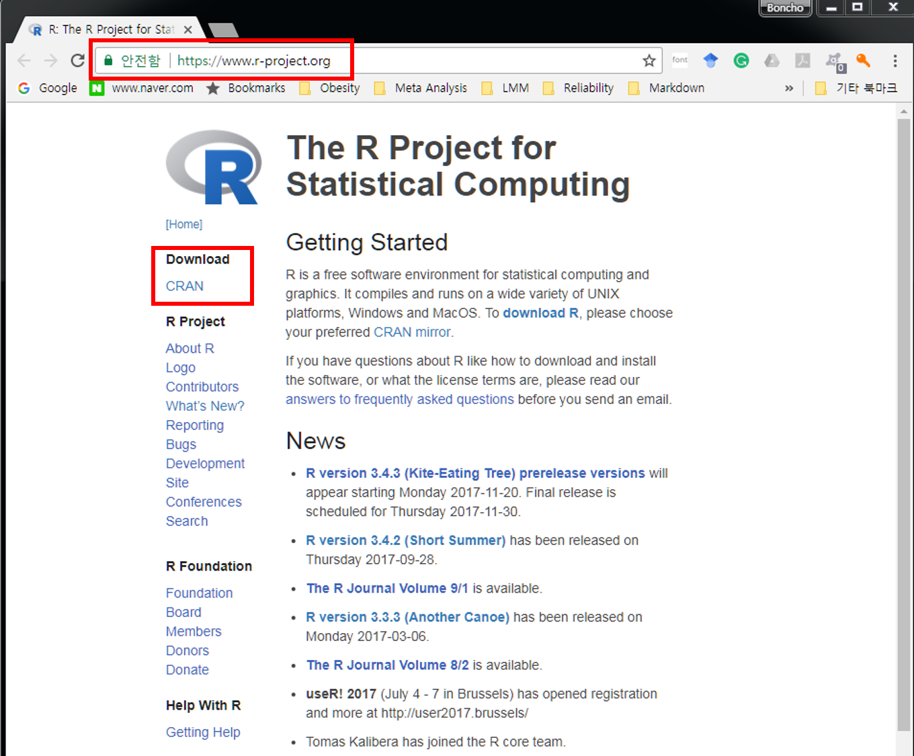

 \normalsize

<br/>

3. 클릭 후 연결한 페이지를 스크롤 후 Korea 아래 링크^[해당 링크들은 접속 시점에 따라 변경될 수 있음] 클릭 


\footnotesize

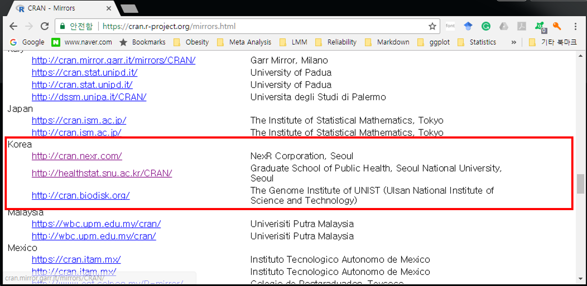

 \normalsize

<br/>

4. 클릭 후 세 가지 운영체제(Linux, Mac OS X, Windowns)에 따른 R 버전 선택 가능^[본 노트는 Windows 버전 설치만 다룸]


\footnotesize

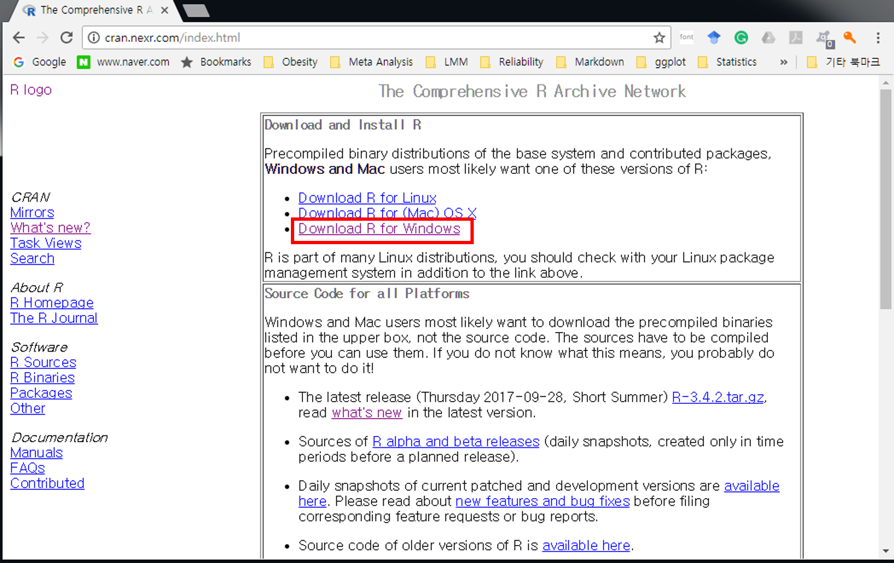

 \normalsize

<br/>

5. **Downloads R for Windows** 링크 클릭하면 다음과 같은 화면으로 이동

\footnotesize

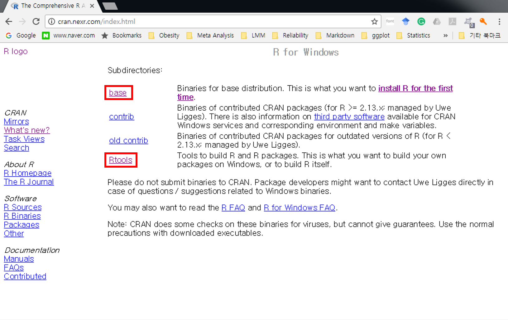

 \normalsize

<br/>

\footnotesize

\BeginKnitrBlock{rmdtip}<div class="rmdtip">다음 하위폴더에 대한 간략 설멍

- **`base`**: R 실행 프로그램
- **`contrib`**: R package의 바이너리 파일
- **`Rtools`**: R package 개발 및 배포를 위한 프로그램
</div>\EndKnitrBlock{rmdtip}

 \normalsize

<br/>

6. 위 화면에서 **base** 링크 클릭 후 아래 화면에서 **Downloads R 3.x.x for Windows** 를 클릭 후 설치 파일을 임의의 디렉토리에 저장 및 실행

\footnotesize

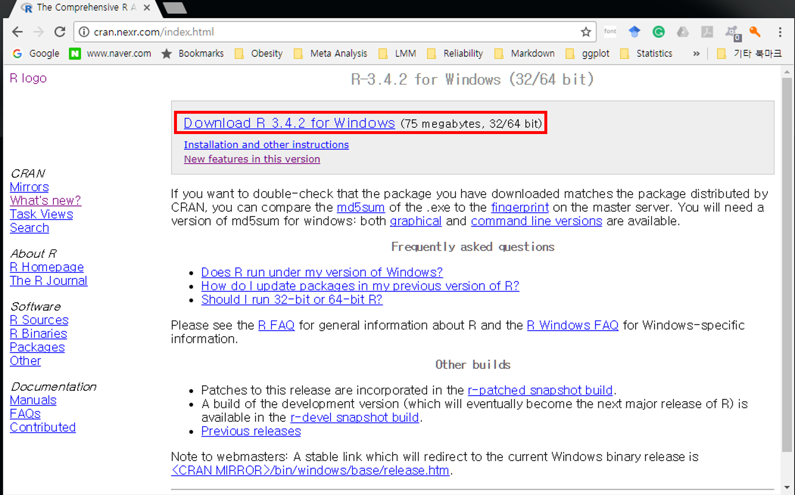

 \normalsize

<br/>


7. 다운로드한 파일을 실행하면 아래와 같은 대화창이 나타남
    - 한국어 선택 $\rightarrow$ 환영 화면에서 [다음(N)>] 클릭

\footnotesize

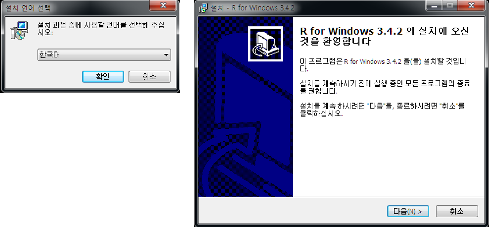

 \normalsize

<br/>

8. GNU 라이센스에 대한 설명 및 동의 여부([다음(N)>]) 클릭

\footnotesize

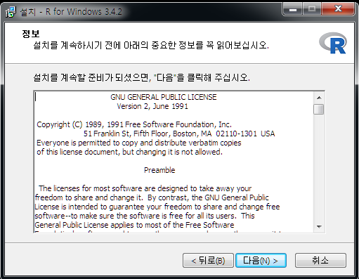

 \normalsize

<br/>

9. 설치 디렉토리 설정 및 구성요소 설지 여부
    - 원하는 디렉토리 설정(예: `C:\R\R-3.x.x`)
    - 기본 프로그램("Core Files"), 32 또는 64 bit 용 설치 파일, R console 한글 번역 모두 체크 뒤 [다음(N)>] 클릭

\footnotesize

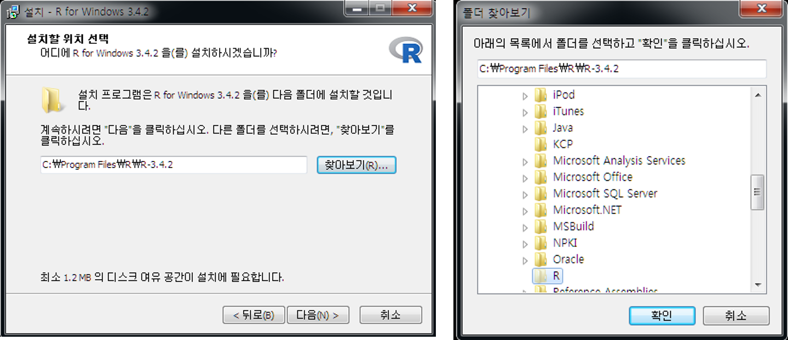

 \normalsize

\footnotesize


 \normalsize

<br/>

10. R 스타트업 옵션 지정
   - 기본값("No" check-button)으로도 설치 진행 가능
   - 본 문서에서는 스타트업 옵션 변경으로 진행

\footnotesize

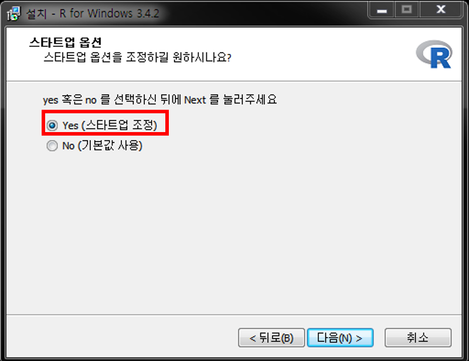

 \normalsize

<br/>

11. 화면표시방식(디스플레이 모드) 설정 변경
   - MDI: 한 윈도우 내에서 script 편집창, 출력, 도움말 창 사용
   - SDI: 다중 창에서 각각 script 편집창, 출력, 도움말 등을 독립적으로 열기

\footnotesize


 \normalsize

<br/>

12. 도움말 형식에서 HTML 도움말 기반 선택

\footnotesize

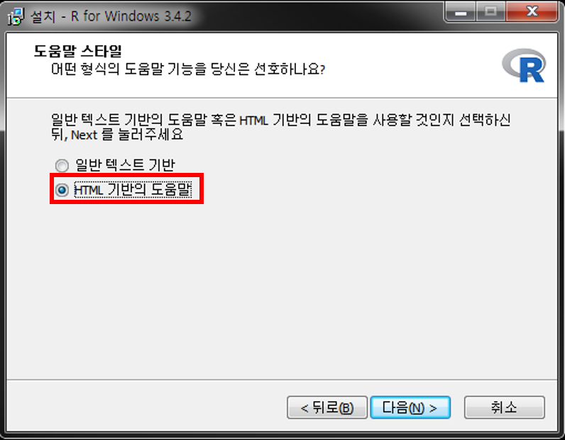

 \normalsize

<br/>

13. 시작메뉴 폴더 선택
   - "바로가기"를 생성할 시작 메뉴 폴더 지정 후 [다음(N)>] 클릭 후 설치 진행
   - 하단 "시작메뉴 폴더 만들지 않음" 체크박스 표시 시 시작메뉴에 "바로가기" 아이콘이 생성되지 않음(실행에 전혀 지장 없음)

\footnotesize

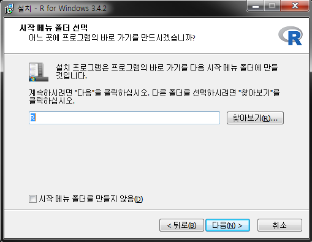

 \normalsize

<br/>

14. 추가 옵션 지정: 바탕화면 아이콘 생성 등 추가적 작업 옵션 체크 후 [다음(N)>] 클릭 $\rightarrow$ 설치 진행
   - 설치된 R 버전 정보 레지스트리 저장 여부 
   - `.Rdata` 확장자를 R 실행파일과 자동 연계

\footnotesize

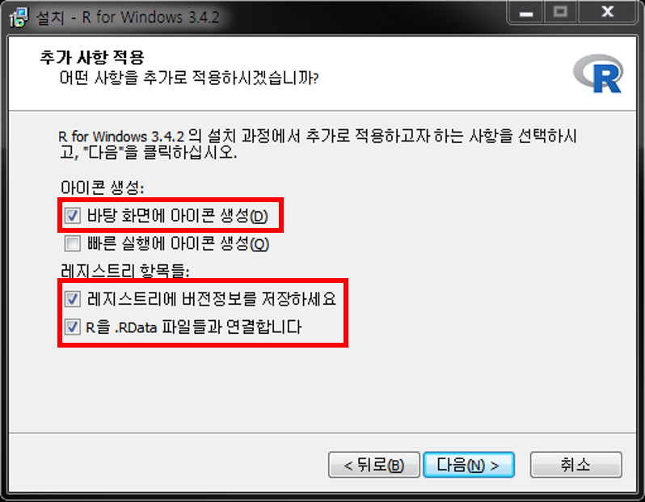

 \normalsize

<br/>

15. 설치 완료 후 바탕화면의 R 아이콘을 더블클릭하면 Rgui가 실행

\footnotesize

<div class="figure" style="text-align: center">

<p class="caption">(\#fig:r-console)Windows에서 R 실행화면(콘솔 창, SDI 모드)</p>
</div>

 \normalsize

## R 시작 및 작동 체크{#r-check}

\BeginKnitrBlock{rmdimportant}<div class="rmdimportant">**실습**: 설치된 R을 실행 후 보이는 R 콘솔(consle) 창에서 명령어를 실행하고 결과 확인</div>\EndKnitrBlock{rmdimportant}

그림 Figure \@ref(fig:r-console) 에서 `>` 기호는 R의 명령 프롬프트(prompt) 임

1. 현재 R session 정보(R 설치 버전, locale, 로딩 packages) 출력

\footnotesize


```r
# R의 설치 버전 및 현재 설정된 locale(언어, 시간대) 및 로딩된 R package 정보 출력
sessionInfo() 
```

```
R version 3.6.2 (2019-12-12)
Platform: x86_64-w64-mingw32/x64 (64-bit)
Running under: Windows 10 x64 (build 18363)

Matrix products: default

locale:
[1] LC_COLLATE=Korean_Korea.949  LC_CTYPE=Korean_Korea.949   
[3] LC_MONETARY=Korean_Korea.949 LC_NUMERIC=C                
[5] LC_TIME=Korean_Korea.949    

attached base packages:
[1] stats     graphics  grDevices utils     datasets  methods   base     

loaded via a namespace (and not attached):
 [1] Rcpp_1.0.3      bookdown_0.16   digest_0.6.25   mime_0.9       
 [5] magrittr_1.5    evaluate_0.14   highr_0.8       rlang_0.4.5    
 [9] stringi_1.4.5   rmarkdown_2.1   tools_3.6.2     stringr_1.4.0  
[13] markdown_1.1    xfun_0.12       yaml_2.2.1      compiler_3.6.2 
[17] htmltools_0.4.0 knitr_1.28     
```

 \normalsize


2. 문자열 출력

\footnotesize


```r
#문자열 출력
print("Hello R") #문자열
```

```
[1] "Hello R"
```

 \normalsize

> `#` 기호는 주석의 시작을 의미하고 실제로 실행되지 않음 같은 행에서 `#` 뒤 내용의 코드 역시 실행되지 않음

3. `a` 라는 변수에 숫자 9, `b`라는 변수에 숫자 7를 할당 후 출력

\footnotesize


```r
# 수치형 값(scalar)을 변수에 할당(assign)
# 여러 명령어를 한줄에 입력할 때에는 세미콜론(;)으로 구분
a = 9; b = 7
a
```

```
[1] 9
```

```r
b
```

```
[1] 7
```

 \normalsize

4. 변수 `a`와 `b`의 사칙연산

\footnotesize


```r
a+b; a-b; a*b; a/b
```

```
[1] 16
```

```
[1] 2
```

```
[1] 63
```

```
[1] 1.285714
```

 \normalsize

5. R 그래픽 맛보기: 정규분포로부터 난수 100개 생성 후 생성된 데이터에 대한 히스토그램 작성

\footnotesize


```r
# 난수 생성 시 값은 매번 달라지기 때문에 seed를 주어 일정값이 생성되도록 고정
# "="과 "<-"는 모두 동일한 기능을 가진 할당 연산자임
#평균이 0 이고 분산이 1인 정규분포에서 난수 100개 생성
set.seed(12345) # random seed 지정
x <- rnorm(100) # 난수 생성
hist(x) # 히스토그램
```

<div class="figure" style="text-align: center">

<p class="caption">(\#fig:check-04)정규분포 100개의 히스토그램</p>
</div>

 \normalsize

\footnotesize

\BeginKnitrBlock{rmdtip}<div class="rmdtip">R 명령어 또는 전체 프로그램 소스 실행 시 매우 빈번히 오류가 나타나는데, 이를 해결할 수 있는 가장 좋은 방법은 앞에서 언급한 Google을 이용한 검색 또는 R 설치 시 자체적으로 내장되어 있는 도움말을 참고하는 것이 가장 효율적임. </div>\EndKnitrBlock{rmdtip}

 \normalsize


\footnotesize

<table class="table table-condensed table-striped" style="font-size: 10px; margin-left: auto; margin-right: auto;">
<caption style="font-size: initial !important;">(\#tab:tab-help)R help 관련 명령어 리스트</caption>
 <thead>
  <tr>
   <th style="text-align:left;"> 도움말 보기 명령어 </th>
   <th style="text-align:left;"> 설명 </th>
   <th style="text-align:left;"> 사용법 </th>
  </tr>
 </thead>
<tbody>
  <tr>
   <td style="text-align:left;"> `help` 또는 `?` </td>
   <td style="text-align:left;width: 5cm; "> 도움말 시스템 호출 </td>
   <td style="text-align:left;"> `help(함수명)` </td>
  </tr>
  <tr>
   <td style="text-align:left;"> `help.search` 또는 `??` </td>
   <td style="text-align:left;width: 5cm; "> 주어진 문자열을 포함한 문서 검색 </td>
   <td style="text-align:left;"> `help.search(pattern)` </td>
  </tr>
  <tr>
   <td style="text-align:left;"> `example` </td>
   <td style="text-align:left;width: 5cm; "> topic의 도움말 페이지에 있는 examples section 실행 </td>
   <td style="text-align:left;"> `example(함수명)` </td>
  </tr>
  <tr>
   <td style="text-align:left;"> `vignette` </td>
   <td style="text-align:left;width: 5cm; "> topic의 pdf 또는 html 레퍼런스 메뉴얼 불러오기 </td>
   <td style="text-align:left;"> `vignette(패키지명 또는 패턴)` </td>
  </tr>
</tbody>
</table>

 \normalsize

\footnotesize

\BeginKnitrBlock{rmdtip}<div class="rmdtip">**Vignette** 의 활용

- `vignette()`에서 제공하는 문서는 데이터를 기반으로 사용하고자 하는 패키지의 실제 활용 예시를 작성한 문서이기 때문에 초보자들이 R 패키지 활용에 대한 접근성을 높혀줌.
- `browseVignettes()` 명령어를 통해 vignette을 제공하는 R 패키지 및 해당 vignette 문서 확인 가능 
</div>\EndKnitrBlock{rmdtip}

 \normalsize

## R script 편집기 사용{#rconsle-script}

\BeginKnitrBlock{rmdimportant}<div class="rmdimportant">**실습**: R 설치 후 Rgui 에서 제공하는 편집기(R editor)에 명령어를 입력하고 실행
</div>\EndKnitrBlock{rmdimportant}

설치된 R을 실행 후 상단 pull-down 메뉴에서 [**File**] $\rightarrow$ [**새 스크립트**]를 선택하면 아래 그림과 같이 편집창(R 인스톨 시 SDI 옵션 기준)이 나타남

\footnotesize

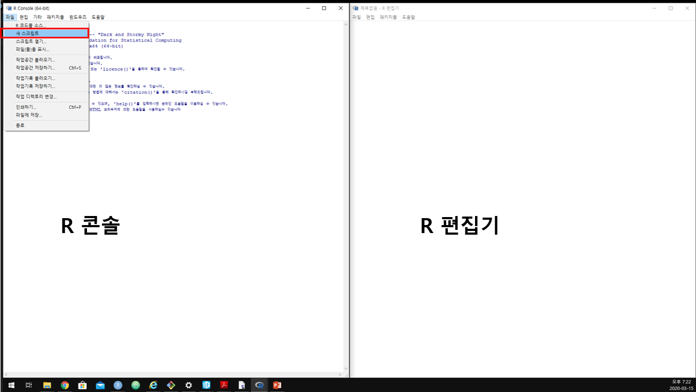

 \normalsize

편집기 창에 다음 명령어 입력

\footnotesize


```r
# R에 내장된 cars 데이터셋 불러오기 cars dataset에 포함된 변수들의 기초통계량
# 출력 2차원 산점도
data(cars)
help(cars)  # cars 데이터셋에 대한 설명 help 창에 출력
head(cars)  # cars 데이터셋 처음 6개 행 데이터 출력
summary(cars)  # cars 데이터셋 요약
plot(cars)  # 변수가 2개인 경우 산점도 출력
```

 \normalsize

- 편집창에서 한 줄을 실행시키려면 명령어가 입력된 줄에서 **[Ctrl]** + **[R]** 입력
- 편집창에 입력한 모든 명령어를 실행시키려면 모든 줄을 선택(마우스 또는 [Shift] + $\downarrow$)


\footnotesize


```
  speed dist
1     4    2
2     4   10
3     7    4
4     7   22
5     8   16
6     9   10
```

```
     speed           dist       
 Min.   : 4.0   Min.   :  2.00  
 1st Qu.:12.0   1st Qu.: 26.00  
 Median :15.0   Median : 36.00  
 Mean   :15.4   Mean   : 42.98  
 3rd Qu.:19.0   3rd Qu.: 56.00  
 Max.   :25.0   Max.   :120.00  
```

<div class="figure">

<p class="caption">(\#fig:check-edit-out)cars 데이터셋의 speed와 dist 간 2차원 산점도: speed는 자동차 속도(mph)이고 dist는 해당 속도에서 브레이크를 밟았을 때 멈출 때 까지 걸린 거리(ft)를 나타냄.</p>
</div>

 \normalsize

- R은 명령어를 입력하고 실행결과를 확인하는 대화형(interpreter) 방식
- 콘솔창에서 $\uparrow$/$\downarrow$를 누르면 이전/이후 실행 명령 기록 확인 가능
- 여러 줄 이상 R 명령어라든가 반복적, 장기간 작업을 수행해야 할 경우 R 명령어로 구성된 스크립트 작성 후 일괄 실행하는 것이 일반적
- 여러 다중 명령 코딩 시 콘솔창에 직접 입력하는 것은 비효율적이므로 스크립트 에디터를 사용
- 위 예시처럼 R 에디터 사용할 수 있으나 가독성 및 코딩 효율이 떨어짐
- 과거 많이 사용됐던 R 에디터: [WinEdt](http://www.winedt.com), [Tinn-R](https://sourceforge.net/projects/tinn-r/), [Vim](http://www.vim.org/scripts/script.php?script_id=2628)
- 현재 가장 범용적 R 에디터: **Rstudio**

## RStudio{#r-studio}

- [RStudio](https://rstudio.com/): R 통합 분석/개발 환경(integrated development environment, IDE)으로 현재 가장 대중적으로 사용되고 있는 R 사용 환경
- 명령 곤솔 외 파일 편집, 데이터 객체, 명령 기록(.history), 그래프 등에 쉽게 접근 가능
- RStudio 독자적인 개발 환경 제공: Rmarkdown, Rnotebook, Shiny Web Application 등 다양한 R 환경을 제공
- 버전관리(git, subversion)를 통해 project 관리 가능
- **무료** 및 유료 소프트웨어 제공

### RStudio 설치하기{#rstudio-install}

1. 웹 브라우저를 통해 https://rstudio.com 접속 후 상단 [DOWNLOAD](https://rstudio.com/products/rstudio/download/) 링크 클릭

\footnotesize

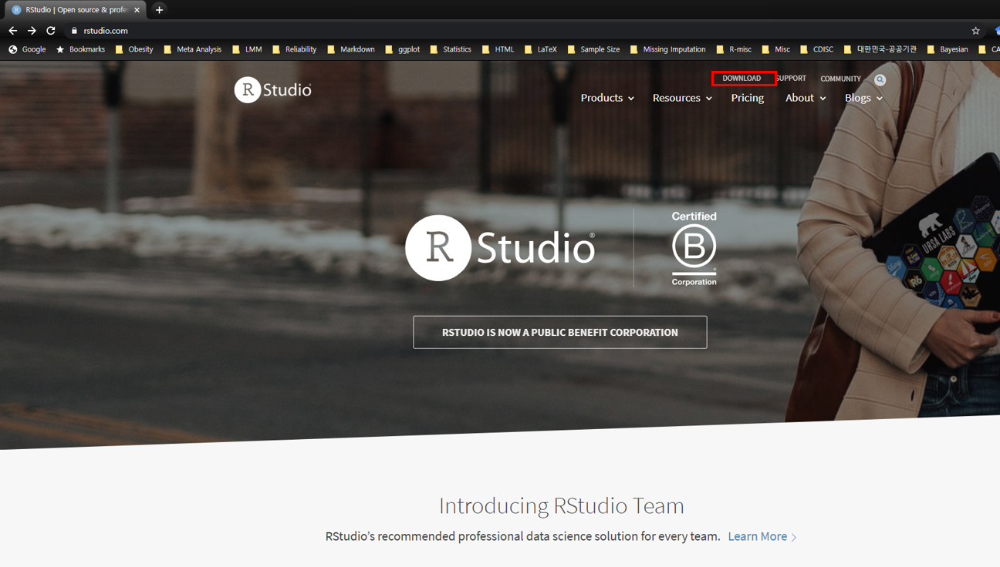

 \normalsize

2. Desktop 또는 Server 버전 중 택일

   - 서버용 설치를 위해서는 Server 클릭 $\rightarrow$ 소규모 자료 분석용으로는 불필요
   - 여기서는 **Desktop** 버전 선택 후 다음 링크로 이동
  
\footnotesize

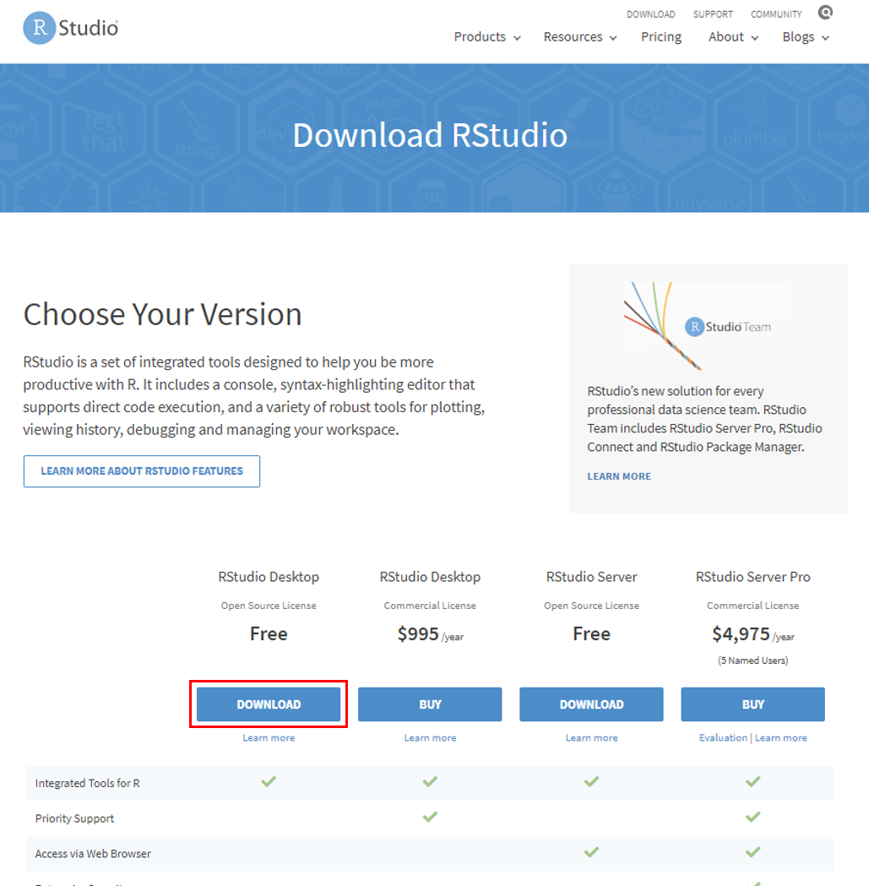

 \normalsize

3. 운영체제에 맞는 Rstudio installer 다운로드(여기서는 Windows 버전 다운로드)

\footnotesize

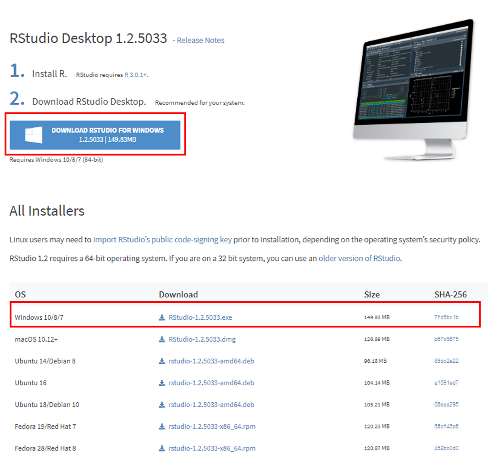

 \normalsize

4. RStudio installer 다운로드 시 파일이 저장된 폴더에서 보통 `RStudio-xx.xx.xxx.exe` 형식의 파일명 확인
   - 더블 클릭 후 실행
   - **[다음>]** 몇 번 클릭 후 설치 종료

\footnotesize

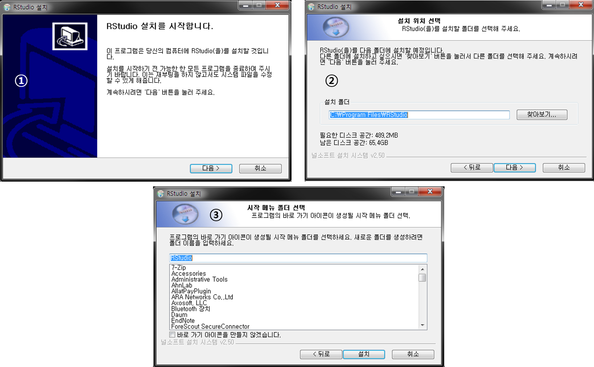

 \normalsize


# References {-}


