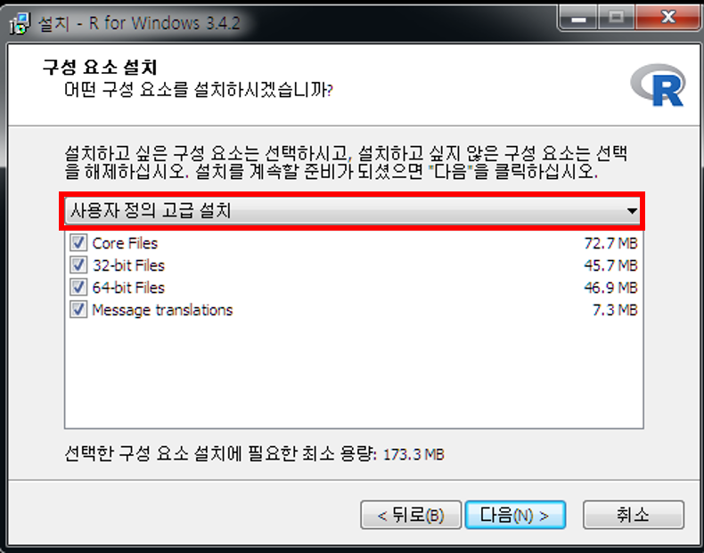
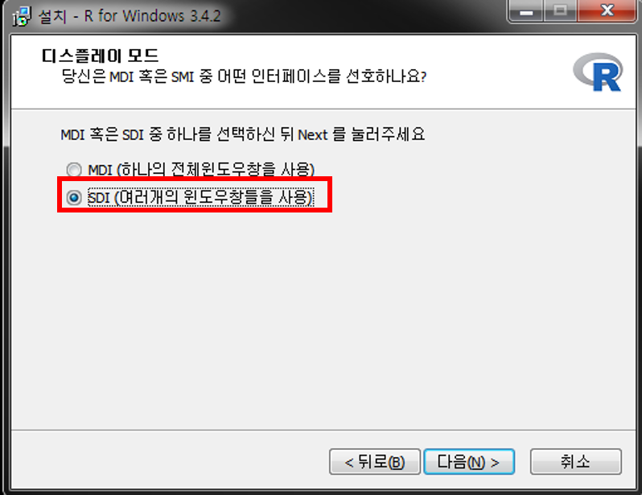

\mainmatter


# (PART) Get Started {-}

# Introduction {#intro-chap}

**1. R프로그램**

   - 데이터 분석을 위한 자료 전처리, 통계 및 시각화를 지원하는 컴퓨터 언어 및 환경
   - 1980년 AT&T 벨 연구소의 John Chambers가 개발한 S 언어를 기반으로 1995년 뉴질랜드 Auckland 대학의 통계학과 교수 Robert Gentleman과 Ross Ihaka 가 개발
   - [GNU](https://en.wikipedia.org/wiki/GNU_Project) 기반의 오픈 소스
   - 통계학, 전산학, 생물학, 의학 등 거의 모든 학문분야에서 분석도구로 활용되고 있고, 최근 data science 분야에서 널리 활용


**2. R 언어의 특징**

   - **무료 소프트웨어**
   - [CRAN (Comprehensive R Archive Network)](http://cran.r-project.org/web/view)에서 배포
   - 특정 vendor가 아닌 전 세계 연구자들이 개발한 알고리즘 및 최신 함수 활용 가능(packaging system)
   - 범용적으로 사용되는 거의 대부분의 운영체제(Windows, Mac, Linux)에서 작동 가능
   - 방대한 개발 및 사용 생태계 형성 
   - 강력한 그래픽 기능

\BeginKnitrBlock{rmdtip}<div class="rmdtip">**유용한 웹 사이트**: R과 관련한 거의 모든 문제는 Googling (구글을 이용한 검색)을 통해 해결 가능(검색주제 + "in R" or "in R software")하고 많은 해답들이 아래 열거한 웹 페이지에 게시되어 있음. 

- R 프로그래밍에 대한 Q&A: [Stack Overflow](https://stackoverflow.com)
- R 관련 웹 문서 모음: [Rpubs](https://rpubs.com/)
- R package에 대한 raw source code 제공: [Github](https://github.com)
- R을 이용한 통계 분석: [Statistical tools for high-throughput data analysis (STHDA)](http://www.sthda.com/english/)
</div>\EndKnitrBlock{rmdtip}


## R 설치하기 {#installation}

R 다운로드 사이트: https://www.r-project.org 또는 https://cran.r-project.org

1. 웹 브라우저(i.e. Explore, Chrome, Firefox 등)의 주소 입력창에 https://www.r-project.org

2. 좌측 R Logo 하단 Download 아래 CRAN 클릭


<br/>

3. 클릭 후 연결한 페이지를 스크롤 후 Korea 아래 링크^[해당 링크들은 접속 시점에 따라 변경될 수 있음] 클릭 


<br/>

4. 클릭 후 세 가지 운영체제(Linux, Mac OS X, Windowns)에 따른 R 버전 선택 가능^[본 노트는 Windows 버전 설치만 다룸]


<br/>

5. **Downloads R for Windows** 링크 클릭하면 다음과 같은 화면으로 이동


<br/>

\BeginKnitrBlock{rmdtip}<div class="rmdtip">다음 하위폴더에 대한 간략 설멍

- **`base`**: R 실행 프로그램
- **`contrib`**: R package의 바이너리 파일
- **`Rtools`**: R package 개발 및 배포를 위한 프로그램
</div>\EndKnitrBlock{rmdtip}

<br/>

6. 위 화면에서 **base** 링크 클릭 후 아래 화면에서 **Downloads R 3.x.x for Windows** 를 클릭 후 설치 파일을 임의의 디렉토리에 저장 및 실행


<br/>


7. 다운로드한 파일을 실행하면 아래와 같은 대화창이 나타남
    - 한국어 선택 $\rightarrow$ 환영 화면에서 [다음(N)>] 클릭


<br/>

8. GNU 라이센스에 대한 설명 및 동의 여부([다음(N)>]) 클릭


<br/>

9. 설치 디렉토리 설정 및 구성요소 설지 여부
    - 원하는 디렉토리 설정(예: `C:\R\R-3.x.x`)
    - 기본 프로그램("Core Files"), 32 또는 64 bit 용 설치 파일, R console 한글 번역 모두 체크 뒤 [다음(N)>] 클릭




<br/>

10. R 스타트업 옵션 지정
   - 기본값("No" check-button)으로도 설치 진행 가능
   - 본 문서에서는 스타트업 옵션 변경으로 진행


<br/>

11. 화면표시방식(디스플레이 모드) 설정 변경
   - MDI: 한 윈도우 내에서 script 편집창, 출력, 도움말 창 사용
   - SDI: 다중 창에서 각각 script 편집창, 출력, 도움말 등을 독립적으로 열기



<br/>

12. 도움말 형식에서 HTML 도움말 기반 선택


<br/>

13. 시작메뉴 폴더 선택
   - "바로가기"를 생성할 시작 메뉴 폴더 지정 후 [다음(N)>] 클릭 후 설치 진행
   - 하단 "시작메뉴 폴더 만들지 않음" 체크박스 표시 시 시작메뉴에 "바로가기" 아이콘이 생성되지 않음(실행에 전혀 지장 없음)


<br/>

14. 추가 옵션 지정: 바탕화면 아이콘 생성 등 추가적 작업 옵션 체크 후 [다음(N)>] 클릭 $\rightarrow$ 설치 진행
   - 설치된 R 버전 정보 레지스트리 저장 여부 
   - `.Rdata` 확장자를 R 실행파일과 자동 연계


<br/>

15. 설치 완료 후 바탕화면의 R 아이콘을 더블클릭하면 Rgui가 실행

<div class="figure" style="text-align: center">

<p class="caption">(\#fig:r-console)Windows에서 R 실행화면(콘솔 창, SDI 모드)</p>
</div>

## R 시작 및 작동 체크{#r-check}

\BeginKnitrBlock{rmdimportant}<div class="rmdimportant">**실습**: 설치된 R을 실행 후 보이는 R 콘솔(consle) 창에서 명령어를 실행하고 결과 확인</div>\EndKnitrBlock{rmdimportant}

그림 Figure \@ref(fig:r-console) 에서 `>` 기호는 R의 명령 프롬프트(prompt) 임

1. 문자열 출력


```r
#문자열 출력
print("Hello R") #문자열
```

```
[1] "Hello R"
```

> `#` 기호는 주석의 시작을 의미하고 실제로 실행되지 않음 같은 행에서 `#` 뒤 내용의 코드 역시 실행되지 않음

2. `a` 라는 변수에 숫자 9, `b`라는 변수에 숫자 7를 할당 후 출력


```r
# 수치형 값(scalar)을 변수에 할당(assign)
# 여러 명령어를 한줄에 입력할 때에는 세미콜론(;)으로 구분
a = 9; b = 7
a
```

```
[1] 9
```

```r
b
```

```
[1] 7
```

3. 변수 `a`와 `b`의 사칙연산

```r
a+b; a-b; a*b; a/b
```

```
[1] 16
```

```
[1] 2
```

```
[1] 63
```

```
[1] 1.285714
```

4. R 그래픽 맛보기: 정규분포로부터 난수 100개 생성 후 생성된 데이터에 대한 히스토그램 작성

```r
# 난수 생성 시 값은 매번 달라지기 때문에 seed를 주어 일정값이 생성되도록 고정
# "="과 "<-"는 모두 동일한 기능을 가진 할당 연산자임
#평균이 0이고 분산이 1인 정규분포에서 난수 100개 생성
set.seed(12345) # random seed 지정
x <- rnorm(100) # 난수 생성
hist(x) # 히스토그램
```

<div class="figure" style="text-align: center">

<p class="caption">(\#fig:check-04)정규분포 100개의 히스토그램</p>
</div>

\BeginKnitrBlock{rmdtip}<div class="rmdtip">R 명령어 또는 전체 프로그램 소스 실행 시 매우 빈번히 오류가 나타나는데, 이를 해결할 수 있는 가장 좋은 방법은 앞에서 언급한 Google을 이용한 검색 또는 R 설치 시 자체적으로 내장되어 있는 도움말을 참고하는 것이 가장 효율적임. </div>\EndKnitrBlock{rmdtip}

\texttt{help}


# References {-}

   

