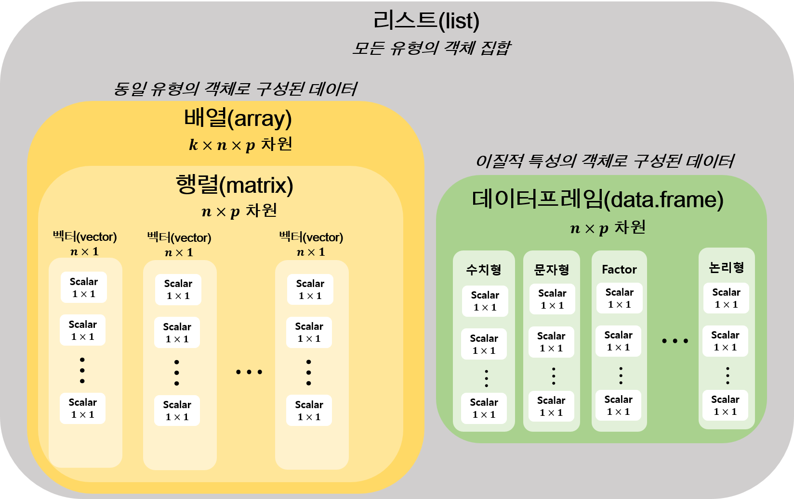

# 데이터 타입(Data Type) {#data-type}


```
## Warning: 패키지 'knitr'는 R 버전 3.6.3에서 작성되었습니다
```

\footnotesize

\BeginKnitrBlock{rmdnote}<div class="rmdnote">**학습목표(2 주차)**: R의 데이터 차입 중 가장 기본이 되는 스칼라, 백터, 리스트에 대한 이해와 해당 객체를 생성하고, 이와 연관된 함수들을 익힌다.</div>\EndKnitrBlock{rmdnote}

 \normalsize


#### 학습 필요성 {#ch2-abstract .unnumbered}

- R언어는 타 프로그래밍 언어와 유사한 자료형(정수형, 실수형, 문자형 등)을 제공
- R 언어가 다른 언어와 차이점 $\rightarrow$ **데이터 분석**에 특화된 벡터(vector), 행렬(matrix), 데이터프레임(data frame), 리스트(list)와 같은 객체^[R에서 사용자가 데이터 입력을 위해 생성 또는 읽어온 객체(object)는 종종 변수(variable)라는 말과 혼용. 본 문서에서는 최상위 데이터 저장장소를 객체라고 명명하며 데이터프레임과 같이 여러 종류의 데이터타입으로 이루어진 객체의 1차원 속성을 변수라고 칭함] 제공
- R 패키지에서 제공되는 함수 사용 방법은 R의 데이터 타입(객체)에 따라 달라질 수 있음  
- R 언어를 원활히 다룰 수 있으려면 R에서 데이터 객체의 형태, 자료 할당 및 그 연산 방법에 대한 이해가 필수적으로 선행되어야 함


#### R 객체의 종류 {#ch2-object-type .unnumbered}

- 스칼라(상수형, scalar 또는 atomic)
- 벡터(vector): **R의 기본연산 단위**
- 리스트(list)
- 행렬(matrix)
- 배열(array)
- 데이터프레임(data frame)
- 함수(function)
- 연산자(operator) ...


R 객체 중 scalar, vector, matrix, data.frame $\rightarrow$ 데이터 객체(object)


#### 객체에 입력 가능한 값 {#object-value .unnumbered}

- **수치형(numeric)**: 숫자(정수, 소수)

- **문자열(string)**: `"충남대학교"`, `"R강의"`

- **논리형(logical)**: `TRUE`/`FALSE`

- **결측값(`NA`)**: 자료에서 발생한 결측 표현

- **공백(`NULL`)**: 지정하지 않은 값

- **요인(factor)**: 범주형 자료 표현(수치 + 문자 결합 형태로 이해하면 편함)

- **기타**: 결측(`NA`), 숫자아님(`NaN`), 무한대(`Inf`) 등


**아래 그림은 2~4 주차에 배울 R의 데이터 타입에 대한 개요도임**

\footnotesize

<div class="figure" style="text-align: center">

<p class="caption">(\#fig:rmarkdown-part)R 데이터 타입 구조 다이어그램: [R, Python 분석과 프로그래밍 (by R Friend)]( http://rfriend.tistory.com/)에서 발췌 후 수정</p>
</div>

 \normalsize


## 스칼라(scalar) {#scalar}

- 단일 차원의 값(하나의 값): $1 \times 1$ 백터로 표현 $\rightarrow$ R 데이터 객체의 기본은 벡터!!
- 데이터 객체의 유형은 크게 숫자형, 문자열, 논리형이 있음

\footnotesize

\BeginKnitrBlock{rmdtip}<div class="rmdtip">스칼라를 입력시 R의 벡터 지정 함수인 `c()`(벡터 부분에서 상세 내용 학습)를 꼭 사용해서 입력할 필요가 없다. 단, 두 개 이상 스칼라면 벡터이므로 꼭 c()를 써야 한다.</div>\EndKnitrBlock{rmdtip}

 \normalsize

### 선언

- 일반적으로 컴파일이 필요한 언어(예: `C` 언어)의 경우 변수 또는 객체를 사용 전에 선언이 필요

\footnotesize


```c
int x; 
x = 1;
```

 \normalsize

- 위 코드에서 `int x;` 없이 `x = 1`을 입력 후 컴파일 하면 에러가 나타나지만 `R` 언어에서는 **변수를 선언할 필요가 전혀 없음** 

- `z` 가 어떤 데이터 타입인지 언급할 필요가 전혀 없음 $\rightarrow$ `Python`, `Perl`, `Matlab` 등과 같은 스크립트 언어의 특징. 아래 코드 참조

\footnotesize


```r
z <- 3
z
```

```
[1] 3
```

 \normalsize


### 숫자형 {#numeric}

- 정수형(integer)과 실수형(double)로 구분됨
- 정수형 구분시 숫자 뒤 `L`을 표시

\footnotesize


```r
# 정수형 구분자 사용 예시
# typeof(): R 객체의 데이터 타입 반환하는 함수
typeof(10L)
```

```
[1] "integer"
```

```r
typeof(10)
```

```
[1] "double"
```

 \normalsize

- 수치연산(`+, -, *, ^, **, /, %%, %/%`) 가능: R은 함수형 언어이기 때문에 앞에 기술한 연산자도 하나의 함수로 인식함. 
- 수치 연산자(operator) 및 기본 수학 함수

\footnotesize

<table class="table table-condensed table-striped" style="font-size: 10px; margin-left: auto; margin-right: auto;">
<caption style="font-size: initial !important;">(\#tab:operation)R언어의 기본 수치 연산자</caption>
 <thead>
  <tr>
   <th style="text-align:left;"> 수치형 연산자 </th>
   <th style="text-align:left;"> 설명 </th>
  </tr>
 </thead>
<tbody>
  <tr>
   <td style="text-align:left;width: 4cm; "> +, -, *, / </td>
   <td style="text-align:left;width: 6cm; "> 사칙연산 </td>
  </tr>
  <tr>
   <td style="text-align:left;width: 4cm; "> n %% m </td>
   <td style="text-align:left;width: 6cm; "> n을 m 으로 나눈 나머지 </td>
  </tr>
  <tr>
   <td style="text-align:left;width: 4cm; "> n %/% m </td>
   <td style="text-align:left;width: 6cm; "> n을 m 으로 나눈 몫 </td>
  </tr>
  <tr>
   <td style="text-align:left;width: 4cm; "> n ^ m 또는 n ** m </td>
   <td style="text-align:left;width: 6cm; "> n 의 m 승 </td>
  </tr>
</tbody>
</table>

 \normalsize

**숫자형 스칼라 연산 적용 예시**

\footnotesize


```r
# 숫자형 스칼라
a <- 3
b <- 10
a; b
```

```
[1] 3
```

```
[1] 10
```

```r
# 덧셈
c <- a + b
c
```

```
[1] 13
```

```r
# 덧셈을 함수로 입력
# "+"(a, b)로 입력한 결과
c <- "+"(a, b)

# 뺄셈
d <- b - a
d
```

```
[1] 7
```

```r
# 곱셈
m <- a * b
m
```

```
[1] 30
```

```r
# 나누기
dd <- b/a
dd
```

```
[1] 3.333333
```

```r
# 멱승
b^a
```

```
[1] 1000
```

```r
# 나누기의 나머지(remainder) 반환
r <- b %% a
r
```

```
[1] 1
```

```r
# 나누기의 몫(quotient) 반환
q <- b %/% a
q
```

```
[1] 3
```

```r
# 연산 우선 순위
nn <- (3 + 5)*3 - 4**2/4
nn
```

```
[1] 20
```

 \normalsize

### 문자형 {#character}

- 수치형이 아닌 문자 형식의 단일 원소
- C와 같은 언어에서 볼수 있는 한개 문자에 대한 데이터 타입 존재하지 않음
- 수치연산 불가능
- 따옴표(`"` 또는 `'`)로 문자를 묶어서 문자열 표시
- 문자열을 다루는 자세한 설명은 5주차에서 자세히 설명할 예정임

\footnotesize


```r
h1 <- c("Hello CNU!!")
h2 <- c("R is not too difficult.")
typeof(h1); typeof(h2)
```

```
[1] "character"
```

```
[1] "character"
```

```r
h1
```

```
[1] "Hello CNU!!"
```

```r
h2
```

```
[1] "R is not too difficult."
```

```r
# 문자열의 문자 수 반환
nchar(h1); nchar(h2)
```

```
[1] 11
```

```
[1] 23
```

```r
# 문자열 연산 error 예시
h1 - h2
```

```
Error in h1 - h2: 이항연산자에 수치가 아닌 인수입니다
```

 \normalsize

### 논리형 스칼라 {#logical}

- 참(`TRUE`, `T`) 또는 거짓(`FALSE`, `F`)를 나타내는 값
- `TRUE`/`FALSE`: 예약어(reversed word)
- `T`/`F`: `TRUE`와 `FALSE`로 초기화된 전역 변수 
   - `T`에 `FALSE` 또는 어떤 값도 할당 가능 $\rightarrow$ 가급적 `TRUE/FALSE`를 명시하는 것이 편함
- 논리형 연산자(logical operator)

\footnotesize

<table class="table table-condensed table-striped" style="font-size: 10px; margin-left: auto; margin-right: auto;">
<caption style="font-size: initial !important;">(\#tab:logic-op-tab)R언어의 논리형 연산자</caption>
 <thead>
  <tr>
   <th style="text-align:left;"> 논리형 연산자 </th>
   <th style="text-align:left;"> 설명 </th>
  </tr>
 </thead>
<tbody>
  <tr>
   <td style="text-align:left;width: 3cm; "> &amp; </td>
   <td style="text-align:left;width: 7cm; "> AND (vectorized) </td>
  </tr>
  <tr>
   <td style="text-align:left;width: 3cm; "> &amp;&amp; </td>
   <td style="text-align:left;width: 7cm; "> AND (atomic) </td>
  </tr>
  <tr>
   <td style="text-align:left;width: 3cm; "> | </td>
   <td style="text-align:left;width: 7cm; "> OR (vectorized) </td>
  </tr>
  <tr>
   <td style="text-align:left;width: 3cm; "> || </td>
   <td style="text-align:left;width: 7cm; "> OR (atomic) </td>
  </tr>
  <tr>
   <td style="text-align:left;width: 3cm; "> ! </td>
   <td style="text-align:left;width: 7cm; "> NOT </td>
  </tr>
</tbody>
</table>

 \normalsize


- 비교 연산자를 적용할 경우 논리값을 반환

\footnotesize

<table class="table table-condensed table-striped" style="font-size: 10px; margin-left: auto; margin-right: auto;">
<caption style="font-size: initial !important;">(\#tab:comp-op-tab)R언어의 비교 연산자</caption>
 <thead>
  <tr>
   <th style="text-align:left;"> 비교 연산자 </th>
   <th style="text-align:left;"> 설명 </th>
  </tr>
 </thead>
<tbody>
  <tr>
   <td style="text-align:left;width: 3cm; "> &gt; </td>
   <td style="text-align:left;width: 7cm; "> 크다(greater-than) </td>
  </tr>
  <tr>
   <td style="text-align:left;width: 3cm; "> &lt; </td>
   <td style="text-align:left;width: 7cm; "> 작다(less-than) </td>
  </tr>
  <tr>
   <td style="text-align:left;width: 3cm; "> == </td>
   <td style="text-align:left;width: 7cm; "> 같다(equal) </td>
  </tr>
  <tr>
   <td style="text-align:left;width: 3cm; "> &gt;= </td>
   <td style="text-align:left;width: 7cm; "> 크거나 같다(greater than equal) </td>
  </tr>
  <tr>
   <td style="text-align:left;width: 3cm; "> &lt;= </td>
   <td style="text-align:left;width: 7cm; "> 작거나 같다(less than equal) </td>
  </tr>
  <tr>
   <td style="text-align:left;width: 3cm; "> != </td>
   <td style="text-align:left;width: 7cm; "> 같지 않다(not equal) </td>
  </tr>
</tbody>
<tfoot>
<tr><td style="padding: 0; border: 0;" colspan="100%"><span style="font-style: italic;">Note: </span></td></tr>
<tr><td style="padding: 0; border: 0;" colspan="100%">
<sup></sup> 기술한 비교 연산자는 수치형 및 논리형 데이터 타입 모두에 적용 가능 하지만, 문자형은 비교 연산은 ==, != 만 가능함</td></tr>
</tfoot>
</table>

 \normalsize


\footnotesize

\BeginKnitrBlock{rmdnote}<div class="rmdnote">**참고**

- 논리형 스칼라도 숫자형 연산 가능 $\rightarrow$ 컴퓨터는 `TRUE`/`FALSE`를 1과 0 숫자로 인식
- 수치 연산자는 스칼라 뿐 아니라 아래에서 다룰 벡터, 행렬, 리스트, 데이터프레임 객체의 연산에 사용 가능
- `&`/`|`와 `&&`/`||`는 동일하게 AND/OR를 의미하지만 연산 결과가 다름.
- `&`의 연산 대상이 벡터인 경우 백터 구성 값 각각에 대해 `&` 연산을 실행 하지만 `&&`는 하나의 값(스칼라)에만  논리 연산이 적용(아래 예시 참고)
</div>\EndKnitrBlock{rmdnote}

 \normalsize


- 논리형 스칼라의 논리 및 비교 연산 예시

\footnotesize


```r
typeof(TRUE)  # TRUE의 데이터 타입
```

```
[1] "logical"
```

```r
TRUE & TRUE  # TRUE 반환
```

```
[1] TRUE
```

```r
TRUE & FALSE  # FALSE 반환
```

```
[1] FALSE
```

```r
# 아래 연산은 모두 TRUE 반환
TRUE | TRUE
```

```
[1] TRUE
```

```r
TRUE | FALSE
```

```
[1] TRUE
```

```r
# TRUE와 FALSE의 반대
!TRUE
```

```
[1] FALSE
```

```r
!FALSE
```

```
[1] TRUE
```

```r
# 전역변수 T에 FALSE 값 할당
T <- FALSE
T
```

```
[1] FALSE
```

```r
T <- TRUE  # 원상복귀

# TRUE/FALSE에 값을 할당할 수 없음
TRUE <- 1
```

```
Error in TRUE <- 1: 대입에 유효하지 않은 (do_set) 좌변입니다
```

```r
TRUE <- FALSE
```

```
Error in TRUE <- FALSE: 대입에 유효하지 않은 (do_set) 좌변입니다
```

```r
# &(|)와 &&(||)의 차이
l.01 <- c(TRUE, TRUE, FALSE, TRUE)  # 논리형 값으로 구성된 벡터
l.02 <- c(FALSE, TRUE, TRUE, TRUE)

l.01 & l.02  # l.01과 l.02 각 원소 별 & 연산
```

```
[1] FALSE  TRUE FALSE  TRUE
```

```r
l.01 && l.02  # l.01과 l.02의 첫 번째 원소에 대해 & 연산
```

```
[1] FALSE
```

```r
# 비교 연산자
x <- 9
y <- 4

# x > y 의 반환값 데이터 타입
typeof(x > y)
```

```
[1] "logical"
```

```r
# 논리형 값 반환
x > y
```

```
[1] TRUE
```

```r
x < y
```

```
[1] FALSE
```

```r
x == y
```

```
[1] FALSE
```

```r
x != y
```

```
[1] TRUE
```

 \normalsize

### 결측값(missing value) {#missing-value}

- 결측치 지정 **상수**: `NA` $\rightarrow$ R과 다른 언어의 가장 큰 차이점 중 하나
- 예를 들어 4명의 통계학과 학생 중 3명의 통계학 개론 중간고사 점수가 각각 80, 90, 75점이고 4번 째 학생의 점수가 없는 경우 `NA`로 결측값 표현
- `is.na()` 함수를 이용해 해당 값이 결측을 포함하고 있는지 확인

\footnotesize


```r
one <- 80; two <- 90; three <- 75; four <- NA
four
```

```
[1] NA
```

```r
# 'is.na()' 결측 NA가 포함되어 있으면 TRUE 
is.na(four)
```

```
[1] TRUE
```

 \normalsize

\footnotesize

\BeginKnitrBlock{rmdtip}<div class="rmdtip">`is.na(object_name)`: 객체를 구성하고 있는 원소 중 `NA`를 포함하고 있는지 확인 $\rightarrow$ `NA`를 포함하면 `TRUE`, 아니면 `FALSE` 반환

**참고**: 자료에 `NA`가 포함된 경우 연산 결과는 모두 `NA`가 반환
</div>\EndKnitrBlock{rmdtip}

 \normalsize

\footnotesize


```r
NA + 1
```

```
[1] NA
```

```r
NA & TRUE
```

```
[1] NA
```

```r
NA <= 3
```

```
[1] NA
```

 \normalsize

### NULL 값 {#null}

- `NULL`: 초기화 되지 않은 변수 또는 **객체**를 지칭함
- `is.null()` 함수를 통해 객체가 `NULL`인지 판단

\footnotesize


```r
x <- NULL # NULL 지정
is.null(x) # NULL 객체인지 판단
```

```
[1] TRUE
```

```r
x <- 1
is.null(x) 
```

```
[1] FALSE
```

 \normalsize

\footnotesize

\BeginKnitrBlock{rmdnote}<div class="rmdnote">**`NA`와 `NULL`의 차이점**: 자료의 공백을 의미한다는 점에서 유사한 측면이 있으나 아래 내용처럼 큰 차이가 있음

- `NULL`: 값을 지정하지 않은 객체를 표현하는데 사용. 즉 아직 변수 또는 객체의 상태가 아직 미정인 상태를 나타냄
- `NA`: 데이터 값이 결측임을 지정해주는 논리형 상수
</div>\EndKnitrBlock{rmdnote}

 \normalsize


\footnotesize


```r
# NA와 NULL은 다름
x <- NA
is.null(NA)
```

```
[1] FALSE
```

```r
is.na(NULL)
```

```
logical(0)
```

```r
# 데이터에서 NA와 NULL의 차이점
x <- c(80, 90, 75, NA)
x
```

```
[1] 80 90 75 NA
```

```r
x <- c(80, 90, 75, NULL)
x
```

```
[1] 80 90 75
```

 \normalsize

### 무한대/무한소/숫자아님 {#finite}

- `Inf`: 무한대($+\infty$, $1/0$)
- `-Inf`: 무한소($-\infty$, $-1/0$)
- `NaN`: 숫자아님(Not a Number, $0/0$)
- `is.finite()`, `is.infinite()`, `is.nan()` 함수를 통해 객체가 `Inf` 또는 `NaN`을 포함하는지 확인

\footnotesize


```r
x <- Inf
is.finite(x)
```

```
[1] FALSE
```

```r
is.infinite(x)
```

```
[1] TRUE
```

```r
x <- 0/0
is.nan(x)
```

```
[1] TRUE
```

```r
is.infinite(x)
```

```
[1] FALSE
```

 \normalsize

\footnotesize

\BeginKnitrBlock{rmdnote}<div class="rmdnote">지금까지 요인형(factor)을 제외하고 R 언어에서 객체가 가질 수 있는 데이터 유형에 대해 알아봄. 요인형은 4주 차에 예정된 "R 자료형: 팩터, 테이블, 데이터 프레임"에서 상세하게 배울 예정임. 
</div>\EndKnitrBlock{rmdnote}

 \normalsize


## 벡터(vector) {#vector}

### 벡터의 특징 {#vector-prop}

- 타 프로그래밍 언어의 배열(array)의 개념으로 **동일한 유형**의 데이터 원소가 하나 이상($n \times 1$, $n \geq 1$) 으로 구성된 자료 형태
- R 언어의 가장 기본적인 데이터 형태로 R에서 행해지는 모든 연산의 기본(vectorization) $\rightarrow$ 벡터 연산 시 반복구문(예: `for loop`)이 필요 없음. 
- \@ref(scalar) 절에서 기술한 [스칼라(scalar)]는 사실 $1 \times 1$ 벡터임
- 수학적으로 벡터는 아래와 같이 나타낼 수 있음

$$\mathrm{\mathbf x} = [x_1, x_2, x_3, \ldots, x_n]^T
$$


- 벡터는 앞의 예시에서 본 바와 같이 `c()` 함수를 사용해 생성

\footnotesize


```r
# 숫자형 벡터 
x <- c(2, 0, 2, 0, 0, 3, 2, 4)
x
```

```
[1] 2 0 2 0 0 3 2 4
```

```r
# 문자형 벡터
y <- c("Boncho Ku", "R programming", "Male", "sophomore", "2020-03-24")
y
```

```
[1] "Boncho Ku"     "R programming" "Male"          "sophomore"    
[5] "2020-03-24"   
```

 \normalsize

- 두 개 이상의 벡터는 `c()` 함수를 통해 결합 가능
   - 함수 내 `,` 구분자를 통해 결합

\footnotesize


```r
# 두 벡터의 결합 (1)
x <- 1:5
y <- 10:6
z <- c(x, y)
x
```

```
[1] 1 2 3 4 5
```

```r
y
```

```
[1] 10  9  8  7  6
```

```r
z
```

```
 [1]  1  2  3  4  5 10  9  8  7  6
```

```r
x <- 5:10
x1 <- x[1:3] # x 벡터에서 1에서 4번째 원소 추출
x2 <- c(x1, 15, x[4])
x2
```

```
[1]  5  6  7 15  8
```

 \normalsize


- 서로 다른 자료형으로 벡터를 구성한 경우 표현력이 높은 자료형으로 변환한 값 반환
    - 예: 문자열 + 숫자로 구성된 벡터 $\rightarrow$ 문자형 벡터

\footnotesize


```r
# 숫자형 벡터와 문자열 벡터 혼용
k <- c(1, 2, "3", "4")
k
```

```
[1] "1" "2" "3" "4"
```

```r
is.numeric(k) # 벡터가 숫자형인지 판단하는 함수
```

```
[1] FALSE
```

```r
is.character(k) # 벡터가 문자열인지 판단하는 함수
```

```
[1] TRUE
```

```r
# 숫자형 벡터와 문자열 벡터 결합
x <- 1:3
y <- c("a", "b", "c")
z <- c(x, y)
z
```

```
[1] "1" "2" "3" "a" "b" "c"
```

```r
is.numeric(z)
```

```
[1] FALSE
```

```r
is.character(z)
```

```
[1] TRUE
```

```r
# 숫자형 벡터와 논리형 벡터 결합
x <- 9:4
y <- c(TRUE, TRUE, FALSE)
z <- c(x, y)

z # TRUE/FALSE 가 1과 0으로 변환
```

```
[1] 9 8 7 6 5 4 1 1 0
```

```r
is.numeric(z)
```

```
[1] TRUE
```

```r
is.logical(z)
```

```
[1] FALSE
```

 \normalsize

- 두 벡터는 중첩이 불가능 $\rightarrow$ 동일한 벡터 2개를 결합 시 단일 차원 벡터 생성

\footnotesize


```r
x <- y <- 1:3 # x와 y 동시에 [1, 2, 3] 할당
x 
```

```
[1] 1 2 3
```

```r
y
```

```
[1] 1 2 3
```

```r
z <- c(x, y)
z
```

```
[1] 1 2 3 1 2 3
```

 \normalsize
    

- 벡터 각 원소에 이름 부여 가능
    - `names()` 함수를 이용해 원소 이름 지정
    - 사용 프로토타입: `names(x) <- 문자열 벡터`, 단 `x`와 이름에 입력할 문자열 벡터의 길이는 같아야 함. 

\footnotesize


```r
x <- c("Boncho Ku", "R programming", "Male", "sophomore", "2020-03-24")

# 벡터 원소 이름 지정
names(x) <- c("name", "course", "gender", "grade", "date") 
x
```

```
           name          course          gender           grade            date 
    "Boncho Ku" "R programming"          "Male"     "sophomore"    "2020-03-24" 
```

 \normalsize
    
- 벡터의 길이(차원) 확인
   - `length()` 또는 `NROW()` 사용

\footnotesize


```r
x <- 1:50
# 객체의 길이 반환
# length(): 벡터, 행렬인 경우 원소의 개수, 데이터프레임인 경우 열의 개수 반환
length(x) 
```

```
[1] 50
```

```r
# NROW(): 벡터인 경우 원소의 개수, 행렬, 데이터 프레임인 경우 행의 개수 반환
NROW(x)
```

```
[1] 50
```

 \normalsize

### 벡터의 연산 {#vector-operation}

- 원소 단위 사칙연산 및 비교연산
   - 예를 들어 $\mathrm{\mathbf x} = [1, 2, 3]^T$ 이고, $\mathrm{\mathbf y} = [2, 3, 4]^T$ 라고 할 때 $\mathrm{\mathbf x} + \mathrm{\mathbf y}$의 연산은 아래와 같음

$$\begin{bmatrix}
1 \\ 2\\ 3
\end{bmatrix} + 
\begin{bmatrix}
2 \\ 3\\ 4
\end{bmatrix} = 
\begin{bmatrix}
3 \\ 5 \\ 7
\end{bmatrix}
$$


- 연산 순서는 일반적인 사칙연산의 순서를 준용
   - 단 1단위 수열을 생성하는 `:` 연산자가 사칙연산을 우선함
   
- `*` 연산 시 행렬 대수학에서 벡터의 곱(내적)과 다름을 주의

$$\begin{bmatrix}
1 \\ 2\\ 3
\end{bmatrix} * 
\begin{bmatrix}
2 \\ 3\\ 4
\end{bmatrix} = 
\begin{bmatrix}
2 \\ 6 \\ 12
\end{bmatrix}
$$

- 차원이 서로 맞지 않는 경우 작은 차원(짧은 쪽)의 백터를 재사용함

$$\begin{bmatrix}
1 \\ 2\\ 3
\end{bmatrix} + [5] = 
\begin{bmatrix}
1 \\ 2\\ 3
\end{bmatrix} + 
\begin{bmatrix}
5 \\ 5\\ 5
\end{bmatrix} = 
\begin{bmatrix}
6 \\ 7 \\ 8
\end{bmatrix}
$$


\footnotesize


```r
x <- 1:3; y <- 2:4
length(x); length(y)
```

```
[1] 3
```

```
[1] 3
```

```r
x; y
```

```
[1] 1 2 3
```

```
[1] 2 3 4
```

```r
# 사칙연산(+, -, *, /)
# 백터 vs. 백터
x + y
```

```
[1] 3 5 7
```

```r
x - y
```

```
[1] -1 -1 -1
```

```r
x * y
```

```
[1]  2  6 12
```

```r
x / y
```

```
[1] 0.5000000 0.6666667 0.7500000
```

```r
# 그외 연산
# 나머지(remainder)
y %% x
```

```
[1] 0 1 1
```

```r
# 몫(quotient)
y %/% x
```

```
[1] 2 1 1
```

```r
# 멱승(exponent)
y ^ x
```

```
[1]  2  9 64
```

```r
# 연산 우선 순위
1:5 * 3
```

```
[1]  3  6  9 12 15
```

```r
1:(5 * 3)
```

```
 [1]  1  2  3  4  5  6  7  8  9 10 11 12 13 14 15
```

```r
# 벡터(n by 1) vs. 스칼라(1 by 1)
x * 5 # 5을 x의 길이 만큼 재사용(반복) 후 곱 연산 수행
```

```
[1]  5 10 15
```

```r
x <- c(2, 1, 3, 5, 4); y <- c(2, 3, 4)
x
```

```
[1] 2 1 3 5 4
```

```r
y
```

```
[1] 2 3 4
```

```r
length(x); length(y)
```

```
[1] 5
```

```
[1] 3
```

```r
# x의 길이가 5이고 y의 길이가 3이기 때문에 5를 맞추기 위헤
# y의 원소 중 1-2 번째 원소를 재사용
x + y
```

```
Warning in x + y: 두 객체의 길이가 서로 배수관계에 있지 않습니다
```

```
[1] 4 4 7 7 7
```

```r
x / y
```

```
Warning in x/y: 두 객체의 길이가 서로 배수관계에 있지 않습니다
```

```
[1] 1.0000000 0.3333333 0.7500000 2.5000000 1.3333333
```

```r
# 논리형 벡터
b1 <- c(TRUE, TRUE, FALSE, TRUE, TRUE, TRUE, FALSE, FALSE)
b2 <- c(FALSE, TRUE, TRUE, TRUE, TRUE, TRUE, FALSE, TRUE)

is.numeric(b1); is.numeric(b2)
```

```
[1] FALSE
```

```
[1] FALSE
```

```r
is.logical(b1); is.logical(b2)
```

```
[1] TRUE
```

```
[1] TRUE
```

```r
# 논리형 벡터 연산
b3 <- b1 + b2
is.numeric(b3)
```

```
[1] TRUE
```

```r
b3
```

```
[1] 1 2 1 2 2 2 0 1
```

```r
b1 - b2
```

```
[1]  1  0 -1  0  0  0  0 -1
```

```r
b1 * b2
```

```
[1] 0 1 0 1 1 1 0 0
```

```r
b1/b2
```

```
[1] Inf   1   0   1   1   1 NaN   0
```

```r
# 두 벡터의 비교 연산
x <- c(2, 4, 3, 10, 5, 9)
y <- c(3, 4, 6, 2, 10, 7)

x == y
```

```
[1] FALSE  TRUE FALSE FALSE FALSE FALSE
```

```r
x != y
```

```
[1]  TRUE FALSE  TRUE  TRUE  TRUE  TRUE
```

```r
x > y
```

```
[1] FALSE FALSE FALSE  TRUE FALSE  TRUE
```

```r
x < y
```

```
[1]  TRUE FALSE  TRUE FALSE  TRUE FALSE
```

```r
x >= y
```

```
[1] FALSE  TRUE FALSE  TRUE FALSE  TRUE
```

```r
x <= y
```

```
[1]  TRUE  TRUE  TRUE FALSE  TRUE FALSE
```

```r
# 비교 연산 시 두 벡터의 길이가 다른 경우
x <- 1:5; y <- 2:4

x == y
```

```
Warning in x == y: 두 객체의 길이가 서로 배수관계에 있지 않습니다
```

```
[1] FALSE FALSE FALSE FALSE FALSE
```

```r
x != y
```

```
Warning in x != y: 두 객체의 길이가 서로 배수관계에 있지 않습니다
```

```
[1] TRUE TRUE TRUE TRUE TRUE
```

```r
x > y
```

```
Warning in x > y: 두 객체의 길이가 서로 배수관계에 있지 않습니다
```

```
[1] FALSE FALSE FALSE  TRUE  TRUE
```

```r
x < y
```

```
Warning in x < y: 두 객체의 길이가 서로 배수관계에 있지 않습니다
```

```
[1]  TRUE  TRUE  TRUE FALSE FALSE
```

```r
x >= y
```

```
Warning in x >= y: 두 객체의 길이가 서로 배수관계에 있지 않습니다
```

```
[1] FALSE FALSE FALSE  TRUE  TRUE
```

```r
x <= y
```

```
Warning in x <= y: 두 객체의 길이가 서로 배수관계에 있지 않습니다
```

```
[1]  TRUE  TRUE  TRUE FALSE FALSE
```

```r
# 결측을 포함한 벡터
x <- c(1:10, c(NA, NA))
y <- c(NA, NA, 1:10)
x
```

```
 [1]  1  2  3  4  5  6  7  8  9 10 NA NA
```

```r
y
```

```
 [1] NA NA  1  2  3  4  5  6  7  8  9 10
```

```r
is.na(x); is.na(y)
```

```
 [1] FALSE FALSE FALSE FALSE FALSE FALSE FALSE FALSE FALSE FALSE  TRUE  TRUE
```

```
 [1]  TRUE  TRUE FALSE FALSE FALSE FALSE FALSE FALSE FALSE FALSE FALSE FALSE
```

```r
# 결측을 포함한 벡터의 연산 
x + y
```

```
 [1] NA NA  4  6  8 10 12 14 16 18 NA NA
```

```r
x / y
```

```
 [1]       NA       NA 3.000000 2.000000 1.666667 1.500000 1.400000 1.333333
 [9] 1.285714 1.250000       NA       NA
```

```r
# NULL을 포함한 벡터 
x <- c(NULL, 1, NULL, 2, NULL, 3) # 길이가 6?
length(x)
```

```
[1] 3
```

```r
x
```

```
[1] 1 2 3
```

```r
# 문자열 벡터 연산 (==, !=)
c1 <- letters[1:5]
# a-z로 구성된 벡터에서 1-2, 6-8 번째 원소 추출
c2 <- letters[c(1:2, 6:8)] 
c1
```

```
[1] "a" "b" "c" "d" "e"
```

```r
c2
```

```
[1] "a" "b" "f" "g" "h"
```

```r
c1 == c2
```

```
[1]  TRUE  TRUE FALSE FALSE FALSE
```

```r
c1 != c2
```

```
[1] FALSE FALSE  TRUE  TRUE  TRUE
```

 \normalsize

### 벡터의 색인(indexing) {#vector-index}

- 벡터의 특정 위치에 있는 원소를 추출   
- 색인(indexing)을 통해 벡터의 원소에 접근 가능
- 타 언어는 대체로 첫 번째 색인이 0에서 시작하지만, R은 1부터 시작
- `x[i]`: 벡터 `x`의 `i`번 째 요소
- `x[start:end]`: `x`의 `start`부터 `end`까지 값 반환

\footnotesize


```r
x <- c(1.2, 3.1, 4.2, 2.8, 3.3)
x[3] # x 원소 중 3 번째 원소 추출
```

```
[1] 4.2
```

```r
# x 원소 중 2-3번째 원소 추출
x[2:3]
```

```
[1] 3.1 4.2
```

 \normalsize

- `x[-i]`: 벡터 `x`에서 `i`번 째 요소를 제외한 나머지 값 반환


\footnotesize


```r
# x의 3 번째 원소 제거
x[-3]
```

```
[1] 1.2 3.1 2.8 3.3
```

```r
# 맨 마지막 원소(5 번째) 제거
# 아래 script는 동일한 결과 출력
x[1:(length(x) - 1)]
```

```
[1] 1.2 3.1 4.2 2.8
```

```r
x[-length(x)]
```

```
[1] 1.2 3.1 4.2 2.8
```

 \normalsize

- `x[idx_vec]`: `idx_vec`가 인덱싱 벡터라고 할 때 `idx_vec`에 지정된 요소를 얻어옴. 일반적으로 `idx_vec`는 백터의 행 순서 번호 또는 각 벡터 원소의 이름에 대응하는 문자열 벡터를 인덱싱 벡터로 사용할 수 있음. 

\footnotesize


```r
# 벡터를 이용한 인덱싱
# x 원소 중 1, 5번째 원소 추출
x[c(1, 5)] # c(1,5)는 벡터
```

```
[1] 1.2 3.3
```

```r
v <- c(1, 4)
x[v]
```

```
[1] 1.2 2.8
```

```r
# 인덱스 번호 중복 가능
x[c(1, 2, 2, 4)]
```

```
[1] 1.2 3.1 3.1 2.8
```

```r
# 원소 이름으로 인덱싱
# 원소 이름 지정
names(x) <- paste0("x", 1:length(x)) # 문자열 "x"와 숫자 1:5(벡터 길이)를 결합한 문자열 반환
x["x3"]
```

```
 x3 
4.2 
```

```r
x[c("x2", "x4")]
```

```
 x2  x4 
3.1 2.8 
```

 \normalsize

- 필터링(filtering): 특정한 조건을 만족하는 원소 추출
   - 비교 연산자를 이용한 조건 생성 $\rightarrow$ 논리값을 이용한 원소 추출

\footnotesize


```r
z <- c(5, 2, -3, 8)
# z의 원소 중 z의 제곱이 8보다 큰 원소 추출
w <- z[z^2 > 8]
w
```

```
[1]  5 -3  8
```

 \normalsize

- 작동 원리


### 벡터 관련 함수 {#vector-function}


