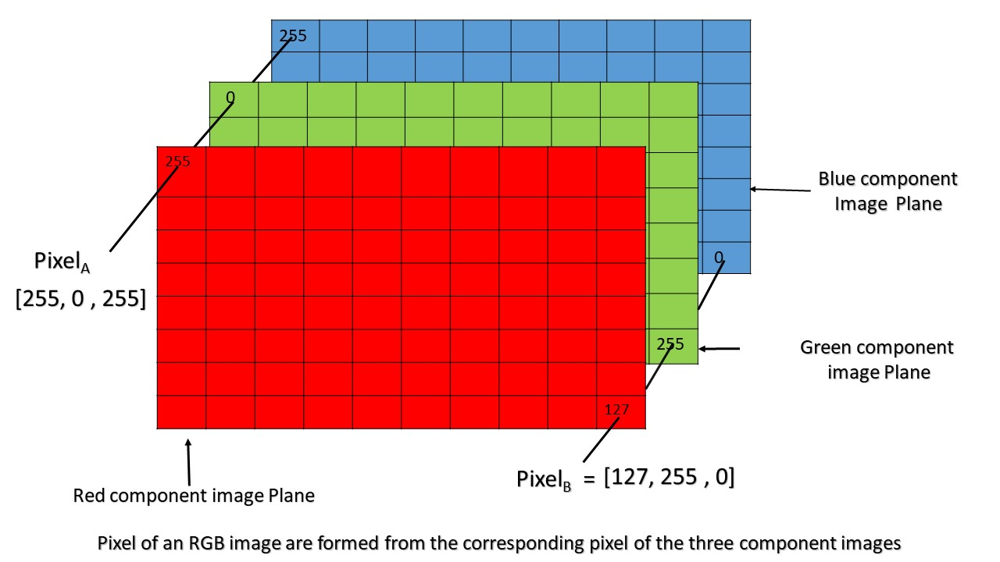

# R 객체(R object) {#data-type}


\footnotesize

\BeginKnitrBlock{rmdnote}<div class="rmdnote">**학습목표(2 주차)**: R에서 사용 가능한 데이터 타입에 대해 알아보고, 고유 데이터 타입으로 구성한 객체(스칼라, 백터, 리스트)와 이와 연관된 함수들을 익힌다.</div>\EndKnitrBlock{rmdnote}

 \normalsize


#### 학습 필요성 {#ch2-abstract .unnumbered}

- R언어는 타 프로그래밍 언어와 유사한 데이터 타입(정수형, 실수형, 문자형 등)을 제공
- R 언어가 다른 언어와 차이점 $\rightarrow$ **데이터 분석**에 특화된 벡터(vector), 행렬(matrix), 
데이터프레임(data frame), 리스트(list)와 같은 객체 [^1] 제공
- R 패키지에서 제공되는 함수 사용 방법은 R의 객체에 따라 달라질 수 있음  
- R 언어를 원활히 다룰 수 있으려면 R에서 데이터 객체의 형태, 자료 할당 및 그 연산 방법에 대한 이해가 필수적으로 선행되어야 함

[^1]: R에서 사용자가 데이터 입력을 위해 생성 또는 읽어온 객체(object)는 종종 변수(variable)라는 말과 혼용. 
본 문서에서는 최상위 데이터 저장장소를 객체라고 명명하며 데이터프레임과 같이 여러 종류의 데이터타입으로 이루어진 객체의 1차원 속성을 변수라고 칭함

#### R의 데이터 타입 {#object-value .unnumbered}

- **수치형(numeric)**: 숫자(정수, 소수)

- **문자열(string)**: `"충남대학교"`, `"R강의"`

- **논리형(logical)**: `TRUE`/`FALSE`

- **결측값(`NA`)**: 자료에서 발생한 결측 표현

- **공백(`NULL`)**: 지정하지 않은 값

- **요인(factor)**: 범주형 자료 표현(수치 + 문자 결합 형태로 이해하면 편함)

- **기타**: 숫자아님(`NaN`), 무한대(`Inf`) 등


#### R 객체의 종류 {#ch2-object-type .unnumbered}

- 스칼라(상수형, scalar 또는 atomic)
- 벡터(vector): **R의 기본연산 단위**
- 리스트(list)
- 행렬(matrix)
- 배열(array)
- 데이터프레임(data frame)
<!-- - 함수(function) -->
<!-- - 연산자(operator) -->
<!-- - 표현식(expression) -->

<!-- R 객체 중 scalar, vector, matrix, data.frame $\rightarrow$ 데이터 객체(object) -->

<!-- **아래 그림은 2~4 주차에 배울 R 주요 객체에 대한 개요도임** -->

\footnotesize

<div class="figure" style="text-align: center">

<p class="caption">(\#fig:rmarkdown-part)R 데이터 타입 구조 다이어그램: [R, Python 분석과 프로그래밍 (by R Friend)]( http://rfriend.tistory.com/)에서 발췌 후 수정</p>
</div>

 \normalsize


## 프로그래밍

### Prerequisites

- 예약어(researved words): R에서 의미(sementic)를 미리 정해 놓은 단어


\footnotesize

<table class="table table-condensed table-striped" style="font-size: 12px; margin-left: auto; margin-right: auto;">
<caption style="font-size: initial !important;">(\#tab:unnamed-chunk-2)R 예약어 종류 및 설명</caption>
 <thead>
  <tr>
   <th style="text-align:left;"> R 예약어 </th>
   <th style="text-align:left;"> 설명 </th>
  </tr>
 </thead>
<tbody>
  <tr>
   <td style="text-align:left;width: 7cm; font-family: monospace;"> if, else, while, function, in, next, break </td>
   <td style="text-align:left;width: 7cm; font-family: monospace;"> 조건, 함수, 반복문에 사용 </td>
  </tr>
  <tr>
   <td style="text-align:left;width: 7cm; font-family: monospace;"> TRUE/FALSE </td>
   <td style="text-align:left;width: 7cm; font-family: monospace;"> 논리 상수(logical constants) </td>
  </tr>
  <tr>
   <td style="text-align:left;width: 7cm; font-family: monospace;"> NULL </td>
   <td style="text-align:left;width: 7cm; font-family: monospace;"> 정의되지 않은 값 혹은 값이 없음 표현 </td>
  </tr>
  <tr>
   <td style="text-align:left;width: 7cm; font-family: monospace;"> Inf </td>
   <td style="text-align:left;width: 7cm; font-family: monospace;"> 무한(infinity) </td>
  </tr>
  <tr>
   <td style="text-align:left;width: 7cm; font-family: monospace;"> NaN </td>
   <td style="text-align:left;width: 7cm; font-family: monospace;"> 숫자가 아님(not a number) </td>
  </tr>
  <tr>
   <td style="text-align:left;width: 7cm; font-family: monospace;"> NA </td>
   <td style="text-align:left;width: 7cm; font-family: monospace;"> 결측값(not available) </td>
  </tr>
  <tr>
   <td style="text-align:left;width: 7cm; font-family: monospace;"> NA_integer_, NA_real_, NA_complex_, NA_character_ </td>
   <td style="text-align:left;width: 7cm; font-family: monospace;"> 결측값을 처리하는 상수 </td>
  </tr>
  <tr>
   <td style="text-align:left;width: 7cm; font-family: monospace;"> ... </td>
   <td style="text-align:left;width: 7cm; font-family: monospace;"> 함수가 다른 함수에 인자를 전달하도록 지원 </td>
  </tr>
</tbody>
</table>

 \normalsize


- **변수(variable)**: 사용자가 프로그램 처리를 위해 지정한 단어
   - 적당한 값을 저장하고 나중에 필요시 해당 값을 호출해 사용하기 위한 목적으로 사용되는 표식(label)
   - 예약어를 변수명으로 사용할 수 없음
   - [통계프로그래밍언어 강의노트: R 기초문법](https://zorba78.github.io/cnu-r-programming-lecture-note/r-basic.html) 참고
   
- **고수준 언어(high-level language)**: 사람이 읽고 쓰기 쉬운 형태의 명령어를 컴퓨터가 읽고 처리할 수 있도록 고안된 프로그래밍 언어
   - 컴퓨터가 이해할 수 있는 언어 $\rightarrow$ 중앙처리장치(central processing unit, CPU)가 이해하는 언어 $\rightarrow$ 기계어(machine language)
   - 기계어는 0과 1로 구성된 이진수(binary number)임(예: `0100101001001001001110110101101010110`)
   - 고수준 언어의 종류: C, C++, JAVA, 베이직, Perl, Python, R, ...
   
- **번역기(translator)**: 사람이 이해할 수 있는 표현(언어)를 기계(컴퓨터)가 이해할 수 있는 언어(기계어)로 변환
   - 인터프리터(interpreter)
   - 컴파일러(compiler)

- **인터프리터*: 코드(스크립트) 한 줄을 즉석에서 읽고, 파싱(프로그램을 검사하고 구문론적 구조를 분석)하고, 해석
   - R, Python, MATLAB 등은 인터프리터를 번역기로 사용
   - 인터엑티브 모드 $\rightarrow$ R 프롬프트(`>`) 뒤에 한 줄의 명령어를 작성하면 측석해서 처리 후 다음 입력에 대해 준비(prompt)함. 

\footnotesize


```r
안녕하세요!!
통계패키지활용 수업에서 R을 배우고 있습니다. 
처음이라 실수가 많습니다.
앞으로 잘 부탁해요!!
```

```
Error: <text>:1:6: 예기치 않은 '!'입니다
1: 안녕하세요!
         ^
```

 \normalsize

\footnotesize


```r
print("안녕하세요!!")
print("통계패키지활용 수업을 위해 R을 배우고 있습니다.")
print("처음이라 실수가 많습니다.")
print("앞으로 잘 부탁해요!!")
```

```
[1] "안녕하세요!!"
[1] "통계패키지활용 수업을 위해 R을 배우고 있습니다."
[1] "처음이라 실수가 많습니다."
[1] "앞으로 잘 부탁해요!!"
```

 \normalsize


- **컴파일러**: 완전한 프로그램을 하나의 파일에 담고 파일 안에 저장되어 있는 소스코드를 기계어로 번역 후 다음 실행할 수 있도록 변환한 기계어를 파일에 담음. 
   - 보통은 `.exe`, `.dll` 파일 형태로 저장됨 
      


### 프로그램 {#control-program}

- **프로그램(program)**: 특정 작업(목적)을 수행할 수 있도록 작성한 일련의 R 문장(명령어)의 집합
   - 일련의 문장(명령어)들은 텍스트 편집기를 통해 작성하며, **스크립트(script)**로 명칭되는 파일로 저장 $\rightarrow$ R 스크립트 `.R` 확장자를 가짐

\footnotesize


```r
# Hello.R 
print("안녕 R!!") #한국어
print("Hi R!!") # 영어
print("こんにちはR!!") # 일본어
print("Γεια R!!") #그리스어
```

 \normalsize

\footnotesize


```r
source("examples/hello.R", encoding = "UTF-8")
```

```
[1] "안녕 R!!"
[1] "Hi R!!"
[1] "こんにちはR!!"
[1] "Γεια R!!"
```

 \normalsize


- 예시: 텍스트 파일에서 가장 자주 나오는 단어 찾기 프로그램
   - https://statkclee.github.io/r4inf/r-intro.html#r-intro-what-is-a-program 참고

\footnotesize


```r
require(tidyverse)
require(stringr)
require(ggpubr)
require(ggthemes)

text_dat <- readLines("data/text-example-01.txt")
# 공백 또는 구둣점 문자를 기준으로 텍스트 나누기

# 공백 또는 구둣점 문자 기준으로 텍스트 토큰화
split_wd <- str_split(text_dat, pattern = "\\b|[[:punct:]]") 
split_wd <- do.call(c, split_wd)
id <- grepl("[a-zA-Z]+", split_wd) #알파벳을 포함한 단어 인덱스
split_wd <- split_wd[id]
unique_wd <- unique(split_wd) # 중복을 제외한 총 사용 단어
res_v <- vector("integer", length(unique_wd)) # 저장 벡터 생성

for (i in seq_along(unique_wd)) {
  for (j in seq_along(split_wd)) {
    if (unique_wd[i] == split_wd[j]) {
      res_v[i] <- res_v[i] + 1 
    }
  }
}

bind_cols("word" = unique_wd, "freq" = res_v) %>% 
  arrange(desc(freq)) 
```

<div data-pagedtable="false">
  <script data-pagedtable-source type="application/json">
{"columns":[{"label":["word"],"name":[1],"type":["chr"],"align":["left"]},{"label":["freq"],"name":[2],"type":["dbl"],"align":["right"]}],"data":[{"1":"the","2":"57"},{"1":"in","2":"24"},{"1":"of","2":"23"},{"1":"to","2":"20"},{"1":"South","2":"17"},{"1":"a","2":"15"},{"1":"and","2":"14"},{"1":"Korea","2":"13"},{"1":"was","2":"9"},{"1":"which","2":"9"},{"1":"on","2":"8"},{"1":"for","2":"8"},{"1":"that","2":"8"},{"1":"United","2":"7"},{"1":"States","2":"7"},{"1":"economic","2":"7"},{"1":"year","2":"7"},{"1":"is","2":"7"},{"1":"consumption","2":"7"},{"1":"at","2":"6"},{"1":"The","2":"6"},{"1":"s","2":"6"},{"1":"as","2":"6"},{"1":"fiscal","2":"6"},{"1":"stimulus","2":"6"},{"1":"with","2":"5"},{"1":"pandemic","2":"5"},{"1":"it","2":"5"},{"1":"OECD","2":"5"},{"1":"percent","2":"5"},{"1":"said","2":"5"},{"1":"That","2":"5"},{"1":"has","2":"5"},{"1":"more","2":"5"},{"1":"be","2":"5"},{"1":"cases","2":"4"},{"1":"In","2":"4"},{"1":"by","2":"4"},{"1":"GDP","2":"4"},{"1":"could","2":"4"},{"1":"success","2":"4"},{"1":"hand","2":"4"},{"1":"first","2":"4"},{"1":"Korean","2":"4"},{"1":"cash","2":"4"},{"1":"new","2":"3"},{"1":"contrast","2":"3"},{"1":"around","2":"3"},{"1":"most","2":"3"},{"1":"since","2":"3"},{"1":"down","2":"3"},{"1":"its","2":"3"},{"1":"their","2":"3"},{"1":"than","2":"3"},{"1":"André","2":"3"},{"1":"quickly","2":"3"},{"1":"countries","2":"3"},{"1":"response","2":"3"},{"1":"billion","2":"3"},{"1":"about","2":"3"},{"1":"but","2":"3"},{"1":"support","2":"3"},{"1":"also","2":"3"},{"1":"spent","2":"3"},{"1":"stubbornly","2":"2"},{"1":"have","2":"2"},{"1":"both","2":"2"},{"1":"can","2":"2"},{"1":"late","2":"2"},{"1":"coronavirus","2":"2"},{"1":"contraction","2":"2"},{"1":"economies","2":"2"},{"1":"only","2":"2"},{"1":"Second","2":"2"},{"1":"economist","2":"2"},{"1":"went","2":"2"},{"1":"tamping","2":"2"},{"1":"reason","2":"2"},{"1":"relatively","2":"2"},{"1":"recorded","2":"2"},{"1":"day","2":"2"},{"1":"single","2":"2"},{"1":"deaths","2":"2"},{"1":"per","2":"2"},{"1":"million","2":"2"},{"1":"seen","2":"2"},{"1":"U","2":"2"},{"1":"S","2":"2"},{"1":"outbreak","2":"2"},{"1":"end","2":"2"},{"1":"less","2":"2"},{"1":"like","2":"2"},{"1":"been","2":"2"},{"1":"much","2":"2"},{"1":"changed","2":"2"},{"1":"after","2":"2"},{"1":"were","2":"2"},{"1":"hard","2":"2"},{"1":"hit","2":"2"},{"1":"wasn","2":"2"},{"1":"t","2":"2"},{"1":"other","2":"2"},{"1":"country","2":"2"},{"1":"into","2":"2"},{"1":"businesses","2":"2"},{"1":"big","2":"2"},{"1":"package","2":"2"},{"1":"helped","2":"2"},{"1":"up","2":"2"},{"1":"form","2":"2"},{"1":"open","2":"2"},{"1":"bang","2":"2"},{"1":"this","2":"2"},{"1":"month","2":"2"},{"1":"sought","2":"2"},{"1":"domestic","2":"2"},{"1":"So","2":"2"},{"1":"there","2":"2"},{"1":"payouts","2":"2"},{"1":"consumers","2":"2"},{"1":"three","2":"2"},{"1":"region","2":"2"},{"1":"As","2":"1"},{"1":"struggles","2":"1"},{"1":"persistent","2":"1"},{"1":"slow","2":"1"},{"1":"return","2":"1"},{"1":"growth","2":"1"},{"1":"seems","2":"1"},{"1":"found","2":"1"},{"1":"recipe","2":"1"},{"1":"succeed","2":"1"},{"1":"fronts","2":"1"},{"1":"if","2":"1"},{"1":"survive","2":"1"},{"1":"uptick","2":"1"},{"1":"latest","2":"1"},{"1":"projections","2":"1"},{"1":"looking","2":"1"},{"1":"mere","2":"1"},{"1":"second","2":"1"},{"1":"best","2":"1"},{"1":"performer","2":"1"},{"1":"among","2":"1"},{"1":"major","2":"1"},{"1":"behind","2":"1"},{"1":"China","2":"1"},{"1":"euro","2":"1"},{"1":"area","2":"1"},{"1":"expected","2":"1"},{"1":"shrink","2":"1"},{"1":"see","2":"1"},{"1":"full","2":"1"},{"1":"order","2":"1"},{"1":"almost","2":"1"},{"1":"world","2":"1"},{"1":"facing","2":"1"},{"1":"dramatic","2":"1"},{"1":"slowdown","2":"1"},{"1":"World","2":"1"},{"1":"War","2":"1"},{"1":"Laurence","2":"1"},{"1":"Boone","2":"1"},{"1":"chief","2":"1"},{"1":"introducing","2":"1"},{"1":"newest","2":"1"},{"1":"outlook","2":"1"},{"1":"presentation","2":"1"},{"1":"underscored","2":"1"},{"1":"part","2":"1"},{"1":"escaping","2":"1"},{"1":"unscathed","2":"1"},{"1":"economically","2":"1"},{"1":"starting","2":"1"},{"1":"highly","2":"1"},{"1":"effective","2":"1"},{"1":"management","2":"1"},{"1":"place","2":"1"},{"1":"case","2":"1"},{"1":"same","2":"1"},{"1":"then","2":"1"},{"1":"peaked","2":"1"},{"1":"daily","2":"1"},{"1":"March","2":"1"},{"1":"before","2":"1"},{"1":"flattening","2":"1"},{"1":"digits","2":"1"},{"1":"never","2":"1"},{"1":"really","2":"1"},{"1":"plateaued","2":"1"},{"1":"until","2":"1"},{"1":"mid","2":"1"},{"1":"July","2":"1"},{"1":"where","2":"1"},{"1":"peak","2":"1"},{"1":"confirmed","2":"1"},{"1":"infections","2":"1"},{"1":"seven","2":"1"},{"1":"people","2":"1"},{"1":"nearly","2":"1"},{"1":"according","2":"1"},{"1":"Centers","2":"1"},{"1":"Disease","2":"1"},{"1":"Control","2":"1"},{"1":"Prevention","2":"1"},{"1":"Johns","2":"1"},{"1":"Hopkins","2":"1"},{"1":"University","2":"1"},{"1":"Economic","2":"1"},{"1":"efficacious","2":"1"},{"1":"handling","2":"1"},{"1":"made","2":"1"},{"1":"strict","2":"1"},{"1":"national","2":"1"},{"1":"lockdown","2":"1"},{"1":"sort","2":"1"},{"1":"paralyzed","2":"1"},{"1":"entire","2":"1"},{"1":"European","2":"1"},{"1":"months","2":"1"},{"1":"largely","2":"1"},{"1":"unnecessary","2":"1"},{"1":"turn","2":"1"},{"1":"meant","2":"1"},{"1":"dislocation","2":"1"},{"1":"from","2":"1"},{"1":"shuttered","2":"1"},{"1":"factories","2":"1"},{"1":"closed","2":"1"},{"1":"restaurants","2":"1"},{"1":"main","2":"1"},{"1":"they","2":"1"},{"1":"ve","2":"1"},{"1":"able","2":"1"},{"1":"contain","2":"1"},{"1":"epidemic","2":"1"},{"1":"better","2":"1"},{"1":"others","2":"1"},{"1":"so","2":"1"},{"1":"disruptions","2":"1"},{"1":"activity","2":"1"},{"1":"limited","2":"1"},{"1":"Christophe","2":"1"},{"1":"senior","2":"1"},{"1":"Google","2":"1"},{"1":"mobility","2":"1"},{"1":"data","2":"1"},{"1":"shows","2":"1"},{"1":"barely","2":"1"},{"1":"normal","2":"1"},{"1":"routines","2":"1"},{"1":"February","2":"1"},{"1":"what","2":"1"},{"1":"little","2":"1"},{"1":"recovered","2":"1"},{"1":"April","2":"1"},{"1":"biggest","2":"1"},{"1":"factors","2":"1"},{"1":"change","2":"1"},{"1":"weather","2":"1"},{"1":"public","2":"1"},{"1":"holidays","2":"1"},{"1":"not","2":"1"},{"1":"virus","2":"1"},{"1":"Italy","2":"1"},{"1":"saw","2":"1"},{"1":"shop","2":"1"},{"1":"visits","2":"1"},{"1":"plummet","2":"1"},{"1":"Further","2":"1"},{"1":"even","2":"1"},{"1":"though","2":"1"},{"1":"launched","2":"1"},{"1":"fairly","2":"1"},{"1":"aggressive","2":"1"},{"1":"pouring","2":"1"},{"1":"or","2":"1"},{"1":"pockets","2":"1"},{"1":"citizens","2":"1"},{"1":"early","2":"1"},{"1":"spring","2":"1"},{"1":"such","2":"1"},{"1":"Germany","2":"1"},{"1":"launching","2":"1"},{"1":"worth","2":"1"},{"1":"because","2":"1"},{"1":"Seoul","2":"1"},{"1":"provided","2":"1"},{"1":"keep","2":"1"},{"1":"continuing","2":"1"},{"1":"provide","2":"1"},{"1":"loans","2":"1"},{"1":"guarantees","2":"1"},{"1":"totaling","2":"1"},{"1":"More","2":"1"},{"1":"point","2":"1"},{"1":"kept","2":"1"},{"1":"taps","2":"1"},{"1":"Last","2":"1"},{"1":"week","2":"1"},{"1":"announced","2":"1"},{"1":"fourth","2":"1"},{"1":"round","2":"1"},{"1":"adding","2":"1"},{"1":"an","2":"1"},{"1":"additional","2":"1"},{"1":"policymakers","2":"1"},{"1":"say","2":"1"},{"1":"expansionary","2":"1"},{"1":"approach","2":"1"},{"1":"will","2":"1"},{"1":"likely","2":"1"},{"1":"continue","2":"1"},{"1":"through","2":"1"},{"1":"next","2":"1"},{"1":"combat","2":"1"},{"1":"lingering","2":"1"},{"1":"impacts","2":"1"},{"1":"too","2":"1"},{"1":"stands","2":"1"},{"1":"started","2":"1"},{"1":"monetary","2":"1"},{"1":"slowed","2":"1"},{"1":"efforts","2":"1"},{"1":"throw","2":"1"},{"1":"continued","2":"1"},{"1":"weakness","2":"1"},{"1":"Earlier","2":"1"},{"1":"Congress","2":"1"},{"1":"failed","2":"1"},{"1":"agree","2":"1"},{"1":"fresh","2":"1"},{"1":"Republican","2":"1"},{"1":"lawmakers","2":"1"},{"1":"trim","2":"1"},{"1":"already","2":"1"},{"1":"paltry","2":"1"},{"1":"benefits","2":"1"},{"1":"while","2":"1"},{"1":"Democrats","2":"1"},{"1":"aid","2":"1"},{"1":"huge","2":"1"},{"1":"numbers","2":"1"},{"1":"unemployed","2":"1"},{"1":"Americans","2":"1"},{"1":"one","2":"1"},{"1":"key","2":"1"},{"1":"getting","2":"1"},{"1":"back","2":"1"},{"1":"track","2":"1"},{"1":"demand","2":"1"},{"1":"remained","2":"1"},{"1":"solid","2":"1"},{"1":"fall","2":"1"},{"1":"half","2":"1"},{"1":"rebound","2":"1"},{"1":"he","2":"1"},{"1":"And","2":"1"},{"1":"carried","2":"1"},{"1":"buck","2":"1"},{"1":"places","2":"1"},{"1":"First","2":"1"},{"1":"spend","2":"1"},{"1":"those","2":"1"},{"1":"translated","2":"1"},{"1":"spending","2":"1"},{"1":"saving","2":"1"},{"1":"bailout","2":"1"},{"1":"checks","2":"1"},{"1":"A","2":"1"},{"1":"significant","2":"1"},{"1":"portion","2":"1"},{"1":"money","2":"1"},{"1":"distributed","2":"1"},{"1":"tranches","2":"1"},{"1":"many","2":"1"},{"1":"households","2":"1"},{"1":"simply","2":"1"},{"1":"banked","2":"1"},{"1":"famous","2":"1"},{"1":"check","2":"1"},{"1":"There","2":"1"},{"1":"impact","2":"1"},{"1":"rebounded","2":"1"},{"1":"actually","2":"1"},{"1":"June","2":"1"},{"1":"quite","2":"1"},{"1":"spectacular","2":"1"},{"1":"very","2":"1"},{"1":"important","2":"1"},{"1":"some","2":"1"},{"1":"provinces","2":"1"},{"1":"used","2":"1"},{"1":"creative","2":"1"},{"1":"solutions","2":"1"},{"1":"ensure","2":"1"},{"1":"government","2":"1"},{"1":"would","2":"1"},{"1":"recycled","2":"1"},{"1":"economy","2":"1"},{"1":"help","2":"1"},{"1":"boost","2":"1"},{"1":"Lee","2":"1"},{"1":"Jae","2":"1"},{"1":"myung","2":"1"},{"1":"governor","2":"1"},{"1":"Gyeonggi","2":"1"},{"1":"province","2":"1"},{"1":"populous","2":"1"},{"1":"decided","2":"1"},{"1":"test","2":"1"},{"1":"out","2":"1"},{"1":"non","2":"1"},{"1":"payments","2":"1"},{"1":"Each","2":"1"},{"1":"resident","2":"1"},{"1":"received","2":"1"},{"1":"won","2":"1"},{"1":"over","2":"1"},{"1":"period","2":"1"},{"1":"But","2":"1"},{"1":"came","2":"1"},{"1":"local","2":"1"},{"1":"currency","2":"1"},{"1":"shops","2":"1"},{"1":"inside","2":"1"},{"1":"rather","2":"1"},{"1":"hoarded","2":"1"}],"options":{"columns":{"min":{},"max":[10]},"rows":{"min":[10],"max":[10]},"pages":{}}}
  </script>
</div>

 \normalsize

- 프로그램 작성을 위한 개념적 요소
   - **입력(input)**: 외부로부터 가져온 데이터, 값 등 
   - **출력(output)**: 입력에 대한 반응(결과 출력, 파일 저장, 음악 재생, ...)
   - **순차실행(sequential execution)**: 스크립트 또는 코드 작성 순서에 따라 한줄씩 실행
   - **조건실행(conditional execution)**: 특정 조건에 따라 문장(명령)을 실행하거나 건너뜀
   - **번복실행(iterative execution)**: 특정 명령을 반복적으로 실행 
   - **재사용(resuse)**: 스크립트의 집합(다수 줄로 구성된 코드 또는 스크립트)에 이름을 부여하고 저장 $\rightarrow$ 사용자 지정 함수(function)
   
- 프로그램 오류의 종류
   - **구문오류(syntax error)**: R 언어가 이해할 수 없는 문장 또는 문법으로 실행했을 때 나타나는 오류 $\rightarrow$ 가장 고치기 쉽고 즉각적으로 알려줌
   - **논리 또는 run-time 오류(logic or run-time error)**: 구문은 완벽하지만 실행 순서 또는 논리적으로 연관방식에 문제가 있어서 명령어를 수행할 수 없는 경우
   - **의미론적 오류(sementic error)**: 프로그램은 구문적으로 오류가 없고 실행되지만 올바른 결과를 출력하지 않는 경우 $\rightarrow$ **제일 고치기 어려움**


- 가장 간단한 프로그래밍은 순차적으로 명령을 실행하되 입력 시 흐름을 잠시 중단하고 대기하는 방법 $\rightarrow$ 프롬프트 상 명령어 한 줄씩 입력

\footnotesize


```r
# 아주 간단한 프로그래밍 예제
# readline() 함수 이용해 R한테 인사 받기
name <- readline("What's your name?: ")
cat("Hello, ", name, "!\n", sep = "")
```

 \normalsize


\footnotesize


```r
# readline() 함수를 이용해 알바비 계산

x <- as.numeric(readline(prompt = "하루 아르바이트 시간을 입력하시오: "))
y <- as.numeric(readline(prompt = "시급을 입력하시오 (단위=원): "))
z <- as.numeric(readline(prompt = "한달 동안 총 몇 일 동안 일을 하셨나요? "))
cat("월 급여는 ", x * y * z, " 원 입니다.\n", sep = "")
```

 \normalsize


## 스칼라(scalar) {#scalar}

- 단일 차원의 값(하나의 값): $1 \times 1$ 백터로 표현 $\rightarrow$ R 데이터 객체의 기본은 벡터!!
- 데이터 객체의 유형은 크게 숫자형, 문자열, 논리형이 있음

\footnotesize

\BeginKnitrBlock{rmdtip}<div class="rmdtip">스칼라를 입력시 R의 벡터 지정 함수인 `c()`(벡터 부분에서 상세 내용 학습)를 꼭 사용해서 입력할 필요가 없다. 단, 연속되지 않은 두 개 이상 스칼라면 벡터이므로 꼭 c()를 써야 한다.</div>\EndKnitrBlock{rmdtip}

 \normalsize

### 선언 {#definition}

- 일반적으로 컴파일이 필요한 언어(예: `C` 언어)의 경우 변수 또는 객체를 사용 전에 선언이 필요

\footnotesize


```c
int x; 
x = 1;
```

 \normalsize

- 위 코드에서 `int x;` 없이 `x = 1`을 입력 후 컴파일 하면 에러가 나타나지만 `R` 언어에서는 **변수를 선언할 필요가 전혀 없음** 

- `z` 가 어떤 데이터 타입인지 언급할 필요가 전혀 없음 $\rightarrow$ `Python`, `Perl`, `Matlab` 등과 같은 스크립트 언어의 특징. 아래 코드 참조

\footnotesize


```r
z <- 3
z
```

```
[1] 3
```

 \normalsize


### 숫자형 {#numeric}

- 정수형(integer)과 실수형(double)로 구분됨
- 정수형 구분시 숫자 뒤 `L`을 표시

\footnotesize


```r
# 정수형 구분자 사용 예시
# typeof(): R 객체의 데이터 타입 반환하는 함수
typeof(10L)
```

```
[1] "integer"
```

```r
typeof(10)
```

```
[1] "double"
```

 \normalsize

- 수치연산(`+, -, *, ^, **, /, %%, %/%`) 가능: R은 함수형 언어이기 때문에 앞에 기술한 연산자도 하나의 함수로 인식함. 
- 수치 연산자(operator) 및 기본 수학 함수

\footnotesize

<table class="table table-condensed table-striped" style="font-size: 10px; margin-left: auto; margin-right: auto;">
<caption style="font-size: initial !important;">(\#tab:operation)R언어의 기본 수치 연산자</caption>
 <thead>
  <tr>
   <th style="text-align:left;"> 수치형 연산자 </th>
   <th style="text-align:left;"> 설명 </th>
  </tr>
 </thead>
<tbody>
  <tr>
   <td style="text-align:left;width: 4cm; font-family: monospace;"> +, -, *, / </td>
   <td style="text-align:left;width: 6cm; font-family: monospace;"> 사칙연산 </td>
  </tr>
  <tr>
   <td style="text-align:left;width: 4cm; font-family: monospace;"> n %% m </td>
   <td style="text-align:left;width: 6cm; font-family: monospace;"> n을 m 으로 나눈 나머지 </td>
  </tr>
  <tr>
   <td style="text-align:left;width: 4cm; font-family: monospace;"> n %/% m </td>
   <td style="text-align:left;width: 6cm; font-family: monospace;"> n을 m 으로 나눈 몫 </td>
  </tr>
  <tr>
   <td style="text-align:left;width: 4cm; font-family: monospace;"> n ^ m 또는 n ** m </td>
   <td style="text-align:left;width: 6cm; font-family: monospace;"> n 의 m 승 </td>
  </tr>
</tbody>
</table>

 \normalsize

**숫자형 스칼라 연산 적용 예시**

\footnotesize


```r
# 숫자형 스칼라
a <- 3
b <- 10
a; b
```

```
[1] 3
```

```
[1] 10
```

```r
# 덧셈
c <- a + b
c
```

```
[1] 13
```

```r
# 덧셈을 함수로 입력
# "+"(a, b)로 입력한 결과
c <- "+"(a, b)

# 뺄셈
d <- b - a
d
```

```
[1] 7
```

```r
# 곱셈
m <- a * b
m
```

```
[1] 30
```

```r
# 나누기
dd <- b/a
dd
```

```
[1] 3.333333
```

```r
# 멱승
b^a
```

```
[1] 1000
```

```r
# 나누기의 나머지(remainder) 반환
r <- b %% a
r
```

```
[1] 1
```

```r
# 나누기의 몫(quotient) 반환
q <- b %/% a
q
```

```
[1] 3
```

```r
# 연산 우선 순위
nn <- (3 + 5)*3 - 4**2/4
nn
```

```
[1] 20
```

 \normalsize

### 문자형 {#character}

- 수치형이 아닌 문자 형식의 단일 원소
- C와 같은 언어에서 볼수 있는 한개 문자에 대한 데이터 타입 존재하지 않음
- 수치연산 불가능
- 따옴표(`"` 또는 `'`)로 문자를 묶어서 문자열 표시
- 문자열을 다루는 자세한 설명은 5주차에서 자세히 설명할 예정임

\footnotesize


```r
h1 <- c("Hello CNU!!")
h2 <- c("R is not too difficult.")
typeof(h1); typeof(h2)
```

```
[1] "character"
```

```
[1] "character"
```

```r
h1
```

```
[1] "Hello CNU!!"
```

```r
h2
```

```
[1] "R is not too difficult."
```

```r
# 문자열의 문자 수 반환
nchar(h1); nchar(h2)
```

```
[1] 11
```

```
[1] 23
```

```r
# 문자열 연산 error 예시
h1 - h2
```

```
Error in h1 - h2: 이항연산자에 수치가 아닌 인수입니다
```

 \normalsize

### 논리형 스칼라 {#logical}

- 참(`TRUE`, `T`) 또는 거짓(`FALSE`, `F`)를 나타내는 값
- `TRUE`/`FALSE`: 예약어(reserved word)
- `T`/`F`: `TRUE`와 `FALSE`로 초기화된 전역 변수 
   - `T`에 `FALSE` 또는 어떤 값도 할당 가능 $\rightarrow$ 가급적 `TRUE/FALSE`를 명시하는 것이 편함
- 논리형 연산자(logical operator)

\footnotesize

<table class="table table-condensed table-striped" style="font-size: 10px; margin-left: auto; margin-right: auto;">
<caption style="font-size: initial !important;">(\#tab:logic-op-tab)R언어의 논리형 연산자</caption>
 <thead>
  <tr>
   <th style="text-align:left;"> 논리형 연산자 </th>
   <th style="text-align:left;"> 설명 </th>
  </tr>
 </thead>
<tbody>
  <tr>
   <td style="text-align:left;width: 3cm; font-family: monospace;"> &amp; </td>
   <td style="text-align:left;width: 7cm; font-family: monospace;"> AND (vectorized) </td>
  </tr>
  <tr>
   <td style="text-align:left;width: 3cm; font-family: monospace;"> &amp;&amp; </td>
   <td style="text-align:left;width: 7cm; font-family: monospace;"> AND (atomic) </td>
  </tr>
  <tr>
   <td style="text-align:left;width: 3cm; font-family: monospace;"> | </td>
   <td style="text-align:left;width: 7cm; font-family: monospace;"> OR (vectorized) </td>
  </tr>
  <tr>
   <td style="text-align:left;width: 3cm; font-family: monospace;"> || </td>
   <td style="text-align:left;width: 7cm; font-family: monospace;"> OR (atomic) </td>
  </tr>
  <tr>
   <td style="text-align:left;width: 3cm; font-family: monospace;"> ! </td>
   <td style="text-align:left;width: 7cm; font-family: monospace;"> NOT </td>
  </tr>
</tbody>
</table>

 \normalsize


- 비교 연산자를 적용할 경우 논리값을 반환

\footnotesize

<table class="table table-condensed table-striped" style="font-size: 10px; margin-left: auto; margin-right: auto;border-bottom: 0;">
<caption style="font-size: initial !important;">(\#tab:comp-op-tab)R언어의 비교 연산자</caption>
 <thead>
  <tr>
   <th style="text-align:left;"> 비교 연산자 </th>
   <th style="text-align:left;"> 설명 </th>
  </tr>
 </thead>
<tbody>
  <tr>
   <td style="text-align:left;width: 3cm; font-family: monospace;"> &gt; </td>
   <td style="text-align:left;width: 7cm; font-family: monospace;"> 크다(greater-than) </td>
  </tr>
  <tr>
   <td style="text-align:left;width: 3cm; font-family: monospace;"> &lt; </td>
   <td style="text-align:left;width: 7cm; font-family: monospace;"> 작다(less-than) </td>
  </tr>
  <tr>
   <td style="text-align:left;width: 3cm; font-family: monospace;"> == </td>
   <td style="text-align:left;width: 7cm; font-family: monospace;"> 같다(equal) </td>
  </tr>
  <tr>
   <td style="text-align:left;width: 3cm; font-family: monospace;"> &gt;= </td>
   <td style="text-align:left;width: 7cm; font-family: monospace;"> 크거나 같다(greater than equal) </td>
  </tr>
  <tr>
   <td style="text-align:left;width: 3cm; font-family: monospace;"> &lt;= </td>
   <td style="text-align:left;width: 7cm; font-family: monospace;"> 작거나 같다(less than equal) </td>
  </tr>
  <tr>
   <td style="text-align:left;width: 3cm; font-family: monospace;"> != </td>
   <td style="text-align:left;width: 7cm; font-family: monospace;"> 같지 않다(not equal) </td>
  </tr>
</tbody>
<tfoot>
<tr><td style="padding: 0; " colspan="100%"><span style="font-style: italic;">Note: </span></td></tr>
<tr><td style="padding: 0; " colspan="100%">
<sup></sup> 기술한 비교 연산자는 수치형 및 논리형 데이터 타입 모두에 적용 가능 하지만, 문자형은 비교 연산은 ==, != 만 가능함</td></tr>
</tfoot>
</table>

 \normalsize


\footnotesize

\BeginKnitrBlock{rmdnote}<div class="rmdnote">**참고**

- 논리형 스칼라도 숫자형 연산 가능 $\rightarrow$ 컴퓨터는 `TRUE`/`FALSE`를 1과 0 숫자로 인식
- 수치 연산자는 스칼라 뿐 아니라 아래에서 다룰 벡터, 행렬, 리스트, 데이터프레임 객체의 연산에 사용 가능
- `&`/`|`와 `&&`/`||`는 동일하게 AND/OR를 의미하지만 연산 결과가 다름.
- `&`의 연산 대상이 벡터인 경우 백터 구성 값 각각에 대해 `&` 연산을 실행 하지만 `&&`는 하나의 값(스칼라)에만  논리 연산이 적용(아래 예시 참고)
</div>\EndKnitrBlock{rmdnote}

 \normalsize


- 논리형 스칼라의 논리 및 비교 연산 예시

\footnotesize


```r
typeof(TRUE)  # TRUE의 데이터 타입
```

```
[1] "logical"
```

```r
TRUE & TRUE  # TRUE 반환
```

```
[1] TRUE
```

```r
TRUE & FALSE  # FALSE 반환
```

```
[1] FALSE
```

```r
# 아래 연산은 모두 TRUE 반환
TRUE | TRUE
```

```
[1] TRUE
```

```r
TRUE | FALSE
```

```
[1] TRUE
```

```r
# TRUE와 FALSE의 반대
!TRUE
```

```
[1] FALSE
```

```r
!FALSE
```

```
[1] TRUE
```

```r
# 전역변수 T에 FALSE 값 할당
T <- FALSE
T
```

```
[1] FALSE
```

```r
T <- TRUE  # 원상복귀
# TRUE/FALSE에 값을 할당할 수 없음
TRUE <- 1
```

```
Error in TRUE <- 1: 대입에 유효하지 않은 (do_set) 좌변입니다
```

```r
TRUE <- FALSE
```

```
Error in TRUE <- FALSE: 대입에 유효하지 않은 (do_set) 좌변입니다
```

```r
# &(|)와 &&(||)의 차이
l.01 <- c(TRUE, TRUE, FALSE, TRUE)  # 논리형 값으로 구성된 벡터
l.02 <- c(FALSE, TRUE, TRUE, TRUE)
l.01 & l.02  # l.01과 l.02 각 원소 별 & 연산
```

```
[1] FALSE  TRUE FALSE  TRUE
```

```r
l.01 && l.02  # l.01과 l.02의 첫 번째 원소에 대해 & 연산
```

```
[1] FALSE
```

```r
# 비교 연산자
x <- 9
y <- 4
# x > y 의 반환값 데이터 타입
typeof(x > y)
```

```
[1] "logical"
```

```r
# 논리형 값 반환
x > y
```

```
[1] TRUE
```

```r
x < y
```

```
[1] FALSE
```

```r
x == y
```

```
[1] FALSE
```

```r
x != y
```

```
[1] TRUE
```

 \normalsize

### 결측값(missing value) {#missing-value}

- 결측치 지정 **상수**: `NA` $\rightarrow$ R과 다른 언어의 가장 큰 차이점 중 하나
- 예를 들어 4명의 통계학과 학생 중 3명의 통계학 개론 중간고사 점수가 각각 80, 90, 75점이고 4번 째 학생의 점수가 없는 경우 `NA`로 결측값 표현
- `is.na()` 함수를 이용해 해당 값이 결측을 포함하고 있는지 확인

\footnotesize


```r
one <- 80; two <- 90; three <- 75; four <- NA
four
```

```
[1] NA
```

```r
# 'is.na()' 결측 NA가 포함되어 있으면 TRUE 
is.na(four)
```

```
[1] TRUE
```

 \normalsize

\footnotesize

\BeginKnitrBlock{rmdtip}<div class="rmdtip">`is.na(object_name)`: 객체를 구성하고 있는 원소 중 `NA`를 포함하고 있는지 확인 $\rightarrow$ `NA`를 포함하면 `TRUE`, 아니면 `FALSE` 반환

**참고**: 자료에 `NA`가 포함된 경우 연산 결과는 모두 `NA`가 반환
</div>\EndKnitrBlock{rmdtip}

 \normalsize

\footnotesize


```r
NA + 1
```

```
[1] NA
```

```r
NA & TRUE
```

```
[1] NA
```

```r
NA <= 3
```

```
[1] NA
```

 \normalsize

### NULL 값 {#null}

- `NULL`: 초기화 되지 않은 변수 또는 **객체**를 지칭함
- `is.null()` 함수를 통해 객체가 `NULL`인지 판단

\footnotesize


```r
x <- NULL # NULL 지정
is.null(x) # NULL 객체인지 판단
```

```
[1] TRUE
```

```r
x <- 1
is.null(x) 
```

```
[1] FALSE
```

 \normalsize

\footnotesize

\BeginKnitrBlock{rmdnote}<div class="rmdnote">**`NA`와 `NULL`의 차이점**: 자료의 공백을 의미한다는 점에서 유사한 측면이 있으나 아래 내용처럼 큰 차이가 있음

- `NULL`: 값을 지정하지 않은 객체를 표현하는데 사용. 즉 아직 변수 또는 객체의 상태가 아직 미정인 상태를 나타냄
- `NA`: 데이터 값이 결측임을 지정해주는 논리형 상수
</div>\EndKnitrBlock{rmdnote}

 \normalsize


\footnotesize


```r
# NA와 NULL은 다름
x <- NA
is.null(NA)
```

```
[1] FALSE
```

```r
is.na(NULL)
```

```
logical(0)
```

 \normalsize

<!-- # 데이터에서 NA와 NULL의 차이점 -->
<!-- x <- c(80, 90, 75, NA) -->
<!-- x -->

<!-- x <- c(80, 90, 75, NULL) -->
<!-- x -->

### 무한대/무한소/숫자아님 {#finite}

- `Inf`: 무한대($+\infty$, $1/0$)
- `-Inf`: 무한소($-\infty$, $-1/0$)
- `NaN`: 숫자아님(Not a Number, $0/0$)
- `is.finite()`, `is.infinite()`, `is.nan()` 함수를 통해 객체가 `Inf` 또는 `NaN`을 포함하는지 확인

\footnotesize


```r
x <- Inf
is.finite(x)
```

```
[1] FALSE
```

```r
is.infinite(x)
```

```
[1] TRUE
```

```r
x <- 0/0
is.nan(x)
```

```
[1] TRUE
```

```r
is.infinite(x)
```

```
[1] FALSE
```

 \normalsize

\footnotesize

\BeginKnitrBlock{rmdnote}<div class="rmdnote">지금까지 요인형(factor)을 제외하고 R 언어에서 객체가 가질 수 있는 데이터 유형에 대해 알아봄. 요인형은 4주 차에 예정된 "R 자료형: 팩터, 테이블, 데이터 프레임"에서 상세하게 배울 예정임. 
</div>\EndKnitrBlock{rmdnote}

 \normalsize


## 벡터(vector) {#vector}

### 벡터의 특징 {#vector-prop}

- 타 프로그래밍 언어의 배열(array)의 개념으로 **동일한 유형**의 데이터 원소가 하나 이상($n \times 1$, $n \geq 1$) 으로 구성된 자료 형태
- R 언어의 가장 기본적인 데이터 형태로 R에서 행해지는 모든 연산의 기본(vectorization) $\rightarrow$ 벡터 연산 시 반복구문(예: `for loop`)이 필요 없음. 
- \@ref(scalar) 절에서 기술한 [스칼라(scalar)]는 사실 $1 \times 1$ 벡터임
- 수학적으로 벡터는 아래와 같이 나타낼 수 있음

$$\mathrm{\mathbf x} = [x_1, x_2, x_3, \ldots, x_n]^T
$$


- 벡터는 앞의 예시에서 본 바와 같이 `c()` 함수를 사용해 생성

\footnotesize


```r
# 숫자형 벡터 
x <- c(2, 0, 2, 0, 0, 3, 2, 4)
x
```

```
[1] 2 0 2 0 0 3 2 4
```

```r
# 문자형 벡터
y <- c("Boncho Ku", "R programming", "Male", "sophomore", "2020-03-24")
y
```

```
[1] "Boncho Ku"     "R programming" "Male"          "sophomore"    
[5] "2020-03-24"   
```

 \normalsize

- 두 개 이상의 벡터는 `c()` 함수를 통해 결합 가능
   - 함수 내 `,` 구분자를 통해 결합

\footnotesize


```r
# 두 벡터의 결합 (1)
x <- 1:5
y <- 10:6
z <- c(x, y)
x
```

```
[1] 1 2 3 4 5
```

```r
y
```

```
[1] 10  9  8  7  6
```

```r
z
```

```
 [1]  1  2  3  4  5 10  9  8  7  6
```

```r
x <- 5:10
x1 <- x[1:3] # x 벡터에서 1에서 4번째 원소 추출
x2 <- c(x1, 15, x[4])
x2
```

```
[1]  5  6  7 15  8
```

 \normalsize


- 서로 다른 자료형으로 벡터를 구성한 경우 표현력이 높은 자료형으로 변환한 값 반환
    - 예: 문자열 + 숫자로 구성된 벡터 $\rightarrow$ 문자형 벡터
    - 변환규칙: `NULL < raw < logical < integer < double < complex < character < list < expression`


\footnotesize


```r
# 숫자형 벡터와 문자열 벡터 혼용
k <- c(1, 2, "3", "4")
k
```

```
[1] "1" "2" "3" "4"
```

```r
is.numeric(k) # 벡터가 숫자형인지 판단하는 함수
```

```
[1] FALSE
```

```r
is.character(k) # 벡터가 문자열인지 판단하는 함수
```

```
[1] TRUE
```

```r
# 숫자형 벡터와 문자열 벡터 결합
x <- 1:3
y <- c("a", "b", "c")
z <- c(x, y)
z
```

```
[1] "1" "2" "3" "a" "b" "c"
```

```r
is.numeric(z)
```

```
[1] FALSE
```

```r
is.character(z)
```

```
[1] TRUE
```

```r
# 숫자형 벡터와 논리형 벡터 결합
x <- 9:4
y <- c(TRUE, TRUE, FALSE)
z <- c(x, y)

z # TRUE/FALSE 가 1과 0으로 변환
```

```
[1] 9 8 7 6 5 4 1 1 0
```

```r
is.numeric(z)
```

```
[1] TRUE
```

```r
is.logical(z)
```

```
[1] FALSE
```

 \normalsize

- 두 벡터는 중첩이 불가능 $\rightarrow$ 동일한 벡터 2개를 결합 시 단일 차원 벡터 생성

\footnotesize


```r
x <- y <- 1:3 # x와 y 동시에 [1, 2, 3] 할당
x 
```

```
[1] 1 2 3
```

```r
y
```

```
[1] 1 2 3
```

```r
z <- c(x, y)
z
```

```
[1] 1 2 3 1 2 3
```

 \normalsize
    

- 벡터 각 원소에 이름 부여 가능
    - `names()` 함수를 이용해 원소 이름 지정
    - 사용 프로토타입: `names(x) <- 문자열 벡터`, 단 `x`와 이름에 입력할 문자열 벡터의 길이는 같아야 함. 
    - `c()` 함수에서 직접 이름 지정 $\rightarrow$ `c(atom_name1 = value, atom_name2 = value, ...)`

\footnotesize


```r
x <- c("Boncho Ku", "R programming", "Male", "sophomore", "2020-03-24")

# 벡터 원소 이름 지정
names(x) <- c("name", "course", "gender", "grade", "date") 
x
```

```
           name          course          gender           grade            date 
    "Boncho Ku" "R programming"          "Male"     "sophomore"    "2020-03-24" 
```

```r
y <- c(a = 10, b = 6, c = 9)
names(y)
```

```
[1] "a" "b" "c"
```

 \normalsize
    
- 벡터의 길이(차원) 확인
   - `length()` 또는 `NROW()` 사용

\footnotesize


```r
x <- 1:50
# 객체의 길이 반환
# length(): 벡터, 행렬인 경우 원소의 개수, 데이터프레임인 경우 열의 개수 반환
length(x) 
```

```
[1] 50
```

```r
# NROW(): 벡터인 경우 원소의 개수, 행렬, 데이터 프레임인 경우 행의 개수 반환
NROW(x)
```

```
[1] 50
```

 \normalsize

### 벡터의 연산 {#vector-operation}

- 원소 단위 사칙연산 및 비교연산 수행 $\rightarrow$ 벡터화 연산(vectorized operation)
   - 예를 들어 $\mathrm{\mathbf x} = [1, 2, 3]^T$ 이고, $\mathrm{\mathbf y} = [2, 3, 4]^T$ 라고 할 때 $\mathrm{\mathbf x} + \mathrm{\mathbf y}$의 연산은 아래와 같음

$$\begin{bmatrix}
1 \\ 2\\ 3
\end{bmatrix} + 
\begin{bmatrix}
2 \\ 3\\ 4
\end{bmatrix} = 
\begin{bmatrix}
3 \\ 5 \\ 7
\end{bmatrix}
$$


- `*` 연산 시 행렬 대수학에서 벡터의 곱(product)과 다름을 주의

$$\begin{bmatrix}
1 \\ 2\\ 3
\end{bmatrix} * 
\begin{bmatrix}
2 \\ 3\\ 4
\end{bmatrix} = 
\begin{bmatrix}
2 \\ 6 \\ 12
\end{bmatrix}
$$

\footnotesize


```r
x <- 1:3; y <- 2:4
length(x); length(y)
```

```
[1] 3
```

```
[1] 3
```

```r
x; y
```

```
[1] 1 2 3
```

```
[1] 2 3 4
```

```r
# 사칙연산(+, -, *, /)
# 백터 vs. 백터
x + y
```

```
[1] 3 5 7
```

```r
x - y
```

```
[1] -1 -1 -1
```

```r
x * y
```

```
[1]  2  6 12
```

```r
x / y
```

```
[1] 0.5000000 0.6666667 0.7500000
```

```r
# 그외 연산
# 나머지(remainder)
y %% x
```

```
[1] 0 1 1
```

```r
# 몫(quotient)
y %/% x
```

```
[1] 2 1 1
```

```r
# 멱승(exponent)
y ^ x
```

```
[1]  2  9 64
```

 \normalsize


- 차원이 서로 맞지 않는 경우 작은 차원(짧은 쪽)의 백터를 재사용함

$$\begin{bmatrix}
1 \\ 2\\ 3
\end{bmatrix} + [5] = 
\begin{bmatrix}
1 \\ 2\\ 3
\end{bmatrix} + 
\begin{bmatrix}
5 \\ 5\\ 5
\end{bmatrix} = 
\begin{bmatrix}
6 \\ 7 \\ 8
\end{bmatrix}
$$


\footnotesize


```r
# 벡터(n by 1) vs. 스칼라(1 by 1)
x * 5 # 5을 x의 길이 만큼 재사용(반복) 후 곱 연산 수행
```

```
[1]  5 10 15
```

```r
x <- c(2, 1, 3, 5, 4); y <- c(2, 3, 4)
x
```

```
[1] 2 1 3 5 4
```

```r
y
```

```
[1] 2 3 4
```

```r
length(x); length(y)
```

```
[1] 5
```

```
[1] 3
```

```r
# x의 길이가 5이고 y의 길이가 3이기 때문에 5를 맞추기 위헤
# y의 원소 중 1-2 번째 원소를 재사용
x + y
```

```
Warning in x + y: 두 객체의 길이가 서로 배수관계에 있지 않습니다
```

```
[1] 4 4 7 7 7
```

```r
x / y
```

```
Warning in x/y: 두 객체의 길이가 서로 배수관계에 있지 않습니다
```

```
[1] 1.0000000 0.3333333 0.7500000 2.5000000 1.3333333
```

 \normalsize


- 연산 순서는 일반적인 사칙연산의 순서를 준용
   - 단 1단위 수열을 생성하는 `:` 연산자가 사칙연산을 우선함

\footnotesize


```r
# 연산 우선 순위
1:5 * 3
```

```
[1]  3  6  9 12 15
```

```r
1:(5 * 3)
```

```
 [1]  1  2  3  4  5  6  7  8  9 10 11 12 13 14 15
```

 \normalsize


- 논리형 값으로 구성된 벡터의 기본 연산 시 수치형으로 변환된 연산 결과를 반환


\footnotesize


```r
# 논리형 벡터
b1 <- c(TRUE, TRUE, FALSE, TRUE, TRUE, TRUE, FALSE, FALSE)
b2 <- c(FALSE, TRUE, TRUE, TRUE, TRUE, TRUE, FALSE, TRUE)

is.numeric(b1); is.numeric(b2)
```

```
[1] FALSE
```

```
[1] FALSE
```

```r
is.logical(b1); is.logical(b2)
```

```
[1] TRUE
```

```
[1] TRUE
```

```r
# 논리형 벡터 연산
b3 <- b1 + b2
is.numeric(b3)
```

```
[1] TRUE
```

```r
b3
```

```
[1] 1 2 1 2 2 2 0 1
```

```r
b1 - b2
```

```
[1]  1  0 -1  0  0  0  0 -1
```

```r
b1 * b2
```

```
[1] 0 1 0 1 1 1 0 0
```

```r
b1/b2
```

```
[1] Inf   1   0   1   1   1 NaN   0
```

 \normalsize


- 두 벡터 간 비교 연산은 사칙연산과 마찬가지로 각 원소단위 연산을 수행하고 논리형 벡터 반환
  - 재사용 규칙은 그대로 적용됨


\footnotesize


```r
# 두 벡터의 비교 연산
x <- c(2, 4, 3, 10, 5, 9)
y <- c(3, 4, 6, 2, 10, 7)

x == y
```

```
[1] FALSE  TRUE FALSE FALSE FALSE FALSE
```

```r
x != y
```

```
[1]  TRUE FALSE  TRUE  TRUE  TRUE  TRUE
```

```r
x > y
```

```
[1] FALSE FALSE FALSE  TRUE FALSE  TRUE
```

```r
x < y
```

```
[1]  TRUE FALSE  TRUE FALSE  TRUE FALSE
```

```r
x >= y
```

```
[1] FALSE  TRUE FALSE  TRUE FALSE  TRUE
```

```r
x <= y
```

```
[1]  TRUE  TRUE  TRUE FALSE  TRUE FALSE
```

```r
# 비교 연산 시 두 벡터의 길이가 다른 경우
x <- 1:5; y <- 2:4

x == y
```

```
Warning in x == y: 두 객체의 길이가 서로 배수관계에 있지 않습니다
```

```
[1] FALSE FALSE FALSE FALSE FALSE
```

```r
x != y
```

```
Warning in x != y: 두 객체의 길이가 서로 배수관계에 있지 않습니다
```

```
[1] TRUE TRUE TRUE TRUE TRUE
```

```r
x > y
```

```
Warning in x > y: 두 객체의 길이가 서로 배수관계에 있지 않습니다
```

```
[1] FALSE FALSE FALSE  TRUE  TRUE
```

```r
x < y
```

```
Warning in x < y: 두 객체의 길이가 서로 배수관계에 있지 않습니다
```

```
[1]  TRUE  TRUE  TRUE FALSE FALSE
```

```r
x >= y
```

```
Warning in x >= y: 두 객체의 길이가 서로 배수관계에 있지 않습니다
```

```
[1] FALSE FALSE FALSE  TRUE  TRUE
```

```r
x <= y
```

```
Warning in x <= y: 두 객체의 길이가 서로 배수관계에 있지 않습니다
```

```
[1]  TRUE  TRUE  TRUE FALSE FALSE
```

 \normalsize


- 문자열 벡터의 연산은 `==` 또는 `!=` 만 가능(사칙연산 불가능)


\footnotesize


```r
# 문자열 벡터 연산 (==, !=)
c1 <- letters[1:5]
# a-z로 구성된 벡터에서 1-2, 6-8 번째 원소 추출
c2 <- letters[c(1:2, 6:8)] 
c1
```

```
[1] "a" "b" "c" "d" "e"
```

```r
c2
```

```
[1] "a" "b" "f" "g" "h"
```

```r
c1 == c2
```

```
[1]  TRUE  TRUE FALSE FALSE FALSE
```

```r
c1 != c2
```

```
[1] FALSE FALSE  TRUE  TRUE  TRUE
```

 \normalsize


- `NA`를 포함한 두 벡터 연산 시 동일 위치에 `NA`가 존재하면 어떤 연산이든 `NA` 값을 반환


\footnotesize


```r
# 결측을 포함한 벡터
x <- c(1:10, c(NA, NA))
y <- c(NA, NA, 1:10)
x
```

```
 [1]  1  2  3  4  5  6  7  8  9 10 NA NA
```

```r
y
```

```
 [1] NA NA  1  2  3  4  5  6  7  8  9 10
```

```r
is.na(x); is.na(y)
```

```
 [1] FALSE FALSE FALSE FALSE FALSE FALSE FALSE FALSE FALSE FALSE  TRUE  TRUE
```

```
 [1]  TRUE  TRUE FALSE FALSE FALSE FALSE FALSE FALSE FALSE FALSE FALSE FALSE
```

```r
# 결측을 포함한 벡터의 연산 
x + y
```

```
 [1] NA NA  4  6  8 10 12 14 16 18 NA NA
```

```r
x / y
```

```
 [1]       NA       NA 3.000000 2.000000 1.666667 1.500000 1.400000 1.333333
 [9] 1.285714 1.250000       NA       NA
```

```r
x < y
```

```
 [1]    NA    NA FALSE FALSE FALSE FALSE FALSE FALSE FALSE FALSE    NA    NA
```

```r
x > y
```

```
 [1]   NA   NA TRUE TRUE TRUE TRUE TRUE TRUE TRUE TRUE   NA   NA
```

 \normalsize

- `NULL`이 벡터에 포함되더라도 벡터의 길이에는 변동이 없음


\footnotesize


```r
# NULL을 포함한 벡터 
x <- c(1, 2, 3, NULL, NULL, NULL) # 길이가 6?
length(x)
```

```
[1] 3
```

```r
x
```

```
[1] 1 2 3
```

 \normalsize


### 벡터의 색인(indexing) {#vector-index}

- 벡터의 특정 위치에 있는 원소를 추출   
- 색인(indexing)을 통해 벡터의 원소에 접근 가능
- 타 언어는 대체로 첫 번째 색인이 0에서 시작하지만, R은 1부터 시작
- `x[i]`: 벡터 `x`의 `i`번 째 요소
- `x[start:end]`: `x`의 `start`부터 `end`까지 값 반환


\footnotesize


```r
x <- c(1.2, 3.1, 4.2, 2.8, 3.3)
x[3] # x 원소 중 3 번째 원소 추출
```

```
[1] 4.2
```

```r
# x 원소 중 2-3번째 원소 추출
x[2:3]
```

```
[1] 3.1 4.2
```

 \normalsize

- `x[-i]`: 벡터 `x`에서 `i`번 째 요소를 제외한 나머지 값 반환


\footnotesize


```r
# x의 3 번째 원소 제거
x[-3]
```

```
[1] 1.2 3.1 2.8 3.3
```

```r
# 맨 마지막 원소(5 번째) 제거
# 아래 script는 동일한 결과 출력
x[1:(length(x) - 1)]
```

```
[1] 1.2 3.1 4.2 2.8
```

```r
x[-length(x)]
```

```
[1] 1.2 3.1 4.2 2.8
```

 \normalsize

- `x[idx_vec]`: `idx_vec`가 인덱싱 벡터라고 할 때 `idx_vec`에 지정된 요소를 얻어옴. 일반적으로 `idx_vec`는 백터의 행 순서 번호 또는 각 벡터 원소의 이름에 대응하는 문자열 벡터를 인덱싱 벡터로 사용할 수 있음. 

\footnotesize


```r
# 벡터를 이용한 인덱싱
# x 원소 중 1, 5번째 원소 추출
x[c(1, 5)] # c(1,5)는 벡터
```

```
[1] 1.2 3.3
```

```r
v <- c(1, 4)
x[v]
```

```
[1] 1.2 2.8
```

```r
# 인덱스 번호 중복 가능
x[c(1, 2, 2, 4)]
```

```
[1] 1.2 3.1 3.1 2.8
```

```r
# 원소 이름으로 인덱싱
# 원소 이름 지정
names(x) <- paste0("x", 1:length(x)) # 문자열 "x"와 숫자 1:5(벡터 길이)를 결합한 문자열 반환
x["x3"]
```

```
 x3 
4.2 
```

```r
x[c("x2", "x4")]
```

```
 x2  x4 
3.1 2.8 
```

 \normalsize

- 필터링(filtering): 특정한 조건을 만족하는 원소 추출
   - 비교 연산자를 이용한 조건 생성 $\rightarrow$ 논리값을 이용한 원소 추출

\footnotesize


```r
z <- c(5, 2, -3, 8)
# z의 원소 중 z의 제곱이 8보다 큰 원소 추출
w <- z[z^2 > 8]
w
```

```
[1]  5 -3  8
```

 \normalsize

- 작동 원리 
   - `z^2 > 8`은 벡터 `z`의 모든 원소 제곱값이 8 보다 큰 케이스를 논리형 값으로 반환
   
\footnotesize


```r
z^2
```

```
[1] 25  4  9 64
```

```r
idx <- z^2 > 8
idx
```

```
[1]  TRUE FALSE  TRUE  TRUE
```

```r
z[idx]
```

```
[1]  5 -3  8
```

 \normalsize

- 특정 조건을 만족하는 벡터의 위치에 임의의 값을 치환할 수 있음

\footnotesize


```r
# 위 벡터 z 의 원소 중 z^2 > 8 인 원소의 값을 0으로 치환
z[idx] <- 0
```

 \normalsize


### 벡터 관련 함수 {#vector-function}

- `c()` 함수 외에 R은 벡터 생성을 위해 몇 가지 유용한 함수를 제공함


#### **`seq`** 계열 함수 {#fun-seq .unnumbered}

> 보다 자세한 사용 설명은 `help(seq)` 참고

**`seq()`**: 등차 수열 생성하는 함수로 `from`에서 `end` 까지 숫자 내에서 공차(간격)가 `by` 인 수열 생성 

\footnotesize


```r
# seq(): 수열 생성 함수
seq(
  from, # 시작값
  to,   # 끝값
  by    # 공차(증가치)
)

# 기타 인수
# length.out = n
#   - 생성하고자 하는 벡터의 길이가 n인 수열 생성
# along.with = 1:n 
#   - index가 1에서 n 까지 길이를 갖는 수열 생성
```

 \normalsize

- **사용 예시**


\footnotesize


```r
x <- seq(from = 2, to = 30, by = 2)
x 
```

```
 [1]  2  4  6  8 10 12 14 16 18 20 22 24 26 28 30
```

```r
# 간격이 꼭 정수가 아니어도 사용 가능
x <- seq(from = 0, to = 3, by = 0.2)

# by 대신 length.out 으로 생성된 수열의 길이 조정
x <- seq(from = -3, to = 3, length.out = 10)
x
```

```
 [1] -3.0000000 -2.3333333 -1.6666667 -1.0000000 -0.3333333  0.3333333
 [7]  1.0000000  1.6666667  2.3333333  3.0000000
```

```r
# from, to 인수 없이 length.out=10 인 경우
seq(length.out = 10)
```

```
 [1]  1  2  3  4  5  6  7  8  9 10
```

```r
# by 대신 along.width 
seq(along.with=1:10)
```

```
 [1]  1  2  3  4  5  6  7  8  9 10
```

```r
seq(1, 5, along.with=1:10)
```

```
 [1] 1.000000 1.444444 1.888889 2.333333 2.777778 3.222222 3.666667 4.111111
 [9] 4.555556 5.000000
```

```r
# 벡터 x에 seq() 함수 적용 시 1:length(x) 값 반환
seq(x)
```

```
 [1]  1  2  3  4  5  6  7  8  9 10
```

 \normalsize


**`seq_along()`**: 주어진 객체의 길이 만큼 1부터 1 간격의 수열 생성

- `seq()` 함수와 매우 유사하나, 무조건 1부터 시작해서 인수로 `seq()`의 `along.with` 값을 이용한 함수
- `seq()` 함수보다 조금 빠름
- **사용 예시**

\footnotesize


```r
# 1부터 x 벡터의 길이 까지 1 단위 수열 값 반환
seq_along(x)
```

```
 [1]  1  2  3  4  5  6  7  8  9 10
```

 \normalsize

**`seq_len()`**: 인수로 받은 값 만큼 1부터 해당 값 까지 1 간격의 수열 생성

- `seq()` 함수의 인수 중 `length.out` 값을 이용한 함수
- **사용 예시**

\footnotesize


```r
# 1부터 n 까지 1 단위 수열 값 반환
seq_len(10)
```

```
 [1]  1  2  3  4  5  6  7  8  9 10
```

 \normalsize


#### **`rep`** 계열 함수 {#fun-rep .unnumbered}

> `help(rep)`을 통해 상세 내용 참고

**`rep()`**: 주어진 벡터의 원소를 반복


\footnotesize


```r
# rep(): 벡터 또는 벡터의 개별 원소를 반복한 값 반환
rep(
  x, # 반복할 값이 저장된 벡터
  times, # 전체 벡터의 반복 횟수
  each # 개별 원소의 반복 횟수
)
```

 \normalsize


- **사용 예시**

\footnotesize


```r
x <- rep(4, 5) # 4를 5번 반복
x
```

```
[1] 4 4 4 4 4
```

```r
# x <- c(1:3) 전체를 3번 반복한 벡터 반환
x <- c(1:3)
xr1 <- rep(x, times = 3)
xr1
```

```
[1] 1 2 3 1 2 3 1 2 3
```

```r
# 벡터 x 의 각 원소를 4번씩 반복한 벡터 반환
xr2 <- rep(x, each = 4)
xr2
```

```
 [1] 1 1 1 1 2 2 2 2 3 3 3 3
```

```r
# 벡터 x 의 각 원소를 3번 반복하고 해당 벡터를 2회 반복
xr3 <- rep(x, each = 3, times = 2)
xr3
```

```
 [1] 1 1 1 2 2 2 3 3 3 1 1 1 2 2 2 3 3 3
```

```r
# 문자형 벡터의 반복
# 아래 sex 벡터의 각 원소를 2 번 반복하고 해당 벡터를 4회 반복
sex <- c("Male", "Female")
sexr <- rep(sex, each = 2, times = 4)
sexr
```

```
 [1] "Male"   "Male"   "Female" "Female" "Male"   "Male"   "Female" "Female"
 [9] "Male"   "Male"   "Female" "Female" "Male"   "Male"   "Female" "Female"
```

 \normalsize


**`rep.int()` & `rep_len()`**: `rep()` 함수의 simple 버전으로 속도(performance)가 요구되는 프로그래밍 시 사용

- **사용 예시**

\footnotesize


```r
# 1:5 벡터를 3 번 반복
rep.int(1:5, 3)
```

```
 [1] 1 2 3 4 5 1 2 3 4 5 1 2 3 4 5
```

```r
# 불완전한 사이클로 벡터 반복
rep_len(1:5, length.out = 7)
```

```
[1] 1 2 3 4 5 1 2
```

 \normalsize


#### **Filtering 관련 함수** {#fun-filtering .unnumbered}

> `help(subset)` 참고

**`subset()`**: 기존 필터링 방식과 비교할 때 `NA`를 처리하는 방식에서 차이를 보임

- 벡터 뿐 아니라 앞으로 배울 행렬 및 데이터프레임 객체에도 적용 가능


\footnotesize


```r
x <- c(6, 1:3, NA, NA, 12)
x
```

```
[1]  6  1  2  3 NA NA 12
```

```r
# 일반적 필터링 적용 
x[x > 5]
```

```
[1]  6 NA NA 12
```

```r
# subset() 함수 적용
subset(x, x > 5)
```

```
[1]  6 12
```

 \normalsize

**`which()`**: 한 벡터에서 특정 조건에 맞는 위치(인덱스)를 반환

\footnotesize


```r
# which(): 논리형 벡터를 인수로 받고 해당 논리형 벡터가 참인 index 반환
which(
  logical_vec # 논리형 벡터
)
```

 \normalsize


- **사용 예시**

\footnotesize


```r
x <- c(3, 8, 3, 1, 7)

# x의 원소값이 3인 index 반환
which(x == 3)
```

```
[1] 1 3
```

```r
# x의 원소가 4보다 큰 원소의 index 반환
which(x > 4)
```

```
[1] 2 5
```

```r
# 9월(Sep)과 12월(Dec)와 같은 원소 index
# month.abb: R 내장 벡터로 월 약어(Jan ~ Dec)를 저장한 문자열 벡터
which(month.abb == c("Sep", "Dec"))
```

```
[1]  9 12
```

```r
# 조건을 만족하는 원소가 존재하지 않는다면?
x <- which(x > 9)
x
```

```
integer(0)
```

```r
length(x) # 길이가 0인 벡터 반환 is.null(x) == TRUE ??
```

```
[1] 0
```

```r
is.null(x)
```

```
[1] FALSE
```

```r
# 특정 조건 만족 여부를 확인 
# any(condition) -> 하나라도 condition을 만족하는 원소가 존재하는지 판단
# TRUE 또는 FALSE 값 반환
any(x > 9)
```

```
[1] FALSE
```

 \normalsize

#### **집합 관련 함수** {#set-function .unnumbered}

- 벡터는 숫자, 문자열의 묶음, 즉 원소들의 집합(set)으로 볼 수 있기 때문에 집합 연산이 가능
- 두 집합을 $X$와 $Y$로 정의 했을 때 아래와 같은 집합 연산 가능
- **`setequal(X, Y)`**: `X`와 `Y`가 동일한지 판단 ($X = Y$) $\rightarrow$ 논리값 `TRUE` 또는 `FALSE` 반환
 
\footnotesize


```r
x <- y <- c(1, 9, 7, 3, 6)
setequal(x, y)
```

```
[1] TRUE
```

 \normalsize

- **`union(X, Y)`**: `X`와 `Y`의 합집합 ($X \cup Y$)

\footnotesize


```r
y <- c(1, 9, 8, 2, 0, 3)
union(x, y)
```

```
[1] 1 9 7 3 6 8 2 0
```

 \normalsize


- **`intersect(X, Y)`**: `X`와 `Y`의 교집합 ($X \cap Y$)

\footnotesize


```r
intersect(x, y)
```

```
[1] 1 9 3
```

 \normalsize

- **`setdiff(X, Y)`**: `X`와 `Y`의 차집합 ($X - Y$)

\footnotesize


```r
setdiff(x, y)
```

```
[1] 7 6
```

```r
setdiff(y, x)
```

```
[1] 8 2 0
```

 \normalsize

- **`X %in% Y`**: `X`(기준)가 집합 `Y`의 원소인지 논리값 반환

\footnotesize


```r
x <- c("apple", "banana", "strawberry", "mango", "peach", "orange")
y <- c("strawberry", "orange", "mango")

x %in% y
```

```
[1] FALSE FALSE  TRUE  TRUE FALSE  TRUE
```

```r
y %in% x
```

```
[1] TRUE TRUE TRUE
```

 \normalsize

#### **두 벡터의 동일성 테스트** {#vec-identical .unnumbered}

- 두 벡터가 동일한지 테스트 하기 위해 `x == y` 연산의 반환 값은 위의 예제에서 확인한 것 처럼 각 원소에 대한 논리값을 반환(아래 예제 확인)

\footnotesize


```r
x <- 1:3
y <- c(1, 3, 4)
x == y
```

```
[1]  TRUE FALSE FALSE
```

 \normalsize

- 단지 두 벡터가 동일한지 아닌지를 확인하기 위해서는 하나의 논리값만 필요한 경우 `all()` 사용

\footnotesize


```r
all(x == y)
```

```
[1] FALSE
```

 \normalsize

- 보다 나은 방법으로 `identical()` 함수 적용

\footnotesize


```r
# 두 객체의 동일성 여부 테스트
identical(x, y)
```

```
[1] FALSE
```

 \normalsize

- `identical()` 함수는 벡터가 갖는 데이터 타입의 동일성 까지 체크함

\footnotesize


```r
x <- 1:5; y <- c(1, 2, 3, 4, 5)
x
```

```
[1] 1 2 3 4 5
```

```r
y
```

```
[1] 1 2 3 4 5
```

```r
# all() 함수로 동일성 확인
all(x == y)
```

```
[1] TRUE
```

```r
# identical 함수로 동일성 확인
identical(x, y)
```

```
[1] FALSE
```

```r
# x, y 데이터 타입 확인
typeof(x)
```

```
[1] "integer"
```

```r
typeof(y)
```

```
[1] "double"
```

 \normalsize

## 리스트(list) {#list}

- **리스트(list)**: `(key, value)` 형태로 데이터를 저장한 배열(벡터)
- 서로 다른 데이터 타입을 가진 객체를 원소로 가질 수 있는 벡터
   - 예: 한 리스트 안에는 상이한 데이터 타입(숫자형, 문자형, 논리형 등)을 갖는 원소(객체)들을 포함할 수 있음

\footnotesize

\BeginKnitrBlock{rmdnote}<div class="rmdnote">**리스트 예시**: 통계프로그래밍언어 중간고사 성적 테이블

- 중간고사 성적 테이블은 이름, 학번, 출석률, 점수, 등급으로 이루어졌다고 가정하면 "김상자"의 성적 리스트는 다음과 같이 나타낼 수 있음
- `LIST(이름 = "김상자", 학번 = "202015115", 점수 = 95, 등급 = "A-")`
- 위 record에서 보듯이 문자형과 숫자형이 LIST 안에 같이 표현되고 있음
</div>\EndKnitrBlock{rmdnote}

 \normalsize

- 위 record를 벡터 생성함수 `c()`로 생성한 경우

\footnotesize


```r
# 벡터로 위 record를 입력한 경우
vec <- c(`이름` = "김상자", `학번` = "202015115", 
         `점수` = 95, `등급` = "A-")
vec
```

```
       이름        학번        점수        등급 
   "김상자" "202015115"        "95"        "A-" 
```

```r
typeof(vec)
```

```
[1] "character"
```

 \normalsize

\footnotesize

\BeginKnitrBlock{rmdtip}<div class="rmdtip">객체 명칭 규칙을 벗어나는 이름을 객제명으로 사용하고 싶다면 다음과 같이 홀따옴표 \``object_name`\` 표시를 통해 사용 가능함
</div>\EndKnitrBlock{rmdtip}

 \normalsize

\footnotesize


```r
> #공백이 있는 이름을 객체 명칭으로 사용
> `golf score` <- c(75, 82, 92)
> `golf score`
```

```
[1] 75 82 92
```

```r
> `3x` <- c(3, 6, 9, 12)
> `3x`
```

```
[1]  3  6  9 12
```

 \normalsize


### 리스트 생성 {#make-list}

- **`list()`** 함수를 사용해 list 객체 생성

\footnotesize


```r
# list 함수 사용 prototype
list(name_1 = object_1, ..., name_m = object_m)

# name_1, ..., name_m: 리스트 원소 이름
# object_1, ..., object_m: 리스트 원소에 대응한 객체
```

 \normalsize


- 중간고사 성적 테이블 예시


\footnotesize


```r
# lst 객체 생성
lst <- list(`이름` = "김상자", 
            `학번` = "202015115", 
            `점수` = 95, 
            `등급` = "A-")
lst
```

```
$이름
[1] "김상자"

$학번
[1] "202015115"

$점수
[1] 95

$등급
[1] "A-"
```

```r
# lst 내 객체의 데이터 타입 확인
# lapply(): lst 객체에 동일한 함수 적용 (추후 학습)
lapply(lst, typeof)
```

```
$이름
[1] "character"

$학번
[1] "character"

$점수
[1] "double"

$등급
[1] "character"
```

 \normalsize

- 리스트 원소에 이름이 부여된 경우 `names()`를 통해 확인 가능

\footnotesize


```r
names(lst)
```

```
[1] "이름" "학번" "점수" "등급"
```

 \normalsize


- 이름(`name_1, .., name_n`) 없이도 리스트 생성 가능하나, 가급적 이름을 부여 하는 것이 더 명확


\footnotesize


```r
list("김상자", "202015115", 95, "A-")
```

```
[[1]]
[1] "김상자"

[[2]]
[1] "202015115"

[[3]]
[1] 95

[[4]]
[1] "A-"
```

 \normalsize


- 리스트는 벡터이므로 `vector()` 함수를 통해 생성 가능


\footnotesize


```r
# 길이가 1이고 객체가 NULL인 리스트 생성
z <- vector(mode = "list", length=1)
z
```

```
[[1]]
NULL
```

 \normalsize

- 리스트의 값이 어떤 객체든 관계 없음

\footnotesize


```r
x <- list(name = c("A", "B", "C"), 
          salary = c(500, 450, 600), union = T)
x
```

```
$name
[1] "A" "B" "C"

$salary
[1] 500 450 600

$union
[1] TRUE
```

 \normalsize

### 리스트 색인 {#list-index}


- 리스트에 포함된 객체에 접근는 기본적으로 벡터의 색인 방법과 동일하게 색인 번호 또는 키(이름)을 통해 접근 가능
- 리스트에 포함된 모든 객체의 원소값을 쉽게 확인하는 함수는 `unlist()`임 

\footnotesize


```r
lval <- unlist(x)
typeof(lval)
```

```
[1] "character"
```

 \normalsize


\footnotesize

<table class="table table-condensed table-striped" style="font-size: 10px; margin-left: auto; margin-right: auto;">
<caption style="font-size: initial !important;">(\#tab:list-tab)리스트 데이터 접근 방법</caption>
 <thead>
  <tr>
   <th style="text-align:left;"> 색인방법 </th>
   <th style="text-align:left;"> 동작 </th>
  </tr>
 </thead>
<tbody>
  <tr>
   <td style="text-align:left;width: 3cm; font-family: monospace;"> x$name </td>
   <td style="text-align:left;width: 7cm; font-family: monospace;"> 리스트 x 에서 객체명(name)에 해당하는 객체에 접근 </td>
  </tr>
  <tr>
   <td style="text-align:left;width: 3cm; font-family: monospace;"> x[[i]] 또는 x[[name]] </td>
   <td style="text-align:left;width: 7cm; font-family: monospace;"> 리스트 x 에서 i 번째 또는 name에 해당하는 객체 반환 </td>
  </tr>
  <tr>
   <td style="text-align:left;width: 3cm; font-family: monospace;"> x[i] 또는 x[name] </td>
   <td style="text-align:left;width: 7cm; font-family: monospace;"> 리스트 x 에서 i 번째 또는 name에 해당하는 부분 리스트 반환 </td>
  </tr>
</tbody>
</table>

 \normalsize


- `x$name`을 통해 리스트 내 객체 접근

\footnotesize


```r
lst$`학번`
```

```
[1] "202015115"
```

 \normalsize

- `x[[i]]` 또는 `x[[name]]` 을 통해 리스트 내 객체 접근


\footnotesize


```r
lst[[2]]
```

```
[1] "202015115"
```

```r
z <- lst[["학번"]]
z
```

```
[1] "202015115"
```

```r
typeof(z)
```

```
[1] "character"
```

 \normalsize

- `x[i]` 또는 `x[name]` 을 통해 리스트 내 부분 리스트 추출

\footnotesize


```r
lst[2]
```

```
$학번
[1] "202015115"
```

```r
j <- lst["학번"]
j
```

```
$학번
[1] "202015115"
```

```r
typeof(j)
```

```
[1] "list"
```

 \normalsize


- 리스트 또한 벡터로 볼 수 있기 때문에 여러 개의 부분 리스트 추출 가능

\footnotesize


```r
# 리스트 lst 에서 1 ~ 3 번째 까지 부분 리스트 추출
lst[1:3]
```

```
$이름
[1] "김상자"

$학번
[1] "202015115"

$점수
[1] 95
```

 \normalsize

- 리스트를 구성하는 객체 내 색인 

\footnotesize


```r
x
```

```
$name
[1] "A" "B" "C"

$salary
[1] 500 450 600

$union
[1] TRUE
```

```r
# salary에서 2-3번째 원소 추출
x$salary[2:3]
```

```
[1] 450 600
```

```r
x[[2]][2:3]
```

```
[1] 450 600
```

```r
x[["salary"]][2:3]
```

```
[1] 450 600
```

```r
# 부분 리스트도 길이가 1인 리스트이므로, 
# 부분 리스트 내 객제 접근 시 리스트 접근이 선행
# x의 2번째 부분 리스트에서 첫 번째 객체의 2-3번째 원소 추출
x[2][[1]][2:3]
```

```
[1] 450 600
```

 \normalsize

- 리스트의 길이 반환: 벡터와 마찬가지로 `length()` 함수 적용 가능

\footnotesize


```r
length(lst); length(x)
```

```
[1] 4
```

```
[1] 3
```

 \normalsize


### 리스트에 원소 추가/제거 {#list-add-delete}

- 주어진 리스트 `x`에 새로운 원소를 `x$new_obj <- value` 명령어 형태로 추가
- 이미 존재하고 있는 리스트 원소 제거는 `x$exist_obj <- NULL` 형태로 제거

\footnotesize


```r
# 리스트 lst 에 5회 차 퀴즈 점수 추가
lst$quiz <- c(10, 8, 9, 9, 8)

# 리스트 lst이 원소 quiz 제거
lst$quiz <- NULL
lst
```

```
$이름
[1] "김상자"

$학번
[1] "202015115"

$점수
[1] 95

$등급
[1] "A-"
```

```r
# 벡터 색인을 이용해 원소 추가 가능
lst[[5]] <- c(10, 8, 9, 9, 8)
lst
```

```
$이름
[1] "김상자"

$학번
[1] "202015115"

$점수
[1] 95

$등급
[1] "A-"

[[5]]
[1] 10  8  9  9  8
```

```r
# 부분 리스트 괄호에서도 색인 통해 추가/삭제 가능
lst[5] <- NULL
lst
```

```
$이름
[1] "김상자"

$학번
[1] "202015115"

$점수
[1] 95

$등급
[1] "A-"
```

```r
# 여러 개의 리스트 동시 추가/삭제 가능
lst[5:9] <-  c(10, 8, 9, 9, 8)
lst
```

```
$이름
[1] "김상자"

$학번
[1] "202015115"

$점수
[1] 95

$등급
[1] "A-"

[[5]]
[1] 10

[[6]]
[1] 8

[[7]]
[1] 9

[[8]]
[1] 9

[[9]]
[1] 8
```

```r
lst[5:9] <-  NULL
lst
```

```
$이름
[1] "김상자"

$학번
[1] "202015115"

$점수
[1] 95

$등급
[1] "A-"
```

 \normalsize


### 리스트의 결합 {#list-combine}

- 두 개 이상의 리스트를 결합 시 `c()` 사용 

\footnotesize


```r
# 리스트 lst와 x 결합
c(lst, x)
```

```
$이름
[1] "김상자"

$학번
[1] "202015115"

$점수
[1] 95

$등급
[1] "A-"

$name
[1] "A" "B" "C"

$salary
[1] 500 450 600

$union
[1] TRUE
```

 \normalsize


\footnotesize

\BeginKnitrBlock{rmdnote}<div class="rmdnote">리스트 내에 리스트를 가질 수 있다. 이를 재귀 리스트(recursive list)라고 한다. 예를 들어 위 예제에서 각 학생의 성적 데이터가 리스트로 구성되어 있다면, 전체 성적 데이터베이스는 리스트로 구성된 리스트임. 아래 예제 처럼 간단한 재귀 리스트 구현이 가능</div>\EndKnitrBlock{rmdnote}

 \normalsize

\footnotesize


```r
kim <- list(id = "20153345", sex = "Male", score = 85, grade = "B+")
lee <- list(id = "20153348", sex = "Female", score = 75, grade = "B0")

gr <- list(kim=kim, lee=lee)
gr
```

```
$kim
$kim$id
[1] "20153345"

$kim$sex
[1] "Male"

$kim$score
[1] 85

$kim$grade
[1] "B+"


$lee
$lee$id
[1] "20153348"

$lee$sex
[1] "Female"

$lee$score
[1] 75

$lee$grade
[1] "B0"
```

 \normalsize


## 행렬(matrix) {#matrix}

\footnotesize

\BeginKnitrBlock{rmdnote}<div class="rmdnote">**학습목표(3 주차)**: 행렬, 배열, 요인형과 테이블에 대해 살펴보고, 이들 객체에 대한 연산과 연관된 함수에 대해 익힌다.</div>\EndKnitrBlock{rmdnote}

 \normalsize

#### **행렬의 정의** {#def-matrix .unnumbered}

- 동일한 데이터 타입의 원소로 구성된 2차원 데이터 구조
-  $n \times 1$ 차원 벡터 $p$개로 묶여진 데이터 덩어리 $\rightarrow$ $n \times p$ 행렬로 명칭함
- 행렬의 형태

$$\begin{bmatrix}
x_{11} & x_{12} & \cdots & x_{1p} \\
x_{21} & x_{22} & \cdots & x_{2p} \\
\vdots & \vdots & \cdots & \vdots \\
x_{n1} & x_{n2} & \cdots & x_{np}
\end{bmatrix}
$$

- R에서 행렬은 동일한 유형의 데이터 타입으로 구성 가능 $\rightarrow$ 첫 번째 행은 숫자형, 두 번째 행은 문자열로 입력해도 행렬을 만들 수 있지만, 표현력이 더 높은 문자형 행렬 반환
- 행렬의 내부 저장공간은 "열 우선 배열"
- 행렬 생성을 위한 R 함수는 `matrix()` 함수이고 사용 형태는 아래와 같음

\footnotesize


```r
# matrix(): 행렬 생성 함수
# 상세 내용은 help(matrix)를 통해 확인

matrix(data, # 행렬을 생성할 데이터 벡터 
       nrow, # 행의 개수 (정수)
       ncol, # 열의 개수 (정수)
       byrow, # TRUE: 행 우선, FALSE: 열 우선
              # default = FALSE
       dimnames # 행렬읠 각 차원에 부여할 이름 (리스트)
       )
```

 \normalsize

- 행렬 생성 예시 

\footnotesize


```r
# byrow = FALSE
x <- matrix(c(1, 2, 3, 4, 5, 6, 7, 8, 9), nrow = 3, ncol = 3)
x
```

```
     [,1] [,2] [,3]
[1,]    1    4    7
[2,]    2    5    8
[3,]    3    6    9
```

```r
# byrow = TRUE
x <- matrix(c(1, 2, 3, 4, 5, 6, 7, 8, 9), nrow = 3, ncol = 3, byrow = T)
x
```

```
     [,1] [,2] [,3]
[1,]    1    2    3
[2,]    4    5    6
[3,]    7    8    9
```

 \normalsize

- 행의 개수(`nrow`)나 열의 개수(`ncol`)로 나머지를 추정 가능하다면 둘 중 어떤 인수도 생략 가능

\footnotesize


```r
x <- matrix(c(1, 2, 3, 4, 5, 6, 7, 8, 9), ncol = 3)
x
```

```
     [,1] [,2] [,3]
[1,]    1    4    7
[2,]    2    5    8
[3,]    3    6    9
```

```r
x <- matrix(c(1, 2, 3, 4, 5, 6, 7, 8, 9), nrow = 3)
x
```

```
     [,1] [,2] [,3]
[1,]    1    4    7
[2,]    2    5    8
[3,]    3    6    9
```

 \normalsize

- `nrow` $\times$ `ncol` 이 입력한 데이터(벡터)의 길이보다 작거나 큰 경우

\footnotesize


```r
# length(x) < nrow * ncol 인 경우 
# nrow * ncol에 해당하는 길이 만큼
# x의 원소를 사용해 행렬 생성
x <- c(1, 2, 3, 4, 5, 6, 7, 8, 9)
y <- matrix(x, nrow = 3, ncol = 4)
```

```
Warning in matrix(x, nrow = 3, ncol = 4): 데이터의 길이[9]가 열의 개수[4]의 배수
가 되지 않습니다
```

```r
y
```

```
     [,1] [,2] [,3] [,4]
[1,]    1    4    7    1
[2,]    2    5    8    2
[3,]    3    6    9    3
```

```r
# length(x) > nrow * ncol 인 경우 
# x의 첫 번쨰 원소부터 초과하는 만큼 
# x 원소의 값을 재사용
z <- matrix(x, nrow = 2, ncol = 3)
```

```
Warning in matrix(x, nrow = 2, ncol = 3): 데이터의 길이[9]가 행의 개수[2]의 배수
가 되지 않습니다
```

```r
z
```

```
     [,1] [,2] [,3]
[1,]    1    3    5
[2,]    2    4    6
```

 \normalsize

- 행렬 구성 시 길이에 대한 약수가 아닌 값을  `nrow` 또는 `ncol`의 인수로 받은 경우

\footnotesize


```r
# x (length=9)로 행렬 생성 시 nrow=4 를
# 인수로 입력한 경우
h <- matrix(x, nrow = 4)
```

```
Warning in matrix(x, nrow = 4): 데이터의 길이[9]가 행의 개수[4]의 배수가 되지 않
습니다
```

```r
h
```

```
     [,1] [,2] [,3]
[1,]    1    5    9
[2,]    2    6    1
[3,]    3    7    2
[4,]    4    8    3
```

```r
# x (length=9)로 행렬 생성 시 ncol=2 만 
# 인수로 입력한 경우
h <- matrix(x, nrow = 2)
```

```
Warning in matrix(x, nrow = 2): 데이터의 길이[9]가 행의 개수[2]의 배수가 되지 않
습니다
```

```r
h
```

```
     [,1] [,2] [,3] [,4] [,5]
[1,]    1    3    5    7    9
[2,]    2    4    6    8    1
```

 \normalsize

### 행렬의 연산 {#matrix-operation}

- 선형대수(linear algebra)에서 배우는 행렬-스칼라, 행렬-행렬 간 연산 가능

#### **행렬-스칼라 연산** {#mat-op-s .unnumbered}

**합 연산**: 스칼라가 자동적으로 행렬의 차원에 맞춰서 재사용

$$\begin{bmatrix}
1 & 2 & 3 \\
4 & 5 & 6 \\ 
7 & 8 & 9
\end{bmatrix} + 4 = 
\begin{bmatrix}
1 & 2 & 3 \\
4 & 5 & 6 \\ 
7 & 8 & 9
\end{bmatrix} + 
\begin{bmatrix}
4 & 4 & 4 \\
4 & 4 & 4 \\ 
4 & 4 & 4
\end{bmatrix} = 
\begin{bmatrix}
5 &  6  & 7 \\
8 &  9  & 10 \\ 
11 & 12 & 13
\end{bmatrix}
$$

\footnotesize


```r
x <-matrix(1:9, 3, 3, byrow = T)
x + 4
```

```
     [,1] [,2] [,3]
[1,]    5    6    7
[2,]    8    9   10
[3,]   11   12   13
```

 \normalsize


**곱 연산**

$$\begin{bmatrix}
1 & 2 & 3 \\
4 & 5 & 6 \\ 
7 & 8 & 9
\end{bmatrix} \times 4 = 
\begin{bmatrix}
4  &  8 & 12 \\
16 & 20 & 24 \\ 
28 & 32 & 36
\end{bmatrix} 
$$

\footnotesize


```r
x*4
```

```
     [,1] [,2] [,3]
[1,]    4    8   12
[2,]   16   20   24
[3,]   28   32   36
```

 \normalsize

#### **행렬-행렬 연산** {#mat-op-m .unnumbered}

- 행렬 간 연산에서 스칼라 연산(일반 연산)과 다른 점은 차원이 개입

**행렬 간 합(차)**

- 두 행렬의 동일 차원 간 합 연산 수행(`+` 또는 `-` 연산자 사용)

$$\begin{bmatrix}
1 & 2 & 3 \\
4 & 5 & 6 \\ 
7 & 8 & 9
\end{bmatrix} +  
\begin{bmatrix}
1 & -1 & ~~~2 \\
3 & ~~~2 & ~~~4 \\ 
-6 & ~~~3 & -7
\end{bmatrix} 
 = 
\begin{bmatrix}
2  & 1  & 5 \\
7  & 7  & 10 \\ 
1  & 11 & 2
\end{bmatrix}
$$

\footnotesize


```r
x <- matrix(1:9, 3, 3, byrow = T)
y <- matrix(c(1, 3, -6, -1, 2, 3, 2, 4, -7), ncol = 3)
x + y
```

```
     [,1] [,2] [,3]
[1,]    2    1    5
[2,]    7    7   10
[3,]    1   11    2
```

 \normalsize

**행렬 곱/나누기(elementwise product/division)** 

- 연산자 `*` 또는 `/`  사용

$$\begin{bmatrix}
1 & 2 & 3 \\
4 & 5 & 6 \\ 
7 & 8 & 9
\end{bmatrix} *  
\begin{bmatrix}
~~~1 & -1 &  ~~~2 \\
~~~3 & ~~~2 & ~~~4 \\ 
-6 & ~~~3 & -7
\end{bmatrix} 
 = 
\begin{bmatrix}
~~~~~ 1  & -2  &  ~~~~6 \\
~~~  12  & ~10 &  ~~~24 \\ 
    -42  & ~24 & -63
\end{bmatrix}
$$

\footnotesize


```r
x * y
```

```
     [,1] [,2] [,3]
[1,]    1   -2    6
[2,]   12   10   24
[3,]  -42   24  -63
```

 \normalsize

- 행렬-행렬 합(차) 또는 곱(나누기) 연산 시 행렬의 열단위 원소가 재사용되지 않음

> **동일 차원 간 연산만 가능!!**

\footnotesize


```r
z <- y[, 1:2] # y 행렬에서 1-2 번째 열 추출
z # 3 by 2 행렬
```

```
     [,1] [,2]
[1,]    1   -1
[2,]    3    2
[3,]   -6    3
```

```r
x + z
```

```
Error in x + z: 배열의 크기가 올바르지 않습니다
```

```r
x * z
```

```
Error in x * z: 배열의 크기가 올바르지 않습니다
```

```r
x / z
```

```
Error in x/z: 배열의 크기가 올바르지 않습니다
```

 \normalsize

**행렬 간 곱(matrix product)** 

- 두 행렬 $\mathrm{\mathbf X}_{n\times m}$, $\mathrm{\mathbf Y}_{m\times k}$ 이 주어졌을 때 두 행렬의 곱(matrix product) $\mathrm{\mathbf Z} = \mathrm{\mathbf {X\cdot Y}}$는 $n \times k$ 행렬이고 $\mathrm{\mathbf Z}$  원소 $z_{ij}$ ($i={1,\ldots,n}$, $j={1,\ldots,k}$) 아래와 같이 정의됨

$$
 z_{ij} = \sum_{r=1}^{m}x_{ir}y_{rj},~~~~\forall~\{i, j\}
$$
- R에서 위와 같은 연산은 `%*%`를 사용

- 예시: 행렬 $\mathrm{\mathbf X}_{2\times 4}$, $\mathrm{\mathbf Y}_{4\times 3}$ 이 아래와 같이 주어졌을 때 두 행렬의 곱 $\mathrm{\mathbf Z}_{2\times 3} = \mathrm{\mathbf{X}}_{2\times 4}\mathrm{\mathbf{Y}}_{4 \times 3}$는 아래와 같음

$$
\mathrm{\mathbf X}=
\begin{bmatrix}
1 &~~~ 1 &   -1 & 1 \\
1 &   -1 &~~~ 1 & 1
\end{bmatrix}, ~~~~~
\mathrm{\mathbf{Y}}=
\begin{bmatrix}
1 &  -2 &  -1 \\
1 &~~~1 &~~~2 \\
1 &~~~3 &~~~1 \\
1 &~~~2 &~~~2
\end{bmatrix}
$$


$$
\mathrm{\mathbf{Z}} = \mathrm{\mathbf{X}}\mathrm{\mathbf{Y}} = 
\begin{bmatrix}
1 &~~~ 1 &   -1 & 1 \\
1 &   -1 &~~~ 1 & 1 \\ 
\end{bmatrix} \cdot  
\begin{bmatrix}
1 &  -2 &  -1 \\
1 &~~~1 &~~~2 \\ 
1 &~~~3 &~~~1 \\
1 &~~~2 &~~~2 
\end{bmatrix} 
 = 
\begin{bmatrix}
2  &  -2 & 2 \\
2  &~~~2 & 0 
\end{bmatrix}
$$

\footnotesize


```r
X <- matrix(c(1,1,1,-1,-1,1,1,1), nrow = 2, ncol = 4)
Y <- matrix(c(1,1,1,1, -2, 1, 3, 2, -1, 2, 1, 2), nrow = 4, ncol = 3)
Z <- X %*% Y
Z
```

```
     [,1] [,2] [,3]
[1,]    2   -2    2
[2,]    2    2    0
```

 \normalsize

**행렬-벡터 연산**

- 행렬 $\mathrm{\mathbf{X}}$의 행 길이와  벡터 $\mathrm{\mathbf y}$의 길이가 같은 경우 $\rightarrow$ $\mathrm{\mathbf y}$를 열 단위로 재사용

$$\mathrm{\mathbf{X}} = 
\begin{bmatrix}
1 & 2 & 4\\
1 & 3 & 2\\
1 & 2 & 1
\end{bmatrix}, ~~~~~
\mathrm{\mathbf y} = [20, 18, 23]^T
$$


$$\mathrm{\mathbf{X}} + \mathrm{\mathbf{y}} = 
\begin{bmatrix}
1 & 2 & 4\\
1 & 3 & 2\\
1 & 2 & 1
\end{bmatrix} + 
\begin{bmatrix}
20 & 20 & 20\\
18 & 18 & 18\\
23 & 23 & 23
\end{bmatrix} = 
\begin{bmatrix}
21 & 22 & 24\\
19 & 21 & 20\\
24 & 25 & 24
\end{bmatrix}
$$


\footnotesize


```r
#행렬-벡터 합 연산
# X = 3 by 3 행렬; y = 3 by 1 벡터
x <- c(1, 1, 1, 2, 3, 2, 4, 2, 1)
X <- matrix(x, nrow = 3)
y <- c(20, 18, 23)# 재사용

X + y
```

```
     [,1] [,2] [,3]
[1,]   21   22   24
[2,]   19   21   20
[3,]   24   25   24
```

 \normalsize

- 행렬 $\mathrm{\mathbf{X}}$의 길이와  벡터 $\mathrm{\mathbf y}$의 길이가 같은 경우 $\rightarrow$ 벡터 $\mathrm{\mathbf y}$를 자동으로 원소를 행렬(열단위)로 변환

$$\mathrm{\mathbf{X}} = 
\begin{bmatrix}
1 & 2 & 3\\
4 & 5 & 6\\
7 & 8 & 9
\end{bmatrix}, ~~~~~
\mathrm{\mathbf y} = [1, 2, \ldots, 9]^T
$$


$$\mathrm{\mathbf{X}} + \mathrm{\mathbf{y}} = 
\begin{bmatrix}
1 & 4 & 7\\
2 & 5 & 8\\
3 & 6 & 9
\end{bmatrix} + 
\begin{bmatrix}
1 & 4 & 7\\
2 & 5 & 8\\
3 & 6 & 9
\end{bmatrix} = 
\begin{bmatrix}
2 &  8  & 14\\
4 &  10 & 16\\
6 &  12 & 18
\end{bmatrix}
$$


\footnotesize


```r
#행렬-벡터 합 연산
# 행렬 X의 길이와 벡터 y의 길이가 같은 경우
x <- c(1:9); X <- matrix(x, nrow = 3)
length(X); y <- x
```

```
[1] 9
```

```r
X + y
```

```
     [,1] [,2] [,3]
[1,]    2    8   14
[2,]    4   10   16
[3,]    6   12   18
```

```r
# 길이가 다른 경우
# 1) 행렬 길이보다 큰 경우
y <- c(1:10)
X + y
```

```
Warning in X + y: 두 객체의 길이가 서로 배수관계에 있지 않습니다
```

```
Error in eval(expr, envir, enclos): dims [product 9]가 객체 [10]의 길이와 일치하지 않습니다
```

```r
# 1) 행렬 길이의 약수가 아닌 경우
# y 재사용
y <- c(1:4)
X + y
```

```
Warning in X + y: 두 객체의 길이가 서로 배수관계에 있지 않습니다
```

```
     [,1] [,2] [,3]
[1,]    2    8   10
[2,]    4    6   12
[3,]    6    8   10
```

 \normalsize


- 행렬-벡터 `%*%` 적용 시 벡터는 $n \times 1$ 행렬로 간주하고 행렬 곱 연산 수행(단 $\mathrm{\mathbf X}$와 벡터 $\mathrm{\mathbf y}$의 길이는 같아야 함).


$$\mathrm{\mathbf{X}}_{4\times 3} = 
\begin{bmatrix}
1 & 2 & 1 \\
1 & 1 & 1 \\
1 & 3 & 3 \\
1 & 4 & 4 
\end{bmatrix}, ~~~~~
\mathrm{\mathbf y}_{3\times 1} = [7, 6, 8]^T
$$


$$\mathrm{\mathbf{X}}\mathrm{\mathbf{y}} = 
\begin{bmatrix}
1 & 2 & 1 \\
1 & 1 & 1 \\
1 & 3 & 3 \\
1 & 4 & 4 
\end{bmatrix} \cdot 
\begin{bmatrix}
7 \\
6 \\
8
\end{bmatrix} = 
\begin{bmatrix}
27 \\
21 \\
49 \\
63
\end{bmatrix}
$$ 


\footnotesize


```r
x <- c(1, 1, 1, 1, 2, 1, 3, 4, 1, 1, 3, 4)
y <- c(7, 6, 8)
X <- matrix(x, nrow = 4, ncol = 3)
X %*% y
```

```
     [,1]
[1,]   27
[2,]   21
[3,]   49
[4,]   63
```

 \normalsize


**행렬의 전치(transpose)**

- 전치 행렬(transpose matrix)는 임의의 행렬의 행과 열을 서로 맞바꾼 행렬임 
- 행렬 $\mathrm{\mathbf X}$의 전치 행렬은 $\mathrm{\mathbf X}^T$ 또는 $\mathrm{\mathbf X}'$ 으로 나타냄
- 행렬 $\mathrm{\mathbf X}$가 다음과 같이 주어졌을 때 전치 행렬 결과

$$\mathrm{\mathbf{X}} = \begin{bmatrix}
1 & 2 & 3\\
4 & 5 & 6
\end{bmatrix} ~~~~~
\mathrm{\mathbf{X}}^T = 
\begin{bmatrix}
1 & 4 \\
2 & 5 \\ 
3 & 6
\end{bmatrix} 
$$

- R에서 행렬을 전치시키는 함수는 `t()` 임

\footnotesize


```r
# t(object_name): 전치행렬 반환
x <- 1:6
X <- matrix(x, nrow = 2, ncol = 3, byrow = T)
t(X)
```

```
     [,1] [,2]
[1,]    1    4
[2,]    2    5
[3,]    3    6
```

```r
# 전치행렬과 행렬 간 곱
x <- c(1, 1, 1, 1, 1, 22.3, 23.2, 21.5, 25.3, 28.0)
X <- matrix(x, nrow = 5)
t(X) %*% X
```

```
      [,1]    [,2]
[1,]   5.0  120.30
[2,] 120.3 2921.87
```

 \normalsize

- 벡터-벡터 곱 연산(`%*%` 사용)


$$
\mathrm{\mathbf x} = [1, 2, 3, 4]^T
$$


$$\mathrm{\mathbf x}\mathrm{\mathbf x}^T = 
\begin{bmatrix}
1 \\
2 \\
3 \\
4
\end{bmatrix} \cdot
\begin{bmatrix}
1 & 2 & 3 & 4
\end{bmatrix} = 
\begin{bmatrix}
1 & 2 & 3 & 4 \\
2 & 4 & 6 & 8 \\
3 & 6 & 9 & 12 \\
4 & 8 & 12 & 16
\end{bmatrix}
$$


$$\mathrm{\mathbf x}^T\mathrm{\mathbf x} = 
\begin{bmatrix}
1 & 2 & 3 & 4
\end{bmatrix} \cdot
\begin{bmatrix}
1 \\
2 \\
3 \\
4
\end{bmatrix} = 1 + 4 + 9 + 16 = 30
$$


\footnotesize


```r
x <- 1:4
x %*% t(x) # 행렬 반환
```

```
     [,1] [,2] [,3] [,4]
[1,]    1    2    3    4
[2,]    2    4    6    8
[3,]    3    6    9   12
[4,]    4    8   12   16
```

```r
t(x) %*% x # 스칼라 반환 x %*% x와 동일 결과 출력
```

```
     [,1]
[1,]   30
```

 \normalsize


\footnotesize

\BeginKnitrBlock{rmdtip}<div class="rmdtip">**참고**: 전치행렬의 성질(통계수학 II 강의내용 참고)

  - $(\mathrm{\mathbf{X}}^T)^T = \mathrm{\mathbf{X}}$
  - $(\mathrm{\mathbf{X} + \mathbf{Y}})^T = \mathrm{\mathbf{X}}^T + \mathrm{\mathbf{Y}}^T$
  - $(\mathrm{\mathbf{X}\mathbf{Y}})^T = \mathrm{\mathbf{Y}}^T\mathrm{\mathbf{X}}^T$
  - $(c\mathrm{\mathbf{X}})^T = c\mathrm{\mathbf{X}}^T$, $c$는 임의의 상수

  </div>\EndKnitrBlock{rmdtip}

 \normalsize

**역행렬(inverse matrix)**

- 행렬의 나눗셈 형태
- 행렬 $\mathrm{\mathbf{X}}$ 가 $n \times n$ 정방행렬(square matrix)일 때, 아래를 만족하는 행렬 $\mathrm{\mathbf{Y}}_{n \times n}$가 존재하면 $\mathrm{\mathbf{Y}}$를 $\mathrm{\mathbf{X}}$의 역행렬(inverse matrix)라고 하고 $\mathrm{\mathbf{X}}^{-1}$로 나타냄.

$$
 \mathrm{\mathbf{X}\mathbf{X}^{-1}} = \mathrm{\mathbf{X}^{-1}\mathbf{X}} = \mathrm{\mathbf{I}}_{n\times n}
$$

- 여기서 $\mathrm{\mathbf{I}}_{n\times n}$은 대각 원소가 1이고 나머지 원소는 0인 항등 행렬임
- $2 \times 2$ 행렬의 역행렬은 아래와 같이 구함($3\times 3$ 이상 역행렬 구하는 방법은 **통계수학 II** 강의 참고)

$$\mathrm{\mathbf{X}} = 
 \begin{bmatrix}
 a & b \\
 c & d 
 \end{bmatrix}, ~~~~
 \mathrm{\mathbf{X}}^{-1} = 
 \frac{1}{ad - bc}
 \begin{bmatrix}
~~~d &  -b \\
  -c &~~~a
 \end{bmatrix}
$$

- R에서 정방 행렬의 역행렬은 `solve()` 함수를 사용해 구함

\footnotesize


```r
# 2 by 2 행렬의 역행렬
x <- c(1, 2, 3, 4)
X <- matrix(x, 2)
solve(X)
```

```
     [,1] [,2]
[1,]   -2  1.5
[2,]    1 -0.5
```

```r
# 항등 행렬이 나오는지 확인
X %*% solve(X)
```

```
     [,1] [,2]
[1,]    1    0
[2,]    0    1
```

 \normalsize


\footnotesize

\BeginKnitrBlock{rmdtip}<div class="rmdtip">**참고**: 역행렬의 성질(통계수학 II 강의내용 참고)


  - $(\mathrm{\mathbf{X}}^{-1})^{-1} = \mathrm{\mathbf{X}}$
  - $(\mathrm{\mathbf{X}}^T)^{-1} = (\mathrm{\mathbf{X}}^{-1})^T$
  - $(\mathrm{\mathbf{XY}})^{-1} = \mathrm{\mathbf{Y}}^{-1}\mathrm{\mathbf{X}}^{-1}$

</div>\EndKnitrBlock{rmdtip}

 \normalsize


**행렬식(determinant)**

- 행렬의 성질을 대표할 수 있는 하나의 값으로 $n \times n$ 정방행렬(square matrix)에서 정의
- 역행렬을 구할 때 임의의 행렬이 0, 즉 위 $2\times 2$ 행렬에서 $ad - bc$의 값이 0이라면 역행렬이 존재할 수 없는데 여기서 $ad - bc$가 $2\times 2$ 행렬의 정방행렬임
- 임의의 정방행렬 $\mathrm{\mathbf X}$의 행렬식은 $|\mathrm{\mathbf X}|$ 또는 $\det(\mathrm{\mathbf{X}})$로 표시함
- $2\times 2$ 행렬의 행렬식은 넓이, $3\times 3$ 이상인 정방 행렬에서는 부피의 개념으로 이해할 수 있음
- 정방행렬 $\mathrm{\mathbf X}_{n\times n}=\{x_{ij}\}$가 주어졌을 때, $i$ 번째 행과 $j$ 번째 열을 제외한 나머지 $(n-1)\times (n-1)$ 정방행렬의 행렬식을 $|\mathrm{\mathbf{X}}_{ij}|$ 라고 하면 이를 $x_{ij}$의 소행렬식(minor)이라 부르고 $x_{ij}$의 여인수(co-factor) $\mathrm{\mathbf{C}}_{ij}$ 는 아래와 같이 정의됨

$$
 c_{ij} = (-1)^{i+j}|\mathrm{\mathbf{X}}_{ij}|
$$

- 이때 $\mathrm{\mathbf X}_{n\times n}$ 행렬식은 임의의 $i$ 또는 $j$에 대해 아래의 식을 통해 구할 수 있음

$$
 \det(\mathrm{\mathbf{X}}) = \sum_{i=1}^{n}x_{ij}c_{ij} = \sum_{j=1}^n x_{ij}c_{ij}
$$

- 행렬식 계산 예시


$$\mathrm{\mathbf{X}} = 
\begin{bmatrix}
1 &~~~5 &~~~0\\
2 &~~~4 & -1\\
0 & -2  &~~~0
\end{bmatrix}
$$


$$\begin{aligned}
\det(\mathrm{\mathbf{X}}) &= x_{11}\det(\mathrm{\mathbf{X}}_{11}) - x_{12}\det(\mathrm{\mathbf{X}}_{12}) + x_{13}\det(\mathrm{\mathbf{X}}_{13}) \\
& \\
& = 1
\begin{vmatrix} 
~~~4 &  -1 \\ 
  - 2&~~~0
\end{vmatrix} -5
\begin{vmatrix}
2 &  -1 \\
0 &~~~0
\end{vmatrix} + 0
\begin{vmatrix}
2 &~~~4 \\
0 &  -2
\end{vmatrix} = -2
\end{aligned}
$$


- R에서 임의 행렬의 행렬식은 `det()` 함수를 이용해 구함


\footnotesize


```r
X <- matrix(c(1, 2, 0, 5, 4, -2, 0, -1, 0), ncol = 3)
det(X)
```

```
[1] -2
```

 \normalsize


\footnotesize

\BeginKnitrBlock{rmdtip}<div class="rmdtip">**참고**: 행렬식의 성질(통계수학 II 강의내용 참고)


   - 행렬 $\mathrm{\mathbf{X}}$, $\mathrm{\mathbf{Y}}$가 정방행렬이면 $\det(\mathrm{\mathbf{XY}}) = \det(\mathrm{\mathbf{X}})\det(\mathrm{\mathbf{Y}})$ 
   - $\det(\mathrm{\mathbf{X}}) = \det(\mathrm{\mathbf{X}}^T)$
   - $\det(c\mathrm{\mathbf{X}}) = c^n \det(\mathrm{\mathbf{X}})$ 여기서 $c$는 임의의 상수
   - $\det(\mathrm{\mathbf{X}}^{-1}) = \det(\mathrm{\mathbf{X}})^{-1}$
  
  
그외 정칙(non-singluar), 비정칙(non-singular), 양정치(positive definite) 행렬 모두 행렬식으로 정의할 수 있고 자세한 내용은 통계수학 II를 통해 학습. 추가적으로 여인수 $c_{ij}$ 를 이용한 역행렬 공식은 아래와 같음


$$\mathrm{\mathbf{X}}^{-1} = \frac{1}{\det(\mathrm{\mathbf{X}})}
\begin{bmatrix}
c_{11} & c_{12} &  \cdots & c_{1n} \\
c_{21} & c_{22} &  \cdots & c_{2n} \\
\vdots & \vdots & \cdots & \vdots \\
c_{n1} & c_{n2}  & \cdots & c_{nn}
\end{bmatrix}
$$
</div>\EndKnitrBlock{rmdtip}

 \normalsize

\footnotesize

\BeginKnitrBlock{rmdimportant}<div class="rmdimportant">**예습**: $3\times 3$ 정방행렬 $\mathrm{\mathbf{X}}$가 아래와 같이 주어졌을 때, $\mathrm{\mathbf{X}}$의 행렬식과 역행렬 $\mathrm{\mathbf{X}}^{-1}$을 직접 계산해 보고, R에서 각각을 구하는 함수를 사용하여 계산 결과가 맞는지 확인


$$\mathrm{\mathbf{X}} = 
\begin{bmatrix}
6 & 1 & 4 \\
2 & 5 & 3 \\
1 & 1 & 2
\end{bmatrix}
$$

  </div>\EndKnitrBlock{rmdimportant}

 \normalsize


### 행렬의 색인 {#mat-index}

- R의 행렬 객체 내 데이터 접근은 벡터와 유사하게 행과 열에 대응하는 색인 또는 이름으로 접근 가능
- 행렬의 행과 열은 꺽쇠 `[]' 안에서 ,(콤마)로 구분
- `X[idx_row, idx_col]`: 행렬 `X`의 `idx_row` 행, `idx_col`행에 저장된 값 반환(색인번호는 1부터 시작)
- `idx_row`, `idx_col`을 지정하지 않으면 전체 행 또는 열을 선택

\footnotesize


```r
x <- 1:12
X <- matrix(x, ncol = 4)
X
```

```
     [,1] [,2] [,3] [,4]
[1,]    1    4    7   10
[2,]    2    5    8   11
[3,]    3    6    9   12
```

```r
# 1행만 선택
X[1, ]
```

```
[1]  1  4  7 10
```

```r
# 3열만 선택
X[, 3]
```

```
[1] 7 8 9
```

```r
# 1:3행만 선택
X[1:3, ]
```

```
     [,1] [,2] [,3] [,4]
[1,]    1    4    7   10
[2,]    2    5    8   11
[3,]    3    6    9   12
```

```r
# 1-2행, 3-4열 선택
X[1:2, 3:4]
```

```
     [,1] [,2]
[1,]    7   10
[2,]    8   11
```

 \normalsize

- 행렬의 각 행과 열에 이름 부여 가능 $\rightarrow$ `matrix()` 함수 인수 중 `dimnames` 에 속성 부여와 동일
- `dimnames()` 함수를 통해 각 행과 열의 이름 확인 및 부여 가능
- `dimnames(object)[[i]], i = 1, 2` 를 통해 행(`i = 1`)과 열(`i = 2`) 이름 변경 및 부여 가능
- 위와 유사한 기능을 하는 함수
   - `rownames()`: 헹 이름 반환 및 부여
   - `colnames()`: 열 이름 반환 및 부여

\footnotesize


```r
# matrix 함수 내에서 행렬 이름 동시 부여
X <- matrix(1:9, ncol = 3, 
            dimnames = list(c("1", "2", "3"), # 행 이름
                            c("A", "B", "C")))# 열 이름
X
```

```
  A B C
1 1 4 7
2 2 5 8
3 3 6 9
```

```r
# dimnames()를 이용한 이름 확인
dimnames(X) # 행렬에 대한 리스트 반환
```

```
[[1]]
[1] "1" "2" "3"

[[2]]
[1] "A" "B" "C"
```

```r
# dimnames() 함수로 행 이름 변경
dimnames(X)[[1]] <- c("r1", "r2", "r3")

# dimnames() 함수로 열 이름 변경
dimnames(X)[[2]] <- c("c1", "c2", "c3")
dimnames(X)
```

```
[[1]]
[1] "r1" "r2" "r3"

[[2]]
[1] "c1" "c2" "c3"
```

```r
X
```

```
   c1 c2 c3
r1  1  4  7
r2  2  5  8
r3  3  6  9
```

```r
# rownames()를 통해 행 이름 확인
rownames(X)
```

```
[1] "r1" "r2" "r3"
```

```r
# colnames()를 통해 열 이름 확인
colnames(X)
```

```
[1] "c1" "c2" "c3"
```

```r
# rownames()를 이용해 행 이름 변경
rownames(X) <- c("apple", "strawberry", "orange")
rownames(X)
```

```
[1] "apple"      "strawberry" "orange"    
```

```r
# colnames()를 이용해 행 이름 변경
colnames(X) <- c("costco", "emart", "homeplus")
colnames(X)
```

```
[1] "costco"   "emart"    "homeplus"
```

```r
X
```

```
           costco emart homeplus
apple           1     4        7
strawberry      2     5        8
orange          3     6        9
```

 \normalsize

- 행과 열에 대한 이름이 존재한다면 벡터와 마찬가지로 이름으로 색인 가능

\footnotesize


```r
X[c("apple", "orange"), c("emart")]
```

```
 apple orange 
     4      6 
```

```r
# 2번째 열에 해당(emart)를 제외한 나머지 열 반환
X[, colnames(X)[-2]]
```

```
           costco homeplus
apple           1        7
strawberry      2        8
orange          3        9
```

 \normalsize


- 색인한 행렬 원소에 다른 값 할당

\footnotesize


```r
y <- c(1:12); Y <- matrix(y, ncol = 3)
Y
```

```
     [,1] [,2] [,3]
[1,]    1    5    9
[2,]    2    6   10
[3,]    3    7   11
[4,]    4    8   12
```

```r
# 2, 4 행과 2-3열에 다른 값 할당
Y[c(2, 4), 2:3] <- matrix(c(1, 2, 1, 4), ncol = 2)

# 행렬 값 할당 다른 예시
X <- matrix(nrow = 4, ncol = 3) # NA 값으로 구성된 4 by 3 행렬
X
```

```
     [,1] [,2] [,3]
[1,]   NA   NA   NA
[2,]   NA   NA   NA
[3,]   NA   NA   NA
[4,]   NA   NA   NA
```

```r
y <- c(1, 0, 0, 1); Y <- matrix(y, ncol = 2)
X[3:4, 2:3] <- Y
X
```

```
     [,1] [,2] [,3]
[1,]   NA   NA   NA
[2,]   NA   NA   NA
[3,]   NA    1    0
[4,]   NA    0    1
```

 \normalsize

- 행렬 필터링 $\rightarrow$ 색인 대신 조건 사용(벡터와 동일)

\footnotesize


```r
X = matrix(c(1,2,4,3,2,3,5,6), nrow = 4, ncol = 2)

# X의 1열이 3보다 작거나 같은 행 필터링
X[X[,1] <= 3, ]
```

```
     [,1] [,2]
[1,]    1    2
[2,]    2    3
[3,]    3    6
```

```r
# 논리값을 활용한 필터링
idx <- X[, 1] <= 3; idx
```

```
[1]  TRUE  TRUE FALSE  TRUE
```

```r
X[idx, ]
```

```
     [,1] [,2]
[1,]    1    2
[2,]    2    3
[3,]    3    6
```

 \normalsize


### 행과 열 추가 및 제거

- 행렬 재할당(re-assignment)를 통해 열이나 행을 직접 추가하거나 삭제 가능
- `cbind()` (열 붙이기, column bind), `rbind()` (행 붙이기, row bind) 함수 사용

\footnotesize


```r
j <- rep(1, 4)
Z <- matrix(c(1:4, 1, 1, 0, 0, 1, 0, 1, 0), nrow = 4, ncol = 3)
Z
```

```
     [,1] [,2] [,3]
[1,]    1    1    1
[2,]    2    1    0
[3,]    3    0    1
[4,]    4    0    0
```

```r
cbind(j, Z) # 열 기준으로 붙이기
```

```
     j      
[1,] 1 1 1 1
[2,] 1 2 1 0
[3,] 1 3 0 1
[4,] 1 4 0 0
```

```r
# 길이가 다른 경우 재사용
cbind(1, Z)
```

```
     [,1] [,2] [,3] [,4]
[1,]    1    1    1    1
[2,]    1    2    1    0
[3,]    1    3    0    1
[4,]    1    4    0    0
```

```r
# Z 행렬 앞에 j 열 붙혀서 새로운 Z 생성
Z <- cbind(j, Z)

# 행 기준으로 붙이기
Z <- rbind(Z, 2)
```

 \normalsize

- 행 또는 열의 제거는 벡터에서와 마찬가지로 색인 앞에 `-` 사용

\footnotesize


```r
# 첫 번째 행 제거
Z[-1, ]
```

```
     j      
[1,] 1 2 1 0
[2,] 1 3 0 1
[3,] 1 4 0 0
[4,] 2 2 2 2
```

```r
# 1, 5행 , 3열 제거
Z[-c(1, 5), -3]
```

```
     j    
[1,] 1 2 0
[2,] 1 3 1
[3,] 1 4 0
```

 \normalsize


\footnotesize

\BeginKnitrBlock{rmdnote}<div class="rmdnote">`cbind()` 또는 `rbind()` 함수는 다음 주에 배울 데이터 프레임에도 적용 가능하다.</div>\EndKnitrBlock{rmdnote}

 \normalsize


### 행렬 관련 함수


- `diag()`: 대각행렬 생성 또는 대각원소(diagonal elements) 추출
- 대각행렬: 주 대각선을 제외한 모든 원소가 0인 $n\times n$ 정방행렬로 다음과 같이 정의

$$
 \mathrm{\mathbf{D}} = \{d_{ij}\},~~~~i, j \in \{1, 2, \ldots, n\},~~~~\forall~ i \neq j \rightarrow d_{ij} = 0
$$
\footnotesize


```r
D <- diag(c(1:5), 5)
D
```

```
     [,1] [,2] [,3] [,4] [,5]
[1,]    1    0    0    0    0
[2,]    0    2    0    0    0
[3,]    0    0    3    0    0
[4,]    0    0    0    4    0
[5,]    0    0    0    0    5
```

```r
# 3차원 항등 행렬(모든 대각원소가 1인 행렬)
I3 <- diag(1, 3)

#대각원소 추출
diag(D)
```

```
[1] 1 2 3 4 5
```

```r
# 대각원소 재할당
diag(D) <- rep(1, 5)
```

 \normalsize

\footnotesize

\BeginKnitrBlock{rmdnote}<div class="rmdnote">객체는 속성(attribute)을 갖고 그 속성에 따라 데이터의 구조가 정해짐. 즉 속성은 데이터에 대한 메타 데이터임. 객체의 속성은 대표적으로 이름(names), 차원(dimension), 클래스(class)로 정의되고 객제에 대한 자세한 정보를 파악하기 위해 제공되는 몇 가지 함수들에 대해 알아봄. 

R은 앞서 언급한 바와 같이 객체지향언어(object oriented program, OOP)이고 세 가지 유형의 객체지향 시스템(S3, S4, S5)이 존재함. R의 핵심적인 함수 및 패키지는 S3 객체 시스템을 사용하고 있기 때문에 알아둘 필요가 있으나 본 강의의 범위를 벗어나기 때문에 이번 학기에는 다루지 않을 것임. 
</div>\EndKnitrBlock{rmdnote}

 \normalsize


- `dim(object_name)`: 행렬 또는 데이터 프레임의 행과 열의 개수(차원)를 반환

\footnotesize


```r
# dim(): 객체의 차원(dimension)을 반환
Z
```

```
     j      
[1,] 1 1 1 1
[2,] 1 2 1 0
[3,] 1 3 0 1
[4,] 1 4 0 0
[5,] 2 2 2 2
```

```r
dim(Z)
```

```
[1] 5 4
```

 \normalsize

- `nrow()` 또는 `NROW()`: 행렬의 행 길이 반환
- `ncol()` 또는 `NCOL()`: 행렬의 행 길이 반환

\footnotesize


```r
nrow(Z); ncol(Z)
```

```
[1] 5
```

```
[1] 4
```

 \normalsize


> `nrow()/ncol()`과 `NROW()/NCOL()`의 차이점
> 
> - `nrow()/ncol()`은 행렬 또는 데이터 프레임에 적용되며 벡터가 인수로 사용될 때 `NULL` 값을 반환하는데 비해 `NROW()/NCOL()`은 벡터의 길이도 반환 가능


- `attributes()`: 객체가 갖는 속성을 반환함

\footnotesize


```r
x <- 1:9; X <- matrix(x, ncol = 3)
# 객체의 속성 확인
attributes(x)
```

```
NULL
```

```r
attributes(X)
```

```
$dim
[1] 3 3
```

 \normalsize


- `class()`: 객체의 클래스 명칭 반환 및 클래스 부여

\footnotesize


```r
# 객체의 class 확인
class(x); class(X)
```

```
[1] "integer"
```

```
[1] "matrix" "array" 
```

```r
# 객체의 class 부여
class(x) <- "this is a vector"
```

 \normalsize

- `str()`: 객체가 갖고 있는 데이터의 구조 확인

\footnotesize


```r
# 객체의 구조 파악
str(x); str(X)
```

```
 'this is a vector' int [1:9] 1 2 3 4 5 6 7 8 9
```

```
 int [1:3, 1:3] 1 2 3 4 5 6 7 8 9
```

```r
# x와 X에 이름(name) 속성을 추가한 경우
names(x) <- paste0("x", 1:9)
dimnames(X) <- list(paste0("r", 1:3), 
                    paste0("c", 1:3))
attributes(x); attributes(X)
```

```
$class
[1] "this is a vector"

$names
[1] "x1" "x2" "x3" "x4" "x5" "x6" "x7" "x8" "x9"
```

```
$dim
[1] 3 3

$dimnames
$dimnames[[1]]
[1] "r1" "r2" "r3"

$dimnames[[2]]
[1] "c1" "c2" "c3"
```

```r
class(x); class(X)
```

```
[1] "this is a vector"
```

```
[1] "matrix" "array" 
```

```r
str(x); str(X)
```

```
 'this is a vector' Named int [1:9] 1 2 3 4 5 6 7 8 9
 - attr(*, "names")= chr [1:9] "x1" "x2" "x3" "x4" ...
```

```
 int [1:3, 1:3] 1 2 3 4 5 6 7 8 9
 - attr(*, "dimnames")=List of 2
  ..$ : chr [1:3] "r1" "r2" "r3"
  ..$ : chr [1:3] "c1" "c2" "c3"
```

 \normalsize


- `attr(object, "attribute_name")`: 객체가 갖고 있는 속성을 지정해서 확인

\footnotesize


```r
# 객체 속성 요소 확인
attr(x, "names")
```

```
[1] "x1" "x2" "x3" "x4" "x5" "x6" "x7" "x8" "x9"
```

```r
attr(X, "dimnames")
```

```
[[1]]
[1] "r1" "r2" "r3"

[[2]]
[1] "c1" "c2" "c3"
```

 \normalsize


### 벡터와 행렬의 차이점 {#vec-mat-diff}

- 행렬은 개념적으로 $n \times 1$ 벡터가 2 개 이상 묶어져서 행과 열의 속성을 갖지만 기본적으로는 벡터

\footnotesize


```r
z <- 1:8
U <- matrix(z, 4, 2)
length(z) # 입력 벡터 원소의 길이가 8
```

```
[1] 8
```

 \normalsize

- R에서 `U`가 행렬임을 나타내기 위해 추가적인 속성(attribute)를 부여


\footnotesize


```r
class(z) # 벡터
```

```
[1] "integer"
```

```r
attributes(z)
```

```
NULL
```

```r
class(U) # 행렬
```

```
[1] "matrix" "array" 
```

```r
attributes(U)
```

```
$dim
[1] 4 2
```

 \normalsize


### 의도치 않은 차원축소 피하기 {#mat-dim-reduc-sway}

- 다음 행렬에서 한 행을 추출

\footnotesize


```r
Z <- matrix(c(1:8), 4, 2)
z <- Z[2, ]

attributes(Z) # 행과 열의 차원 수를 표시
```

```
$dim
[1] 4 2
```

```r
# 객체 z의 속성및 형태는? 
attributes(z) # 차원이 존재하지 않음
```

```
NULL
```

 \normalsize

- 차원축소를 방지하는 방법 $\rightarrow$ `r`을 벡터가 아닌 $1 \times 2$ 행렬로 인식

\footnotesize


```r
z <- Z[2, , drop = FALSE]
attributes(z)
```

```
$dim
[1] 1 2
```

 \normalsize

- `as.matrix()`를 이용한 직접 변환

\footnotesize


```r
z <- as.matrix(Z[2, ])
class(z)
```

```
[1] "matrix" "array" 
```

```r
z # 행렬이 변환됨을 유의
```

```
     [,1]
[1,]    2
[2,]    6
```

 \normalsize


## 배열(array) {#array}


- 통계학의 관점에서 R의 행렬의 행은 조사 대상이 되는 사람, 동물 등 관측 대상에 해당하고, 열은 대상의 특성을 표현하는 변수(예: 몸무게, 키, 혈압 등)에 해당 $\rightarrow$ 2차원 구조
- 위와 같은 데이터를 년 단위로 수집한다면? $\rightarrow$ 한 대상자에 해당하는 변수들은 시간에 따라 변함 $\rightarrow$ 시간 차원이 하나 더 존재!
- R에서 이러한 형태의 데이터 구조를 배열(array)이라고 지칭함


### 배열의 생성 및 색인 {#make-array}

- 동일한 유형의 데이터가 2차원 이상으로 구성된 데이터 구조
- 동일한 차원($n\times p$)의 배열(행렬)이 $k$ 개 방에 저장된 데이터 구조
- 배열 생성 함수

\footnotesize


```r
# array() 함수 인수 구조
array(data, # 저장할 데이터 벡터 또는 행렬
      dim,  # 배열의 차원 지정
      dimnames # 배열 차원 명칭
      )
```

 \normalsize

- 통계학과 3명의 학생에 대한 중간고사 기준 한 번의 퀴즈와 중간고사 점수, 그리고 기말고사 기준 한 번의 퀴즈와 기말고사 점수 데이터 가정

\footnotesize


```r
x <- c(75, 84, 93, 65, 78, 92)
y <- c(82, 78, 85, 88, 75, 88)

first_term <- matrix(x, nrow = 3, ncol = 2)
second_term <- matrix(y, nrow = 3, ncol = 2)

first_term
```

```
     [,1] [,2]
[1,]   75   65
[2,]   84   78
[3,]   93   92
```

```r
second_term
```

```
     [,1] [,2]
[1,]   82   88
[2,]   78   75
[3,]   85   88
```

```r
# 위 두 데이터를 2층 짜리 배열로 구성
Z <- array(data = c(first_term, second_term), 
           dim = c(3, 2, 2))
Z
```

```
, , 1

     [,1] [,2]
[1,]   75   65
[2,]   84   78
[3,]   93   92

, , 2

     [,1] [,2]
[1,]   82   88
[2,]   78   75
[3,]   85   88
```

```r
# Z의 속성
attributes(Z)
```

```
$dim
[1] 3 2 2
```

```r
# Z의 클래스
class(Z)
```

```
[1] "array"
```

```r
# Z의 구조
str(Z)
```

```
 num [1:3, 1:2, 1:2] 75 84 93 65 78 92 82 78 85 88 ...
```

 \normalsize

- 배열 내 데이터 접근은 색인을 통해 가능(벡터 행렬과 동일)

\footnotesize


```r
# 첫 번째 층만 추출
Z[, , 1]
```

```
     [,1] [,2]
[1,]   75   65
[2,]   84   78
[3,]   93   92
```

```r
# 두 번째 층에서 2-3행 만 추출
Z[2:3, , 2]
```

```
     [,1] [,2]
[1,]   78   75
[2,]   85   88
```

 \normalsize


### 배열의 확장 예제 {#rray-extend-example}

> [데이터 사이언스 스쿨](https://datascienceschool.net/view-notebook/9af8d8e93c084bc49f0ac2bb8a20e2a4/) 참고

- 배열 구조를 갖는 가장 대표적인 데이터 중 하나가 이미지(사진)
- 이미지 데이터는 픽셀(pixel) 이라는 세분화된 작은 이미지를 직사각형 형태로 모은 형태 
- 전체 이미지는 세로픽셀수 $\times$ 가로픽셀수 로 표현됨 $\rightarrow$ **행렬**
- 픽셀의 색을 숫자로 표현하는 방식을 색공간(color space)라고 명칭
- 대표적 색공간은 흑백스케일(grey scale), RGB (Red-Green-Blue), HSV(Hue-Saturation-Value) 방식
- RGB 색공간을 사용한 경우 각 색공간별로 동일한 크기의 행렬이 3개 층으로 저장된 상태 $\rightarrow$ **배열**
- RGB는 0 ~ 255 까지 값을 갖고 빨강색 (255, 0, 0), 녹색 (0, 255, 0), 파란색은 (0, 0, 255)임

<br/>

\footnotesize

<div class="figure" style="text-align: center">

<p class="caption">(\#fig:unnamed-chunk-49)https://www.geeksforgeeks.org/matlab-rgb-image-representation/ 에서 발췌</p>
</div>

 \normalsize

\footnotesize

\BeginKnitrBlock{rmdnote}<div class="rmdnote">**목표**

    
  - R에서 웹 url로 이미지를 불러오기
  - 불러온 이미지를 R에서 plotting 해보기
  - 이미지 데이터를 직접 수정 해보기 

</div>\EndKnitrBlock{rmdnote}

 \normalsize


1. 이미지 입출력 패키지 installation 

\footnotesize


```r
install.packages("jpeg") # jpeg 파일 입출력 관련 package
install.packages("cowplot") # ggplot add-on package
```

 \normalsize

2. 관련 패키지 불러오기

\footnotesize


```r
require(tidyverse)
require(jpeg)
require(cowplot)
```

 \normalsize

3. 이미지 불러오기

\footnotesize


```r
myurl <- "https://img.livescore.co.kr/data/editor/1906/ba517de8162d92f4ea0e9de0ec98ba02.jpg"
z <- tempfile()
download.file(myurl,z,mode="wb")
pic <- readJPEG(z)
```

 \normalsize

4. 이미지 그래프 출력창에서 확인

\footnotesize


 \normalsize

5. 이미지 임의 부분 편집하기

\footnotesize


```r
pic[300:460, 440:520, 1] <- 0.5
pic[300:460, 440:520, 2] <- 0.5
pic[300:460, 440:520, 3] <- 0.5

ggdraw() +
  draw_image(pic)
```


 \normalsize

6. RGB값을 무작위로 샘플링 후 매개변수로 노이즈 가중치 조절해 보기

\footnotesize


```r
pic <- readJPEG(z)
yr <- pic[300:460, 440:520, 1]
yg <- pic[300:460, 440:520, 2]
yb <- pic[300:460, 440:520, 3]
n <- nrow(yr); p <- ncol(yr)

t <- 0.2
wr <- t * yr + (1 - t)*matrix(runif(length(yr)), nrow = n, ncol = p)
wg <- t * yg + (1 - t)*matrix(runif(length(yg)), nrow = n, ncol = p)
wb <- t * yb + (1 - t)*matrix(runif(length(yb)), nrow = n, ncol = p)


pic[300:460, 440:520, 1] <- wr
pic[300:460, 440:520, 2] <- wg
pic[300:460, 440:520, 3] <- wb

ggdraw() +
  draw_image(pic)
```


 \normalsize


## 요인(factor)과 테이블(table) {#factor-table}

- 요인(factor) 데이터 타입은 통계학에서 범주형 변수(categorical variable)을 표현하기 위한 R의 데이터 타입으로 범주형 자료는 크게 명목형(nominal)과 순서형(ordinal) 으로 구분
- 테이블(table) 객체는 factor 객체에 대한 빈도를 나타내기 위해 사용

**범주형 자료**

- 데이터가 사전에 정해진 특정 유형으로만 분류되는 경우: 성별, 인종, 혈액형 등
- 범주형 자료는 명목형과 순서형으로 구분 가능
- 순서형 자료 예: 성적, 교육수준, 선호도, 중증도 등 


### 요인(factor) {#factor}

- 범주형 자료를 표현하기 위한 R의 객체 클래스
- Factor는 정수형 벡터를 기반으로 levels (수준) 이라는 속성이 추가된 객체임
- 숫자 또는 문자로 표현 되었다 하더라도 범주형으로 이해
- Factor는 level에 해당하는 값만 가질 수 있는 벡터로 간주
- Factor 생성 함수

\footnotesize


```r
# factor 정의 함수
factor(data, # factor로 표현하고자 하는 값. 주로 문자형
       levels, # 요인의 수준, 미리 정한 값
       labels, # 수준에 대한 레이블링
       ordered # 순서형 자료 표시 여부
               # TRUE/FALSE, default = FALSE
       )
```

 \normalsize

- 수치형을 factor로 만들어도 처음 입력 값은 문자형으로 변하고 level 값으로 치환
- 대신 (1, 2, 3)이 중심값이 됨 $\rightarrow$ 정수형 벡터임

\footnotesize


```r
score <- rep(c(4:6), each = 4)
fscore <- factor(score)

typeof(fscore) # factor의 기본 데이터 타입
```

```
[1] "integer"
```

```r
attributes(fscore) # factor의 속성
```

```
$levels
[1] "4" "5" "6"

$class
[1] "factor"
```

```r
# factor의 구조
str(fscore)
```

```
 Factor w/ 3 levels "4","5","6": 1 1 1 1 2 2 2 2 3 3 ...
```

```r
# levels(): factor의 수준(levels) 반환 함수
levels(fscore)
```

```
[1] "4" "5" "6"
```

```r
# nlevels(): level의 개수 반환
nlevels(fscore)
```

```
[1] 3
```

 \normalsize

- Factor를 벡터 결합 함수 `c()`로 결합

\footnotesize


```r
c(fscore, factor(4)) # 강제로 정수형 벡터로 변환
```

```
 [1] 1 1 1 1 2 2 2 2 3 3 3 3 1
```

 \normalsize

- Factor의 범주 수준(level) 및 범주명(label) 지정

\footnotesize


```r
x <- rep(c(1:2), each = 4)

# factor의 범주 수준 지정
sex <- factor(x, levels = 1:2)
sex
```

```
[1] 1 1 1 1 2 2 2 2
Levels: 1 2
```

```r
# factor의 범주 수준 및 범주 명칭 지정
sex <- factor(x, levels = 1:2, labels = c("male", "female"))
sex # level의 값이 명칭으로 변경
```

```
[1] male   male   male   male   female female female female
Levels: male female
```

```r
str(sex)
```

```
 Factor w/ 2 levels "male","female": 1 1 1 1 2 2 2 2
```

```r
# 값은 존재하지 않으나 수준을 미리 정해 놓은 경우
severity <- factor(1:2, levels = c(1, 2, 3), labels = c("Mild", "Moderate", "Severe"))
severity[2] <- "Severe"

# 존재하지 않는 수준 할당 
severity[1] <- "Good"
```

```
Warning in `[<-.factor`(`*tmp*`, 1, value = "Good"): 요인의 수준(factor level)이
올바르지 않아 NA가 생성되었습니다.
```

```r
severity
```

```
[1] <NA>   Severe
Levels: Mild Moderate Severe
```

 \normalsize

- 순서형 factor 생성

\footnotesize


```r
severity <- factor(rep(1:3, times = 3), levels = 1:3, 
                   labels = c("Mild", "Moderate", "Severe"), 
                   ordered = T)
severity
```

```
[1] Mild     Moderate Severe   Mild     Moderate Severe   Mild     Moderate
[9] Severe  
Levels: Mild < Moderate < Severe
```

```r
is.ordered(severity) # 순서형 범주 체크
```

```
[1] TRUE
```

 \normalsize

#### 요인형 객체에 적용되는 일반적인 함수 {#factor-generic-fun .unnumbered}

**`tapply()` 함수**

- 특정 요인 수준의 고유한 조합으로 각 그룹에 속한 값에 특정 함수를 적용한 결과를 반환
- 일반적인 함수 사용 형태는 아래와 같음

\footnotesize


```r
# tapply() 함수 사용 인수
tapply(
  x, # 벡터, 
  INDEX, # 벡터를 그룹화할 색인(factor)
  FUN, # 각 그룹마다 적용할 함수
)
```

 \normalsize

- 예시: 2020년 4월 15일 총선의 연령별 지지율

\footnotesize


```r
# 문자열을 INDEX의 인수로 받은 경우

x <- c(48, 43, 27, 52, 38, 
       67, 23, 58, 72, 85) # 유권자 연령
f <- rep(c("더불어민주당", "미래통합당"), each = 5)
t <- tapply(x, f, mean) # f의 요인 수준 별 x (연령) 평균 계산
t
```

```
더불어민주당   미래통합당 
        41.6         61.0 
```

```r
# x, f 순서를 랜덤하게 섞은 다음 결과
set.seed(12345) # 난수 생성 결과 고정
idx <- order(runif(10))
x <- x[idx]
f <- f[idx]

tapply(x, f, mean)
```

```
더불어민주당   미래통합당 
        41.6         61.0 
```

 \normalsize

- Factor가 2개 이상인 경우 두 factor 객체의 수준의 조합(AND 조건)에 따른 그룹을 만든 후 그룹별 함수 적용

\footnotesize


```r
s <- rep(c("M","F"), each = 6)
income <- c(35, 42, 68, 29, 85, 55, 
            30, 40, 63, 27, 83, 52) * 100 # 단위: 만원
age <- c(32, 36, 44, 25, 55, 41, 
         28, 33, 46, 23, 54, 44)

set.seed(12345) # 난수 생성 결과 고정
idx <- order(runif(12))
s <- s[idx]; income <- income[idx]; age <- age[idx]

# age <= 40 -> 1, 40 < age <= 50 -> 2, 
# age >= 50 -> 3 할당: ifelse() 함수 사용
age <- ifelse(age <= 40, 1, 
       ifelse(age <= 50, 2, 3))

tapply(income, list(sex = s, age = age), mean)
```

```
   age
sex        1    2    3
  F 3233.333 5750 8300
  M 3533.333 6150 8500
```

 \normalsize


\footnotesize

\BeginKnitrBlock{rmdnote}<div class="rmdnote">R에서 가장 많이 활용되는 함수 계열 중 하나로 `*apply()`를 들 수 있다. 벡터, 행렬 등과 같은 R 객체에  `for loop` 대신 반복적으로 동일한 함수를 적용할 때 활용된다. `*apply()` 계열 함수에 대해서는 데이터 프레임 에서 더 상세하게 배울 것임
</div>\EndKnitrBlock{rmdnote}

 \normalsize


##### `split()` 함수 {#split .unnumbered}

- `tapply()`는 주어진 요인의 수준에 따라 특정 함수를 적용하지만, `split()`은 데이터를 요인의 수준(그룹) 별로 데이터를 나누어 리스트 형태로 반환


\footnotesize


```r
# split() 함수 사용 인수
split(
  x, # 분리할 데이터(벡터)
  f, # 데이터를 분리할 기준이 되는 factor 지정
)
```

 \normalsize

- `split()` 함수 사용 예시 

\footnotesize


```r
# 성별의 수준 남녀 별 소득 수준 분리
split(income, s)
```

```
$F
[1] 8300 5200 3000 4000 6300 2700

$M
[1] 5500 8500 3500 6800 4200 2900
```

```r
# 두 개 요인 조합으로 income 벡터 분리 
split(income, list(s, age))
```

```
$F.1
[1] 3000 4000 2700

$M.1
[1] 3500 4200 2900

$F.2
[1] 5200 6300

$M.2
[1] 5500 6800

$F.3
[1] 8300

$M.3
[1] 8500
```

```r
# 요인의 각 수준에 대한 인덱스를 반환하고자 하는 경우
abalone <- read.csv("http://archive.ics.uci.edu/ml/machine-learning-databases/abalone/abalone.data", 
    header = FALSE) # 전복 데이터셋
# V1: 전복의 종류
# F=암컷; M=수컷, I=새끼
g <- abalone[, 1] # 전복종류만 추출

set.seed(20200410)
idx <- sample(1:length(g), size = 10)
g <- g[idx]
split(1:length(g), g)
```

```
$F
[1] 1 6 8

$I
[1] 2 3 5 7

$M
[1]  4  9 10
```

 \normalsize


### 테이블(table) {#table}

- 범주형 변수의 빈도 또는 분할표(교차표)를 표현하기 위한 객체(클래스)
- 범주 별 통계량(평균, 표준편차, 중위수, ...) 요약


**`tapply()`** 함수를 이용한 테이블 만들기

- 길이가 12인 임의의 벡터 `u`를 수준의 개수가 각각 3, 2인 factor의 조합으로 부분벡터로 분리 후 `length()` 적용 $\rightarrow$ `tapply()` 함수 사용

\footnotesize


```r
u <- runif(12)
f1 <- factor(c(4, 4, 3, 5, 5, 4, 
               3, 3, 4, 5, 5, 3))
f2 <- factor(c("a", "a", "a", "a", "b", "a", 
               "b", "b", "a", "a", "b", "b"))
tapply(u, list(f1, f2), length)
```

```
  a  b
3 1  3
4 4 NA
5 2  2
```

 \normalsize

- `u`의 값과 상관 없이 두 factor 형 변수 `f1`과 `f2`의 조합에 따른 개수 반환 $\rightarrow$ 분할표(contingency table)
- 위 예시에서 `f1`이 "4" 이고 `f2`가 "b" 인 경우는 없기 때문에 0 값이 있어야 하나, `tapply()` 함수 적용 시 결측값 `NA`를 반환
- `table()`: 하나 이상의 factor의 수준 또는 수준의 조합으로 분할표 생성
- Factor가 3개 이상인 경우 배열로 다차원 분할표 표현
 
\footnotesize


```r
# table() 적용 예시
t1 <- table(f1, f2)
t1
```

```
   f2
f1  a b
  3 1 3
  4 4 0
  5 2 2
```

```r
typeof(t1); attributes(t1); str(t1)
```

```
[1] "integer"
```

```
$dim
[1] 3 2

$dimnames
$dimnames$f1
[1] "3" "4" "5"

$dimnames$f2
[1] "a" "b"


$class
[1] "table"
```

```
 'table' int [1:3, 1:2] 1 4 2 3 0 2
 - attr(*, "dimnames")=List of 2
  ..$ f1: chr [1:3] "3" "4" "5"
  ..$ f2: chr [1:2] "a" "b"
```

```r
# factor가 한개인 경우
table(f1)
```

```
f1
3 4 5 
4 4 4 
```

```r
# factor가 3개인 경우
year = c("1","1","2","3","3","4")
gender = c("M","M","F","M","F","F")
grade = c("A","C","B","B","A","C")

table(gender, grade, year)
```

```
, , year = 1

      grade
gender A B C
     F 0 0 0
     M 1 0 1

, , year = 2

      grade
gender A B C
     F 0 1 0
     M 0 0 0

, , year = 3

      grade
gender A B C
     F 1 0 0
     M 0 1 0

, , year = 4

      grade
gender A B C
     F 0 0 1
     M 0 0 0
```

 \normalsize


#### 테이블 관련 함수 {#tab-related-fun .unnumbered}

##### `tabulate()` 함수 {#tab-fun1 .unnumbered}

- 정수로 이루어진 벡터에 각 정수 값이 발생한 횟수를 카운팅한 결과를 반환 $\rightarrow$ `table()` 함수의 핵심 함수

\footnotesize


```r
# tabulate() 함수 사용 인수(argument)
tabulate(
  bin,  # 정수형(수치형) 벡터 또는 factor 
  nbins, # 사용할 수준(bin)의 개수 
)
```

 \normalsize

- `tabulate()` 함수 예시 

\footnotesize


```r
x <- c(2, 2, 2, 1, 3, 4, 5, 5, 10, 8, 8)
tabulate(x)
```

```
 [1] 1 3 1 1 2 0 0 2 0 1
```

```r
tabulate(x, nbins = 3)
```

```
[1] 1 3 1
```

 \normalsize

##### `addmargins()` 함수 {#tab-fun2 .unnumbered}

- 테이블 객체(분할표)를 인수로 받아 각 요인의 수준 및 수준 조합 별 합계 값을 테이블과 동시 반환

\footnotesize


```r
# addmargins() 함수 사용 인수
addmargins(
  T # 테이블 또는 배열 객체 
)
```

 \normalsize

- `addmargins()` 예시

\footnotesize


```r
t1 <- table(f1, f2)
addmargins(t1)
```

```
     f2
f1     a  b Sum
  3    1  3   4
  4    4  0   4
  5    2  2   4
  Sum  7  5  12
```

```r
# 3차원 이상 테이블
t2 <- table(gender, grade, year)
is.table(t2); is.array(t2)
```

```
[1] TRUE
```

```
[1] TRUE
```

```r
addmargins(t2)
```

```
, , year = 1

      grade
gender A B C Sum
   F   0 0 0   0
   M   1 0 1   2
   Sum 1 0 1   2

, , year = 2

      grade
gender A B C Sum
   F   0 1 0   1
   M   0 0 0   0
   Sum 0 1 0   1

, , year = 3

      grade
gender A B C Sum
   F   1 0 0   1
   M   0 1 0   1
   Sum 1 1 0   2

, , year = 4

      grade
gender A B C Sum
   F   0 0 1   1
   M   0 0 0   0
   Sum 0 0 1   1

, , year = Sum

      grade
gender A B C Sum
   F   1 1 1   3
   M   1 1 1   3
   Sum 2 2 2   6
```

 \normalsize


##### `ftable()` 함수 {#tab-fun3 .unnumbered}

- "평평한(flat)" 교차표 생성
- 다차원 교차표 작성 시 행변수와 열변수 교환을 통해 재사용 가능


\footnotesize


```r
ftable(
  x,  # factor, table 또는 ftable 클래스를 갖는 객체
  row.vars, # 행 변수 지정 색인(정수, 문자)
  col.vars  # 열 변수 지정 색인(정수, 문자)
)
```

 \normalsize

- `ftable()` 함수 사용 예시

\footnotesize


```r
t3 <- ftable(t2)
t3; attributes(t3); str(t3)
```

```
             year 1 2 3 4
gender grade             
F      A          0 0 1 0
       B          0 1 0 0
       C          0 0 0 1
M      A          1 0 0 0
       B          0 0 1 0
       C          1 0 0 0
```

```
$dim
[1] 6 4

$class
[1] "ftable"

$row.vars
$row.vars$gender
[1] "F" "M"

$row.vars$grade
[1] "A" "B" "C"


$col.vars
$col.vars$year
[1] "1" "2" "3" "4"
```

```
 'ftable' int [1:6, 1:4] 0 0 0 1 0 1 0 1 0 0 ...
 - attr(*, "row.vars")=List of 2
  ..$ gender: chr [1:2] "F" "M"
  ..$ grade : chr [1:3] "A" "B" "C"
 - attr(*, "col.vars")=List of 1
  ..$ year: chr [1:4] "1" "2" "3" "4"
```

```r
# 테이블 내 행 변수 바꾸기
t4 <- ftable(t2, row.vars = c("year", "gender"))
t4
```

```
            grade A B C
year gender            
1    F            0 0 0
     M            1 0 1
2    F            0 1 0
     M            0 0 0
3    F            1 0 0
     M            0 1 0
4    F            0 0 1
     M            0 0 0
```

```r
# 테이블 내 열 변수 바꾸기
t5 <- ftable(t2, col.vars = 1)
t5
```

```
           gender F M
grade year           
A     1           0 1
      2           0 0
      3           1 0
      4           0 0
B     1           0 0
      2           1 0
      3           0 1
      4           0 0
C     1           0 1
      2           0 0
      3           0 0
      4           1 0
```

 \normalsize


##### `margin.table()` 함수 {#table-fun4 .unnumbered} 


- 배열 형식으로 지정된 교차표(`table()` 반환 결과)에서 지정된 차원 색인에 대한 표 합계 계산 결과 반환


\footnotesize


```r
margin.table(
  x,  # table 또는 ftable 클래스를 갖는 객체
  margin # 차원 색인 번호
)
```

 \normalsize

- `margin.table()` 예시

\footnotesize


```r
t2
```

```
, , year = 1

      grade
gender A B C
     F 0 0 0
     M 1 0 1

, , year = 2

      grade
gender A B C
     F 0 1 0
     M 0 0 0

, , year = 3

      grade
gender A B C
     F 1 0 0
     M 0 1 0

, , year = 4

      grade
gender A B C
     F 0 0 1
     M 0 0 0
```

```r
margin.table(t2, 1) # 1 차원(행): 성별
```

```
gender
F M 
3 3 
```

```r
margin.table(t2, 2) # 2 차원(열): 성적
```

```
grade
A B C 
2 2 2 
```

```r
margin.table(t2, 3) # 3 차원(배열 방 번호): 학년
```

```
year
1 2 3 4 
2 1 2 1 
```

 \normalsize

##### `prop.table()` 함수 {#table-fun5 .unnumbered} 

- `table` 객체 빈도에 대한 비율 계산
- 전체, 차원 단위 비율 계산 가능

\footnotesize


```r
prop.table(
  x,  # table 또는 ftable 클래스를 갖는 객체
  margin # 차원 색인 번호
)
```

 \normalsize

- `prop.table()` 예시
   - `margin = NULL`: 각 셀을 전체 cell의 합으로 나눈 비율
   - `margin = 1`: 각 행 별 셀에 대해 각 행에 해당하는 cell 합으로 나눈 비율 $(n_{ij}/n_{i.})$, $n_{i.} = \sum_{j=1}^{J} n_{ij}$
   - `margin = 2`: 각 열 별 셀에 대해 각 열에 해당하는 cell 합으로 나눈 비율 $(n_{ij}/n_{.j})$, $n_{.j} = \sum_{i=1}^{I} n_{ij}$


\footnotesize


```r
# 2차원 교차표
prop.table(t1) # margin = NULL
```

```
   f2
f1           a          b
  3 0.08333333 0.25000000
  4 0.33333333 0.00000000
  5 0.16666667 0.16666667
```

```r
prop.table(t1, 1) # margin = 1 (row)
```

```
   f2
f1     a    b
  3 0.25 0.75
  4 1.00 0.00
  5 0.50 0.50
```

```r
prop.table(t1, 2) # margin = 2 (column)
```

```
   f2
f1          a         b
  3 0.1428571 0.6000000
  4 0.5714286 0.0000000
  5 0.2857143 0.4000000
```

 \normalsize


## 데이터 프레임(data frame) {#data-frame}

\footnotesize

\BeginKnitrBlock{rmdnote}<div class="rmdnote">**학습목표(4 주차)**: 데이터 프레임 클래스에 대해 알아보고, 데이터 프레임을 생성, 병합(merge), 연산에 대한 함수들에 대해 알아본다.</div>\EndKnitrBlock{rmdnote}

 \normalsize


- Excel 스프레드시트와 같은 형태

\footnotesize

<table>
<caption>(\#tab:unnamed-chunk-61)스프레드시트 기본 형태 예시</caption>
 <thead>
  <tr>
   <th style="text-align:left;"> 이름 </th>
   <th style="text-align:left;"> 직장 </th>
   <th style="text-align:right;"> 나이 </th>
  </tr>
 </thead>
<tbody>
  <tr>
   <td style="text-align:left;"> 김어준 </td>
   <td style="text-align:left;"> 딴지일보 </td>
   <td style="text-align:right;"> 51 </td>
  </tr>
  <tr>
   <td style="text-align:left;"> 주진우 </td>
   <td style="text-align:left;"> 시사인 </td>
   <td style="text-align:right;"> 46 </td>
  </tr>
  <tr>
   <td style="text-align:left;"> 김용민 </td>
   <td style="text-align:left;"> 프리랜서 </td>
   <td style="text-align:right;"> 45 </td>
  </tr>
  <tr>
   <td style="text-align:left;"> 정봉주 </td>
   <td style="text-align:left;"> 정당인 </td>
   <td style="text-align:right;"> 59 </td>
  </tr>
</tbody>
</table>

 \normalsize


- 데이터 프레임은 데이터 유형에 상관없이 2차원 형태의 데이터 구조
- 행렬과 리스트를 혼합한 자료 형태 $\rightarrow$ 동일한 길이의 벡터로 이루어진 리스트를 구성요소로 갖는 리스트
- 행렬과 유사한 구조를 갖고 있지만 각기 다른 유형의 자료형태로 자료행렬을 구성할 수 있다는 점에서 행렬과 차이를 갖음
- 행렬과 마찬가지로 변수(열)의 길이(행의 개수)는 모두 동일해야 함
- R에서 가장 빈번하게 활용되고 있는 데이터 클래스임
- 데이터 프레임의 각 열(컬럼)은 벡터로 간주


### 데이터 프레임 생성 {#create-data-frame}

- 데이터 프레임 생성 함수: `data.frame()`

\footnotesize


```r
data.frame(
  # 값 또는 이름(tag) = 값
  ..., 
  # 논리값. 
  # 변수명(열 이름)이 구문 상 유효한 변수인지 또는 중복이 있는지 확인
  check.names, 
  # 논리값. 문자형 벡터의 factor 형 강제 변환 여부 
  stringsAsFactors, 
)
```

 \normalsize

- 데이터 프레임 생성 예시: 모 병원에서 얻은 환자의 인구학적 정보

\footnotesize


```r
id <- c(1:10)
sex <- rep(c("Female", "Male"), each = 5)
age <- c(34, 22, 54, 43, 44, 39, 38, 28, 31, 42)
sbp <- c(112, 118, 132, 128, 128, 124, 121, 119, 124, 109)
height <- c(165, 158, 161, 160, 168, 172, 175, 182, 168, 162)
weight <- c(52, 48, 59, 60, 48, 72, 73, 82, 64, 60)

df <- data.frame(id, sex, age, sbp, height, weight, 
                 stringsAsFactors = FALSE)
df
```

<div data-pagedtable="false">
  <script data-pagedtable-source type="application/json">
{"columns":[{"label":["id"],"name":[1],"type":["int"],"align":["right"]},{"label":["sex"],"name":[2],"type":["chr"],"align":["left"]},{"label":["age"],"name":[3],"type":["dbl"],"align":["right"]},{"label":["sbp"],"name":[4],"type":["dbl"],"align":["right"]},{"label":["height"],"name":[5],"type":["dbl"],"align":["right"]},{"label":["weight"],"name":[6],"type":["dbl"],"align":["right"]}],"data":[{"1":"1","2":"Female","3":"34","4":"112","5":"165","6":"52"},{"1":"2","2":"Female","3":"22","4":"118","5":"158","6":"48"},{"1":"3","2":"Female","3":"54","4":"132","5":"161","6":"59"},{"1":"4","2":"Female","3":"43","4":"128","5":"160","6":"60"},{"1":"5","2":"Female","3":"44","4":"128","5":"168","6":"48"},{"1":"6","2":"Male","3":"39","4":"124","5":"172","6":"72"},{"1":"7","2":"Male","3":"38","4":"121","5":"175","6":"73"},{"1":"8","2":"Male","3":"28","4":"119","5":"182","6":"82"},{"1":"9","2":"Male","3":"31","4":"124","5":"168","6":"64"},{"1":"10","2":"Male","3":"42","4":"109","5":"162","6":"60"}],"options":{"columns":{"min":{},"max":[10]},"rows":{"min":[10],"max":[10]},"pages":{}}}
  </script>
</div>

```r
attributes(df); str(df); summary(df)
```

```
$names
[1] "id"     "sex"    "age"    "sbp"    "height" "weight"

$class
[1] "data.frame"

$row.names
 [1]  1  2  3  4  5  6  7  8  9 10
```

```
'data.frame':	10 obs. of  6 variables:
 $ id    : int  1 2 3 4 5 6 7 8 9 10
 $ sex   : chr  "Female" "Female" "Female" "Female" ...
 $ age   : num  34 22 54 43 44 39 38 28 31 42
 $ sbp   : num  112 118 132 128 128 124 121 119 124 109
 $ height: num  165 158 161 160 168 172 175 182 168 162
 $ weight: num  52 48 59 60 48 72 73 82 64 60
```

```
       id            sex                 age             sbp       
 Min.   : 1.00   Length:10          Min.   :22.00   Min.   :109.0  
 1st Qu.: 3.25   Class :character   1st Qu.:31.75   1st Qu.:118.2  
 Median : 5.50   Mode  :character   Median :38.50   Median :122.5  
 Mean   : 5.50                      Mean   :37.50   Mean   :121.5  
 3rd Qu.: 7.75                      3rd Qu.:42.75   3rd Qu.:127.0  
 Max.   :10.00                      Max.   :54.00   Max.   :132.0  
     height          weight     
 Min.   :158.0   Min.   :48.00  
 1st Qu.:161.2   1st Qu.:53.75  
 Median :166.5   Median :60.00  
 Mean   :167.1   Mean   :61.80  
 3rd Qu.:171.0   3rd Qu.:70.00  
 Max.   :182.0   Max.   :82.00  
```

```r
# stringsAsFactors = TRUE 인 경우 sex의 summary() 결과
df <- data.frame(id, sex, age, sbp, height, weight, 
                 stringsAsFactors = TRUE)
summary(df)
```

```
       id            sex         age             sbp            height     
 Min.   : 1.00   Female:5   Min.   :22.00   Min.   :109.0   Min.   :158.0  
 1st Qu.: 3.25   Male  :5   1st Qu.:31.75   1st Qu.:118.2   1st Qu.:161.2  
 Median : 5.50              Median :38.50   Median :122.5   Median :166.5  
 Mean   : 5.50              Mean   :37.50   Mean   :121.5   Mean   :167.1  
 3rd Qu.: 7.75              3rd Qu.:42.75   3rd Qu.:127.0   3rd Qu.:171.0  
 Max.   :10.00              Max.   :54.00   Max.   :132.0   Max.   :182.0  
     weight     
 Min.   :48.00  
 1st Qu.:53.75  
 Median :60.00  
 Mean   :61.80  
 3rd Qu.:70.00  
 Max.   :82.00  
```

 \normalsize

\footnotesize

\BeginKnitrBlock{rmdtip}<div class="rmdtip">
- `summary()` 함수는 객체의 클래스에 따라 요약 통계량을 출력해주는 함수
- 데이터 프레임이 가지고 있는 변수들의 특징을 손쉽게 알아볼 수 있기 때문에 가장 많이 호출되는 함수 중 하나
- 숫자형 벡터: 최솟값(minimum), 1/4 분위수(1^st^ quantile), 중앙값(median), 평균(mean), 3/4 분위수(3^rd^ quantile), 최댓값을 출력
- 요인형 객체: 요인의 각 수준 별 빈도를 출력
- 2차원 이상 `table()` 객체에 적용 시 $\chi^2$ 검정(독립성 검정)  결과값을 출력함. 
</div>\EndKnitrBlock{rmdtip}

 \normalsize

- 이미 정의된 데이터 프레임에 데이터를 추가 가능
   - 예를 들어 `dbp`라는 벡터에 이완기 혈압(diastolic blood pressure) 데이터가 입력되어 있고  `df`에  `dbp` 변수를 새롭게 추가 시 `df$dbp <- x` 형태로 추가
   - 위 형태로 이미 존재하고 있는 변수(열)에 새로운 값 재할당 가능
   - 이러한 형태로 문자형 벡터 추가 시 문자형 벡터는 자동으로 factor로 형 변환 되지는 않음


\footnotesize


```r
x <- 1:nrow(df)
dbp <- c(73, 70, 88, 82, 75, 77, 74, 81, 72, 64)

# df에 "dbp" 열을 생성하고 x 값 대입
df$dbp <- x
df
```

<div data-pagedtable="false">
  <script data-pagedtable-source type="application/json">
{"columns":[{"label":["id"],"name":[1],"type":["int"],"align":["right"]},{"label":["sex"],"name":[2],"type":["fct"],"align":["left"]},{"label":["age"],"name":[3],"type":["dbl"],"align":["right"]},{"label":["sbp"],"name":[4],"type":["dbl"],"align":["right"]},{"label":["height"],"name":[5],"type":["dbl"],"align":["right"]},{"label":["weight"],"name":[6],"type":["dbl"],"align":["right"]},{"label":["dbp"],"name":[7],"type":["int"],"align":["right"]}],"data":[{"1":"1","2":"Female","3":"34","4":"112","5":"165","6":"52","7":"1"},{"1":"2","2":"Female","3":"22","4":"118","5":"158","6":"48","7":"2"},{"1":"3","2":"Female","3":"54","4":"132","5":"161","6":"59","7":"3"},{"1":"4","2":"Female","3":"43","4":"128","5":"160","6":"60","7":"4"},{"1":"5","2":"Female","3":"44","4":"128","5":"168","6":"48","7":"5"},{"1":"6","2":"Male","3":"39","4":"124","5":"172","6":"72","7":"6"},{"1":"7","2":"Male","3":"38","4":"121","5":"175","6":"73","7":"7"},{"1":"8","2":"Male","3":"28","4":"119","5":"182","6":"82","7":"8"},{"1":"9","2":"Male","3":"31","4":"124","5":"168","6":"64","7":"9"},{"1":"10","2":"Male","3":"42","4":"109","5":"162","6":"60","7":"10"}],"options":{"columns":{"min":{},"max":[10]},"rows":{"min":[10],"max":[10]},"pages":{}}}
  </script>
</div>

```r
# df의 dbp에 dbp 벡터의 값을 재할당
df$dbp <- dbp
df
```

<div data-pagedtable="false">
  <script data-pagedtable-source type="application/json">
{"columns":[{"label":["id"],"name":[1],"type":["int"],"align":["right"]},{"label":["sex"],"name":[2],"type":["fct"],"align":["left"]},{"label":["age"],"name":[3],"type":["dbl"],"align":["right"]},{"label":["sbp"],"name":[4],"type":["dbl"],"align":["right"]},{"label":["height"],"name":[5],"type":["dbl"],"align":["right"]},{"label":["weight"],"name":[6],"type":["dbl"],"align":["right"]},{"label":["dbp"],"name":[7],"type":["dbl"],"align":["right"]}],"data":[{"1":"1","2":"Female","3":"34","4":"112","5":"165","6":"52","7":"73"},{"1":"2","2":"Female","3":"22","4":"118","5":"158","6":"48","7":"70"},{"1":"3","2":"Female","3":"54","4":"132","5":"161","6":"59","7":"88"},{"1":"4","2":"Female","3":"43","4":"128","5":"160","6":"60","7":"82"},{"1":"5","2":"Female","3":"44","4":"128","5":"168","6":"48","7":"75"},{"1":"6","2":"Male","3":"39","4":"124","5":"172","6":"72","7":"77"},{"1":"7","2":"Male","3":"38","4":"121","5":"175","6":"73","7":"74"},{"1":"8","2":"Male","3":"28","4":"119","5":"182","6":"82","7":"81"},{"1":"9","2":"Male","3":"31","4":"124","5":"168","6":"64","7":"72"},{"1":"10","2":"Male","3":"42","4":"109","5":"162","6":"60","7":"64"}],"options":{"columns":{"min":{},"max":[10]},"rows":{"min":[10],"max":[10]},"pages":{}}}
  </script>
</div>

```r
# df에 운동여부 exercyn 라는 변수 추가 
# exercyn 는 "Y" 또는 "N" 두 값을 가짐
df$exercyn <- c("Y", "Y", "N", "Y", "N", 
                "N", "N", "Y", "N", "Y")
str(df)
```

```
'data.frame':	10 obs. of  8 variables:
 $ id     : int  1 2 3 4 5 6 7 8 9 10
 $ sex    : Factor w/ 2 levels "Female","Male": 1 1 1 1 1 2 2 2 2 2
 $ age    : num  34 22 54 43 44 39 38 28 31 42
 $ sbp    : num  112 118 132 128 128 124 121 119 124 109
 $ height : num  165 158 161 160 168 172 175 182 168 162
 $ weight : num  52 48 59 60 48 72 73 82 64 60
 $ dbp    : num  73 70 88 82 75 77 74 81 72 64
 $ exercyn: chr  "Y" "Y" "N" "Y" ...
```

 \normalsize

- 행렬 및 벡터에서 언급 되었던 `rownames()`, `colnames()`, `names()`, `dim()`, `ncol()/NCOL()`,`nrow()/NROW()` 함수 적용 가능

\footnotesize


```r
rownames(df); colnames(df); names(df)
```

```
 [1] "1"  "2"  "3"  "4"  "5"  "6"  "7"  "8"  "9"  "10"
```

```
[1] "id"      "sex"     "age"     "sbp"     "height"  "weight"  "dbp"    
[8] "exercyn"
```

```
[1] "id"      "sex"     "age"     "sbp"     "height"  "weight"  "dbp"    
[8] "exercyn"
```

```r
dim(df); ncol(df); nrow(df)
```

```
[1] 10  8
```

```
[1] 8
```

```
[1] 10
```

```r
# rownames() 함수를 통해 행이름 변경
rownames(df) <- letters[1:10]
df
```

<div data-pagedtable="false">
  <script data-pagedtable-source type="application/json">
{"columns":[{"label":[""],"name":["_rn_"],"type":[""],"align":["left"]},{"label":["id"],"name":[1],"type":["int"],"align":["right"]},{"label":["sex"],"name":[2],"type":["fct"],"align":["left"]},{"label":["age"],"name":[3],"type":["dbl"],"align":["right"]},{"label":["sbp"],"name":[4],"type":["dbl"],"align":["right"]},{"label":["height"],"name":[5],"type":["dbl"],"align":["right"]},{"label":["weight"],"name":[6],"type":["dbl"],"align":["right"]},{"label":["dbp"],"name":[7],"type":["dbl"],"align":["right"]},{"label":["exercyn"],"name":[8],"type":["chr"],"align":["left"]}],"data":[{"1":"1","2":"Female","3":"34","4":"112","5":"165","6":"52","7":"73","8":"Y","_rn_":"a"},{"1":"2","2":"Female","3":"22","4":"118","5":"158","6":"48","7":"70","8":"Y","_rn_":"b"},{"1":"3","2":"Female","3":"54","4":"132","5":"161","6":"59","7":"88","8":"N","_rn_":"c"},{"1":"4","2":"Female","3":"43","4":"128","5":"160","6":"60","7":"82","8":"Y","_rn_":"d"},{"1":"5","2":"Female","3":"44","4":"128","5":"168","6":"48","7":"75","8":"N","_rn_":"e"},{"1":"6","2":"Male","3":"39","4":"124","5":"172","6":"72","7":"77","8":"N","_rn_":"f"},{"1":"7","2":"Male","3":"38","4":"121","5":"175","6":"73","7":"74","8":"N","_rn_":"g"},{"1":"8","2":"Male","3":"28","4":"119","5":"182","6":"82","7":"81","8":"Y","_rn_":"h"},{"1":"9","2":"Male","3":"31","4":"124","5":"168","6":"64","7":"72","8":"N","_rn_":"i"},{"1":"10","2":"Male","3":"42","4":"109","5":"162","6":"60","7":"64","8":"Y","_rn_":"j"}],"options":{"columns":{"min":{},"max":[10]},"rows":{"min":[10],"max":[10]},"pages":{}}}
  </script>
</div>

```r
#colnames() 함수를 통해 열 이름 변경
varname_orig <- colnames(df)
colnames(df) <- paste0("V", 1:ncol(df))
df
```

<div data-pagedtable="false">
  <script data-pagedtable-source type="application/json">
{"columns":[{"label":[""],"name":["_rn_"],"type":[""],"align":["left"]},{"label":["V1"],"name":[1],"type":["int"],"align":["right"]},{"label":["V2"],"name":[2],"type":["fct"],"align":["left"]},{"label":["V3"],"name":[3],"type":["dbl"],"align":["right"]},{"label":["V4"],"name":[4],"type":["dbl"],"align":["right"]},{"label":["V5"],"name":[5],"type":["dbl"],"align":["right"]},{"label":["V6"],"name":[6],"type":["dbl"],"align":["right"]},{"label":["V7"],"name":[7],"type":["dbl"],"align":["right"]},{"label":["V8"],"name":[8],"type":["chr"],"align":["left"]}],"data":[{"1":"1","2":"Female","3":"34","4":"112","5":"165","6":"52","7":"73","8":"Y","_rn_":"a"},{"1":"2","2":"Female","3":"22","4":"118","5":"158","6":"48","7":"70","8":"Y","_rn_":"b"},{"1":"3","2":"Female","3":"54","4":"132","5":"161","6":"59","7":"88","8":"N","_rn_":"c"},{"1":"4","2":"Female","3":"43","4":"128","5":"160","6":"60","7":"82","8":"Y","_rn_":"d"},{"1":"5","2":"Female","3":"44","4":"128","5":"168","6":"48","7":"75","8":"N","_rn_":"e"},{"1":"6","2":"Male","3":"39","4":"124","5":"172","6":"72","7":"77","8":"N","_rn_":"f"},{"1":"7","2":"Male","3":"38","4":"121","5":"175","6":"73","7":"74","8":"N","_rn_":"g"},{"1":"8","2":"Male","3":"28","4":"119","5":"182","6":"82","7":"81","8":"Y","_rn_":"h"},{"1":"9","2":"Male","3":"31","4":"124","5":"168","6":"64","7":"72","8":"N","_rn_":"i"},{"1":"10","2":"Male","3":"42","4":"109","5":"162","6":"60","7":"64","8":"Y","_rn_":"j"}],"options":{"columns":{"min":{},"max":[10]},"rows":{"min":[10],"max":[10]},"pages":{}}}
  </script>
</div>

```r
# names() 함수와 colnames()는 거의 동일한 기능 수행
# 두 함수의 차이점? 
names(df)
```

```
[1] "V1" "V2" "V3" "V4" "V5" "V6" "V7" "V8"
```

```r
names(df) <- varname_orig
df
```

<div data-pagedtable="false">
  <script data-pagedtable-source type="application/json">
{"columns":[{"label":[""],"name":["_rn_"],"type":[""],"align":["left"]},{"label":["id"],"name":[1],"type":["int"],"align":["right"]},{"label":["sex"],"name":[2],"type":["fct"],"align":["left"]},{"label":["age"],"name":[3],"type":["dbl"],"align":["right"]},{"label":["sbp"],"name":[4],"type":["dbl"],"align":["right"]},{"label":["height"],"name":[5],"type":["dbl"],"align":["right"]},{"label":["weight"],"name":[6],"type":["dbl"],"align":["right"]},{"label":["dbp"],"name":[7],"type":["dbl"],"align":["right"]},{"label":["exercyn"],"name":[8],"type":["chr"],"align":["left"]}],"data":[{"1":"1","2":"Female","3":"34","4":"112","5":"165","6":"52","7":"73","8":"Y","_rn_":"a"},{"1":"2","2":"Female","3":"22","4":"118","5":"158","6":"48","7":"70","8":"Y","_rn_":"b"},{"1":"3","2":"Female","3":"54","4":"132","5":"161","6":"59","7":"88","8":"N","_rn_":"c"},{"1":"4","2":"Female","3":"43","4":"128","5":"160","6":"60","7":"82","8":"Y","_rn_":"d"},{"1":"5","2":"Female","3":"44","4":"128","5":"168","6":"48","7":"75","8":"N","_rn_":"e"},{"1":"6","2":"Male","3":"39","4":"124","5":"172","6":"72","7":"77","8":"N","_rn_":"f"},{"1":"7","2":"Male","3":"38","4":"121","5":"175","6":"73","7":"74","8":"N","_rn_":"g"},{"1":"8","2":"Male","3":"28","4":"119","5":"182","6":"82","7":"81","8":"Y","_rn_":"h"},{"1":"9","2":"Male","3":"31","4":"124","5":"168","6":"64","7":"72","8":"N","_rn_":"i"},{"1":"10","2":"Male","3":"42","4":"109","5":"162","6":"60","7":"64","8":"Y","_rn_":"j"}],"options":{"columns":{"min":{},"max":[10]},"rows":{"min":[10],"max":[10]},"pages":{}}}
  </script>
</div>

 \normalsize

\footnotesize

\BeginKnitrBlock{rmdtip}<div class="rmdtip">**참고**: R Markdown에서 데이터 프레임의 데이터를 손쉽게 테이블로 출력하는 방법(html 문서)


- R Markdwon의 YAML 부분에 다음과 같이 옵션을 추가하면 별다른 함수 처리 없이 데이터 프레임을 표 형태로 html 문서에 붙일 수 있음. 
아래 예시에서 `output` 이후 `df_print: paged` 옵션을 추가
- 옵션 추가 시 들여쓰기(탭 구분)은 YAML 문서의 트리 구조를 표현한 것이기 때문에 **꼭** 들여쓰기를 정확히 일치시켜야 함
</div>\EndKnitrBlock{rmdtip}

 \normalsize

\footnotesize


```yaml
---
title: "문서 제목"
author: "이름"
date: "`r Sys.Date()`"
output: 
  html_document: 
    df_print: paged
---
```

 \normalsize


### 데이터 프레임 접근 및 필터링 {#data-frame-get}


#### 접근방법 {#data-frame-index .unnumbered}


- 리스트 데이터 접근 방식

\footnotesize


```r
# 추출(접근) 연산자(함수) `df$col_name` 형태로 접근
df$height
```

```
 [1] 165 158 161 160 168 172 175 182 168 162
```

```r
# df[[index]] 또는 df[["col_name"]] 형태로 접근
df[[4]]
```

```
 [1] 112 118 132 128 128 124 121 119 124 109
```

```r
df[["sex"]]
```

```
 [1] Female Female Female Female Female Male   Male   Male   Male   Male  
Levels: Female Male
```

```r
w <- df[[4]]
attributes(w); str(w)
```

```
NULL
```

```
 num [1:10] 112 118 132 128 128 124 121 119 124 109
```

```r
# df[index] 또는 df["col_name"] 형태로 접근
h <- df["height"]
attributes(h); str(h)
```

```
$names
[1] "height"

$row.names
 [1] "a" "b" "c" "d" "e" "f" "g" "h" "i" "j"

$class
[1] "data.frame"
```

```
'data.frame':	10 obs. of  1 variable:
 $ height: num  165 158 161 160 168 172 175 182 168 162
```

 \normalsize

- 행렬 데이터 접근 방식

\footnotesize


```r
# df[idx_row, idx_col] 또는 df[row_name, col_name] 
# 형태 데이터 접근

# 열 index 접근
df[, 3];
```

```
 [1] 34 22 54 43 44 39 38 28 31 42
```

```r
# 형 강제 변환 방지
df[, 3, drop = FALSE]
```

<div data-pagedtable="false">
  <script data-pagedtable-source type="application/json">
{"columns":[{"label":[""],"name":["_rn_"],"type":[""],"align":["left"]},{"label":["age"],"name":[1],"type":["dbl"],"align":["right"]}],"data":[{"1":"34","_rn_":"a"},{"1":"22","_rn_":"b"},{"1":"54","_rn_":"c"},{"1":"43","_rn_":"d"},{"1":"44","_rn_":"e"},{"1":"39","_rn_":"f"},{"1":"38","_rn_":"g"},{"1":"28","_rn_":"h"},{"1":"31","_rn_":"i"},{"1":"42","_rn_":"j"}],"options":{"columns":{"min":{},"max":[10]},"rows":{"min":[10],"max":[10]},"pages":{}}}
  </script>
</div>

```r
# 행 index 접근
df[8, ]
```

<div data-pagedtable="false">
  <script data-pagedtable-source type="application/json">
{"columns":[{"label":[""],"name":["_rn_"],"type":[""],"align":["left"]},{"label":["id"],"name":[1],"type":["int"],"align":["right"]},{"label":["sex"],"name":[2],"type":["fct"],"align":["left"]},{"label":["age"],"name":[3],"type":["dbl"],"align":["right"]},{"label":["sbp"],"name":[4],"type":["dbl"],"align":["right"]},{"label":["height"],"name":[5],"type":["dbl"],"align":["right"]},{"label":["weight"],"name":[6],"type":["dbl"],"align":["right"]},{"label":["dbp"],"name":[7],"type":["dbl"],"align":["right"]},{"label":["exercyn"],"name":[8],"type":["chr"],"align":["left"]}],"data":[{"1":"8","2":"Male","3":"28","4":"119","5":"182","6":"82","7":"81","8":"Y","_rn_":"h"}],"options":{"columns":{"min":{},"max":[10]},"rows":{"min":[10],"max":[10]},"pages":{}}}
  </script>
</div>

```r
# 행과 열 index 접근
df[1:4, 5:6]
```

<div data-pagedtable="false">
  <script data-pagedtable-source type="application/json">
{"columns":[{"label":[""],"name":["_rn_"],"type":[""],"align":["left"]},{"label":["height"],"name":[1],"type":["dbl"],"align":["right"]},{"label":["weight"],"name":[2],"type":["dbl"],"align":["right"]}],"data":[{"1":"165","2":"52","_rn_":"a"},{"1":"158","2":"48","_rn_":"b"},{"1":"161","2":"59","_rn_":"c"},{"1":"160","2":"60","_rn_":"d"}],"options":{"columns":{"min":{},"max":[10]},"rows":{"min":[10],"max":[10]},"pages":{}}}
  </script>
</div>

```r
# 열 이름으로 접근
df[, c("sex", "sbp")]
```

<div data-pagedtable="false">
  <script data-pagedtable-source type="application/json">
{"columns":[{"label":[""],"name":["_rn_"],"type":[""],"align":["left"]},{"label":["sex"],"name":[1],"type":["fct"],"align":["left"]},{"label":["sbp"],"name":[2],"type":["dbl"],"align":["right"]}],"data":[{"1":"Female","2":"112","_rn_":"a"},{"1":"Female","2":"118","_rn_":"b"},{"1":"Female","2":"132","_rn_":"c"},{"1":"Female","2":"128","_rn_":"d"},{"1":"Female","2":"128","_rn_":"e"},{"1":"Male","2":"124","_rn_":"f"},{"1":"Male","2":"121","_rn_":"g"},{"1":"Male","2":"119","_rn_":"h"},{"1":"Male","2":"124","_rn_":"i"},{"1":"Male","2":"109","_rn_":"j"}],"options":{"columns":{"min":{},"max":[10]},"rows":{"min":[10],"max":[10]},"pages":{}}}
  </script>
</div>

```r
# 행 이름으로 접근
df[c("d", "e", "f"), ]
```

<div data-pagedtable="false">
  <script data-pagedtable-source type="application/json">
{"columns":[{"label":[""],"name":["_rn_"],"type":[""],"align":["left"]},{"label":["id"],"name":[1],"type":["int"],"align":["right"]},{"label":["sex"],"name":[2],"type":["fct"],"align":["left"]},{"label":["age"],"name":[3],"type":["dbl"],"align":["right"]},{"label":["sbp"],"name":[4],"type":["dbl"],"align":["right"]},{"label":["height"],"name":[5],"type":["dbl"],"align":["right"]},{"label":["weight"],"name":[6],"type":["dbl"],"align":["right"]},{"label":["dbp"],"name":[7],"type":["dbl"],"align":["right"]},{"label":["exercyn"],"name":[8],"type":["chr"],"align":["left"]}],"data":[{"1":"4","2":"Female","3":"43","4":"128","5":"160","6":"60","7":"82","8":"Y","_rn_":"d"},{"1":"5","2":"Female","3":"44","4":"128","5":"168","6":"48","7":"75","8":"N","_rn_":"e"},{"1":"6","2":"Male","3":"39","4":"124","5":"172","6":"72","7":"77","8":"N","_rn_":"f"}],"options":{"columns":{"min":{},"max":[10]},"rows":{"min":[10],"max":[10]},"pages":{}}}
  </script>
</div>

```r
# 행과 열 이름으로 접근
df[c("a", "f"), c("sex", "height", "dbp")]
```

<div data-pagedtable="false">
  <script data-pagedtable-source type="application/json">
{"columns":[{"label":[""],"name":["_rn_"],"type":[""],"align":["left"]},{"label":["sex"],"name":[1],"type":["fct"],"align":["left"]},{"label":["height"],"name":[2],"type":["dbl"],"align":["right"]},{"label":["dbp"],"name":[3],"type":["dbl"],"align":["right"]}],"data":[{"1":"Female","2":"165","3":"73","_rn_":"a"},{"1":"Male","2":"172","3":"77","_rn_":"f"}],"options":{"columns":{"min":{},"max":[10]},"rows":{"min":[10],"max":[10]},"pages":{}}}
  </script>
</div>

```r
# 행 또는 열 제외
df[-c(2:6), ]
```

<div data-pagedtable="false">
  <script data-pagedtable-source type="application/json">
{"columns":[{"label":[""],"name":["_rn_"],"type":[""],"align":["left"]},{"label":["id"],"name":[1],"type":["int"],"align":["right"]},{"label":["sex"],"name":[2],"type":["fct"],"align":["left"]},{"label":["age"],"name":[3],"type":["dbl"],"align":["right"]},{"label":["sbp"],"name":[4],"type":["dbl"],"align":["right"]},{"label":["height"],"name":[5],"type":["dbl"],"align":["right"]},{"label":["weight"],"name":[6],"type":["dbl"],"align":["right"]},{"label":["dbp"],"name":[7],"type":["dbl"],"align":["right"]},{"label":["exercyn"],"name":[8],"type":["chr"],"align":["left"]}],"data":[{"1":"1","2":"Female","3":"34","4":"112","5":"165","6":"52","7":"73","8":"Y","_rn_":"a"},{"1":"7","2":"Male","3":"38","4":"121","5":"175","6":"73","7":"74","8":"N","_rn_":"g"},{"1":"8","2":"Male","3":"28","4":"119","5":"182","6":"82","7":"81","8":"Y","_rn_":"h"},{"1":"9","2":"Male","3":"31","4":"124","5":"168","6":"64","7":"72","8":"N","_rn_":"i"},{"1":"10","2":"Male","3":"42","4":"109","5":"162","6":"60","7":"64","8":"Y","_rn_":"j"}],"options":{"columns":{"min":{},"max":[10]},"rows":{"min":[10],"max":[10]},"pages":{}}}
  </script>
</div>

```r
df[-c(1, 5:7), -c(1, 8)]
```

<div data-pagedtable="false">
  <script data-pagedtable-source type="application/json">
{"columns":[{"label":[""],"name":["_rn_"],"type":[""],"align":["left"]},{"label":["sex"],"name":[1],"type":["fct"],"align":["left"]},{"label":["age"],"name":[2],"type":["dbl"],"align":["right"]},{"label":["sbp"],"name":[3],"type":["dbl"],"align":["right"]},{"label":["height"],"name":[4],"type":["dbl"],"align":["right"]},{"label":["weight"],"name":[5],"type":["dbl"],"align":["right"]},{"label":["dbp"],"name":[6],"type":["dbl"],"align":["right"]}],"data":[{"1":"Female","2":"22","3":"118","4":"158","5":"48","6":"70","_rn_":"b"},{"1":"Female","2":"54","3":"132","4":"161","5":"59","6":"88","_rn_":"c"},{"1":"Female","2":"43","3":"128","4":"160","5":"60","6":"82","_rn_":"d"},{"1":"Male","2":"28","3":"119","4":"182","5":"82","6":"81","_rn_":"h"},{"1":"Male","2":"31","3":"124","4":"168","5":"64","6":"72","_rn_":"i"},{"1":"Male","2":"42","3":"109","4":"162","5":"60","6":"64","_rn_":"j"}],"options":{"columns":{"min":{},"max":[10]},"rows":{"min":[10],"max":[10]},"pages":{}}}
  </script>
</div>

 \normalsize


#### 필터링 {#data-frame-filtering .unnumbered}

- 벡터, 행렬과 마찬가지로 비교 연산자를 이용해 조건에 맞는 부분 데이터 추출 가능

\footnotesize


```r
# %in% 연산자를 이용해 데이터 프레임의 부분 변수 추출
# id, age 열을 제외한 나머지 데이터 프레임 추출
varname_df <- names(df)
df[, !varname_df %in% c("id", "age")]
```

<div data-pagedtable="false">
  <script data-pagedtable-source type="application/json">
{"columns":[{"label":[""],"name":["_rn_"],"type":[""],"align":["left"]},{"label":["sex"],"name":[1],"type":["fct"],"align":["left"]},{"label":["sbp"],"name":[2],"type":["dbl"],"align":["right"]},{"label":["height"],"name":[3],"type":["dbl"],"align":["right"]},{"label":["weight"],"name":[4],"type":["dbl"],"align":["right"]},{"label":["dbp"],"name":[5],"type":["dbl"],"align":["right"]},{"label":["exercyn"],"name":[6],"type":["chr"],"align":["left"]}],"data":[{"1":"Female","2":"112","3":"165","4":"52","5":"73","6":"Y","_rn_":"a"},{"1":"Female","2":"118","3":"158","4":"48","5":"70","6":"Y","_rn_":"b"},{"1":"Female","2":"132","3":"161","4":"59","5":"88","6":"N","_rn_":"c"},{"1":"Female","2":"128","3":"160","4":"60","5":"82","6":"Y","_rn_":"d"},{"1":"Female","2":"128","3":"168","4":"48","5":"75","6":"N","_rn_":"e"},{"1":"Male","2":"124","3":"172","4":"72","5":"77","6":"N","_rn_":"f"},{"1":"Male","2":"121","3":"175","4":"73","5":"74","6":"N","_rn_":"g"},{"1":"Male","2":"119","3":"182","4":"82","5":"81","6":"Y","_rn_":"h"},{"1":"Male","2":"124","3":"168","4":"64","5":"72","6":"N","_rn_":"i"},{"1":"Male","2":"109","3":"162","4":"60","5":"64","6":"Y","_rn_":"j"}],"options":{"columns":{"min":{},"max":[10]},"rows":{"min":[10],"max":[10]},"pages":{}}}
  </script>
</div>

```r
# 조건 연산자 사용 
# sex 가 Female이고 나이가 40 이상인 데이터 추출
df[df$sex == "Female" & df$age >= 40, ]
```

<div data-pagedtable="false">
  <script data-pagedtable-source type="application/json">
{"columns":[{"label":[""],"name":["_rn_"],"type":[""],"align":["left"]},{"label":["id"],"name":[1],"type":["int"],"align":["right"]},{"label":["sex"],"name":[2],"type":["fct"],"align":["left"]},{"label":["age"],"name":[3],"type":["dbl"],"align":["right"]},{"label":["sbp"],"name":[4],"type":["dbl"],"align":["right"]},{"label":["height"],"name":[5],"type":["dbl"],"align":["right"]},{"label":["weight"],"name":[6],"type":["dbl"],"align":["right"]},{"label":["dbp"],"name":[7],"type":["dbl"],"align":["right"]},{"label":["exercyn"],"name":[8],"type":["chr"],"align":["left"]}],"data":[{"1":"3","2":"Female","3":"54","4":"132","5":"161","6":"59","7":"88","8":"N","_rn_":"c"},{"1":"4","2":"Female","3":"43","4":"128","5":"160","6":"60","7":"82","8":"Y","_rn_":"d"},{"1":"5","2":"Female","3":"44","4":"128","5":"168","6":"48","7":"75","8":"N","_rn_":"e"}],"options":{"columns":{"min":{},"max":[10]},"rows":{"min":[10],"max":[10]},"pages":{}}}
  </script>
</div>

```r
# id가 3보다 작은 데이터 추출
df[df[, 1] < 3, ]
```

<div data-pagedtable="false">
  <script data-pagedtable-source type="application/json">
{"columns":[{"label":[""],"name":["_rn_"],"type":[""],"align":["left"]},{"label":["id"],"name":[1],"type":["int"],"align":["right"]},{"label":["sex"],"name":[2],"type":["fct"],"align":["left"]},{"label":["age"],"name":[3],"type":["dbl"],"align":["right"]},{"label":["sbp"],"name":[4],"type":["dbl"],"align":["right"]},{"label":["height"],"name":[5],"type":["dbl"],"align":["right"]},{"label":["weight"],"name":[6],"type":["dbl"],"align":["right"]},{"label":["dbp"],"name":[7],"type":["dbl"],"align":["right"]},{"label":["exercyn"],"name":[8],"type":["chr"],"align":["left"]}],"data":[{"1":"1","2":"Female","3":"34","4":"112","5":"165","6":"52","7":"73","8":"Y","_rn_":"a"},{"1":"2","2":"Female","3":"22","4":"118","5":"158","6":"48","7":"70","8":"Y","_rn_":"b"}],"options":{"columns":{"min":{},"max":[10]},"rows":{"min":[10],"max":[10]},"pages":{}}}
  </script>
</div>

```r
# subset 함수 이용한 데이터 추출
# sbp 가 120 이상이고 dbp 가 80 이상인 데이터 추출
subset(df, sbp >= 120 & dbp >= 80)
```

<div data-pagedtable="false">
  <script data-pagedtable-source type="application/json">
{"columns":[{"label":[""],"name":["_rn_"],"type":[""],"align":["left"]},{"label":["id"],"name":[1],"type":["int"],"align":["right"]},{"label":["sex"],"name":[2],"type":["fct"],"align":["left"]},{"label":["age"],"name":[3],"type":["dbl"],"align":["right"]},{"label":["sbp"],"name":[4],"type":["dbl"],"align":["right"]},{"label":["height"],"name":[5],"type":["dbl"],"align":["right"]},{"label":["weight"],"name":[6],"type":["dbl"],"align":["right"]},{"label":["dbp"],"name":[7],"type":["dbl"],"align":["right"]},{"label":["exercyn"],"name":[8],"type":["chr"],"align":["left"]}],"data":[{"1":"3","2":"Female","3":"54","4":"132","5":"161","6":"59","7":"88","8":"N","_rn_":"c"},{"1":"4","2":"Female","3":"43","4":"128","5":"160","6":"60","7":"82","8":"Y","_rn_":"d"}],"options":{"columns":{"min":{},"max":[10]},"rows":{"min":[10],"max":[10]},"pages":{}}}
  </script>
</div>

```r
# 성별, 수축기, 이완기 혈압 변수만 추출
subset(df, select = c(sex, sbp, dbp))
```

<div data-pagedtable="false">
  <script data-pagedtable-source type="application/json">
{"columns":[{"label":[""],"name":["_rn_"],"type":[""],"align":["left"]},{"label":["sex"],"name":[1],"type":["fct"],"align":["left"]},{"label":["sbp"],"name":[2],"type":["dbl"],"align":["right"]},{"label":["dbp"],"name":[3],"type":["dbl"],"align":["right"]}],"data":[{"1":"Female","2":"112","3":"73","_rn_":"a"},{"1":"Female","2":"118","3":"70","_rn_":"b"},{"1":"Female","2":"132","3":"88","_rn_":"c"},{"1":"Female","2":"128","3":"82","_rn_":"d"},{"1":"Female","2":"128","3":"75","_rn_":"e"},{"1":"Male","2":"124","3":"77","_rn_":"f"},{"1":"Male","2":"121","3":"74","_rn_":"g"},{"1":"Male","2":"119","3":"81","_rn_":"h"},{"1":"Male","2":"124","3":"72","_rn_":"i"},{"1":"Male","2":"109","3":"64","_rn_":"j"}],"options":{"columns":{"min":{},"max":[10]},"rows":{"min":[10],"max":[10]},"pages":{}}}
  </script>
</div>

```r
# id 변수 제거
subset(df, select = -c(id))
```

<div data-pagedtable="false">
  <script data-pagedtable-source type="application/json">
{"columns":[{"label":[""],"name":["_rn_"],"type":[""],"align":["left"]},{"label":["sex"],"name":[1],"type":["fct"],"align":["left"]},{"label":["age"],"name":[2],"type":["dbl"],"align":["right"]},{"label":["sbp"],"name":[3],"type":["dbl"],"align":["right"]},{"label":["height"],"name":[4],"type":["dbl"],"align":["right"]},{"label":["weight"],"name":[5],"type":["dbl"],"align":["right"]},{"label":["dbp"],"name":[6],"type":["dbl"],"align":["right"]},{"label":["exercyn"],"name":[7],"type":["chr"],"align":["left"]}],"data":[{"1":"Female","2":"34","3":"112","4":"165","5":"52","6":"73","7":"Y","_rn_":"a"},{"1":"Female","2":"22","3":"118","4":"158","5":"48","6":"70","7":"Y","_rn_":"b"},{"1":"Female","2":"54","3":"132","4":"161","5":"59","6":"88","7":"N","_rn_":"c"},{"1":"Female","2":"43","3":"128","4":"160","5":"60","6":"82","7":"Y","_rn_":"d"},{"1":"Female","2":"44","3":"128","4":"168","5":"48","6":"75","7":"N","_rn_":"e"},{"1":"Male","2":"39","3":"124","4":"172","5":"72","6":"77","7":"N","_rn_":"f"},{"1":"Male","2":"38","3":"121","4":"175","5":"73","6":"74","7":"N","_rn_":"g"},{"1":"Male","2":"28","3":"119","4":"182","5":"82","6":"81","7":"Y","_rn_":"h"},{"1":"Male","2":"31","3":"124","4":"168","5":"64","6":"72","7":"N","_rn_":"i"},{"1":"Male","2":"42","3":"109","4":"162","5":"60","6":"64","7":"Y","_rn_":"j"}],"options":{"columns":{"min":{},"max":[10]},"rows":{"min":[10],"max":[10]},"pages":{}}}
  </script>
</div>

 \normalsize


\footnotesize

\BeginKnitrBlock{rmdnote}<div class="rmdnote">데이터 프레임 또는 리스트 접근 시 `df$col_name` 를 사용한다면 매번 데이터 프레임 이름과 `$`을 반복하기 때문에 코드가 불필요하게 복잡해짐. R에서는 데이터 프레임 내부의 열 이름을 직접 접근할 수 있도록 도와주는 몇 가지 함수(예: `with()`, `attach()` 등)가 있는데, `with()`와 `within()` 활용법에 대해 간략히 알아봄. 
</div>\EndKnitrBlock{rmdnote}

 \normalsize

- 위 예제에서 sex 가 Female이고 나이가 40 이상인 데이터 추출한다고 했을 때 `with()` 함수 사용


\footnotesize


```r
# with() 함수: 데이터 환경(객체 내)에서 주어진 표현식의 결과를 반환
with(
  data, #리스트 또는 데이터 프레임
  expr, # 실제 명령을 수행할 표현식, 
)
```

 \normalsize


\footnotesize


```r
with(df, df[sex == "Female" & age >= 40, ])
```

<div data-pagedtable="false">
  <script data-pagedtable-source type="application/json">
{"columns":[{"label":[""],"name":["_rn_"],"type":[""],"align":["left"]},{"label":["id"],"name":[1],"type":["int"],"align":["right"]},{"label":["sex"],"name":[2],"type":["fct"],"align":["left"]},{"label":["age"],"name":[3],"type":["dbl"],"align":["right"]},{"label":["sbp"],"name":[4],"type":["dbl"],"align":["right"]},{"label":["height"],"name":[5],"type":["dbl"],"align":["right"]},{"label":["weight"],"name":[6],"type":["dbl"],"align":["right"]},{"label":["dbp"],"name":[7],"type":["dbl"],"align":["right"]},{"label":["exercyn"],"name":[8],"type":["chr"],"align":["left"]}],"data":[{"1":"3","2":"Female","3":"54","4":"132","5":"161","6":"59","7":"88","8":"N","_rn_":"c"},{"1":"4","2":"Female","3":"43","4":"128","5":"160","6":"60","7":"82","8":"Y","_rn_":"d"},{"1":"5","2":"Female","3":"44","4":"128","5":"168","6":"48","7":"75","8":"N","_rn_":"e"}],"options":{"columns":{"min":{},"max":[10]},"rows":{"min":[10],"max":[10]},"pages":{}}}
  </script>
</div>

 \normalsize

- `within()` 함수는 `with()`와 유사하지만 코드블록(`{...}`)을 이용해 보다 자유롭게 데이터를 수정 및 추가할 수 있음


\footnotesize


```r
df2 <- within(df, {
  hospital <- c("A", "B", "B", "A", "C", 
                "A", "A", "B", "C", "B")
  mean_age <- mean(age)
})
```

 \normalsize


### 데이터 프레임 관련 함수 {#data-frame-function}

#### 유틸리티 함수 {#data-frame-utility .unnumbered}

- 보통 데이터 분석은 외부에서 데이터를 읽은 후 특정 객체에 읽어온 데이터를 할당하는데, 이 경우 데이터가 저장된 객체는 대부분은 데이터 프레임 형태임. 
- 읽어온 데이터는 보통 많은 행(표본)으로 구성되어 있기 때문에 데이터를 손쉽게 살펴보는 방법이 필요


##### `head()`/`tail()` 함수 {#head-tail .unnumbered} 

- 객체(벡터, 행렬, 테이블, 데이터 프레임 등)의 처음 또는 끝에서 부터 몇 개의 데이터(`default = 6L`) 를 순차적으로 보여줌

\footnotesize


```r
# 앞에서 불러온 전복 데이터셋 확인
dim(abalone)
```

```
[1] 4177    9
```

```r
#처음 1에서 6행 까지 데이터 출력
head(abalone)
```

<div data-pagedtable="false">
  <script data-pagedtable-source type="application/json">
{"columns":[{"label":[""],"name":["_rn_"],"type":[""],"align":["left"]},{"label":["V1"],"name":[1],"type":["chr"],"align":["left"]},{"label":["V2"],"name":[2],"type":["dbl"],"align":["right"]},{"label":["V3"],"name":[3],"type":["dbl"],"align":["right"]},{"label":["V4"],"name":[4],"type":["dbl"],"align":["right"]},{"label":["V5"],"name":[5],"type":["dbl"],"align":["right"]},{"label":["V6"],"name":[6],"type":["dbl"],"align":["right"]},{"label":["V7"],"name":[7],"type":["dbl"],"align":["right"]},{"label":["V8"],"name":[8],"type":["dbl"],"align":["right"]},{"label":["V9"],"name":[9],"type":["int"],"align":["right"]}],"data":[{"1":"M","2":"0.455","3":"0.365","4":"0.095","5":"0.5140","6":"0.2245","7":"0.1010","8":"0.150","9":"15","_rn_":"1"},{"1":"M","2":"0.350","3":"0.265","4":"0.090","5":"0.2255","6":"0.0995","7":"0.0485","8":"0.070","9":"7","_rn_":"2"},{"1":"F","2":"0.530","3":"0.420","4":"0.135","5":"0.6770","6":"0.2565","7":"0.1415","8":"0.210","9":"9","_rn_":"3"},{"1":"M","2":"0.440","3":"0.365","4":"0.125","5":"0.5160","6":"0.2155","7":"0.1140","8":"0.155","9":"10","_rn_":"4"},{"1":"I","2":"0.330","3":"0.255","4":"0.080","5":"0.2050","6":"0.0895","7":"0.0395","8":"0.055","9":"7","_rn_":"5"},{"1":"I","2":"0.425","3":"0.300","4":"0.095","5":"0.3515","6":"0.1410","7":"0.0775","8":"0.120","9":"8","_rn_":"6"}],"options":{"columns":{"min":{},"max":[10]},"rows":{"min":[10],"max":[10]},"pages":{}}}
  </script>
</div>

```r
# 제일 마지막 행부터 위로 6개 데이터 까지 출력
tail(abalone)
```

<div data-pagedtable="false">
  <script data-pagedtable-source type="application/json">
{"columns":[{"label":[""],"name":["_rn_"],"type":[""],"align":["left"]},{"label":["V1"],"name":[1],"type":["chr"],"align":["left"]},{"label":["V2"],"name":[2],"type":["dbl"],"align":["right"]},{"label":["V3"],"name":[3],"type":["dbl"],"align":["right"]},{"label":["V4"],"name":[4],"type":["dbl"],"align":["right"]},{"label":["V5"],"name":[5],"type":["dbl"],"align":["right"]},{"label":["V6"],"name":[6],"type":["dbl"],"align":["right"]},{"label":["V7"],"name":[7],"type":["dbl"],"align":["right"]},{"label":["V8"],"name":[8],"type":["dbl"],"align":["right"]},{"label":["V9"],"name":[9],"type":["int"],"align":["right"]}],"data":[{"1":"M","2":"0.560","3":"0.430","4":"0.155","5":"0.8675","6":"0.4000","7":"0.1720","8":"0.2290","9":"8","_rn_":"4172"},{"1":"F","2":"0.565","3":"0.450","4":"0.165","5":"0.8870","6":"0.3700","7":"0.2390","8":"0.2490","9":"11","_rn_":"4173"},{"1":"M","2":"0.590","3":"0.440","4":"0.135","5":"0.9660","6":"0.4390","7":"0.2145","8":"0.2605","9":"10","_rn_":"4174"},{"1":"M","2":"0.600","3":"0.475","4":"0.205","5":"1.1760","6":"0.5255","7":"0.2875","8":"0.3080","9":"9","_rn_":"4175"},{"1":"F","2":"0.625","3":"0.485","4":"0.150","5":"1.0945","6":"0.5310","7":"0.2610","8":"0.2960","9":"10","_rn_":"4176"},{"1":"M","2":"0.710","3":"0.555","4":"0.195","5":"1.9485","6":"0.9455","7":"0.3765","8":"0.4950","9":"12","_rn_":"4177"}],"options":{"columns":{"min":{},"max":[10]},"rows":{"min":[10],"max":[10]},"pages":{}}}
  </script>
</div>

 \normalsize

##### `View()` 함수 {#view-fun .unnumbered}

- 2차원 데이터의 readble 한 스프레드시트 제공

\footnotesize


```r
View(abalone)
```

 \normalsize


#### 데이터 프레임 결합 및 분리 함수 {#df-merge-split .unnumbered}

##### `rbind()`/`cbind()` 함수 {#rbind-cbind .unnumbered}

- 행렬에서 사용한 `rbind()`/`cbind()`를 데이터 프레임에도 적용 가능

\footnotesize


```r
a = data.frame(x1 = rep(0,5), x2 = rep("x",5))
b = data.frame(x1 = rep(1,5), x2 = rep("d",5))
c = data.frame(x3 = rep(2,5), x4 = rep("z",5))
d <- list(1, "d")
e <- list(x5 = rep(4, 5), x6 = rep("y", 5))
# rbind()를 이용해 두 데이터 프레임 a-b 합치기
ab <- rbind(a, b)
ab
```

<div data-pagedtable="false">
  <script data-pagedtable-source type="application/json">
{"columns":[{"label":["x1"],"name":[1],"type":["dbl"],"align":["right"]},{"label":["x2"],"name":[2],"type":["chr"],"align":["left"]}],"data":[{"1":"0","2":"x"},{"1":"0","2":"x"},{"1":"0","2":"x"},{"1":"0","2":"x"},{"1":"0","2":"x"},{"1":"1","2":"d"},{"1":"1","2":"d"},{"1":"1","2":"d"},{"1":"1","2":"d"},{"1":"1","2":"d"}],"options":{"columns":{"min":{},"max":[10]},"rows":{"min":[10],"max":[10]},"pages":{}}}
  </script>
</div>

```r
# 변수명이 다른 경우
rbind(a, c) #변수명이 다르기때문에 행으로 묶을 수 없다.
```

```
Error in match.names(clabs, names(xi)): names do not match previous names
```

```r
# rbind()를 이용해 데이터 프레임-리스트 합치기
abd <- rbind(ab, d)
abd
```

<div data-pagedtable="false">
  <script data-pagedtable-source type="application/json">
{"columns":[{"label":[""],"name":["_rn_"],"type":[""],"align":["left"]},{"label":["x1"],"name":[1],"type":["dbl"],"align":["right"]},{"label":["x2"],"name":[2],"type":["chr"],"align":["left"]}],"data":[{"1":"0","2":"x","_rn_":"1"},{"1":"0","2":"x","_rn_":"2"},{"1":"0","2":"x","_rn_":"3"},{"1":"0","2":"x","_rn_":"4"},{"1":"0","2":"x","_rn_":"5"},{"1":"1","2":"d","_rn_":"6"},{"1":"1","2":"d","_rn_":"7"},{"1":"1","2":"d","_rn_":"8"},{"1":"1","2":"d","_rn_":"9"},{"1":"1","2":"d","_rn_":"10"},{"1":"1","2":"d","_rn_":"11"}],"options":{"columns":{"min":{},"max":[10]},"rows":{"min":[10],"max":[10]},"pages":{}}}
  </script>
</div>

```r
# cbind()를 이용해 두 데이터 프레임 a-c 합치기
ac <- cbind(a, c)
ac
```

<div data-pagedtable="false">
  <script data-pagedtable-source type="application/json">
{"columns":[{"label":["x1"],"name":[1],"type":["dbl"],"align":["right"]},{"label":["x2"],"name":[2],"type":["chr"],"align":["left"]},{"label":["x3"],"name":[3],"type":["dbl"],"align":["right"]},{"label":["x4"],"name":[4],"type":["chr"],"align":["left"]}],"data":[{"1":"0","2":"x","3":"2","4":"z"},{"1":"0","2":"x","3":"2","4":"z"},{"1":"0","2":"x","3":"2","4":"z"},{"1":"0","2":"x","3":"2","4":"z"},{"1":"0","2":"x","3":"2","4":"z"}],"options":{"columns":{"min":{},"max":[10]},"rows":{"min":[10],"max":[10]},"pages":{}}}
  </script>
</div>

```r
# 행 길이가 다르면 작은 길이의 데이터를 재사용
cbind(a, d)
```

<div data-pagedtable="false">
  <script data-pagedtable-source type="application/json">
{"columns":[{"label":["x1"],"name":[1],"type":["dbl"],"align":["right"]},{"label":["x2"],"name":[2],"type":["chr"],"align":["left"]},{"label":["1"],"name":[3],"type":["dbl"],"align":["right"]},{"label":["\"d\""],"name":[4],"type":["chr"],"align":["left"]}],"data":[{"1":"0","2":"x","3":"1","4":"d"},{"1":"0","2":"x","3":"1","4":"d"},{"1":"0","2":"x","3":"1","4":"d"},{"1":"0","2":"x","3":"1","4":"d"},{"1":"0","2":"x","3":"1","4":"d"}],"options":{"columns":{"min":{},"max":[10]},"rows":{"min":[10],"max":[10]},"pages":{}}}
  </script>
</div>

```r
# cbind()를 이용해 두 데이터 프레임-리스트 합치기
ace <- cbind(ac, e)
```

 \normalsize


##### `merge()` 함수 {#merge .unnumbered}

- 두 데이터 프레임을 공통된 값을 기준으로 병합
- Excel의 `vlookup()` 함수 또는 데이터베이스 SQL 쿼리 중 `join`과 동일한 역할을 함
- `cbind()`의 경우는 단순히 열을 합치는 것이지만 `merge()`는 공통되는 열을 기준으로 두 데이터셋을 병합
- 공통된 데이터가 있을 때만 데이터 병합 수행

\footnotesize


```r
# merge() 함수 인수 
merge(
  x, # 병합할 데이터 프레임
  y, # 병합할 데이터 프레임
  by, # 병합 기준으로 사용할 컬럼 (문자열 벡터)
  by.x, # 병합에 사용할 x와 y의 열 이름이 다른 경우
  by.y, # by.x와 by.y에 각각 공통 데이터에 해당하는 열 이름 지정
        # 둘 다 문자형 스칼라 또는 벡터값 인수로 받음
  all, # 논리값 이순
       # TRUE인 경우 x, y 중 공통된 값을 갖는 행이 없을 때
       # 해당 쪽을 NA를 채워 병합
       # 결과적으로 x, y 전체 행이 결과에 포함
  all.x, # x,y 중 특정 쪽에 공통된 값이 없더라도 항상 
  all.y, # 결과에 포함
)
```

 \normalsize

- `merge()` 함수 예시

\footnotesize


```r
d1 = data.frame(Name = c("Park", "Hanzo", "Mercy", "Soldier76" ),
                country = c("Korea", "Japan", "Swiss", "USA"))
d2 = data.frame(Age = c(19,38,37,56,31),
                Name = c("Park", "Hanzo", "Mercy", "Soldier76","Mei" ) )
d1; d2
```

<div data-pagedtable="false">
  <script data-pagedtable-source type="application/json">
{"columns":[{"label":["Name"],"name":[1],"type":["chr"],"align":["left"]},{"label":["country"],"name":[2],"type":["chr"],"align":["left"]}],"data":[{"1":"Park","2":"Korea"},{"1":"Hanzo","2":"Japan"},{"1":"Mercy","2":"Swiss"},{"1":"Soldier76","2":"USA"}],"options":{"columns":{"min":{},"max":[10]},"rows":{"min":[10],"max":[10]},"pages":{}}}
  </script>
</div><div data-pagedtable="false">
  <script data-pagedtable-source type="application/json">
{"columns":[{"label":["Age"],"name":[1],"type":["dbl"],"align":["right"]},{"label":["Name"],"name":[2],"type":["chr"],"align":["left"]}],"data":[{"1":"19","2":"Park"},{"1":"38","2":"Hanzo"},{"1":"37","2":"Mercy"},{"1":"56","2":"Soldier76"},{"1":"31","2":"Mei"}],"options":{"columns":{"min":{},"max":[10]},"rows":{"min":[10],"max":[10]},"pages":{}}}
  </script>
</div>

```r
dim(d1); dim(d2)
```

```
[1] 4 2
```

```
[1] 5 2
```

```r
# 두 데이터 병합 01
merge(d1, d2, by = "Name")
```

<div data-pagedtable="false">
  <script data-pagedtable-source type="application/json">
{"columns":[{"label":["Name"],"name":[1],"type":["chr"],"align":["left"]},{"label":["country"],"name":[2],"type":["chr"],"align":["left"]},{"label":["Age"],"name":[3],"type":["dbl"],"align":["right"]}],"data":[{"1":"Hanzo","2":"Japan","3":"38"},{"1":"Mercy","2":"Swiss","3":"37"},{"1":"Park","2":"Korea","3":"19"},{"1":"Soldier76","2":"USA","3":"56"}],"options":{"columns":{"min":{},"max":[10]},"rows":{"min":[10],"max":[10]},"pages":{}}}
  </script>
</div>

```r
# 두 데이터 병합 02
names(d2)[2] <- "Surname"
merge(d1, d2, by.x = "Name", by.y = "Surname")
```

<div data-pagedtable="false">
  <script data-pagedtable-source type="application/json">
{"columns":[{"label":["Name"],"name":[1],"type":["chr"],"align":["left"]},{"label":["country"],"name":[2],"type":["chr"],"align":["left"]},{"label":["Age"],"name":[3],"type":["dbl"],"align":["right"]}],"data":[{"1":"Hanzo","2":"Japan","3":"38"},{"1":"Mercy","2":"Swiss","3":"37"},{"1":"Park","2":"Korea","3":"19"},{"1":"Soldier76","2":"USA","3":"56"}],"options":{"columns":{"min":{},"max":[10]},"rows":{"min":[10],"max":[10]},"pages":{}}}
  </script>
</div>

```r
# 두 데이터 병합 03
merge(d1, d2, 
      by.x = "Name", by.y = "Surname", 
      all = T)
```

<div data-pagedtable="false">
  <script data-pagedtable-source type="application/json">
{"columns":[{"label":["Name"],"name":[1],"type":["chr"],"align":["left"]},{"label":["country"],"name":[2],"type":["chr"],"align":["left"]},{"label":["Age"],"name":[3],"type":["dbl"],"align":["right"]}],"data":[{"1":"Hanzo","2":"Japan","3":"38"},{"1":"Mei","2":"NA","3":"31"},{"1":"Mercy","2":"Swiss","3":"37"},{"1":"Park","2":"Korea","3":"19"},{"1":"Soldier76","2":"USA","3":"56"}],"options":{"columns":{"min":{},"max":[10]},"rows":{"min":[10],"max":[10]},"pages":{}}}
  </script>
</div>

 \normalsize


##### `split()` 함수 {#split-df .unnumbered}

- Factor 형에서 언급한 `split()` 함수를 통해 그룹 별로 데이터 분할
- 분할된 데이터는 리스트에 저장

\footnotesize


```r
split(df, df$sex)
```

```
$Female
  id    sex age sbp height weight dbp exercyn
a  1 Female  34 112    165     52  73       Y
b  2 Female  22 118    158     48  70       Y
c  3 Female  54 132    161     59  88       N
d  4 Female  43 128    160     60  82       Y
e  5 Female  44 128    168     48  75       N

$Male
  id  sex age sbp height weight dbp exercyn
f  6 Male  39 124    172     72  77       N
g  7 Male  38 121    175     73  74       N
h  8 Male  28 119    182     82  81       Y
i  9 Male  31 124    168     64  72       N
j 10 Male  42 109    162     60  64       Y
```

 \normalsize


#### 데이터 정렬 함수 {#sort-fun .unnumbered}

##### `sort()` 함수 {#sort .unnumbered}

- 데이터(벡터)의 정렬(오름차순 또는 내림차순) 결과 반환

\footnotesize


```r
# sort() 함수 인수
sort(
  x, # 정렬할 벡터
  decreasing, # 논리값, 내림차순 여부
              # default = FALSE
  na.last # 논리값. 결측 존재 시 NA 값 위치 지정
)         # TRUE: 정렬 후 결측은 마지막에 위치
          # FALSE: 맨 처음 NA 위치
```

 \normalsize

- 예시

\footnotesize


```r
# 오름차순 정렬
sort(df2$age)
```

```
 [1] 22 28 31 34 38 39 42 43 44 54
```

```r
# 내림차순 정렬
sort(df$height, decreasing = TRUE)
```

```
 [1] 182 175 172 168 168 165 162 161 160 158
```

 \normalsize


##### `order()` 함수 {#order .unnumbered}

- 데이터 정렬을 위해 순서에 대한 색인 생성 결과 반환
- 데이터 프레임에서 특정 열 기준으로 데이터 정렬 시 주로 사용

\footnotesize


```r
# 나이 기준으로 오름차순으로 데이터 정렬
with(df, df[order(age), ])
```

<div data-pagedtable="false">
  <script data-pagedtable-source type="application/json">
{"columns":[{"label":[""],"name":["_rn_"],"type":[""],"align":["left"]},{"label":["id"],"name":[1],"type":["int"],"align":["right"]},{"label":["sex"],"name":[2],"type":["fct"],"align":["left"]},{"label":["age"],"name":[3],"type":["dbl"],"align":["right"]},{"label":["sbp"],"name":[4],"type":["dbl"],"align":["right"]},{"label":["height"],"name":[5],"type":["dbl"],"align":["right"]},{"label":["weight"],"name":[6],"type":["dbl"],"align":["right"]},{"label":["dbp"],"name":[7],"type":["dbl"],"align":["right"]},{"label":["exercyn"],"name":[8],"type":["chr"],"align":["left"]}],"data":[{"1":"2","2":"Female","3":"22","4":"118","5":"158","6":"48","7":"70","8":"Y","_rn_":"b"},{"1":"8","2":"Male","3":"28","4":"119","5":"182","6":"82","7":"81","8":"Y","_rn_":"h"},{"1":"9","2":"Male","3":"31","4":"124","5":"168","6":"64","7":"72","8":"N","_rn_":"i"},{"1":"1","2":"Female","3":"34","4":"112","5":"165","6":"52","7":"73","8":"Y","_rn_":"a"},{"1":"7","2":"Male","3":"38","4":"121","5":"175","6":"73","7":"74","8":"N","_rn_":"g"},{"1":"6","2":"Male","3":"39","4":"124","5":"172","6":"72","7":"77","8":"N","_rn_":"f"},{"1":"10","2":"Male","3":"42","4":"109","5":"162","6":"60","7":"64","8":"Y","_rn_":"j"},{"1":"4","2":"Female","3":"43","4":"128","5":"160","6":"60","7":"82","8":"Y","_rn_":"d"},{"1":"5","2":"Female","3":"44","4":"128","5":"168","6":"48","7":"75","8":"N","_rn_":"e"},{"1":"3","2":"Female","3":"54","4":"132","5":"161","6":"59","7":"88","8":"N","_rn_":"c"}],"options":{"columns":{"min":{},"max":[10]},"rows":{"min":[10],"max":[10]},"pages":{}}}
  </script>
</div>

```r
# 키 순으로 내림차순 정렬
df[order(df$height, decreasing = T), ]
```

<div data-pagedtable="false">
  <script data-pagedtable-source type="application/json">
{"columns":[{"label":[""],"name":["_rn_"],"type":[""],"align":["left"]},{"label":["id"],"name":[1],"type":["int"],"align":["right"]},{"label":["sex"],"name":[2],"type":["fct"],"align":["left"]},{"label":["age"],"name":[3],"type":["dbl"],"align":["right"]},{"label":["sbp"],"name":[4],"type":["dbl"],"align":["right"]},{"label":["height"],"name":[5],"type":["dbl"],"align":["right"]},{"label":["weight"],"name":[6],"type":["dbl"],"align":["right"]},{"label":["dbp"],"name":[7],"type":["dbl"],"align":["right"]},{"label":["exercyn"],"name":[8],"type":["chr"],"align":["left"]}],"data":[{"1":"8","2":"Male","3":"28","4":"119","5":"182","6":"82","7":"81","8":"Y","_rn_":"h"},{"1":"7","2":"Male","3":"38","4":"121","5":"175","6":"73","7":"74","8":"N","_rn_":"g"},{"1":"6","2":"Male","3":"39","4":"124","5":"172","6":"72","7":"77","8":"N","_rn_":"f"},{"1":"5","2":"Female","3":"44","4":"128","5":"168","6":"48","7":"75","8":"N","_rn_":"e"},{"1":"9","2":"Male","3":"31","4":"124","5":"168","6":"64","7":"72","8":"N","_rn_":"i"},{"1":"1","2":"Female","3":"34","4":"112","5":"165","6":"52","7":"73","8":"Y","_rn_":"a"},{"1":"10","2":"Male","3":"42","4":"109","5":"162","6":"60","7":"64","8":"Y","_rn_":"j"},{"1":"3","2":"Female","3":"54","4":"132","5":"161","6":"59","7":"88","8":"N","_rn_":"c"},{"1":"4","2":"Female","3":"43","4":"128","5":"160","6":"60","7":"82","8":"Y","_rn_":"d"},{"1":"2","2":"Female","3":"22","4":"118","5":"158","6":"48","7":"70","8":"Y","_rn_":"b"}],"options":{"columns":{"min":{},"max":[10]},"rows":{"min":[10],"max":[10]},"pages":{}}}
  </script>
</div>

 \normalsize


### `*apply()` 계열 함수 {#apply-related-fun}

- `apply()`, `lapply()`, `sapply()` 등 `apply` 계열 함수는 R에서 가장 일반적으로 사용되는 함수 중 하나
- 반복문(`for-loop`)를 대신하기 위해 활용되며, R 객체를 입력 받아 원소 별 혹은 그루 별 함수를 적용
- 데이터 전체에 함수를 한번에 적용하는 vectorizing 연산을 수행함

#### `apply()` 함수 {#apply .unnumbered}

- 배열 또는 행렬에 주어진 함수를 적용한 뒤 그 결과를 벡터 또는 리스트로 반환
- 행 또는 열 차원 기준 함수 적용
- 동일한 유형의 벡터로 구성된 데이터셋에 적용

\footnotesize


```r
apply(
  X, # 배열, 행렬, 또는 같은 형태로 정의된 데이터 프레임
  MARGIN, # MARGIN = 1: 행 기준
          # MARGIN = 2: 열 기준
          # MARGIN = c(1,2): 행과 열 방향 모두
  FUN # 적용할 함수 
  )
```

 \normalsize

- 예시1: 행렬 및 배열 `apply()` 적용

\footnotesize


```r
X <- matrix(1:9, nrow = 3)
X
```

```
     [,1] [,2] [,3]
[1,]    1    4    7
[2,]    2    5    8
[3,]    3    6    9
```

```r
# 행 기준으로 합계 계산
apply(X, 1, sum)
```

```
[1] 12 15 18
```

```r
# 열 기준으로 합계 계산
apply(X, 2, sum)
```

```
[1]  6 15 24
```

```r
# 배열에 apply 적용
# 각 학생의 퀴즈와 중간-기말 각각 평균 계산
Z # 성적
```

```
, , 1

     [,1] [,2]
[1,]   75   65
[2,]   84   78
[3,]   93   92

, , 2

     [,1] [,2]
[1,]   82   88
[2,]   78   75
[3,]   85   88
```

```r
apply(Z, c(1,2), mean)
```

```
     [,1] [,2]
[1,] 78.5 76.5
[2,] 81.0 76.5
[3,] 89.0 90.0
```

```r
# 각 시점 별 개별 학생의 퀴즈-중간, 퀴즈-기말 평균 계산
apply(Z, c(1, 3), mean)
```

```
     [,1] [,2]
[1,] 70.0 85.0
[2,] 81.0 76.5
[3,] 92.5 86.5
```

 \normalsize

- 예시2: 데이터 프레임
   - 위에서 사용한 `df`와 \@ref(factor) 요인(factor) 절에서 잠깐 예시로 사용된 전복(`abalone`) 데이터셋 사용

\footnotesize

\BeginKnitrBlock{rmdnote}<div class="rmdnote">Abalone dataset 변수 설명(코드북)</div>\EndKnitrBlock{rmdnote}

 \normalsize

<!-- Predicting the age of abalone from physical measurements. The age of abalone is determined by cutting the shell through the cone, staining it, and counting the number of rings through a microscope -- a boring and time-consuming task. Other measurements, which are easier to obtain, are used to predict the age. Further information, such as weather patterns and location (hence food availability) may be required to solve the problem. -->

\footnotesize

<div data-pagedtable="false">
  <script data-pagedtable-source type="application/json">
{"columns":[{"label":["Origin"],"name":[1],"type":["chr"],"align":["left"]},{"label":["Variable"],"name":[2],"type":["chr"],"align":["left"]},{"label":["Name"],"name":[3],"type":["chr"],"align":["left"]},{"label":["Unit"],"name":[4],"type":["chr"],"align":["left"]},{"label":["Description"],"name":[5],"type":["chr"],"align":["left"]}],"data":[{"1":"V1","2":"sex","3":"Sex","4":"","5":"성별(M: 수컷; F: 암컷; I: 새끼)"},{"1":"V2","2":"length","3":"Length","4":"mm","5":"길이(최장길이)"},{"1":"V3","2":"diameter","3":"Diameter","4":"mm","5":"직경"},{"1":"V4","2":"height","3":"Height","4":"mm","5":"껍질 내 육질의 높이"},{"1":"V5","2":"whole.wt","3":"Whole weight","4":"grams","5":"전체 중량"},{"1":"V6","2":"shucked.wt","3":"Shucked weight","4":"grams","5":"육질 무게"},{"1":"V7","2":"viscera.wt","3":"Viscera weigth","4":"grams","5":"내장 무게"},{"1":"V8","2":"shell.wt","3":"Shell weight","4":"grams","5":"껍질 무게"},{"1":"V9","2":"rings","3":"Rings","4":"","5":"전복 나이"}],"options":{"columns":{"min":{},"max":[10]},"rows":{"min":[10],"max":[10]},"pages":{}}}
  </script>
</div>

 \normalsize


\footnotesize


```r
names(abalone) <- c("sex", "length", "diameter", 
                    "height", "whole.wt", 
                    "shucked.wt", "viscera.wt", 
                    "shell.wt", "rings")
head(abalone)
```

<div data-pagedtable="false">
  <script data-pagedtable-source type="application/json">
{"columns":[{"label":[""],"name":["_rn_"],"type":[""],"align":["left"]},{"label":["sex"],"name":[1],"type":["chr"],"align":["left"]},{"label":["length"],"name":[2],"type":["dbl"],"align":["right"]},{"label":["diameter"],"name":[3],"type":["dbl"],"align":["right"]},{"label":["height"],"name":[4],"type":["dbl"],"align":["right"]},{"label":["whole.wt"],"name":[5],"type":["dbl"],"align":["right"]},{"label":["shucked.wt"],"name":[6],"type":["dbl"],"align":["right"]},{"label":["viscera.wt"],"name":[7],"type":["dbl"],"align":["right"]},{"label":["shell.wt"],"name":[8],"type":["dbl"],"align":["right"]},{"label":["rings"],"name":[9],"type":["int"],"align":["right"]}],"data":[{"1":"M","2":"0.455","3":"0.365","4":"0.095","5":"0.5140","6":"0.2245","7":"0.1010","8":"0.150","9":"15","_rn_":"1"},{"1":"M","2":"0.350","3":"0.265","4":"0.090","5":"0.2255","6":"0.0995","7":"0.0485","8":"0.070","9":"7","_rn_":"2"},{"1":"F","2":"0.530","3":"0.420","4":"0.135","5":"0.6770","6":"0.2565","7":"0.1415","8":"0.210","9":"9","_rn_":"3"},{"1":"M","2":"0.440","3":"0.365","4":"0.125","5":"0.5160","6":"0.2155","7":"0.1140","8":"0.155","9":"10","_rn_":"4"},{"1":"I","2":"0.330","3":"0.255","4":"0.080","5":"0.2050","6":"0.0895","7":"0.0395","8":"0.055","9":"7","_rn_":"5"},{"1":"I","2":"0.425","3":"0.300","4":"0.095","5":"0.3515","6":"0.1410","7":"0.0775","8":"0.120","9":"8","_rn_":"6"}],"options":{"columns":{"min":{},"max":[10]},"rows":{"min":[10],"max":[10]},"pages":{}}}
  </script>
</div>

```r
# sex를 제외한 나머지 수치형 변수에 대한 기초통계량  계산
# 평균: mean() 함수 사용
apply(abalone[, -1], 2, mean)
```

```
    length   diameter     height   whole.wt shucked.wt viscera.wt   shell.wt 
 0.5239921  0.4078813  0.1395164  0.8287422  0.3593675  0.1805936  0.2388309 
     rings 
 9.9336845 
```

```r
# 표준편차: sd() 함수 사용
apply(abalone[, -1], 2, sd)
```

```
    length   diameter     height   whole.wt shucked.wt viscera.wt   shell.wt 
0.12009291 0.09923987 0.04182706 0.49038902 0.22196295 0.10961425 0.13920267 
     rings 
3.22416903 
```

```r
# 개별 전복에 대해 내장, 육질, 껍질 무게 합계 계산
apply(abalone[, c("shucked.wt", 
                  "viscera.wt", 
                  "shell.wt")], 1, 
      sum) -> ab_wt_sum

head(ab_wt_sum, 10)
```

```
 [1] 0.4755 0.2180 0.6080 0.4845 0.1840 0.3385 0.7085 0.7035 0.4940 0.7855
```

```r
# 데이터에 결측이 포함된 경우
# diameter 변수에 10개의 결측을 임의 생성
set.seed(20200410)
idx <- sample(1:NROW(abalone), 10) # 비복원 추출
ab2 <- abalone
ab2[idx, 3] <- NA

# 성별 제외한 나머지 변수의 평균 계산
apply(ab2[, -1], 2, mean)
```

```
    length   diameter     height   whole.wt shucked.wt viscera.wt   shell.wt 
 0.5239921         NA  0.1395164  0.8287422  0.3593675  0.1805936  0.2388309 
     rings 
 9.9336845 
```

```r
# NA 결과를 피하려면?
apply(ab2[, -1], 2, mean, na.rm = TRUE)
```

```
    length   diameter     height   whole.wt shucked.wt viscera.wt   shell.wt 
 0.5239921  0.4079578  0.1395164  0.8287422  0.3593675  0.1805936  0.2388309 
     rings 
 9.9336845 
```

 \normalsize


\footnotesize

\BeginKnitrBlock{rmdtip}<div class="rmdtip">**참고 1**: 
  
  - 결측이 포함된 벡터 연산 시 결측에 대한 처리 지정 없이 함수를 적용하면 결측값을 반환
  - R에서 제공되는 연산 관련 일반 함수는 결측처리에 대한 옵션을 인수로 받음
  - 보통 인수 형태는 `na.rm = T/F` 형태이고 다음의 함수를 통해 데이터에 결측 처리에 대한 속성 및 클래스를 부여함
  - `na.omit()`/`na.exclude()`: `NA`가 포함되어 있는 행 생략 


위 두 함수는 기본적으로 동일하지만, 특정 함수(예: 회귀분석을 수행하는 `lm()`) 함수에서는 다른 결과를 출력

  </div>\EndKnitrBlock{rmdtip}

 \normalsize


\footnotesize

\BeginKnitrBlock{rmdtip}<div class="rmdtip">**참고 2**: 위 예제에서 보여준 행 또는 열의 합 또는 평균 계산은 매우 자주 사용되기 때문에 `rowSums()`, `colSums()`, `rowMeans()`, `colMeans()` 함수가 제공됨
  </div>\EndKnitrBlock{rmdtip}

 \normalsize

\footnotesize


```r
colMeans(abalone[,-1]) # apply 결과와 비교
```

```
    length   diameter     height   whole.wt shucked.wt viscera.wt   shell.wt 
 0.5239921  0.4078813  0.1395164  0.8287422  0.3593675  0.1805936  0.2388309 
     rings 
 9.9336845 
```

 \normalsize


#### `tapply()` 함수 {#tapply-df .unnumbered}

- \@ref(factor) 요인(factor) 절에서 설명
- `tapply()`는 1개의 벡터를 대상으로만 함수를 호출 
- 데이터 프레임에 적용하려면? $\rightarrow$ `aggregate()` 함수 사용

##### `aggregate()` {#aggregate .unnumbered}

- 데이터를 특정 factor의 수준 별로 나눈 후, 각 그룹마다 함수 적용
- `aggregate()`는 다음 두 가지 형태로 함수 적용 가능

\footnotesize


```r
# aggregate() 기본 인수
aggregate(
  x, # R 객체, 주로 데이터 프레임
  by, # 그룹으로 묶을 값의 리스트
  FUN, # 그룹별 적용할 함수
)

aggregate(
  formula, # y ~ x 형태로 y는 계산에 사용할 값
           # x는 group 변수
           # y 대신 .은 그룹 변수를 제외하고 
           # 적용할 함수의 대상이 되는 모든 변수
  data, # formula를 적용할 데이터
  FUN # 적용할 함수
)
```

 \normalsize

- 예시: 임상연구 자료(`df`)

\footnotesize


```r
# 성별에 따라 연속형 변수의 평균 계산
aggregate(df[,-c(1:2, 8)], by =df["sex"], mean)
```

<div data-pagedtable="false">
  <script data-pagedtable-source type="application/json">
{"columns":[{"label":["sex"],"name":[1],"type":["fct"],"align":["left"]},{"label":["age"],"name":[2],"type":["dbl"],"align":["right"]},{"label":["sbp"],"name":[3],"type":["dbl"],"align":["right"]},{"label":["height"],"name":[4],"type":["dbl"],"align":["right"]},{"label":["weight"],"name":[5],"type":["dbl"],"align":["right"]},{"label":["dbp"],"name":[6],"type":["dbl"],"align":["right"]}],"data":[{"1":"Female","2":"39.4","3":"123.6","4":"162.4","5":"53.4","6":"77.6"},{"1":"Male","2":"35.6","3":"119.4","4":"171.8","5":"70.2","6":"73.6"}],"options":{"columns":{"min":{},"max":[10]},"rows":{"min":[10],"max":[10]},"pages":{}}}
  </script>
</div>

```r
# 수식 표현형 사용
aggregate(. ~ sex, 
          data = df[,-8], 
          mean)
```

<div data-pagedtable="false">
  <script data-pagedtable-source type="application/json">
{"columns":[{"label":["sex"],"name":[1],"type":["fct"],"align":["left"]},{"label":["id"],"name":[2],"type":["dbl"],"align":["right"]},{"label":["age"],"name":[3],"type":["dbl"],"align":["right"]},{"label":["sbp"],"name":[4],"type":["dbl"],"align":["right"]},{"label":["height"],"name":[5],"type":["dbl"],"align":["right"]},{"label":["weight"],"name":[6],"type":["dbl"],"align":["right"]},{"label":["dbp"],"name":[7],"type":["dbl"],"align":["right"]}],"data":[{"1":"Female","2":"3","3":"39.4","4":"123.6","5":"162.4","6":"53.4","7":"77.6"},{"1":"Male","2":"8","3":"35.6","4":"119.4","5":"171.8","6":"70.2","7":"73.6"}],"options":{"columns":{"min":{},"max":[10]},"rows":{"min":[10],"max":[10]},"pages":{}}}
  </script>
</div>

```r
# 요인이 2개인 경우
aggregate(df[,-c(1:2, 8)], 
          by = list(sex = df[["sex"]], exercise = df[["exercyn"]]), 
          mean)
```

<div data-pagedtable="false">
  <script data-pagedtable-source type="application/json">
{"columns":[{"label":["sex"],"name":[1],"type":["fct"],"align":["left"]},{"label":["exercise"],"name":[2],"type":["chr"],"align":["left"]},{"label":["age"],"name":[3],"type":["dbl"],"align":["right"]},{"label":["sbp"],"name":[4],"type":["dbl"],"align":["right"]},{"label":["height"],"name":[5],"type":["dbl"],"align":["right"]},{"label":["weight"],"name":[6],"type":["dbl"],"align":["right"]},{"label":["dbp"],"name":[7],"type":["dbl"],"align":["right"]}],"data":[{"1":"Female","2":"N","3":"49","4":"130.0000","5":"164.5000","6":"53.50000","7":"81.50000"},{"1":"Male","2":"N","3":"36","4":"123.0000","5":"171.6667","6":"69.66667","7":"74.33333"},{"1":"Female","2":"Y","3":"33","4":"119.3333","5":"161.0000","6":"53.33333","7":"75.00000"},{"1":"Male","2":"Y","3":"35","4":"114.0000","5":"172.0000","6":"71.00000","7":"72.50000"}],"options":{"columns":{"min":{},"max":[10]},"rows":{"min":[10],"max":[10]},"pages":{}}}
  </script>
</div>

```r
aggregate(. ~ sex + exercyn, 
          data = df[,-1], 
          mean)
```

<div data-pagedtable="false">
  <script data-pagedtable-source type="application/json">
{"columns":[{"label":["sex"],"name":[1],"type":["fct"],"align":["left"]},{"label":["exercyn"],"name":[2],"type":["chr"],"align":["left"]},{"label":["age"],"name":[3],"type":["dbl"],"align":["right"]},{"label":["sbp"],"name":[4],"type":["dbl"],"align":["right"]},{"label":["height"],"name":[5],"type":["dbl"],"align":["right"]},{"label":["weight"],"name":[6],"type":["dbl"],"align":["right"]},{"label":["dbp"],"name":[7],"type":["dbl"],"align":["right"]}],"data":[{"1":"Female","2":"N","3":"49","4":"130.0000","5":"164.5000","6":"53.50000","7":"81.50000"},{"1":"Male","2":"N","3":"36","4":"123.0000","5":"171.6667","6":"69.66667","7":"74.33333"},{"1":"Female","2":"Y","3":"33","4":"119.3333","5":"161.0000","6":"53.33333","7":"75.00000"},{"1":"Male","2":"Y","3":"35","4":"114.0000","5":"172.0000","6":"71.00000","7":"72.50000"}],"options":{"columns":{"min":{},"max":[10]},"rows":{"min":[10],"max":[10]},"pages":{}}}
  </script>
</div>

 \normalsize


#### `lapply()` 함수 {#lapply .unnumbered}

- 특정 함수를 벡터, 리스트, 데이터 프레임 등에 적용하고 그 결과를 리스트로 반환

\footnotesize


```r
lapply(
 X, #벡터, 리스트, 표현식, 또는  데이터 프레임
 FUN, # 적용할 함수
)
```

 \normalsize


-예시: abalone 데이터를 사용해 일변량 회귀분석 실시

\footnotesize


```r
# abalone 데이터를 이용해 단순회귀분석 결과 출력
# 종속변수: rings
# 설명변수: 성별을 제외한 모든 연속형 변수

# lm() 함수를 이용한 일변량 회귀분석 실시
univ_reg <- lapply(abalone[,-c(1, 9)], function(x) lm(abalone$rings ~ x))
# univ_reg

# 위 객체로부터 회귀모형 요약 통계량 결과 
summ_reg <- lapply(univ_reg, summary)
# summ_reg

# 추정 회귀계수를 데이터로 저장
## summary(lm_object)의 속성 파악
str(summ_reg[[1]])
```

```
List of 11
 $ call         : language lm(formula = abalone$rings ~ x)
 $ terms        :Classes 'terms', 'formula'  language abalone$rings ~ x
  .. ..- attr(*, "variables")= language list(abalone$rings, x)
  .. ..- attr(*, "factors")= int [1:2, 1] 0 1
  .. .. ..- attr(*, "dimnames")=List of 2
  .. .. .. ..$ : chr [1:2] "abalone$rings" "x"
  .. .. .. ..$ : chr "x"
  .. ..- attr(*, "term.labels")= chr "x"
  .. ..- attr(*, "order")= int 1
  .. ..- attr(*, "intercept")= int 1
  .. ..- attr(*, "response")= int 1
  .. ..- attr(*, ".Environment")=<environment: 0x558050375180> 
  .. ..- attr(*, "predvars")= language list(abalone$rings, x)
  .. ..- attr(*, "dataClasses")= Named chr [1:2] "numeric" "numeric"
  .. .. ..- attr(*, "names")= chr [1:2] "abalone$rings" "x"
 $ residuals    : Named num [1:4177] 6.0975 -0.3331 -1.0235 1.3217 -0.0342 ...
  ..- attr(*, "names")= chr [1:4177] "1" "2" "3" "4" ...
 $ coefficients : num [1:2, 1:4] 2.102 14.946 0.186 0.345 11.328 ...
  ..- attr(*, "dimnames")=List of 2
  .. ..$ : chr [1:2] "(Intercept)" "x"
  .. ..$ : chr [1:4] "Estimate" "Std. Error" "t value" "Pr(>|t|)"
 $ aliased      : Named logi [1:2] FALSE FALSE
  ..- attr(*, "names")= chr [1:2] "(Intercept)" "x"
 $ sigma        : num 2.68
 $ df           : int [1:3] 2 4175 2
 $ r.squared    : num 0.31
 $ adj.r.squared: num 0.31
 $ fstatistic   : Named num [1:3] 1875 1 4175
  ..- attr(*, "names")= chr [1:3] "value" "numdf" "dendf"
 $ cov.unscaled : num [1:2, 1:2] 0.0048 -0.0087 -0.0087 0.0166
  ..- attr(*, "dimnames")=List of 2
  .. ..$ : chr [1:2] "(Intercept)" "x"
  .. ..$ : chr [1:2] "(Intercept)" "x"
 - attr(*, "class")= chr "summary.lm"
```

```r
summ_reg[[1]]$coefficients
```

```
             Estimate Std. Error  t value     Pr(>|t|)
(Intercept)  2.101883  0.1855477 11.32800 2.544353e-29
x           14.946411  0.3451570 43.30323 0.000000e+00
```

```r
# summ_reg에서 coefficients만 추출
res <- lapply(summ_reg, function(lst) lst$coefficients)
res
```

```
$length
             Estimate Std. Error  t value     Pr(>|t|)
(Intercept)  2.101883  0.1855477 11.32800 2.544353e-29
x           14.946411  0.3451570 43.30323 0.000000e+00

$diameter
             Estimate Std. Error  t value    Pr(>|t|)
(Intercept)  2.318574  0.1727366 13.42260 3.01241e-40
x           18.669921  0.4114954 45.37091 0.00000e+00

$height
             Estimate Std. Error  t value      Pr(>|t|)
(Intercept)  3.938464  0.1442530 27.30248 3.678478e-151
x           42.971441  0.9904086 43.38759  0.000000e+00

$whole.wt
            Estimate Std. Error  t value      Pr(>|t|)
(Intercept) 6.989239 0.08244313 84.77648  0.000000e+00
x           3.552909 0.08561680 41.49780 1.888678e-315

$shucked.wt
            Estimate Std. Error  t value      Pr(>|t|)
(Intercept) 7.736643  0.0861330 89.82206  0.000000e+00
x           6.113633  0.2039254 29.97976 5.087464e-179

$viscera.wt
             Estimate Std. Error  t value      Pr(>|t|)
(Intercept)  7.257427 0.08306853 87.36674  0.000000e+00
x           14.819227 0.39322428 37.68645 8.574726e-268

$shell.wt
             Estimate Std. Error  t value Pr(>|t|)
(Intercept)  6.462117 0.07714642 83.76431        0
x           14.535675 0.27908233 52.08382        0
```

```r
# res 결과를 2차원 배열 형태로 변환
# do.call() 함수 사용
# 리스트로 주어진 인자에 함수를 적용하여 결과 반환
res <- do.call(rbind, res)  
res
```

```
             Estimate Std. Error  t value      Pr(>|t|)
(Intercept)  2.101883 0.18554766 11.32800  2.544353e-29
x           14.946411 0.34515697 43.30323  0.000000e+00
(Intercept)  2.318574 0.17273658 13.42260  3.012410e-40
x           18.669921 0.41149538 45.37091  0.000000e+00
(Intercept)  3.938464 0.14425297 27.30248 3.678478e-151
x           42.971441 0.99040860 43.38759  0.000000e+00
(Intercept)  6.989239 0.08244313 84.77648  0.000000e+00
x            3.552909 0.08561680 41.49780 1.888678e-315
(Intercept)  7.736643 0.08613300 89.82206  0.000000e+00
x            6.113633 0.20392536 29.97976 5.087464e-179
(Intercept)  7.257427 0.08306853 87.36674  0.000000e+00
x           14.819227 0.39322428 37.68645 8.574726e-268
(Intercept)  6.462117 0.07714642 83.76431  0.000000e+00
x           14.535675 0.27908233 52.08382  0.000000e+00
```

 \normalsize


#### `sapply()` 힘수 {#sapply .unnumbered}

- `lapply()` 함수와 유사하나(`lapply()`의 wrapper 함수), 결과를 벡터 또는 행렬로 반환하는 점에서 차이를 보임
- 예시: 회귀분석 

\footnotesize


```r
# 각 변수별 회귀계수(절편항과 설명변수) 반환
univ_reg2 <- sapply(abalone[,-c(1, 9)], function(x) {
  coef(lm(abalone$rings ~ x)) # lm 클래스에서 회귀계수 반환
})
univ_reg2
```

```
               length  diameter    height whole.wt shucked.wt viscera.wt
(Intercept)  2.101883  2.318574  3.938464 6.989239   7.736643   7.257427
x           14.946411 18.669921 42.971441 3.552909   6.113633  14.819227
             shell.wt
(Intercept)  6.462117
x           14.535675
```

```r
attributes(univ_reg2) # 행렬 반환
```

```
$dim
[1] 2 7

$dimnames
$dimnames[[1]]
[1] "(Intercept)" "x"          

$dimnames[[2]]
[1] "length"     "diameter"   "height"     "whole.wt"   "shucked.wt"
[6] "viscera.wt" "shell.wt"  
```

```r
# as.data.frame(univ_reg2)
```

 \normalsize


#### `mapply()` 함수 {#mapply .unnumbered}

- `sapply()`와 유사하지만 다수의 인수를 함수에 전달해 적용
- 임의의 함수 `FUN()`이 있고, `FUN()`을 수행하기 위해 필요한 인수가 데이터로 저장되어 있을 때 이를 불러들여 함수를 적용


\footnotesize


```r
mapply(
  FUN, # 적용할 함수
  ..., # 적용할 인수
)
```

 \normalsize

- 난수 생성 예시: `rnorm()` 함수 사용
- `rnorm(n, mean, sd)`: 평균이 `mean`이고 표준편차가 `sd`인 정규분포에서 `n`개의 난수 생성

\footnotesize


```r
# 평균이 각각 0, 1, 2, 4 이고
# 표준편차가 1, 1, 1, 1 인 정규난수를 
# 각각 20, 40, 60, 100 개 생성

rn_res <- mapply(rnorm, 
                 c(20, 40, 60, 100), 
                 c(0:2, 4), 
                 rep(1, 4))
# rn_res

# 생성한 난수의 평균과 표준편차 확인
sapply(rn_res, mean); sapply(rn_res, sd)
```

```
[1] 0.1277941 0.8607565 1.9070456 3.9012846
```

```
[1] 0.8954115 0.7916029 0.9990486 0.9088889
```

 \normalsize


## 객체의 유형 판별 및 변환 {#is-as-function}

지금까지 R 객체를 알아보면서 `is.na()`, `is.null()` 등 스칼라의 데이터 타입을 확인하는 함수부터 
`str()`, `attributes()`, `class()`와 같이 객체의 속성 및 구조에 대해 확인하는 함수들에 대해 간략히 소개함. 

R은 스크립트 언어이기 때문에 모든 명령 실행이 함수 기반으로 이루어짐. 
특정 객체에만 적용할 수 있는 함수들이 있는 반면, 함수를 통해 새로운 속성을 갖는 객체가 생성되기도 함.
그렇기 때문에 함수 적용 또는 반환 후 생성된 객체의 타입을 확인하거나 객체의 유형을 변환하는 작업은 
R에서 데이터 분석을 진행하는 과정에서 빈번하게 발생함. 


객체 유형 판별을 위해 `is.type_name()`, 객체 타입 변환을 위해 `as.type_name()` 형태의 함수를 제공함. 
지금까지 배운 R 객체에 대한 `is.` 과 `as.` 계열 함수는 아래와 같음. 


\footnotesize

<table class="table table-condensed table-striped" style="font-size: 12px; margin-left: auto; margin-right: auto;">
<caption style="font-size: initial !important;">(\#tab:is-as-fun)R 객체 타입 판별 및 변환 함수</caption>
 <thead>
  <tr>
   <th style="text-align:left;"> is 계열 함수 </th>
   <th style="text-align:left;"> as 계열 함수 </th>
   <th style="text-align:left;"> 설명 </th>
  </tr>
 </thead>
<tbody>
  <tr>
   <td style="text-align:left;width: 3cm; font-family: monospace;"> is.factor() </td>
   <td style="text-align:left;width: 3cm; font-family: monospace;"> as.factor() </td>
   <td style="text-align:left;width: 7cm; font-family: monospace;"> 주어진 객체가 factor 형인지 판단/변환 </td>
  </tr>
  <tr>
   <td style="text-align:left;width: 3cm; font-family: monospace;"> is.ordered() </td>
   <td style="text-align:left;width: 3cm; font-family: monospace;"> as.ordered </td>
   <td style="text-align:left;width: 7cm; font-family: monospace;"> 주어진 객체가 순서형 factor인지 판단/변환 </td>
  </tr>
  <tr>
   <td style="text-align:left;width: 3cm; font-family: monospace;"> is.numeric() </td>
   <td style="text-align:left;width: 3cm; font-family: monospace;"> as.numeric() </td>
   <td style="text-align:left;width: 7cm; font-family: monospace;"> 주어진 객체가 수치형인지 판단/변환 </td>
  </tr>
  <tr>
   <td style="text-align:left;width: 3cm; font-family: monospace;"> is.character() </td>
   <td style="text-align:left;width: 3cm; font-family: monospace;"> as.character() </td>
   <td style="text-align:left;width: 7cm; font-family: monospace;"> 주어진 객체가 문자형인지 판단/변환 </td>
  </tr>
  <tr>
   <td style="text-align:left;width: 3cm; font-family: monospace;"> is.matrix() </td>
   <td style="text-align:left;width: 3cm; font-family: monospace;"> as.matrix() </td>
   <td style="text-align:left;width: 7cm; font-family: monospace;"> 주어진 객체가 행렬인지 판단/변환 </td>
  </tr>
  <tr>
   <td style="text-align:left;width: 3cm; font-family: monospace;"> is.array() </td>
   <td style="text-align:left;width: 3cm; font-family: monospace;"> as.array() </td>
   <td style="text-align:left;width: 7cm; font-family: monospace;"> 주어진 객체가 배열인지 판단/변환 </td>
  </tr>
  <tr>
   <td style="text-align:left;width: 3cm; font-family: monospace;"> is.list() </td>
   <td style="text-align:left;width: 3cm; font-family: monospace;"> as.list() </td>
   <td style="text-align:left;width: 7cm; font-family: monospace;"> 주어진 객체가 리스트인지 판단/변환 </td>
  </tr>
  <tr>
   <td style="text-align:left;width: 3cm; font-family: monospace;"> is.data.frame() </td>
   <td style="text-align:left;width: 3cm; font-family: monospace;"> as.data.frame() </td>
   <td style="text-align:left;width: 7cm; font-family: monospace;"> 주어진 객체가 데이터 프레임인지 판단/변환 </td>
  </tr>
</tbody>
</table>

 \normalsize

- `is/as`계열 함수 사용 예시

\footnotesize


```r
x <- c("M", "F"); f <- factor(x)
# x가 문자열인가?
is.character(x)
```

```
[1] TRUE
```

```r
# f가 factor인가?
is.factor(f)
```

```
[1] TRUE
```

```r
#f가 숫자형인가?
is.numeric(f)
```

```
[1] FALSE
```

```r
# f를 수치형으로 변환
f <- as.numeric(f)
is.numeric(f)
```

```
[1] TRUE
```

```r
f
```

```
[1] 2 1
```

```r
# 다시 f를 factor형으로 변환
as.factor(f)
```

```
[1] 2 1
Levels: 1 2
```

 \normalsize

- 2차원 데이터 객체 유형 판별 및 변환

\footnotesize


```r
X <- matrix(rnorm(9), 3)
d <- data.frame(group = rep(LETTERS[1:3], each = 2), 
                meas = c(mapply(rnorm, 
                                c(2, 2, 2),
                                c(1, 2, 3), 
                                c(1, 1, 1))))

# 객체 유형 확인
is.matrix(X); is.data.frame(X)
```

```
[1] TRUE
```

```
[1] FALSE
```

```r
is.matrix(d); is.data.frame(d)
```

```
[1] FALSE
```

```
[1] TRUE
```

```r
# 객체 유형 변환
as.data.frame(X); as.matrix(d)
```

<div data-pagedtable="false">
  <script data-pagedtable-source type="application/json">
{"columns":[{"label":["V1"],"name":[1],"type":["dbl"],"align":["right"]},{"label":["V2"],"name":[2],"type":["dbl"],"align":["right"]},{"label":["V3"],"name":[3],"type":["dbl"],"align":["right"]}],"data":[{"1":"0.3288415","2":"-0.02180829","3":"-0.3734678"},{"1":"0.2479955","2":"1.35400192","3":"-2.2851782"},{"1":"-0.7521625","2":"-0.15786514","3":"-1.1439634"}],"options":{"columns":{"min":{},"max":[10]},"rows":{"min":[10],"max":[10]},"pages":{}}}
  </script>
</div>

```
     group meas      
[1,] "A"   "2.028870"
[2,] "A"   "1.996936"
[3,] "B"   "2.835169"
[4,] "B"   "1.105901"
[5,] "C"   "1.095014"
[6,] "C"   "2.927883"
```

```r
as.list(X); as.list(d)
```

```
[[1]]
[1] 0.3288415

[[2]]
[1] 0.2479955

[[3]]
[1] -0.7521625

[[4]]
[1] -0.02180829

[[5]]
[1] 1.354002

[[6]]
[1] -0.1578651

[[7]]
[1] -0.3734678

[[8]]
[1] -2.285178

[[9]]
[1] -1.143963
```

```
$group
[1] "A" "A" "B" "B" "C" "C"

$meas
[1] 2.028870 1.996936 2.835169 1.105901 1.095014 2.927883
```

 \normalsize


<!-- ### 외부 데이터 불러오기 및 저장하기 -->


<!-- ## Homework #2 -->

<!-- 1. `seq()` 함수를 사용하여 $\log(\exp(10))$ 부터 0 까지 길이가 100인 벡터를 생성 후 객체 `lambda`를 생성하시오.  -->

<!-- 2. 두 벡터 `p = c(1, 4, 2, 3, 4, 7, 9, 12)`, `q = c(4, 5, 3, 2)` 의 사칙연산 결과를 출력하고, 왜 이런 형태로 계산이 이루어졌는지 기술하시오.  -->

<!-- 3. 집합 $A = \{1, 3, 5, 7, 8, 9, 12, 15 \}$이고 집합 $B = \{3, 6, 9, 12, 15, 18\}$ 일 때, $A\cup B$, $A \cap B$, $A - B$ 의 결과를 출력하시오.  -->

<!-- 4. `year` 라는 객체에 `{2000, 2001, ..., 2020}`, `month` 객체에 `{Jan, Feb, ..., Dec}`, `day` 객체에 `{1, ..., 31}`을 저장하고 `Date` 라는 `list`를 생성 후 생성 결과를 출력 하시오.  -->

<!-- 5. `x` 벡터에 `{23, 22, 24.5, NA, NA, 28, 27.8, 31, NA, NA}`를 입력하고 결측의 개수를 구하시오.  -->

<!-- 6. `tidyverse` 패키지를 불러온 후 `mpg` 데이터 셋에서 `hwy` 변수을 `x`라는 객체에 저장한 후, `x` 객체에서 24보다 작은 값들의 개수를 구하시오.  -->

<!-- 7. 1부터 150 까지 1 단위 수열을 생성 후 객체 `x`에 저장하고 `x`에서 홀수 값만 추출 하시오.  -->

<!-- 8. 두 벡터 ` {1, 2, 3, 0, -1, -2, -1, 0, 7}`와 `{6, -3, 0, 0, 4, -5, 0, 0, 2}` 를 각각 `x`와 `y` 객체에 저장하고, 해당 객체를 이용해 다음 행렬을 생성하시오 -->

<!-- $$\mathrm{\mathbf{X}} =  -->
<!-- \begin{bmatrix} -->
<!-- 1   &  2 & 3 \\ -->
<!-- 0   & -1 & -2 \\ -->
<!-- -1  &  0 &  7 -->
<!-- \end{bmatrix}, ~~~~ -->
<!-- \mathrm{\mathbf{Y}} =  -->
<!-- \begin{bmatrix} -->
<!-- 6  & 0 & 0 \\ -->
<!-- -3 & 4 & 0 \\ -->
<!-- 0  &-5 & 2 -->
<!-- \end{bmatrix} -->
<!-- $$ -->

<!-- 9. 위 두 행렬의 연산 결과를 출력 하시오 -->

<!--    - $\mathrm{\mathbf{X}}\mathrm{\mathbf{X}}^T$ -->
<!--    - $\mathrm{\mathbf{X}}\mathrm{\mathbf{Y}}$ -->
<!--    - $\mathrm{\mathbf{Y}}\mathrm{\mathbf{X}}$ -->
<!--    - $\det(\mathrm{\mathbf{X}})$ -->
<!--    - $\mathrm{\mathbf{Y}}^{-1}$ -->


<!-- 10. `runif()` 함수를 이용해 난수 200개를 생성하여 `x`라는 객체에 저장 하시오.  -->

<!--    - 생성한 `x` 를 이용해 `x`가 0.5 보다 작으면 0, 0.5 보다 크거나 같으면 1 값을 재할당 하시오. -->
<!--    - 수준이 0, 1이고 수준이름이 각각 "Male", "Female"인 요인형 객체 sex를 생성하시오.  -->


<!-- ```{block2, type="rmdimportant"} -->
<!-- **과제 제출 방식** -->

<!--    - R Markdown 문서(`Rmd`) 파일과 해당 문서를 컴파일 후 생성된 `html` 파일 모두 제출할 것 -->
<!--    - 모든 문제에 대해 작성한 R 코드 및 결과가 `html` 문서에 포함되어야 함.  -->
<!--    - 해당 과제에 대한 R Markdown 문서 템플릿은 https://github.com/zorba78/cnu-r-programming-lecture-note/blob/master/assignment/homework2_template.Rmd 에서 다운로드 또는 스크래이핑 가능 -->
<!--    - 최종 파일명은 `학번-성명.Rmd`, `학번-성명.html` 로 저장 -->


<!-- ``` -->


<!-- ## Homework #3 -->


<!-- 1. **2.5절 배열에서 다룬 확장 예제 "RGB값을 무작위로 샘플링 후 매개변수로 노이즈 가중치 조절해 보기" 명령 스크립트 중 다음 아래에 해당하는 구문의 반복 명령을 최소화한 스크립트 작성 후 해당 스크립트가 정상적으로 작동하는지 그림 출력을 통해 확인하시오(라인별 의미에 대한 주석 추가할 것). 단, 그림은 2.5절 예제와 동일한 그림을 사용(Hint: `*apply()` 계열 함수, 코드블록(`{}`), `return()`, `unlist()`, `array()` 함수 사용)** -->

<!-- ```{r eval=FALSE} -->
<!-- require(tidyverse) -->
<!-- require(jpeg) -->
<!-- require(cowplot) -->

<!-- myurl <- paste0("https://img.livescore.co.kr/data/editor/1906/",  -->
<!--                 "ba517de8162d92f4ea0e9de0ec98ba02.jpg") -->
<!-- z <- tempfile() -->
<!-- download.file(myurl,z,mode="wb") -->

<!-- pic <- readJPEG(z) -->
<!-- dim_pic <- dim(pic) -->
<!-- t <- 0.2; nl <- length(300:460); pl <- length(440:520) -->

<!-- # 다음 아래(문제 1에 해당) -->
<!-- yr <- pic[300:460, 440:520, 1] -->
<!-- yg <- pic[300:460, 440:520, 2] -->
<!-- yb <- pic[300:460, 440:520, 3] -->

<!-- t <- 0.2 -->
<!-- wr <- t * yr + (1 - t)*matrix(runif(length(yr)), nrow = nl, ncol = pl) -->
<!-- wg <- t * yg + (1 - t)*matrix(runif(length(yg)), nrow = nl, ncol = pl) -->
<!-- wb <- t * yb + (1 - t)*matrix(runif(length(yb)), nrow = nl, ncol = pl) -->


<!-- pic[300:460, 440:520, 1] <- wr -->
<!-- pic[300:460, 440:520, 2] <- wg -->
<!-- pic[300:460, 440:520, 3] <- wb -->

<!-- ``` -->


<!-- <br/> -->

<!-- 2. **R에 기본으로 내장된 `mtcars` 데이터셋은 다음과 같이 11개의 변수로 구성되어 있다. ** -->

<!-- ```{r desc-mtcars, echo=FALSE} -->
<!-- `변수명` <- names(mtcars) -->
<!-- `변수 설명` <- c("Miles/(US) gallon, 연비",  -->
<!--                  "Number of cylinders, 엔진 기통수",  -->
<!--                  "Displacement (cu.in.), 배기량(cc 단위)",  -->
<!--                  "Gross horsepower, 마력",  -->
<!--                  "Rear axle ratio, 뒤차축비",  -->
<!--                  "Weight (1000 lbs), 무게",  -->
<!--                  "1/4 mile time, 1/4 mile 도달시간",  -->
<!--                  "Engine (0 = V-shaped, 1 = straight)",  -->
<!--                  "Transmission (0 = automatic, 1 = manual), 변속기어",  -->
<!--                  "Number of forward gears, 전진기어 갯수",  -->
<!--                  "Number of carburetors, 기화기 갯수") -->
<!-- dsc_mtcars <- data.frame(`변수명`, `변수 설명`,  -->
<!--                          check.names = FALSE,  -->
<!--                          stringsAsFactors = FALSE)  -->
<!-- kable(dsc_mtcars) -->

<!-- ``` -->

<!-- a) `mtcars`의 데이터 구조를 파악하고 자료의 전반적인 형태에 대해 기술 하시오.  -->


<!-- <br/> -->

<!-- b) 위 코드북을 참고하여 엔진과 변속기어에 해당하는 변수를 factor로 변환 후 해당 데이터 프레임을 `df` 객체에 저장 하시오.  -->


<!-- <br/> -->


<!-- c) `df` 데이터셋에서 변속기어 (`am`)에 따른 `mpg`, `disp`, `hp`, `drat`, `wt`, `qsec`에 대한 평균과 표준편차를 구하시오 (Hint: `mean()`, `sd()` 함수 사용). 단 각 결과는 테이블 형태로 반환되어야 함(한 객체에 모든 변수의 평균 또는 표준편차가 저장, 테이블 객체가 반환을 의미하는 것은 아님).  -->


<!-- <br/> -->


<!-- d) `df` 데이터셋을 엔진형태(`vs`) 별로 나눈 후, 연비를 종속변수($y$)로 놓고 무게(`wt`)를 독립변수로 사용한 일변량 회귀식을 반환 하시오.  -->


<!-- <br/> -->


<!-- 3. **1912년 4월 14일 타이타닉호 침몰 사고의 생존자 정보를 담고 있는 `titanic` 데이터셋은 통계학적으로 범주형 데이터 분석의 예시로서 널리 사용되고 있으며, 기계학습 및 데이터 과학 커뮤니티인 [Kaggle](https://kaggle.com)에서도 기계학습 알고리즘 경연을 위한 힉습자료로 활용되고 있다. 해당 데이터는 http://biostat.mc.vanderbilt.edu/wiki/pub/Main/DataSets/titanic3.csv 에서 다운로드가 가능하다. 타이타닉 데이터의 주요 변수에 대한 설명은 아래와 같다.**  -->


<!-- ```{r echo=FALSE} -->
<!-- `변수명` <- c("pclass", "survived", "name", "sex", "age", "sibsp",  -->
<!--               "parch", "ticket", "fare", "cabin", "embarked") -->
<!-- `변수설명(영문)` <- c("Passenger Class (1=1st; 2=2nd; 3=3rd)", "Survival (0=No; 1=Yes)",  -->
<!--                       "Passenger name", "Sex", "Age", "# of siblings/spouses abroad",  -->
<!--                       "# of parents/children abroad", "Ticket number", "Passenger fare",  -->
<!--                       "Cabin", "Port of embarkation (C=Cherbourg; Q=Queenstown; S=Southhampton") -->
<!-- `변수설명(국문)` <- c("선실 등급", "생존여부", "탐승객 성명", "성별", "나이",  -->
<!--                       "동승한 형제/배우자 수", "동승한 부모/자녀 수", "티켓번호", "티켓요금",  -->
<!--                       "선실번호", "탑승 장소") -->

<!-- desc_titanic <- data.frame(`변수명`, `변수설명(영문)`, `변수설명(국문)`,  -->
<!--                            check.names = FALSE,  -->
<!--                            stringsAsFactors = FALSE) -->
<!-- kable(desc_titanic) -->

<!-- ``` -->


<!-- a) 위 코드북의 내용을  `codebook_tit` 이란 데이터 프레임 객체에 저장 후 출력하시오.  -->


<!-- <br/> -->


<!-- b) 위 URL 주소로부터 타이타닉 데이터 파일을 읽은 후 `titanic` 객체에 저장한 뒤 위 코드북에서 제시한 변수만 추출한 다음 `df_titanic`이란 객체에 저장한 결과에 대해 개괄적 형태 및 데이터 특성에 대해 기술하시오.  -->


<!-- <br/> -->


<!-- c) `age` 변수에 포함된 결측값을 `age`의 전체 평균값으로 대체 하시오. -->


<!-- <br/> -->


<!-- d) `df_titanic`에서 `age` 를 다음과 같이 그룹화 후 `age_group` 변수(factor)를 생성 하시오.  -->

<!-- ```{r, eval=FALSE} -->
<!-- # 0 살 이상 15살 미만: Children -->
<!-- # 15살 이상: Adult -->
<!-- ``` -->


<!-- <br/> -->


<!-- e) 선실 등급에 따른 남녀 별 그리고 연령 집단 별 생존 빈도 및 비율에 대해 각각 테이블로 나타내시오.  -->


<!-- <br/> -->


<!-- 4. **아래와 같은 데이터셋이 주어졌을 때 ** -->


<!-- - Dataset #1 -->


<!-- ```{r, echo=FALSE} -->
<!-- authors <- data.frame(surname = c("Tukey", "Venables", "Tierney", "Ripley", "McNeil"),  -->
<!--     nationality = c("US", "Australia", "US", "UK", "Australia"), stringsAsFactors = FALSE) -->
<!-- kable(authors) -->
<!-- ``` -->


<!-- - Dataset #2 -->


<!-- ```{r, echo=FALSE} -->
<!-- books <- data.frame(name = c("Tukey", "Venables", "Tierney", "Ripley", "Ripley",  -->
<!--     "McNeil", "R Core"), title = c("Exploratory Data Analysis", "Modern Applied Statistics ...",  -->
<!--     "LISP-STAT", "Spatial Statistics", "Stochastic Simulation", "Interactive Data Analysis",  -->
<!--     "An Introduction to R"), stringsAsFactors = FALSE) -->
<!-- kable(books) -->
<!-- ``` -->


<!-- a) Dataset #1에 해당하는 데이터를 `authors`, dataset #2에 해당하는 데이터를 `books` 에 저장한 객체를 생성 하시오(단, 데이터 프레임을 구성하는 모든 변수는 문자열 변수로 저장).  -->


<!-- <br/> -->


<!-- b) 두 데이터 셋을 `authors` 기준으로 병합한 데이터셋을 생성하시오.  -->


<!-- <br/> -->


<!-- c) 두 데이터 셋의 모든 값들을 포함한 결함 데이터 셋을 생성 하시오.  -->


<!-- ```{block2, type="rmdimportant"} -->

<!-- **과제 제출 방식** -->

<!--    - R Markdown 문서(`Rmd`) 파일과 해당 문서를 컴파일 후 생성된 `html` 파일 모두 제출할 것 -->
<!--    - 모든 문제에 대해 작성한 R 코드 및 결과가 `html` 문서에 포함되어야 함.  -->
<!--    - 모든 코드(스크립트)에는 라인 별 의미에 대한 주석을 달 것.  -->
<!--    - 해당 과제에 대한 R Markdown 문서 템플릿은 https://github.com/zorba78/cnu-r-programming-lecture-note/blob/master/assignment/homework3_template.Rmd 에서 다운로드 또는 스크래이핑 가능 -->
<!--    - 최종 파일명은 `학번-성명.Rmd`, `학번-성명.html` 로 저장 -->
<!--    - 압축파일은 `*.zip` 형태로 생성할 것 -->


<!-- ``` -->


