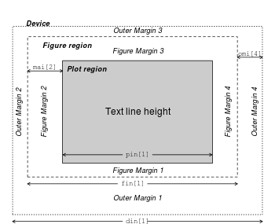

# 데이터 시각화 {#ch-data-visualization}

\footnotesize

\BeginKnitrBlock{rmdimportant}<div class="rmdimportant">**학습 목표**
  
- R에서 기본으로 제공하는 그래프 생성 개념 및 관련 함수의 의미 및 사용 방법에 대해 학습한다. 
- Grammar of graphics를 기반으로 개발된 ggplot2 패키지에 대해 알아보고 사용 방법을 학습힌다. 
</div>\EndKnitrBlock{rmdimportant}

 \normalsize

> “The simple graph has brought more information to the data analyst’s mind than any other device.” 
>
> $\rightarrow$ **John Tukey**


- 그래프는 생각보다 더 많은 정보를 제공 
- 데이터 분석 시 통계량 만으로 데이터의 속성을 결정하는 것은 매우 위험(예: Anscombe's quartet 데이터 예제)

\footnotesize

<div data-pagedtable="false">
  <script data-pagedtable-source type="application/json">
{"columns":[{"label":[""],"name":["_rn_"],"type":[""],"align":["left"]},{"label":["x1"],"name":[1],"type":["dbl"],"align":["right"]},{"label":["x2"],"name":[2],"type":["dbl"],"align":["right"]},{"label":["x3"],"name":[3],"type":["dbl"],"align":["right"]},{"label":["x4"],"name":[4],"type":["dbl"],"align":["right"]},{"label":["y1"],"name":[5],"type":["dbl"],"align":["right"]},{"label":["y2"],"name":[6],"type":["dbl"],"align":["right"]},{"label":["y3"],"name":[7],"type":["dbl"],"align":["right"]},{"label":["y4"],"name":[8],"type":["dbl"],"align":["right"]}],"data":[{"1":"10","2":"10","3":"10","4":"8","5":"8.04","6":"9.14","7":"7.46","8":"6.58","_rn_":"1"},{"1":"8","2":"8","3":"8","4":"8","5":"6.95","6":"8.14","7":"6.77","8":"5.76","_rn_":"2"},{"1":"13","2":"13","3":"13","4":"8","5":"7.58","6":"8.74","7":"12.74","8":"7.71","_rn_":"3"},{"1":"9","2":"9","3":"9","4":"8","5":"8.81","6":"8.77","7":"7.11","8":"8.84","_rn_":"4"},{"1":"11","2":"11","3":"11","4":"8","5":"8.33","6":"9.26","7":"7.81","8":"8.47","_rn_":"5"},{"1":"14","2":"14","3":"14","4":"8","5":"9.96","6":"8.10","7":"8.84","8":"7.04","_rn_":"6"}],"options":{"columns":{"min":{},"max":[10]},"rows":{"min":[10],"max":[10]},"pages":{}}}
  </script>
</div>

```
      x1       x2       x3       x4       y1       y2       y3       y4 
9.000000 9.000000 9.000000 9.000000 7.500909 7.500909 7.500000 7.500909 
```

```
      x1       x2       x3       x4       y1       y2       y3       y4 
3.316625 3.316625 3.316625 3.316625 2.031568 2.031657 2.030424 2.030579 
```

<div class="figure">

<p class="caption">(\#fig:unnamed-chunk-3)Anscombe's quartet: https://goo.gl/Ugv3Cz 에서 스크립트 발췌</p>
</div>

 \normalsize

- 시각화는 분석에 필요한 통계량 또는 분석 방법론에 대한 가이드를 제시
- 인간의 뇌 구조 상 추상적인 숫자나 문자 보다는 그림이나 도표를 더 빨리 이해
- 다른 통계 패키지(SPSS, SAS, STATA 등)와 비교할 수 없을 정도로 월등한 성능의 그래픽 도구 및 기능 제공


## R 기본 그래프 함수

- R의 그래픽은 그래픽 장치에 특정 그림(선, 점, 면 등)을 순차적으로 추가하는 명령(스크립트)을 통해 생성

- **그래픽 장치**: R에서 그래프가 출력되는 장치
   - windows: R 프로그램 내에서 출력
   - graphic files: pdf, jpeg, tiff, png, bmp 등의 확장자를 갖는 이미지 파일


- 그래프 장치를 열기 위해 사용되는 함수

   - `windows()` 또는 `win.graph()`: 그래픽 장치를 열기 위해 사용하는 함수
   - `dev.cur()`: 현재 활성화된 그래프 장치 확인
   - `dev.set()`: 다수의 그래프 장치가 열려 있는 경우 `which = 번호`로 변경
   - `dev.list()`: 현재 열려 있는 그래픽 장치 목록 조회
   - `dev.off()`: 현재 작업 중인 그래픽 장치 중지
   - `graphics.off()`: 열려있는 모든 그래픽 장치 중지


- R 그래프의 구조

\footnotesize

<div class="figure" style="text-align: center">

<p class="caption">(\#fig:r-graphic-layout)R 그래프영역</p>
</div>

 \normalsize

- Figure region: 범례(legend), x축, y축, 도표 등을 그래프가 표현하는 모든 구성요소를 포함하는 영역(plot region 포함)
- Plot region: 도표 부분 출력되는 영역
- Figure margin: figure region 안에서 plot region의 여백 부분을 나타내며, x, y 축 레이블(label), 제목(title), 각 축의 tick 및 값 등이 주로 위치하는 영역
- Outer margin: figure region 밖의 여백 부분


\footnotesize

\BeginKnitrBlock{rmdnote}<div class="rmdnote">R 기본 그래프 함수에 대한 강의 내용은 주로 [AIMS-R-users](http://users.monash.edu.au/~murray/AIMS-R-users/ws/ws11.html)에서 참고를 함</div>\EndKnitrBlock{rmdnote}

 \normalsize


그래프의 요소: **점(point)**, **선(line)**, **면(area)**, , **텍스트(text)**, **축(axis)**, **눈금(tick)**, **범례(legend)** 등


- **저수준 그래프 함수(low level plotting function)**: 위의 그래프 요소들을 개별적으로 작업(좌표축 정의, 여백 정의)하기 위한 함수군
- **고수준 그래프 함수(high level plotting function)**: 그래프의 함수 기능(저수준 그래프 함수)를 모아서 하나의 완성된 도표(산점도, 막대도표, 히스토그램, 상자그림 등)를 생성할 수 있는 함수군
   - 고수준 그래프 함수를 호출할 경우 자동으로 그래픽 장치가 열려서 `win.graph()` 등을 사용할 필요가 없으나, 이미 호출된 그래프는 사라짐
   
   
\footnotesize

\BeginKnitrBlock{rmdcaution}<div class="rmdcaution">**주의**: 일반적으로 R 기본 그래픽 함수로 도표 작성 시 저수준 그래프 함수는 고수준 그래프 함수로 생성한 그래프에 부가적 기능을 추가하기 위해 사용됨. 따라서 저수준 그래프 함수군은 고수준 그래프 함수을 통해 먼저 생성한 그래프(주로 아래 설명할 `plot()` 함수) 위에 적용됨. 
</div>\EndKnitrBlock{rmdcaution}

 \normalsize


## 고수준 그래프 함수 {#high-level-graph}

### **`plot()` 함수** {#plot-fun}

- R의 가장 대표적인 2차원 고수준 그래프 출력 함수
- `plot()`의 가장 일반적인 용도는 그래프 장치를 설정(축, 값의 범위 등) 후 저수준 그래프 함수(축, 선, 점, 면 등)를 그래프 장치에 적용
- 데이터가 저장되어 있는 객체(벡터, 행렬, 데이터 프레임 등) 하나 이상을 함수의 인수(argument)로 사용
- 데이터의 클래스에 따라 출력되는 그래프 결과가 다름 $\rightarrow$ `methods(plot)`을 통해 `plot()` 함수가 적용되는 클래스 확인 가능


\footnotesize


```r
#각 클래스에 적용되는 plot() 함수 리스트
methods(plot)
```

```
 [1] plot,ANY-method        plot,color-method      plot.acf*             
 [4] plot.ACF*              plot.augPred*          plot.compareFits*     
 [7] plot.data.frame*       plot.decomposed.ts*    plot.default          
[10] plot.dendrogram*       plot.density*          plot.ecdf             
[13] plot.factor*           plot.formula*          plot.function         
[16] plot.ggplot*           plot.gls*              plot.gtable*          
[19] plot.hcl_palettes*     plot.hclust*           plot.histogram*       
[22] plot.HoltWinters*      plot.intervals.lmList* plot.isoreg*          
[25] plot.lm*               plot.lme*              plot.lmList*          
[28] plot.medpolish*        plot.mlm*              plot.nffGroupedData*  
[31] plot.nfnGroupedData*   plot.nls*              plot.nmGroupedData*   
[34] plot.pdMat*            plot.ppr*              plot.prcomp*          
[37] plot.princomp*         plot.profile.nls*      plot.R6*              
[40] plot.ranef.lme*        plot.ranef.lmList*     plot.raster*          
[43] plot.shingle*          plot.simulate.lme*     plot.spec*            
[46] plot.stepfun           plot.stl*              plot.table*           
[49] plot.trans*            plot.trellis*          plot.ts               
[52] plot.tskernel*         plot.TukeyHSD*         plot.Variogram*       
see '?methods' for accessing help and source code
```

```r
#예시 1: 객체 클래스가 데이터 프레임인 경우
# mtcars 데이터 예시
class(mtcars)
```

```
[1] "data.frame"
```

```r
plot(mtcars)
```


 \normalsize

\footnotesize


```r
# 예시2: lm()으로 도출된 객체(list)
## 연비(mpg)를 종속 변수, 배기량(disp)을 독립변수로 한 회귀모형
## lm() 함수 사용 -> 객체 클래스는 lm

mod <- lm(mpg ~ disp, data = mtcars)
class(mod)
```

```
[1] "lm"
```

```r
par(mfrow = c(2, 2)) # 4개 도표를 한 화면에 표시(2행, 2열)
plot(mod)
dev.off() # 활성화된 그래프 장치 닫기
```

```
null device 
          1 
```


 \normalsize

\footnotesize


```r
# 예시3: 테이블 객체
class(Titanic)
```

```
[1] "table"
```

```r
plot(Titanic)
```


 \normalsize


- 객체의 클래스가 벡터나 행렬인 경우, 객체에 저장된 데이터를 2차원 평면(x-y 좌표)에 출력

\footnotesize


```r
# 예시1: 데이터 객체를 하나만 인수로 받는 경우
# -> x축은 객체의 색인이고, x의 데이터는 y 좌표에 매핑
x <- mtcars$disp
y <- mtcars$mpg

plot(x); plot(y)
```


 \normalsize

\footnotesize


```r
# 두개의 객체를 인수로 받은 경우
# -> 2차원 산점도 출력

plot(x, y)
```


 \normalsize

- `plot()` 함수의 세부 옵션

\footnotesize


```r
plot(
  x, # x 축에 대응하는 데이터 객체
  y, # y 축에 대응하는 데이터 객체
  type, # 그래프 타입(예시 참조)
  main, # 제목 
  sub,  # 부제목 
  xlim, ylim, # x, y 축 범위 지정
  xlab, ylab, # x-y 축 이름
  lty, # 선 모양
  pch, # 점 모양
  cex, # 점 및 텍스트 크기
  lwd, # 선 굵기
  col  # 색상
)
```

 \normalsize

- `type` 인수: 그래프 타입 지정

\footnotesize


```r
# BOD 데이터셋 이용
x <- BOD$Time; y <- BOD$demand
x; y
```

```
[1] 1 2 3 4 5 7
```

```
[1]  8.3 10.3 19.0 16.0 15.6 19.8
```

```r
ctype <- c("p", "l", "b", "o", "c", "h", "s", "n")
type_desc <- c("points", "lines", 
               "both points and lines", 
               "overlapped points and plots", 
               "empty points joined by lines", 
               "histogram like vertical lines", 
               "stair steps", 
               "no lines and points")

op <- par(mfrow = c(2, 4))
for (i in 1:length(ctype)) {
  plot(x, y, 
       type = ctype[i], 
       main = paste("type =", "'", ctype[i], "'"),
       sub = type_desc[i], 
       cex.main = 1.5, 
       cex.sub = 1.5, 
       cex = 2)
}
```


```r
par(op)
```

 \normalsize

- `xlim`, `ylim` 인수: x, y 축의 범위 지정


\footnotesize


```r
op <- par(mfrow = c(2, 3))
range <- data.frame(
  x1 = rep(c(0, 1), each = 3),
  x2 = rep(c(10, 5), each = 3), 
  y1 = rep(c(0, 5, 8), times = 2), 
  y2 = rep(c(30, 20, 16), times = 2)
  )
for (i in 1:6) {
  plot(x, y, 
       xlim = as.numeric(range[i, 1:2]), 
       ylim = as.numeric(range[i, 3:4]), 
       main = paste0("xlim = c(", 
                     paste(as.numeric(range[i, 1:2]), 
                           collapse = ", "), "), ", 
                     "ylim = c(", 
                     paste(as.numeric(range[i, 3:4]), 
                           collapse = ", "), ")")
       )
}
par(op)
```


 \normalsize

- `xlab`, `ylab` 인수: x축과 y축 이름 지정

\footnotesize


```r
x_lab <- c(" ", "Time (days)")
y_lab <- c("Demand", "Oxygen demend (mg/l)")

op <- par(mfrow = c(2, 2))
lab_d <- expand.grid(x_lab, y_lab)

for (i in 1:4) {
  plot(x, y, 
       xlab = lab_d[i, 1], 
       ylab = lab_d[i, 2], 
       main = paste0("xlab = ", "'", lab_d[i, 1], "'", ", ", 
                     "ylab = ", "'", lab_d[i, 2], "'")
  )
}
par(op); dev.off()
```

```
null device 
          1 
```


 \normalsize


- `lty` 인수: 선의 형태 지정

\footnotesize


```r
line_type <- c("blank", "solid", "dashed", "dotted",
               "dotdash", "longdash", "twodash")
plot(x = c(1:7), y = c(1:7), type="n", 
     axes = FALSE, 
     xlab = "", 
     ylab = "", 
     main = "Basic Line Types", 
     cex.main = 1.5)

for (i in 1:length(line_type)) {
  lines(c(1, 5.2), c(i, i), lty = i - 1, lwd = 2)  
  text(5.5, i, 
       labels = paste0("lty = ", i - 1, " (", 
                       line_type[i], ")"), 
       cex = 1.2, 
       adj = 0)
}
```


 \normalsize


- `pch` 인수: 점(point)의 모양을 지정

\footnotesize


```r
coord <- expand.grid(x = 1:5, y = 1:5)
plot(coord, type = "n", 
     xlim = c(0.8, 5.5), 
     ylim = c(0.8, 5.5), 
     xlab = "", 
     ylab = "", 
     main = "Basic plotting characters", 
     xaxt = "n", 
     yaxt = "n")
grid()
points(coord, pch=1:25, cex = 2.5)
text(coord + 0.2, labels = 1:25, cex = 1)
```


 \normalsize

- `cex` 인수: 텍스트 및 점의 크기 지정
   - `cex.axis`: 각 축의 눈금 레이블 크기 조정
   - `cex.lab`: x-y 축의 이름 크기 조정
   - `cex.main`: 그림 제목 크기 조정
   - `cex.sub`: 부제목 크기 조정

- 텍스트 `cex` 인수 적용 예시

\footnotesize


```r
par(mfrow = c(2, 3))
plot(BOD, type = "p", cex = 2, 
     main = "cex = 2", 
     sub = "Subtitle")
plot(BOD, type = "p", 
     cex.axis = 2, 
     main = "cex.axis = 2", 
     sub = "Subtitle")
plot(BOD, type = "p", 
     cex.lab = 2, 
     main = "cex.lab = 2", 
     sub = "Subtitle")
plot(BOD, type = "p", 
     cex.main = 2, 
     main = "cex.main = 2", 
     sub = "Subtitle")
plot(BOD, type = "p",
     cex.sub = 2, 
     main = "cex.sub = 2", 
     sub = "Subtitle")
```


 \normalsize

- `lwd` 인수: 선의 두께 지정
   - 점 `cex` 크기와 `lwd` 두께 


\footnotesize


```r
coord <- expand.grid(x = 1:5, y = 1:5)
plot(coord, type="n", 
     xlab = "cex", 
     ylab = "lwd", 
     xlim = c(0.5, 5.5), 
     ylim = c(0.5, 5.5),
     main = "pch and lwd size", 
     cex.main = 2, 
     cex.lab = 1.5)
points(coord, pch=16, cex = 1:5, col = "darkgray")
for (i in 1:5) {
  points(1:5, coord$y[coord$y == i], pch=21, 
         cex = 1:5, 
         lwd = i, col = "black")
}
```


 \normalsize

- `col` 인수: 그래프의 점, 면, 선의 색상 
- `palette()` 함수를 통해 그래픽 기본 색상 확인(총 8개)

\footnotesize


 \normalsize

- `colors()`를 통해 R에서 기본으로 제공하는 색상 확인 가능(총 657개)
- 내장 색상 팔레트: `n` 개의 색상을 반환하고, 색상의 투명도는 `alpha` 인수를 통해 조정
   - `rainbow(n)`: Red $\rightarrow$ Violet
   - `heat.colors(n)`: White $\rightarrow$ Orange $\rightarrow$ Red
   - `terrain.colors(n)`: White $\rightarrow$ Brown $\rightarrow$ Green
   - `topo.colors(n)`: White $\rightarrow$ Brown $\rightarrow$ Green $\rightarrow$ Blue
   - `grey(n)`: White $\rightarrow$ Black

- [R Color Chart](https://rstudio-pubs-static.s3.amazonaws.com/3486_79191ad32cf74955b4502b8530aad627.html) 참고


### 주요 고수준 그래픽 함수{#main-high-level-graph}

### 산점도 {#scatter-plot}

#### **`car::scatterplot()`** {#car_scatterplot .unnumbererd}

- `plot(x, y)`를 통해 2차원 산점도를 그릴 수 있으나, car 패키지에 내장되어 있는 해당 함수를 이용해 보다 많은 정보(상자그림, 회귀곡선 등)를 포함

\footnotesize


```r
# car 패키지 설치
# install.packages("car")
# require(car)
car::scatterplot(mpg ~ disp, data = mtcars)
```


 \normalsize

- `plot()` 함수의 인수 적용 가능

\footnotesize


```r
# help(scatterplot) 참고
car::scatterplot(mpg ~ disp, data = mtcars, 
                 regLine = list(method = lm, lty = 1, col = "red"), 
                 col = "black", cex = 2, pch = 16)
```


 \normalsize


#### **`pairs()`** {#pairs .unnumbererd}

- `pairs()`: 산점도 행렬을 생성해주는 함수로, 객체의 클래스가 데이터 프레임인 경우 `plot(dat)`과 동일한 그래프를 반환

\footnotesize


```r
# iris dataset
plot(iris)
```


 \normalsize


#### **`car::scatterplotMatrix()`** {#car_scatterplotMatrix .unnumbererd}

- R graphics 패키지의 `pair()`와 유사하나 각 변수 쌍별 회귀 곡선 및 분포 확인 가능


\footnotesize


```r
# iris dataset
car::scatterplotMatrix(iris, col = "black")
```


 \normalsize


\footnotesize


```r
# help(scatterplotMatrix)
car::scatterplotMatrix(iris, col = c("red", "blue", "green"), 
                       smooth = FALSE, 
                       groups = iris$Species, 
                       by.groups = FALSE, 
                       regLine = list(method = lm, lwd = 1, col = "gray"), 
                       pch = (15:17))
```


 \normalsize

### 행렬 그래프 {#mat-plot}

- 행렬 객체를 `plot()` 함수의 입력으로 사용한 경우 1-2 번째 열 데이터로 산점도를 출력

\footnotesize


```r
# 행렬을 plot() 함수의 입력으로 받은 경우
par(mfrow = c(1,2))
x <- seq(-5, 5, 0.01)
X <- mapply(dnorm, 
            list(a = x, b = x, c = x), 
            c(0, 1, 2), 
            c(1, 2, 4))
X <- matrix(X, nrow = length(x), ncol = 3)
head(X)
```

```
             [,1]        [,2]       [,3]
[1,] 1.486720e-06 0.002215924 0.02156933
[2,] 1.562867e-06 0.002249385 0.02166383
[3,] 1.642751e-06 0.002283295 0.02175862
[4,] 1.726545e-06 0.002317658 0.02185368
[5,] 1.814431e-06 0.002352479 0.02194902
[6,] 1.906601e-06 0.002387763 0.02204463
```

```r
# plot() 함수를 이용한 행렬 그래프 출력
plot(X, type = "l", main = "plot matrix (X) using plot()")
text(0.2, 0.05, labels = "plot(X, type = `l`)")
plot(X[, 1], X[, 2], type = "l", 
     main = "scatterplot between X[, 1] and X[, 2]")
text(0.2, 0.05, labels = "plot(X[,1], X[,2], type = `l`)")
```


 \normalsize

#### **`matplot()`** {#mat_plot .unnumbered}

- 객체의 클래스가 행렬(matrix) 형태로 이루어진 데이터에 대한 그래프 출력
   - 열 기준으로 그래프 출력
   - x 가 주어지지 않은 경우, 행렬의 색인을 x 축으로 사용

\footnotesize


```r
# matplot 도표
par(mfrow = c(1, 2))
matplot(X, type = "l", 
        lwd = 2, 
        main = "matplot() without x")
matplot(x, X, type = "l", 
        lwd = 2, 
        main = "matplot() with x")
```


 \normalsize


### 히스토그램  {#histogram}

#### **`hist()`** {#hist .unnumbered}

\footnotesize


```r
hist(
  x, # vector 객체
  breaks, # 빈도 계산을 위한 구간
  freq, # y축 빈도 또는 밀도(density) 여부
  col, # 막대 색상 지정
  border, # 막대 테두리 색 지정
  labels, # 막대 위 y 값 레이블 출력 여부 
  ...
)
```

 \normalsize


\footnotesize


```r
# airquality 데이터 셋
# help(airquality) 참고
glimpse(airquality)
```

```
Observations: 153
Variables: 6
$ Ozone   <int> 41, 36, 12, 18, NA, 28, 23, 19, 8, NA, 7, 16, 11, 14, 18, 1...
$ Solar.R <int> 190, 118, 149, 313, NA, NA, 299, 99, 19, 194, NA, 256, 290,...
$ Wind    <dbl> 7.4, 8.0, 12.6, 11.5, 14.3, 14.9, 8.6, 13.8, 20.1, 8.6, 6.9...
$ Temp    <int> 67, 72, 74, 62, 56, 66, 65, 59, 61, 69, 74, 69, 66, 68, 58,...
$ Month   <int> 5, 5, 5, 5, 5, 5, 5, 5, 5, 5, 5, 5, 5, 5, 5, 5, 5, 5, 5, 5,...
$ Day     <int> 1, 2, 3, 4, 5, 6, 7, 8, 9, 10, 11, 12, 13, 14, 15, 16, 17, ...
```

```r
temp <- airquality$Temp
hist(temp)
```


 \normalsize

- `hist()` 함수의 반환값

\footnotesize


```r
h <- hist(temp, plot = FALSE) # 그래프를 반환하지 않음
h
```

```
$breaks
 [1]  55  60  65  70  75  80  85  90  95 100

$counts
[1]  8 10 15 19 33 34 20 12  2

$density
[1] 0.010457516 0.013071895 0.019607843 0.024836601 0.043137255 0.044444444
[7] 0.026143791 0.015686275 0.002614379

$mids
[1] 57.5 62.5 67.5 72.5 77.5 82.5 87.5 92.5 97.5

$xname
[1] "temp"

$equidist
[1] TRUE

attr(,"class")
[1] "histogram"
```

 \normalsize


- `hist()` 함수의 인수 사용(`plot()` 함수의 인수 거의 대부분 사용 가능)

\footnotesize


```r
hist(temp,
main="La Guardia Airport 일중 최고 기온",
xlab = "온도",
ylab = "밀도",
xlim = c(50,100),
col = "orange",
freq = FALSE
)
```


 \normalsize

- `labels` 인수를 통해 빈도값 출력

\footnotesize


```r
hist(temp,
main = "La Guardia Airport 일중 최고 기온",
xlab = "온도",
ylab = "빈도",
xlim = c(50,100),
col = "orange",
labels = TRUE
)
```


 \normalsize

- `breaks` 인수를 통해 막대 구간 조정

\footnotesize


```r
op <- par(mfrow = c(1, 2))
hist(temp, breaks = 4, main = "breaks = 4")
hist(temp, breaks = 15, main = "breaks = 15")
par(op); dev.off()
```

```
null device 
          1 
```


 \normalsize


### 막대 그래프 {#bar-plot}

- 히스토그램(`hist()`)은 연속형 데이터의 구간 별 빈도 또는 밀도를 나타냄
- 막대 도표(bar plot)는 해당 좌표의 값(value)를 나타냄

\footnotesize


```r
x = c(1,2,2,1,3,3,1,5)
par(mfrow = c(1, 2))
hist(x); barplot(x)
```


 \normalsize

#### **barplot()** {#barplot_fun .unnumbered}

- `help(barplot)` 을 통해 함수 사용 방법 확인
- 보통 요약통계량(예: 그룹별 빈도, 평군)의 시각화를 위해 많이 사용

\footnotesize


```r
## Wool dataset: warpbreaks 
## 제직 중 방적 횟수
## 직조기 당 날실 파손 횟수 데이터
head(warpbreaks)
```

<div data-pagedtable="false">
  <script data-pagedtable-source type="application/json">
{"columns":[{"label":[""],"name":["_rn_"],"type":[""],"align":["left"]},{"label":["breaks"],"name":[1],"type":["dbl"],"align":["right"]},{"label":["wool"],"name":[2],"type":["fctr"],"align":["left"]},{"label":["tension"],"name":[3],"type":["fctr"],"align":["left"]}],"data":[{"1":"26","2":"A","3":"L","_rn_":"1"},{"1":"30","2":"A","3":"L","_rn_":"2"},{"1":"54","2":"A","3":"L","_rn_":"3"},{"1":"25","2":"A","3":"L","_rn_":"4"},{"1":"70","2":"A","3":"L","_rn_":"5"},{"1":"52","2":"A","3":"L","_rn_":"6"}],"options":{"columns":{"min":{},"max":[10]},"rows":{"min":[10],"max":[10]},"pages":{}}}
  </script>
</div>

```r
count <- with(warpbreaks, 
              tapply(breaks, list(wool, tension), 
                     sum))

par(mfrow = c(1, 2))
barplot(count, legend = TRUE, 
        xlab = "Tension", 
        ylab = "Number of breaks", 
        ylim = c(0, 700), 
        cex.lab = 1.5) # stack 형태

barplot(count, legend = TRUE, beside = TRUE, 
        xlab = "Tension", 
        ylab = "Number of breaks", 
        ylim = c(0, 450), 
        cex.lab = 1.5) # 분리 형태
```


 \normalsize

- 데이터 프레임을 대상으로 `barplot()` 실행 시 수식 표현 가능
- 막대도표 + 표준오차

\footnotesize


```r
mean_breaks <- aggregate(breaks ~ wool + tension, 
                         data = warpbreaks, 
                         mean)
se_breaks <- aggregate(breaks ~ wool + tension, 
                       data = warpbreaks, 
                       FUN = function(x) sd(x)/sqrt(length(x)))

barplot(breaks ~ wool + tension, 
        data = mean_breaks, 
        ylim = c(0, 55), 
        beside = TRUE, 
        legend = TRUE, # 범례
        col = c("blue", "skyblue")
        ) -> bp
cent <- matrix(mean_breaks$breaks, 2, 3)
sem <- matrix(se_breaks$breaks, 2, 3)
arrows(bp, cent - sem, bp, cent + sem, angle = 90, code = 3, length = 0.05)
```


 \normalsize

### 상자 그림 {#boxplot}

- 다섯 개의 통계량(5 numbers summary: 최솟값, 1사분위수, 중앙값, 3사분위수, 최댓값)을 이용해 연속형 자료를 그래프로 표현한 도표

\footnotesize


```r
set.seed(20200522)
x <- rnorm(100)
plab <- c("min(x)", "quantile(x, 0.25)", "median(x)", 
          "quantile(x, 0.75)", "max(x)") # x-axis 레이블
bxplt <- boxplot(x, 
                 horizontal = TRUE, # x-y 축 회전 여부
                 axes = F, # x-y 축 출력 여부
                 main = "Boxplot anatomy", 
                 cex.main = 2
                 ) # boxplot 수치 요약값 저장
axis(side = 1, at = bxplt$stats, 
     labels = FALSE, 
     las = 2) # x-axis 설졍
text(x = c(bxplt$stats), 
     y = 0.4, 
     labels = plab, 
     xpd = TRUE, # 텍스트 출력 영역 범위 지정
     srt = 25, # 레이블 로테이션 각도(degree)
     adj = 1.1, # 레이블 위치 조정
     cex = 1.2 # 레이블 크기 조정
     ) # x-axis 레이블 조정
abline(v = c(bxplt$stats), lty = 2, col = "gray") # 수직 선 출력
arrows(x0 = c(bxplt$stats)[2], y0 = 1.3, 
       x1 = c(bxplt$stats)[4], y1 = 1.3, 
       code = 3, 
       length = 0.1) # IQR 범위에 화살표 출력
text(x = -0.1, y = 1.3, 
     labels = "Interquartile range (IQR)", 
     adj = 0.5, pos = 3) # 
```


 \normalsize


#### **boxplot()** {#boxplot_fun .unnumbered}

- `help(boxplot)`을 통해 상세 함수 인수 내용 확인

\footnotesize


```r
boxplot(x, # boxplot 대상 객체 명
        ... # 두 개 이상 객체(보통은 벡터)
        ) 
또는 

boxplot(formula, # 수식 표현
        data, # 데이터 프레임 객체명
        subset, # 부집단 선택
        ... # help(boxplot)을 통해 인수 사용법 참고
        )
```

 \normalsize


- 벡터, 행렬, 데이터 프레임, 리스트 객체에 적용 가능
- 데이터 프레임의 경우 수식 표현 가능
   - `y ~ x`: 변수 `x` (보통은 factor 형)에 따른 `y`
   - `y ~ x + y`: 변수 `x`와 `y`의 조합에 따른 `y`


\footnotesize


```r
par(mfrow = c(2, 2))
set.seed(20200522)
y <- rnorm(100, 2, 1)
# vector 객체 boxplot
boxplot(x, y, 
        main = "Boxplot for a vector object")
axis(side = 1, at = 1:2, labels = c("x", "y"))

# 행렬 객체 boxplot
head(X)
```

```
             [,1]        [,2]       [,3]
[1,] 1.486720e-06 0.002215924 0.02156933
[2,] 1.562867e-06 0.002249385 0.02166383
[3,] 1.642751e-06 0.002283295 0.02175862
[4,] 1.726545e-06 0.002317658 0.02185368
[5,] 1.814431e-06 0.002352479 0.02194902
[6,] 1.906601e-06 0.002387763 0.02204463
```

```r
boxplot(X, 
        main = "Boxplot for a matrix `X`")

# 데이터 프레임 객체 boxplot
boxplot(breaks ~ wool + tension, 
        data = warpbreaks, 
        main = "Boxplot for a dataframe `warpbreaks`", 
        col = topo.colors(6))

# 리스트 객체 boxplot
## list 생성: mapply
set.seed(20200522)
xl <- mapply(rnorm, # 정규 난수 생성 함수
             c(50, 100, 150, 200), # 첫번째 인수 n
             c(0, 2, 4, 6), # 두 번째 인수 mean
             c(1, 1, 1, 2)) # 세번째 인수 sd
boxplot(xl, 
        main = "Boxplot for a list `xl`", 
        col = "lightgray")
```


 \normalsize


### 바이올린 도표 {#violin-plot}

- 상자그림과 유사하나, 가운데를 중심으로 왼쪽과 오른쪽에 데이터의 밀도(kernel density)를 표시 


#### **vioplot::viplot()** {#vioplot .unnumbered}

- `boxplot()`과 사용 방법이 유사 

\footnotesize


```r
# install.packages(vioplot)
# require(vioplot)
## generating bimodal distribution
mu <- 2; sigma <- 1
set.seed(20200522)
bimodal <- c(rnorm(200, mu, sigma), 
             rnorm(300, -mu, sigma)) # 두 정규분포 혼합
normal <- rnorm(200, 2*mu, sigma) # 정규분포
unif <- runif(200, -2, 2) # uniform 분포 (-2, 2)

par(mfrow = c(2,2))
boxplot(bimodal, normal, unif, 
        main = "Boxplot for each distribution (vectors)")
vioplot::vioplot(bimodal, normal, unif, 
                 main = "Violin plot for each distribution (vectors)", 
                 col = "skyblue")

vioplot::vioplot(breaks ~ wool + tension, 
                 data = warpbreaks, 
                 main = "Violin plot for a dataframe `warpbreaks`", 
                 col = heat.colors(6))

vioplot::vioplot(xl, 
                data = warpbreaks, 
                main = "Violin plot for a list `xl`", 
                col = rainbow(4))
```


 \normalsize


### 모자이크 도표 {#mosaicplot}

- 다변량 범주형 자료의 분포(빈도, frequency)를 시각화 하기 위한 그래프
- 전체 직사각형의 면적을 1이라고 할 때, 중첩되지 않는 각 셀의 빈도(행 기준)의 비율만큼 면적을 할당. 
- 로그선형모형(log-linear model)에 대한 적합도 검정(goodness of fit test) 결과 출력

\footnotesize

\BeginKnitrBlock{rmdnote}<div class="rmdnote">로그선형모형(log-linear model)은 다차원 교차표의 셀 빈도를 예측하기 위한 모형임. 해당 모형에 대한 기술은 본 강의의 범위 벗어나기 때문에 설명을 생략함. </div>\EndKnitrBlock{rmdnote}

 \normalsize


\footnotesize


 \normalsize


#### **mosaicplot()** {#mosaicplot_fun .unnumbered} 

- R graphics 패키지(기본 그래픽 패키지)에 내장되어 있는 함수
- 기본적으로 table 객체(기본적으로 `table()`을 통해 생성된 객체)를 입력 데이터로 받음
- 수식 표현을 통해 모자이크 데이터 프레임(또는 리스트), 객체로부터 도출한 테이블로 도표 생성 가능(테이블 객체에도 수식 표현 가능)

\footnotesize


```r
mosaicplot(
  x, # 테이블 객체
  shade # goodness-of-test 결과 출력 여부
  ... 
) 
또는

mosaicplot(
  formula, # 수식 표현식
  data, # 데이터 프레임, 리스트 또는 테이블 
  shade 
)
```

 \normalsize

- 예시: 버클리 주립대 대학원 합격자 데이터
   - Simpson's paradox를 설명하는 대표적인 예시로 많이 활용되는 데이터

\footnotesize


```r
dimnames(UCBAdmissions)
```

```
$Admit
[1] "Admitted" "Rejected"

$Gender
[1] "Male"   "Female"

$Dept
[1] "A" "B" "C" "D" "E" "F"
```

```r
collapse_admin_tab <- margin.table(UCBAdmissions, margin = c(1,2))
is.table(collapse_admin_tab)
```

```
[1] TRUE
```

```r
par(mfrow = c(1, 2), 
    mar = c(2, 0, 2, 0)) # figure margin 조정
                         # bottom, left, top, right
mosaicplot(collapse_admin_tab, 
           main = "Student admissions at UC Berkeley", 
           color = TRUE)
mosaicplot(~ Dept + Admit + Gender, data = UCBAdmissions, 
           color = TRUE)
```


 \normalsize

- 각 학과 별 mosaic 도표(`help(UCBAdmissions)`의 예시 코드)

\footnotesize


```r
par(mfrow = c(2, 3), 
    oma = c(0, 0, 2, 0))
for (i in 1:6) {
  mosaicplot(
    UCBAdmissions[, , i], 
    xlab = "Admit", 
    ylab = "Sex", 
    main = paste("Department", LETTERS[i]), 
    color = TRUE
  )
}
mtext(
  expression(bold("Student admissions at UC Berkeley")), 
  outer = TRUE, 
  cex = 1.2
)
```


 \normalsize


## 저수준 그래프 함수 {#low-level-graphic}

- 고수준 그래픽 함수(일반적으로 `plot()` 함수)를 통해 호출한 그래픽 장치 위에 추가적인 그래프 요소(점, 선, 면, 문자, 범례 등)를 수동으로 추가
- 그래프의 미학적 효과를 극대화 하기 위해, 최소한으로 그래픽 장치를 호출(공백, 크기, 레이아웃 축 정의) 후 저수준 그래픽 함수를 이용해 그래프 생성
- \@ref(plot-fun) 절 `plot()` 함수에서 확인했던 다양한 그래픽 관련 인수(예: `main`, `xlim`, `ylim`, `pch` `lty`, `col` 등)들을 저수준 그래프 함수에서 사용 가능
- 명시적으로 포함되지 않은(`help()` 통해 확인) 인수들은 `...`로 표현


### par() {#par}

- 전체 그래픽 장치에 적용되는 여러가지 파라미터를 제어하며, 고수준 및 저수준 그래프의 모양 및 미학적 특성 설정
- `par()` 함수를 통해 그래픽 파라미터 설정 및 조회 가능

\footnotesize


```r
# 그래프 파라미터 조회 
# 처음 12개 파라미터들에 대해서만 조회
unlist(par()) %>% head(12)
```

```
         xlog          ylog           adj           ann           ask 
      "FALSE"       "FALSE"         "0.5"        "TRUE"       "FALSE" 
           bg           bty           cex      cex.axis       cex.lab 
"transparent"           "o"           "1"           "1"           "1" 
     cex.main       cex.sub 
        "1.2"           "1" 
```

 \normalsize

- `par()` 함수 조정 파라미터 리스트


\footnotesize


```r
Parameter <- c("din, fin, pin", 
               "fig", "mai, mar", 
               "mfg", "mfcol,mfrow", 
               "new", "oma,omd,omi", 
               "plt", "pty", "usr")
`값` <- c("= c(width, height)", "=c(left, right, bottom, top)", 
          "= c(bottom, left, top, right)", "= c(row, column)", 
         "=c(rows, columns)", "=TRUE or =FALSE", "=c(bottom, left, top, right)", 
         "=c(left, right, bottom, top)", "= \"s\" or \"m\"", 
         "=c(left, right, bottom, top)")
`설명` <- c("그래픽 장치(device), figure, plot 영역 크기(너비: width, 높이: height) 조정(인치 단위)", 
            "장치 내 figure 영역의 4개 좌표 조정을 통해 figure 영역 크기 및 위치 조정", 
            "Figure 영역의 각 4개 마진의 크기 조정(인치 또는 현재 폰트 사이즈 기준 텍스트 길이 단위)", 
            "mfcol 또는 mfrow로 분할된 그림에서 현재 활성화된 figure의 위치 조정", 
            "그래프 화면 출력을 열 또는 행 기준으로 분할", 
            "현재 figure 영역을 새 그래프 장치로 인지(TRUE이면 이미 출력된 그림 위에 새로운 고수준 그래프 함수가 생성) 여부", 
            "Outer")
```

 \normalsize


- R 그래픽 레이아웃(그림 \@ref(fig:r-graphic-layout) 참조) 조정 파라미터

\footnotesize


```r
knitr::include_graphics('figures/graphics-figureAnatomy1.png', dpi = NA)
knitr::include_graphics('figures/graphics-figureAnatomy2.png', dpi = NA)
```

<div class="figure">

<p class="caption">(\#fig:layout-par)레이아웃 파라미터. [AIMS-R-Users](http://users.monash.edu.au/~murray/AIMS-R-users/ws/ws11.html)에서 발췌</p>
</div>

 \normalsize


### points() {#points}

### lines() {#lines}

### ablines() {#ablines}

### arrows() {#arrows}

### polygons() {#polygons}

### text()


### R 기본 그래프 이미지 파일로 저장


## ggplot2

### 기본 문법

### `geom_point()`

### `geom_line()`

### `geom_bar()`

### `geom_errorbar()`

### `geom_histogram()`

### `geom_boxplot()`

### `geom_density()`

### `geom_smooth()`

### `theme()`


