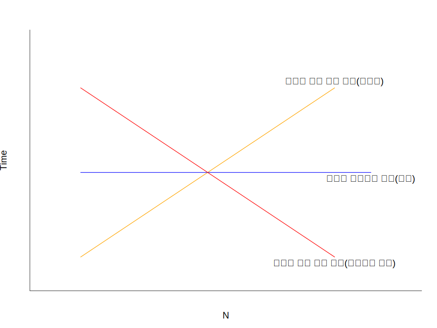
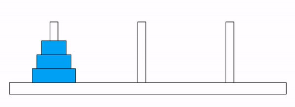

\footnotesize


 \normalsize


# 알고리즘의 기초


> **Sketch**
>
> - 알고리즘으로 무엇을 할 수 있을까?
> - 지금까지 배운 여러 구문을 이용해 간단한 알고리즘을 구현해 보기 


\footnotesize


 \normalsize


## 알고리즘(Algorithm)


\footnotesize

\BeginKnitrBlock{rmdnote}<div class="rmdnote">어떤 주어진 문제를 해결하기 위해 정해진 일련의 절차 또는 방법을 절차화한 형태로 표현한 것으로 
계산을 실행하기 위한 단계적 절차를 의미. 즉, 문제 해결에 필요한 계산 절차 또는 처리 과정의 순서를 의미함. 

--- _**Wikipedia 발췌**_ ---

</div>\EndKnitrBlock{rmdnote}

 \normalsize


#### 좋은 알고리즘의 특징 {.unnumbered}


> - 정밀성: 변하지 않는 명확한 작업 단계로 구성
> - 유일성: 각 단계마다 명확한 다음 단계를 가져야 함 
> - 타당성: 구현할 수 있고 실용적
> - 입력: 정의된 입력을 받을 수 있어야 함
> - 출력: 답으로 출력을 내보낼 수 있어야 함
> - 유한성: 특정 수의 작업 이후에 정지 
> - 일반성: 정의된 입력들에 대해 일반적으로 적용할 수 있어야 함


#### 구현 {.unnumbered}

자연어(natural language), 의사코드(pseudocode), 순서도(flow-chart), 프로그래밍 언어 등으로 
표현할 수 있고, 정형적 단계는 다음과 같음

문제정의 $\rightarrow$ 모델고안 $\rightarrow$ 명세 작성 $\rightarrow$ 설계 $\rightarrow$ 
검증 $\rightarrow$ 분석 $\rightarrow$ 구현 $\rightarrow$ 테스트 $\rightarrow$ 문서화


#### **알고리즘의 성능** {.unnumbered}

\footnotesize

\BeginKnitrBlock{rmdnote}<div class="rmdnote">"알고리즘 성능"과 관련한 내용은 https://makemethink.tistory.com/105 에서 
관련 내용을 참고해 재구성함
</div>\EndKnitrBlock{rmdnote}

 \normalsize


**성능(performance/efficiency)**

- 동일한 결과를 산출하는 알고리즘에도 차이가 존재
- 보통 그 차이는 알고리즘의 수행시간(자원, resource)과 밀접한 연관이 있음 
- 예: 특정 학생의 전화번호 탐색 알고리즘(정답을 출력한다고 가정)
   - A 알고리즘 수행 시간: 0.1초
   - B 알고리즘 수행 시간: 1.0초 

$\rightarrow$ A 알고리즘이 더 효율적임

- 즉 성능은 **동일한 결과를 도출하기 위해 필요한 자원(시간과 공간)의 크기**


$$
\mathrm{performance} = \mathrm{\frac{solution}{resource}}
$$

성능은 다음과 같은 측면으로 고려해볼 수 있음

- 최선(best)의 경우 $\rightarrow$ 빠르면 1초 내에 전화번호 탐색
- 평균(average)의 경우 $\rightarrow$ 평균 10 초 이내에 전화번호 탐색
- 최악(worst)의 경우 $\rightarrow$ 아무리 늦어도 1분 이내 번호 탐색


일반적으로 성능은 최악의 경우를 상정함 $\rightarrow$ 위의 예시에서 최악은 
적어도 기대 시간이 1분 보다는 빠르기 때문에 위 두 가지를 모두 포괄


**자원(resource)을 결정 짓는 요소** 

\footnotesize

\BeginKnitrBlock{rmdtip}<div class="rmdtip">**시간 복잡도(time complexity)**: 알고리즘 실행 완료 시 까지 걸린 시간

- 사칙연산(`+`, `-`, `*`, `\`)
- 비교연산(`>`, `<`, `==`)
- 반복(`for`, `while`, `repeat`)
- 함수호출


**공간 복잡도(space complexity)**: 알고리즘 실행 완료를 위해 필요한 메모리(공간) 
크기

- 변수 개수
- 데이터 구조
- 함수 호출
- 알고리즘 내 자료 재햘당 여부

</div>\EndKnitrBlock{rmdtip}

 \normalsize


> 일반적으로 **시간**이 **공간**보다 더 소중한 자원임


#### 시간 복잡도 및 공간 복잡도 예 {.unnumbered}


\footnotesize


```r
# 프로그램 1
x <- numeric(100)
for (i in seq_along(x)) {
  x[i] <- i
}

# 프로그램 2
x <- NULL
for (i in 1:100) {
  x <- c(x, i)
}
```

 \normalsize


- 프로그램 1의 `for` 반복의 시간복잡도는 $\mathcal{O}(n)$ 이고, 공간 복잡도의 경우 
반복문 내에세 미리 정의한 `x` 벡터에 값을 할당하는 것이기 때문에 $\mathcal{O}(1)$

- 프로그램 2의 경우에는 반복문 내에서 `x`의 저장공간이 반복에 따라 추가적으로 $n$ 까지 
증가하기 때문에 공간 복잡도는 $\mathcal{O}(n)$


#### 알고리즘 성능의 점근적 분석 {.unnumbered}

- 성능은 입력의 크기에 따라 결정됨
- $n$을 입력의 크기라고 할 때 시간 복잡도를 $n$에 대한 함수로 표현 $\rightarrow$ $f(n)$ 
- `f(n)` 은 다음과 같은 형태를 가질 수 있음


\footnotesize



 \normalsize


- 시간 복잡도는 **매우 큰 입력**에 대해 측정하는데, 입력에 대한 함수 $f(n)$ 보다 
성능이 특정 입력보다 커지면 항상 나쁜 $g(n)$을 이용해 $f(n)$의 성능을 표현

   - $g(n)$은 $f(n)$ 보다 상상 성능이 나쁘다 $\rightarrow$ $f(n)$의 최악
   - 최악의 경우에도 $f(n)$은 $g(n)$보다 성능이 좋음
   - $f(n)$의 상한은 $g(n)$임 
   - $f(n) \leq g(n)$ 
   

> - 많이 사용되는 표준 함수 사용(예: 1, $n$, $\log n$, $n^2$, $n\log n$, $2^n$)


- 예: $g(n) = n^2$ 
   - $f(n)$은 어떤 경우에도 $n^2$ 보다는 빠름 
   - $f(n)$의 최악의 경우가 $n^2$ 임 
   - $f(n)$의 상한은 $n^2$


#### **Big O notation (빅오 표기법)** {.unnumbered}


- 어떤 함수의 증가 양상을 다른 함수와 비교하기 위한 점근 표기법(asymptotic notation) 
중 하나
   - 예: Big $\Omega$ (하한), Big $\Theta$ notation (평균)
- Big O는 점근적 상한에 대한 표기법   
- 알고리즘의 복잡도를 단순화 하거나 무한급수의 뒷부분 간소화 할 때 사용
- 알고리즘의 효율성을 나타내기 위한 방법으로 시간 복잡도(실행시간)와 공간 
복잡도(실행공간, 메모리)로 이루어짐. 


#### **수학적 정의** {.unnumbered}

> 모든 정수 또는 실수 집합에서 정의한 $n$에 대한 실수 집합의 함수를 
$f$ 와 $g$ 라고 하자. $|f(x)| \leq C |g(x)|$를 만족하는 상수 
$k~(x \geq k)$와 $C$ 가 존재할 때 
$f(x)$은 $\mathcal{O}(g(x))$ 이라고 나타낸다. 
> 
> 이 때, $f(x)$은 $g(x)$의 **big-oh"** 라고 읽는다. 


\footnotesize

<div class="figure" style="text-align: center">

<p class="caption">(\#fig:unnamed-chunk-7)https://johngrib.github.io/wiki/big-O-notation/ 에서 발췌</p>
</div>

 \normalsize


- 여기서 $k$와 $C$를 $f(x)$가 $\mathcal{O}(g(x))$ 관계에 대한 증인(witness)라 부름
- 즉 $f(x)$가 $\mathcal{O}(g(x))$ 라는 것을 증명하기 위해서는 위 정의를 만족하는 
$k$와 $C$를 찾으면 됨
- 만약 $k$, $C$ 한 쌍이 존재하면 무수히 많은 $k$와 $C$가 존재함
- $\mathcal{O}(g(n))$은 $g(n)$의 증가율보다 작거나 같은 함수들의 집합임 
   - $\mathcal{O}(n^2)$은 $\mathcal{O}(1)$, $\mathcal{O}(n)$, $\mathcal{O}(n\log n)$ 을 
   포함


\footnotesize

\BeginKnitrBlock{rmdnote}<div class="rmdnote">- $k$의 최솟값은 $Cg(x) \geq f(x)$ 인 지점
- $C$의 후보는 모든 실수이기 때문에 $Cg(x)$의 최고차항 차수가 $f(x)$의 
최고차항의 차수보다 크거나 같다면 $f(x)$의 최고차항 계수는 그 값과 
상관없이 $Cg(x)$의 증가율보다 클수 없음. 

</div>\EndKnitrBlock{rmdnote}

 \normalsize


**Big O 복잡도 도표**


<!-- - $\mathcal{O}(1)$: $n$과 관계없이 일정 시간 이하로 수행되는 알고리즘 -->
<!--    - 예: 파일의 첫 번째 byte 가 null 인지, 주어진 벡터의 첫 번째 값이 0인지 검사 -->

<!-- - $\mathcal{O}(\log n)$: 알고리즘의 수행속도가 $\log_2 n$에 비례하여 수행됨 -->
<!--    - 예: 이진 탐색(binary search) -->

<!-- - $\mathcal{O}(n)$: 알고리즘의 수행속도가 선형적($n$)으로 비례하여 수행 -->
<!--    - 예: 단순 검색(simple search) -->

- 기울기가 높아질수록 성능이 시간이 오래 걸림 $\rightarrow$ 효율이 떨어지므로 성능 또한 좋지 않음 
- Big O의 차이에 따른 알고리즘 성능 비교


\footnotesize

<table class="table table-condensed table-striped" style="font-size: 12px; margin-left: auto; margin-right: auto;">
<caption style="font-size: initial !important;">(\#tab:unnamed-chunk-9)Big-O 복잡도 비교</caption>
 <thead>
  <tr>
   <th style="text-align:left;"> N </th>
   <th style="text-align:left;"> $\mathcal{O}(1)$ </th>
   <th style="text-align:left;"> $\mathcal{O}(\log n)$ </th>
   <th style="text-align:left;"> $\mathcal{O}(n)$ </th>
   <th style="text-align:left;"> $\mathcal{O}(n\log n)$ </th>
   <th style="text-align:left;"> $\mathcal{O}(n^2)$ </th>
   <th style="text-align:left;"> $\mathcal{O}(2^n)$ </th>
   <th style="text-align:left;"> $\mathcal{O}(n!)$ </th>
  </tr>
 </thead>
<tbody>
  <tr>
   <td style="text-align:left;"> 1 </td>
   <td style="text-align:left;"> 1 </td>
   <td style="text-align:left;"> 1 </td>
   <td style="text-align:left;"> 1 </td>
   <td style="text-align:left;"> 1 </td>
   <td style="text-align:left;"> 1 </td>
   <td style="text-align:left;"> 1 </td>
   <td style="text-align:left;"> 1 </td>
  </tr>
  <tr>
   <td style="text-align:left;"> 10 </td>
   <td style="text-align:left;"> 1 </td>
   <td style="text-align:left;"> 2 </td>
   <td style="text-align:left;"> 10 </td>
   <td style="text-align:left;"> 23 </td>
   <td style="text-align:left;"> 100 </td>
   <td style="text-align:left;"> 1024 </td>
   <td style="text-align:left;"> 3.63E+06 </td>
  </tr>
  <tr>
   <td style="text-align:left;"> 100 </td>
   <td style="text-align:left;"> 1 </td>
   <td style="text-align:left;"> 5 </td>
   <td style="text-align:left;"> 100 </td>
   <td style="text-align:left;"> 461 </td>
   <td style="text-align:left;"> 10000 </td>
   <td style="text-align:left;"> 1.27E10+30 </td>
   <td style="text-align:left;"> 9.33E10+157 </td>
  </tr>
</tbody>
</table>

 \normalsize


#### **Big O 표기법 규칙** {.unnumbered}


\footnotesize

\BeginKnitrBlock{rmdtip}<div class="rmdtip">**극한의 성질**
  
  1. 합의 법칙: $\lim\limits_{x \to a} [f(x) + g(x)] = \lim\limits_{x \to a} f(x) + \lim\limits_{x \to a} g(x)$

  2. 차의 법칙: $\lim\limits_{x \to a} [f(x) - g(x)] = \lim\limits_{x \to a} f(x) - \lim\limits_{x \to a} g(x)$

  3. 상수 곱의 법칙: $\lim\limits_{x \to a} [cf(x)] = c\lim\limits_{x \to a} f(x)$

  4. 곱의 법칙: $\lim\limits_{x \to a} [f(x) \cdot g(x)] = \lim\limits_{x \to a} f(x) \cdot \lim\limits_{x \to a} g(x)$


</div>\EndKnitrBlock{rmdtip}

 \normalsize


##### **1. 계수 법칙** {.unnumbered}

> 상수 $C > 0$ 일 때, $f(x) = \mathcal{O}(g(x))$ 이면 $Cf(x) = \mathcal{O}(g(x))$ 

- 입력의 크기 $x$가 무한대에 가까워 지는 경우 양수 $C$의 크기는 의미가 없음
   - $100 \infty = \infty$
- Big O 표기는 정확한 수치를 나타내는 것이 아니기 때문에 중요하지 않은 항과 상수, 계수를 제거한 
**점근적 표기법(asymptotic notation)** 임(drop non-dominants)


**예제 1**: $f(x) = 6x^4 -2x^3 - 2x^2 + 5$의 Big O를 구하시오. 


$k = 1$, $C = 15$ 일 때, 

\[
\begin{aligned}
|6x^4 -2x^3 - 2x^2 + 5| &\leq 6x^4 +2|x^3| + 2x^2 + 5 \\
                        &\leq 6x^4 + 2x^4 + 2x^4 + 5x^4 \\
                        &= 15x^4 
\end{aligned}
\]

따라서 $|6x^4 -2x^3 - 2x^2 + 5| \leq 15x^4$ 이기 때문에 
$f(x) = \mathcal{O}(x^4)$ 임. 


**직관적 풀이**: 위 함수의 $x$에 매우 큰 값을 대입한 경우, 4차항 이하의 
값은 점점 의미가 없어지기 때문에 중요한 것은 $6x^4$ 임(). 따라서 
$\mathcal{O}(6x^4) = 6\mathcal{O}(x^4) = \mathcal{O}(x^4)$ 임. 


**예제 2**: 아래 두 코드의 복잡도를 Big-O로 표시하시오. 


\footnotesize


```r
# case 1
bigo_case1 <- function(n) {
  sum <- 0 
  for (i in 1:n) {
    sum <- sum + i
  }
  return(sum)
}


# case 2
bigo_case2 <- function(n) {
  sum <- 0 
  for (i in 1:5*n) {
    sum <- sum + i
  }
  return(sum)
}
```

 \normalsize

- case 1: $\mathcal{O}(n)$
- case 2: $\mathcal{O}(5n) = 5\mathcal{O}(n) = \mathcal{O}(n)$

##### **2. 합의 법칙** {.unnumbered}


> $f(x) = \mathcal{O}(h(x))$ 이고, $g(y) = \mathcal{O}(p(x))$ 이면, 
$f(x) + g(x) = O(h(x) + p(x))$ 이다. 


- 두 함수의 입력항이 동일한지를 파악하는 것이 중요: 두 함수의 입력항이 같다면 
1의 규칙에 따라 단순화가 가능하지만, 다른 경우 따로 표시를 해줘야만 함


**예제 1**: $f(x) = 3x^2 + 5x + 3$, $g(x) = 6x^2 + 20x + 45$ 일때 $f(x) +g(x)$의 
Big O를 구하시오. 


$f(x) + g(x) = \mathcal{O}(3x^2 + 6x^2) = \mathcal{O}(9x^2) = \mathcal{O}(x^2)$


**예제 2**: $f(x) = 7x^4$, $g(y) = 9y^2 + 6y + 1$ 일때 $f(x) +g(y)$의 
Big O를 구하시오. 


$f(x) + g(y) = \mathcal{O}(7x^4) + \mathcal{O}(6y^2) = 7\mathcal{O}(x^4) + 6\mathcal{O}(y^2) = \mathcal{O}(x^4) + \mathcal{O}(y^2) = \mathcal{O}(x^4 + y^2)$


**예제 3** 다음 함수의 시간 복잡도를 구하시오. 


\footnotesize


```r
# case 3
bigo_case3 <- function(n) {
   sum <- 0 
  for (i in 1:n) {
    sum <- sum + i
  }
   
  for (i in 1:5*n) {
    sum <- sum + i
  }
  return(sum)
}


#case 4
bigo_case4 <- function(n, m) {
  sum <- 0
  for (i in 1:n) {
    sum <- sum + i
  }
  
  for (j in 1:m) {
    sum <- sum + m
  }
}
```

 \normalsize


- case 3: $\mathcal{O}(n) + \mathcal{O}(5n) = \mathcal{O}(6n) = \mathcal{O}(n)$
- case 4: $\mathcal{O}(n) + \mathcal{O}(m) = \mathcal{O}(n + m)$


##### **3. 곱의 법칙** {.unnumbered}

> $f(x) = \mathcal{O}(h(x))$이고 $g(x) = \mathcal{O}(p(x))$ 이면, 
$f(x)\cdot g(x) = \mathcal{O}(h(x)\cdot p(x))$ 이다. 


- 이중 `for` 반복문이 대표적인 경우 

\footnotesize


```r
bigo_case5 <- function(n) {
  sum <- 0 
  for (i in 1:n) {
    sum <- sum + i
    for (j in 1:5*n) {
      sum <- sum + j
    }
  }
  return(sum)
}
```

 \normalsize


- case 5: $\mathcal{O}(n \times 5n) = 5\mathcal{O}(n^2) = \mathcal{O}(n^2)$


##### **4. 다항 법칙** {.unnumbered}

> $f(x)$가 $k$차 다항식이면 $f(x) = \mathcal{O}(x^k)$ 이다. 


##### **5. 전이 법칙** {.unnumbered}


> $f(x)$가 $\mathcal{O}(g(x))$ 이고 $g(x)$ 가 $\mathcal{O}(h(x))$이면, 
$f(x) = \mathcal{O}(h(x))$ 이다. 


<!-- ```{r} -->
<!-- x <- c(1:1000000) -->
<!-- y <- 1 -->
<!-- while(y <= length(x)) { -->
<!--     y <- 2*y -->
<!--     print(y) -->
<!-- } -->


<!-- ``` -->


## 재귀함수(Recursive function) 

함수 자신을 다시 호출하는 함수로 직관적으로 이해하기 쉽고 간결함
  
  - 재귀함수 작성 시 재귀호출을 탈출하는 조건을 명확히 하는 것이 관건
  

#### 일반적 함수의 호출 및 리턴 과정 {.unnumbered}


- `main()` 함수 안에서 함수 `A`가 호출되면, 코드 진행은 함수 `A`의 처음으로 옮겨짐. 
- 마찬가지로 함수 `A` 내부에서 함수 `B`가 호출되면서 코드 진행은 함수 `B`의 
처음으로 옮겨짐. 
- 함수 `B`가 진행되면 중간에 함수 `C`가 호출되면서 함수 `C`의 처음으로 진행이 옮겨짐
- 함수 `C`가 모든 실행을 마치면 함수 `B`에서 `C`를 호출했던 다음 줄로 돌아감(return)
- 함수 `B`의 모든 실행을 마치면 함수 `A`에서 `B`를 호출했던 다음 줄로 돌아감(return)
- 함수 `A`의 모든 실행을 마치면 `main()` 함수에서 `A`를 호출했던 다음 줄로 돌아감(return)


#### 재귀 함수의 호출 및 리턴 과정 {.unnumbered}


- 모든 재귀함수의 호출 시 새로운 작업공간(메모리)을 확보해 진행
- 동일한 코드가 작업공간만 옮겨 다니며 무한히 반복되는 구조이기 때문에 
**탈출조건**이 필요


**예제1: 재귀함수를 이용한 1부터 `n` 까지 합을 구하는 함수**

\footnotesize


```r
recursive_sum <- function(n) {
  if (n == 1)  return(n) # 종료 조건 
  return(n + recursive_sum(n-1))
}

recursive_sum(3)
```

```
[1] 6
```

 \normalsize


- `recursive_sum(3)` 실행 시 `n`이 1이 아니기 때문에 `recursive_sum(2)` 호출
- `recursive_sum(2)` 실행 시 `n`이 1이 아니기 때문에 `recursive_sum(1)` 호출
- `recursive_sum(1)` 이면 `n == 1` 을 만족하기 때문에 1 반환(return)
- `recursive_sum(2)`는 `recursive_sum(1)`에서 반환 받은 1과 `n = 2`을 더해서 3을 반환(return)
- `recursive_sum(3)`은 `recursive_sum(2)` 에서 반환 받은 3과 `n = 3`을 더해서 6을 반환 $\rightarrow$ 종료 


**예제2: 계승(factorial) 계산하기**


$$
 n! = \begin{cases}
 n \times (n - 1)!, & n=1, \cdots \\
 1, & n = 0
 \end{cases}
$$


$f(n) = n!$ 이라고 하면 $f(n)$은 아래와 같이 나타낼 수 있음. 


$$
 n! = \begin{cases}
 n \times f(n-1), & n=1, \cdots \\
 1, & n = 0
 \end{cases}
$$

위 식을 이용해 $3!$을 구하는 과정: 
   - $f(3) = 3\times f(2) = 3\times 2 \times f(1) = 3 \times 2\times 1\times f(0) = 3\times 2\times 1\times 1 = 6$


\footnotesize


```r
f(3) = 3*f(2)
         f(2) = 2 * f(1)
                    f(1) = 1
```

 \normalsize


위 과정을 함수로 구현

\footnotesize


```r
factorial_manual <- function(n) {
  # browser()
  if (n == 0) return(1)
  return(n * factorial_manual(n-1))
}

# test
factorial_manual(3)
```

```
[1] 6
```

```r
factorial_manual(10)
```

```
[1] 3628800
```

```r
# R 내장함수로 검증
factorial(10)
```

```
[1] 3628800
```

 \normalsize


**확장예제: 하노이 탑(tower of Hanoi)**

> "인도 바라나시에 있는 한 사원에는 세상의 중심을 나타내는 큰 돔이 있고 그 안에 세 개의 다이아몬드 바늘이 동판 위에 세워져 있습니다. 바늘의 높이는 1 큐빗이고 굵기는 벌의 몸통만 합니다. 바늘 가운데 하나에는 신이 64개의 순금 원판을 끼워 놓았습니다. 가장 큰 원판이 바닥에 놓여 있고, 나머지 원판들이 점점 작아지며 꼭대기까지 쌓아 있습니다. 이것은 신성한 브라흐마의 탑입니다. 브라흐마의 지시에 따라 승려들은 모든 원판을 다른 바늘로 옮기기 위해 밤낮 없이 차례로 제단에 올라 규칙에 따라 원판을 하나씩 옮깁니다. 이 일이 끝날 때, 탑은 무너지고 세상은 종말을 맞이하게 됩니다." 
> 
> Wikipedia 발췌


**문제**: 3개의 기둥 A, B, C가 있고, 기둥 A에 $N$ 개의 원판이 크기 순서대로 쌓여져 있을 때(제일 밑에 원판이 가장 큼), 모든 원판을 기둥 C로 옮기기

**조건**

   - 한 번에 하나의 원판만 옮길 수 있음
   - 큰 원판이 작은 원판 위에 있으면 안됨
   

\footnotesize

<div class="figure">

<p class="caption">(\#fig:hanoi-problem)하노이 탑 문제 </p>
</div>

 \normalsize


**Solution**


원판의 크기가 제일 작은 것 부터 큰 것 까지 각각 1, 2, 3 번을 부여 했을 때


   - 1 번 원판을 봉 A에서 C로 옮김 (A $\rightarrow$ C)
   - 2 번 원판을 봉 A에서 B로 옮김 (A $\rightarrow$ B)
   - 1 번 원판을 봉 C에서 B로 옮김 (C $\rightarrow$ B)
   - 3 번 원판을 봉 A에서 C로 옮김 (A $\rightarrow$ C)
   - 1 번 원판을 봉 B에서 A로 옮김 (B $\rightarrow$ A)
   - 2 번 원판을 봉 B에서 C로 옮김 (B $\rightarrow$ C)
   - 1 번 원판을 봉 A에서 C로 옮김 (A $\rightarrow$ C)

   
> 원판이 3개인 경우 총 7번의 이동이 필요 $\rightarrow$ $n$개의 원판이 있을 경우 $2^n - 1$ 번의 이동이 필요


\footnotesize

<div class="figure">

<p class="caption">(\#fig:hanoi-solution)하노이 탑 문제 </p>
</div>

 \normalsize


**알고리즘 구현**


\footnotesize


```r
move_hanoi <- function(k, from, to, via) {
 # browser()
 if (k == 1) {
   print(sprintf("%d 번 원판을 %s 에서 %s 로 이동", 1, from, to))
 } else {
   move_hanoi(k - 1, from = from, to = via, via = to)
   print(sprintf("%d 번 원판을 %s 에서 %s 로 이동", 
                 from = k, 
                 to = from, 
                 via = to))
   move_hanoi(k - 1, from = via, to = to, via = from)
 }
}


move_hanoi(3, "A", "C", "B")
```

```
[1] "1 번 원판을 A 에서 C 로 이동"
[1] "2 번 원판을 A 에서 B 로 이동"
[1] "1 번 원판을 C 에서 B 로 이동"
[1] "3 번 원판을 A 에서 C 로 이동"
[1] "1 번 원판을 B 에서 A 로 이동"
[1] "2 번 원판을 B 에서 C 로 이동"
[1] "1 번 원판을 A 에서 C 로 이동"
```

```r
move_hanoi(4, "A", "C", "B")
```

```
[1] "1 번 원판을 A 에서 B 로 이동"
[1] "2 번 원판을 A 에서 C 로 이동"
[1] "1 번 원판을 B 에서 C 로 이동"
[1] "3 번 원판을 A 에서 B 로 이동"
[1] "1 번 원판을 C 에서 A 로 이동"
[1] "2 번 원판을 C 에서 B 로 이동"
[1] "1 번 원판을 A 에서 B 로 이동"
[1] "4 번 원판을 A 에서 C 로 이동"
[1] "1 번 원판을 B 에서 C 로 이동"
[1] "2 번 원판을 B 에서 A 로 이동"
[1] "1 번 원판을 C 에서 A 로 이동"
[1] "3 번 원판을 B 에서 C 로 이동"
[1] "1 번 원판을 A 에서 B 로 이동"
[1] "2 번 원판을 A 에서 C 로 이동"
[1] "1 번 원판을 B 에서 C 로 이동"
```

 \normalsize


## 선형/이진 탐색(Linear/Binary search)


### 선형 탐색(Linear Search)

- 특정 값을 주어진 벡터 공간에서 찾기 위해 저장 공간을 순차적으로 비교하면서 찾는 방식
- 가장 단순하고 직관적인 검색 방법
- Sequential search


**Pseudocode**

> - 찾고자 하는 값을 `k` 라고 할 때, 
> - `for i 1 to n `
> - &nbsp;&nbsp;`if x[i] == k then return i`


#### 구현 {.unnumbered}


\footnotesize


```r
# Linear search
linear_search <- function(target, vec) {
  for (i in seq_along(vec)) {
    if (vec[i] == target) return(i)
  }
  return(NULL)
}

set.seed(1)
x <- sample(1:30, 30)
k <- sample(1:30, 1)

linear_search(target = k, vec = x)
```

```
[1] 28
```

 \normalsize


### 이진 탐색(Binary Search)

- **정렬**된 벡터에서 특정 값을 탐색하기 위한 알고리즘
- 전체 탐색범위를 반으로 나눈 후 찾고자 하는 값이 없는 쪽을 버린 후 
나머지 부분에서 값을 검색하는 과정을 반복
- 선형 탐색보다 대부분의 경우에서 효율적임(빠름). 


**Pseudocode: 자연어**

> 1. 주어진 배열의 가운데(중앙)에서 시작
> 2. 찾고자 하는 목표값과 배열의 중앙 위치 값과 비교
> 3. 만약 목표값과 중앙 위치값이 같다면 반복을 멈춤
> 4. 목표값이 배열의 중앙 위치값 보다 작다면 가장 작은 인덱스에서 
중앙 인덱스 보다 하나 작은 인덱스 까지 값(새로운 최대 인덱스)으로 범위를 측소 후 비교
> 5. 목표값이 배열의 중앙 위치값 보다 크다면 중앙 인덱스에 1을 더한 인덱스
(새로운 최소 인덱스)부터 최대 인덱스 범위로 축소 후 비교


**Pseudocode**

> - 배열 인덱스에 대한 중앙 인덱스(mid = (min + max)/2) 계산 
> - while min <= max
> - &nbsp;&nbsp;&nbsp;&nbsp;mid = floor((min + max)/2)
> - &nbsp;&nbsp;&nbsp;&nbsp;if vec[mid] == target then return(mid)
> - &nbsp;&nbsp;&nbsp;&nbsp;else if vec[mid] > target
> - &nbsp;&nbsp;&nbsp;&nbsp;then **update** max <- mid - 1
> - &nbsp;&nbsp;&nbsp;&nbsp;else **update** min <- mid + 1


#### 구현 {.unnumbered}

\footnotesize


```r
# Binary search
binary_search <- function(target, ovec) {
  maxL <- length(ovec) # 벡터의 길이
  minL <- 1L # 시작 
  while (minL <= maxL) {
    midL <- floor((minL + maxL)/2)
    if (ovec[midL] == target) {
      return(midL)
    } else if (ovec[midL] > target) {
      maxL <- midL - 1
    } else {
      minL <- midL + 1
    }
  }
  return(NULL)
}

x <- seq(1, 40000000, by = 3)
set.seed(2)
k <- sample(x, 1)
binary_search(target = k, ovec = x)
```

```
[1] 5551055
```

 \normalsize


#### 재귀함수를 이용한 구현 {.unnumbered}


\footnotesize


```r
# 재귀함수를 활용한 binary search 

rbinary_search <- function(target, ovec, minL, maxL) {
  if (maxL <= minL) return(NULL)
  midL <- floor((minL + maxL)/2)
  if (ovec[midL] > target) {
    rbinary_search(target, ovec, minL = minL, maxL = midL - 1)
  } else if (ovec[midL] < target) {
    rbinary_search(target, ovec, minL = midL + 1, maxL = maxL)
  } else return(midL)
}

x <- seq(1, 40, by = 3)
set.seed(2)
k <- sample(x, 1)
rbinary_search(target = k, ovec = x, minL = 1, maxL = length(x))
```

```
[1] 5
```

 \normalsize


### 선형탐색과 이진탐색 비교


#### 두 탐색 알고리즘의 시간 복잡도 비교 {.unnumbered}

- **선형 탐색**: $\mathcal{O}(n)$

- **이진 탐색**
   - 반복 1: $n$
   - 반복 2: $n/2$
   - 반복 3: $n/2^2$
   - ...
   - 반복 k: $n/2^k$ $\rightarrow$ $k$ 번 까지 반복(나눔) 시 검색해야할 배열(벡터)
   의 길이는 1임. 
   
> - 즉 최악의 경우 $n/2^k = 1$ 이므로 양변에 밑이 2인 로그를 취하면
> - $\log_2n = k\log_2 2 = k$ 이므로 이진 탐색의 시간 복잡도는 $\mathcal{O}(\log_2n)$ 임. 
   


## 정렬 알고리즘(Sorting algorithms)


## 뉴튼-랩슨 알고리즘(Newton-Rhapson Algorithm)

임의의 함수 $f(x)$가 주어졌을 때 $f(x) = 0$ ($f(x)$의 해)를 만족하는 $x$를 반복적인 수치계산을 통해 찾는 방법

- Newton-Raphson (N-R) 방법 적용 시 $f(x)$의 만족 조건
  - $x$의 특정 범위 내에서 $f(x) = 0$를 만족하는 유일한 실수값 존재
  - $f(x)$는 미분 가능한 함수
  


{width="100%"}


**N-R 알고리즘(스케치)**

- step 1: 초기치 $x_{old}$를 설정

- step 2: $x_{old}$에서 $f(x_{old})$ 값 계산

- step 3: $x_{old}$에서 접선의 기울기(미분계수) $f'(x_{old})$ 계산

- step 4: $f'(x_{old})$의 접선이 $x$축과 만나는 점을 새로운 값 $x_{new}$로 업데이트
   

$$
 x_{new} = x_{old} - \frac{f(x_{old})}{f'(x_{old})}
$$


- step 5: 일정 조건을 만족할 때 까지 step 1 ~ step 4 반복
   

- **step 4**에서 초기값 $x_0$이 주어졌을 때 $f(x_0)$의 접선은 $f'(x_0)$ 이고 $(x_0, f(x_0))$를 통과하므로 접선의 식은 아래와 같음

$$
f(x) = f'(x_0)(x - x_0) + f(x_0)
$$

- $f(x) = 0$ 일때 $x$의 값은 

$$
 x = x_0 -\frac{f(x_0)}{f'(x_0)}
$$
- 따라서 다음 단계에서 해의 근사치 $x_{1} = x_0 - f(x_0)/f'(x_0)$ 이고, 이를 조금 더 일반화 하면, 

$$
 x_{n+1} = x_n - \frac{f(x_n)}{f'(x_n)}
$$

- 위 식은 **테일러 전개(Taylor expansion)**를 통해 도출 가능(한 번 생각해 볼 것!!)


**N-R 알고리즘의 특징**

1. 현재 $x_{old}$ 또는 $x_{n}$이 0을 만족할 경우, 더 이상 다음 단계로 가지 않음. 
2. 현재 함수값이 0에서 멀리 떨어져 있을수록 다음 스텝이 커지고, 미분계수의 절대값이 클수록 다음 스텝이 작아짐
   - 미분계수의 절대값이 크다 $\rightarrow$ $x_n$을 조금만 움직여도 함수값이 크게 변한다는 의미 
   - 따라서 미분계수의 값을 다음 스텝에 반영해야 함. 
3. 다음 $x_{new}$의 방향은 $f(x_{old})/f'(x_{old})$ 부호와 반대방향으로 결정
4. 수렴속도가 빠르지만 초기값에 따라 알고리즘의 성능이 달라짐
5. $f'(x)$를 반복적으로 계산해야 하고, 경우에 따라 $f'(x) = 0$이면 반복식 계산이 불가


**반복 종료 조건**

- 처음 설정한 최대 반복 횟수를 넘었을 때
- 더 이상 $x$의 값이 움직이지 않는다고 판단되었을 경우
- 함수의 값이 충분히 0에 가까워 졌을 경우


**N-R 알고리즘 구현**

\footnotesize

\BeginKnitrBlock{rmdnote}<div class="rmdnote">- 알고리즘에 입력되어야 할 변수
  - 초기값과 해를 찾을 범위 지정 $\rightarrow$ 만약 초기값이 해당 범위를 벗어난 값이 입력되었다면 함수 종료
  - 함수
  - 반복횟수
  - 0과 충분히 가까운 상수(종료 시 필요) $\rightarrow$ `tol`
- 함수 내부 또는 함수 외부에서 1차 미분 함수가 요구
  - 함수 인수로 입력 vs. 함수 내부에서 도함수 계산?
  - 도함수 계산 시 위 예제에서 사용한 R 내장 함수 사용 vs. 미분식 사용? 
  
$$
\lim_{d \rightarrow 0} \frac{f(x + d) - f(x)}{d}
$$

- 반복 종료조건에 도달할 때 까지 반복이 필요 $\rightarrow$ `while` 문 사용
- 반복 조건: 반복이 최대 반복수보다 작고 $|f(x_{new})|$ 값이 `tol` 값보다 클 때 까지
</div>\EndKnitrBlock{rmdnote}

 \normalsize


\footnotesize


```r
newton_raphson <- function(FUN, # 함수
                           x0 = 1, # 초기값
                           max_iters = 5000, # 최대 반복 횟수
                           tol = 1.0e-9, 
                           range = c(-Inf, Inf), 
                           ...) 
{
 iters <- 1;
 grads <- deriv(as.expression(body(FUN)), "x", function.arg = TRUE)
 # grads 반환값 중 "gradient" 값 = f'(x0)
 gap <- x0 - FUN(x0)/attr(grads(x0), "gradient") 
 
 while(iters < max_iters & abs(gap) > tol) {
   # x_new 계산 
   x_new <- x0 - FUN(x0)/attr(grads(x0), "gradient")
   gap <- FUN(x_new) 
   # x_new 가 범위를 벗어난 경우 처리
   if (x_new <= range[1]) x_new <- range[1] 
   if (x_new >= range[2]) x_new <- range[2]
   iters <- iters + 1
   x0 <- x_new # 초기값 업데이트
 }
 
 if (x_new == range[1] | x_new == range[2]) 
   warning("마지막 점이 x 범위의 경계선 상에 있습니다.")
 if (iters > max_iters) 
   warning("최대 반복 때 까지 해를 찾지 못했습니다.")
 cat("x 가", x_new, "일 때 함수값:", FUN(x_new), "\n")
 return(list(solution = x_new, iteration = iters))
 
}

## test: 위 동영상과 동일한 해를 갖는지 확인
f <- function(x) 5 * x^3 - 7 * x^2 - 40 * x + 100 
newton_raphson(FUN = f, 
               x0 = 1,
               range = c(-10, 10)) -> sols
```

```
x 가 -3.151719 일 때 함수값: -3.547029e-11 
```

 \normalsize


